<div align="center">

# 🎯 **Kansas Frontier Matrix — Focus Telemetry Architecture & FAIR+CARE Observability Framework**  
`docs/guides/telemetry/focus-telemetry-architecture.md`

**Purpose:**  
Define the **end-to-end architecture, components, instrumentation, and governance pipeline** for KFM’s Focus Telemetry system — the backbone of **FAIR+CARE-aligned observability**, energy tracking, carbon accounting, and ethical monitoring across all KFM services.

[](#)
[](#)
[](#)
[](#)

</div>

---

# 🗂️ Directory Context

```text
docs/guides/telemetry/
│
├── README.md                                # Telemetry overview
├── focus-telemetry-architecture.md          # This document
├── ai-telemetry-integration.md              # AI inference + model telemetry
├── data-lineage-monitoring.md               # Provenance & lineage observability
├── sustainability-monitoring.md             # ISO 50001/14064 energy & carbon pipeline
└── reports/                                 # Telemetry validation & sustainability audits
````

---

# 📘 Overview

The **Focus Telemetry System** is the cross-cutting observability framework for the Kansas Frontier Matrix.
It unifies:

* **Prometheus system metrics**
* **Energy + carbon instrumentation**
* **FAIR+CARE ethical and cultural compliance**
* **AI + ETL + Visualization performance tracking**
* **ISO 50001 + ISO 14064 sustainability metrics**
* **Governance Ledger synchronization**

This creates an **end-to-end telemetry pipeline** that is transparent, ethical, reproducible, and formally audited.

---

# 🧩 System Architecture

```mermaid
flowchart TD
A["System Events<br/>(ETL · AI · Visualization · Web)"] --> B["Focus Telemetry Collector"]
B --> C["Telemetry Processor<br/>Prometheus + JSON Aggregator"]
C --> D["FAIR+CARE Validator<br/>Ethics · Sovereignty · ISO Metrics"]
D --> E["Governance Ledger Sync<br/>Signed JSON-LD Entries"]
E --> F["Public Dashboard<br/>Grafana · FAIR+CARE Portal"]
```



---

# ⚙️ Core Components

| Component                  | Function                                 | Technology               |
| -------------------------- | ---------------------------------------- | ------------------------ |
| **Telemetry Collector**    | Captures real-time metrics               | Python, Node, Prometheus |
| **Telemetry Processor**    | Aggregates → FAIR+CARE schema            | REST, Micromamba env     |
| **ISO Metrics Engine**     | Energy + carbon normalization            | ISO 50001, ISO 14064     |
| **FAIR+CARE Validator**    | Ethical, sovereignty, and masking checks | Governance Ruleset       |
| **Governance Ledger Sync** | Immutable JSON-LD provenance             | SHA-256, Append-only     |
| **Dashboards**             | Public transparency & review             | Grafana, KFM Portal      |

---

# 🧠 Focus Telemetry Data Model

| Category        | Field               | Description           | Unit   |
| --------------- | ------------------- | --------------------- | ------ |
| **System**      | `cpu_usage_percent` | CPU utilization       | %      |
| **System**      | `memory_mb`         | Memory usage          | MB     |
| **Performance** | `latency_ms`        | Operation latency     | ms     |
| **Energy**      | `energy_joules`     | Energy used           | J      |
| **Carbon**      | `carbon_gCO2e`      | Carbon equivalent     | gCO₂e  |
| **Ethics**      | `faircare_status`   | PASS/FAIL result      | enum   |
| **Metadata**    | `component`         | Pipeline/UI/AI module | string |

---

# 🧾 Example Telemetry Entry

```json
{
  "telemetry_id": "focus-telemetry-2025-11-09-0001",
  "component": "AI Focus Mode Inference",
  "metrics": {
    "cpu_usage_percent": 64.3,
    "memory_mb": 842,
    "latency_ms": 238,
    "energy_joules": 1.24,
    "carbon_gCO2e": 0.00052
  },
  "faircare_status": "Pass",
  "iso_alignment": ["ISO 50001", "ISO 14064"],
  "auditor": "FAIR+CARE Council",
  "timestamp": "2025-11-09T12:25:00Z"
}
```

---

# ⚖️ FAIR+CARE Integration Framework

| Principle                | Implementation                                   | Evidence                           |
| ------------------------ | ------------------------------------------------ | ---------------------------------- |
| **Findable**             | All telemetry indexed with UUID + ledger hash    | Telemetry JSON                     |
| **Accessible**           | Open JSON exports per release                    | `releases/v*/focus-telemetry.json` |
| **Interoperable**        | JSON-LD schema merges ISO + FAIR+CARE            | Telemetry Schema                   |
| **Reusable**             | Data reused for audits + dashboards              | `manifest_ref`                     |
| **Collective Benefit**   | Transparency in environmental & ethical impact   | Council Reports                    |
| **Authority to Control** | Community-governed thresholds                    | Governance Ledger                  |
| **Responsibility**       | Continuous sustainability monitoring             | Telemetry Pipeline                 |
| **Ethics**               | Ensures safe, non-exploitative AI & ETL behavior | Ethics Validator                   |

---

# 🧮 Telemetry Validation Metrics

| Metric                 | Threshold | Source                     |
| ---------------------- | --------- | -------------------------- |
| **Energy (J)**         | ≤ 15      | `energy-monitor.yml`       |
| **Carbon (gCO₂e)**     | ≤ 0.006   | `carbon-audit.yml`         |
| **Latency (ms)**       | ≤ 300     | `latency-performance.json` |
| **Uptime (%)**         | ≥ 99.5    | `system-health.json`       |
| **FAIR+CARE Pass (%)** | 100       | `faircare-validate.yml`    |

---

# 🛠️ CI/CD Telemetry Workflows

```text
.github/workflows/
│
├── telemetry-export.yml                 # Export raw metrics
├── faircare-validate.yml                # Ethics + sustainability validation
├── energy-monitor.yml                   # Joules tracking per workload
├── carbon-audit.yml                     # CO₂e conversion logic
└── ledger-sync.yml                      # Append telemetry → Governance Ledger
```

---

# 🧩 Governance Ledger Record Example

```json
{
  "ledger_id": "telemetry-ledger-2025-11-09-0005",
  "linked_components": [
    "AI Inference Cluster",
    "ETL Hydrology Pipeline",
    "Timeline Visualization"
  ],
  "average_energy_joules": 12.8,
  "average_carbon_gCO2e": 0.0054,
  "faircare_status": "Pass",
  "auditor": "FAIR+CARE Council",
  "timestamp": "2025-11-09T12:45:00Z"
}
```

---

# 🧭 FAIR+CARE Audit Example

```json
{
  "audit_id": "faircare-focus-telemetry-2025-11-09-0002",
  "telemetry_records": 286,
  "energy_joules_total": 45.7,
  "carbon_gCO2e_total": 0.0194,
  "efficiency_gain_percent": 11.2,
  "faircare_status": "Pass",
  "iso_alignment": ["ISO 50001", "ISO 14064"],
  "auditor": "FAIR+CARE Council",
  "timestamp": "2025-11-09T13:00:00Z"
}
```

---

# 🌀 Focus Telemetry Governance Flow


---

# 🎯 Continuous Monitoring Targets

| Objective            | Target           | Verification           |
| -------------------- | ---------------- | ---------------------- |
| Reduce Energy Use    | -10% per release | Telemetry Reports      |
| Lower Carbon Output  | ≤ 0.005 gCO₂e    | Carbon Audit           |
| Renewable Energy Use | ≥ 85%            | Sustainability Monitor |
| FAIR+CARE Pass Rate  | 100%             | Governance Ledger      |
| System Uptime        | ≥ 99.5%          | Grafana Dashboard      |

---

# 🕰️ Version History

| Version | Date       | Author    | Summary                                                       |
| ------: | ---------- | --------- | ------------------------------------------------------------- |
| v10.0.1 | 2025-11-09 | Core Team | Updated directory layout to KFM-lined inset format            |
| v10.0.0 | 2025-11-09 | Core Team | Initial Focus Telemetry architecture & governance integration |
|  v9.7.0 | 2025-11-03 | A. Barta  | Introduced telemetry data model and governance sync pipeline  |

---

<div align="center">

© 2025 Kansas Frontier Matrix
Master Coder Protocol v6.3 · FAIR+CARE Certified
Diamond⁹ Ω / Crown∞Ω Ultimate Certified

[Back to Telemetry Guides](./README.md) ·
[Governance Charter](../../../docs/standards/governance/ROOT-GOVERNANCE.md)

</div>
