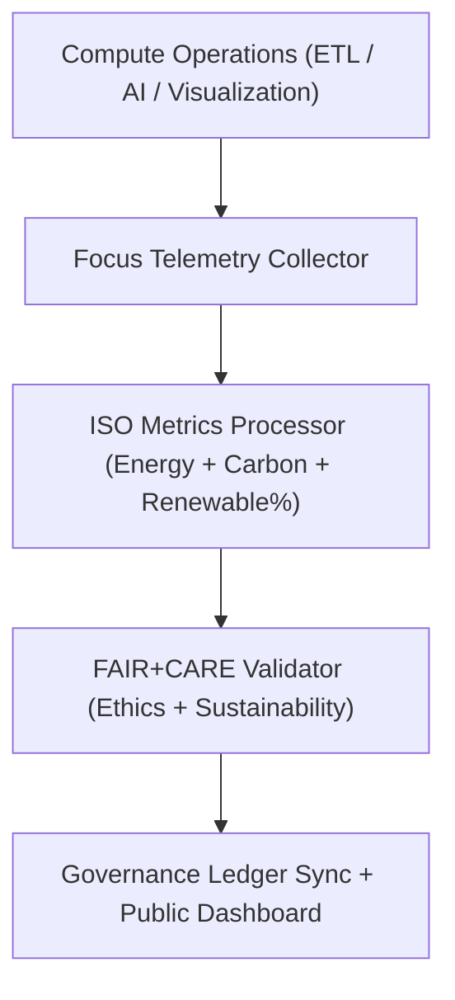
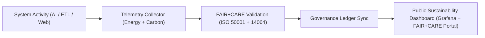

<div align="center">

# 🌿 **Kansas Frontier Matrix — Sustainability Monitoring & FAIR+CARE Environmental Telemetry Guide**
`docs/guides/telemetry/sustainability-monitoring.md`

**Purpose:**  
Define the **sustainability observability framework** for monitoring energy, carbon, and renewable sourcing metrics across all Kansas Frontier Matrix (KFM) systems.  
Ensures that environmental data is tracked continuously and validated under **FAIR+CARE**, **ISO 50001**, and **ISO 14064** standards.

[](../../README.md)
[](../../../LICENSE)
[](../../../docs/standards/README.md)
[](../../../releases/)
</div>

---

## 📘 Overview

The **Sustainability Monitoring Guide** defines how KFM captures, analyzes, and governs energy and carbon telemetry across AI, ETL, and visualization systems.  
By embedding environmental observability into the Focus Telemetry pipeline, all compute operations are monitored for **efficiency**, **sustainability**, and **ethical stewardship**.

**Key Objectives**
- Measure and track power and carbon metrics across workflows  
- Verify renewable energy utilization and efficiency gains  
- Report metrics to the FAIR+CARE Governance Ledger  
- Provide public transparency on system sustainability  

---

## 🗂️ Directory Context

```plaintext
docs/guides/telemetry/
├── README.md                              # Telemetry overview
├── sustainability-monitoring.md           # This document
├── focus-telemetry-architecture.md        # Core telemetry system
├── ai-telemetry-integration.md            # AI performance & energy telemetry
├── data-lineage-monitoring.md             # Provenance observability
└── reports/                               # Environmental and sustainability audit logs
```

---

## 🧩 Sustainability Telemetry Architecture



---

## ⚙️ Core Sustainability Metrics

| Metric | Description | Target | Unit | Validation |
|---------|--------------|---------|------|-------------|
| **Energy (J)** | Total energy used per workflow | ≤ 15 | Joules | `energy-monitor.yml` |
| **Carbon (gCO₂e)** | Emissions equivalent per operation | ≤ 0.006 | gCO₂e | `carbon-audit.yml` |
| **Renewable (%)** | Renewable power share per data center | ≥ 80 | % | `renewable-check.yml` |
| **Efficiency (%)** | Energy savings compared to baseline | ≥ 10 | % | `efficiency-validate.yml` |
| **FAIR+CARE Compliance (%)** | Ethical and sustainability validation rate | 100 | % | `faircare-validate.yml` |

---

## 🧾 Example Sustainability Telemetry Record

```json
{
  "telemetry_id": "sustainability-monitor-2025-11-09-0009",
  "component": "AI Focus Mode Inference Cluster",
  "metrics": {
    "energy_joules": 13.5,
    "carbon_gCO2e": 0.0054,
    "renewable_percent": 84,
    "efficiency_gain_percent": 11.8
  },
  "iso_standards": ["ISO 50001", "ISO 14064"],
  "faircare_status": "Pass",
  "auditor": "FAIR+CARE Council",
  "timestamp": "2025-11-09T12:35:00Z"
}
```

---

## ⚖️ FAIR+CARE Environmental Integration Matrix

| Principle | Implementation | Validation Artifact |
|------------|----------------|--------------------|
| **Findable** | Sustainability telemetry logs indexed by UUID | `focus-telemetry.json` |
| **Accessible** | Openly published sustainability metrics under CC-BY | `reports/sustainability/*.json` |
| **Interoperable** | JSON-LD schema integrates ISO + FAIR+CARE data | `telemetry_schema` |
| **Reusable** | Baseline metrics used for historical trend analysis | `manifest_ref` |
| **Collective Benefit** | Promotes open ecological accountability | FAIR+CARE audit |
| **Authority to Control** | FAIR+CARE Council validates renewable energy metrics | Governance Ledger |
| **Responsibility** | Continuous energy + carbon tracking at system level | `telemetry_ref` |
| **Ethics** | Ensures equitable data stewardship in sustainability decisions | `sustainability-compliance.md` |

---

## ⚙️ CI/CD Sustainability Workflows

| Workflow | Function | Output |
|-----------|-----------|--------|
| `energy-monitor.yml` | Captures and logs energy telemetry | `reports/sustainability/energy-metrics.json` |
| `carbon-audit.yml` | Converts energy metrics to CO₂ equivalent | `reports/sustainability/carbon-report.json` |
| `renewable-check.yml` | Validates renewable power usage | `reports/sustainability/renewable-energy-log.json` |
| `faircare-validate.yml` | Confirms FAIR+CARE environmental compliance | `reports/faircare/sustainability-audit.json` |
| `ledger-sync.yml` | Commits telemetry results to governance ledger | `docs/standards/governance/LEDGER/sustainability-ledger.json` |

---

## 🧩 Governance Ledger Example Record

```json
{
  "ledger_id": "sustainability-ledger-2025-11-09-0009",
  "system": "Visualization + ETL Cluster",
  "energy_joules": 46.2,
  "carbon_gCO2e": 0.0189,
  "renewable_percent": 85,
  "efficiency_gain_percent": 12.5,
  "faircare_status": "Pass",
  "auditor": "FAIR+CARE Council",
  "timestamp": "2025-11-09T12:50:00Z"
}
```

---

## 🧠 Sustainability Audit Example

```json
{
  "audit_id": "faircare-sustainability-2025-11-09-0003",
  "audited_components": ["AI Cluster", "ETL Hydrology", "Visualization Stack"],
  "average_energy_joules": 13.2,
  "average_carbon_gCO2e": 0.0057,
  "renewable_percent": 83,
  "efficiency_gain_percent": 10.6,
  "faircare_status": "Pass",
  "iso_alignment": ["ISO 50001", "ISO 14064"],
  "auditor": "FAIR+CARE Council",
  "timestamp": "2025-11-09T13:00:00Z"
}
```

---

## ⚙️ Sustainability Monitoring Flow



---

## ⚖️ Continuous Improvement Targets

| Objective | Target | Verification |
|------------|---------|---------------|
| **Reduce Energy per Workflow** | -15% annually | FAIR+CARE Telemetry Audit |
| **Maintain Carbon Neutrality** | 100% offset coverage | ISO 14064 reports |
| **Increase Renewable Power Use** | ≥ 90% by 2026 | Renewable energy logs |
| **Transparency Reports** | Quarterly public release | Governance Ledger |
| **Audit Success Rate** | 100% FAIR+CARE Pass | Council Review |

---

## 🕰️ Version History

| Version | Date | Author | Summary |
|----------|------|--------|----------|
| v10.0.0 | 2025-11-09 | Core Team | Added sustainability monitoring telemetry with ISO + FAIR+CARE environmental integration |
| v9.7.0  | 2025-11-03 | A. Barta | Introduced telemetry tracking for renewable energy and carbon reporting |

---

<div align="center">

© 2025 Kansas Frontier Matrix Project  
Master Coder Protocol v6.3 · FAIR+CARE Certified · Diamond⁹ Ω / Crown∞Ω Ultimate Certified  

[Back to Telemetry Guides](./README.md) · [Governance Charter](../../../docs/standards/governance/ROOT-GOVERNANCE.md)

</div>

