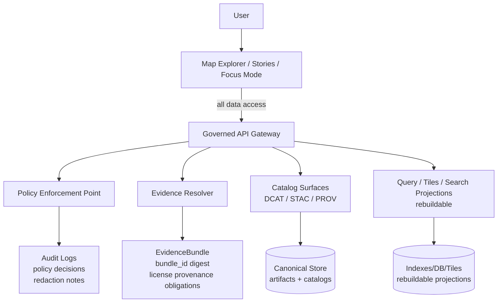

<!-- [KFM_META_BLOCK_V2]
doc_id: kfm://doc/7b0dbf50-2e0d-46ac-a243-72bff0262f55
title: 20 Map Patterns
type: standard
version: v1
status: draft
owners: kfm-ui
created: 2026-03-04
updated: 2026-03-04
policy_label: public
related:
  - kfm://doc/kfm-gdg-vnext
  - kfm://doc/kfm-architecture-governance-delivery-plan
  - kfm://doc/kfm-integration-idea-pack-latest-ideas-2026
tags: [kfm, ui, maps, patterns]
notes:
  - "Patterns emphasize the KFM invariants: trust membrane + evidence-first UX + cite-or-abstain."
  - "All implementation details are framed as requirements (CONFIRMED) vs suggested defaults (PROPOSED) vs unknowns (UNKNOWN)."
[/KFM_META_BLOCK_V2] -->

# 20 Map Patterns
Evidence-first UI patterns for **Map Explorer**, **Stories**, **Timeline**, and **Focus Mode**.

> **Status:** draft  
> **Owners:** `kfm-ui` (TODO: CODEOWNERS)  
> **Badges:**     
> **Quick nav:** [Scope](#scope) · [Where it fits](#where-it-fits) · [Non-negotiable invariants](#non-negotiable-invariants) · [Pattern index](#pattern-index) · [Patterns](#patterns) · [Definition of done](#definition-of-done) · [Appendix](#appendix)

---

## Scope
This guide defines **20 implementation patterns** for building KFM map/timeline UI surfaces so that:

- every user-visible layer/claim can be inspected as **evidence**,
- policy restrictions are **visible and testable** (not “hidden metadata”),
- map interactions are **reproducible artifacts** (map state is captured),
- Focus Mode is **cite-or-abstain**, with auditable receipts.

**CONFIRMED / PROPOSED / UNKNOWN discipline**
- **CONFIRMED** = a required invariant or explicitly-required trust surface.
- **PROPOSED** = a suggested default implementation that still respects invariants.
- **UNKNOWN** = needs verification in the actual repo / deployment.

---

## Where it fits
**Path:** `docs/guides/ui/20-map-patterns.md`

**Upstream (inputs):**
- KFM architecture + governance requirements (trust membrane, evidence resolver, promotion contract).
- API contracts (dataset_version_id, policy label, audit_ref, evidence resolution).
- Accessibility requirements for map controls and trust surfaces.

**Downstream (outputs):**
- Implementation tasks and acceptance criteria for `Map Explorer`, `Story Mode`, `Focus Mode`.
- Contract tests (OpenAPI/JSONSchema) + E2E checks (Playwright or equivalent).
- UI component specs that can be implemented in any stack.

---

## Acceptable inputs
- UI interaction patterns (map/timeline/story/chat).
- Component responsibilities and acceptance criteria.
- “Fail-closed” UX for policy and missing evidence.
- Minimal, testable data contracts (schemas) for UI ↔ governed API.

## Exclusions
- Not a full component library or design system spec.
- Not a MapLibre/Cesium tutorial (those are implementation choices).
- Not an API spec; this doc only states what UI must **require/expect** and how to test it.
- Not dataset-specific cartography rules (those belong in domain runbooks).

---

## Non-negotiable invariants
These are the “don’t ship without it” constraints.

| Invariant | Status | UI implication |
|---|---:|---|
| Trust membrane: UI never accesses DB/object storage directly; all access crosses governed API + policy boundary | **CONFIRMED** | No direct S3/DB URLs, no embedded privileged credentials, no “hidden” bypasses |
| Evidence-first UX: every layer and story claim can open an evidence view (bundle, license, provenance, checksums, redactions) | **CONFIRMED** (concept) | Evidence is a primary surface (not a footer link) |
| Cite-or-abstain Focus Mode: answers must cite resolvable evidence bundles or abstain/reduce scope | **CONFIRMED** | UX must gracefully support refusal/partial answers and include audit refs |
| Map state is a reproducible artifact (camera/layers/time/filters); Stories replay same state; Focus Mode can receive view_state hints | **CONFIRMED** | Deep-links/bookmarks and Story Nodes must store view state |
| Version clarity: UI must surface dataset_version_id and policy label in-view | **CONFIRMED** | Per-layer “version + policy badge” is not optional |

> IMPORTANT: If an implementation detail conflicts with these invariants, the detail is wrong — not the invariant.

---

## Architecture diagram


---

## Pattern index
Use this table to decide what to build next. Each pattern section includes: intent, UI behavior, minimal contract (PROPOSED), and tests.

> Legend: **Status** is the pattern’s governance maturity, not whether the code exists.

| # | Pattern | Status |
|---:|---|---|
| 1 | Governed Client Boundary (Trust Membrane UI Rules) | **CONFIRMED** |
| 2 | Evidence Drawer Everywhere | **CONFIRMED** (concept) |
| 3 | Layer Trust Card (version + policy + legend) | **CONFIRMED** |
| 4 | Map State as Artifact (deep link + replay) | **CONFIRMED** (concept) |
| 5 | Time Controls (range + histogram + availability) | **CONFIRMED** (concept) |
| 6 | Feature Inspect With EvidenceRefs | **CONFIRMED** (component) |
| 7 | Cite-or-Abstain Focus Mode UX (with audit_ref) | **CONFIRMED** |
| 8 | Policy Notices + Redaction Callouts | **CONFIRMED** |
| 9 | “What Changed?” DatasetVersion Diff Viewer | **CONFIRMED** (trust surface) |
| 10 | Automation Status Badges (health/degraded/failing) | **CONFIRMED** (trust surface) |
| 11 | Sensitive Location Protection (generalize, don’t hide) | **CONFIRMED** (requirement) |
| 12 | Tile-First Delivery for Large Layers (PMTiles/MVT) | **PROPOSED** (choice may vary) |
| 13 | Immutable Bundle Caching (keyed by digest + dataset_version_id) | **PROPOSED** |
| 14 | Policy-Safe Error Model (no existence leaks) | **CONFIRMED** (requirement) |
| 15 | Accessibility-First Map Controls | **CONFIRMED** |
| 16 | Search Across Place/Dataset/Story | **PROPOSED** |
| 17 | Compare Mode (side-by-side / swipe) | **PROPOSED** |
| 18 | Export as Evidence (reports include citations + audit_ref) | **PROPOSED** |
| 19 | Provenance Timeline Panel | **PROPOSED** |
| 20 | Saved Queries & Investigations (bridge to notebooks) | **PROPOSED** |

---

## Patterns

### 1) Governed Client Boundary
**Status:** CONFIRMED  
**Intent:** Make policy enforceable by ensuring the frontend cannot bypass the governed API boundary.

**UI behavior**
- The UI only loads:
  - governed API JSON responses,
  - policy-safe tiles/assets routed through the API boundary (or explicitly public static hosting, if allowed).
- The UI never:
  - embeds privileged credentials,
  - calls object storage URLs directly for restricted artifacts,
  - “discovers” restricted datasets via timing/error differences.

**Contract (PROPOSED)**
- Every API response that affects rendering returns:
  - `policy_label` (public-safe),
  - `dataset_version_id` when applicable.

**Tests**
- E2E proxy test: block all non-governed domains; app must still function for public layers.
- Static analysis: denylist of `s3://`, presigned URLs, or direct DB endpoints in frontend bundles.

[Back to top](#20-map-patterns)

---

### 2) Evidence Drawer Everywhere
**Status:** CONFIRMED (concept; implementation PROPOSED)  
**Intent:** A single “trust surface” used from Map, Stories, and Focus Mode.

**UI behavior**
- Evidence Drawer is reachable from:
  - layer panel (layer-level evidence),
  - feature inspect (feature-level evidence),
  - story citations (claim-level evidence),
  - Focus Mode citations (answer-level evidence).
- Drawer displays (minimum):
  - bundle digest/id,
  - dataset version,
  - license/attribution,
  - freshness + validation status,
  - provenance chain (run receipt),
  - redactions/obligations applied,
  - artifact links only if policy allows.

**Implementation notes (PROPOSED)**
- Implement `EvidenceDrawer` as a shared package with a strict props contract:
  - `evidenceRef: string`
  - `open: boolean`
  - `onClose(): void`

**Tests**
- E2E: click feature → Evidence Drawer opens → shows license + version → keyboard navigable.

[Back to top](#20-map-patterns)

---

### 3) Layer Trust Card
**Status:** CONFIRMED  
**Intent:** Every layer must show “what it is” and “why you can trust it” without leaving the map.

**UI behavior**
- Layer panel row includes:
  - layer name
  - dataset_version_id (human-friendly short form is OK)
  - policy badge (text + icon, not color only)
  - legend access
  - evidence drawer shortcut

**Contract (PROPOSED)**
```json
{
  "layer_id": "string",
  "title": "string",
  "dataset_version_id": "string",
  "policy_label": "public | restricted | ...",
  "legend_ref": "evidenceRef | url | null"
}
```

**Tests**
- Unit: layer list renders policy label as text.
- E2E: layer row includes dataset_version_id + policy badge.

[Back to top](#20-map-patterns)

---

### 4) Map State as Artifact
**Status:** CONFIRMED (concept)  
**Intent:** Treat map interaction state as reproducible data.

**UI behavior**
- Map state includes:
  - camera position (bbox/zoom/tilt if applicable),
  - active layers + style params,
  - time window,
  - filters.
- Story Nodes store map state; replays must match original.
- Focus Mode can accept `view_state` hints so answers are contextual.

**Contract (PROPOSED)**
```json
{
  "view_state": {
    "bbox": [minX, minY, maxX, maxY],
    "zoom": 8,
    "bearing": 0,
    "pitch": 0,
    "time": {"start": "ISO8601", "end": "ISO8601"},
    "layers": [{"layer_id": "x", "opacity": 0.7}],
    "filters": {"county": "Douglas"}
  }
}
```

**Tests**
- Snapshot: serialize/deserialize view_state yields the same UI state (within tolerances).
- Story replay test: open story node → map matches stored view_state.

[Back to top](#20-map-patterns)

---

### 5) Time Controls
**Status:** CONFIRMED (concept)  
**Intent:** Make time first-class without forcing a single time model on all layers.

**UI behavior**
- Provide:
  - time range slider (start/end),
  - histogram (event density) when possible,
  - per-layer temporal availability indicator (e.g., 1950–2024),
  - bookmarks for commonly used time windows.
- Support layers with:
  - event time,
  - valid time,
  - or both (do not conflate).

**Tests**
- Unit: time control updates query parameters consistently.
- E2E: switching a time window updates visible features and updates active layer availability indicator.

[Back to top](#20-map-patterns)

---

### 6) Feature Inspect With EvidenceRefs
**Status:** CONFIRMED (component)  
**Intent:** Clicking a feature should reveal attributes plus resolvable citations.

**UI behavior**
- Feature popup/side panel shows:
  - key attributes (policy-filtered),
  - citation list as EvidenceRefs,
  - one-click open Evidence Drawer per citation.

**Contract (PROPOSED)**
```json
{
  "feature": {"id": "string", "properties": {}},
  "citations": [{"label": "string", "evidence_ref": "string"}]
}
```

**Tests**
- E2E: click feature → inspect panel shows citations → clicking citation opens evidence drawer.

[Back to top](#20-map-patterns)

---

### 7) Cite-or-Abstain Focus Mode UX
**Status:** CONFIRMED  
**Intent:** Make the “hard gate” visible: either citations resolve, or the answer abstains/reduces scope.

**UI behavior**
- Focus Mode input supports optional `view_state` (from pattern #4).
- Output always includes:
  - citations (EvidenceRefs),
  - audit_ref,
  - policy notice if anything withheld.
- If citations cannot be verified:
  - response must abstain or reduce scope,
  - show “what’s missing” in policy-safe terms,
  - provide next steps (request access / try public alternative).

**Tests**
- Contract: Focus response schema requires `audit_ref` and ≥1 citation for non-abstaining answers.
- E2E: restricted query returns policy-safe refusal with audit_ref.

[Back to top](#20-map-patterns)

---

### 8) Policy Notices + Redaction Callouts
**Status:** CONFIRMED  
**Intent:** Users must understand why geometry/fields differ due to policy.

**UI behavior**
- Any generalized/redacted output must include a visible notice:
  - “Geometry generalized due to policy”
  - “Some attributes withheld”
- Notice must:
  - be accessible (screen readers),
  - not rely only on color,
  - link to Evidence Drawer for details.

**Tests**
- Unit: when obligations array is non-empty, UI renders a policy notice block.
- E2E: restricted dataset renders generalized output + notice.

[Back to top](#20-map-patterns)

---

### 9) “What Changed?” DatasetVersion Diff Viewer
**Status:** CONFIRMED (trust surface; implementation PROPOSED)  
**Intent:** Make updates inspectable and prevent “silent drift.”

**UI behavior**
- From any layer’s trust card, users can open a “What changed?” view comparing:
  - feature counts,
  - checksums/digests,
  - QA metrics,
  - coverage changes.

**Contract (PROPOSED)**
```json
{
  "from_dataset_version_id": "string",
  "to_dataset_version_id": "string",
  "summary": {
    "feature_count_delta": 123,
    "artifact_digest_changes": 2,
    "qa": {"completeness": {"from": 0.98, "to": 0.99}}
  }
}
```

**Tests**
- Integration: diff API denies by default for restricted versions unless user role allows.

[Back to top](#20-map-patterns)

---

### 10) Automation Status Badges
**Status:** CONFIRMED (trust surface; implementation PROPOSED)  
**Intent:** Surface pipeline health and lineage *on the map* without exposing secrets.

**UI behavior**
- Badges attach to:
  - layers (layer health),
  - or features (feature-specific freshness/health).
- Update model:
  - streaming first (SSE/WebSocket),
  - fallback polling (degraded mode).
- Degrade gracefully:
  - if attestation missing, show status but disable provenance link with explanation.

**Contract (PROPOSED)**
```ts
export type AutomationBadge = {
  featureId: string;
  status: "healthy" | "degraded" | "failing" | "running" | "unknown";
  last_run_ts: string; // RFC3339
  lineage: {
    run_id: string;
    backend: "openlineage" | "prov";
    links: {
      attestation?: string;
      sbom?: string;
      manifest?: string;
      logs?: string;
    };
  };
  extras?: Record<string, unknown>;
};
```

**Tests**
- Unit: schema validation on fixtures.
- E2E: badge renders within an acceptable latency budget; fallback polling works.

[Back to top](#20-map-patterns)

---

### 11) Sensitive Location Protection
**Status:** CONFIRMED  
**Intent:** Protect archaeology/species/culturally sensitive locations.

**UI behavior**
- Do **not** show “hidden points.” Instead:
  - show generalized representations (bins, H3 cells, heatmaps),
  - include explicit policy notice,
  - allow stewards to approve precise views for authorized roles only.

**Tests**
- Policy fixture: public role never receives precise coordinates for sensitive datasets.
- UI test: generalized mode includes “why” notice and Evidence Drawer access.

[Back to top](#20-map-patterns)

---

### 12) Tile-First Delivery for Large Layers
**Status:** PROPOSED (choice may vary)  
**Intent:** Prevent performance collapse by avoiding massive GeoJSON payloads.

**UI behavior**
- Prefer vector tiles (MVT) or PMTiles for large feature layers.
- Provide a small identify-on-click query endpoint for attributes/evidence.

**Tests**
- Performance budgets: interactive pan/zoom remains responsive at target zoom levels.
- Bundle size lint: block accidental “ship 50MB GeoJSON” regressions.

[Back to top](#20-map-patterns)

---

### 13) Immutable Bundle Caching
**Status:** PROPOSED  
**Intent:** Evidence bundles are immutable by digest; cache aggressively.

**UI behavior**
- Cache EvidenceBundle responses by:
  - `bundle_id` digest,
  - and `dataset_version_id` (for layer-level caches).
- Invalidate on version change, not on time.

**Tests**
- Unit: cache key includes dataset_version_id; prevents cross-version confusion.

[Back to top](#20-map-patterns)

---

### 14) Policy-Safe Error Model
**Status:** CONFIRMED  
**Intent:** Avoid “existence leaks” and ensure every failure is auditable.

**UI behavior**
- Errors display:
  - stable error code,
  - policy-safe message,
  - audit_ref,
  - remediation hint (optional).
- UI should not distinguish forbidden vs nonexistent in ways that leak sensitive existence.

**Tests**
- Contract: error model is stable and documented.
- Security: 403/404 behavior aligned with policy posture.

[Back to top](#20-map-patterns)

---

### 15) Accessibility-First Map Controls
**Status:** CONFIRMED  
**Intent:** Make the primary interface usable with keyboard and assistive tech.

**UI behavior**
- Keyboard navigable:
  - layer controls,
  - evidence drawer,
  - citations.
- Visible focus states.
- ARIA labels for map controls.
- Text labels for policy badges/status indicators (no color-only meaning).
- Safe markdown rendering (sanitize + CSP) for story narratives.

**Tests**
- Automated a11y checks for key pages.
- Manual keyboard traversal test checklist in CI (or release checklist).

[Back to top](#20-map-patterns)

---

### 16) Search Across Place/Dataset/Story
**Status:** PROPOSED  
**Intent:** One search entrypoint for discovery.

**UI behavior**
- Search can return:
  - places,
  - datasets (catalog),
  - story nodes,
  - entities (optional if graph search exists).
- Results show policy label and whether the user can open evidence.

**Tests**
- Policy filtering: restricted datasets don’t appear to unauthorized users.

[Back to top](#20-map-patterns)

---

### 17) Compare Mode
**Status:** PROPOSED  
**Intent:** Compare:
- dataset versions,
- alternate sources,
- or “then vs now” layers.

**UI behavior**
- Side-by-side map panes or swipe comparison.
- Both sides show:
  - dataset_version_id,
  - policy label,
  - evidence access.

**Tests**
- E2E: compare view preserves per-pane view_state and policy badges.

[Back to top](#20-map-patterns)

---

### 18) Export as Evidence
**Status:** PROPOSED  
**Intent:** Exports are not screenshots — they are auditable artifacts.

**UI behavior**
- Exports (PDF/Markdown/JSON) include:
  - citations (EvidenceRefs),
  - audit_ref,
  - dataset versions and licenses,
  - policy notices (if any).
- Exports must fail closed if citations don’t resolve.

**Tests**
- Export contract test: generated file contains audit_ref + citations list.

[Back to top](#20-map-patterns)

---

### 19) Provenance Timeline Panel
**Status:** PROPOSED  
**Intent:** A user-facing trace of ingestion → dataset versions → policy gates.

**UI behavior**
- Timeline shows:
  - ingestion points,
  - status,
  - commit SHA/run_id,
  - links to receipts and evidence bundles (policy-filtered).
- Detail drawer includes “who/when/why” fields if available.

**Tests**
- Policy posture: redacts sensitive audit fields appropriately.

[Back to top](#20-map-patterns)

---

### 20) Saved Queries & Investigations
**Status:** PROPOSED  
**Intent:** Bridge casual exploration to reproducible investigations.

**UI behavior**
- Saved query includes:
  - bbox/time + dataset filter,
  - dataset_version_ids,
  - EvidenceRefs.
- Investigations can be:
  - shared internally,
  - promoted to Story Nodes when safe,
  - governed with review state and policy labels.

**Tests**
- Saved query serialization is deterministic and includes dataset_version_id references.

[Back to top](#20-map-patterns)

---

## Definition of done
Use this checklist when implementing any of the above patterns.

- [ ] **Trust membrane:** frontend never accesses DB/object store directly; all access through governed API boundary.
- [ ] **Evidence surfaces:** Evidence Drawer available from layer, feature, story claim, and Focus Mode citation.
- [ ] **Version clarity:** dataset_version_id visible wherever a layer/claim is shown.
- [ ] **Policy clarity:** policy label and any obligations/redactions are visible and accessible.
- [ ] **Cite-or-abstain:** Focus Mode answers include resolvable citations or abstain with audit_ref.
- [ ] **Map state:** map view_state can be captured and replayed (Stories; share links).
- [ ] **Accessibility:** keyboard navigation + ARIA labels + no color-only meaning.
- [ ] **Testing:** schema/contract tests for UI payloads; E2E for evidence drawer + citation resolution.
- [ ] **Performance:** large layers are tile-first; no massive GeoJSON payloads shipped by default.

---

## Appendix

<details>
<summary>Proposed minimal shared types (UI ↔ API)</summary>

```ts
export type PolicyLabel =
  | "public"
  | "public_generalized"
  | "restricted"
  | "partner"
  | "internal"
  | "unknown";

export type EvidenceRef = string; // e.g., "stac://...", "dcat://...", "prov://...", "doc://..."

export type EvidenceBundle = {
  bundle_id: string; // digest-addressed, e.g., "sha256:..."
  dataset_version_id?: string;
  title?: string;
  policy: {
    decision: "allow" | "deny";
    policy_label: PolicyLabel;
    obligations_applied: string[];
  };
  license?: { spdx: string; attribution?: string };
  provenance?: { run_id?: string };
  artifacts?: Array<{ href: string; digest: string; media_type?: string }>;
  checks?: { catalog_valid?: boolean; links_ok?: boolean };
  audit_ref?: string;
};

export type ViewState = {
  bbox: [number, number, number, number];
  zoom: number;
  bearing?: number;
  pitch?: number;
  time?: { start: string; end: string };
  layers: Array<{ layer_id: string; opacity?: number; style?: Record<string, unknown> }>;
  filters?: Record<string, unknown>;
};
```

</details>

<details>
<summary>UNKNOWNS to verify in the real repo (smallest steps)</summary>

1. Confirm actual frontend stack + package manager (`npm`/`pnpm`/`yarn`) and existing test runners.
2. Confirm actual API route names and response fields (OpenAPI).
3. Confirm current policy label vocabulary and obligations model.
4. Confirm whether tiles are served dynamically or via prebuilt PMTiles for MVP.

</details>
