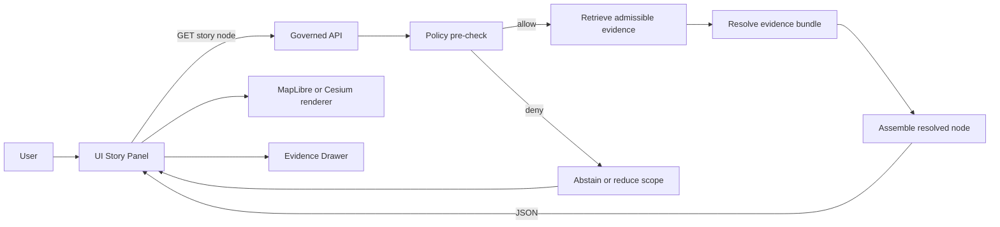
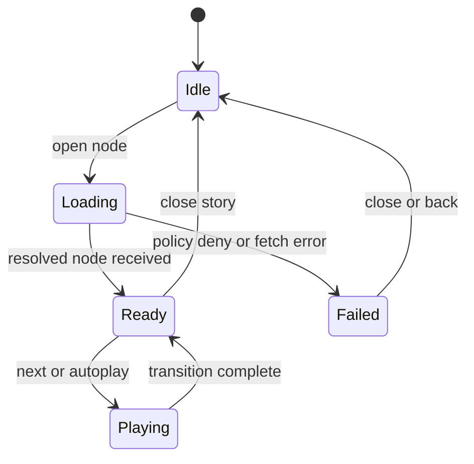

<!-- [KFM_META_BLOCK_V2]
doc_id: kfm://doc/6d2360b3-59b1-4f07-acde-8c9b3f1ad0c1
title: Story Nodes
type: standard
version: v1
status: draft
owners: ui-platform
created: 2026-03-04
updated: 2026-03-04
policy_label: public
related: [docs/guides/ui/, docs/guides/ui/20-focus-mode.md, docs/architecture/, docs/governance/ROOT_GOVERNANCE.md]
tags: [kfm, ui, story-nodes, maplibre, cesium, focus-mode, governance]
notes: [Guide for defining, validating, and rendering Story Nodes in the KFM UI without bypassing governed APIs.]
[/KFM_META_BLOCK_V2] -->

# Story Nodes
One-line purpose: A **Story Node** is a versioned, governed UI artifact that binds **narrative + map state + timeline state + evidence** into a reproducible step in a KFM story.

---

## Impact
**Status:** draft (implementation guide)  
**Owners:** `ui-platform`, `data-governance`, `story-editors`  
**Badges:**     
**Quick links:** [Scope](#scope) · [Concepts](#core-concepts) · [Contracts](#story-node-contracts) · [Workflow](#authoring-workflow) · [Validation](#validation-and-gates) · [Templates](#templates) · [FAQ](#faq)

---

## Scope

### In scope
- Defining what a Story Node is (and is not)
- A minimal, **versionable** contract for a Story Node (metadata + map/timeline directives + evidence refs)
- Rendering model in the UI that **does not bypass** governed APIs
- Validation gates (policy, provenance, accessibility) required before publication
- Patterns for 2D → 3D Story Nodes (MapLibre + Cesium)

### Out of scope
- Full Story authoring UI design (WYSIWYG editor, comments, review UI)
- Full schema definitions for STAC/DCAT/PROV (link out to standards instead)
- Any UI behavior that directly queries databases or LLMs

---

## Where it fits in the repo

**Path:** `docs/guides/ui/30-story-nodes.md`

### Upstream inputs
- Cataloged datasets + evidence bundles (STAC/DCAT/PROV and run receipts)
- Governed API endpoints that serve:
  - Story Node manifests and narrative content
  - Layer manifests / tileset manifests
  - Evidence bundles and citations
  - Focus Mode retrieval + synthesis responses (when Story Nodes request it)

### Downstream consumers
- React UI surfaces:
  - **Story** panel (narrative stepper)
  - **Map Explorer** (2D MapLibre)
  - **3D View** (Cesium, when enabled)
  - **Timeline** (time filters / scrubber)
  - **Evidence Drawer** (citations + provenance)

---

## Acceptable inputs

A Story Node artifact MAY include:
- A node manifest (JSON or YAML)
- Narrative markdown (human-readable text)
- Optional media (images, video, small glTF previews)
- References (not copies) to evidence bundles:
  - STAC Item/Collection IDs
  - DCAT dataset IDs
  - PROV run IDs / receipts
  - OCI artifact digests (if used for evidence packaging)

---

## Exclusions

A Story Node MUST NOT:
- Embed raw sensitive coordinates when policy requires masking/generalization
- Include data blobs as “proof” instead of referencing immutable artifacts
- Contain direct database credentials, API keys, or any secret
- Trigger the UI to call PostGIS/Neo4j/search/LLM directly (must go through governed APIs)

---

## Evidence discipline

This guide uses the labels below for claims:

- **[CONFIRMED]** Required by KFM architecture/governance docs already in the corpus.
- **[PROPOSED]** Recommended pattern (safe default) but may require repo alignment.
- **[UNKNOWN]** Not verifiable from available artifacts; includes a minimal verification step.

---

## Core concepts

### What is a Story Node?
A **Story Node** is a *single step* in a story that can be:
- navigated deterministically (next/previous/deeplink)
- rendered reproducibly (same inputs produce same view)
- audited (what evidence was shown, what policy allowed it)

A Story Node binds:
- **Narrative** (text for humans)
- **View state** (camera, layers, styling)
- **Time state** (timeline filters, date window)
- **Evidence** (citations + provenance references)

### Architecture invariants
- **[CONFIRMED]** The UI must only talk to the **governed API layer**, which orchestrates retrieval from PostGIS/Neo4j/search and LLM calls. The UI must not call DBs or models directly.  
- **[CONFIRMED]** Story/Focus outputs are “evidence-first”: user-visible claims must trace to immutable data and verified evidence under default-deny, fail-closed policy.

### Story Node types
Story Nodes can be classified by their primary interaction mode:

| Node type | Primary viewer | Typical use | Evidence expectation |
|---|---|---|---|
| Map Step (2D) | MapLibre | camera move + layer toggles | citations for narrative claims, layer provenance |
| Compare | MapLibre (split) | then/now, scenario A/B | citations for both sides, consistent extents |
| Data Inspector | MapLibre + side panel | show tables/attributes | strict provenance + schema refs |
| Focus Prompt | Story + Focus Mode | “ask a guided question” | citations in answer; abstain if missing |
| 3D Scene | Cesium | terrain/3D tiles reveal | provenance for tiles/terrain + narrative citations |

> **[PROPOSED]** Treat “3D Scene” as a Story Node mode (not a replacement of 2D), allowing a smooth 2D → 3D → 2D narrative handoff.

---

## Story Node contracts

### Contract goals
A Story Node contract should be:
- **Small**: easy to review and diff
- **Deterministic**: same manifest + same evidence bundle → same view
- **Governable**: policy label, sensitivity, allowed actions
- **Composable**: can be sequenced into stories

### Minimal Story Node manifest
> **[PROPOSED]** Use a single manifest file per node and keep it stable over time. Prefer JSON for tooling, YAML for authoring—either is acceptable if validation is enforced.

**Required fields**
- `id` (stable, URL-safe)
- `title`
- `version` (semver or date-tag)
- `status` (`draft|review|published|deprecated`)
- `owners` (GitHub handles or team)
- `policy_label` (`public|restricted|...`)
- `time` (either `point` or `[start,end]`)
- `view` (2D/3D directives)
- `evidence` (references, not blobs)

**Optional fields**
- `summary`
- `tags`
- `a11y` (alt text / captions expectations)
- `sensitivity` (masking rules, precision constraints)
- `telemetry` (events to emit)
- `focus_mode` (guided prompts)

### Manifest field matrix
| Field | Type | Required | Notes |
|---|---:|---:|---|
| `id` | string | ✅ | stable identifier for deeplinks |
| `version` | string | ✅ | bump on any behavior change |
| `policy_label` | string | ✅ | drives default-deny behavior |
| `time` | object | ✅ | `{start,end}` or `{datetime}` |
| `view.mode` | enum | ✅ | `map2d` or `scene3d` |
| `view.camera` | object | ✅ | center/zoom/bearing or Cesium camera |
| `layers` | array | ✅ | on/off + style preset refs |
| `evidence.refs` | array | ✅ | STAC/DCAT/PROV IDs, OCI digests |
| `narrative.href` | string | ✅ | relative link to markdown |
| `focus_mode.prompt` | string | ❌ | only for guided Q/A nodes |
| `sensitivity` | object | ❌ | coordinate precision + masking |

---

## Rendering and governance flow

### End-to-end flow
- **[CONFIRMED]** Story Node rendering must cross the **policy boundary** before data is shown.
- **[PROPOSED]** The UI should request a **resolved node** from the API (manifest + authorized layer/evidence links), rather than resolving raw refs client-side.



### What “resolved node” means
A resolved node is the only thing the UI needs to render:
- node metadata
- narrative (or link to narrative content)
- map/3D directives
- time window
- **authorized** layer endpoints/tiles URLs
- citations + provenance links for the Evidence Drawer

> **[PROPOSED]** The resolved node is where the API can enforce:
> - masking/generalization (precision downgrade)
> - link allowlists and CORS-safe proxying
> - “abstain” behavior when citations cannot be produced

---

## Authoring workflow

### Recommended lifecycle
1. **Draft**: author creates/edits manifest + narrative
2. **Local preview**: UI loads node from local assets (or dev API)
3. **Validation**: schema + policy + evidence checks
4. **Review**: narrative review + governance approval (if restricted)
5. **Publish**: node becomes discoverable in Story UI

### Minimal steps to create a new Story Node
> **[PROPOSED]** This file layout is recommended because it is easy to diff and test.

```
web/
  story_nodes/
    <node_id>/
      node.json        # manifest
      narrative.md     # narrative content
      assets/          # optional media
```

**Drafting checklist**
- Write the narrative first, then bind map state
- Prefer stable, named layer presets over inline styles
- Never embed evidence blobs; reference immutable artifacts

---

## Validation and gates

### Why gates exist
- **[CONFIRMED]** KFM defaults to deny and fails closed on missing evidence or policy violations.
- **[PROPOSED]** Story Nodes should be promotable only if they can be rendered with:
  - resolvable evidence refs
  - valid licenses/rights in the underlying catalogs
  - policy-compliant geometry precision

### Required validation gates
- **Schema gate**: manifest shape + enums + required fields
- **Evidence gate**: all `evidence.refs` resolve to admissible bundles
- **Citation gate**: narrative claims that assert facts must cite evidence (or explicitly abstain)
- **Policy gate**: OPA/Conftest pass for:
  - policy label correctness
  - restricted data handling rules
  - no forbidden links/origins
- **A11y gate**: narrative headings, images have alt text, keyboard navigation supported
- **UI gate**: a smoke test that loads the node and asserts render completion

### Definition of done
- [ ] Manifest validates against schema
- [ ] Narrative renders in UI and passes markdown lint
- [ ] All evidence references resolve; no broken links
- [ ] Evidence Drawer shows citations (or abstains with reason)
- [ ] No sensitive precision leaks (masking confirmed when required)
- [ ] Works in 2D and (if applicable) 3D mode
- [ ] Basic a11y checks pass (headings, alt text, focus order)
- [ ] E2E test recorded (Playwright or equivalent)

---

## 2D ↔ 3D Story Nodes

### Recommended approach
- **[PROPOSED]** Use a hybrid viewer model:
  - MapLibre remains the primary 2D exploration surface
  - Cesium is a Story Node mode for 3D scenes, not a global replacement

### 3D readiness constraints
A 3D Story Node should declare:
- what 3D assets are used (terrain, 3D tiles, extrusions)
- what LOD/tileset URLs are authorized
- fallbacks:
  - poster image
  - 2D equivalent view
  - “3D unavailable” banner

---

## Safety and sensitivity

### Coordinate precision rules
- **[CONFIRMED]** If governance requires masking/generalization, Story Nodes must not expose higher precision in UI than allowed.
- **[PROPOSED]** Enforce masking at the API “resolved node” boundary:
  - round coordinates
  - generalize geometry
  - clamp zoom levels
  - remove per-feature identifiers when necessary

### External links and embeds
- **[PROPOSED]** No direct browser fetch of untrusted provenance/attestation URLs; proxy via server that:
  - verifies signatures
  - strips secrets
  - enforces allowlists

---

## Implementation notes

### UI state model
> **[PROPOSED]** Treat Story playback as a state machine so transitions are testable.



### Telemetry
- **[PROPOSED]** Emit PII-free UI events:
  - `kfm.ui.story.node_opened`
  - `kfm.ui.story.node_rendered`
  - `kfm.ui.story.node_abstained`
  - `kfm.ui.story.evidence_opened`

---

## Templates

<details>
<summary>Story Node manifest template (YAML)</summary>

```yaml
id: kansas-from-above
title: "Kansas From Above"
version: "0.1.0"
status: draft
owners: ["@ui-platform", "@story-editors"]
policy_label: public
tags: ["3d", "terrain", "intro"]

time:
  start: "1860-01-01T00:00:00Z"
  end: "1870-01-01T00:00:00Z"

narrative:
  href: "./narrative.md"

view:
  mode: scene3d     # map2d | scene3d
  camera:
    # map2d example: {center:[-98.0, 38.5], zoom: 6.0, bearing: 0, pitch: 0}
    # scene3d example:
    destination: [-98.0, 38.5, 250000.0]   # lon, lat, meters (policy may clamp/round)
    heading: 0
    pitch: -35
    roll: 0

layers:
  - id: terrain
    enabled: true
    ref: "layer:terrain/dem@v11"
  - id: boundaries_county
    enabled: true
    ref: "layer:boundaries/counties@v1"
    style_ref: "style:boundaries/default@v1"

evidence:
  refs:
    - "stac:terrain/dem"
    - "stac:boundaries/counties"
    - "prov:run:2026-01-06T00:00:00Z"
  citations_required: true

sensitivity:
  max_coordinate_precision_decimals: 2
  max_zoom: 10
  masking_mode: "round"
```

</details>

<details>
<summary>Narrative template (Markdown)</summary>

```md
# Kansas From Above

## What you are looking at
Explain the scene in neutral, descriptive terms.

## Evidence
- Cite the datasets shown (STAC/DCAT IDs) and any derived artifacts.
- Avoid interpretive claims without citations.

## What to try next
- Use the timeline to scrub between <start> and <end>.
- Open the Evidence Drawer to inspect provenance.
```

</details>

---

## FAQ

### Do Story Nodes contain data?
No. Story Nodes contain **references** to governed evidence (datasets, runs, tilesets). If you paste raw data into a Story Node, you break provenance and make review impossible.

### Can a Story Node call Focus Mode?
**[PROPOSED]** Yes, but only as a guided prompt routed through governed APIs. If citations can’t be produced, the node must abstain (or show a reduced-scope response).

### How do we prevent “cool demos” from bypassing governance?
Make the “resolved node” API and policy gates the only supported render path. If the UI can’t render without policy-approved links, it can’t bypass.

---

## Appendix: Verification steps for UNKNOWNs

- **[UNKNOWN] Repo layout for `web/story_nodes/`**  
  Verify by listing the `web/` directory tree and searching for “story_nodes” paths.

- **[UNKNOWN] Current API routes for story node resolution**  
  Verify by inspecting the API OpenAPI schema and searching for `story` or `story_nodes` endpoints.

- **[UNKNOWN] Current policy bundles for Story content**  
  Verify by searching `policies/` (or equivalent) for Story Node rules and Conftest fixtures.

---

## Back to top
[Back to top](#story-nodes)
