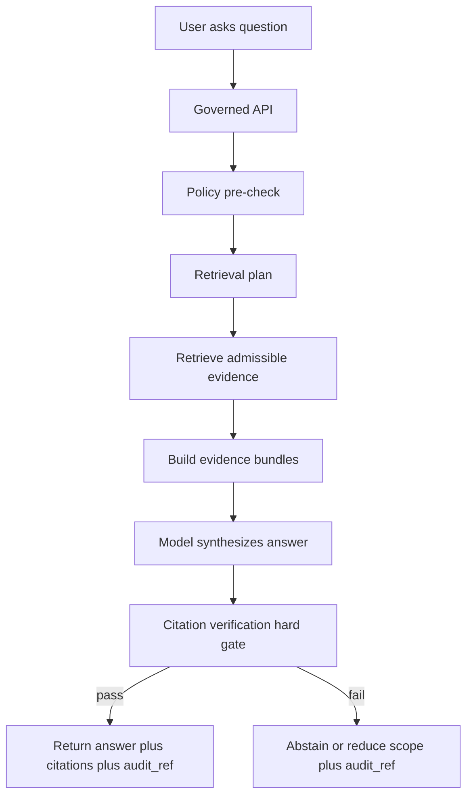
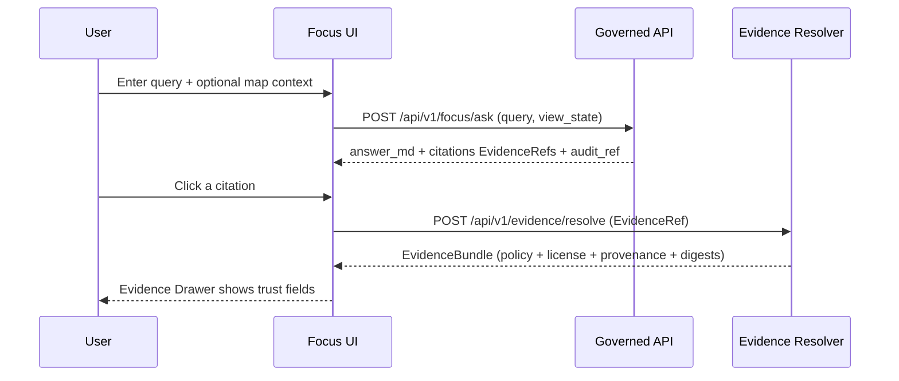

<!-- [KFM_META_BLOCK_V2]
doc_id: kfm://doc/8f3c2d66-8f7b-4c1a-9d3b-4a6e0c1c2a0f
title: Focus Mode UI
type: standard
version: v1
status: draft
owners: TBD
created: 2026-03-04
updated: 2026-03-04
policy_label: public
related: [
  "kfm://concept/trust-membrane",
  "kfm://concept/evidence-resolver",
  "kfm://api/POST-/api/v1/focus/ask",
  "kfm://api/POST-/api/v1/evidence/resolve"
]
tags: [kfm, ui, focus-mode, evidence, governance]
notes: [
  "This guide specifies UI behavior for Focus Mode under KFM governance.",
  "All requirements are tagged CONFIRMED / PROPOSED / UNKNOWN per KFM evidence discipline."
]
[/KFM_META_BLOCK_V2] -->

# Focus Mode UI
Evidence-led Q&A that **must cite resolvable evidence** or **abstain**, and always returns an **audit reference**.

> **IMPACT (required)**  
> **Status:** draft · **Owners:** TBD · **Policy posture:** default-deny, fail-closed · **Last updated:** 2026-03-04  
> **Shields (placeholders):**  
> [](#)  
> [](#focus-mode-ui)  
> [](#ux-contract)  
> [](#accessibility-requirements)

**Quick nav:**  
- [Scope](#scope)  
- [Where it fits](#where-it-fits)  
- [Status tags](#status-tags)  
- [Core concepts](#core-concepts)  
- [UX contract](#ux-contract)  
- [API contract](#api-contract)  
- [UI implementation guide](#ui-implementation-guide)  
- [Abstention and partial answers](#abstention-and-partial-answers)  
- [Security and safety](#security-and-safety)  
- [Telemetry and auditability](#telemetry-and-auditability)  
- [Testing and evaluation harness](#testing-and-evaluation-harness)  
- [Definition of done](#definition-of-done)  
- [FAQ](#faq)  
- [Appendix](#appendix)

---

## Scope

### In scope
- **[CONFIRMED]** A Focus Mode request is treated as a *governed run* with a receipt (audit reference).  
- **[CONFIRMED]** The UI receives: answer text, citations (EvidenceRefs), and `audit_ref`.  
- **[CONFIRMED]** Citations must resolve to policy-allowed **EvidenceBundles**; otherwise the system abstains or reduces scope.  
- **[CONFIRMED]** Focus Mode UX must clearly support abstention and partial answers (policy-safe explanations + audit_ref follow-up).  
- **[PROPOSED]** Concrete UI components and state management patterns (React/TypeScript examples) that implement the above.  
- **[PROPOSED]** UI event/telemetry payload shapes aligned to the runtime audit model.

### Out of scope
- **[CONFIRMED]** Direct calls from UI to databases, object storage, or model runtimes (disallowed by trust membrane).  
- **[PROPOSED]** Full backend implementation details (FastAPI/GraphQL, PostGIS/Neo4j/search), except where needed to define client/server contracts.  
- **[PROPOSED]** Full policy authoring (OPA/Rego) beyond the minimum UI-visible policy fields.

---

## Where it fits

### System positioning
- **[CONFIRMED]** Focus Mode is one of the primary UI “trust surfaces,” alongside Map Explorer, Timeline, Stories, Catalog, and Steward tools.  
- **[CONFIRMED]** UI calls the governed API; the API orchestrates retrieval and delegates generation to the model runtime; the UI never calls the model directly.  
- **[CONFIRMED]** Evidence resolution is central: UI citations are **EvidenceRefs** that must be resolvable to **EvidenceBundles** via the evidence resolver endpoint.  

### Trust path and membrane (UI view)
- **[CONFIRMED]** All client access crosses a policy + evidence boundary (trust membrane).  
- **[PROPOSED]** UI surfaces trust via: dataset version, freshness, license, policy label/badges, and “one click” access to evidence & provenance panels.



_Back to top: [Focus Mode UI](#focus-mode-ui)_

---

## Status tags

Use these tags on requirements and claims:

- **[CONFIRMED]** Supported by a KFM governing/design source and treated as an invariant or defined behavior.
- **[PROPOSED]** A recommended implementation choice, UI pattern, or file layout that is consistent with confirmed requirements.
- **[UNKNOWN]** Not evidenced yet; includes *smallest verification steps* to confirm.

---

## Core concepts

### Vocabulary (UI-facing)

| Term | Definition (UI-facing) | UI must show? | Status |
|------|-------------------------|---------------|--------|
| EvidenceRef | Opaque reference to a specific piece of admissible evidence. | Yes (as citation) | **[CONFIRMED]** |
| EvidenceBundle | Resolved evidence “card”: title, dataset version id, license, provenance run id, artifact digests, policy decision, audit ref. | Yes (drawer/panel) | **[CONFIRMED]** |
| Policy label | Coarse classification used for access control and obligations (e.g., public vs restricted). | Yes (badge) | **[CONFIRMED]** |
| Obligations | Required transformations like redaction/generalization. | Yes (badge + explanation) | **[CONFIRMED]** |
| audit_ref | Identifier for the Focus Mode run receipt (reviewable). | Yes (always) | **[CONFIRMED]** |
| view_state | Optional client context: bbox, time window, active layers, story context. | Yes (user-visible summary) | **[CONFIRMED]** |

### Evidence bundle minimum fields (UI expectations)
- **[CONFIRMED]** Bundle includes: `bundle_id`, `dataset_version_id`, `title`, `policy` decision + label + obligations applied, `license` (SPDX + attribution), `provenance` run id, `artifacts` with digests/media types, and an `audit_ref`.  

_Back to top: [Focus Mode UI](#focus-mode-ui)_

---

## UX contract

### Primary UX requirements
- **[CONFIRMED]** “Cite or abstain” is the core user promise: factual claims must be supported by resolvable citations, or the answer must abstain/reduce scope.  
- **[CONFIRMED]** Citation verification is a *hard gate* (no “best effort citations” in final UI).  
- **[CONFIRMED]** Focus Mode always returns `audit_ref` for follow-up and review.  
- **[CONFIRMED]** Evidence access should be low-friction (goal: usable in ≤2 API calls from the UI).  
- **[CONFIRMED]** Trust surfaces must show: dataset version, freshness (if available), license, and policy indicators.  
- **[PROPOSED]** Reuse a shared “Evidence Drawer” component across Map Explorer, Stories, and Focus Mode.

### UX patterns (recommended)
- **[PROPOSED]** Split the message bubble into:
  1) answer content (rendered as safe Markdown),
  2) citation block (compact),
  3) run footer (audit_ref + latency + model/version badge if policy allows).

### Citation block minimum (Focus Mode “citation handshake”)
- **[CONFIRMED]** Citations should include dataset identifiers (e.g., DOI/provider key) and resolvable DCAT/STAC links where available.  
- **[CONFIRMED]** If coordinates were generalized, the UI must surface CARE/privacy/sensitivity cues (permission badge + generalization note).  

_Back to top: [Focus Mode UI](#focus-mode-ui)_

---

## API contract

### Confirmed endpoints (governed surface)
- **[CONFIRMED]** `POST /api/v1/focus/ask` — Focus Mode Q&A; must cite or abstain; logs retrieval context.  
- **[CONFIRMED]** `POST /api/v1/evidence/resolve` — Resolve EvidenceRef → EvidenceBundle; fail closed if unresolvable/unauthorized.

> **[PROPOSED]** UI should treat endpoint shapes as versioned contracts, validated by JSON schema in CI.

### Request and response shapes (UI DTOs)

> **Note:** Concrete DTO field names are **[PROPOSED]**, but required *semantics* are **[CONFIRMED]**.

```json
{
  "query": "When did major floods occur in Kansas and what evidence supports it?",
  "view_state": {
    "bbox": [-102.05, 36.99, -94.59, 40.00],
    "time": {"from": "1930-01-01", "to": "1960-12-31"},
    "active_layers": ["hazards.floods", "hydrology.streams"]
  }
}
```

```json
{
  "answer_md": "…markdown answer…",
  "citations": [
    {"ref": "kfm://evidence/stac-item/…"},
    {"ref": "kfm://evidence/doc/…"}
  ],
  "audit_ref": "kfm://audit/entry/123"
}
```

### TypeScript contract sketch (client)
```ts
// [PROPOSED] Keep EvidenceRef opaque to the UI.
export type EvidenceRef = { ref: string };

export type ViewState = {
  bbox?: [number, number, number, number];
  time?: { from?: string; to?: string };
  active_layers?: string[];
  story_id?: string;
};

export type FocusAskRequest = {
  query: string;
  view_state?: ViewState;
};

export type FocusAskResponse = {
  answer_md: string;
  citations: EvidenceRef[];
  audit_ref: string;
  // [PROPOSED] Optional: policy summary for UX (do not leak restricted internals).
  policy_notice?: { decision: "allow" | "deny" | "partial"; reason_code?: string };
};

// [CONFIRMED semantics] Evidence bundles include policy + license + provenance + digests.
export type EvidenceBundle = {
  bundle_id: string;
  dataset_version_id: string;
  title: string;
  policy: { decision: "allow" | "deny"; policy_label: string; obligations_applied: string[] };
  license: { spdx: string; attribution?: string };
  provenance: { run_id: string };
  artifacts: Array<{ href: string; digest: string; media_type: string }>;
  checks?: { catalog_valid?: boolean; links_ok?: boolean };
  audit_ref: string;
};
```

_Back to top: [Focus Mode UI](#focus-mode-ui)_

---

## UI implementation guide

### Recommended component map
- **[PROPOSED]** `FocusModePanel`
  - owns request lifecycle + optimistic UI
- **[PROPOSED]** `FocusMessageList`
  - renders messages; virtualized if needed
- **[PROPOSED]** `FocusAnswerBubble`
  - renders safe Markdown + citations + run footer
- **[PROPOSED]** `CitationsBlock`
  - compact list of EvidenceRefs; expands to resolve bundles
- **[PROPOSED]** `EvidenceDrawer` (shared)
  - resolves EvidenceRef → EvidenceBundle and displays license/provenance/digests
- **[PROPOSED]** `ViewStateChip`
  - shows bbox/time/layers snapshot sent with the question
- **[PROPOSED]** `AbstentionNotice`
  - renders deny/partial UX

### Component responsibility matrix

| Component | Responsibility | Status |
|----------|----------------|--------|
| FocusModePanel | Submit question, attach `view_state`, handle loading/errors, store `audit_ref` | **[PROPOSED]** |
| CitationsBlock | Display citations; open EvidenceDrawer with resolved EvidenceBundle | **[PROPOSED]** |
| EvidenceDrawer | Show EvidenceBundle trust fields: policy, license, provenance, digests | **[CONFIRMED]** |
| ViewStateChip | Make context explicit to user (bbox/time/layers) | **[CONFIRMED]** |
| AbstentionNotice | Clear abstention UX: what is missing, what is allowed, how to request access, include audit_ref | **[CONFIRMED]** |

### Data flow (UI sequence)


### Minimal React fetch pattern (client)

```ts
// [PROPOSED] Keep client behavior deterministic and testable.
export async function focusAsk(
  req: FocusAskRequest,
  signal?: AbortSignal
): Promise<FocusAskResponse> {
  const r = await fetch("/api/v1/focus/ask", {
    method: "POST",
    headers: { "Content-Type": "application/json" },
    body: JSON.stringify(req),
    signal
  });

  if (!r.ok) {
    // [CONFIRMED] Fail closed in UI: do not “invent” an answer.
    throw new Error(`Focus ask failed: ${r.status}`);
  }

  return (await r.json()) as FocusAskResponse;
}
```

### Rendering rules (safe-by-default)
- **[CONFIRMED]** Treat all returned text as untrusted; render Markdown with a sanitizer and an allowlist (no raw HTML).  
- **[PROPOSED]** Disallow link schemes other than `https:` and approved internal `kfm://` pseudo-links (if used).

_Back to top: [Focus Mode UI](#focus-mode-ui)_

---

## Abstention and partial answers

### Required behaviors
- **[CONFIRMED]** Abstention UX must explain, in policy-safe terms:
  - what is missing,
  - what is allowed (public alternatives),
  - how to request access (steward review workflow),
  - and always include `audit_ref`.  
- **[CONFIRMED]** Partial answers are acceptable when only part of the question is supported by evidence.

### Recommended UI copy (templates)
- **[PROPOSED]** *Partial answer header:* “Some parts of your question can’t be answered with available evidence under your access level.”  
- **[PROPOSED]** *Action:* “Try narrowing the time range, selecting a specific layer, or requesting access.”

_Back to top: [Focus Mode UI](#focus-mode-ui)_

---

## Security and safety

### Threats to handle
- **[CONFIRMED]** Prompt injection from retrieved documents and data exfiltration attempts must be resisted.  
- **[CONFIRMED]** Evidence resolver is the only acceptable “truth” mechanism for citations (no raw index text without evidence linking).  

### UI guardrails
- **[CONFIRMED]** Do not display restricted dataset inventories, restricted policy reasoning internals, or raw “denied” evidence content.  
- **[PROPOSED]** Add a “report unsafe output” affordance that includes `audit_ref` and minimal redacted context.  
- **[PROPOSED]** Cache with care: do not persist answers/citations to localStorage by default; prefer in-memory session state unless governance explicitly permits.

_Back to top: [Focus Mode UI](#focus-mode-ui)_

---

## Telemetry and auditability

### Required telemetry surfaces
- **[CONFIRMED]** Each Focus Mode query must surface `audit_ref` to the user.  
- **[CONFIRMED]** Run receipts must capture inputs/outputs by digest, validation results, policy decisions, and environment/model versions (as allowed).  

### UI event logging (recommended)
- **[PROPOSED]** Emit client events (non-sensitive) like:
  - `focus.ask.submitted`
  - `focus.ask.succeeded`
  - `focus.ask.abstained`
  - `focus.citation.opened`
  - `focus.evidence.resolved`
- **[PROPOSED]** Ensure event payloads never include restricted coordinates or restricted evidence text.

_Back to top: [Focus Mode UI](#focus-mode-ui)_

---

## Testing and evaluation harness

### Must-have test gates
- **[CONFIRMED]** Focus Mode evaluation harness must exist before broad release, including:
  - citation coverage (percent of factual claims supported),
  - citation resolvability (100% resolve for allowed users),
  - refusal correctness (restricted questions get policy-safe refusals),
  - sensitivity leakage tests,
  - regression tests with golden queries.  

### UI-specific test plan
- **[PROPOSED]** Unit tests:
  - renders abstention notice with `audit_ref`
  - citations list renders and opens drawer
- **[PROPOSED]** Integration/e2e tests:
  - end-to-end focus ask with stub server returning citations
  - evidence resolve call populates drawer fields (license/provenance/digests)
- **[PROPOSED]** Accessibility tests:
  - keyboard navigation from answer to citations to drawer and back
  - screen reader labels for policy badges and obligations

_Back to top: [Focus Mode UI](#focus-mode-ui)_

---

## Definition of done

### Engineering gates (UI)
- [ ] **[CONFIRMED]** UI never calls model runtime directly; uses governed API only.
- [ ] **[CONFIRMED]** Every answer displays citations (or abstention) and always shows `audit_ref`.
- [ ] **[CONFIRMED]** Citation verification is enforced server-side; UI treats missing/invalid citations as failure and shows abstention/partial UX.
- [ ] **[CONFIRMED]** Evidence drawer shows: dataset version, license (SPDX + attribution), provenance run id, and artifact digests.
- [ ] **[PROPOSED]** A11y: keyboard and screen-reader flow passes WCAG 2.1 AA checks for Focus Mode.
- [ ] **[CONFIRMED]** E2E test: ask → answer → open citation → evidence drawer renders trust fields.
- [ ] **[CONFIRMED]** CI includes Focus Mode evaluation harness; merges blocked on regression.

---

## FAQ

**Why can’t Focus Mode “just answer” when citations are missing?**  
- **[CONFIRMED]** Because the core anti-hallucination mechanism is the hard citation verification gate; without verified citations the system must abstain or reduce scope.

**Why do citations open an evidence drawer instead of linking to raw text?**  
- **[CONFIRMED]** Because citations must resolve to EvidenceBundles that include policy decisions, license, provenance, and digests; raw text without evidence linking is not allowed.

**Can Focus Mode show restricted data if the user asks nicely?**  
- **[CONFIRMED]** No. Policy decisions are enforced before evidence is shown; UI should not provide bypass routes.

---

## Appendix

<details>
<summary>Appendix A — Suggested empty states and error states</summary>

- **[PROPOSED]** Empty: “Ask a question about what you’re viewing on the map. Add a time window for tighter results.”
- **[PROPOSED]** Network error: “Couldn’t reach the governed API. No answer was generated. Try again.”
- **[PROPOSED]** Abstain: “I can’t answer that with available evidence under your access level. Audit: {audit_ref}”

</details>

<details>
<summary>Appendix B — Unknowns to verify (make CONFIRMED)</summary>

- **[UNKNOWN]** Exact DTO field names for `/api/v1/focus/ask` and `/api/v1/evidence/resolve`.  
  Smallest steps:
  1) Locate OpenAPI spec or route handlers and extract schemas.
  2) Pin `focus_response_v1.schema.json` (if present) and reference it from UI types.

- **[UNKNOWN]** Canonical UI component paths in the repo (apps structure).  
  Smallest steps:
  1) Inspect repo `apps/` tree and identify UI package.
  2) Add `FocusModePanel` and `EvidenceDrawer` under an agreed UI feature directory with CODEOWNERS.

</details>

---

**Back to top:** [Focus Mode UI](#focus-mode-ui)
