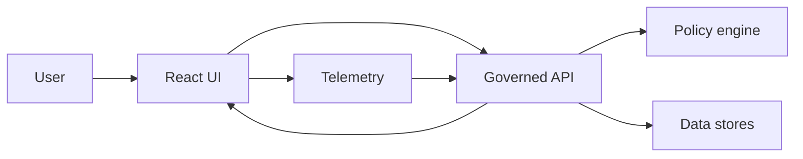

<!-- [KFM_META_BLOCK_V2]
doc_id: kfm://doc/6a8b0c08-3f7b-4e24-97d4-7d3c0b43d5a1
title: UI Performance Guide
type: standard
version: v1
status: draft
owners: ui-platform (TBD)
created: 2026-03-04
updated: 2026-03-04
policy_label: public
related: []
tags: [kfm, ui, performance, maplibre, cesium, budgets, observability]
notes:
  - Evidence discipline: key statements are tagged CONFIRMED / PROPOSED / UNKNOWN.
  - This guide is intentionally UI-scoped; backend/pipeline tuning lives elsewhere.
[/KFM_META_BLOCK_V2] -->

# UI Performance
One-line purpose: Define measurable performance budgets + guardrails for the KFM React UI (MapLibre + Cesium + Story + Focus), and the workflow to prevent regressions.

---

## Impact
**Status:** experimental  
**Owners:** ui-platform (TBD)  
**Last updated:** 2026-03-04  
**Applies to:** `web/` (React/TypeScript), MapLibre 2D map, Cesium 3D globe, Story viewer, Focus Mode panel


**Quick nav:**  
- [Scope](#scope)  
- [Where it fits](#where-it-fits)  
- [Inputs](#inputs)  
- [Exclusions](#exclusions)  
- [Principles](#principles)  
- [Budgets](#performance-budgets)  
- [Instrumentation](#instrumentation-and-observability)  
- [Optimization playbook](#optimization-playbook)  
- [CI gates](#ci-performance-gates)  
- [Runbook](#performance-regression-runbook)  
- [Checklist](#definition-of-done)  
- [FAQ](#faq)  

---

## Scope
**CONFIRMED:** KFM UI is a “pure UI” layer: it renders map/timeline/chat but does **not** call databases or the LLM directly; it talks to a governed API that enforces policy and auditing.  
**PROPOSED:** This doc defines UI-facing budgets and *how to enforce them* (CI + telemetry), not just “tips.”

This guide covers:
- React runtime performance (renders, state, concurrency, code splitting).
- Map performance (MapLibre and Cesium integration patterns).
- Network + caching as experienced by the browser (payloads, streaming, retries).
- UI telemetry (RUM, synthetic tests) and performance regression gates.

---

## Where it fits
Path: `docs/guides/ui/60-performance.md`

**Upstream dependencies (conceptual):**
- Governed API contracts (including policy filtering and evidence resolution).
- Tile service / dataset delivery formats (vector tiles, PMTiles, 3D tiles).

**Downstream consumers:**
- UI engineers implementing Map Explorer, Story viewer, Focus Mode.
- CI maintainers enforcing performance budgets.
- Platform/SRE using UI telemetry to diagnose incidents.

---

## Inputs
Acceptable inputs for this guide:
- UI components and routes owned by `web/` (React/TypeScript).
- Map integrations (MapLibre GL JS, CesiumJS).
- API endpoints and response shapes *as consumed by the UI*.
- Telemetry definitions (events/metrics), including correlation IDs.

---

## Exclusions
This guide does **not** cover:
- Backend query tuning (PostGIS/Neo4j/search) beyond “how to measure impact from UI.”
- Pipeline performance (ingest/ETL) beyond “surface pipeline health in UI.”
- Cartographic design (symbology, labeling aesthetics) beyond “performance-safe defaults.”

---

## Principles
### Trust membrane first
**CONFIRMED:** UI must consume only API responses and must not bypass governance (no direct DB/object-store reads; no direct LLM calls).  
**PROPOSED:** Treat “UI performance” as part of governance: slow UI is a reliability risk and a trust risk (users abandon evidence drawers, fail to see provenance, etc.).

### Budget-driven engineering
**PROPOSED:** Every UI change that can affect performance must declare:
1) which budget(s) it could impact,  
2) how it is measured, and  
3) what the rollback plan is if it regresses.

### Measure before you optimize
**PROPOSED:** Optimization without measurement is a policy violation in spirit (non-auditable change). The minimum acceptable evidence is a before/after trace or budget report.

---

## Performance budgets

> Budgets are **targets**, not promises. Use them as CI thresholds and as “stop-the-line” regression alarms.

### Web vitals budgets (page-level)
**CONFIRMED:** Core Web Vitals commonly used in the industry are LCP, INP, and CLS, each with “good / needs improvement / poor” threshold buckets.  
**PROPOSED:** KFM UI should meet “good” thresholds on representative devices for its “public experience” routes.

| Metric | What it means | Budget target | How to measure |
|---|---|---:|---|
| LCP | Largest content paint (loading experience) | **≤ 2.5s (p75)** | RUM + Lighthouse CI |
| INP | Responsiveness (worst interaction in a visit) | **≤ 200ms (p75)** | RUM field data |
| CLS | Visual stability | **< 0.1 (p75)** | RUM + Lighthouse CI |

**UNKNOWN:** KFM’s route-by-route “representative device” set (CPU/RAM/network) is not yet codified.  
Smallest verification step: add a `docs/ops/perf-test-matrix.md` listing device classes + throttling presets used in CI.

### Interaction budgets (map + UI)
| Interaction | Budget target | Notes |
|---|---:|---|
| Layer toggle on/off | **< 250ms** to visual update | Includes style updates + tile requests started |
| Pan/zoom steady-state | **≥ 55 FPS** typical, **≥ 45 FPS** worst-case | Measured during “camera paths” |
| Feature click → evidence drawer “first useful” | **< 500ms** | Show skeleton immediately; fetch evidence async |
| Focus Mode “first token” (if streaming) | **< 1.0s** | UI-side; backend may take longer for full answer |

**CONFIRMED:** For Automation Status Badges, a target of **< 250ms after event receipt** is part of the Definition of Done for the overlay pattern.  

### Payload budgets (network)
| Payload | Budget target | Measurement |
|---|---:|---|
| Initial JS for Map Explorer route | **≤ 250 KB gz** (stretch: 400 KB) | Build stats + Lighthouse |
| Initial CSS | **≤ 60 KB gz** | Build stats |
| GeoJSON overlays | **Avoid > 5 MB** to the browser | Use vector tiles/PMTiles instead |
| Tile decode time (per frame) | **< 8ms** contribution | DevTools performance + map profiling |

**PROPOSED:** KFM should prefer “tile-native” delivery for large datasets and use GeoJSON only for small, bounded overlays.

---

## Instrumentation and observability

### What to instrument
**PROPOSED:** Instrument three layers:

1) **User Experience (RUM)**: vitals, route transitions, error boundaries.  
2) **Map Rendering**: frame time, tile queue depth, layer count, symbol count.  
3) **Data Fetch**: request durations, cache hits, retries, aborts, streaming lag.

### Correlation IDs (end-to-end)
**PROPOSED:** Every UI request should include:
- `x-kfm-trace-id` (or W3C `traceparent`)
- `x-kfm-ui-route`
- `x-kfm-session-class` (coarse device bucket)

and the UI should surface a debug-only “copy trace ID” affordance for reproducible bug reports.

### Automation status badges telemetry pattern
**CONFIRMED:** The overlay pattern defines:
- Streaming-first updates (SSE/WebSocket), polling fallback.
- Stable JSON schema for badge events.
- Server-side verification of attestations; the browser must not fetch untrusted attestations directly.  

**PROPOSED:** Reuse this pattern for *performance health* overlays:
- “tile service degraded”
- “evidence resolver slow”
- “focus mode queue high”
…but always emitted by the governed API (never inferred by the client from raw backends).

### Minimal client perf marks (example)
```ts
// perf/marks.ts
export function mark(name: string) {
  try {
    performance.mark(name);
  } catch {
    // no-op
  }
}

export function measure(name: string, startMark: string, endMark: string) {
  try {
    performance.measure(name, startMark, endMark);
  } catch {
    // no-op
  }
}
```

```ts
// Example usage: route transition
mark("route:start");
// ... render begins
mark("route:painted");
measure("route:duration", "route:start", "route:painted");
```

**PROPOSED:** Export these measures to your telemetry sink (OTel or equivalent) in a privacy-safe way (no precise coordinates; no raw query text if it can be sensitive).

---

## Optimization playbook

### 1) React performance basics (KFM-specific)
**PROPOSED defaults:**
- Prefer **function components** with hooks.
- Keep map state (camera, selected layer IDs) in a dedicated store, but avoid global re-renders.
- Use `React.memo`, `useMemo`, and `useCallback` only where measurement shows a bottleneck (don’t “cargo-cult memo”).

**Anti-patterns to avoid:**
- Deriving heavy GeoJSON in render (move to worker or memoized selector).
- One giant context provider causing full-tree re-renders.
- Dispatching high-frequency map events into React state without throttling.

### 2) Code splitting and route boundaries
**PROPOSED:** Split by routes:
- Map Explorer bundle
- Story viewer bundle
- Focus Mode panel bundle

Use prefetching heuristics:
- Prefetch Focus Mode chunk when user opens its tab the first time.
- Prefetch Story viewer when user hovers story list.

### 3) MapLibre performance tactics
**CONFIRMED (industry + MapLibre guidance):** Large GeoJSON can overwhelm the browser; prefer strategies that reduce payload size and rendering load.  
**PROPOSED tactics:**
- Prefer **vector tiles / PMTiles** for big layers.
- Split “static” vs “dynamic” sources to reduce churn.
- Reduce style complexity: fewer layers, fewer filters, simpler expressions.
- Cluster dense points server-side or tile-side; don’t ship millions of points as raw GeoJSON.

**Rule of thumb (PROPOSED):**
- If a layer exceeds **~50k features** visible in typical views, treat GeoJSON as “debug-only” and move to tiles.

### 4) Cesium performance tactics
**CONFIRMED:** Cesium can reduce CPU usage by using explicit rendering (request-render mode) when continuous animation is not required.  
**PROPOSED tactics:**
- Enable request-render mode for “mostly static” scenes.
- Reduce resolution scale on constrained devices (opt-in quality slider).
- Avoid frequent entity updates on the main thread; batch updates per tick.

### 5) Network and caching
**CONFIRMED:** KFM’s governed API is the single access surface for UI; caching should happen at HTTP boundaries where policy permits.  
**PROPOSED:**
- Use ETags and conditional requests for catalogs and layer metadata.
- Use immutable caching for versioned assets (hashed filenames).
- Abort in-flight requests on route changes and rapid map interactions.

### 6) Evidence drawer performance
**CONFIRMED:** Evidence is first-class UI and must remain usable even under default-deny (blocked state).  
**PROPOSED UI behavior:**
- On click: open drawer instantly with skeleton.
- Fetch evidence bundle async via API.
- If unauthorized: show immediate “blocked” state (don’t spin forever).
- Cache evidence bundles by `evidence_ref` for session duration (bounded LRU).

### 7) Focus Mode UI performance
**CONFIRMED:** Focus Mode is a governed pipeline with a hard citation verification gate; the UI should expect “abstain” outcomes.  
**PROPOSED:**
- Stream tokens when supported (fast “first token” improves perceived latency).
- Render citations incrementally as they verify (or show “verifying citations…” state).
- Provide cancel button; cancel must abort fetch and stop rendering.

---

## CI performance gates

### Required PR checks (PROPOSED)
1) **Bundle size gate**
   - Fail if route entry chunk grows beyond budget without an explicit waiver note.

2) **Lighthouse CI (synthetic)**
   - Run on Map Explorer route and Story route.
   - Fail on regression beyond tolerance (e.g., LCP +10%, CLS > 0.1).

3) **Playwright “camera path” tests (map)**
   - Deterministic pan/zoom/tilt paths.
   - Capture:
     - FPS estimate (or frame time histogram)
     - screenshot diffs (visual regressions)
     - trace artifacts (profiling)

4) **Schema validation gate for UI telemetry events**
   - If you emit structured events (like AutomationBadge), validate fixtures in CI.

### Waivers (PROPOSED)
A waiver is allowed only if it includes:
- a measured baseline,
- a rollback plan,
- a tracking issue with an owner and deadline.

---

## Performance regression runbook

### Triage matrix
| Symptom | Likely cause | First measurement |
|---|---|---|
| Map stutters during pan/zoom | Too many layers/features, heavy expressions, tile decode | DevTools performance + layer count + tile queue |
| UI freezes when toggling layer | GeoJSON too large, synchronous parsing, React re-render storm | CPU profile; look for JSON parse and reconciliation |
| Evidence drawer slow | API slow, no caching, waterfall of requests | Network waterfall; API timing headers |
| Focus Mode feels slow | Not streaming, large rerenders, slow citation verify display | Time-to-first-token; render profiling |

### Step-by-step response (PROPOSED)
1) Reproduce with a saved trace ID (or Playwright artifact).
2) Identify whether bottleneck is:
   - Main thread CPU,
   - GPU/render,
   - Network,
   - Backend latency.
3) Apply the smallest reversible fix (feature flag, memoization, code split).
4) Add/adjust a regression test so it can’t reappear silently.

---

## Definition of Done

### UI performance DoD (must pass)
- [ ] **Budgets declared:** This change references at least one budget row from [Performance budgets](#performance-budgets).
- [ ] **Measured evidence:** Before/after trace or Lighthouse report attached to PR.
- [ ] **No architecture bypass:** No direct DB/object-store/LLM calls from UI.
- [ ] **Map interactions validated:** Camera-path test passes (or updated with justification).
- [ ] **Telemetry updated:** Any new perf marks/events are documented and schema-validated.
- [ ] **Rollback path:** Feature flag or revert strategy documented for risky changes.

---

## FAQ

### Why are we so strict about budgets?
**PROPOSED:** Because KFM treats trust as a product feature. If evidence drawers and policy-block states are slow or flaky, users cannot reliably audit sources.

### Can I ship a big GeoJSON “just for now”?
**PROPOSED:** Only behind a dev flag. If it’s user-facing and large, it should be delivered as tiles or summarized server-side.

### Why must attestations be verified server-side?
**CONFIRMED:** The UI automation status pattern explicitly requires that the server verifies Cosign/Sigstore attestations before exposing provenance links, and the browser must not fetch untrusted attestations directly.  

---

## Appendix

<details>
<summary>Reference links (external)</summary>

- Core Web Vitals thresholds background: https://web.dev/articles/defining-core-web-vitals-thresholds  
- INP thresholds and interpretation: https://web.dev/articles/inp  
- Google Search documentation for Core Web Vitals (CLS guidance): https://developers.google.com/search/docs/appearance/core-web-vitals  
- MapLibre guide for large GeoJSON datasets: https://www.maplibre.org/maplibre-gl-js/docs/guides/large-data/  
- Cesium explicit rendering (request-render mode): https://cesium.com/blog/2018/01/24/cesium-scene-rendering-performance/  

</details>

<details>
<summary>AutomationBadge event schema (excerpt)</summary>

```ts
export type AutomationBadge = {
  featureId: string;
  status: "healthy" | "degraded" | "failing" | "running" | "unknown";
  last_run_ts: string; // RFC3339
  lineage: {
    run_id: string;
    backend: "openlineage" | "prov";
    links: {
      attestation?: string;
      sbom?: string;
      manifest?: string;
      logs?: string;
    };
  };
  extras?: Record<string, unknown>;
};
```

</details>

---

## Diagram



---

[Back to top](#ui-performance)
