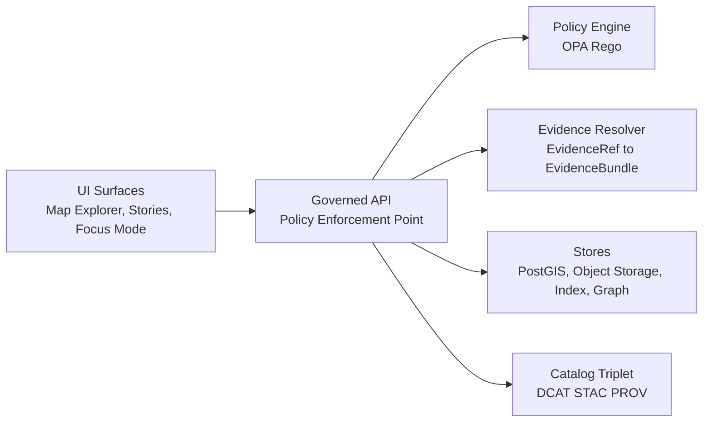

<!-- [KFM_META_BLOCK_V2]
doc_id: kfm://doc/4c2fd9b6-89e2-4c58-a6ad-1b3cf0ddc5de
title: UI Guides
type: standard
version: v1
status: draft
owners: ui-platform
created: 2026-03-04
updated: 2026-03-04
policy_label: public
related: [docs/guides, docs/standards, contracts, policy, apps]
tags: [kfm, ui, map, story, focus, governance]
notes: [
  "This README is normative: it defines what UI docs in this directory should cover.",
  "Where repo state is uncertain, content is labeled UNKNOWN and includes verification steps."
]
[/KFM_META_BLOCK_V2] -->

# UI Guides
One-line purpose: **Design and implementation guides for KFM’s governed UI surfaces (Map, Timeline, Stories, Focus Mode) with “trust visible” UX.**

---

## Impact
**Status:** active (draft docs surface)  
**Owners:** `ui-platform` (TODO: replace with team/usernames)  
**Shields:**  
  
  


**Quick links:**  
- [Scope](#scope) · [Where it fits](#where-it-fits) · [Trust surfaces](#ui-trust-surfaces-required) · [Evidence drawer](#evidence-drawer-contract-ui-facing) · [Quickstart](#quickstart) · [DoD](#definition-of-done-ui-pr-gates)

---

## Scope

### What this directory is for
**CONFIRMED:** KFM UI is expected to be map-centric, with primary user experiences spanning **Map Explorer**, **Stories**, and **Focus Mode**, and the UI must make governance “visible” (version, license/rights, policy, evidence/provenance).  
This directory collects **how-to guides, UX contracts, and implementation patterns** that keep those requirements enforceable.

### What this directory is not for
**CONFIRMED:** This is **not** where API contracts, policy rules, or dataset metadata live.  
Put those elsewhere:
- **API contracts / JSON schemas:** `contracts/`
- **OPA/Rego policy:** `policy/`
- **Catalog artifacts (DCAT/STAC/PROV):** `data/.../dcat`, `data/.../stac`, `data/.../prov` (or your repo’s catalog locations)
- **Validators / link checkers:** `tools/`

---

## Where it fits
**CONFIRMED:** The UI is a **governed client**. It must not bypass the **Policy Enforcement Point** and must never directly access databases/object storage. All data and evidence flows cross the governed API boundary (“trust membrane”).  

### End-to-end placement (trust membrane)


**Engineering implication (non-negotiable):**
- UI code **MUST NOT** embed privileged credentials.
- UI code **MUST** treat API responses as the only truth surface.
- UI features that reveal provenance (links, attestations, audit refs) must do so via **server-side verification + policy filtering**.

---

## Acceptable inputs
Add files here when they are **UI-focused** and enforceable:

- Surface guides: Map Explorer, Story Mode, Focus Mode, Catalog browsing, Admin/Steward tools (UI only).
- Shared UX contracts: evidence drawer behaviors, policy notices, “abstain/reduce scope” UX, “what changed” diff UX.
- Component specs: inputs/outputs, accessibility requirements, test hooks.
- Testing playbooks: Playwright flows, a11y checks, contract-test harnesses for UI↔API.

---

## Exclusions
Do **not** put the following in this directory:

- API schemas, OpenAPI specs, GraphQL schemas → `contracts/`
- Policy source of truth (OPA/Rego) → `policy/`
- Dataset catalogs (DCAT/STAC/PROV JSON) → `data/...`
- Run receipts, attestations, SBOMs → `provenance/` or release artifacts
- One-off UI experiments without governance hooks (put them in a sandbox area and label clearly)

---

## Directory tree
**UNKNOWN:** Current contents of `docs/guides/ui/` may differ by branch.  
**PROPOSED:** Recommended structure for this folder:

```
docs/guides/ui/
  README.md
  map-explorer/
    overview.md
    layers-and-legend.md
    time-controls.md
    feature-inspect.md
  stories/
    story-nodes.md
    publishing-gates.md
    map-state-sidecar.md
  focus-mode/
    focus-ux.md
    cite-or-abstain.md
    export-and-audit.md
  components/
    evidence-drawer.md
    policy-badges.md
    provenance-panel.md
    version-diff-viewer.md
  testing/
    e2e-playwright.md
    accessibility.md
    contract-tests.md
  adr/
    README.md
```

**Smallest verification step (to make this CONFIRMED):**
- Run `tree -L 4 docs/guides/ui` and update this section to match reality.

---

## Quickstart
**UNKNOWN:** Repo uses npm/pnpm/yarn and exact app paths may differ.  
**PROPOSED (pseudocode; adapt to repo):**
```bash
# Install dependencies
pnpm install

# Run UI dev server
pnpm -C apps/ui dev

# Run E2E (Playwright)
pnpm -C apps/ui test:e2e
```

**PROPOSED (API dependency):**
```bash
# In another terminal, run the governed API
pnpm -C apps/api dev
```

If your repo isn’t a JS monorepo, replace the commands with the real ones and keep this section runnable.

---

## UI information architecture
**CONFIRMED intent:** recommended top-level navigation:
- Map Explorer (primary)
- Timeline (optional; can be integrated into Map Explorer)
- Stories (Story Mode)
- Catalog (dataset discovery)
- Focus Mode (evidence-led Q&A)
- Admin/Steward (restricted)

---

## UI trust surfaces required
**CONFIRMED:** “Trust surfaces” are not optional polish. They are part of the user-visible governance contract.  

### Trust surfaces checklist (minimum)
| Trust surface | Where it appears | Must show | UI behavior |
|---|---|---|---|
| Dataset version label | Layer panel, feature inspect | dataset_version_id, freshness | Clicking opens Evidence Drawer / provenance panel |
| License + attribution | Evidence drawer, exports | license, rights holder, attribution text | Auto-insert attribution into exports |
| Policy badge + notice | Layer panel, feature inspect, Focus Mode | policy_label + obligations summary | Explain withheld/generalized data at interaction time |
| Evidence access | Everywhere claims are shown | EvidenceRef resolution results | One-click “open evidence” that resolves via API |
| Provenance access | Evidence drawer / provenance panel | run receipt link + audit_ref | Links must be policy-allowed and verified server-side |
| “What changed?” | Dataset version viewer | diff summary + checksums | Compare versions; show QA/validation deltas |

> IMPORTANT: If evidence is missing or unresolvable, the UI must disable publish/export paths and explain why (fail-closed UX).

[Back to top](#ui-guides)

---

## Evidence drawer contract (UI-facing)
**CONFIRMED intent:** The evidence drawer is a shared component across **Map**, **Story**, and **Focus** surfaces.

### Minimum data to display
The evidence drawer must display at minimum:
- Evidence bundle identifier and digest
- Dataset version identity (dataset_version_id)
- License/rights + attribution
- Freshness (last run timestamp where available) + validation status
- Provenance chain (run receipt / lineage links)
- Artifact links (only if policy allows)
- Redactions/obligations applied (if any)

### Interaction rule
- Publishing must be blocked if any citation fails to resolve.
- The UI should be able to resolve evidence in a small number of calls (treat “resolve evidence” as a first-class UI action, not an afterthought).

---

## Core surfaces

### Map Explorer
**CONFIRMED intent:** baseline Map Explorer includes:
- Map canvas (2D)
- Layer panel (toggles, opacity, legend)
- Time control (range + histogram where possible)
- Feature inspect (attributes + evidence refs)
- Shared evidence drawer accessible from feature clicks

**PROPOSED implementation notes:**
- Prefer vector tiles / PMTiles for large layers; use GeoJSON overlays only for small or clipped subsets.
- Treat time controls as first-class state; “time window” participates in every query.

### Stories
**CONFIRMED intent:** Story Nodes bundle narrative markdown plus a sidecar capturing map state and citations. Publishing is governed and requires review state and resolvable citations.

**PROPOSED doc set for this folder:**
- Story Node JSON schema (or link to `contracts/`)
- Citation hooks in markdown rendering
- Publish flow UX (review states, blocked reasons, evidence resolver preflight)

### Focus Mode
**CONFIRMED intent:** Focus Mode is a governed Q&A flow that must “cite-or-abstain” and emits a receipt/audit reference for outputs.

**PROPOSED UX requirements:**
- Inline citations open the evidence drawer.
- When restricted, show a policy notice (what was withheld and why) and offer allowed alternatives (generalized summaries, aggregated views).

[Back to top](#ui-guides)

---

## 2D and 3D mapping
**CONFIRMED intent:** KFM supports a 2D map experience and may support a 3D experience; the UI can provide a 2D/3D toggle.

**PROPOSED guidance:**
- 2D: MapLibre-based map canvas for vector/raster layers.
- 3D: Cesium-based viewer for terrain and 3D story node demos.
- Keep “layer definitions” adapter-driven so 2D and 3D can share the same governed layer catalog, differing only in rendering adapters.

---

## Testing and quality gates
**CONFIRMED intent:** UI changes are not “done” until evidence, licensing, version, and keyboard navigation behaviors are proven.

### Recommended test layers
- Unit tests: pure functions (style generation, parsing, view_state encode/decode)
- Contract tests: UI↔API JSON shapes (EvidenceBundle, dataset discovery, tile endpoints)
- E2E tests (Playwright): “click feature → evidence drawer opens → license/version visible → keyboard navigation works”
- Accessibility: keyboard-only flows, focus states, ARIA labels, no color-only semantics

---

## Definition of Done (UI PR gates)
Use this checklist in PR descriptions.

- [ ] No direct DB/object-store access from UI code (all access via governed API).
- [ ] Evidence drawer works from Map, Story, and Focus (same component).
- [ ] Evidence drawer shows license + dataset_version_id and is keyboard navigable.
- [ ] Story publishing blocks on unresolvable citations (fail-closed UX).
- [ ] Focus Mode output path implements cite-or-abstain behavior (abstains or narrows scope when evidence cannot be verified).
- [ ] E2E coverage exists for at least one golden flow per surface (Map, Story, Focus).
- [ ] Accessibility checks pass (keyboard, ARIA labels, focus states).
- [ ] “Restricted” behavior is explicit (policy notice shown; no silent omission).

---

## FAQ

### Why is “trust UI” treated as a hard requirement?
Because KFM’s promise is evidence-first interaction: users must be able to inspect version, license, and provenance at the moment they see a claim. Hiding this in metadata breaks the governance contract.

### Can the UI link directly to attestations, SBOMs, or receipts?
Only if they are served via governed endpoints that verify signatures and apply policy filtering server-side.

---

## Appendix (templates and glossary)
<details>
<summary>Open appendix</summary>

### Glossary
- **EvidenceRef:** A structured reference used by UI/Focus/Stories; resolved by the API into an EvidenceBundle.
- **EvidenceBundle:** The resolved evidence object containing policy decision, license, provenance refs, digests, and links (when allowed).
- **dataset_version_id:** Immutable identifier for the version of data used to render a layer or support a claim.
- **policy_label:** Primary policy classification input (e.g., public, restricted) that drives allow/deny and obligations.
- **obligations:** Required transformations (e.g., generalize geometry, remove fields) applied by policy.

### Template: “blocked publish” UI copy (PROPOSED)
- Title: “Cannot publish yet”
- Body: “One or more citations could not be resolved or is not policy-allowed. Open the evidence drawer for details.”
- Actions: “Review citations”, “Remove blocked citations”, “Save draft”

</details>

---

[Back to top](#ui-guides)
