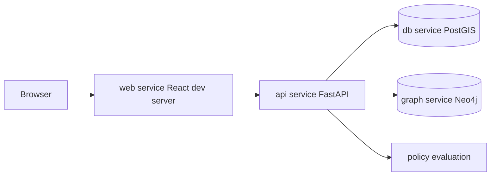

<!-- [KFM_META_BLOCK_V2]
doc_id: kfm://doc/f4c6d2f3-83b6-4e5b-8d0c-8d6c2a3b6d66
title: Run the UI Locally
type: standard
version: v1
status: draft
owners: KFM Maintainers (TBD)
created: 2026-03-04
updated: 2026-03-04
policy_label: public
related:
  - docs/architecture/system_overview.md
  - docs/guides/dev/LOCAL_DEV.md
tags: [kfm, ui, local-dev, docker-compose]
notes:
  - This guide is intentionally fail-closed: anything not verified in-repo is labeled PROPOSED or UNKNOWN with a verification step.
[/KFM_META_BLOCK_V2] -->

# Run the UI Locally
Start KFM’s React UI against a local, governed API stack (Docker Compose), with optional Focus Mode.

> **Status:** draft  
> **Owners:** KFM Maintainers (TBD)  
> **Last updated:** 2026-03-04  
> **Quick nav:** [Scope](#scope) · [Quickstart](#quickstart-docker-compose-recommended) · [Ports](#ports-and-service-urls) · [Seeding data](#seed-sample-data) · [Troubleshooting](#troubleshooting) · [FAQ](#faq)

---

## Evidence labels used in this guide

KFM’s doc standard uses three labels:

- **CONFIRMED**: explicitly stated in a KFM design/blueprint document.
- **PROPOSED**: recommended defaults described in docs as “likely/might”; verify in your repo before relying on it.
- **UNKNOWN**: not available in the referenced docs; verification steps are provided.

---

## Scope

- **CONFIRMED:** This guide is for running the **UI locally**, not for production deployment.
- **CONFIRMED:** The UI **must not** connect to PostGIS/Neo4j directly; it must talk to the backend API, which enforces validation + governance rules.  
- **CONFIRMED:** Data should flow through the canonical path: **RAW → PROCESSED → CATALOG/PROV → DB → API → UI** (no shortcuts).

---

## Where this fits

- Path: `docs/guides/ui/RUN_UI_LOCALLY.md`
- UI: **React + TypeScript** (served as a “web” service in the dev stack)
- Backend: **FastAPI** (served as an “api” service)
- Local stack: Docker Compose orchestrates **web + api + db (PostGIS) + graph (Neo4j)** (and possibly optional services)

---

## Acceptable inputs

- A local development machine with Docker installed.
- A local clone of the KFM repository.

---

## Exclusions

- **Do not** use this guide to connect the UI directly to database/storage.
- **Do not** use restricted/sensitive datasets in a non-governed environment unless you have explicit permission and the correct policy pack.
- **Do not** commit `.env` files or secrets.

---

## Quickstart: Docker Compose (recommended)

### 1) Prereqs
- **CONFIRMED:** Install **Docker** and **Docker Compose**.
- **PROPOSED:** Ensure Docker has “a few GB” of RAM allocated (you’ll be running databases).

### 2) Get the repo
**PROPOSED** (repo URL varies):
```bash
git clone <REPO_URL>
cd <REPO_DIR>
```

### 3) Create your local `.env`
- **PROPOSED:** Copy an env template to `.env` at repo root:

```bash
cp .env.example .env
# or: cp .env.template .env
```

- **PROPOSED:** Typical values include PostGIS and Neo4j credentials (exact keys vary by repo).

### 4) Start the stack
- **CONFIRMED:** From the project directory, build and launch:

```bash
docker-compose up --build
```

> TIP: Some Docker installs use `docker compose` (space) instead of `docker-compose` (hyphen).  
> **UNKNOWN:** Which one your repo expects. If `docker-compose` fails, try:
> ```bash
> docker compose up --build
> ```

### 5) Verify services are up
**PROPOSED verification commands**:
```bash
docker-compose ps
docker-compose logs api
docker-compose logs web
```

---

## Ports and service URLs

These are **PROPOSED defaults** based on KFM blueprint docs. **Verify** against `docker-compose.yml` (or `docker compose config` output).

| Service | Default host URL | Notes |
|---|---:|---|
| Web UI | `http://localhost:3000` | React dev server (hot reload) |
| API docs (Swagger UI) | `http://localhost:8000/docs` | FastAPI docs UI |
| Graph UI (Neo4j Browser) | `http://localhost:7474` | Neo4j browser UI |
| PostGIS | `localhost:5432` | Connect with `psql`/DBeaver/pgAdmin |

**Verify the actual services and names** (recommended):
```bash
docker-compose config --services
```

---

## Development workflow (hot reload)

- **PROPOSED:** Frontend edits in `web/src` should hot-reload in the browser.
- **PROPOSED:** Backend edits in `api/` may reload automatically if Uvicorn is started with `--reload` and the code is mounted into the container.
- **CONFIRMED:** If you change environment variables, restart the relevant containers:

```bash
docker-compose down
docker-compose up --build
```

---

## Seed sample data

On first run, databases may be empty. Seed a **small, public-safe** sample so the UI has something to render.

### Option A: Run an init script (if present)
**PROPOSED**:
```bash
docker-compose exec api python scripts/init_sample_data.py
```

### Option B: Run a pipeline (if present)
**PROPOSED**:
```bash
docker-compose exec api python pipelines/import_rainfall.py
```

### Option C: Explore what exists (fail-closed)
**UNKNOWN** which scripts exist in your repo. Verify first:
```bash
ls -la scripts/ pipelines/ api/scripts/ || true
```

---

## How the UI talks to the API (governed access)

- **CONFIRMED:** UI access is mediated by the backend API (policy enforcement lives behind the API boundary).
- **UNKNOWN:** The exact env var name used by the UI to find the API base URL.

**Verification step (recommended):**
1. Search for an API base URL env var in the UI code:
   ```bash
   rg -n "VITE_|REACT_APP_|API_BASE|BASE_URL" web/ || true
   ```
2. Check the UI dev server proxy config (if any):
   ```bash
   rg -n "proxy|/api" web/ || true
   ```

---

## Optional: Focus Mode (local LLM via Ollama)

This is optional and should be treated as **PROPOSED** unless your repo’s AI config is confirmed.

- **PROPOSED:** `.env` may include `OLLAMA_MODEL`.
- **PROPOSED:** If the API runs in Docker, connecting to host Ollama may require `host.docker.internal:11434` (platform-dependent).

**Fail-closed verification steps:**
1. Search env keys in `.env.example`:
   ```bash
   rg -n "OLLAMA|OPENAI|AI_BACKEND" .env* || true
   ```
2. Locate API AI integration code:
   ```bash
   rg -n "ollama|OpenAI|focus mode" api/ || true
   ```

---

## Mermaid: local stack at a glance



---

## Troubleshooting

### Port conflicts
If you already have local services on these ports, Docker Compose may fail.

- **CONFIRMED examples:** `5432`, `7474`, `8000`, `3000`

**Fix:** stop the conflicting service or change port mappings in the compose file.

### API container exits on startup
- **PROPOSED:** DB might not be ready yet. Check logs and retry:
```bash
docker-compose logs api
docker-compose up
```

### Web container doesn’t hot reload
- **CONFIRMED (common issue):** volume mount didn’t work; verify `web/src` is mounted in compose.
- On Windows/macOS, file-sharing permissions can also block mounts.

### Rebuild after dependency changes
- **CONFIRMED:**
```bash
docker-compose up --build
# or:
docker-compose build
docker-compose up
```

---

## “Done when” checklist

- [ ] `docker-compose up --build` starts without errors.
- [ ] UI loads in a browser (default: `localhost:3000`).
- [ ] API docs load (default: `localhost:8000/docs`).
- [ ] UI shows *something* (basemap is fine); seeded sample layers are a bonus.
- [ ] No code path connects UI directly to DB/storage (API boundary only).
- [ ] If using any sample dataset, it is public-safe and does not contain sensitive exact locations.

---

## FAQ

### The UI loads but nothing shows
- Likely the DB has no datasets yet.
- Run a sample seed/pipeline (see [Seed sample data](#seed-sample-data)).

### Why is direct DB access forbidden even locally?
Because KFM’s core invariant is the governed boundary: the API is responsible for validation, policy evaluation, and evidence resolution. Bypassing it breaks the trust model.

### How do I confirm the exact ports/services?
Run:
```bash
docker-compose config --services
docker-compose ps
```

---

## Appendix: smallest verification steps (to upgrade PROPOSED → CONFIRMED)

1. Capture compose services + ports:
   - `docker-compose config`
2. Capture UI env wiring:
   - search `web/` for env vars and proxy config
3. Confirm API docs route:
   - open `/docs` and/or inspect API router config in `api/`
4. Confirm seed scripts:
   - list `pipelines/` and `scripts/` and run the smallest sample pipeline
