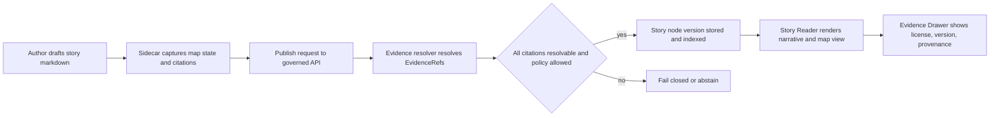

<!-- [KFM_META_BLOCK_V2]
doc_id: kfm://doc/c6a69f2e-7fb3-4f4d-b7e1-0e5f5f1d4c58
title: Story Authoring
type: standard
version: v1
status: draft
owners: kfm:team:stories; kfm:team:ui  # TODO: confirm CODEOWNERS
created: 2026-03-04
updated: 2026-03-04
policy_label: public
related:
  - docs/guides/ui/README.md            # TODO: if exists
  - docs/guides/ai/FOCUS_MODE.md        # TODO: if exists
  - configs/ui/story/rendering.json     # TODO: confirm path in repo
tags: [kfm, ui, stories, story-nodes, evidence, governance]
notes:
  - This guide is written to the KFM “cite-or-abstain” governance posture. It separates CONFIRMED requirements from PROPOSED conventions and UNKNOWN repo-specific details.
[/KFM_META_BLOCK_V2] -->

# Story Authoring
Evidence-first Story Nodes that replay map state and pass citation + policy gates.

> **Status:** draft  
> **Owners:** `kfm:team:stories`, `kfm:team:ui` (TODO confirm)  
> **Policy label:** `public` (this document)  
>
> 
> 
> 
>
> **Jump:** [Quickstart](#quickstart) • [Story Node anatomy](#story-node-anatomy) • [Citations and evidence](#citations-and-evidence) • [Map state](#map-state) • [Publishing gates](#publishing-gates) • [Redaction and sensitive content](#redaction-and-sensitive-content) • [Troubleshooting](#troubleshooting)

---

## Scope

- **CONFIRMED:** A Story Node binds narrative text to **map state** and **citations** so it can be replayed reproducibly.
- **CONFIRMED:** Publishing is a **governed event**: citations must be resolvable and policy-allowed; review state must be captured; otherwise the system **fails closed** (or the node is marked **abstain**).
- **PROPOSED:** Authors work in a “draft → review → publish” flow, with automated preflight checks in UI + CI.
- **UNKNOWN:** Exact repo paths for story storage (e.g., `stories/…`) and exact schema filenames vary by branch—verify before enforcing in CI.

---

## Where this fits

- **CONFIRMED:** KFM’s Story Mode is one of the “trust surfaces” alongside Map Explorer and Focus Mode; it should share the same Evidence Drawer behavior and policy notices.
- **CONFIRMED:** Story authoring does **not** bypass governance; it relies on the **governed API** and the **evidence resolver** to verify citations and apply policy obligations.
- **PROPOSED:** Treat story authoring as a “vertical slice” artifact: it should only reference promoted DatasetVersions (DCAT/STAC/PROV-backed) and resolvable EvidenceBundles.

---

## Acceptable inputs

- **CONFIRMED:** Story narrative in **Markdown**.
- **CONFIRMED:** Machine-readable **sidecar JSON** capturing: map state, citations, policy label, and review state.
- **CONFIRMED:** Citations expressed as **EvidenceRefs** (e.g., `dcat://…`, `stac://…`, `prov://…`, `doc://…`) that can be resolved into **EvidenceBundles**.
- **PROPOSED:** Optional story assets (images, diagrams) that are license-cleared and referenced by EvidenceRefs or packaged as governed artifacts.

---

## Exclusions

- **CONFIRMED:** Do **not** “cite” by pasting raw URLs into narrative text. Citations must be EvidenceRefs resolvable into EvidenceBundles.
- **CONFIRMED:** Do **not** include restricted coordinates/attributes in public stories; use policy-driven generalization/redaction (or abstain).
- **CONFIRMED:** UI/clients must not access DB/storage directly; all data + evidence access crosses governed APIs.
- **PROPOSED:** Avoid embedding unreviewed screenshots of data as “evidence.” Prefer citable artifacts with digests, licenses, and provenance.

---

## Status labels used in this guide

- **CONFIRMED** — required/explicit in KFM design docs (treat as contract behavior).
- **PROPOSED** — recommended repo convention or implementation approach (safe default; may be revised).
- **UNKNOWN** — missing authoritative confirmation in the current branch (includes a verification step).

---

## Quickstart

> These commands are **PROPOSED** and may need path/port updates for your environment.

1) Create a Story Node skeleton (Markdown + sidecar)

```bash
# PROPOSED layout; adjust to your repo conventions
mkdir -p stories/story.kansas.example.v1
touch stories/story.kansas.example.v1/story.md
touch stories/story.kansas.example.v1/story.sidecar.json
```

2) Add at least one claim + one citation, then preflight citation resolution

```bash
# PSEUDOCODE: call your governed API host/port
curl -sS -X POST "http://localhost:8080/api/v1/evidence/resolve" \
  -H "Content-Type: application/json" \
  -d '{"ref":"dcat://example_dataset@2026-02.abcd1234"}' | jq .
```

3) Optional: run a local policy gate (if you maintain one for stories)

```bash
# PROPOSED: Conftest gate pattern (requires conftest + policy bundle present)
conftest test stories/**/story-node.json -p policy/rego
```

---

## Story Node anatomy

### Conceptual model



### Required artifacts

| Artifact | Purpose | Must contain |
|---|---|---|
| `story.md` | Human-readable narrative | Summary, claims, narrative text, inline citations |
| `story.sidecar.json` | Machine metadata | Map state, citations list, `policy_label`, `review_state` |
| EvidenceBundles | Inspectable evidence | License, provenance/run receipt, artifact digests, policy decision |

---

## Template

### Markdown skeleton

```markdown
<!-- [KFM_META_BLOCK_V2]
doc_id: kfm://story/<uuid>@v1
title: <Story title>
type: story
version: v3
status: draft
owners: <names or teams>
created: YYYY-MM-DD
updated: YYYY-MM-DD
policy_label: public
related:
  - kfm://dataset/<slug>@<dataset_version_id>
[/KFM_META_BLOCK_V2] -->

# <Story title>

## Summary
<Scope + time window + what the reader should learn.>

## Claims
1. <Claim text.> [CITATION: dcat://<dataset>@<dataset_version_id>]
2. <Claim text.> [CITATION: stac://<collection-or-item>@<dataset_version_id>]

## Narrative
<Full narrative with inline citations, e.g. … [CITATION: doc://…]>

## Evidence
- [CITATION: prov://run/<run_id>]
- [CITATION: dcat://<dataset>@<dataset_version_id>]
```

### Sidecar skeleton

```json
{
  "kfm_story_node_version": "v3",
  "story_id": "kfm://story/<uuid>",
  "version_id": "v1",

  "status": "draft",
  "policy_label": "public",
  "review_state": "needs_review",

  "map_state": {
    "bbox": [-102.0, 36.9, -94.6, 40.0],
    "zoom": 6,
    "layers": [
      { "layer_id": "noaa_storm_events", "dataset_version_id": "2026-02.abcd1234" }
    ],
    "time_window": { "start": "1950-01-01", "end": "2024-12-31" }

    // PROPOSED extensions:
    // "filters": [],
    // "style": {}
  },

  "citations": [
    { "ref": "dcat://noaa_ncei_storm_events@2026-02.abcd1234", "kind": "dcat" },
    { "ref": "prov://run/2026-02-20T12:34Z.abcd", "kind": "prov" }
  ]
}
```

---

## Citations and evidence

### What counts as a citation in KFM

- **CONFIRMED:** A “citation” is an **EvidenceRef** that resolves (via the evidence resolver) into an **EvidenceBundle** with metadata, artifacts, and provenance needed to inspect/reproduce the claim.
- **CONFIRMED:** Story publishing must enforce a hard gate: **every** citation must resolve and be policy-allowed, or the system narrows scope / abstains.

### EvidenceRefs

| Kind | Typical use | Example |
|---|---|---|
| `dcat://` | dataset-level citation | `dcat://noaa_ncei_storm_events@2026-02.abcd1234` |
| `stac://` | asset or item citation | `stac://collection/<id>@2026-02.abcd1234` |
| `prov://` | run/provenance citation | `prov://run/<run_id>` |
| `doc://` | document excerpt citation | `doc://<doc_id>#<anchor>` |

> **UNKNOWN:** Exact URI grammar and supported resolvers must be confirmed from `contracts/schemas/*` and the evidence resolver implementation when it exists.

### Evidence bundle expectations

- **CONFIRMED:** Evidence bundles should include (at minimum): bundle ID/digest, DatasetVersion ID, policy decision + obligations applied, license/attribution, provenance/run ID, artifact hrefs + digests, validation checks, and an audit reference.

---

## Map state

- **CONFIRMED:** Map state is a reproducible artifact. It includes:
  - camera position (bbox/zoom)
  - active layers (and style parameters where applicable)
  - time window
  - filters
- **CONFIRMED:** Story Nodes store map state so stories replay the same view. Focus Mode can optionally accept `view_state` hints so it answers in context.

### Authoring map state

- **PROPOSED:** Build the map view first (layers + time + filters), then “Save into story.”
- **PROPOSED:** When referencing a layer in map state, include its **dataset_version_id** so a story doesn’t drift as datasets update.
- **UNKNOWN:** Exact shape of `map_state` in the schema (confirm via `story_node_v3.schema.json` once present).

---

## Publishing gates

### Required gates

- **CONFIRMED:** Publishing must be blocked if any citation fails to resolve. A practical implementation is to call the evidence resolver during story publish checks.
- **CONFIRMED:** Publishing requires review state and resolvable citations; citations must open the Evidence Drawer.

### Recommended preflight checklist

- [ ] **CONFIRMED:** Every claim has at least one EvidenceRef that resolves into an allowed EvidenceBundle.
- [ ] **CONFIRMED:** Evidence Drawer shows license + version + provenance for each citation (no hidden trust).
- [ ] **CONFIRMED:** `review_state` is set (and captured in audit logs/receipts).
- [ ] **CONFIRMED:** Map state is present and includes bbox/layers/time window.
- [ ] **CONFIRMED:** Policy label is set; any obligations are applied (redaction/generalization) before public render/export.
- [ ] **PROPOSED:** Sidecar validates against `story_node_v3.schema.json` (when available).
- [ ] **PROPOSED:** CI runs “story publish gate” checks for changed story nodes.

---

## Redaction and sensitive content

### Policy labels and obligations

- **CONFIRMED:** Policy evaluation yields:
  - allow/deny decision
  - obligations (redaction/generalization steps)
  - reason codes (for auditing and UX)
- **CONFIRMED:** Obligations matter because publish-safe generalized outputs are often preferred over a hard deny.

### Authoring guidance

- **CONFIRMED:** Never leak restricted existence via UI differences (“ghost metadata”). If something is restricted, the UI must explain “why” in policy-safe terms and include an `audit_ref` for steward review.
- **PROPOSED:** If a story cannot be made policy-safe, mark it **abstain** with concrete “next actions” (what evidence or approvals are missing).
- **PROPOSED (redaction guardrails):**
  - location thinning (cluster/jitter) for sensitive points
  - temporal coarsening (day → month) if policy requires
  - attribute masking (drop PII or rare identifying combos)
  - emit a `redaction_receipt.json` + link it from `audit_event.json`

---

## Accessibility and safe rendering

- **CONFIRMED:** Evidence Drawer and key controls must be keyboard navigable.
- **CONFIRMED:** Render Story Markdown safely (CSP + sanitization) to prevent XSS.
- **CONFIRMED:** Policy notices must not be color-only; include text labels and accessible affordances.

---

## Troubleshooting

### “Citation failed to resolve”

- **CONFIRMED:** Treat this as a publish-blocking error (fail closed).
- **PROPOSED checks:**
  1) Confirm the EvidenceRef kind is supported (`dcat://`, `stac://`, `prov://`, `doc://`).
  2) Confirm the referenced DatasetVersion is promoted and discoverable.
  3) Re-run `/api/v1/evidence/resolve` for the ref to inspect the policy decision + obligations.

### “Denied by policy”

- **CONFIRMED:** Don’t reveal restricted metadata; provide a policy-safe explanation and an `audit_ref`.
- **PROPOSED:** Offer a public alternative story scope (broader time range, public datasets, generalized geometry).

### “Story replays a different map than intended”

- **CONFIRMED:** Ensure map state is captured (bbox, layers, time window, filters).
- **PROPOSED:** Ensure `dataset_version_id` is included for each layer in `map_state.layers`.

---

## Definition of Done

- [ ] **CONFIRMED:** Story narrative + sidecar exist and render in Story Reader.
- [ ] **CONFIRMED:** All citations open Evidence Drawer and resolve to allowed EvidenceBundles.
- [ ] **CONFIRMED:** Evidence Drawer shows license/attribution + DatasetVersion + provenance + obligations applied.
- [ ] **CONFIRMED:** Publishing blocks on unresolved citations.
- [ ] **CONFIRMED:** Abstention UX is policy-safe and includes `audit_ref` when needed.
- [ ] **PROPOSED:** CI gate runs on `stories/**` changes (schema + citation resolvability + policy checks).

---

## FAQ

**Why can’t I just link a URL in the story?**  
- **CONFIRMED:** Because KFM citations are resolvable EvidenceRefs that produce inspectable EvidenceBundles (with digests, provenance, and policy decisions). URLs alone don’t meet that bar.

**Can I publish partial answers?**  
- **CONFIRMED:** Yes—partial stories are acceptable when only part of the question is supported by allowed evidence; unsupported parts must abstain.

---

<details>
<summary>Appendix: Optional CI “story-node.json” gate pattern (PROPOSED)</summary>

This pattern is useful when you want PR-time checks without needing a running API. It treats story metadata as a policy-audited artifact and fails closed if evidence/spec/redaction requirements are missing.

### Minimal `story-node.json` contract (example)

```json
{
  "doc_kind": "story_node",
  "id": "story.kansas.water-balance.q1-2026",
  "title": "Q1 Water Balance — Central Kansas",
  "status": "pending",
  "last_updated": "2026-02-21",
  "owners": ["kfm:team:stories"],
  "sensitivity": "public",
  "redaction_profile": "public_default",
  "claims": [
    {
      "id": "claim.001",
      "text": "Example factual claim.",
      "evidence_ref": "oci:ghcr.io/kfm/evidence/example@sha256:..."
    }
  ],
  "datasets": [
    {
      "ref": "catalog:stac/items/example.json",
      "spec_hash": "sha256-...",
      "dataset_version": "dv:example@sha256:..."
    }
  ],
  "maps": ["mapcfg:example.json"],
  "audit_ref": "audit/story.example/audit_event.json"
}
```

### Fail-closed “abstain” shape (example)

```json
{
  "status": "abstain",
  "abstain_reason": [
    "claim.002 missing EvidenceBundle",
    "dataset catalog entry missing spec_hash"
  ],
  "missing_receipts": [
    "evidence/example/bundle.json",
    "data/catalog/stac/items/example.json"
  ],
  "next_actions": [
    "Ingest missing source batch",
    "Re-run transform to produce spec_hash"
  ]
}
```

</details>

---

[Back to top](#story-authoring)
