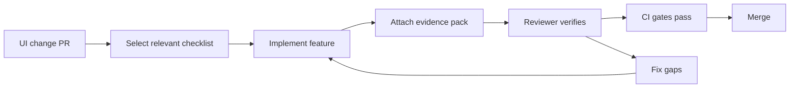

<!-- [KFM_META_BLOCK_V2]
doc_id: kfm://doc/5e6c12a3-8e49-4a9f-93b7-5b7d6b0f8b2d
title: UI Checklists
type: standard
version: v1
status: draft
owners: kfm-ui-maintainers
created: 2026-03-04
updated: 2026-03-04
policy_label: public
related: [docs/guides/ui/, docs/governance/, contracts/, policy/, apps/ui/]
tags: [kfm, ui, checklists, governance, a11y, map, story, focus-mode]
notes: [Update owners + links once CODEOWNERS and UI docs are finalized.]
[/KFM_META_BLOCK_V2] -->

# UI Checklists
One-place, copy/paste checklists for shipping KFM UI features without breaking governance, evidence, or accessibility.

> **IMPACT**
> - **Status:** **active (draft)**  
> - **Owners:** **UNKNOWN** → set to UI CODEOWNERS (suggestion: `@kfm-ui`)  
> - **Review cycle:** **PROPOSED** quarterly  
> - **Badges (TODO):**   
>
> **Quick links:** [Scope](#scope) · [Where it fits](#where-it-fits) · [How to use](#how-to-use-these-checklists) · [Checklist registry](#checklist-registry) · [Templates](#templates) · [Definition of done](#definition-of-done-gates) · [FAQ](#faq) · [Appendix](#appendix)

---

## Scope

These checklists are for:
- **Map Explorer UI** (2D MapLibre, and optional 3D Cesium scenes)
- **Timeline UI** (time filters, playback, story-linked navigation)
- **Story Nodes** (narrative + map transitions + citations)
- **Focus Mode UI** (ask/answer UX that must remain evidence-led)
- **Cross-cutting UI concerns** (a11y, performance, security, telemetry)

**Exclusions**
- Backend pipeline checklists (ingest/catalog/indexing) → use pipeline runbooks/specs elsewhere.
- Policy authoring standards (OPA/Rego authoring) → use policy docs elsewhere.
- Component-level design system details (tokens, typography, spacing) → keep in UI system docs.

---

## Where it fits

- **This directory:** `docs/guides/ui/checklists/`
- **Upstream inputs (CONCEPTUAL):**
  - Architecture invariants and governance rules
  - UI requirements (map, timeline, story, Focus Mode)
  - Telemetry/event schemas (PII-free)
- **Downstream consumers:**
  - PR authors (copy checklist into PR description)
  - Reviewers (treat checklist as “done = mergeable” where applicable)
  - CI (optional): enforce presence of certain evidence artifacts

### Non-negotiables

- **[CONFIRMED]** UI/clients **must not** access storage/DB/LLM directly; all access crosses the governed API + policy boundary.
- **[CONFIRMED]** User-visible claims (map, story text, Focus answers) should be traceable to evidence and fail closed when evidence/citation requirements are unmet.
- **[PROPOSED]** Treat these checklists as merge blockers when a PR touches governed UI surfaces (Map, Story, Focus Mode).

---

## Acceptable inputs

What belongs in this folder:
- Checklist Markdown files intended to be copied into PRs
- “Definition of Done” gates for UI features
- UI evidence capture instructions (screenshots, traces, a11y reports)
- Lightweight templates for PR descriptions / review notes

What **must not** go here:
- Large design docs, screenshots, or UI assets (store elsewhere)
- Full component specifications (keep near the component/package)
- Backend implementation guides

---

## Directory tree

**[PROPOSED]** expected layout:

```text
docs/guides/ui/checklists/
├── README.md
├── CHECKLIST__UI_BASELINE.md
├── CHECKLIST__MAP_LAYERS.md
├── CHECKLIST__TIMELINE.md
├── CHECKLIST__STORY_NODES.md
├── CHECKLIST__FOCUS_MODE.md
├── CHECKLIST__A11Y_WCAG.md
├── CHECKLIST__PERFORMANCE.md
├── CHECKLIST__SECURITY_PRIVACY.md
├── CHECKLIST__TELEMETRY_OBSERVABILITY.md
└── templates/
    ├── PR_TEMPLATE__UI.md
    └── EVIDENCE_PACK__UI.md
```

> **UNKNOWN:** The actual filenames may differ. If the repo already has checklist files, update this tree to match reality.

---

## Quickstart

### Use a checklist in a PR

```text
1) Pick the relevant checklist(s) from this folder
2) Copy into the PR description
3) Check boxes as you implement
4) Attach an “Evidence Pack” (links, screenshots, traces, reports)
5) Reviewer verifies evidence, not just checkmarks
```

### Run UI validation locally (pseudocode)

```bash
# PSEUDOCODE: replace with repo-accurate scripts/commands
pnpm -w lint
pnpm -w test
pnpm -w test:e2e
pnpm -w build
```

---

## How to use these checklists

### Checklist selection rules

- **If the PR touches map rendering, layers, styling, tiles, or projections** → use **UI Baseline** + **Map Layers** + **Performance** (at minimum).
- **If the PR touches Story Nodes** → use **UI Baseline** + **Story Nodes** + **A11y**.
- **If the PR touches Focus Mode UI** → use **UI Baseline** + **Focus Mode** + **Security and Privacy** + **Telemetry**.
- **If the PR changes auth/session/cookies/CSP/CORS/UI proxy calls** → use **Security and Privacy**.

### Evidence Pack principle

- **[CONFIRMED]** KFM is evidence-first and fail-closed where governance requires it.
- **[PROPOSED]** Every UI PR that changes governed behavior should attach an **Evidence Pack** with:
  - A11y report (or explicit justification)
  - Performance proof (trace or reproducible measurement)
  - Screenshots / screen recordings (goldens where applicable)
  - Links to API contract changes (if any)
  - Telemetry event examples (PII-free) + schema validation output (if telemetry changed)

---

## Diagram



---

## Checklist registry

> **NOTE:** This is a registry of checklists (not the checklists themselves). Keep it small and scannable.

| Checklist ID | File | Use when | Default gate level |
|---|---|---|---|
| UI-BASELINE | `CHECKLIST__UI_BASELINE.md` | Any UI PR | **PROPOSED** required |
| UI-MAP | `CHECKLIST__MAP_LAYERS.md` | Map layers, styling, tiles, projections | **PROPOSED** required |
| UI-TIMELINE | `CHECKLIST__TIMELINE.md` | Timeline filtering/playback | **PROPOSED** required |
| UI-STORY | `CHECKLIST__STORY_NODES.md` | Story Nodes, narrative UI | **PROPOSED** required |
| UI-FOCUS | `CHECKLIST__FOCUS_MODE.md` | Focus Mode chat UX | **PROPOSED** required |
| UI-A11Y | `CHECKLIST__A11Y_WCAG.md` | Any user-facing interaction | **PROPOSED** required for new UI |
| UI-PERF | `CHECKLIST__PERFORMANCE.md` | Rendering, large data, reactivity | **PROPOSED** required for map changes |
| UI-SEC | `CHECKLIST__SECURITY_PRIVACY.md` | Auth/session/proxy/content security | **PROPOSED** required when relevant |
| UI-OBS | `CHECKLIST__TELEMETRY_OBSERVABILITY.md` | Telemetry, logs, metrics, audits | **PROPOSED** required when relevant |

---

## Templates

### PR checklist header template

```markdown
## UI Checklist selection
- [ ] UI-BASELINE
- [ ] UI-MAP
- [ ] UI-TIMELINE
- [ ] UI-STORY
- [ ] UI-FOCUS
- [ ] UI-A11Y
- [ ] UI-PERF
- [ ] UI-SEC
- [ ] UI-OBS

## Evidence Pack links
- A11y report:
- Perf trace:
- Screenshots/video:
- Telemetry examples:
- Policy/gov notes:
```

### Evidence markers used in this directory

To keep “cite-or-abstain” discipline consistent in UI discussions:

- **[CONFIRMED]** backed by authoritative KFM architecture/governance docs.
- **[PROPOSED]** recommended rule/checklist item; not yet enforced unless your repo gates it.
- **[UNKNOWN]** requires repo verification (CODEOWNERS, exact paths, exact CI commands, etc.).

---

## Definition of done gates

Use this as a minimum “merge readiness” list for governed UI work:

- [ ] **[CONFIRMED]** UI does not bypass policy boundaries (no direct DB/storage/LLM calls)
- [ ] **[PROPOSED]** Any new user-visible claim has a citation/evidence path or is explicitly framed as UI-only (no factual assertion)
- [ ] **[PROPOSED]** A11y: keyboard navigation works; focus order is sane; ARIA labels exist where needed
- [ ] **[PROPOSED]** Performance: no unbounded re-renders; map layer toggles are stable under load
- [ ] **[PROPOSED]** Security: no secrets in client; no cross-origin fetch to untrusted origins; sanitize/escape any HTML rendering path
- [ ] **[PROPOSED]** Telemetry: PII-free events; schema validated; sampling rules documented
- [ ] **[PROPOSED]** Tests: unit and e2e coverage for the new behavior; golden screenshots updated if used
- [ ] **[PROPOSED]** Docs updated: user-facing behavior + operator notes (if relevant)

---

## FAQ

### Do these checklists create new requirements?
- **[PROPOSED]** Yes: they’re intended to operationalize governance and quality standards in PRs.
- **[UNKNOWN]** Whether they are enforced (CI merge blockers) depends on your repo policies.

### What if a checklist item is not applicable?
Mark it `N/A` with a short justification and link to evidence where relevant.

### What if we can’t produce evidence (e.g., perf traces) in this PR?
- Provide the smallest acceptable substitute:
  - A reproducible scenario + a follow-up issue
  - A minimal benchmark script
  - A screen recording + a devtools screenshot of key timings

---

## Appendix

<details>
<summary>Optional checklist: On-map automation and provenance badges</summary>

This is for UIs that show “pipeline health / provenance” directly on map features.

- **[PROPOSED]** Badge data is served via governed API proxy (not direct calls to CI providers).
- **[PROPOSED]** Attestation links are verified server-side (signature verification before UI display).
- **[PROPOSED]** Badge click events are audit-safe and PII-free.
- **[PROPOSED]** Dense badge scenarios cluster gracefully and remain accessible.

</details>

---

## Back to top

[Back to top](#ui-checklists)
