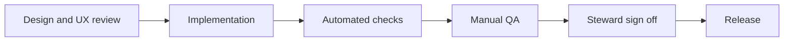

<!-- [KFM_META_BLOCK_V2]
doc_id: kfm://doc/74c91b0b-16e1-47a7-b63c-352b15db4267
title: KFM UI Accessibility Checklist
type: standard
version: v1
status: draft
owners: ui-platform, accessibility-stewards
created: 2026-03-04
updated: 2026-03-04
policy_label: public
related: [
  docs/guides/ui/,
  docs/guides/ui/checklists/,
  docs/standards/governance/
]
tags: [kfm, ui, a11y, checklist]
notes: [
  "Fail-closed checklist for UI changes. Items are tagged CONFIRMED / PROPOSED / UNKNOWN per KFM evidence discipline."
]
[/KFM_META_BLOCK_V2] -->

# KFM UI A11y Checklist
Accessibility checklist for KFM UI surfaces (Map Explorer, Timeline, Stories, Focus Mode, Evidence Drawer, Admin/Steward).


**Status:** draft (use now; tighten into CI gates as tooling lands)  
**Owners:** UI Platform + Accessibility Stewards  
**Where it fits:** `docs/guides/ui/checklists/a11y-checklist.md`  
**Primary principle:** accessibility is part of the *governed UX contract* (not polish).

**Quick nav**
- [Scope](#scope)
- [Conformance target](#conformance-target)
- [Evidence discipline](#evidence-discipline)
- [Stage gates](#stage-gates)
- [Component checklists](#component-checklists)
- [Test matrix](#test-matrix)
- [Unknowns and verification steps](#unknowns-and-verification-steps)
- [References](#references)

---

## Scope

### In scope
- **KFM front-end UI** behavior and content: navigation, controls, panels, drawers, stories, charts, maps, exports.
- **UI artifacts** shipped or published with UI changes (screenshots, diagrams, embedded media).

### Out of scope
- Backend/API accessibility (except where it impacts UI outputs like exports).
- Native desktop/mobile shells (unless the KFM UI is embedded).

---

## Conformance target

- **[PROPOSED]** KFM UI targets **WCAG 2.2 Level AA** conformance for public-facing surfaces, and “best-effort AA” for restricted/admin surfaces (still must be keyboard-usable, labeled, and readable).

> If your governance policy sets a different target (A vs AA vs AAA), update this section and treat it as a *hard gate*.

---

## Evidence discipline

### Labels
- **CONFIRMED** — required by a standard/spec (e.g., WCAG/ARIA) *or* explicitly required by KFM governance docs.
- **PROPOSED** — recommended KFM practice (strong default), not yet an enforced requirement.
- **UNKNOWN** — cannot be asserted without repo/policy confirmation; includes the smallest steps to confirm.

### What to attach to a UI PR
- **[PROPOSED]** A11y evidence bundle in the PR description (or as an artifact), including:
  - Keyboard-only walkthrough notes (what was tested + results)
  - Screen reader spot-check notes (NVDA/JAWS/VoiceOver — pick at least one)
  - Zoom test notes (200%)
  - Any a11y tool output (axe, Lighthouse, etc.) when available
  - Screenshots/GIFs for focus states and any complex widgets

---

## Stage gates



### Gate 0 — Design and UX review (before coding)

- [ ] **[CONFIRMED][KFM]** Identify *all* interactive regions: LayerPanel, EvidenceDrawer, Timeline controls, Search, dialogs, Focus Mode chat, exports.
- [ ] **[CONFIRMED][WCAG]** Ensure **information is not conveyed by color alone** (e.g., policy badges, status indicators, map legends).  
- [ ] **[PROPOSED]** For every visual-only element (map, chart, heatmap), define an **accessible alternative** (data table, list, textual summary, or “inspect panel” that exposes the same information).
- [ ] **[PROPOSED]** Define focus order and focus return behavior for overlays/drawers before implementation.
- [ ] **[PROPOSED]** Define reduced-motion behavior for animations and time-based playback (timeline scrub, animated overlays).

### Gate 1 — Implementation (developer checklist)

#### Perceivable
- [ ] **[CONFIRMED][WCAG]** All non-text content has a text alternative (images, icons, charts, map snapshots).
- [ ] **[CONFIRMED][KFM]** UI panels and overlays maintain readable contrast (target: ≥ 4.5:1 for normal text).
- [ ] **[CONFIRMED][WCAG]** Text can be resized (at least 200% zoom) without loss of information or functionality.
- [ ] **[PROPOSED]** Provide clear labels and/or captions for legends, color scales, and symbology (especially in map/charts).

#### Operable
- [ ] **[CONFIRMED][KFM]** Layer controls and Evidence Drawer are keyboard navigable with visible focus.
- [ ] **[CONFIRMED][WCAG]** All functionality is keyboard operable (no keyboard traps).
- [ ] **[CONFIRMED][WCAG 2.2]** Any functionality that uses dragging has a non-dragging alternative (e.g., buttons, stepper controls, keyboard operations).
- [ ] **[CONFIRMED][WCAG 2.2]** Target size and/or spacing supports reliable pointer activation for controls.
- [ ] **[PROPOSED]** Provide “Skip to main content” and (where relevant) “Skip map” / “Skip timeline” links.

#### Understandable
- [ ] **[CONFIRMED][WCAG]** Page has a single `<h1>` and uses headings in logical order.
- [ ] **[CONFIRMED][WCAG]** Form controls have labels, errors are explained in text, and error recovery is possible.
- [ ] **[CONFIRMED][WCAG 2.2]** Avoid redundant re-entry in multi-step flows; reuse previously provided values where possible.
- [ ] **[PROPOSED]** Focus Mode and policy-related abstentions are written plainly and consistently (“what happened / why / what you can do next”).

#### Robust
- [ ] **[CONFIRMED][WCAG]** Use semantic HTML first (buttons are `<button>`, links are `<a>`, lists are `<ul>/<ol>`, etc.).
- [ ] **[CONFIRMED][WAI-ARIA]** If ARIA is used, roles/states/properties are valid and reflect real behavior.
- [ ] **[PROPOSED]** Follow ARIA Authoring Practices patterns for custom widgets; avoid “ARIA soup”.

### Gate 2 — Automated checks (CI and local)

- [ ] **[UNKNOWN]** Repo has eslint + jsx-a11y configured (verify and document the command in this file).
- [ ] **[PROPOSED]** Add an automated a11y smoke test for critical routes (Map Explorer, Story Reader, Focus Mode).

Example commands (replace with real repo commands):

```bash
# PSEUDOCODE — replace with actual scripts
npm run lint
npm run test
npm run test:a11y
npm run test:e2e
```

### Gate 3 — Manual QA (must be done for any UI affecting interaction)

- [ ] **[CONFIRMED][WCAG]** Keyboard-only: reach *all* controls, operate them, and always see focus.
- [ ] **[CONFIRMED][WCAG 2.2]** Focus is not fully obscured when moving through overlays/drawers/modals.
- [ ] **[PROPOSED]** Screen reader spot-check on at least one platform:
  - macOS VoiceOver + Safari **or**
  - NVDA + Firefox/Chrome (Windows) **or**
  - JAWS + Chrome/Edge (Windows)
- [ ] **[PROPOSED]** Zoom 200% + reflow: verify no essential content becomes unreachable.
- [ ] **[PROPOSED]** Reduced motion: verify animations have a safe alternative or can be disabled.

### Gate 4 — Steward sign-off (release readiness)

- [ ] **[PROPOSED]** A11y evidence bundle is attached to the PR and linked in release notes.
- [ ] **[PROPOSED]** Any known gaps are tracked as issues with severity and mitigation notes.

---

## Component checklists

### Map Explorer and MapCanvas (MapLibre/Cesium)

- [ ] **[CONFIRMED][KFM]** Map controls have text labels / ARIA labels (no unlabeled icon-only controls).
- [ ] **[CONFIRMED][WCAG]** Provide a non-visual path to the same information (FeatureInspectPanel, list/table, or search-driven inspection).
- [ ] **[CONFIRMED][WCAG 2.2]** Map interactions that are drag-based have alternatives:
  - zoom buttons and keyboard zoom
  - pan via keyboard shortcuts
  - feature selection via list/search + inspect panel (not only “click the map”)
- [ ] **[CONFIRMED][WCAG]** Legend and symbology are available outside the canvas/webgl surface (DOM content).
- [ ] **[PROPOSED]** Provide a “Map help” section with keyboard shortcuts and interaction tips.

### LayerPanel

- [ ] **[CONFIRMED][KFM]** Keyboard navigable toggles/sliders with visible focus.
- [ ] **[CONFIRMED][WCAG]** Sliders expose current value textually and have keyboard operations (step increments).
- [ ] **[PROPOSED]** Layer opacity and filters have reset buttons that are reachable and labeled.

### Timeline controls

- [ ] **[CONFIRMED][WCAG]** Timeline can be controlled by keyboard (step, jump, range selection if present).
- [ ] **[CONFIRMED][WCAG 2.2]** Dragging a scrubber has a non-drag alternative (buttons, direct input).
- [ ] **[PROPOSED]** Provide a textual summary of the current time window selection.

### Evidence Drawer

- [ ] **[CONFIRMED][KFM]** Evidence Drawer is reachable from keyboard and operable without a mouse.
- [ ] **[PROPOSED]** Evidence lists support:
  - semantic list markup
  - clear link text (not “click here”)
  - status text that does not rely on color

### Story Mode and Story rendering

- [ ] **[CONFIRMED][WCAG]** Headings, lists, and quotes are represented semantically.
- [ ] **[CONFIRMED][WCAG]** Links have meaningful text, and external links are indicated (if applicable).
- [ ] **[PROPOSED]** Any embedded media has captions/transcripts or a text summary.

### Focus Mode chat

- [ ] **[PROPOSED]** New assistant messages are announced appropriately (live region strategy) without overwhelming users.
- [ ] **[PROPOSED]** The chat input has a clear label, error text, and support for multiline input if used.
- [ ] **[CONFIRMED][KFM]** Abstentions/restrictions are communicated clearly and consistently, and users can access the evidence drawer from citations.

### Export flows (reports, downloads)

- [ ] **[CONFIRMED][KFM]** Export outputs include citations and an audit reference in a readable format.
- [ ] **[PROPOSED]** Export format is accessible (tagged PDF if PDF; structured HTML if HTML; avoid image-only exports).

---

## Test matrix

| Test | Minimum | Notes |
|---|---:|---|
| Keyboard-only navigation | Required | No traps; visible focus |
| Zoom | 200% | Verify reflow and reachability |
| Screen reader | 1 platform minimum | Rotate platforms over releases |
| Automated scanner | Strongly recommended | axe/Lighthouse where feasible |
| Reduced motion | Recommended | Respect user preference settings |
| High contrast / forced colors | Recommended | Especially for icon-only controls |

---

## Unknowns and verification steps

- **[UNKNOWN]** KFM’s official accessibility conformance target (A vs AA vs AAA).  
  **Verify:** adopt/record a governance decision (ADR or policy doc) and update [Conformance target](#conformance-target).

- **[UNKNOWN]** Current repo toolchain for a11y testing (axe, Playwright, Lighthouse, eslint-plugin-jsx-a11y).  
  **Verify:** inventory `package.json` scripts + CI workflow steps; document real commands under [Gate 2](#gate-2--automated-checks-ci-and-local).

- **[UNKNOWN]** Supported browser/AT matrix (which combinations are “must pass”).  
  **Verify:** define and publish support policy; update [Test matrix](#test-matrix) with minimum required combinations.

---

## References

Primary standards and guidance:
- WCAG 2.2 (W3C Recommendation): https://www.w3.org/TR/WCAG22/
- What’s new in WCAG 2.2: https://www.w3.org/WAI/standards-guidelines/wcag/new-in-22/
- WAI-ARIA 1.2: https://www.w3.org/TR/wai-aria-1.2/
- ARIA Authoring Practices Guide (APG): https://www.w3.org/WAI/ARIA/apg/

Selected WCAG 2.2 “Understanding” pages used by this checklist:
- Focus not obscured (minimum): https://www.w3.org/WAI/WCAG22/Understanding/focus-not-obscured-minimum
- Dragging movements: https://www.w3.org/WAI/WCAG22/Understanding/dragging-movements.html
- Target size (minimum): https://www.w3.org/WAI/WCAG22/Understanding/target-size-minimum.html
- Accessible authentication (minimum): https://www.w3.org/WAI/WCAG22/Understanding/accessible-authentication-minimum.html
- Redundant entry: https://www.w3.org/WAI/WCAG22/Understanding/redundant-entry.html

Back to top: [↑](#kfm-ui-a11y-checklist)
