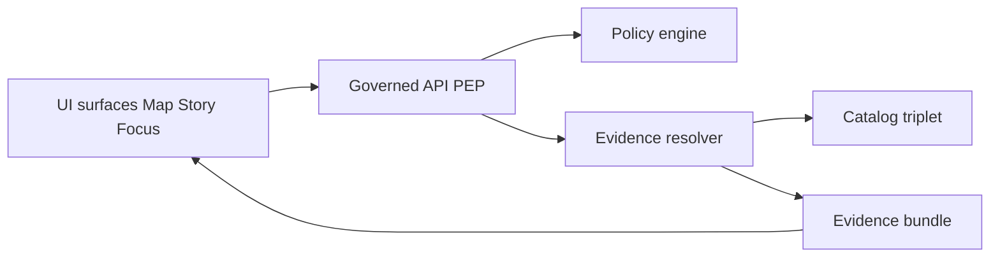

<!-- [KFM_META_BLOCK_V2]
doc_id: kfm://doc/7c79c7e9-8f9c-4d0f-aed3-5dd8d7c8d7f6
title: Evidence Surface Checklist
type: standard
version: v1
status: draft
owners: ["@kfm-ui (TODO)", "@kfm-governance (TODO)"]
created: 2026-03-04
updated: 2026-03-04
policy_label: public
related: [
  "docs/guides/ui/README.md (TODO)",
  "docs/specs/evidence/README.md (TODO)",
  "docs/standards/policy/README.md (TODO)"
]
tags: ["kfm","ui","checklist","evidence","trust-membrane","policy"]
notes: [
  "UI must make trust visible without making policy decisions.",
  "Assumes a governed API (PEP) + evidence resolver that turns EvidenceRefs into EvidenceBundles."
]
[/KFM_META_BLOCK_V2] -->

# Evidence Surface Checklist
Make **evidence, license/rights, policy labels, and provenance** first-class UI surfaces (Map, Story, Focus) — without bypassing governance.

---

## Impact
- **Status:** draft
- **Owners:** @kfm-ui (TODO), @kfm-governance (TODO)
- **Applies to:** Map Explorer, Story Nodes, Focus Mode, exports/downloads
- **Non-negotiables:** trust membrane, evidence-first UX, cite-or-abstain, fail-closed

  

**Quick nav:**  
[Scope](#scope) · [Where it fits](#where-it-fits) · [Inputs](#acceptable-inputs) · [Exclusions](#exclusions) ·
[Principles](#principles) · [Minimum Evidence Drawer](#minimum-evidence-drawer-contract) ·
[Map Checklist](#map-explorer-checklist) · [Story Checklist](#story-nodes-checklist) ·
[Focus Checklist](#focus-mode-checklist) · [Exports](#exports-and-downloads-checklist) ·
[Tests](#tests-and-gates) · [Definition of Done](#definition-of-done) · [Appendix](#appendix)

---

## Scope
This checklist covers **UI evidence surfacing** for any user-visible output that might be interpreted as a “claim,” including:
- map layers and feature details
- timeline filters and aggregations
- story paragraphs, media, and embedded maps
- Focus Mode answers
- exports/downloads (GeoJSON, CSV, images, PDFs)

It is intentionally **UI-focused**:
- it does **not** define policy rules
- it does **not** define catalog schemas
- it **does** define what the UI must show and how it must behave (fail-closed, policy-safe)

---

## Where it fits
**Path:** `docs/guides/ui/checklists/evidence-surface-checklist.md`

**Upstream (expected):**
- Catalog triplet: DCAT + STAC + PROV
- Run receipts / audit references (runs, promotions, Focus queries)
- Governed API (PEP) that enforces policy and exposes evidence resolution

**Downstream (UI surfaces):**
- Map Explorer evidence drawer
- Story Node citation panels and publish gate UI
- Focus Mode citations + audit_ref panel

---

## Acceptable inputs
The UI should only render evidence that comes through **governed APIs**.

### Required runtime inputs (UI-level)
- `EvidenceRef` (opaque reference emitted by API)
- `EvidenceBundle` (resolved evidence, policy-filtered)
- `policy_label` and any **obligations** relevant to rendering (e.g., “generalized geometry,” “no export,” “attribution required”)
- `dataset_version_id` (pinned identifier, not “latest”)
- `audit_ref` for governed runs (Focus queries; story publish events; dataset promotions)

> If any of the above is missing for a claim-like surface, the UI must treat it as **not eligible for display** (or must clearly mark it as **unsupported / unverifiable**).

---

## Exclusions
The following are **not allowed** in UI code or UI behavior:
- **No direct client access to storage or databases** (no “signed URL to raw bucket” shortcuts).
- **No UI-side “citation guessing”** (no pasting URLs or building links without an EvidenceRef).
- **No policy decisions in UI** (UI shows policy badges and policy-safe messaging; it does not decide allow/deny).
- **No rendering of restricted metadata on deny** (403/404 must not leak dataset names, extents, or precise locations).

---

## Principles
These principles guide every checklist item.

| Principle | Status | Meaning in UI practice |
|---|---:|---|
| Trust membrane | CONFIRMED | UI only calls governed APIs; no direct storage/DB access. |
| Evidence-first UX | CONFIRMED | Every layer/claim opens into evidence: dataset version, license/rights, policy label, provenance chain, checksums, artifact links. |
| Cite-or-abstain | CONFIRMED | If citations (EvidenceRefs) can’t be verified/resolved for the user, the UI must show abstention or reduce scope messaging. |
| “Citation” is EvidenceRef, not a URL | CONFIRMED | UI displays and navigates EvidenceRefs that resolve into EvidenceBundles. |
| “Fail closed” on missing evidence | PROPOSED | If required evidence fields are absent, default to: hide claim / show “unverified” banner / disable publish/export. |
| Keyboard navigable evidence drawer | CONFIRMED | Evidence drawer is accessible and keyboard navigable (focus trap, escape, ARIA). |

---

## UI Evidence Surface Map
At minimum, the following UI elements must have an “Evidence” entry point.

| UI Surface | What counts as a “claim” | Evidence entry point required |
|---|---|---|
| Layer list item | Layer title, description, “last updated,” styling that implies facts | “Evidence” button on layer card |
| Map feature popup | Any attribute shown (name, category, value) | “Open evidence” link/button |
| Timeline / charts | Aggregations and derived values (counts, rates) | “What is this based on?” evidence link |
| Story paragraph / media | Narrative sentences and embedded figures | Inline citation chips + panel |
| Focus answer | Factual statements in answer text | Citation chips + “Evidence used” panel + audit_ref |
| Export / download | Any exported data/image | Export modal shows license/rights + evidence bundle list |

---

## Minimum Evidence Drawer Contract
The evidence drawer is the primary “trust surface.” It must be reachable from **Map**, **Story**, and **Focus**.

### Required fields (rendered)
The UI must be able to render the following fields if present in the EvidenceBundle.

| Field | Required | Notes |
|---|---:|---|
| dataset_id | MUST | Stable ID (not title). |
| dataset_version_id | MUST | Must be pinned; avoid “latest” wording in UI. |
| title | MUST | Human-friendly dataset name. |
| publisher / provider | MUST | Show attribution at point-of-use. |
| license / rights | MUST | Display summary + link to full terms; include attribution text if required. |
| policy_label | MUST | Badge + short explanation. |
| obligations | MUST (if non-empty) | Render as human-readable warnings (e.g., generalized geometry, no export). |
| provenance summary | SHOULD | “Derived from” + run/pipeline identity when available. |
| checksums / digests | SHOULD | Prefer sha256; show for artifacts used. |
| artifact links | SHOULD | Link to STAC assets / DCAT distributions through governed endpoints. |
| temporal / spatial extents | SHOULD (policy-safe) | Must respect policy; generalized extents allowed when required. |
| audit references | SHOULD | For governed runs or story publishing events. |

### Required interactions
- **Open from anywhere:** map click, story citation, focus citation
- **Copy reference:** copy EvidenceRef and dataset_version_id (not raw URLs)
- **Policy-safe deny handling:** show “Not available under current permissions” without leaking details
- **Accessibility:** keyboard navigable; focus management; screen reader labels

[Back to top](#evidence-surface-checklist)

---

## Map Explorer Checklist
### A. Layer panel
- [ ] Each layer card shows **policy badge** (policy_label) and **license** indicator (short form).
- [ ] Each layer card shows a pinned **dataset_version_id** (or “Version: <id>”).
- [ ] Each layer card has an **Evidence** button that opens the evidence drawer.
- [ ] “Data freshness” text (if shown) must be derived from version metadata (never implied as “live” unless proven).
- [ ] If layer is **not promotable / not published**, it must be visually distinct and not selectable for public users.

### B. Feature click / popup
- [ ] Feature popup never displays attributes without an evidence entry point.
- [ ] Feature popup includes:
  - [ ] citation chips (EvidenceRefs) or “Evidence” button
  - [ ] policy badge (if relevant)
  - [ ] “generalized/approximate” disclaimers when required by obligations
- [ ] If evidence resolve fails:
  - [ ] show policy-safe message
  - [ ] do not render feature attributes beyond what is allowed
  - [ ] do not show raw IDs that imply restricted dataset names

### C. Timeline + aggregations
- [ ] Any derived number (count, average, rate) has an evidence link.
- [ ] If aggregation thresholds apply (e.g., minimum counts), UI displays threshold rules (policy-safe).
- [ ] UI indicates whether values are:
  - [ ] direct observations
  - [ ] derived products
  - [ ] model outputs
  - [ ] summaries

### D. Map UI a11y (evidence)
- [ ] Evidence drawer is keyboard navigable (tab order, escape to close).
- [ ] Evidence drawer has ARIA labels and heading structure.
- [ ] Evidence drawer does not trap users (focus returns to trigger element).

---

## Story Nodes Checklist
Story is a governed publishing surface.

### A. Authoring
- [ ] Every paragraph with factual claims includes at least one **citation chip** (EvidenceRef).
- [ ] Media (images, scanned docs, audio) includes rights/licensing metadata surfaced in UI.
- [ ] Embedded maps in stories include “Evidence” entry points for active layers and features.

### B. Review + publish gate (UI behavior)
- [ ] Publish button is disabled unless:
  - [ ] all citations resolve to EvidenceBundles for the author’s role
  - [ ] rights/licensing are present for all media
  - [ ] policy obligations are satisfied (e.g., redaction/generalization proofs if required)
- [ ] If publish is blocked, UI shows:
  - [ ] what failed (policy-safe)
  - [ ] how to fix (link to required fields)
  - [ ] review workflow / steward handoff instructions (if applicable)

### C. Reader view
- [ ] Inline citations are clickable and open the evidence drawer.
- [ ] Story shows pinned story version and (if available) an audit reference for publish event.
- [ ] Denied citations render as policy-safe placeholders (no leakage).

[Back to top](#evidence-surface-checklist)

---

## Focus Mode Checklist
Focus Mode is a governed Q&A surface.

### A. Required answer metadata surfaces
- [ ] Answer includes citation chips that reference **EvidenceRefs** (not URLs).
- [ ] “Evidence used” panel lists EvidenceBundles referenced (deduped).
- [ ] UI shows **audit_ref** for the run (copyable) and a “Report issue / request review” path.

### B. Abstention and partial answers
- [ ] If citations cannot be verified/resolved, UI must show:
  - [ ] abstention (clear, non-judgmental)
  - [ ] what is missing (policy-safe)
  - [ ] what is allowed instead (public alternatives)
  - [ ] audit_ref for follow-up
- [ ] Partial answers must clearly separate:
  - [ ] evidence-supported portion
  - [ ] abstained portion

### C. Policy-safe handling
- [ ] Focus must not reveal restricted dataset existence (“restricted dataset list”).
- [ ] Focus must not render precise sensitive coordinates unless explicitly allowed.
- [ ] Focus must not allow “copy raw excerpt” from restricted corpora without policy allowance.

### D. UX and accessibility
- [ ] Citation chips are keyboard reachable and screen-reader labeled.
- [ ] Evidence drawer opens from citations without losing chat scroll position.
- [ ] Errors include “try again” only when safe; do not encourage repeated queries that might probe policy.

---

## Exports and Downloads Checklist
Exports are high-risk because they move data off-platform.

- [ ] Export UI always shows:
  - [ ] license/rights summary (and attribution text)
  - [ ] policy_label badge
  - [ ] obligations (e.g., “no export,” “generalized only,” “min count threshold”)
  - [ ] evidence bundles included in export
- [ ] Export format choices are policy-gated:
  - [ ] hide/disable prohibited formats (e.g., raw points)
  - [ ] prefer generalized geometries if required
- [ ] Exported artifacts must embed:
  - [ ] dataset_version_id
  - [ ] license/attribution text
  - [ ] evidence bundle IDs or resolvable references (where feasible)

---

## Tests and gates
### Minimum automated checks (recommended)
| Test type | What it proves | Minimum cases |
|---|---|---|
| UI E2E | evidence entry points exist and open | layer card, feature popup, story citation, focus citation |
| Contract test | UI calls governed endpoint only | no direct storage URL usage; evidence resolve required |
| Policy-safe deny tests | no metadata leakage on deny | denied citation shows safe placeholder |
| Accessibility tests | drawer is navigable | keyboard-only open/close, focus return, screen reader labels |
| Snapshot / golden tests | stable evidence rendering | same bundle renders same fields in same order |

### Example Playwright-style pseudocode
```ts
// pseudocode
test("feature popup can open evidence drawer", async ({ page }) => {
  await page.goto("/map");
  await page.getByRole("button", { name: "Layer soils" }).click();
  await page.getByRole("button", { name: "Map canvas" }).click(); // click a feature

  await page.getByRole("button", { name: "Open evidence" }).click();

  await expect(page.getByRole("dialog", { name: "Evidence" })).toBeVisible();
  await expect(page.getByText("dataset_version_id")).toBeVisible();
  await expect(page.getByText("license")).toBeVisible();
});
```

---

## Unknowns
Mark these as **UNKNOWN** until verified in the live repo or contracts.
- UNKNOWN: EvidenceBundle schema fields and naming (exact keys, nested structure).
- UNKNOWN: EvidenceRef format (URI scheme, stability guarantees).
- UNKNOWN: Canonical UI component names/paths for evidence drawer and citation chips.
- UNKNOWN: Export embedding requirements (how to embed license/version in each format).

**Smallest verification steps**
1. Confirm EvidenceBundle JSON schema in `contracts/` (or equivalent).
2. Confirm evidence resolver endpoint(s) and response shapes.
3. Confirm current UI component library patterns (drawer, chips, badges).
4. Add one vertical-slice fixture: a sample EvidenceRef + resolved EvidenceBundle used in UI tests.

---

## Definition of Done
A PR implementing or changing UI evidence surfacing is “done” only when:

- [ ] No UI path bypasses the governed API.
- [ ] All claim-like surfaces have an evidence entry point.
- [ ] Evidence drawer meets minimum fields and accessibility.
- [ ] Deny behavior is policy-safe (no leakage).
- [ ] Focus Mode supports citations + audit_ref and abstention UI.
- [ ] Export flows are rights/policy-gated and include attribution.
- [ ] E2E tests cover map, story, focus evidence entry points.
- [ ] Docs updated (this checklist + any related UI guide).

---

## Diagram


---

## Appendix
<details>
<summary>Appendix A: Suggested EvidenceBundle render order</summary>

1. Identity: dataset_id, dataset_version_id, title  
2. Permissions: policy_label, obligations  
3. Rights: license, attribution text, rights holder (if present)  
4. Provenance: derived_from, run receipt links, tool versions (if present)  
5. Integrity: checksums/digests for artifacts used  
6. Assets: links to STAC assets / DCAT distributions (policy-filtered)  
7. Extents: spatial/temporal coverage (policy-safe)

</details>

<details>
<summary>Appendix B: Policy-safe denial copy examples</summary>

- “This evidence is not available under your current access level.”  
- “Some sources used to answer this question are restricted. Try narrowing your question to public datasets.”  
- “Export is disabled for this layer due to licensing or sensitivity restrictions.”

</details>

[Back to top](#evidence-surface-checklist)
