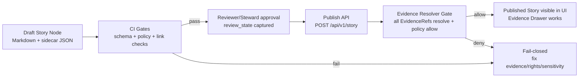

<!-- [KFM_META_BLOCK_V2]
doc_id: kfm://doc/6e3b2f4b-5b23-4d5f-9b3d-4d6a1c4f1e3a
title: Story Publish Checklist
type: standard
version: v1
status: draft
owners: [TBD]
created: 2026-03-04
updated: 2026-03-04
policy_label: public
related:
  - docs/guides/ui/story-nodes/README.md
  - docs/standards/governance/ROOT-GOVERNANCE.md
  - docs/standards/policy/README.md
tags: [kfm, ui, story, checklist, publish, evidence]
notes:
  - "Checklist for Story Node v3 publishing gates (review + citations + rights + sensitivity)."
[/KFM_META_BLOCK_V2] -->

# Story Publish Checklist
One-page gate checklist for publishing Story Nodes (v3) in the KFM UI.

> **Rule of thumb:** If it can’t be traced to evidence (and shown in the Evidence Drawer), it can’t be published.

---

## Impact
- **Status:** draft (this doc), intended for GOVERNED workflow
- **Owners:** `TBD` (suggest: UI steward + policy steward)
- **Applies to:** Story Node **v3** authoring + review + publish
- **Hard gates:** **resolvable citations**, **review state captured**, **rights/sensitivity cleared**
- **Quick nav:** [Scope](#scope) · [Where it fits](#where-it-fits) · [Inputs](#inputs) · [Exclusions](#exclusions) · [Checklist](#checklist) · [Automation hooks](#automation-hooks) · [Appendix](#appendix)

---

## Scope
This checklist covers **publishing** a Story Node that binds:
- narrative Markdown (human-readable), and
- a sidecar JSON capturing **map state + citations + policy + review state**.

It is intended to be used in **both**:
1) **CI** (schema + policy checks; fail-closed), and  
2) **runtime publish** (API-level policy checks; fail-closed).

**Legend for each checklist item**
- **[CONFIRMED]** = explicitly required or described in KFM design/governance docs.
- **[PROPOSED]** = recommended practice (safe default) that is not yet explicitly mandated.
- **[UNKNOWN]** = needs governance decision or an authoritative spec link before treating as required.

---

## Where it fits
Story publishing sits inside the governed “trust membrane”:



---

## Inputs
- **Story Markdown file** containing:
  - KFM MetaBlock v2 (doc identity + policy label + related dataset versions)
  - claims/narrative with **inline citations** (EvidenceRefs)
- **Story sidecar JSON** containing:
  - `kfm_story_node_version: "v3"`
  - `status`, `policy_label`, `review_state`
  - `map_state` (bbox/zoom/time/layers)
  - `citations[]` (EvidenceRefs)

---

## Exclusions
This checklist does **not** replace:
- dataset promotion gates (RAW → WORK → PROCESSED → PUBLISHED),
- DCAT/STAC/PROV validation for datasets,
- style/voice editorial guidance (writing quality),
- performance profiling of large layers.

---

## Checklist

### 0) Preflight
- [ ] **[CONFIRMED]** The Story Node target audience is known (public vs restricted) and the **policy_label** is chosen accordingly.
- [ ] **[CONFIRMED]** You can name the exact **dataset_version_id**(s) the story relies on (no “latest” references).
- [ ] **[PROPOSED]** You have a short “what changed / why now” note for reviewers (especially if republishing).

### 1) Story Node structure and identity
- [ ] **[CONFIRMED]** Markdown file has a **KFM MetaBlock v2** with stable `doc_id`, `title`, `type: story`, `version: v3`, `status`, `owners`, `created`, `updated`, `policy_label`.
- [ ] **[CONFIRMED]** MetaBlock `related[]` includes `kfm://dataset/<slug>@<dataset_version_id>` for each dataset the story relies on.
- [ ] **[CONFIRMED]** Sidecar JSON exists and declares `kfm_story_node_version: "v3"`.
- [ ] **[CONFIRMED]** Sidecar includes `review_state` (e.g., `needs_review`) and matches the story status lifecycle.
- [ ] **[PROPOSED]** Story directory includes a lightweight `README.md` describing the intent + main datasets (optional but helpful for audits).

### 2) Map state capture (what the story *shows*)
- [ ] **[CONFIRMED]** Sidecar includes `map_state` and pins:
  - bbox + zoom (and bearing/pitch if used),
  - time window,
  - list of visible layers **including dataset_version_id per layer**.
- [ ] **[PROPOSED]** Map state is minimal but sufficient: avoid storing transient UI noise (panel widths, ephemeral hover IDs).
- [ ] **[UNKNOWN]** Canonical storage location and naming convention for Story Nodes (needs repo-wide decision if not already standardized).

### 3) Claims and citations (EvidenceRef, not URLs)
- [ ] **[CONFIRMED]** Every material claim has at least one **EvidenceRef** citation (not a pasted URL).
- [ ] **[CONFIRMED]** Every citation resolves via the Evidence Resolver into an **EvidenceBundle** (metadata + allowed artifacts + digests + audit refs).
- [ ] **[CONFIRMED]** If any citation does not resolve or is not policy-allowed, the story is changed to:
  - narrow the claim, **or**
  - remove the claim, **or**
  - mark it as non-publishable (fail-closed).
- [ ] **[PROPOSED]** Citations appear in both:
  - the claim list (“Claims” section), and
  - inline in narrative where the claim is stated.
- [ ] **[PROPOSED]** No “floating citations”: each citation is clearly tied to a specific sentence/claim.

### 4) Rights, licensing, and attribution (media + data)
- [ ] **[CONFIRMED]** For every dataset or media asset referenced or embedded, **rights are explicit** (license + rights holder as applicable).
- [ ] **[CONFIRMED]** If rights are unclear for included media, publishing is blocked (fail-closed).
- [ ] **[CONFIRMED]** UI presentation (or exports) includes attribution and license text when required.
- [ ] **[PROPOSED]** If mirroring media is not permitted, story uses **metadata-only references** and points to evidence bundles instead of embedding copies.

### 5) Sensitivity, restricted locations, and redaction/generalization
- [ ] **[CONFIRMED]** Story does not embed precise restricted/sensitive coordinates unless policy explicitly allows it.
- [ ] **[CONFIRMED]** If any public representation is allowed for a restricted dataset, it uses a **public generalized** derivative (not the restricted original).
- [ ] **[CONFIRMED]** Redaction/generalization is treated as a first-class transform and is recorded in provenance (PROV).
- [ ] **[PROPOSED]** Renderer preflight checks exist for common leakage vectors:
  - clustering/jitter for sensitive points,
  - temporal coarsening when required,
  - attribute masking for PII/rare combos.

### 6) Review workflow and approvals
- [ ] **[CONFIRMED]** The story has a reviewer/editor assigned and the reviewer action is reflected in `review_state`.
- [ ] **[CONFIRMED]** Steward approval is obtained before publish (steward is accountable for policy label + redaction posture).
- [ ] **[CONFIRMED]** If culturally sensitive (e.g., Indigenous heritage materials), governance council/community stewards are consulted as required.
- [ ] **[PROPOSED]** Review produces a short audit note (what was checked, what changed).

### 7) UI trust surfaces must work (Evidence Drawer)
- [ ] **[CONFIRMED]** In Story UI, clicking a citation opens the Evidence Drawer (or equivalent) showing:
  - dataset version,
  - license/rights,
  - policy badge/decision,
  - links to provenance where allowed.
- [ ] **[CONFIRMED]** Evidence surfaces are accessible (keyboard navigation where specified).
- [ ] **[PROPOSED]** “What changed?” between dataset versions is discoverable when a newer dataset exists (even if story remains pinned).

### 8) CI and runtime policy parity
- [ ] **[CONFIRMED]** CI uses the same policy semantics (or the same fixtures/outcomes) as runtime policy checks.
- [ ] **[CONFIRMED]** CI blocks merge/publish when:
  - story schema fails,
  - citations don’t resolve,
  - rights/sensitivity gates fail,
  - required review state is missing.
- [ ] **[PROPOSED]** A link-checker validates key cross-links used by evidence resolution (DCAT↔STAC↔PROV).

### 9) Publish action and rollback
- [ ] **[CONFIRMED]** Publish action is executed through governed API (e.g., `POST /api/v1/story`) and records an auditable event.
- [ ] **[PROPOSED]** Publish produces a small “publish receipt” (who/when/what policy decision, story id + version id).
- [ ] **[PROPOSED]** Rollback is documented and fast:
  - unpublish/hide story from public surfaces,
  - revert to last approved version,
  - keep audit trail intact.

---

## Automation hooks
These are placeholders until the repo exposes canonical scripts/workflows.

### Local preflight (PROPOSED)
```bash
# Pseudocode: validate story schema + resolve citations (fail-closed)
kfm story validate ./path/to/story.md ./path/to/story.sidecar.json
kfm story citations-resolve ./path/to/story.sidecar.json --fail-on-deny
```

### CI gate (PROPOSED)
```bash
# Pseudocode: run policy + schema checks
conftest test stories/**/story-node.json -p policy/rego
```

---

## Appendix

### A) Minimal “Definition of Done” for publish
A Story Node is publishable only when:
- all citations resolve to EvidenceBundles and are policy-allowed,
- review state is captured and steward approval exists,
- rights/sensitivity obligations are satisfied,
- map state is pinned to dataset versions,
- UI can display evidence (license/version/policy) without bypassing policy.

### B) Glossary
- **EvidenceRef:** A structured citation reference (scheme-based), not an arbitrary URL.
- **EvidenceBundle:** The resolved object returned by evidence resolver: policy decision + license + digests + artifact refs + audit refs.
- **Policy label:** The classification controlling what can be shown to which user roles (e.g., public vs restricted).
- **Fail-closed:** If uncertain (rights, sensitivity, evidence), the system denies publish rather than guessing.

---

_Back to top_: [Story Publish Checklist](#story-publish-checklist)
