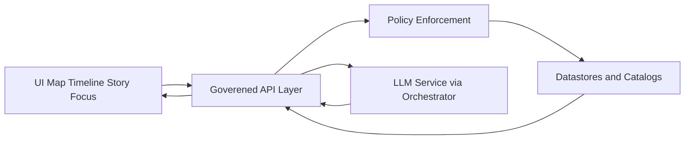

<!-- [KFM_META_BLOCK_V2]
doc_id: kfm://doc/0d2e6998-5324-4c8d-9a0a-7f2c7dfc9d05
title: KFM UI Design Guide
type: standard
version: v1
status: draft
owners: ui-platform
created: 2026-03-04
updated: 2026-03-04
policy_label: public
related: [docs/guides/ui/design/README.md]
tags: [kfm, ui, design, governance, a11y]
notes: [Design system + UX governance for Map, Timeline, Story, Focus Mode.]
[/KFM_META_BLOCK_V2] -->

# UI Design Guide
Design system, UX principles, and governance constraints for KFM’s map-first, evidence-first UI.

---

## Impact
- **Status:** `draft` (PROPOSED)
- **Owners:** `ui-platform` (UNKNOWN — set CODEOWNERS / team handles)
- **Applies to:** Map Explorer, Timeline, Story Mode, Focus Mode (PROPOSED)
- **Non-negotiables:** **truth path**, **trust membrane**, **cite-or-abstain** UX (CONFIRMED as system posture)

**Badges (placeholders)**
-  <!-- TODO: wire to release tags -->
-  <!-- TODO -->
-  <!-- TODO -->
-  <!-- TODO -->

**Quick links**
- [Scope](#scope)
- [Where it fits](#where-it-fits)
- [Core design principles](#core-design-principles)
- [Evidence-first UX patterns](#evidence-first-ux-patterns)
- [Accessibility and inclusion](#accessibility-and-inclusion)
- [Design artifacts registry](#design-artifacts-registry)
- [Quickstart](#quickstart)
- [Definition of done](#definition-of-done)
- [Appendix](#appendix)

---

## Scope
**CONFIRMED:** KFM UI is map-first and evidence-first, and user-visible claims must be traceable to governed evidence (e.g., catalog + provenance + policy outcomes).

**PROPOSED:** This guide defines:
- UI principles and constraints that enforce governance at the UX layer (without duplicating backend policy).
- UI patterns for evidence display, uncertainty, abstention, and redaction.
- A design artifact inventory (tokens, components, templates) and quality gates.

**UNKNOWN:** Exact frameworks and packages (e.g., MapLibre vs Cesium split, Storybook presence, monorepo tooling). This doc uses conventions that you should align to the repo’s actual UI stack.

---

## Where it fits
**CONFIRMED (architecture posture):** UI/clients must not access DB/storage directly; all access must cross the governed API + policy boundary (“trust membrane”).

**PROPOSED (repo location):** `docs/guides/ui/design/` is the **human + LLM-ingestible** source for:
- UI constraints derived from governance invariants
- UI component & pattern guidance
- UX “contracts” with the API layer (what the UI expects and must render)

**Upstream (inputs)**
- Governance system invariants and truth-path lifecycle (CONFIRMED concept)
- API contracts (OpenAPI/GraphQL), policy labels, redaction obligations (CONFIRMED concept)
- Map/story domain requirements (PROPOSED)

**Downstream (outputs)**
- UI implementation conventions (component library, tokens)
- PR review checklists for UI changes
- Test expectations: a11y, visual regression, evidence rendering (PROPOSED)

---

## Acceptable inputs
Use this directory for:
- **Design tokens** (color, spacing, typography) and how they map to UI themes (PROPOSED)
- **Component specs** (interfaces, states, accessibility) (PROPOSED)
- **Interaction patterns** (map layer toggles, timeline scrub, story nodes, focus citations) (PROPOSED)
- **UX governance patterns** (redaction rendering, cite-or-abstain states, provenance drawers) (CONFIRMED intent; implementation PROPOSED)

---

## Exclusions
Do **not** put these here:
- Backend policy logic (OPA/Rego), enforcement engines, or DB query code (**CONFIRMED exclusion**)
- Dataset specs, STAC/DCAT/PROV generation details (**CONFIRMED exclusion**)
- Secrets, API keys, or private endpoints (**CONFIRMED exclusion**)
- High-fidelity visual design files that belong in a design tool system of record (**PROPOSED exclusion**; keep this repo as the governed “spec + contract” surface)

---

## Directory tree
**UNKNOWN:** The current on-disk structure of `docs/guides/ui/design/`.

**PROPOSED** expected shape (adjust to match reality):

```text
docs/guides/ui/design/
├── README.md                 # this file
├── tokens/                   # design tokens + theming rules
├── patterns/                 # UX patterns (evidence, redaction, layers, timeline)
├── components/               # component specs (states, a11y, contracts)
└── examples/                 # minimal reference implementations / screenshots
```

---

## Core design principles
These are “must preserve” constraints, not preferences.

### 1) Trust membrane UI contract
**CONFIRMED:** The UI must only talk to **governed APIs** and must never bypass policy by calling storage/databases directly.

**PROPOSED UI implication:**
- Every data fetch includes an explicit **policy context** (user role, purpose, session, scope).
- UI must be able to render “deny” and “abstain” outcomes cleanly.

### 2) Evidence-first UX
**CONFIRMED concept:** Users should be able to inspect *why* something is shown (sources, provenance, policy label).

**PROPOSED UI implication:**
- Every claim displayed has an attachable **Evidence Drawer** (citations + provenance + transformations).
- The UI shows **confidence/limitations** and supports “reduce scope” when evidence is insufficient.

### 3) Time-aware by default
**PROPOSED:** Any feature that represents “what happened” should support:
- **event time** (when it happened)
- **valid time** (when it was true)
- **transaction time** (when KFM learned/recorded it)

**UNKNOWN:** The canonical temporal model and how it maps to UI filters in this repo.

### 4) Deterministic identity surfaces
**CONFIRMED concept:** Objects (datasets, versions, artifacts) must have stable identifiers/hashes.

**PROPOSED UI implication:**
- Show stable IDs in drawers (copyable), not only human labels.
- When an item changes, show “what changed” at a high level (diff summary).

---

## Architecture diagram
**CONFIRMED posture:** UI → governed API → policy → data stores; LLM calls (if any) are orchestrated server-side.



---

## Evidence-first UX patterns

### Pattern A: Claim card with evidence
**PROPOSED:** Any textual or numeric claim shown in:
- Story Mode
- Focus Mode answers
- Map popups/tooltips

…must have:
- a **Cite** affordance (opens Evidence Drawer)
- a clear **scope label** (time window, area, dataset version)
- an explicit **policy label** (public/restricted/etc.) or a “masked” indicator

**Example state model (PROPOSED)**

| UI element | Required states | Notes |
|---|---|---|
| Claim text | loading, ready, denied, abstained, redacted | Don’t “blank” silently. |
| Evidence button | enabled, disabled, blocked | Disabled only if there is *no claim*. Blocked if policy denies. |
| Citation list | resolvable, partial, missing | Partial lists must say what’s missing and how to verify. |

### Pattern B: Abstain instead of hallucinate
**CONFIRMED (system intent):** If citations cannot be verified, the system abstains or reduces scope.

**PROPOSED UI behaviors:**
- Display “Insufficient evidence to answer at requested scope.”
- Offer narrowing actions:
  - reduce time range
  - constrain geography
  - switch to “show raw sources only”
- Provide a “What would make this confirmed?” checklist (minimal verification steps).

### Pattern C: Redaction and sensitivity rendering
**CONFIRMED concept:** Policy labels and redaction obligations exist.

**PROPOSED UI behaviors:**
- Replace sensitive fields with a consistent token (e.g., `REDACTED`)
- Preserve analytical usefulness when allowed (e.g., generalize coordinates to coarse cells)
- Provide a “Reason” line in drawer (policy obligation) without revealing restricted details

---

## Map and timeline UX conventions

### Map layer toggles
**PROPOSED:**
- Layers are grouped by domain (hazards, hydrology, climate, land, etc.)
- Each layer entry displays:
  - name
  - last updated time (transaction time)
  - license or rights marker
  - health/provenance status (if available)

### Automation status overlays
**PROPOSED (optional enhancement):**
- Render on-map badges that show pipeline run health and attestations for features/datasets.
- Clicking a badge opens an attestation/provenance drawer.

> This is a UI enhancement; it must **not** fetch attestations from untrusted origins directly in-browser (server proxy + verification recommended). (CONFIRMED as a security posture; implementation PROPOSED)

### Story nodes in map context
**PROPOSED:**
- Story nodes are deep-linkable and map-positionable.
- Transition rules:
  - map camera state changes are reversible
  - story overlays do not hide critical controls (zoom, layer toggles, timeline)

### 2D and 3D split
**PROPOSED:** Treat 3D as a **mode** (Story Node-driven) rather than a full replacement of 2D exploration.

**UNKNOWN:** Exact viewer strategy in this repo (MapLibre only, Cesium only, or hybrid).

---

## Accessibility and inclusion
**CONFIRMED (system posture):** Accessibility is a production surface; treat it as a gate, not a “nice to have.”

**PROPOSED minimum requirements:**
- Keyboard navigable: map controls, timeline, drawers, dialogs
- Screen reader support: ARIA labels and meaningful focus order
- Contrast: tokens support readable map overlays and chips
- Motion: provide reduced-motion alternatives for fly-to transitions
- Non-color cues: statuses (healthy/failing) must not rely only on color

**Practical a11y test checklist (PROPOSED)**

- [ ] Tab order reaches all interactive elements in Focus Mode and Story Mode
- [ ] Escape closes drawers/dialogs and returns focus to the opener
- [ ] Map popups are reachable by keyboard (or have an accessible equivalent list)
- [ ] Status is encoded as text + icon + color

---

## Design artifacts registry
**PROPOSED:** Keep a small registry of what “design” means in the repo so changes stay reviewable.

| Artifact | Purpose | Owner | Status | Location |
|---|---|---|---|---|
| Design tokens | Theme primitives | ui-platform | PROPOSED | `./tokens/` |
| Component specs | Contract + states + a11y | ui-platform | PROPOSED | `./components/` |
| Evidence drawer spec | Citation/provenance rendering | ui-platform + governance | PROPOSED | `./patterns/evidence/` |
| Map layer UI patterns | Layer list, legend, toggles | ui-platform | PROPOSED | `./patterns/map/` |
| Timeline patterns | Scrub, filters, time semantics | ui-platform | PROPOSED | `./patterns/timeline/` |
| Focus Mode UX | Ask flow, abstain flow, citations | ui-platform + ai-platform | PROPOSED | `./patterns/focus/` |

---

## Quickstart
**UNKNOWN:** The exact workspace tooling in this repo (npm vs pnpm vs yarn; Storybook vs Ladle; Playwright config).

**PROPOSED** commands (adjust to repo reality):

```bash
# From repo root
# 1) Install dependencies
pnpm -w install

# 2) Run UI dev server
pnpm -w --filter @kfm/ui dev

# 3) Run Storybook (or equivalent component explorer)
pnpm -w --filter @kfm/ui storybook

# 4) Run unit tests
pnpm -w test

# 5) Run e2e tests (if present)
pnpm -w e2e
```

**PROPOSED:** If the repo uses a single app (e.g., `apps/ui`), replace `--filter @kfm/ui` accordingly.

---

## Usage
### When editing UI components
**CONFIRMED posture:** UI changes must not bypass governance and must preserve evidence and policy display.

**PROPOSED workflow:**
1. Update component or pattern
2. Add/adjust tests: a11y + UI state coverage
3. Update this registry/table if a new artifact is introduced
4. Ensure “deny/abstain/redact” UI states are handled

### When adding a new map layer UI
**PROPOSED required fields for a layer list row:**
- display name
- source dataset id/version
- policy label
- last updated (transaction time)
- evidence link

---

## Definition of done
**PROPOSED** gates for any PR that changes UI behavior:

- [ ] **No direct storage calls** added to UI; all access remains through governed API
- [ ] Evidence-first UX preserved:
  - [ ] Claims have citations/evidence affordance
  - [ ] Abstain state is explicit and actionable
- [ ] A11y checks:
  - [ ] keyboard navigation verified
  - [ ] ARIA labels present for critical controls
- [ ] Visual regression coverage for key flows (Map, Timeline, Story, Focus)
- [ ] Performance:
  - [ ] no new long tasks on pan/zoom
  - [ ] layer list remains responsive with many layers
- [ ] Documentation updated:
  - [ ] this README or linked pattern doc updated when behavior changes

---

## FAQ
### Why is “abstain” a first-class UI state
**CONFIRMED concept:** In an evidence-first system, absence of verified citations is not a UI error; it is a valid outcome.

### Can we show data “while it loads” and fill in citations later
**PROPOSED:** You may show “preview” UI only if it is clearly labeled as **unverified** and does not look like a confirmed claim. Default preference is to wait for evidence or downgrade scope.

---

## Appendix
<details>
<summary>Design tokens guidance</summary>

**PROPOSED:** Maintain tokens as:
- semantic tokens (e.g., `surface.bg`, `text.primary`, `status.warning`)
- map overlay tokens (e.g., popup background, badge chips, legend swatches)
- motion tokens (durations/easings) with reduced-motion alternatives

Recommended token rules:
- keep tokens stable and additive
- avoid embedding domain semantics directly into primitives
- provide light/dark themes and high-contrast mode (if supported)

</details>

<details>
<summary>Evidence drawer skeleton</summary>

```text
Evidence Drawer
- Claim summary
- Policy label and obligations
- Evidence list
  - citation title
  - source type
  - timestamp
  - link
- Provenance
  - run id
  - dataset version
  - artifact digests
- Limitations and uncertainty
```

</details>

<details>
<summary>Suggested UI test matrix</summary>

| Area | Test type | Minimal coverage |
|---|---|---|
| Focus Mode | unit + e2e | cite-or-abstain, deny, partial citations |
| Map popups | e2e | keyboard access, evidence link present |
| Timeline | e2e | scrub + filter, time window label correctness |
| Drawers | unit | focus trap, escape behavior |

</details>

---

## Back to top
- [Back to top](#ui-design-guide)
