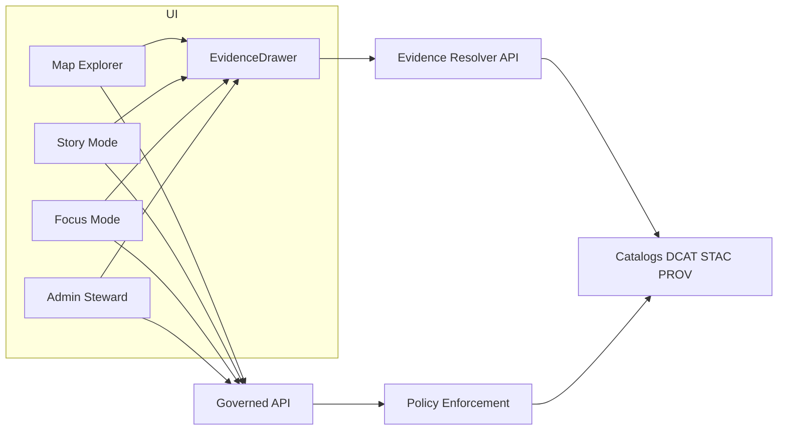

<!-- [KFM_META_BLOCK_V2]
doc_id: kfm://doc/6b3b65cb-9a36-4a6b-9c43-2a4eab86e3f1
title: UI Component Inventory
type: standard
version: v1
status: draft
owners: ui-platform
created: 2026-03-04
updated: 2026-03-04
policy_label: public
related: [
  "docs/guides/ui/README.md",
  "docs/guides/ui/design/",
  "docs/guides/ui/design/trust-surfaces.md",
  "docs/guides/ui/story-nodes.md",
  "docs/guides/api/evidence-resolver.md"
]
tags: [kfm, ui, design, components, governance, a11y]
notes: [
  "Inventory of UI components for Map Explorer, Story Mode, Focus Mode, and Admin/Steward surfaces.",
  "Component list is evidence-first: every surface must expose dataset version, license/rights, policy notices, and evidence/provenance access."
]
[/KFM_META_BLOCK_V2] -->

# UI Component Inventory
One canonical inventory of **KFM UI components** and their required **trust surfaces** (evidence, provenance, policy).

---

## Impact
**Status:** Draft (active design surface)  
**Owners:** `ui-platform` (UI architecture), `data-stewards` (policy/trust surfaces), `api-platform` (evidence resolver contract)  


**Jump to:**  
- [Scope](#scope) · [Definitions](#definitions) · [Non-negotiables](#non-negotiables) · [Inventory](#inventory) · [Composition diagram](#composition-diagram) · [DoD gates](#definition-of-done-gates) · [Appendix](#appendix)

---

## Scope
This inventory covers the UI surfaces explicitly called out in KFM vNext:

- **Map Explorer** (primary)
- **Timeline** (standalone or integrated into Map Explorer)
- **Stories** (Story Mode)
- **Catalog** (dataset discovery)
- **Focus Mode** (evidence-led Q&A)
- **Admin/Steward** (restricted governance tools)

It also defines **shared trust components** that must appear across surfaces (not optional polish).  
See “trust surfaces required” and “core UI components (buildable)” in KFM vNext.  
(Traceability reference: `KFM_Source_Snapshots_Bundle_from_vNext1_tables_fixed.pdf`)

---

## Where this fits
**Path:** `docs/guides/ui/design/component-inventory.md`  
**Upstream inputs (acceptable):**
- KFM UI requirements (Map Explorer, Story Mode, Focus Mode, Admin/Steward)
- Evidence resolver contract + EvidenceBundle schema
- Accessibility requirements and security posture for “governed client”

**Downstream usage:**
- UI implementation planning (work packages / milestones)
- E2E test plans (component acceptance criteria)
- Design reviews (ensuring “trust surfaces” exist on every screen)
- API contract alignment (evidence resolver integration points)

---

## Exclusions
This inventory does **not**:
- define visual style, branding, or typography system (that belongs in tokens/theme docs)
- replace API specs (only references API dependencies at the UI boundary)
- enumerate *dataset-specific* layers or story content (belongs in Catalog/Registry/Story authoring docs)

---

## Definitions
**CONFIRMED** (from KFM docs):
- **Governed client:** the frontend renders what the API returns and must not embed privileged credentials.
- **EvidenceRef:** a typed reference that resolves via the evidence resolver into an inspectable bundle.
- **EvidenceBundle:** the resolved card + machine metadata (license, provenance, digests, policy decision).
- **Map state:** reproducible artifact including bbox/zoom, active layers + style parameters, time window, filters.
- **Story Node:** narrative markdown plus sidecar JSON capturing map state and citations; publishing is gated on resolvable citations.

**UNKNOWN** (must be decided in implementation; do not assume):
- UI component library choice (Radix, MUI, Chakra, custom)
- CSS approach (CSS modules, Tailwind, vanilla-extract, etc.)
- Map engine mix (MapLibre-only vs MapLibre + Cesium)
- Exact file paths for components (we list suggested paths only)

---

## Non-negotiables
These are **hard requirements** for the UI system.

1. **UI is a governed client**
   - **CONFIRMED:** UI must route all data access through the governed API layer (policy enforcement point + evidence resolver). No direct database/storage access.

2. **Trust surfaces are first-class**
   - **CONFIRMED:** dataset version, license/rights, policy notices, and evidence/provenance access must be visible and reachable from each surface.

3. **Cite-or-abstain is enforced in UX**
   - **CONFIRMED:** story publishing is blocked if any citation fails to resolve (the UI can call the evidence resolver during publish checks).

4. **Accessibility is baseline, not polish**
   - **CONFIRMED:** keyboard navigation (layer controls + evidence drawer), visible focus states, ARIA labels for map controls, safe markdown rendering, and export outputs that include citations + audit_ref.

---

## Inventory
Legend:
- **Status:** `CONFIRMED` = specified by KFM docs; `PROPOSED` = recommended addition; `UNKNOWN` = decision needed
- **Type:** `Container` (data + orchestration) vs `Presentational` (render-only) vs `Shared` (used across surfaces)

> NOTE: Component names match the “core UI components (buildable)” list where available. Everything else is PROPOSED.

### Shared trust components
| Component | Type | Status | Responsibility | Evidence/Policy hook | Minimum test |
|---|---|---:|---|---|---|
| EvidenceDrawer | Shared | CONFIRMED | One-click evidence/provenance inspection from any surface | Resolves EvidenceRefs → EvidenceBundle; displays bundle id/digest, dataset version, license, freshness, provenance chain, redactions | E2E: open from feature/story/focus citation; shows license + dataset version |
| ProvenancePanel | Shared | CONFIRMED | Show run receipts/lineage links for a dataset/claim | Links to run_id / audit_ref; may include lineage graph entry points | Unit: renders run_id + links; policy-safe redactions |
| PolicyBadge | Presentational | CONFIRMED | Shows policy label/decision at point of interaction | Required: text label (no color-only meaning) | A11y: badge has accessible name |
| PolicyNotice | Shared | CONFIRMED | Explains why information is withheld or generalized | “why some info is withheld” pattern | Snapshot test: renders deterministic message |
| DatasetVersionLabel | Presentational | CONFIRMED | Always show dataset_version_id and link to catalog entry | Links to dataset version catalogs | Contract/UI test: version is displayed wherever a layer/claim is shown |
| AutomationStatusBadge | Presentational | CONFIRMED | Shows automation health status on layers/features | Links to evidence/provenance/attestation view | E2E: badge appears for at least one layer and is keyboard reachable |
| WhatChangedPanel | Container | CONFIRMED | Compare DatasetVersion diffs (counts/checksums/QA metrics) | Requires DatasetVersion diff endpoint or precomputed diff artifact | Unit: renders diff summary given fixture |
| EvidenceRefLink | Presentational | PROPOSED | Standard clickable citation component | On click: opens EvidenceDrawer at bundle | Unit: click triggers open with correct ref |
| AuditRefChip | Presentational | PROPOSED | Display audit_ref for answers/publishes | Copy-to-clipboard, link to audit view | Unit: copies expected string |

### Map Explorer components
| Component | Type | Status | Responsibility | Evidence/Policy hook | Minimum test |
|---|---|---:|---|---|---|
| MapCanvas (MapLibre GL) | Container | CONFIRMED | Base map rendering + viewport state | Emits view_state for Focus Mode; provides click-to-inspect | E2E: feature click opens EvidenceDrawer |
| LayerPanel | Container | CONFIRMED | Toggle layers, opacity, legend; show policy badge + data version | Displays dataset_version + policy label per layer | A11y: keyboard navigable; no color-only state |
| TimeControl (TimelineSlider) | Container | CONFIRMED | Set time window; optionally show histogram | Time window captured in view_state/map_state | Unit: time window state updates deterministically |
| SearchBar | Container | CONFIRMED | Search places, datasets, story nodes | Results must be policy-filtered | Contract: searches do not reveal restricted items to public role |
| FeatureInspectPanel | Container | CONFIRMED | Feature attributes + citations | Citations open EvidenceDrawer | E2E: attribute panel shows citations and opens evidence |
| Legend | Presentational | PROPOSED | Consistent legend rendering across layers | Links to dataset version + symbology notes | Snapshot: legend matches layer style inputs |
| ViewStatePermalink | Presentational | PROPOSED | Shareable URL or “copy view_state” | Includes bbox/zoom, layers, time window, filters | Unit: stable serialization |
| MapViewportControls | Presentational | PROPOSED | Zoom, home, locate, compass | ARIA labels required | A11y: controls keyboard reachable |

### Story Mode components
| Component | Type | Status | Responsibility | Evidence/Policy hook | Minimum test |
|---|---|---:|---|---|---|
| StoryNodeList | Container | CONFIRMED | Browse story nodes | Policy filtering by role | Contract: restricted stories hidden by default |
| StoryNodeReader | Container | CONFIRMED | Render markdown with citation hooks | Citation click opens EvidenceDrawer | Security: markdown sanitized; no XSS |
| RelatedEntitiesPanel | Presentational | PROPOSED | Show related entities/datasets for a story | Must resolve to policy-allowed links | Unit: renders list with policy-safe truncation |
| StoryMapReplay | Container | PROPOSED | Apply story map_state to MapCanvas | Uses stored map_state (bbox/zoom/layers/time window) | E2E: “Replay view” sets viewport/layers/time window |
| StoryReviewBadge | Presentational | PROPOSED | Show review_state (draft/needs_review/etc.) | Required for publish workflow | Unit: renders correct state |
| PublishGateDialog | Container | PROPOSED | Pre-publish checks (citations resolve) | Calls evidence resolver; blocks publish on failure | E2E: failing citation blocks publish |

### Focus Mode components
| Component | Type | Status | Responsibility | Evidence/Policy hook | Minimum test |
|---|---|---:|---|---|---|
| ChatPanel | Container | CONFIRMED | Chat UI for governed Q&A | Request includes optional view_state | Unit: sends view_state payload when provided |
| EvidenceSnippets | Presentational | CONFIRMED | Inline citations/snippets in answers | Each citation is an EvidenceRef; opens EvidenceDrawer | Unit: each ref is clickable and resolvable |
| PolicyNotice | Shared | CONFIRMED | Explains refusal/withholding | Must provide “what is missing / what is allowed / how to request access / audit_ref” | Snapshot: refusal message template |
| ExportAnswer | Container | CONFIRMED | Downloadable report with audit_ref + citations | Exports policy-safe content only | E2E: export includes audit_ref and citations |
| RetrievalContextChips | Presentational | PROPOSED | Show which datasets were used | Must not reveal restricted dataset list | Unit: respects policy-filtered list |
| ScopeHintBanner | Presentational | PROPOSED | Shows “Answer is scoped to current map view” | Uses view_state summary | Snapshot: correct scope summary |

### Admin/Steward components
| Component | Type | Status | Responsibility | Evidence/Policy hook | Minimum test |
|---|---|---:|---|---|---|
| PromotionQueue | Container | CONFIRMED | Queue dataset versions pending approval | Links to QA reports + provenance | Contract: restricted role required |
| QAReportViewer | Container | CONFIRMED | View validation outputs, diffs, QA metrics | Shows checksums/digests; links to run receipts | E2E: shows QA status and artifact digests |
| PolicyLabelEditor | Container | CONFIRMED | Controlled editing of policy labels | Must require elevated role and audit | Contract: denies non-steward |
| StoryReviewQueue | Container | CONFIRMED | Review Story Nodes pending publish | Publish gate runs citation resolution | E2E: publish requires resolvable citations |

### Design system primitives
These are **PROPOSED** primitives to ensure consistency and accessibility. If you already have a design system, map these to existing primitives.

| Primitive | Status | Notes |
|---|---:|---|
| Button, IconButton, LinkButton | PROPOSED | Must support keyboard + visible focus |
| Drawer, Modal, Popover | PROPOSED | EvidenceDrawer is a specialized Drawer |
| Badge, Tag, Chip | PROPOSED | Used for policy labels, dataset versions, audit refs |
| Tabs | PROPOSED | Useful for EvidenceDrawer sections (Evidence, License, Provenance, Artifacts) |
| DataTable | PROPOSED | Needed for Catalog and Admin/Steward lists |
| Toast/InlineAlert | PROPOSED | Used for abstention + policy notices |
| Skeleton/LoadingState | PROPOSED | Required for “<=2 calls” evidence resolution UX |

---

## Composition diagram


---

## Component contract notes
### EvidenceDrawer
**CONFIRMED minimum fields to render (policy-safe):**
- Evidence bundle ID + digest  
- DatasetVersion ID + dataset name  
- License + rights holder (with attribution text)  
- Freshness (last run timestamp) + validation status  
- Provenance chain (run receipt link)  
- Artifact links (only if policy allows)  
- Redactions applied (obligations)

### Map state and Story Node replay
**CONFIRMED:** map state includes bbox/zoom, active layers + style parameters, time window, and filters. Story Nodes store map state so stories replay the same view; Focus Mode can accept view_state hints.

---

## Definition of Done gates
Use this checklist before promoting UI changes that touch any of the components above.

### Governance gates (fail-closed)
- [ ] **No direct DB/storage access** from UI (only governed APIs).
- [ ] **EvidenceRef resolution**: every citation click resolves via evidence resolver or shows a policy-safe error state.
- [ ] **Story publish gate** blocks publish when any citation is unresolvable.

### Trust surfaces gates
- [ ] Layer entries show **dataset_version_id** and **policy badge**.
- [ ] EvidenceDrawer accessible from:
  - [ ] feature click
  - [ ] story citation click
  - [ ] focus-mode citation click
- [ ] “What changed?” is reachable for dataset version comparisons (if implemented).

### Accessibility gates
- [ ] Keyboard navigation works for layer list and EvidenceDrawer
- [ ] Visible focus states
- [ ] ARIA labels for map controls
- [ ] Policy indicators have text labels (no color-only meaning)
- [ ] Markdown rendering is sanitized (CSP + sanitization)

### Testing gates
- [ ] E2E: feature click opens EvidenceDrawer and shows license + version
- [ ] E2E: story citation opens EvidenceDrawer
- [ ] E2E: Focus Mode export includes citations + audit_ref
- [ ] Regression: component snapshots for trust surface layouts

---

## Appendix
<details>
<summary>PROPOSED: Suggested directory layout for UI components</summary>

```text
src/ui/
  components/
    MapCanvas/
    LayerPanel/
    TimeControl/
    EvidenceDrawer/
    PolicyBadge/
    DatasetVersionLabel/
    WhatChangedPanel/
  story/
    StoryNodeList/
    StoryNodeReader/
  focus/
    ChatPanel/
    EvidenceSnippets/
    ExportAnswer/
  admin/
    PromotionQueue/
    QAReportViewer/
    PolicyLabelEditor/
    StoryReviewQueue/
```

</details>

<details>
<summary>UNKNOWN: Decisions required to make this inventory executable</summary>

- Choose UI primitive library (or commit to custom primitives).
- Decide how MapLibre and/or Cesium are integrated (2D-only vs 2D+3D).
- Define a stable `view_state` serialization and permalink scheme.
- Define the minimal “Catalog view” component set (this inventory references it but does not specify it).

Smallest verification steps:
1) Confirm existing repo UI stack (React + TS baseline) and current component paths.  
2) Confirm evidence resolver endpoint shape and EvidenceBundle payload fields.  
3) Build one “vertical slice”: MapCanvas → FeatureInspectPanel → EvidenceDrawer → Evidence resolver.

</details>

---

_Back to top:_ [UI Component Inventory](#ui-component-inventory)
