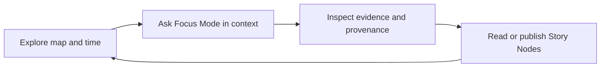
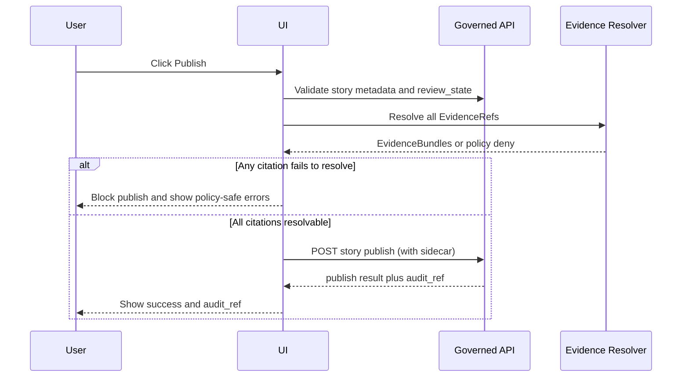
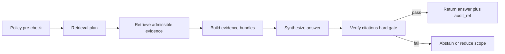
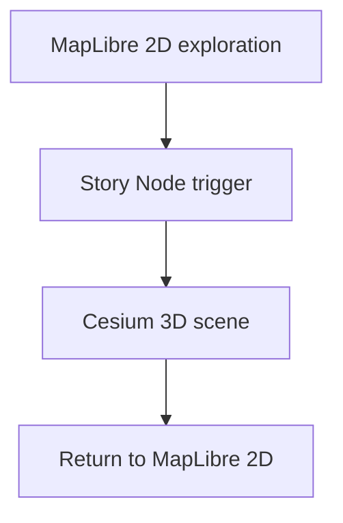

<!-- [KFM_META_BLOCK_V2]
doc_id: kfm://doc/cf7a8e59-ba73-4148-9ca9-d7e3865cdfce
title: UI Interaction Model
type: standard
version: v1
status: draft
owners: TBD
created: 2026-03-04
updated: 2026-03-04
policy_label: public
related: []
tags: [kfm, ui, design, interaction-model]
notes: [Defines the interaction contracts for Map Explorer, Story Mode, Focus Mode, and shared trust surfaces.]
[/KFM_META_BLOCK_V2] -->

# UI Interaction Model
One-line purpose: define *how users interact* with Map Explorer, Story Mode, and Focus Mode in a way that makes evidence, policy, and provenance visible and enforceable.

> **Status:** Draft (design contract)  
> **Owners:** TBD  
> **Applies to:** Web UI (React/TypeScript) + governed API surfaces  
> **Last updated:** 2026-03-04  
>
> **Badges (TODO):**   
>
> **Quick nav:** [Scope](#scope) · [Invariants](#invariants) · [Core loop](#core-interaction-loop) · [State model](#state-model) · [Shared trust surfaces](#shared-trust-surfaces) · [Map Explorer](#map-explorer) · [Story Mode](#story-mode) · [Focus Mode](#focus-mode) · [API interaction contract](#api-interaction-contract) · [Accessibility](#accessibility) · [Definition of done](#definition-of-done) · [Open questions](#open-questions)

---

## Scope
This document specifies:

- **Interaction contracts** (user intents → UI state changes → governed API requests → trust surfaces).
- **Shared UX primitives**: Evidence Drawer, Policy Notice, Provenance links, Version labels.
- **Failure behavior**: abstentions, denials, partial answers, and policy-safe errors.
- **Reproducibility hooks**: view state capture, Story Node sidecar behavior.

Out of scope:

- Pixel-perfect layouts, typography, color tokens, or component theming.
- Backend implementation details (DB schemas, index internals).
- Dataset-specific cartography rules (symbology, classification, ramps).

---

## Where this fits
Path: `docs/guides/ui/design/interaction-model.md`

This is a **UI design contract** that sits *between*:

- **Upstream:** API contracts and policy/evidence contracts (the UI must not invent facts or bypass governance).
- **Downstream:** UI component implementations and e2e tests (this doc is the source-of-truth for those behaviors).

---

## Status discipline
KFM documents and plans separate “what must be true” from “what we might choose.”

In this doc, every non-trivial design statement is labeled:

- **CONFIRMED** — present as an invariant or requirement in KFM design sources.
- **PROPOSED** — a recommended design choice (reasonable default), but not yet a governed invariant.
- **UNKNOWN** — needs verification before it can be treated as a constraint.

---

## Invariants
These must remain true across implementations (encode as tests and network/policy boundaries, not tribal knowledge).

1) **Trust membrane**
- **CONFIRMED:** The frontend is a governed client: it renders what the API returns and must never embed privileged credentials or access storage/DBs directly.

2) **Evidence-first UX**
- **CONFIRMED:** Evidence, dataset versions, and license/rights are first-class UI elements, not hidden in metadata panes.
- **CONFIRMED:** An Evidence Drawer is accessible from map feature inspection and story claims, and is keyboard navigable.

3) **Cite-or-abstain Focus Mode**
- **CONFIRMED:** A Focus Mode request is treated as a governed run with a receipt, with a *hard citation verification gate*. If citations cannot be verified, the response must abstain or reduce scope.

4) **Map state is reproducible**
- **CONFIRMED:** Map state (bbox/zoom, layers, time window, filters) is a reproducible artifact: Story Nodes store it and Focus Mode can accept it as `view_state`.

5) **Publishing gates are real**
- **CONFIRMED:** Story publishing is a governed event that requires review state and resolvable citations (fail closed).

---

## Core interaction loop
The top-level experience is intentionally cyclical:



Design intent (interpretation):

- **CONFIRMED:** “Explore → Focus → Evidence/Provenance inspection → Story Nodes” is the canonical loop.
- **PROPOSED:** The UI should make this loop obvious via navigation and cross-links (e.g., “Make a Story Node from this view”).

---

## Vocabulary
Definitions used consistently across UI, API, and governance.

- **view_state (CONFIRMED):** A UI-supplied context object: bbox/zoom, time window, active layers, and optional filters.
- **EvidenceRef (CONFIRMED):** A structured reference like `dcat://…`, `stac://…`, `prov://…`, `doc://…` that must resolve via the Evidence Resolver.
- **EvidenceBundle (CONFIRMED):** The resolver output: policy decision + obligations + license + provenance + digests + allowed artifact links.
- **dataset_version_id (CONFIRMED):** The dataset version identifier surfaced in UI and returned by governed APIs.
- **policy_label (CONFIRMED):** A public-safe classification (“public”, “restricted”, etc.) used for filtering and badges.
- **audit_ref (CONFIRMED):** A stable reference for any governed operation (Focus Mode ask, Story publish), shown in UI for follow-up and debugging.

---

## State model
### State categories
- **Session state (PROPOSED):** things that reset on refresh (drawer open/closed, hover states).
- **Shareable view state (PROPOSED):** map bbox/zoom + time + layers + filters, encoded into URL or exportable as JSON.
- **Governed artifacts (CONFIRMED concept):** Story Node sidecar and Focus Mode receipts; surfaced in UI via stable references (e.g., `audit_ref`).

### Canonical view_state object
**PROPOSED shape** (the exact DTO must be contract-tested):

```json
{
  "bbox": [-102.0, 36.9, -94.6, 40.0],
  "zoom": 6,
  "time_window": { "start": "1950-01-01", "end": "2024-12-31" },
  "layers": [
    { "layer_id": "noaa_storm_events", "dataset_version_id": "2026-02.abcd1234" }
  ],
  "filters": {
    "event_type": ["tornado"]
  }
}
```

### State transitions that must be deterministic
- **PROPOSED:** Changing time window should update both map filtering and any story/focus context using that view_state (if those surfaces are active).
- **PROPOSED:** Each state transition should be triggered by a single “command” (see [Command model](#command-model)) so it is testable and replayable.

---

## Shared trust surfaces
These are shared UI components and behaviors across Map Explorer, Story Mode, and Focus Mode.

### Evidence Drawer
**CONFIRMED minimum fields to show:**
- Evidence bundle ID + digest
- DatasetVersion ID + dataset name
- License + attribution text
- Freshness (last run timestamp) + validation status
- Provenance chain (run receipt link)
- Artifact links (only if policy allows)
- Redactions / obligations applied

**Interaction rules**
- **CONFIRMED:** Evidence Drawer must be openable from any map feature click and any story claim citation.
- **CONFIRMED:** Keyboard navigation must work (layer list and drawer).

**PROPOSED implementation notes**
- Use a single shared component (`EvidenceDrawer`) and a single resolver call-path:
  - UI extracts `EvidenceRef`s → POST to `/api/v1/evidence/resolve` (batching preferred) → renders returned `EvidenceBundle` cards.

### Policy Notice
**CONFIRMED concept:** Policy must be visible rather than hidden (e.g., “geometry generalized due to policy”).

**PROPOSED rules**
- Always show *what happened* in policy-safe terms (generalized, redacted, withheld).
- Never show *why a restricted thing exists* if that would leak existence through UI differences.

### Version label and “What changed?”
- **CONFIRMED concept:** Version label per layer must link to dataset/version catalogs, and “What changed?” compares versions (counts, checksums, QA metrics).
- **PROPOSED:** Treat “What changed?” as a standardized side panel used in Map Explorer and Catalog.

---

## Command model
A “command” is a user intent captured in a stable shape so it can be logged, tested, and replayed.

### Command taxonomy
- **Explore commands:** pan, zoom, change time window, toggle layer, change opacity.
- **Inspect commands:** select feature, open evidence, open provenance, compare versions.
- **Narrate commands:** open story, jump to node, publish story draft.
- **Ask commands:** submit focus question, refine scope, export answer.

### Command matrix
(Endpoint names are **documented targets**; confirm via OpenAPI.)

| Command | UI origin | Governing API calls (typical) | UI must show |
|---|---|---|---|
| `ToggleLayer(layer_id)` | LayerPanel | GET datasets/versions (if needed), then tile/query endpoints | dataset_version_id, policy badge |
| `SetTimeWindow(start,end)` | TimeControl | Query endpoints (bbox+time), update histograms | time window, filtered count (if available) |
| `SelectFeature(feature_id)` | MapCanvas click | Resolve EvidenceRefs → Evidence Drawer | license, version, evidence bundle |
| `OpenEvidence(evidence_ref[])` | FeatureInspectPanel / StoryReader / Focus citations | POST evidence/resolve | bundle digest, obligations |
| `AskFocus(query, view_state?)` | ChatPanel | POST focus/ask | answer + citations + audit_ref |
| `PublishStory(story_id, sidecar)` | Story editor | POST story publish (gated) | publish status + audit_ref |

---

## Map Explorer
**Goal:** Explore datasets through space and time while keeping trust visible.

### Primary components
- **CONFIRMED:** `MapCanvas` (MapLibre GL), `LayerPanel`, `TimeControl`, `FeatureInspectPanel`, `EvidenceDrawer`.

### Primary interactions
1) Explore (pan/zoom)
- **PROPOSED:** Debounce map move events; cancel in-flight requests when bbox changes rapidly.
- **PROPOSED:** Keep UI responsive by rendering existing tiles while new requests stream in.

2) Filter (time window)
- **CONFIRMED concept:** Time window filters map content and is part of reproducible map state.
- **PROPOSED:** Provide a histogram when available to help users choose time ranges.

3) Toggle layers
- **CONFIRMED concept:** Layer list shows dataset_version_id and policy badge.
- **PROPOSED:** If a layer is denied, show a policy-safe locked state (no “missing layer” ambiguity leaks).

4) Inspect features
- **CONFIRMED:** Feature click opens Evidence Drawer that shows license + version and is keyboard navigable.
- **PROPOSED:** Hover should never trigger evidence resolution (avoid background leakage); only explicit clicks do.

### Loading and error states
- **PROPOSED:** Use a stable, typed error model from API. Show `error_code`, policy-safe `message`, and `audit_ref` when present.
- **CONFIRMED concept:** Avoid leaking sensitive existence via different error shapes.

---

## Story Mode
**Goal:** Read and publish Story Nodes that bind narrative claims to evidence and reproducible map state.

### Story Node v3 structure
- **CONFIRMED:** A Story Node consists of:
  - a markdown file (human readable narrative)
  - a sidecar JSON (machine metadata: map_state, citations, policy label, review state)

**PROPOSED minimum sidecar fields** (align to the v3 template):

```json
{
  "kfm_story_node_version": "v3",
  "story_id": "kfm://story/<uuid>",
  "status": "draft",
  "policy_label": "public",
  "review_state": "needs_review",
  "map_state": {
    "bbox": [-102.0, 36.9, -94.6, 40.0],
    "zoom": 6,
    "layers": [
      { "layer_id": "noaa_storm_events", "dataset_version_id": "2026-02.abcd1234" }
    ],
    "time_window": { "start": "1950-01-01", "end": "2024-12-31" }
  },
  "citations": [
    { "ref": "dcat://noaa_ncei_storm_events@2026-02.abcd1234", "kind": "dcat" },
    { "ref": "prov://run/2026-02-20T12:34Z...", "kind": "prov" }
  ]
}
```

### Read interactions
- **CONFIRMED:** Story citations open the Evidence Drawer (same component as Map Explorer).
- **PROPOSED:** “Replay this view” loads the Story Node map_state into Map Explorer (with a visible “Story mode” banner).

### Publish interactions
Publishing is fail-closed.



**CONFIRMED:** Publishing requires review state and resolvable citations.

---

## Focus Mode
**Goal:** Evidence-led Q&A that behaves like a research assistant: cite resolvable sources or abstain.

### Inputs and outputs
**CONFIRMED inputs:**
- user query
- optional `view_state` (bbox, time window, active layers)
- user role + policy context (implicit from auth)

**CONFIRMED outputs:**
- answer text
- citations (EvidenceRefs) that resolve to bundles
- `audit_ref` (run id) for review/follow-up

### Control loop
Focus Mode is a governed workflow. The UI must expect “abstain” as a first-class outcome.



### UX requirements for abstention and partial answers
- **CONFIRMED:** Abstention UX must be clear:
  - what is missing (policy-safe)
  - what is allowed (public alternatives)
  - how to request access (steward workflow)
  - include `audit_ref`
- **CONFIRMED:** Partial answers are acceptable when only part of the question is supported.

**PROPOSED UI copy pattern**
- Title: “I can’t fully answer that with the evidence I’m allowed to use.”
- Bullets:
  - “Supported scope: …”
  - “Unsupported scope: …”
  - “Try instead: …”
  - “Audit ref: …”

### Export behavior
- **CONFIRMED concept:** “Export answer” should produce a report that includes citations and `audit_ref`.
- **PROPOSED:** Provide two export formats: Markdown and PDF.

---

## API interaction contract
This section describes the *client expectations* that enable consistent UX and enforce governance.

### Minimal endpoint surface (documented target)
- **CONFIRMED in design docs:** endpoints such as:
  - `GET /api/v1/datasets` (dataset discovery)
  - `GET /api/v1/stac/collections` and `/items` (STAC browse/query)
  - `GET/POST /api/v1/story` (read/publish story)
  - `POST /api/v1/focus/ask` (Focus Mode)
  - `POST /api/v1/evidence/resolve` (resolve EvidenceRefs)

### Response envelope requirements
- **CONFIRMED:** When applicable, responses include:
  - `dataset_version_id`
  - artifact digests/checksums (when applicable)
  - `policy_label` (public-safe)
  - `audit_ref` for governed operations (Focus ask, Story publish)

### Error model requirements
- **CONFIRMED:** Errors use a stable model:
  - `error_code`
  - `message` (policy-safe)
  - `audit_ref`
  - optional remediation hints

**CONFIRMED security constraint:** Avoid leaking sensitive existence through error differences; align 403/404 behavior with policy.

---

## 3D Story Node mode
A low-friction extension that keeps Map Explorer as the primary mental model.

- **PROPOSED:** Use a MapLibre (2D) primary experience and a Cesium (3D) “Story Node mode” for specific narratives.
- **PROPOSED:** Story nodes may lock camera, fade layers, switch rendering engines, and return to MapLibre while preserving narrative continuity.

Interaction sketch:



---

## Accessibility
Minimum requirements that should be enforced with automated tests.

- **CONFIRMED:** Keyboard navigable layer controls and evidence drawer; visible focus states.
- **CONFIRMED:** Text labels for policy badges and status indicators (no color-only meaning).
- **CONFIRMED:** ARIA labels for map controls.
- **CONFIRMED:** Safe markdown rendering for narratives (CSP + sanitization).
- **CONFIRMED:** Export outputs include citations and `audit_ref` in a readable format.

---

## Definition of done
Treat this as the UI DoD for the interaction model.

### Map Explorer DoD
- [ ] Layer list shows `dataset_version_id` and policy badge for each visible layer.
- [ ] Feature click opens Evidence Drawer and shows **license + version**.
- [ ] Evidence Drawer is keyboard navigable and focus-managed.
- [ ] Evidence resolution happens through the Evidence Resolver only (no “raw URL citation” shortcuts).

### Story Mode DoD
- [ ] Story Node renders markdown + map_state replay.
- [ ] Story citations open Evidence Drawer.
- [ ] Publish is blocked if any citation fails to resolve or review_state is missing.

### Focus Mode DoD
- [ ] Focus responses include resolvable citations and `audit_ref`.
- [ ] If citations cannot be verified, UI shows abstention or reduced-scope answer (never fabricated citations).
- [ ] “Export answer” includes citations + `audit_ref`.

### Cross-cutting DoD
- [ ] UI never embeds privileged credentials (governed client invariant).
- [ ] Error UI is policy-safe and does not leak existence via differential behavior.
- [ ] e2e tests cover the core flows (feature click → evidence drawer; story publish gate; focus ask → cite-or-abstain).

---

## Open questions
These are intentionally flagged to prevent accidental “papering over” unknowns.

1) **Exact API DTOs**
- **UNKNOWN:** Final request/response schemas for `view_state`, Evidence Resolver, Story publish, Focus response.
- Smallest verification step: confirm OpenAPI / JSON schemas and link them here.

2) **Auth and role UX**
- **UNKNOWN:** How the UI learns user role and policy context (JWT claims? session?).
- Smallest verification step: document auth contract and standardize policy-safe denial UI.

3) **State management library**
- **UNKNOWN:** Redux vs Zustand vs other store (the interaction model is store-agnostic).
- Smallest verification step: pick a store, then encode command model as typed actions and add replay tests.

4) **Caching and offline**
- **UNKNOWN:** Whether public datasets can be cached offline (service worker, PMTiles local).
- Smallest verification step: decide what is allowed by policy labels and add cache invalidation rules.

---

## Appendix
<details>
<summary>Evidence bundle UI card (example fields)</summary>

```json
{
  "bundle_id": "sha256:bundle...",
  "dataset_version_id": "2026-02.abcd1234",
  "title": "Storm event record: 2026-02-19",
  "policy": {
    "decision": "allow",
    "policy_label": "public",
    "obligations_applied": []
  },
  "license": { "spdx": "CC-BY-4.0", "attribution": "Source org" },
  "provenance": { "run_id": "kfm://run/2026-02-20T12:00:00Z.abcd" },
  "artifacts": [
    { "href": "processed/events.parquet", "digest": "sha256:2222", "media_type": "application/x-parquet" }
  ],
  "checks": { "catalog_valid": true, "links_ok": true },
  "audit_ref": "kfm://audit/entry/123"
}
```

</details>

---

## Back to top
- [Back to top](#ui-interaction-model)
