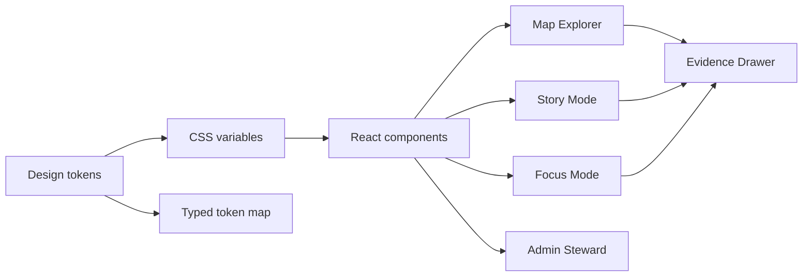

<!-- [KFM_META_BLOCK_V2]
doc_id: kfm://doc/b6295989-395d-4a97-b473-1457d9d17fdd
title: Visual Style
type: standard
version: v1
status: draft
owners: kfm-ui
created: 2026-03-04
updated: 2026-03-04
policy_label: public
related:
  - docs/guides/ui/README.md
  - docs/guides/ui/design/
  - docs/guides/visualization/
tags: [kfm, ui, design, visual-style, tokens, accessibility, trust-surfaces]
notes:
  - This guide defines UI tokens and patterns for KFM “trust surfaces” across Map Explorer, Story Mode, and Focus Mode.
[/KFM_META_BLOCK_V2] -->

# Visual Style
One source of truth for KFM UI design tokens, map styling rules, and “trust surface” visuals.

> **Status:** draft  
> **Owners:** `kfm-ui` (placeholder)  
> **Applies to:** Map Explorer, Story Mode, Focus Mode, Admin/Steward surfaces  
> **Non-negotiable theme:** trust is a first-class visual element.

**Quick nav**
- [Scope](#scope)
- [Where it fits](#where-it-fits)
- [Principles](#principles)
- [Trust surfaces](#trust-surfaces)
- [Tokens](#tokens)
- [Map styling](#map-styling)
- [Components](#components)
- [Accessibility](#accessibility)
- [Implementation](#implementation)
- [Definition of done](#definition-of-done)
- [Appendix](#appendix)

---

## Scope

- **CONFIRMED:** This guide standardizes the visuals for trust surfaces that must appear throughout KFM UI (evidence, provenance, policy, and “what changed”).  
- **PROPOSED:** This guide also introduces a default token set (colors, spacing, typography) suitable for a KFM MVP and usable across React + MapLibre + Cesium.
- **UNKNOWN:** KFM brand identity requirements (logo, primary brand colors, typography).  
  - Smallest verification steps:
    1) Confirm whether a brand/identity guide exists.  
    2) If none exists, formally choose a “product-neutral” system UI style and record it as a governance-approved decision.

---

## Where it fits

- **CONFIRMED:** KFM UI is a governed client: it renders what the governed API returns and must not embed privileged credentials or bypass governance.  
- **PROPOSED:** Tokens defined here should be consumed by:
  - `web/` UI packages (React components)
  - map renderers (MapLibre/Cesium adapter layers)
  - export surfaces (PDF/HTML reports from Focus Mode / Stories)

**Exclusions**
- **CONFIRMED:** This guide does not define dataset-specific cartography (each dataset can supply style hints, but must still conform to governance + accessibility).
- **PROPOSED:** This guide does not attempt marketing branding or “visual identity storytelling.”

---

## Principles

### Evidence-first visuals

- **CONFIRMED:** Every meaningful user-facing claim should be inspectable via a one-click evidence surface (Evidence Drawer).  
- **CONFIRMED:** Policy restrictions and redactions must be explicit at interaction time (no “silent generalization”).  
- **PROPOSED:** Prefer “cards” and “chips” that summarize: **Dataset Version**, **License**, **Freshness**, **Policy**.

### Trust must be visible

- **CONFIRMED:** The UI must make governance visible rather than hidden.  
- **CONFIRMED:** Trust surfaces are not optional polish; they are the user-visible governance contract.

### Calm, utilitarian, low-drama

- **PROPOSED:** Default style should be:
  - information-dense but readable
  - neutral palette with restrained accents
  - consistent surfaces/panels for controls and evidence
  - minimal animation; no motion that implies certainty

### Deterministic interaction

- **CONFIRMED:** Map state is a reproducible artifact and should be captured for stories (bbox/zoom, active layers + style params, time window, filters).  
- **PROPOSED:** Visual design must reflect this reproducibility:
  - a “View state” chip/label is always available in Story Mode and exports.

---

## Trust surfaces

### Required trust surfaces

- **CONFIRMED:** Provide these surfaces across Map Explorer, Story Mode, and Focus Mode:
  - Automation status badges on layers/features
  - Evidence Drawer accessible from every layer and story claim
  - Data version label per layer linking to DatasetVersion catalogs
  - Policy notices that explain why some information is withheld
  - “What changed?” comparisons between dataset versions

### Evidence Drawer minimum content

- **CONFIRMED:** Evidence Drawer must show, at minimum:
  - evidence bundle ID + digest
  - dataset version ID + dataset title
  - license + rights holder attribution
  - freshness and validation status
  - provenance chain (run receipt link)
  - artifact links only if policy allows
  - redactions applied and obligations

### Focus Mode trust requirements

- **CONFIRMED:** Focus Mode outputs must include:
  - citations that resolve to evidence bundles
  - an audit reference for review/follow-up
- **CONFIRMED:** If citations cannot be verified, UI must clearly present abstention or scope reduction.

---

## Tokens

### Token rules

- **PROPOSED:** Tokens are the only allowed way to style shared components.
  - No hard-coded hex values inside feature components.
  - Theme is applied via CSS variables and a `data-theme` attribute.
- **PROPOSED:** Token naming
  - Prefix: `--kfm-`
  - Categories: `color`, `space`, `radius`, `shadow`, `font`, `z`

### Token pipeline diagram



---

### Color tokens

#### Core surfaces

- **PROPOSED:** Provide both light and dark themes; default to dark for map-heavy experiences.
- **CONFIRMED:** Do not encode meaning using color alone; every status/policy indicator must also have text and/or icon.

**PROPOSED base palette**
- Backgrounds: neutral slate/gray
- Surfaces: slightly elevated panels
- Text: high-contrast neutral, avoid pure white
- Borders: subtle

#### Semantic colors

- **CONFIRMED:** Automation status states should be visually standardized.
- **CONFIRMED:** Policy badges must be visually distinct and explainable.

**CONFIRMED automation badge tokens**
These values are used by the automation-status badge theming and should be treated as stable integration tokens.

```css
:root {
  /* Integration tokens for automation status badges */
  --badge-bg: #101316cc;
  --badge-fg: #e7eef7;
  --badge-healthy: #17a34a;
  --badge-degraded: #e6a700;
  --badge-failing: #d64545;
  --badge-running: #2483ff;
  --badge-shadow: 0 2px 8px rgba(0,0,0,.35);
}
```

**PROPOSED policy label tokens**
> These are placeholders; confirm desired palette and test contrast.

```css
:root {
  --kfm-policy-public: #2b77ff;
  --kfm-policy-generalized: #e6a700;
  --kfm-policy-restricted: #d64545;

  --kfm-policy-surface: #101316cc;
  --kfm-policy-fg: #e7eef7;
}
```

#### Contrast requirements

- **CONFIRMED:** Any UI color usage must meet WCAG 2.1 AA; normal text contrast target is ≥ 4.5:1.
- **PROPOSED:** Add automated CI checks for token contrast pairs (see [Implementation](#implementation)).

---

### Typography tokens

- **PROPOSED:** Default to a system font stack for reliability and performance; avoid custom font loading in MVP.
- **UNKNOWN:** Brand typography decisions.  
  - Smallest verification step: choose one font family decision and record in an ADR.

**PROPOSED typography**
```css
:root {
  --kfm-font-sans: ui-sans-serif, system-ui, -apple-system, Segoe UI, Roboto, Helvetica, Arial, "Apple Color Emoji", "Segoe UI Emoji";
  --kfm-font-mono: ui-monospace, SFMono-Regular, Menlo, Monaco, Consolas, "Liberation Mono", "Courier New", monospace;

  --kfm-text-xs: 0.75rem;
  --kfm-text-sm: 0.875rem;
  --kfm-text-md: 1rem;
  --kfm-text-lg: 1.125rem;
  --kfm-text-xl: 1.25rem;

  --kfm-line-tight: 1.2;
  --kfm-line-normal: 1.45;
  --kfm-line-relaxed: 1.65;
}
```

**PROPOSED type usage rules**
- Body: `--kfm-text-md`, `--kfm-line-normal`
- Dense panels: `--kfm-text-sm`
- Chips/badges: `--kfm-text-xs` or `--kfm-text-sm`, always with adequate padding

---

### Spacing, radii, elevation

- **PROPOSED:** 4px base spacing grid.
- **PROPOSED:** Prefer compact UI; map interactions are primary, panels must not dominate the viewport.

```css
:root {
  --kfm-space-1: 0.25rem; /* 4px */
  --kfm-space-2: 0.5rem;  /* 8px */
  --kfm-space-3: 0.75rem; /* 12px */
  --kfm-space-4: 1rem;    /* 16px */
  --kfm-space-6: 1.5rem;  /* 24px */
  --kfm-space-8: 2rem;    /* 32px */

  --kfm-radius-sm: 6px;
  --kfm-radius-md: 10px;
  --kfm-radius-lg: 14px;

  --kfm-shadow-sm: 0 1px 2px rgba(0,0,0,.18);
  --kfm-shadow-md: 0 6px 20px rgba(0,0,0,.28);
}
```

---

## Map styling

### Story Node visualization standards

- **CONFIRMED:** Story Node map surfaces and visual assets follow these minimum requirements:
  - formats: PNG, SVG, GeoJSON, TopoJSON
  - minimum resolution: 2048px width for map surfaces
  - default projection: EPSG:4326 unless otherwise noted
  - metadata: a STAC Item is required in a sibling directory
  - CARE: archaeological/cultural features must be generalized ≥ 5 km
  - color accessibility: WCAG 2.1 AA compliant (contrast target ≥ 4.5:1)

### Basemap themes

- **PROPOSED:** Provide at least:
  - `light` for print/export and story reading
  - `dark` for data exploration and multi-layer overlays

**PROPOSED rules**
- Basemap is subordinate to data layers.
- Basemap label density is reduced when the layer panel is open.
- Avoid highly saturated basemap colors; reserve saturation for active data layers and warnings.

### Layer symbology rules

- **PROPOSED defaults**
- Lines:
  - min width: 1.5px at zoom ≤ 8
  - 2–4px at zoom 9–12
  - 4–7px at zoom ≥ 13
  - selected feature outline: +2px and higher contrast
- Polygons:
  - fill opacity: 0.18–0.35
  - outline opacity: 0.75–1.0
- Points:
  - use a ring for hover/selection
  - never rely on color alone; include shape/icon differences for categories

### Policy-driven generalization visuals

- **CONFIRMED:** If geometry is generalized due to policy, the UI must show an explicit notice at interaction time.
- **PROPOSED:** Visual pattern:
  - policy chip next to layer name: `Generalized`
  - tooltip/hint: “Geometry generalized due to policy”
  - evidence drawer shows obligations applied

---

## Components

### Layer panel

- **CONFIRMED:** Layer panel must show:
  - toggle state + opacity
  - legend / symbology
  - policy badge
  - dataset version label per layer
- **PROPOSED:** Provide a consistent “layer header” layout:
  - left: layer name
  - right: chips for version, policy, status

### Policy badge

- **CONFIRMED:** Policy badges must have text labels (no color-only meaning).
- **PROPOSED:** Badge structure:
  - label: `Public` / `Generalized` / `Restricted`
  - optional icon
  - on hover/click: show rationale and next steps (request access, view policy)

### Automation status badge

- **CONFIRMED:** Must represent `healthy`, `degraded`, `failing`, and `running`.
- **PROPOSED:** Badge behavior:
  - clickable: opens Evidence Drawer focused on the most recent run receipt / attestation link
  - includes “Last updated” timestamp when space allows

### Evidence Drawer

- **CONFIRMED:** Required from any feature click, any story claim, and any Focus Mode citation.

**PROPOSED Evidence Drawer layout**
1) Header: Title + policy chip + dataset version chip  
2) Summary: license + attribution + freshness + validation status  
3) Evidence: bundle id + digest (copyable)  
4) Provenance: run id link, lineage parents  
5) Artifacts: visible only if policy allows  
6) Redactions and obligations: always shown when applicable  
7) Actions: export evidence card, open “what changed”

### Focus Mode citations

- **CONFIRMED:** Citations are EvidenceRefs that resolve to bundles; missing/unresolvable citations must result in abstention or scope reduction.
- **PROPOSED:** Inline citation UI:
  - bracketed numbers or pill chips
  - click opens Evidence Drawer
  - export includes citations and audit reference in a readable form

---

## Accessibility

- **CONFIRMED:** Minimum accessibility requirements:
  - keyboard navigable layer controls and Evidence Drawer
  - visible focus states
  - text labels for policy badges and status indicators
  - ARIA labels for map controls
  - safe markdown rendering for narratives
  - exports include citations and audit reference in a readable form

**PROPOSED additional rules**
- Respect `prefers-reduced-motion` and allow disabling map animation.
- Use “skip to content” for Story Mode and Focus Mode.
- Provide “high contrast” toggle as a follow-on milestone.

---

## Implementation

### Suggested file layout

- **PROPOSED:**
```text
docs/guides/ui/design/
  visual-style.md              # this file
web/
  packages/ui-tokens/
    tokens.css                 # CSS variables
    tokens.json                # typed token map (for JS/TS usage)
  packages/ui-components/
    EvidenceDrawer/
    PolicyBadge/
    StatusBadge/
```

### Token consumption pattern

- **PROPOSED:**
  - `tokens.css` is loaded once at app root.
  - theme switching via `document.documentElement.dataset.theme = "dark" | "light"`.
  - components only reference tokens (CSS variables), not raw values.

### Testing and gates

- **PROPOSED gates**
  - contrast checks for token pairs (AA threshold)
  - visual regression tests for core trust surfaces (LayerPanel, EvidenceDrawer, PolicyBadge, StatusBadge)
  - keyboard navigation test for Evidence Drawer open/close and tab order

---

## Definition of done

- **CONFIRMED:** Evidence Drawer is accessible from:
  - a map feature click
  - a Story claim/citation
  - a Focus Mode citation
- **CONFIRMED:** Evidence Drawer includes required minimum fields (bundle id/digest, dataset version id, license/attribution, freshness, provenance, redactions).
- **CONFIRMED:** Keyboard navigation works for layer controls and Evidence Drawer; focus is visible.
- **CONFIRMED:** Policy and status indicators have text labels (no color-only meaning).

- **PROPOSED:** CI has:
  - token contrast checks
  - visual regression snapshots for trust surfaces
  - a “reduced motion” smoke test

---

## Appendix

### Example token file

```css
/* tokens.css — PROPOSED baseline theme */
:root[data-theme="dark"]{
  --kfm-bg: #0b0e11;
  --kfm-surface: #101316cc;
  --kfm-surface-solid: #101316;
  --kfm-text: #e7eef7;
  --kfm-text-muted: #a7b3c2;
  --kfm-border: rgba(231,238,247,.12);

  /* Alias integration tokens */
  --badge-bg: var(--kfm-surface);
  --badge-fg: var(--kfm-text);

  --kfm-focus-ring: 0 0 0 3px rgba(36,131,255,.45);
}

:root[data-theme="light"]{
  --kfm-bg: #ffffff;
  --kfm-surface: rgba(245,247,250,.92);
  --kfm-surface-solid: #f5f7fa;
  --kfm-text: #111827;
  --kfm-text-muted: #4b5563;
  --kfm-border: rgba(17,24,39,.12);

  --kfm-focus-ring: 0 0 0 3px rgba(36,131,255,.35);
}
```

### Evidence Drawer checklist card

- **PROPOSED:** The Evidence Drawer can render a consistent “evidence card” summary:

```text
Evidence
- bundle_id: sha256:...
- dataset_version_id: 2026-02.abcd1234
- policy: public | generalized | restricted
- license: CC-BY-4.0 (attribution text)
- freshness: 2026-02-20T12:00:00Z
- run_id: kfm://run/...
- audit_ref: kfm://audit/...
- redactions: none | generalized geometry | withheld fields
```

---

Back to top: [Visual Style](#visual-style)
