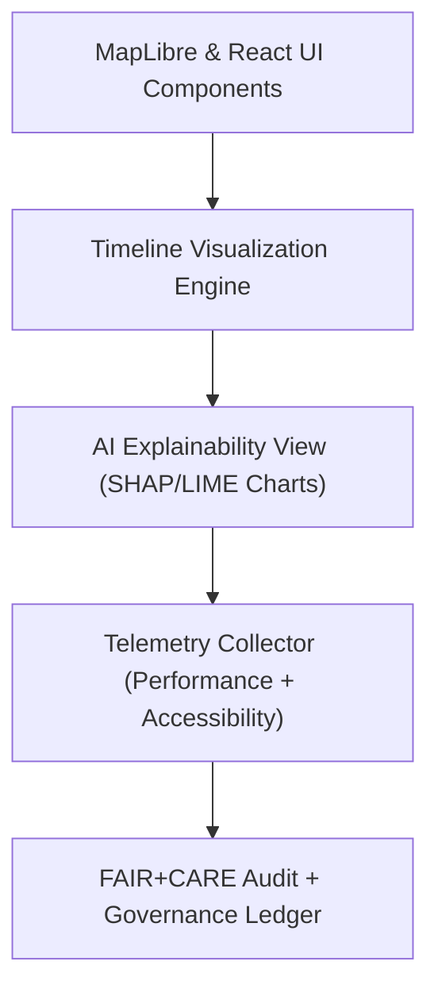

<div align="center">

# 🖼️ **Kansas Frontier Matrix — Visualization & Interface Design Guides**
`docs/guides/visualization/README.md`

**Purpose:**  
Provide design and engineering standards for all **user-facing visualization systems** in the Kansas Frontier Matrix (KFM), including **MapLibre map interfaces**, **temporal timelines**, **AI explainability views**, and **FAIR+CARE-compliant accessibility frameworks**.

[](../../README.md)
[](../../../LICENSE)
[](../../../docs/standards/README.md)
[](../../../releases/)
</div>

---

## 📘 Overview

The **Visualization Guides** define the standards, component structure, and governance rules for KFM’s visual interfaces — bridging map-based exploration, time-series storytelling, and AI explainability dashboards.  
These guides ensure consistent design, accessibility, and sustainability across KFM’s **React + MapLibre front end**, with integrated **telemetry tracking** for performance and FAIR+CARE compliance.

---

## 🗂️ Directory Layout

```plaintext
docs/guides/visualization/
├── README.md                             # This overview
├── maplibre-ui-design.md                 # Design patterns for map-based components
├── timeline-visualization.md             # Time-based story and data visualization
├── accessibility-standards.md            # WCAG & FAIR+CARE compliance guide
├── explainability-dashboard.md           # Visualization of AI reasoning layers
└── reports/                              # Telemetry & accessibility validation reports
```

---

## 🧩 Core Visualization Layers

| Layer | Description | Tools / Standards |
|-------|--------------|-------------------|
| **Map Interface** | MapLibre + PMTiles visualization for historical & environmental layers | MapLibre GL JS, PMTiles, React |
| **Timeline Canvas** | Interactive timeline showing land use, treaties, and climate trends | D3.js, Recharts, Framer Motion |
| **Explainability View** | Graphical interpretation of AI reasoning (SHAP/LIME visualizations) | Plotly, ECharts, Vega-Lite |
| **Accessibility Layer** | Ensures visual parity for all users through FAIR+CARE principles | WCAG 2.1 AA, ARIA Roles |
| **Performance Telemetry** | Real-time monitoring for rendering performance | `focus-telemetry.json` |

---

## ⚙️ Integration Flow



---

## 🧮 Component Design Principles

| Principle | Description | Implementation |
|------------|-------------|----------------|
| **Declarative Architecture** | Components defined as reusable declarative units | React + JSX |
| **Data-Driven Rendering** | Maps and timelines update from live data streams | REST / WebSocket API |
| **Thematic Consistency** | Shared color tokens and typography | Design Tokens System |
| **Responsive & Accessible** | Supports keyboard, screen reader, and mobile layouts | Tailwind + ARIA attributes |
| **Telemetry-Enabled** | Monitors FPS, latency, and interactions | Focus Telemetry Hooks |

---

## 🎨 Design Token Framework

| Token | Purpose | Example |
|--------|----------|----------|
| `--color-primary` | Primary UI color | `#003366` |
| `--color-secondary` | Accent color | `#E89C1E` |
| `--font-family` | Global font stack | `"Inter", sans-serif` |
| `--spacing-unit` | Consistent padding/margin | `8px` |
| `--border-radius` | Rounded component corners | `0.5rem` |

---

## ♿ Accessibility & FAIR+CARE Integration

| Principle | Implementation | Validation Artifact |
|------------|----------------|--------------------|
| **Findable** | UI components referenced by semantic roles | WCAG Validation Logs |
| **Accessible** | Color contrast ratio ≥ 4.5:1 | `reports/accessibility.json` |
| **Interoperable** | ARIA & semantic HTML5 compliance | `accessibility-standards.md` |
| **Reusable** | Shared visual components across tools | React component registry |
| **Collective Benefit** | Design inclusivity audits | FAIR+CARE Accessibility Audit |
| **Authority to Control** | User-configurable visibility for sensitive data | `data-generalization/README.md` |
| **Responsibility** | Monitored via telemetry for user interaction equity | `focus-telemetry.json` |
| **Ethics** | Public visualization reviewed by Council before release | Governance Ledger |

---

## 📊 Example Telemetry Snapshot

```json
{
  "component": "MapLibre Timeline",
  "fps": 59,
  "frame_latency_ms": 14.6,
  "accessibility_compliance": "AA",
  "faircare_status": "Pass",
  "timestamp": "2025-11-09T12:00:00Z"
}
```

---

## 🧾 Validation Workflows

| Workflow | Function | Output |
|-----------|-----------|--------|
| `ui-accessibility-validate.yml` | Validate WCAG 2.1 AA & FAIR+CARE metrics | `reports/accessibility.json` |
| `ui-telemetry-export.yml` | Log rendering + performance data | `releases/v*/focus-telemetry.json` |
| `ui-faircare-audit.yml` | Check ethical visualization compliance | `reports/faircare/ui-audit.json` |
| `ledger-sync.yml` | Sync validation hashes to governance ledger | `docs/standards/governance/LEDGER/ui-ledger.json` |

---

## ⚖️ Governance & Audit Hooks

Every major visualization component:
- Includes **semantic annotations** and **data provenance tags**.  
- Emits **telemetry logs** for performance and energy metrics.  
- Is reviewed by the **FAIR+CARE Council** for cultural and ethical integrity.  

All dashboard deployments require:
1. WCAG 2.1 AA accessibility validation  
2. FAIR+CARE ethical review sign-off  
3. Governance Ledger checksum record  

---

## 🕰️ Version History

| Version | Date | Author | Summary |
|----------|------|--------|----------|
| v10.0.0 | 2025-11-09 | Core Team | Added unified visualization architecture with accessibility, telemetry, and FAIR+CARE governance |
| v9.7.0 | 2025-11-03 | A. Barta | Introduced MapLibre timeline and explainability visualization design standards |

---

<div align="center">

© 2025 Kansas Frontier Matrix Project  
Master Coder Protocol v6.3 · FAIR+CARE Certified · Diamond⁹ Ω / Crown∞Ω Ultimate Certified  

[Back to Guides Index](../README.md) · [Governance Charter](../../../docs/standards/governance/ROOT-GOVERNANCE.md)

</div>

