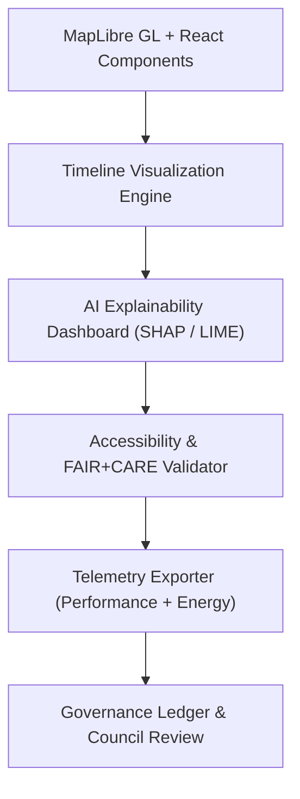

<div align="center">

# 🖼️ **Kansas Frontier Matrix — Visualization & Interface Design Guides**
`docs/guides/visualization/README.md`

**Purpose:**  
Provide a unified, FAIR+CARE-aligned framework for all **visual and interactive systems** in the Kansas Frontier Matrix (KFM).  
This documentation governs **MapLibre interfaces**, **timeline storytelling**, **AI explainability dashboards**, and **accessibility standards**, ensuring ethical, transparent, and performant design under **MCP-DL v6.3**.

[](../../README.md)
[](../../../LICENSE)
[](../../../docs/standards/README.md)
[](../../../releases/)
</div>

---

## 📘 Overview

The **Visualization Guides** define standards for **interactive storytelling and data presentation** across the KFM interface ecosystem.  
From spatial exploration in MapLibre to AI explainability panels, each visualization element is governed by FAIR+CARE accessibility and telemetry tracking to ensure reproducibility, sustainability, and inclusion.

---

## 🗂️ Directory Layout

```plaintext
docs/guides/visualization/
├── README.md                             # This overview
├── maplibre-ui-design.md                 # MapLibre interface architecture & FAIR+CARE integration
├── timeline-visualization.md             # Temporal data storytelling & historical playback
├── accessibility-standards.md            # WCAG + FAIR+CARE accessibility framework
├── explainability-dashboard.md           # Visual interpretation of AI reasoning layers
└── reports/                              # Accessibility, telemetry, and validation reports
```

---

## 🧩 Visualization Architecture Overview



---

## 🧮 Component Principles

| Principle | Description | Implementation |
|------------|-------------|----------------|
| **Declarative Design** | All UIs built as reusable, version-controlled React components | `web/src/components/` |
| **Data-Driven Rendering** | Components dynamically render map & timeline data via APIs | REST / WebSocket streams |
| **Thematic Consistency** | Unified visual tokens for typography, colors, and grids | Design Tokens System |
| **Accessibility First** | WCAG 2.1 AA and ARIA role integration | `accessibility-standards.md` |
| **Telemetry Embedded** | Track latency, FPS, and accessibility usage | `focus-telemetry.json` |

---

## 🎨 Design Token System

| Token | Purpose | Example |
|--------|----------|----------|
| `--color-primary` | Primary UI color | `#003366` |
| `--color-accent` | Accent or highlight color | `#E89C1E` |
| `--font-family` | Global font set | `"Inter", sans-serif` |
| `--border-radius` | Corner rounding for visual elements | `0.5rem` |
| `--spacing-unit` | Consistent padding/margin spacing | `8px` |

> Tokens are stored in `web/public/css/tokens.css` and applied across React and MapLibre elements.

---

## ⚙️ Core Visualization Layers

| Layer | Description | Tools / Standards |
|-------|--------------|-------------------|
| **MapLibre Interface** | Map-based exploration of historical + environmental layers | MapLibre GL JS, PMTiles, React |
| **Timeline Canvas** | Temporal playback of events, datasets, and narratives | D3.js, Recharts, Framer Motion |
| **Explainability Dashboard** | AI transparency and interpretability visualizations | Plotly, ECharts, Vega-Lite |
| **Accessibility Framework** | Inclusive interaction and compliance enforcement | WCAG 2.1 AA, ARIA, FAIR+CARE |
| **Performance Telemetry** | Tracks FPS, latency, and sustainability metrics | `focus-telemetry.json` |

---

## ♿ Accessibility & FAIR+CARE Integration

| Principle | Implementation | Validation Artifact |
|------------|----------------|--------------------|
| **Findable** | Components registered with semantic ARIA roles | WCAG 2.1 Audit |
| **Accessible** | High-contrast colors and motion-safe UI | `accessibility-standards.md` |
| **Interoperable** | WCAG + FAIR+CARE dual schema validation | CI pipeline reports |
| **Reusable** | Design tokens reused across visualization modules | React component registry |
| **Collective Benefit** | Promotes inclusive historical storytelling | FAIR+CARE audit |
| **Authority to Control** | User-managed filters for sensitive cultural layers | `data-generalization/README.md` |
| **Responsibility** | Performance + accessibility telemetry logged | `focus-telemetry.json` |
| **Ethics** | Council review for visual data publication | Governance Ledger |

---

## 📊 Example Telemetry Snapshot

```json
{
  "component": "MapLibre Timeline",
  "fps": 58,
  "frame_latency_ms": 15.3,
  "cpu_percent": 63.5,
  "gpu_percent": 61.1,
  "accessibility_compliance": "AA",
  "faircare_status": "Pass",
  "energy_joules": 1.19,
  "timestamp": "2025-11-09T12:00:00Z"
}
```

---

## 🧾 Validation & CI/CD Workflows

| Workflow | Function | Output |
|-----------|-----------|--------|
| `ui-accessibility-validate.yml` | WCAG + FAIR+CARE validation for UI | `reports/accessibility.json` |
| `ui-telemetry-export.yml` | Exports rendering and energy metrics | `releases/v*/focus-telemetry.json` |
| `ui-faircare-audit.yml` | Ethical + cultural validation for UI elements | `reports/faircare/ui-audit.json` |
| `ledger-sync.yml` | Commits checksums to Governance Ledger | `docs/standards/governance/LEDGER/ui-ledger.json` |

---

## ⚖️ Governance Hooks

All visualization systems:
- Include **FAIR+CARE metadata fields** in UI component telemetry  
- Log **accessibility performance + ethics audits** to the Governance Ledger  
- Undergo **quarterly validation** for compliance with MCP-DL v6.3  

Deployment requirements:
1. **WCAG 2.1 AA accessibility validation**  
2. **FAIR+CARE ethical compliance audit**  
3. **Governance Ledger checksum and signature**  

---

## 🕰️ Version History

| Version | Date | Author | Summary |
|----------|------|--------|----------|
| v10.0.0 | 2025-11-09 | Core Team | Updated visualization framework with FAIR+CARE-led accessibility, telemetry, and governance |
| v9.7.0  | 2025-11-03 | A. Barta | Introduced explainability + timeline visualization integration standards |

---

<div align="center">

© 2025 Kansas Frontier Matrix Project  
Master Coder Protocol v6.3 · FAIR+CARE Certified · Diamond⁹ Ω / Crown∞Ω Ultimate Certified  

[Back to Guides Index](../README.md) · [Governance Charter](../../../docs/standards/governance/ROOT-GOVERNANCE.md)

</div>
