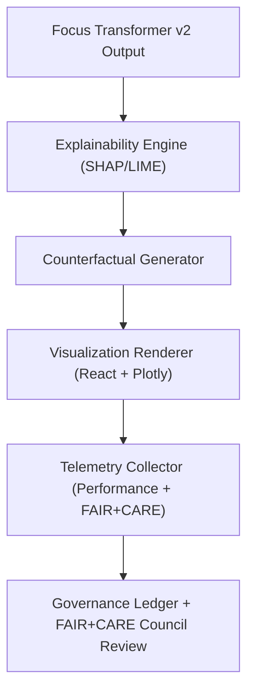

<div align="center">

# 🔍 **Kansas Frontier Matrix — Explainability Dashboard & AI Insight Visualization Guide**
`docs/guides/visualization/explainability-dashboard.md`

**Purpose:**  
Define the architecture, visualization standards, and ethical governance of the **Explainability Dashboard** in the Kansas Frontier Matrix (KFM).  
This interface visualizes **Focus Mode AI reasoning**, **SHAP/LIME results**, and **counterfactual analyses** to support transparency, auditability, and FAIR+CARE alignment.

[](../../README.md)
[](../../../LICENSE)
[](../../../docs/standards/README.md)
[](../../../releases/)
</div>

---

## 📘 Overview

The **Explainability Dashboard** visualizes how Focus Mode AI and Graph-Augmented Intelligence (GAI) models interpret context, environment, and provenance data.  
Its design provides researchers, auditors, and community reviewers with **interactive evidence** behind AI outputs—bridging visual analytics and ethical governance.

Key objectives:
- Visualize AI feature attributions and model reasoning paths  
- Display confidence intervals and SHAP/LIME plots in real-time  
- Enable FAIR+CARE-certified audit visibility and provenance traceability  
- Support cultural data protection and community consent for insights display  

---

## 🗂️ Directory Context

```plaintext
docs/guides/visualization/
├── README.md                        # Visualization overview
├── maplibre-ui-design.md            # Map-based UI framework
├── timeline-visualization.md        # Temporal storytelling interface
├── accessibility-standards.md       # Accessibility and inclusion governance
└── explainability-dashboard.md      # This document
```

---

## 🧩 Dashboard Architecture



---

## ⚙️ Component Overview

| Component | Function | Libraries / Tools |
|------------|-----------|-------------------|
| **AttributionView** | Displays feature weights and contributions (SHAP, LIME) | Plotly, D3.js |
| **CounterfactualPanel** | “What-if” scenario exploration | ECharts, Vega-Lite |
| **FaithfulnessChart** | Time-series of model faithfulness metrics | Recharts |
| **ExplainabilitySummary** | Text + visual summaries of AI decisions | Markdown + React Components |
| **TelemetryMonitor** | Logs inference latency, energy use, and fairness | `focus-telemetry.json` |
| **EthicsReviewPanel** | Displays cultural sensitivity or CARE flags | FAIR+CARE audit API |

---

## 🧠 Visualization Elements

| Visualization Type | Description | Data Source |
|--------------------|-------------|--------------|
| **SHAP Summary Plot** | Shows global importance of model features | `reports/ai/explainability/shap-summary.json` |
| **LIME Local Plot** | Highlights feature influence for a single inference | `reports/ai/explainability/lime-local.json` |
| **Counterfactual Heatmap** | Visualizes sensitivity across variable perturbations | `reports/ai/explainability/counterfactual.json` |
| **Provenance Graph** | Traces data sources influencing an inference | Neo4j Knowledge Graph |
| **Faithfulness Timeline** | Plots model reliability over version history | `releases/v*/focus-telemetry.json` |

---

## 🧾 Example Explainability Data Record

```json
{
  "explainability_id": "focus-explain-2025-11-09-0003",
  "model": "focus-transformer-v2",
  "task": "Site Historical Inference",
  "top_features": ["soil_moisture", "plat_1870", "proximity_water"],
  "feature_contributions": {
    "soil_moisture": 0.32,
    "plat_1870": 0.27,
    "proximity_water": 0.19
  },
  "counterfactual_sensitivity": {
    "Δsoil_moisture +0.1": "+6%",
    "Δelevation -5m": "-3%"
  },
  "faithfulness_score": 0.89,
  "faircare_status": "Pass",
  "timestamp": "2025-11-09T12:00:00Z"
}
```

---

## 📊 FAIR+CARE Visualization Integration

| Principle | Implementation | Validation Artifact |
|------------|----------------|--------------------|
| **Findable** | Explainability records indexed by UUIDs | `ai-governance-ledger.md` |
| **Accessible** | Public reports under CC-BY 4.0 | `docs/guides/ai/LEDGER/explainability/` |
| **Interoperable** | Uses FAIR+CARE telemetry schema | `telemetry_schema` |
| **Reusable** | Cross-linked to AI provenance graphs | `focus-telemetry.json` |
| **Collective Benefit** | Provides ethical transparency in AI decisions | FAIR+CARE audit |
| **Authority to Control** | CARE consent governs data display | `data-generalization/README.md` |
| **Responsibility** | Energy + latency metrics logged in telemetry | `focus-telemetry.json` |
| **Ethics** | Council review of explainability content | Governance Ledger |

---

## ♿ Accessibility & Interaction Features

| Feature | Description | FAIR+CARE Integration |
|----------|--------------|------------------------|
| **Keyboard Operability** | All dashboard controls accessible via keyboard | WCAG 2.1 AA compliant |
| **Color Palette** | Contrast ratio ≥ 4.5:1, color-blind friendly | Design Tokens System |
| **Alt Descriptions** | All charts include ARIA & alt text | Screen reader validated |
| **Reduced Motion Mode** | Optional static transitions | Energy-efficient rendering |
| **Ethical Data Warnings** | CARE flag displayed for restricted AI insights | FAIR+CARE audit required |

---

## ⚙️ CI/CD Validation Workflows

| Workflow | Function | Output |
|-----------|-----------|--------|
| `ai-explainability.yml` | Generate SHAP/LIME/counterfactual plots | `reports/ai/explainability/*.json` |
| `ui-accessibility-validate.yml` | Test dashboard accessibility | `reports/accessibility/explainability-ui.json` |
| `telemetry-export.yml` | Export rendering and energy metrics | `releases/v*/focus-telemetry.json` |
| `faircare-validate.yml` | Verify ethical visualization & cultural sensitivity | `reports/faircare/explainability-audit.json` |

---

## 🧩 Example Governance Ledger Entry

```json
{
  "ledger_id": "explainability-ledger-2025-11-09-0001",
  "component": "AI Explainability Dashboard",
  "model": "focus-transformer-v2",
  "faithfulness_score": 0.89,
  "faircare_status": "Pass",
  "auditor": "FAIR+CARE Council",
  "timestamp": "2025-11-09T12:00:00Z"
}
```

---

## 🕰️ Version History

| Version | Date | Author | Summary |
|----------|------|--------|----------|
| v10.0.0 | 2025-11-09 | Core Team | Introduced explainability dashboard design with FAIR+CARE integration and accessibility compliance |
| v9.7.0 | 2025-11-03 | A. Barta | Added SHAP/LIME explainability visualization system prototype |

---

<div align="center">

© 2025 Kansas Frontier Matrix Project  
Master Coder Protocol v6.3 · FAIR+CARE Certified · Diamond⁹ Ω / Crown∞Ω Ultimate Certified  

[Back to Visualization Guides](./README.md) · [Governance Charter](../../../docs/standards/governance/ROOT-GOVERNANCE.md)

</div>

