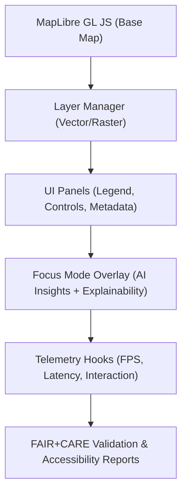

<div align="center">

# 🗺️ **Kansas Frontier Matrix — MapLibre UI Design & Interaction Framework**
`docs/guides/visualization/maplibre-ui-design.md`

**Purpose:**  
Define the **user interface, component layout, and interaction model** for the MapLibre-based visualization layer of the Kansas Frontier Matrix (KFM).  
Ensures accessible, performant, and FAIR+CARE-compliant map experiences across browsers and devices.

[](../../README.md)
[](../../../LICENSE)
[](../../../docs/standards/README.md)
[](../../../releases/)
</div>

---

## 📘 Overview

This guide defines the **MapLibre UI structure and design framework** for the KFM visualization stack.  
The interface supports **layered geographic storytelling**, **AI explainability overlays**, and **accessibility features** under FAIR+CARE governance.  

Design priorities include:
- Spatial clarity and minimal visual clutter  
- Efficient rendering for offline PMTiles / MBTiles sources  
- Accessible controls that meet **WCAG 2.1 AA** standards  
- Integrated **Focus Mode overlays** for temporal and AI-driven insights  

---

## 🗂️ Directory Context

```plaintext
docs/guides/visualization/
├── README.md                         # Visualization & Design overview
├── maplibre-ui-design.md             # This document
├── timeline-visualization.md         # Temporal storytelling interface
├── explainability-dashboard.md       # SHAP/LIME visualization integration
└── accessibility-standards.md        # WCAG & FAIR+CARE compliance rules
```

---

## 🧩 UI Architecture Overview



---

## ⚙️ Component Structure (React + MapLibre)

| Component | Description | Key Features |
|------------|--------------|---------------|
| **MapContainer** | Initializes and renders MapLibre map | Binds map state, handles resize, and telemetry hooks |
| **LayerControlPanel** | Toggles thematic layers (terrain, hydrology, history) | Uses FAIR+CARE tagging for sensitive layers |
| **LegendPanel** | Displays symbology and data provenance | Pulls metadata from STAC/DCAT catalogs |
| **TimelineOverlay** | Synchronizes temporal data across map and UI | Animated playback with accessibility options |
| **AIExplainabilityOverlay** | Displays Focus Mode AI outputs | Includes explainable context via SHAP/LIME data |
| **TelemetryMonitor** | Logs render performance and energy metrics | Records FPS, CPU/GPU, and accessibility usage |
| **AccessibilityToolbar** | High-contrast toggle, screen reader hints | Ensures WCAG 2.1 AA compliance |

---

## 🎨 Design Tokens & Theming

| Token | Purpose | Example |
|--------|----------|----------|
| `--color-background` | Map panel base color | `#FFFFFF` |
| `--color-primary` | Primary UI accent | `#00509E` |
| `--color-secondary` | Highlight or selection color | `#E8A317` |
| `--font-family` | Global typeface | `"Inter", sans-serif` |
| `--border-radius` | Panel rounding for modern aesthetic | `0.5rem` |
| `--transition-speed` | UI interaction speed | `0.25s ease` |

All design tokens are stored under `web/public/css/tokens.css` and are used globally across the visualization system.

---

## 🧮 Layer Interaction Guidelines

| Interaction | Expected Behavior | FAIR+CARE Alignment |
|--------------|------------------|----------------------|
| **Hover / Tooltip** | Shows dataset name, source, and metadata | Provenance transparency |
| **Click / Focus** | Expands contextual information | Accessible keyboard navigation |
| **Zoom Range Visibility** | Automatically enables or disables dense layers | Reduces overdraw and energy usage |
| **Sensitive Layers** | Requires opt-in acknowledgment (CARE flag) | Protects community data |
| **Timeline Sync** | Adjusts map features dynamically over time | Historical transparency with interpretive control |

---

## 📊 Accessibility & Performance Telemetry

```json
{
  "component": "MapLibre UI",
  "fps": 60,
  "cpu_percent": 68,
  "gpu_load": 63,
  "accessibility_compliance": "AA",
  "user_interactions": 142,
  "energy_joules": 1.18,
  "faircare_status": "Pass",
  "timestamp": "2025-11-09T12:00:00Z"
}
```

Telemetry is automatically logged through the **Focus Telemetry Collector**, contributing to FAIR+CARE sustainability audits.

---

## ♿ Accessibility & FAIR+CARE Integration

| Principle | Implementation | Validation Artifact |
|------------|----------------|--------------------|
| **Findable** | All UI elements labeled with ARIA roles | `accessibility-standards.md` |
| **Accessible** | Keyboard + screen reader tested | `reports/accessibility.json` |
| **Interoperable** | MapLibre/React components conform to WCAG 2.1 AA | CI Accessibility Audit |
| **Reusable** | Modular, themable UI components | Component library |
| **Collective Benefit** | Promotes inclusivity in public historical exploration | FAIR+CARE audit report |
| **Authority to Control** | Visibility toggles for sensitive spatial data | `data-generalization/README.md` |
| **Responsibility** | Logs performance & accessibility metrics | `focus-telemetry.json` |
| **Ethics** | FAIR+CARE Council reviews interface design | Governance Ledger |

---

## ⚙️ CI/CD Validation Workflows

| Workflow | Purpose | Output |
|-----------|----------|--------|
| `ui-accessibility-validate.yml` | Runs Lighthouse + WCAG 2.1 AA tests | `reports/accessibility.json` |
| `ui-performance-benchmark.yml` | Measures FPS, latency, and resource load | `reports/perf/maplibre-ui-benchmark.json` |
| `telemetry-export.yml` | Logs interaction and energy telemetry | `releases/v*/focus-telemetry.json` |
| `faircare-validate.yml` | Ensures design ethics and sensitivity controls | `reports/faircare/ui-ethics.json` |

---

## 🧩 Example FAIR+CARE Ledger Entry

```json
{
  "ledger_id": "ui-ledger-2025-11-09-001",
  "component": "MapLibre UI",
  "version": "v10.0.0",
  "wcag_compliance": "AA",
  "fps": 59.8,
  "energy_joules": 1.21,
  "faircare_status": "Pass",
  "auditors": ["FAIR+CARE Council"],
  "timestamp": "2025-11-09T12:00:00Z"
}
```

---

## 🕰️ Version History

| Version | Date | Author | Summary |
|----------|------|--------|----------|
| v10.0.0 | 2025-11-09 | Core Team | Established MapLibre UI design framework with FAIR+CARE accessibility and telemetry integration |
| v9.7.0  | 2025-11-03 | A. Barta | Introduced base layer interaction and responsive map interface design |

---

<div align="center">

© 2025 Kansas Frontier Matrix Project  
Master Coder Protocol v6.3 · FAIR+CARE Certified · Diamond⁹ Ω / Crown∞Ω Ultimate Certified  

[Back to Visualization Guides](./README.md) · [Governance Charter](../../../docs/standards/governance/ROOT-GOVERNANCE.md)

</div>

