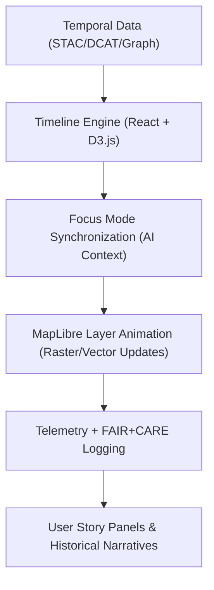

<div align="center">

# ⏳ **Kansas Frontier Matrix — Timeline Visualization & Temporal Interface Guide**
`docs/guides/visualization/timeline-visualization.md`

**Purpose:**  
Define the **design architecture, data integration, and FAIR+CARE accessibility framework** for KFM’s timeline-based visualization systems.  
This document details the standards used for **temporal data interaction**, **storytelling interfaces**, and **AI-driven historical analysis** within the web application.

[](../../README.md)
[](../../../LICENSE)
[](../../../docs/standards/README.md)
[](../../../releases/)
</div>

---

## 📘 Overview

The **Timeline Visualization System** enables dynamic exploration of historical and environmental change through an interactive, FAIR+CARE-compliant interface.  
It connects **spatial datasets**, **AI contextual layers**, and **user narratives** along a unified temporal axis.

Core goals:
- Render time-series data efficiently across multiple map layers  
- Provide a narrative-driven interface for historical storytelling  
- Ensure accessibility and governance compliance for all temporal data visualizations  

---

## 🗂️ Directory Context

```plaintext
docs/guides/visualization/
├── README.md                         # Visualization overview
├── maplibre-ui-design.md             # Map interface and layer design
├── timeline-visualization.md         # This document
├── explainability-dashboard.md       # AI reasoning visualization integration
└── accessibility-standards.md        # Accessibility & ethics framework
```

---

## 🧩 Architecture Overview



---

## ⚙️ Component Structure (React + D3)

| Component | Description | Data Source |
|------------|--------------|-------------|
| **TimelineContainer** | Root component controlling playback and state | STAC time-series assets |
| **TimeSlider** | Horizontal scroll interface for zoomed temporal navigation | D3 scales + brush interactions |
| **EventMarkers** | Displays events, treaties, or natural occurrences | Neo4j knowledge graph |
| **AIInsightOverlay** | Integrates AI-inferred context from Focus Mode | `focus-telemetry.json` |
| **NarrativePanel** | Shows interpretive story text linked to time range | FAIR+CARE-audited narratives |
| **TelemetryHook** | Captures frame latency and accessibility metrics | Telemetry API |

---

## 🧮 Data Binding Model

```json
{
  "timeline_id": "kfm-treaty-timeline-2025",
  "time_start": "1820-01-01",
  "time_end": "1900-12-31",
  "events": [
    {
      "date": "1854-05-30",
      "title": "Kansas-Nebraska Act",
      "linked_entities": ["Territory Boundary", "Settler Expansion"],
      "region": "Kansas River Valley"
    },
    {
      "date": "1867-10-21",
      "title": "Medicine Lodge Treaty",
      "linked_entities": ["Peace Agreement", "Tribal Lands"],
      "region": "Barber County"
    }
  ],
  "layers": [
    {
      "id": "land_use",
      "type": "raster",
      "time_series": ["landuse_1850.tif", "landuse_1870.tif", "landuse_1900.tif"]
    }
  ]
}
```

---

## 🎨 Design & Interaction Guidelines

| Element | Function | FAIR+CARE Implementation |
|----------|-----------|--------------------------|
| **Timeline Scale** | Zoomable continuous scale | D3 linear/time scaling |
| **Playback Controls** | Play, pause, and frame-step animations | Accessible via keyboard + ARIA roles |
| **Event Markers** | Annotate significant points in time | Tooltips show provenance + sources |
| **AI Insight Overlay** | Dynamically inserts contextual analysis | FAIR+CARE-governed AI layer |
| **Ethical Content Flags** | Marks potentially sensitive topics | CARE review approval required |

---

## ♿ Accessibility Integration

| Principle | Implementation | Validation Artifact |
|------------|----------------|--------------------|
| **Findable** | Events indexed by unique temporal IDs | `telemetry_schema` |
| **Accessible** | Color-blind friendly palettes + ARIA tags | `accessibility-standards.md` |
| **Interoperable** | JSON-LD metadata structure for time-series | `data/stac/*.json` |
| **Reusable** | Timeline datasets versioned per release | `releases/v*/manifest.zip` |
| **Collective Benefit** | Promotes understanding of historical ecology | FAIR+CARE Council audit |
| **Authority to Control** | Sensitive events reviewed by communities | `data-generalization/README.md` |
| **Responsibility** | Performance & accessibility telemetry tracking | `focus-telemetry.json` |
| **Ethics** | Contextual narratives reviewed by historians | Governance Ledger approval |

---

## ⚙️ Performance & Telemetry Metrics

| Metric | Description | Target |
|---------|--------------|---------|
| **Frame Latency** | Render time per timeline update | ≤ 20 ms |
| **Memory Footprint** | Resource usage during playback | ≤ 500 MB |
| **Energy (Joules)** | Total energy used during session | ≤ 1.5 J |
| **Accessibility Rating** | WCAG 2.1 compliance | “AA” or better |
| **FAIR+CARE Audit** | Council-verified compliance | Required for release |

---

## 🧾 Example FAIR+CARE Timeline Record

```json
{
  "timeline_id": "kfm-treaty-timeline-2025",
  "component": "Timeline Visualization",
  "frame_latency_ms": 18.4,
  "accessibility_compliance": "AA",
  "faircare_status": "Pass",
  "auditor": "FAIR+CARE Council",
  "timestamp": "2025-11-09T12:00:00Z"
}
```

---

## ⚙️ CI/CD Validation Workflows

| Workflow | Purpose | Output Artifact |
|-----------|-----------|----------------|
| `timeline-validate.yml` | Validate data bindings and playback performance | `reports/timeline/timeline-validation.json` |
| `ui-accessibility-validate.yml` | Confirm FAIR+CARE and WCAG 2.1 compliance | `reports/accessibility/timeline-accessibility.json` |
| `telemetry-export.yml` | Export runtime metrics to telemetry | `releases/v*/focus-telemetry.json` |
| `faircare-validate.yml` | Ethical content & narrative review | `reports/faircare/timeline-audit.json` |

---

## 🕰️ Version History

| Version | Date | Author | Summary |
|----------|------|--------|----------|
| v10.0.0 | 2025-11-09 | Core Team | Established full timeline visualization architecture with FAIR+CARE accessibility and performance telemetry |
| v9.7.0 | 2025-11-03 | A. Barta | Introduced timeline playback and event binding prototype for historical datasets |

---

<div align="center">

© 2025 Kansas Frontier Matrix Project  
Master Coder Protocol v6.3 · FAIR+CARE Certified · Diamond⁹ Ω / Crown∞Ω Ultimate Certified  

[Back to Visualization Guides](./README.md) · [Governance Charter](../../../docs/standards/governance/ROOT-GOVERNANCE.md)

</div>

