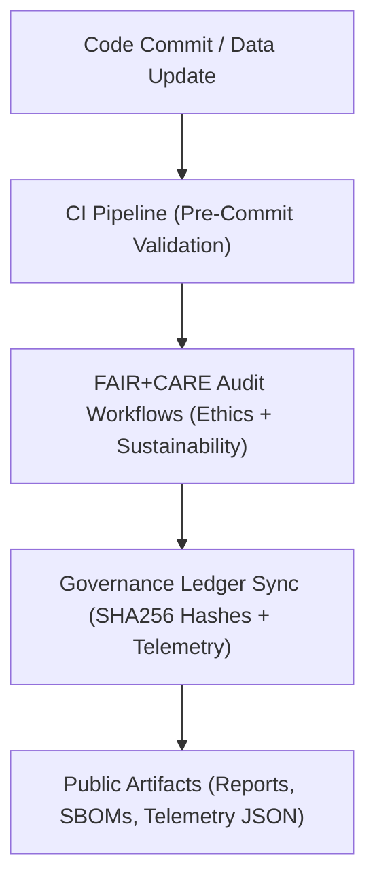
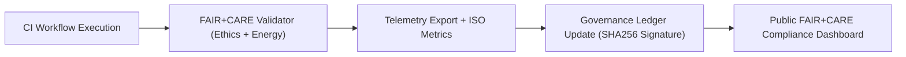

<div align="center">

# ⚙️ **Kansas Frontier Matrix — Workflow Automation & FAIR+CARE Validation Guides**
`docs/guides/workflows/README.md`

**Purpose:**  
Document and standardize all **CI/CD, validation, and governance workflows** used across the Kansas Frontier Matrix (KFM).  
Defines automation pipelines for **FAIR+CARE compliance**, **ISO sustainability validation**, and **telemetry synchronization** within the KFM monorepo.

[](../../README.md)
[](../../../LICENSE)
[](../../../docs/standards/README.md)
[](../../../releases/)
</div>

---

## 📘 Overview

The **Workflow Guides** define how automated processes in KFM ensure consistency, governance compliance, and reproducibility.  
These workflows span continuous integration (CI), data validation, telemetry tracking, and FAIR+CARE auditing — guaranteeing ethical automation under **MCP-DL v6.3**.

**Goals**
- Automate governance and validation routines  
- Ensure sustainable and ethical system operations  
- Maintain transparency and traceability across pipelines  
- Integrate FAIR+CARE, ISO, and MCP protocols into CI/CD  

---

## 🗂️ Directory Layout

```plaintext
docs/guides/workflows/
├── README.md                          # This overview
├── ci-pipeline.md                     # Continuous Integration and validation automation
├── validation-workflows.md            # FAIR+CARE & ISO data validation pipelines
├── telemetry-sync.md                  # Workflow for telemetry export and governance linkage
├── governance-ledger-pipeline.md      # Governance Ledger synchronization process
└── reports/                           # Workflow run summaries and audit logs
```

---

## 🧩 Workflow Architecture



---

## ⚙️ Core Workflow Types

| Workflow | Function | Key Output | Location |
|-----------|-----------|------------|-----------|
| **Build & Validate** | Runs environment builds and schema checks | `reports/ci-build-report.json` | `.github/workflows/build.yml` |
| **FAIR+CARE Validation** | Performs ethical and sustainability audits | `reports/faircare-validation.json` | `.github/workflows/faircare-validate.yml` |
| **Telemetry Export** | Logs runtime performance and environmental metrics | `releases/v*/focus-telemetry.json` | `.github/workflows/telemetry-export.yml` |
| **Governance Sync** | Commits validated hashes to ledger | `docs/standards/governance/LEDGER/*.json` | `.github/workflows/ledger-sync.yml` |
| **Provenance Trace** | Validates lineage and provenance consistency | `reports/provenance-audit.json` | `.github/workflows/provenance-validate.yml` |

---

## ⚖️ FAIR+CARE Integration Framework

| Principle | Implementation | Validation Artifact |
|------------|----------------|--------------------|
| **Findable** | Workflow IDs, reports, and outputs indexed in ledger | `ledger-sync.yml` |
| **Accessible** | All CI/CD outputs published under CC-BY 4.0 | Repository `/reports` |
| **Interoperable** | YAML workflows aligned with FAIR+CARE schema | `telemetry_schema` |
| **Reusable** | Automation templates reused across pipeline families | `.github/workflows/` |
| **Collective Benefit** | Transparent automation benefits research reproducibility | FAIR+CARE audit |
| **Authority to Control** | Council approval required for production workflows | `governance-ledger-pipeline.md` |
| **Responsibility** | Logs energy + ethics telemetry per CI run | `telemetry_ref` |
| **Ethics** | All automated actions validated before release | FAIR+CARE Council Review |

---

## 🧾 Example Workflow Run Log

```json
{
  "workflow_id": "ci-pipeline-2025-11-09-0008",
  "trigger": "push to main",
  "steps": [
    "Validate YAML + Markdown",
    "Build Micromamba Environment",
    "Run FAIR+CARE Validation",
    "Sync Governance Ledger"
  ],
  "metrics": {
    "runtime_minutes": 17.3,
    "energy_joules": 9.7,
    "carbon_gCO2e": 0.0043
  },
  "faircare_status": "Pass",
  "auditor": "FAIR+CARE Council",
  "timestamp": "2025-11-09T12:45:00Z"
}
```

---

## 🧠 Workflow → Governance Ledger Mapping

| Workflow | Ledger Target | Description |
|-----------|----------------|-------------|
| `build.yml` | `build-ledger.json` | Tracks reproducible builds and SBOM integrity |
| `faircare-validate.yml` | `faircare-ledger.json` | Logs FAIR+CARE audit approvals |
| `telemetry-export.yml` | `telemetry-ledger.json` | Syncs energy, carbon, and performance metrics |
| `ledger-sync.yml` | `governance-ledger.json` | Commits all validated outputs to master ledger |
| `iso-audit.yml` | `sustainability-ledger.json` | Reports ISO 50001/14064 certification trace |

---

## ⚙️ Validation Workflows

| Stage | Function | Validation Target | Output |
|--------|-----------|-------------------|---------|
| **Pre-Commit Validation** | Checks schema and format | YAML, JSON, Markdown | `reports/pre-commit.json` |
| **Data Validation** | Validates STAC/DCAT and FAIR+CARE metadata | Metadata | `reports/data-validation.json` |
| **Telemetry Check** | Verifies energy and carbon thresholds | Environmental | `reports/telemetry-validation.json` |
| **Governance Audit** | Ensures ledger and SBOM integrity | Governance | `reports/ledger-validation.json` |

---

## 🧩 Governance Ledger Example Record

```json
{
  "ledger_id": "workflow-ledger-2025-11-09-0003",
  "workflows": [
    "build.yml",
    "faircare-validate.yml",
    "telemetry-export.yml"
  ],
  "sha256": "f9b38e12c4a5...",
  "energy_joules": 8.9,
  "carbon_gCO2e": 0.0038,
  "faircare_status": "Pass",
  "auditor": "FAIR+CARE Council",
  "timestamp": "2025-11-09T13:00:00Z"
}
```

---

## ⚙️ FAIR+CARE Validation Flow



---

## ⚖️ Continuous Improvement Targets

| Metric | Description | Target |
|---------|--------------|---------|
| **Workflow Energy (J)** | Joules used per CI/CD run | ≤ 15 |
| **Audit Pass Rate (%)** | FAIR+CARE validation success | 100 |
| **Carbon Output (gCO₂e)** | Per pipeline execution | ≤ 0.006 |
| **Ledger Update Success (%)** | Governance sync reliability | 100 |
| **Transparency Score** | Report publication rate | 100 |

---

## 🕰️ Version History

| Version | Date | Author | Summary |
|----------|------|--------|----------|
| v10.0.0 | 2025-11-09 | Core Team | Added unified workflow automation guide with FAIR+CARE and ISO governance integration |
| v9.7.0  | 2025-11-03 | A. Barta | Introduced core CI/CD, telemetry, and governance validation workflows |

---

<div align="center">

© 2025 Kansas Frontier Matrix Project  
Master Coder Protocol v6.3 · FAIR+CARE Certified · Diamond⁹ Ω / Crown∞Ω Ultimate Certified  

[Back to Guides Index](../README.md) · [Governance Charter](../../../docs/standards/governance/ROOT-GOVERNANCE.md)

</div>

