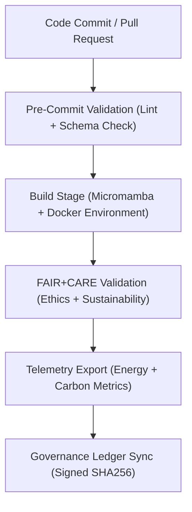
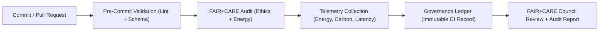

<div align="center">

# 🚀 **Kansas Frontier Matrix — Continuous Integration (CI) Pipeline & FAIR+CARE Validation Framework**
`docs/guides/workflows/ci-pipeline.md`

**Purpose:**  
Define the structure, governance alignment, and sustainability validation system for the **Continuous Integration (CI) pipeline** within the Kansas Frontier Matrix (KFM).  
Ensures that all build, test, and deployment processes follow **FAIR+CARE**, **ISO 50001/14064**, and **MCP-DL v6.3** reproducibility standards.

[](../../README.md)
[](../../../LICENSE)
[](../../../docs/standards/README.md)
[](../../../releases/)
</div>

---

## 📘 Overview

The **Continuous Integration (CI) Framework** automates environment setup, validation, and telemetry tracking for all KFM modules.  
Every CI run undergoes FAIR+CARE audits, energy telemetry collection, and Governance Ledger synchronization — ensuring that every automated process is ethically and sustainably executed.

**Goals**
- Guarantee reproducible builds with verified dependencies  
- Integrate FAIR+CARE validation into all automation steps  
- Track energy and carbon metrics during each CI run  
- Maintain transparency through telemetry reports and governance logs  

---

## 🗂️ Directory Context

```plaintext
docs/guides/workflows/
├── README.md                         # Workflow overview
├── ci-pipeline.md                    # This document
├── validation-workflows.md           # FAIR+CARE validation workflow guide
├── telemetry-sync.md                 # Telemetry export and ledger linkage
├── governance-ledger-pipeline.md     # Ledger integration workflows
└── reports/                          # CI build and validation reports
```

---

## 🧩 CI Architecture Overview



---

## ⚙️ Pipeline Components

| Stage | Description | FAIR+CARE Integration |
|--------|-------------|-----------------------|
| **Pre-Commit Validation** | Linting, schema validation, and style enforcement | FAIR+CARE metadata tagging |
| **Build Stage** | Environment creation (Micromamba/Docker) | SBOM + Manifest generation |
| **Test Stage** | Unit, integration, and governance compliance tests | FAIR+CARE test validation |
| **Telemetry Collection** | Logs performance and sustainability metrics | `focus-telemetry.json` |
| **Governance Sync** | Signs and records CI results in Governance Ledger | `ledger-sync.yml` |

---

## 🧾 Example CI Workflow (GitHub Actions)

```yaml
name: CI · Build · FAIR+CARE Validation
on:
  push:
    branches: [ main, develop ]
  pull_request:
jobs:
  build-and-validate:
    runs-on: ubuntu-latest
    steps:
      - name: Checkout Repository
        uses: actions/checkout@v4
      - name: Setup Micromamba
        uses: mamba-org/setup-micromamba@v1
        with:
          environment-file: environment.yml
      - name: Run FAIR+CARE Validation
        run: python src/pipelines/validation/run_faircare_audit.py
      - name: Generate SBOM
        run: ./scripts/generate_sbom.sh
      - name: Telemetry Export
        run: python src/pipelines/telemetry/export_metrics.py
      - name: Governance Ledger Sync
        run: python src/pipelines/governance/sync_ledger.py
```

---

## ⚖️ FAIR+CARE Integration Matrix

| Principle | Implementation | Validation Artifact |
|------------|----------------|--------------------|
| **Findable** | CI runs logged with unique UUIDs | `reports/workflows/ci-build-report.json` |
| **Accessible** | CI results available via FAIR+CARE dashboard | GitHub Actions Artifacts |
| **Interoperable** | FAIR+CARE + ISO metadata integrated in SBOM | `sbom_ref` |
| **Reusable** | Workflow templates reused across pipelines | `.github/workflows/` |
| **Collective Benefit** | Ensures transparent, ethical automation | FAIR+CARE Council report |
| **Authority to Control** | Governance approval before production deploy | Governance Ledger |
| **Responsibility** | Energy telemetry tracked per CI run | `telemetry_ref` |
| **Ethics** | FAIR+CARE validation enforces ethical automation | `faircare-validate.yml` |

---

## 🧮 Example CI Telemetry Record

```json
{
  "ci_run_id": "ci-2025-11-09-0004",
  "branch": "main",
  "status": "Success",
  "metrics": {
    "runtime_minutes": 18.3,
    "energy_joules": 9.8,
    "carbon_gCO2e": 0.0042,
    "tests_passed": 124,
    "faircare_compliance_rate": 100
  },
  "faircare_status": "Pass",
  "auditor": "FAIR+CARE Council",
  "timestamp": "2025-11-09T12:45:00Z"
}
```

---

## ⚙️ CI Validation Workflows

| Workflow | Function | Output |
|-----------|-----------|--------|
| `build.yml` | Builds and validates environments | `reports/workflows/ci-build-report.json` |
| `faircare-validate.yml` | Runs ethical + sustainability validation | `reports/faircare/ci-validation.json` |
| `telemetry-export.yml` | Logs performance + energy metrics | `releases/v*/focus-telemetry.json` |
| `ledger-sync.yml` | Commits build validation hash to ledger | `docs/standards/governance/LEDGER/ci-ledger.json` |

---

## 🧩 Governance Ledger Record Example

```json
{
  "ledger_id": "ci-ledger-2025-11-09-0001",
  "branch": "main",
  "workflow": "build.yml",
  "energy_joules": 9.8,
  "carbon_gCO2e": 0.0042,
  "runtime_minutes": 18.3,
  "faircare_status": "Pass",
  "auditor": "FAIR+CARE Council",
  "timestamp": "2025-11-09T12:50:00Z"
}
```

---

## 🧠 CI → FAIR+CARE Governance Flow



---

## ⚙️ ISO & Sustainability Metrics

| Metric | Target | Validation Source |
|---------|---------|-------------------|
| **Energy (J)** | ≤ 15 per CI run | `telemetry-export.yml` |
| **Carbon (gCO₂e)** | ≤ 0.006 | `carbon-audit.yml` |
| **Runtime Efficiency (%)** | ≥ 90 | CI performance summary |
| **FAIR+CARE Pass Rate (%)** | 100 | `faircare-validate.yml` |
| **Ledger Update Success (%)** | 100 | `ledger-sync.yml` |

---

## ⚖️ Continuous Improvement Targets

| Objective | Target | Verification |
|------------|---------|---------------|
| **Reduce average CI runtime** | -10% per quarter | FAIR+CARE reports |
| **Reduce CI energy per build** | ≤ 10 J average | Telemetry validation |
| **Maintain full compliance** | 100% FAIR+CARE pass | Governance Ledger |
| **Increase transparency** | All CI reports public | FAIR+CARE dashboard |

---

## 🕰️ Version History

| Version | Date | Author | Summary |
|----------|------|--------|----------|
| v10.0.0 | 2025-11-09 | Core Team | Added CI pipeline architecture and FAIR+CARE validation integration |
| v9.7.0  | 2025-11-03 | A. Barta | Introduced build, validation, and governance automation base structure |

---

<div align="center">

© 2025 Kansas Frontier Matrix Project  
Master Coder Protocol v6.3 · FAIR+CARE Certified · Diamond⁹ Ω / Crown∞Ω Ultimate Certified  

[Back to Workflow Guides](./README.md) · [Governance Charter](../../../docs/standards/governance/ROOT-GOVERNANCE.md)

</div>

