<div align="center">

# 🚀 **Kansas Frontier Matrix — Continuous Integration (CI) Pipeline & FAIR+CARE Validation Framework**  
`docs/guides/workflows/ci-pipeline.md`

**Purpose**  
Define the **structure, governance alignment, and sustainability validation system** for the  
Continuous Integration (CI) pipeline within the Kansas Frontier Matrix (KFM).  
Ensures that all build, test, and validation processes follow **FAIR+CARE v2**,  
**ISO 50001 / 14064**, and **MCP-DL v6.3** reproducibility standards.

</div>

---

# 📘 Overview

The **CI Framework** automates:

- environment setup & dependency verification  
- static analysis & security scanning  
- schema + FAIR+CARE validation  
- Telemetry v2 collection (energy, CO₂e, errors, coverage)  
- Governance Ledger updates & lineage ties  

Every CI run is treated as an **auditable activity** with:

- deterministic build logic  
- reproducible environments  
- tracked sustainability footprint  
- embedded governance metadata  

---

# 🗂️ Directory Context

~~~text
docs/guides/workflows/
├── README.md                         # Workflow overview
├── ci-pipeline.md                    # THIS DOCUMENT
├── validation-workflows.md           # FAIR+CARE validation workflow guide
├── telemetry-sync.md                 # Telemetry export & ledger linkage
├── governance-ledger-pipeline.md     # Governance ledger pipeline guide
└── reports/
    └── ci/                           # CI build & validation reports
~~~

---

# 🧩 CI Architecture Overview (GitHub-Safe Mermaid)

```mermaid
flowchart TD

A["Code Commit / Pull Request"] --> B["Pre-Commit & Lint<br/>schema · style · static checks"]
B --> C["Build Stage<br/>environment setup · deps · SBOM"]
C --> D["Test & Validation<br/>unit · integration · FAIR+CARE v2"]
D --> E["Telemetry Export<br/>energy · CO₂ · coverage · failures"]
E --> F["Governance Ledger Sync<br/>CI run recorded"]
````

---

# 1️⃣ CI Stages & Responsibilities

| Stage             | Description                                         | FAIR+CARE Link                         |
| ----------------- | --------------------------------------------------- | -------------------------------------- |
| Pre-Commit & Lint | Lint, format, basic schema checks                   | Prevent low-quality / unsafe changes   |
| Build Stage       | Environment setup (Micromamba/uv/venv/Docker), SBOM | Reproducible environments + SBOM       |
| Test & Validation | Unit, integration, lineage, governance tests        | FAIR+CARE v2 & MCP-DL v6.3             |
| Telemetry Export  | Emit Telemetry v2 for CI run                        | ISO 50001/14064 sustainability metrics |
| Governance Sync   | Append CI run record to Governance Ledger           | Immutable audit trail                  |

---

# 2️⃣ Example CI Workflow (GitHub Actions Skeleton)

```yaml
name: CI · Build · Test · FAIR+CARE

on:
  push:
    branches: [ main, develop ]
  pull_request:

jobs:
  build-test-validate:
    runs-on: ubuntu-latest

    steps:
      - name: Checkout Repository
        uses: actions/checkout@v4

      - name: Setup Python
        uses: actions/setup-python@v5
        with:
          python-version: "3.11"

      - name: Install Dependencies
        run: |
          pip install --upgrade pip
          pip install -e ".[dev]"

      - name: Lint & Format
        run: |
          ruff check .
          ruff format --check .

      - name: Run Tests
        run: |
          pytest --maxfail=1 --disable-warnings -q

      - name: Run FAIR+CARE Validation
        run: |
          python src/pipelines/validation/run_faircare_audit.py \
            --out docs/guides/workflows/reports/ci/faircare-ci.json

      - name: Generate SBOM
        run: ./scripts/generate_sbom.sh \
          --out releases/v10.4.2/sbom.spdx.json

      - name: Export CI Telemetry
        run: |
          python src/pipelines/telemetry/export_ci_metrics.py \
            --out docs/guides/workflows/reports/ci/ci-telemetry.ndjson

      - name: Sync CI Run to Governance Ledger
        run: |
          python src/pipelines/governance/sync_ci_ledger.py \
            --telemetry docs/guides/workflows/reports/ci/ci-telemetry.ndjson \
            --faircare docs/guides/workflows/reports/ci/faircare-ci.json
```

---

# 3️⃣ FAIR+CARE v2 Integration Matrix (CI Context)

| Principle / Dimension    | Implementation in CI                                     | Validation Artifact                          |
| ------------------------ | -------------------------------------------------------- | -------------------------------------------- |
| **Findable**             | Each CI run has a unique ID and artifact bundle          | `reports/ci/ci-run-*.json`                   |
| **Accessible**           | CI results & artifacts available via GitHub & dashboards | GitHub artifacts, KFM dashboards             |
| **Interoperable**        | SBOM & telemetry structured using standard schemas       | `sbom.spdx.json`, Telemetry v2 schema        |
| **Reusable**             | Workflows reused across pipelines, templated & versioned | `.github/workflows/*.yml`                    |
| **Collective Benefit**   | CI emits sustainability + ethics metrics for analysis    | Telemetry v2 + FAIR+CARE CI reports          |
| **Authority to Control** | Required status checks gate merges                       | Branch protection + required checks          |
| **Responsibility**       | Energy & CO₂ tracked; CI policies tuned via Council      | `validation-workflows`, `telemetry-sync`     |
| **Ethics**               | FAIR+CARE CI validations and governance tests mandatory  | `faircare-validate.yml`, `governance-ledger` |

---

# 4️⃣ Example CI Telemetry v2 Record

```json
{
  "pipeline": "ci",
  "stage": "build-test-validate",
  "run_id": "ci-2025-11-16-0004",
  "branch": "main",
  "status": "success",
  "duration_ms": 1098000,
  "tests_passed": 132,
  "tests_failed": 0,
  "coverage_pct": 87.2,
  "energy_wh": 0.012,
  "co2_g": 0.0048,
  "care_violations": 0,
  "sovereigntyConflicts": 0,
  "maskingApplied": false,
  "error_codes": [],
  "timestamp": "2025-11-16T12:45:00Z"
}
```

---

# 5️⃣ CI Validation Workflows

Recommended workflows:

| Workflow                 | Function                                   | Output                                            |
| ------------------------ | ------------------------------------------ | ------------------------------------------------- |
| `build.yml`              | Build & test core modules                  | `reports/ci/ci-build-report.json`                 |
| `faircare-validate.yml`  | Run FAIR+CARE v2 CI checks                 | `reports/ci/faircare-ci.json`                     |
| `telemetry-export.yml`   | Export Telemetry v2 from CI runs           | `data/telemetry/ci.ndjson`                        |
| `telemetry-validate.yml` | Validate Telemetry v2 structure            | `reports/ci/telemetry-validation.json`            |
| `ledger-sync.yml`        | Append CI run entries to Governance Ledger | `docs/reports/audit/data_provenance_ledger.jsonl` |
| `sbom-validate.yml`      | Ensure SBOM matches dependency reality     | `reports/ci/sbom-validation.json`                 |
| `security-scan.yml`      | CodeQL / Trivy / dependency scans          | `reports/ci/security-scan.json`                   |

All must be **required checks** on protected branches.

---

# 6️⃣ Governance Ledger Record Example (CI)

```json
{
  "ledger_id": "ci-ledger-2025-11-16-0001",
  "stage": "ci",
  "workflow": "build-test-validate",
  "branch": "main",
  "commit_sha": "abc123def456",
  "run_id": "ci-2025-11-16-0004",
  "status": "success",
  "energy_wh": 0.012,
  "co2_g": 0.0048,
  "tests_passed": 132,
  "tests_failed": 0,
  "coverage_pct": 87.2,
  "faircare_status": "pass",
  "sbomRef": "releases/v10.4.2/sbom.spdx.json",
  "telemetryRef": "releases/v10.4.2/pipeline-telemetry.json",
  "iso_alignment": ["ISO 50001", "ISO 14064"],
  "timestamp": "2025-11-16T12:50:00Z"
}
```

---

# 7️⃣ CI → FAIR+CARE Governance Flow (Mermaid)

```mermaid
flowchart LR

SRC["Commit / Pull Request"] --> PRE["Pre-Commit & Lint"]
PRE --> TESTS["Build + Tests<br/>unit · integration · governance"]
TESTS --> VAL["FAIR+CARE CI Audit<br/>ethics · CARE v2 rules"]
VAL --> TEL["Telemetry v2 Export<br/>energy · CO₂ · metrics"]
TEL --> LED["Governance Ledger Entry<br/>immutable CI record"]
LED --> COUNCIL["FAIR+CARE Council & Dashboards"]
```



---

# 8️⃣ ISO & Sustainability Metrics in CI

CI pipelines must report:

* **Energy usage (Wh) per run**
* **CO₂e (gCO₂)** per run
* **Trend metrics** (over time, per branch, per workflow)

Targets (example defaults):

| Metric                     | Target  | Validation Source                     |
| -------------------------- | ------- | ------------------------------------- |
| Energy per CI run (Wh)     | ≤ 0.02  | `telemetry-export.yml`                |
| Carbon per CI run (gCO₂e)  | ≤ 0.008 | `sustainability-telemetry-audit.json` |
| FAIR+CARE CI Pass Rate (%) | 100     | `faircare-validate.yml`               |
| Ledger Recording Rate (%)  | 100     | `ledger-sync.yml`                     |

---

# 9️⃣ Developer Checklist

Before marking CI config as compliant:

* [ ] CI runs on `main` and `develop` for pushes and PRs.
* [ ] Lint, tests, and schema checks cover all core modules.
* [ ] FAIR+CARE v2 CI checks integrated and required.
* [ ] Telemetry v2 from CI runs properly emitted & validated.
* [ ] CI governance ledger entries are created and validated.
* [ ] SBOM generation and validation integrated.
* [ ] Security scans (CodeQL/Trivy/etc.) configured and required.

---

# 🕰 Version History

| Version | Date       | Summary                                                                                    |
| ------: | ---------- | ------------------------------------------------------------------------------------------ |
| v10.4.2 | 2025-11-16 | Upgraded to KFM-MDP v10.4.2; added Telemetry v2, CARE v2, ISO-aligned metrics, ledger sync |
| v10.0.0 | 2025-11-09 | Initial CI pipeline architecture and FAIR+CARE validation integration                      |

---

<div align="center">

**Kansas Frontier Matrix — CI Pipeline & FAIR+CARE Framework (v10.4.2)**
Reproducible Builds × FAIR+CARE v2 × ISO Sustainability × Immutable Governance
© 2025 Kansas Frontier Matrix — CC-BY 4.0 · Diamond⁹ Ω / Crown∞Ω Ultimate Certified

</div>
