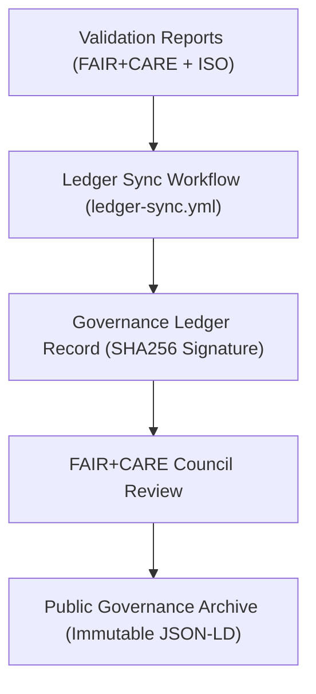
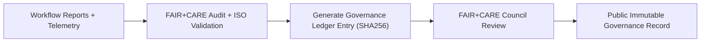

<div align="center">

# 📜 **Kansas Frontier Matrix — Governance Ledger Pipeline & FAIR+CARE Synchronization Workflow**
`docs/guides/workflows/governance-ledger-pipeline.md`

**Purpose:**  
Define the automation and validation sequence for synchronizing **Governance Ledger entries** across all pipelines in the Kansas Frontier Matrix (KFM).  
Ensures traceable FAIR+CARE certification, immutable provenance records, and sustainable validation under **MCP-DL v6.3**, **ISO 50001**, and **ISO 14064** frameworks.

[](../../README.md)
[](../../../LICENSE)
[](../../../docs/standards/README.md)
[](../../../releases/)
</div>

---

## 📘 Overview

The **Governance Ledger Pipeline** is the backbone of the KFM’s ethical automation framework, providing **auditable synchronization** between validation workflows, telemetry data, and governance records.  
Each pipeline run generates signed ledger entries that encode provenance, FAIR+CARE compliance, and sustainability data for full system accountability.

**Core Objectives**
- Automate Governance Ledger updates across all KFM modules  
- Validate provenance and ethical compliance under FAIR+CARE  
- Link energy, carbon, and metadata telemetry to each ledger entry  
- Maintain an immutable chain of governance records across releases  

---

## 🗂️ Directory Context

```plaintext
docs/guides/workflows/
├── README.md                             # Workflow overview
├── ci-pipeline.md                        # Continuous integration pipeline
├── validation-workflows.md               # FAIR+CARE validation flows
├── telemetry-sync.md                     # Telemetry export and governance linkage
├── governance-ledger-pipeline.md         # This document
└── reports/                              # Ledger synchronization audit results
```

---

## 🧩 Ledger Synchronization Architecture



---

## ⚙️ Pipeline Structure

| Stage | Description | FAIR+CARE Integration |
|--------|-------------|-----------------------|
| **Collect Artifacts** | Gather reports, telemetry, and metadata from prior workflows | SBOM and FAIR+CARE validation reports |
| **Generate Ledger Entry** | Create signed, timestamped JSON-LD governance record | SHA256 checksum generation |
| **Audit & Validate** | Verify energy, ethics, and sustainability compliance | FAIR+CARE + ISO audit |
| **Ledger Commit** | Append new record to governance ledger | Immutable JSON-LD append-only update |
| **Council Review** | FAIR+CARE Council approval and publication | Governance Charter validation |

---

## 🧾 Example Governance Ledger Pipeline (GitHub Actions)

```yaml
name: Governance Ledger Sync
on:
  workflow_dispatch:
  push:
    branches: [ main ]
    paths:
      - "reports/**"
      - "docs/standards/governance/LEDGER/**"

jobs:
  ledger-sync:
    runs-on: ubuntu-latest
    steps:
      - name: Checkout Repository
        uses: actions/checkout@v4
      - name: Generate Governance Ledger Entry
        run: python src/pipelines/governance/generate_ledger_entry.py
      - name: FAIR+CARE Validation
        run: python src/pipelines/validation/faircare_audit.py
      - name: Sync to Governance Ledger
        run: python src/pipelines/governance/sync_ledger.py
      - name: Upload Ledger Record
        uses: actions/upload-artifact@v4
        with:
          name: governance-ledger
          path: docs/standards/governance/LEDGER/
```

---

## ⚖️ FAIR+CARE Integration Matrix

| Principle | Implementation | Validation Artifact |
|------------|----------------|--------------------|
| **Findable** | Ledger entries UUID-indexed and signed | `docs/standards/governance/LEDGER/` |
| **Accessible** | Governance records published in public repo | `manifest_ref` |
| **Interoperable** | FAIR+CARE schema aligns with ISO and CIDOC CRM | `telemetry_schema` |
| **Reusable** | Ledger structure reused across CI/CD and governance workflows | `ledger-sync.yml` |
| **Collective Benefit** | Increases transparency and audit traceability | FAIR+CARE Council validation |
| **Authority to Control** | Council approval required for new ledger entries | Governance Charter |
| **Responsibility** | Tracks sustainability, ethics, and validation metadata | `telemetry_ref` |
| **Ethics** | Every record validated before merge to main branch | FAIR+CARE audit log |

---

## 🧮 Example Ledger Record

```json
{
  "ledger_id": "governance-ledger-2025-11-09-0010",
  "component": "AI Focus Mode Validation",
  "reports_linked": [
    "reports/faircare/ai-audit.json",
    "reports/telemetry/energy-monitor.json",
    "reports/sustainability/carbon-report.json"
  ],
  "sha256": "9c45b2e13d78f1a4...",
  "energy_joules": 12.6,
  "carbon_gCO2e": 0.0053,
  "faircare_status": "Pass",
  "iso_alignment": ["ISO 50001", "ISO 14064"],
  "auditor": "FAIR+CARE Council",
  "timestamp": "2025-11-09T12:45:00Z"
}
```

---

## ⚙️ Validation Workflows

| Workflow | Function | Output |
|-----------|-----------|--------|
| `ledger-sync.yml` | Main governance ledger update | `docs/standards/governance/LEDGER/governance-ledger.json` |
| `faircare-validate.yml` | Ensures ethical + sustainability compliance | `reports/faircare/governance-validation.json` |
| `telemetry-export.yml` | Aggregates telemetry and ISO metrics | `releases/v*/focus-telemetry.json` |
| `ledger-validate.yml` | Verifies schema, signatures, and audit hashes | `reports/ledger/validation.json` |

---

## 🧩 Governance Ledger Validation Example

```json
{
  "validation_id": "ledger-validation-2025-11-09-0003",
  "checked_entries": 256,
  "invalid_entries": 0,
  "schema_compliance": "Pass",
  "audit_integrity_score": 100,
  "energy_total_joules": 46.8,
  "carbon_total_gCO2e": 0.021,
  "faircare_status": "Pass",
  "auditor": "FAIR+CARE Council",
  "timestamp": "2025-11-09T13:00:00Z"
}
```

---

## 🧠 Governance Synchronization Flow



---

## ⚖️ Continuous Governance Targets

| Objective | Target | Verification |
|------------|---------|---------------|
| **Ledger Update Success Rate (%)** | 100 | `ledger-validation.json` |
| **FAIR+CARE Compliance (%)** | 100 | `faircare-validate.yml` |
| **Energy Use (J)** | ≤ 15 per pipeline | `telemetry-export.yml` |
| **Carbon Output (gCO₂e)** | ≤ 0.006 | `carbon-report.json` |
| **Ledger Publication Frequency** | Quarterly | Governance Ledger |

---

## 🧾 FAIR+CARE Audit Record Example

```json
{
  "audit_id": "faircare-governance-2025-11-09-0005",
  "audited_pipelines": [
    "AI Telemetry Integration",
    "Sustainability Validation",
    "Ledger Synchronization"
  ],
  "ledger_update_rate": 100,
  "compliance_rate": 100,
  "energy_total_joules": 47.1,
  "carbon_total_gCO2e": 0.0198,
  "faircare_status": "Pass",
  "auditor": "FAIR+CARE Council",
  "timestamp": "2025-11-09T13:15:00Z"
}
```

---

## 🕰️ Version History

| Version | Date | Author | Summary |
|----------|------|--------|----------|
| v10.0.0 | 2025-11-09 | Core Team | Added automated governance ledger synchronization and FAIR+CARE audit workflow |
| v9.7.0  | 2025-11-03 | A. Barta | Introduced base governance ledger validation and council approval flow |

---

<div align="center">

© 2025 Kansas Frontier Matrix Project  
Master Coder Protocol v6.3 · FAIR+CARE Certified · Diamond⁹ Ω / Crown∞Ω Ultimate Certified  

[Back to Workflow Guides](./README.md) · [Governance Charter](../../../docs/standards/governance/ROOT-GOVERNANCE.md)

</div>

