<div align="center">

# 📜 **Kansas Frontier Matrix — Governance Ledger Pipeline & FAIR+CARE Synchronization Workflow**  
`docs/guides/workflows/governance-ledger-pipeline.md`

**Purpose**  
Define the **automation and validation pipeline** for synchronizing **Governance Ledger entries**  
across all Kansas Frontier Matrix (KFM) systems.  
Ensures **traceable FAIR+CARE v2 certification**, **immutable provenance records**, and  
**sustainability-aware validation** under **MCP-DL v6.3**, **ISO 50001**, and **ISO 14064** frameworks.

The Governance Ledger Pipeline is the **spine** of KFM’s ethical data automation.

</div>

---

# 📘 Overview

The **Governance Ledger Pipeline** ties together:

- Validation workflows (data, AI, UI, sustainability)  
- Telemetry v2 summaries  
- Lineage v2 bundles  
- SBOM + SLSA attestations  
- CARE v2 decisions  

into **signed, append-only ledger entries**.

Goals:

- Automate Governance Ledger updates across all pipelines  
- Validate provenance, ethics, and sustainability indicators  
- Link telemetry, energy, carbon, and governance metadata per release/run  
- Maintain a **long-lived, immutable provenance chain** across KFM versions

---

# 🗂️ Directory Context

~~~text
docs/guides/workflows/
├── README.md                             # Workflow overview index
├── ci-pipeline.md                        # CI/CD orchestration
├── validation-workflows.md               # FAIR+CARE v2 validation flows
├── telemetry-sync.md                     # Telemetry export & validation
├── governance-ledger-pipeline.md         # THIS DOCUMENT
└── reports/
    └── governance/                       # Ledger sync + validation audit reports
~~~

---

# 🧩 Ledger Synchronization Architecture (GitHub-Safe Mermaid)

```mermaid
flowchart TD

A["Validation & Telemetry Artifacts<br/>data-validation · faircare · telemetry v2"] --> B["Ledger Sync Workflow<br/>ledger-sync.yml"]
B --> C["Governance Ledger Entry<br/>signed · append-only"]
C --> D["FAIR+CARE Council Review<br/>oversight"]
D --> E["Public Governance Archive<br/>immutable JSON-LD"]
````

---

# 1️⃣ Ledger Data Model (High-Level)

The Governance Ledger is stored as **append-only JSONL**:

```text
docs/reports/audit/data_provenance_ledger.jsonl
```

Each **ledger record** includes:

* `ledger_id` — unique, time-ordered ID (`ledger-YYYYMMDD-HHMM-####`)
* `stage` — `"validation"|"telemetry-sync"|"publish"|"governance"`
* `dataset_id` / `component_id` / `model_id`
* `version` — dataset/model version (SemVer)
* `careLabel` — CARE v2 label (`public|sensitive|restricted`)
* `maskingStrategy`
* `sovereigntyFlags[]`
* `lineageRef`
* `telemetryRef`
* `sbomRef`
* `attestationRef`
* `faircare_status`
* `iso_alignment` (e.g. `["ISO 50001","ISO 14064"]`)
* `workflow_run_id`
* `timestamp`

Records are validated by **schema** and **governance rules** in CI.

---

# 2️⃣ Pipeline Structure (Stages)

| Stage                     | Description                                            | FAIR+CARE v2 Integration                              |
| ------------------------- | ------------------------------------------------------ | ----------------------------------------------------- |
| **Collect Artifacts**     | Gather validation reports, telemetry, and lineage refs | Use only validated & signed outputs                   |
| **Generate Ledger Entry** | Build signed, timestamped JSON/JSON-LD record          | Insert CARE v2 and sustainability metadata            |
| **Audit & Validate**      | Check ethics, sustainability, and schema integrity     | FAIR+CARE v2 + ISO 50001/14064 alignment              |
| **Ledger Commit**         | Append new record (JSONL) to ledger file               | Append-only; no in-place mutation                     |
| **Council Review**        | FAIR+CARE Council can review & sign off (optionally)   | Governance Charter defines oversight & review cadence |

---

# 3️⃣ Example Governance Ledger Sync Workflow (GitHub Actions)

```yaml
name: Governance Ledger Sync

on:
  workflow_dispatch:
  push:
    branches: [ main ]
    paths:
      - "docs/guides/workflows/reports/**"
      - "releases/**/pipeline-telemetry.json"
      - "data/processed/lineage/**"

jobs:
  ledger-sync:
    runs-on: ubuntu-latest
    steps:
      - name: Checkout Repository
        uses: actions/checkout@v4

      - name: Generate Governance Ledger Entry
        run: |
          python src/pipelines/governance/generate_ledger_entry.py \
            --validation-reports docs/guides/workflows/reports \
            --telemetry releases/v10.4.2/pipeline-telemetry.json \
            --lineage-root data/processed/lineage \
            --out docs/guides/workflows/reports/governance/latest-ledger-entry.json

      - name: Validate Ledger Entry
        run: |
          python src/pipelines/governance/validate_ledger_entry.py \
            --schema schemas/governance-ledger-entry.schema.json \
            --in docs/guides/workflows/reports/governance/latest-ledger-entry.json

      - name: Append to Governance Ledger
        run: |
          python src/pipelines/governance/append_to_ledger.py \
            --in docs/guides/workflows/reports/governance/latest-ledger-entry.json \
            --ledger docs/reports/audit/data_provenance_ledger.jsonl

      - name: Upload Ledger Artifacts
        uses: actions/upload-artifact@v4
        with:
          name: governance-ledger-entry
          path: |
            docs/guides/workflows/reports/governance/latest-ledger-entry.json
            docs/reports/audit/data_provenance_ledger.jsonl
```

---

# 4️⃣ FAIR+CARE Integration Matrix (Ledger-Specific)

| Dimension                | Implementation Example                                         | Validation Artifact                              |
| ------------------------ | -------------------------------------------------------------- | ------------------------------------------------ |
| **Findable**             | Ledger entries keyed by `ledger_id` and dataset/model IDs      | `data_provenance_ledger.jsonl`                   |
| **Accessible**           | Governance records published under CC-BY 4.0                   | `manifest_ref`                                   |
| **Interoperable**        | JSON-LD compatibility with PROV-O/CIDOC/GeoSPARQL (Lineage v2) | `lineageRef` + lineage schema validation         |
| **Reusable**             | Ledger entries reused for dashboards, Focus Mode, audits       | telemetry & lineage cross-links                  |
| **Collective Benefit**   | Transparent governance records for community review            | FAIR+CARE Council reports                        |
| **Authority to Control** | Council oversight on processes & sensitive datasets            | Governance Charter · Council minutes             |
| **Responsibility**       | Sustainability metrics integrated into ledger                  | `telemetryRef` & sustainability audit references |
| **Ethics**               | Pre-merge validation of every ledger entry                     | `faircare-validate.yml`                          |

---

# 5️⃣ Example Ledger Record (v10.4.2)

```json
{
  "ledger_id": "governance-ledger-2025-11-16-0010",
  "stage": "publish",
  "dataset_id": "kfm-hazards-flood-2025-001",
  "version": "v1.2.0",
  "careLabel": "sensitive",
  "maskingStrategy": "h3_r7",
  "sovereigntyFlags": ["tribal_overlap"],
  "lineageRef": "data/processed/lineage/kfm-hazards-flood-2025-001/v1.2.0.jsonld",
  "telemetryRef": "releases/v10.4.2/pipeline-telemetry.json",
  "sbomRef": "releases/v10.4.2/sbom.spdx.json",
  "attestationRef": "releases/v10.4.2/manifest.zip",
  "faircare_status": "pass",
  "energy_wh": 0.018,
  "carbon_gCO2e": 0.0072,
  "iso_alignment": ["ISO 50001", "ISO 14064"],
  "workflow_run_id": "gh-123456789",
  "auditor": "FAIR+CARE Council",
  "timestamp": "2025-11-16T12:45:00Z"
}
```

---

# 6️⃣ Validation Workflows (Ledger-Focused)

| Workflow                   | Function                                             | Output                                        |
| -------------------------- | ---------------------------------------------------- | --------------------------------------------- |
| `ledger-sync.yml`          | Primary ledger-entry generation & append             | Updated `data_provenance_ledger.jsonl`        |
| `ledger-validate.yml`      | Validates ledger schema & ordering, checks for drift | `reports/governance/ledger-validation.json`   |
| `faircare-validate.yml`    | Re-checks CARE v2, sovereignty, ethical rules        | `reports/faircare/governance-validation.json` |
| `telemetry-export.yml`     | Provides Telemetry v2 to ledger pipeline             | `releases/v*/pipeline-telemetry.json`         |
| `sustainability-audit.yml` | Validates energy & CO₂ metrics are within policy     | `reports/sustainability-telemetry-audit.json` |

CI must **block merges** where ledger validation fails.

---

# 7️⃣ Governance Synchronization Flow (High-Level)

```mermaid
flowchart LR

SRC["Reports & Telemetry<br/>validation · telemetry v2 · lineage"] --> GEN["Generate Ledger Entry<br/>signed · enriched"]
GEN --> VAL["Validate Ledger Entry<br/>schema · governance rules"]
VAL --> APP["Append to Ledger<br/>append-only"]
APP --> COUNCIL["FAIR+CARE Council Review"]
COUNCIL --> ARCH["Public Governance Archive<br/>immutable ledger history"]
```



---

# 8️⃣ Continuous Governance Targets

| Objective                            | Target             | Verification                          |
| ------------------------------------ | ------------------ | ------------------------------------- |
| Ledger Update Success Rate (%)       | 100                | `ledger-validation.json`              |
| FAIR+CARE Compliance (%)             | 100                | `faircare-validate.yml`               |
| Energy Use per Ledger Run (Wh)       | ≤ 0.02             | `sustainability-telemetry-audit.json` |
| Carbon Output per Ledger Run (gCO₂e) | ≤ 0.008            | `sustainability-telemetry-audit.json` |
| Ledger Publication Frequency         | At least quarterly | Governance Charter / Council Minutes  |

These are policy-level recommendations; actual thresholds are set by the Council.

---

# 9️⃣ Developer Checklist (Ledger Pipeline)

Before new/updated ledger logic is merged:

* [ ] Ledger entry schema matches `governance-ledger-entry.schema.json`.
* [ ] All new fields documented in Governance & Telemetry schemas.
* [ ] CARE v2 fields (`careLabel`, `maskingStrategy`, `sovereigntyFlags`) are applied consistently.
* [ ] Lineage v2 references (`lineageRef`) are valid and pass lineage validation.
* [ ] Telemetry v2 references (`telemetryRef`) exist and pass telemetry validation.
* [ ] SBOM and attestation references (`sbomRef`, `attestationRef`) are correct.
* [ ] `ledger-sync.yml` and `ledger-validate.yml` pass for new entries.
* [ ] FAIR+CARE Council sign-off obtained where required (for high-risk datasets).

---

# 🕰 Version History

| Version | Date       | Summary                                                                                               |
| ------: | ---------- | ----------------------------------------------------------------------------------------------------- |
| v10.4.2 | 2025-11-16 | Upgraded to KFM-MDP v10.4.2; integrated Telemetry v2, CARE v2, Lineage v2; added CI governance checks |
| v10.0.0 | 2025-11-09 | Initial governance-ledger pipeline guide; FAIR+CARE & ISO-aligned ledger synchronization              |

---

<div align="center">

**Kansas Frontier Matrix — Governance Ledger Pipeline (v10.4.2)**
Immutable Governance × FAIR+CARE v2 × Sustainability × System-Wide Accountability
© 2025 Kansas Frontier Matrix — CC-BY 4.0 · Diamond⁹ Ω / Crown∞Ω Ultimate Certified

</div>
