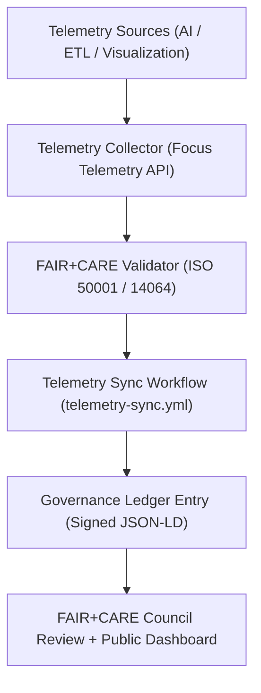
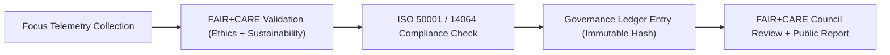

<div align="center">

# 📡 **Kansas Frontier Matrix — Telemetry Synchronization & FAIR+CARE Governance Workflow**
`docs/guides/workflows/telemetry-sync.md`

**Purpose:**  
Define the automated workflow for **telemetry collection, aggregation, and synchronization** across Kansas Frontier Matrix (KFM) systems.  
Ensures that all sustainability, performance, and ethical metrics are properly recorded, validated, and committed to the **Governance Ledger** under **FAIR+CARE** and **ISO 50001/14064** compliance.

[](../../README.md)
[](../../../LICENSE)
[](../../../docs/standards/README.md)
[](../../../releases/)
</div>

---

## 📘 Overview

The **Telemetry Sync Workflow** automates telemetry exports from KFM services — including AI, ETL, and visualization — and synchronizes them with the FAIR+CARE Governance Ledger.  
It ensures reproducibility, traceability, and ethical transparency through continuous observability and sustainability validation.

**Key Objectives**
- Collect telemetry data from multiple systems in real time  
- Validate energy, carbon, and ethics metrics before governance sync  
- Commit telemetry hashes and FAIR+CARE status to the Governance Ledger  
- Publish validated telemetry datasets for Council and public review  

---

## 🗂️ Directory Context

```plaintext
docs/guides/workflows/
├── README.md                          # Workflow overview
├── ci-pipeline.md                     # Continuous Integration process
├── validation-workflows.md            # FAIR+CARE validation stages
├── telemetry-sync.md                  # This document
├── governance-ledger-pipeline.md      # Governance synchronization workflows
└── reports/                           # Telemetry audit summaries
```

---

## 🧩 Telemetry Sync Architecture



---

## ⚙️ Workflow Stages

| Stage | Description | FAIR+CARE Integration |
|--------|-------------|-----------------------|
| **Collection** | Gather telemetry data from KFM components | Prometheus + Focus Telemetry API |
| **Validation** | Check FAIR+CARE alignment and ISO energy metrics | `faircare-validate.yml` |
| **Synchronization** | Append verified telemetry to Governance Ledger | SHA256-signature validation |
| **Publication** | Release public telemetry reports for Council review | CC-BY 4.0 transparency reports |

---

## 🧾 Example Telemetry Sync Workflow (GitHub Actions)

```yaml
name: Telemetry Sync Workflow
on:
  schedule:
    - cron: "0 3 * * 1"  # Weekly sync
  workflow_dispatch:
jobs:
  telemetry-sync:
    runs-on: ubuntu-latest
    steps:
      - name: Checkout Repository
        uses: actions/checkout@v4
      - name: Collect Telemetry
        run: python src/pipelines/telemetry/collect_focus_data.py
      - name: FAIR+CARE Validation
        run: python src/pipelines/validation/faircare_validate.py
      - name: Sync Telemetry to Governance Ledger
        run: python src/pipelines/governance/sync_telemetry_ledger.py
      - name: Upload Telemetry Report
        uses: actions/upload-artifact@v4
        with:
          name: focus-telemetry
          path: releases/v10.0.0/focus-telemetry.json
```

---

## ⚖️ FAIR+CARE Integration Matrix

| Principle | Implementation | Validation Artifact |
|------------|----------------|--------------------|
| **Findable** | Telemetry reports indexed by workflow UUID | `focus-telemetry.json` |
| **Accessible** | Published under CC-BY license for audit transparency | `releases/v*/focus-telemetry.json` |
| **Interoperable** | FAIR+CARE JSON-LD schema + ISO 50001 alignment | `telemetry_schema` |
| **Reusable** | Energy + ethics metrics reused for sustainability dashboards | `manifest_ref` |
| **Collective Benefit** | Enables open sustainability analytics | FAIR+CARE Council audits |
| **Authority to Control** | Council approval for telemetry publication | Governance Charter |
| **Responsibility** | Continuous environmental observability | `telemetry_ref` |
| **Ethics** | Ensures telemetry contains no sensitive or private data | FAIR+CARE audit pipeline |

---

## 🧩 Example Telemetry Sync Report

```json
{
  "sync_id": "telemetry-sync-2025-11-09-0003",
  "systems_synced": ["AI Focus Mode", "ETL Hydrology", "Visualization Dashboard"],
  "metrics": {
    "energy_joules": 46.7,
    "carbon_gCO2e": 0.019,
    "faircare_pass_rate_percent": 100
  },
  "telemetry_files": [
    "releases/v10.0.0/focus-telemetry.json",
    "reports/faircare/sustainability-audit.json"
  ],
  "faircare_status": "Pass",
  "auditor": "FAIR+CARE Council",
  "timestamp": "2025-11-09T12:30:00Z"
}
```

---

## ⚙️ Governance Ledger Record Example

```json
{
  "ledger_id": "telemetry-ledger-2025-11-09-0005",
  "component": "Telemetry Synchronization Pipeline",
  "linked_reports": [
    "focus-telemetry.json",
    "faircare-telemetry-audit.json"
  ],
  "energy_joules": 46.7,
  "carbon_gCO2e": 0.019,
  "faircare_status": "Pass",
  "iso_alignment": ["ISO 50001", "ISO 14064"],
  "auditor": "FAIR+CARE Council",
  "timestamp": "2025-11-09T12:50:00Z"
}
```

---

## ⚙️ Validation Workflows

| Workflow | Function | Output |
|-----------|-----------|--------|
| `telemetry-export.yml` | Aggregates and exports telemetry logs | `releases/v*/focus-telemetry.json` |
| `faircare-validate.yml` | Runs ethics and sustainability validation | `reports/faircare/telemetry-validation.json` |
| `ledger-sync.yml` | Commits telemetry entries to Governance Ledger | `docs/standards/governance/LEDGER/telemetry-ledger.json` |
| `energy-monitor.yml` | Tracks ISO 50001 energy metrics | `reports/telemetry/energy-monitor.json` |
| `carbon-audit.yml` | Validates ISO 14064 carbon output | `reports/telemetry/carbon-audit.json` |

---

## 🧠 Telemetry Synchronization Flow



---

## ⚖️ Sustainability & Governance Targets

| Metric | Target | Validation Source |
|---------|---------|-------------------|
| **Energy per Sync (J)** | ≤ 15 | `telemetry-export.yml` |
| **Carbon Output (gCO₂e)** | ≤ 0.006 | `carbon-audit.yml` |
| **FAIR+CARE Validation (%)** | 100 | `faircare-validate.yml` |
| **Ledger Sync Success (%)** | 100 | `ledger-sync.yml` |
| **Publication Frequency** | Weekly | `telemetry-sync.yml` |

---

## 🧾 FAIR+CARE Audit Record Example

```json
{
  "audit_id": "faircare-telemetry-sync-2025-11-09-0004",
  "audited_pipelines": [
    "AI Focus Mode",
    "ETL Hydrology",
    "Visualization"
  ],
  "energy_total_joules": 46.7,
  "carbon_total_gCO2e": 0.019,
  "renewable_percent": 83,
  "faircare_status": "Pass",
  "iso_alignment": ["ISO 50001", "ISO 14064"],
  "auditor": "FAIR+CARE Council",
  "timestamp": "2025-11-09T13:00:00Z"
}
```

---

## 🕰️ Version History

| Version | Date | Author | Summary |
|----------|------|--------|----------|
| v10.0.0 | 2025-11-09 | Core Team | Added FAIR+CARE telemetry synchronization pipeline documentation with ISO validation |
| v9.7.0  | 2025-11-03 | A. Barta | Introduced automated telemetry export and governance integration workflow |

---

<div align="center">

© 2025 Kansas Frontier Matrix Project  
Master Coder Protocol v6.3 · FAIR+CARE Certified · Diamond⁹ Ω / Crown∞Ω Ultimate Certified  

[Back to Workflow Guides](./README.md) · [Governance Charter](../../../docs/standards/governance/ROOT-GOVERNANCE.md)

</div>

