<div align="center">

# 📡 **Kansas Frontier Matrix — Telemetry Synchronization & FAIR+CARE Governance Workflow**  
`docs/guides/workflows/telemetry-sync.md`

**Purpose**  
Define the **automated workflow** for **telemetry v2** collection, aggregation, validation, and synchronization  
across Kansas Frontier Matrix (KFM) systems.  
Ensures that sustainability, performance, governance, and ethical metrics are properly recorded,  
validated, and committed to the **Governance Ledger** under **FAIR+CARE v2** and  
**ISO 50001 / 14064** compliance.

</div>

---

# 📘 Overview

The **Telemetry Sync Workflow**:

- Collects telemetry records from:
  - AI pipelines (Focus Mode, agent runs)
  - ETL/data pipelines
  - Web/MapLibre frontends
  - Validation workflows
- Validates **Telem v2** records (schema + ethics + sustainability)
- Aggregates and **signs** metrics into release-level telemetry files
- Synchronizes validated telemetry into the **Governance Ledger**
- Provides rich inputs for:
  - FAIR+CARE Council reviews
  - Sustainability dashboards
  - Model & pipeline cards
  - Lineage v2 bundles

Telemetry is treated as **first-class data** with its own schema, lineage, and governance.

---

# 🗂️ Directory Context

~~~text
docs/guides/workflows/
├── README.md                          # Workflow overview index
├── validation-workflows.md            # FAIR+CARE validation stages
├── telemetry-sync.md                  # THIS DOCUMENT
├── ci-pipeline.md                     # CI/CD orchestration
├── governance-ledger-pipeline.md      # Governance synchronization workflows
└── reports/                           # Telemetry & FAIR+CARE audit summaries
~~~

---

# 🧩 Telemetry Sync Architecture (GitHub-Safe Mermaid)

```mermaid
flowchart TD

A["Telemetry Sources<br/>AI · ETL · Web · Validation"] --> B["Telemetry Collector<br/>gather & normalize events"]
B --> C["Telemetry v2 Validator<br/>schema · FAIR+CARE · ISO"]
C --> D["Telemetry Sync Workflow<br/>telemetry-sync.yml"]
D --> E["Governance Ledger Entry<br/>append-only record"]
E --> F["FAIR+CARE Council & Dashboards<br/>review · monitoring"]
````

---

# 1️⃣ Telemetry v2 Schema

Telemetry v2 events are JSON objects, usually stored as NDJSON.

**Core fields (per event):**

* `pipeline` – e.g. `"ingestion"`, `"analytics"`, `"focus-mode"`, `"telemetry-sync"`
* `stage` – `"ingest"|"preprocess"|"validate"|"promote"|"publish"|"runtime"`
* `run_id` – unique run identifier (tied to pipeline & lineage)
* `dataset_id` / `collection_id` / `component_id`
* `timestamp`
* `status` – `"success"|"failure"|"noop"`
* `duration_ms`
* `rows_processed` or `pixels_processed` (where applicable)
* `energy_wh` (energy usage estimate or measured)
* `co2_g` (CO₂e estimate)
* `care_violations` (count)
* `sovereigntyConflicts` (count)
* `maskingApplied` (boolean)
* `error_codes[]` (if any)
* `links` (optional) – PR, Release, dashboard URLs

Schema is defined at:

```text
../../../schemas/telemetry/workflows-telemetry-sync-v2.json
```

---

# 2️⃣ Telemetry Sources

Telemetry is produced by multiple layers:

* **Pipelines** (Python/Node-based)
* **Web clients** (MapLibre, Focus Mode, Story Node interactions)
* **Validation workflows** (GX, FAIR+CARE audits)
* **Publishing flows** (STAC/DCAT/Neo4j/RDF)

Common storage patterns:

```text
data/telemetry/
├── ingestion.ndjson
├── analytics.ndjson
├── focus-mode.ndjson
├── validation.ndjson
└── telemetry-sync.ndjson
```

Release-level aggregation:

```text
releases/v10.4.2/pipeline-telemetry.json
```

---

# 3️⃣ Telemetry Sync Workflow (GitHub Actions Skeleton)

```yaml
name: Telemetry Sync Workflow

on:
  schedule:
    - cron: "0 3 * * 1"    # Weekly sync
  workflow_dispatch:

jobs:
  telemetry-sync:
    runs-on: ubuntu-latest
    steps:
      - name: Checkout Repository
        uses: actions/checkout@v4

      - name: Collect Telemetry
        run: python src/pipelines/telemetry/collect_all_sources.py \
               --out data/telemetry/aggregated.ndjson

      - name: Validate Telemetry v2
        run: python src/pipelines/telemetry/validate_v2.py \
               --schema schemas/telemetry/workflows-telemetry-sync-v2.json \
               --in data/telemetry/aggregated.ndjson

      - name: FAIR+CARE & Sustainability Audit
        run: python src/pipelines/telemetry/faircare_sustainability_audit.py \
               --in data/telemetry/aggregated.ndjson \
               --out docs/guides/workflows/reports/telemetry-audit.json

      - name: Sync Telemetry to Governance Ledger
        run: python src/pipelines/governance/sync_telemetry_ledger.py \
               --in data/telemetry/aggregated.ndjson \
               --audit docs/guides/workflows/reports/telemetry-audit.json

      - name: Write Release Telemetry Summary
        run: python src/pipelines/telemetry/write_release_summary.py \
               --in data/telemetry/aggregated.ndjson \
               --out releases/v10.4.2/pipeline-telemetry.json

      - name: Upload Telemetry Artifacts
        uses: actions/upload-artifact@v4
        with:
          name: telemetry-v2
          path: |
            data/telemetry/aggregated.ndjson
            docs/guides/workflows/reports/telemetry-audit.json
            releases/v10.4.2/pipeline-telemetry.json
```

---

# 4️⃣ FAIR+CARE Integration

Telemetry must be:

* **Non-PII** — No personal identifiers, no raw user data.
* **Ethics-aware** — Capture fairness and responsibility signals (e.g., model refusal rates, bias metrics).
* **Sovereignty-aware** — Record whether pipeline touches sensitive or sovereign data.
* **Transparent** — Telemetry summaries should be publishable under CC-BY where possible.

Example FAIR+CARE-focused fields:

```json
{
  "pipeline": "focus-mode",
  "stage": "runtime",
  "run_id": "focus-2025-11-16-0001",
  "status": "success",
  "duration_ms": 235,
  "energy_wh": 0.0004,
  "co2_g": 0.0001,
  "care_violations": 0,
  "sovereigntyConflicts": 0,
  "maskingApplied": true
}
```

---

# 5️⃣ Sustainability Validation (ISO 50001 / 14064)

Telemetry sync must validate:

* **Energy usage** (Wh) within policy bounds
* **CO₂e** consistent with environment and pipeline estimates
* **Sustainability over time** (trends per release)

Sustainability audit output:

```text
docs/guides/workflows/reports/sustainability-telemetry-audit.json
```

Sample snippet:

```json
{
  "audit_id": "sustainability-telemetry-2025-11-16-0001",
  "window": "2025-11-09T00:00:00Z/2025-11-16T00:00:00Z",
  "pipelines": [
    {
      "pipeline": "ingestion",
      "energy_wh_total": 12.4,
      "carbon_gCO2e_total": 0.0061
    },
    {
      "pipeline": "focus-mode",
      "energy_wh_total": 3.1,
      "carbon_gCO2e_total": 0.0012
    }
  ],
  "iso_alignment": ["ISO 50001", "ISO 14064"],
  "status": "pass",
  "timestamp": "2025-11-16T13:42:00Z"
}
```

---

# 6️⃣ Governance Ledger Examples

Telemetry sync must append summarized records to the Governance Ledger:

```text
docs/reports/audit/data_provenance_ledger.jsonl
```

Example entry:

```json
{
  "ledger_id": "telemetry-ledger-2025-11-16-0003",
  "stage": "telemetry-sync",
  "pipelines_covered": ["ingestion", "analytics", "focus-mode", "validation"],
  "telemetry_summary_ref": "releases/v10.4.2/pipeline-telemetry.json",
  "sustainability_audit_ref": "docs/guides/workflows/reports/sustainability-telemetry-audit.json",
  "faircare_status": "pass",
  "energy_wh_total": 18.7,
  "carbon_gCO2e_total": 0.0073,
  "iso_alignment": ["ISO 50001", "ISO 14064"],
  "auditor": "FAIR+CARE Council",
  "timestamp": "2025-11-16T14:00:00Z"
}
```

---

# 7️⃣ Validation Workflows for Telemetry Sync

Recommended workflows:

| Workflow                   | Responsibility                                           | Output                                           |
| -------------------------- | -------------------------------------------------------- | ------------------------------------------------ |
| `telemetry-export.yml`     | Aggregates and exports telemetry NDJSON per pipeline     | `data/telemetry/*.ndjson`                        |
| `telemetry-validate.yml`   | Validates Telemetry v2 against JSON Schema               | `reports/telemetry-validation.json`              |
| `faircare-validate.yml`    | Validates FAIR+CARE v2 compliance for telemetry          | `reports/faircare/telemetry-validation.json`     |
| `sustainability-audit.yml` | Computes energy/CO₂ metrics and validates them           | `reports/sustainability-telemetry-audit.json`    |
| `ledger-sync.yml`          | Commits telemetry-derived summaries to Governance Ledger | ledger entries in `data_provenance_ledger.jsonl` |

---

# 8️⃣ Telemetry Sync Flow (High-Level Mermaid)

```mermaid
flowchart LR

SRC["Sources<br/>pipelines · web · validation"] --> COL["Collect & Normalize Telemetry"]
COL --> VAL["Validate Telemetry v2<br/>schema · ethics · sustainability"]
VAL --> SYNC["Sync Summaries<br/>release-level telemetry.json"]
SYNC --> LEDGER["Update Governance Ledger<br/>append signed entries"]
LEDGER --> COUNCIL["FAIR+CARE Council & Dashboards"]
```



---

# 9️⃣ Developer Checklist

Before Telemetry Sync is considered compliant:

* [ ] Telemetry v2 schema defined and validated for all emitting pipelines.
* [ ] Telemetry is **non-PII** and free of sensitive personal data.
* [ ] Sustainability metrics (energy, CO₂e) computed and audited.
* [ ] Aggregated release telemetry file written to `releases/<version>/pipeline-telemetry.json`.
* [ ] Governance Ledger entries updated and validated.
* [ ] Telemetry sync workflows pass CI (`telemetry-validate`, `faircare-validate`, `ledger-sync`).

---

# 🕰 Version History

| Version | Date       | Summary                                                                                              |
| ------: | ---------- | ---------------------------------------------------------------------------------------------------- |
| v10.4.2 | 2025-11-16 | Upgraded to KFM-MDP v10.4.2; Telemetry v2 integration, FAIR+CARE v2 alignment, ISO 50001/14064 hooks |
| v10.0.0 | 2025-11-09 | Initial Telemetry Sync Workflow; FAIR+CARE + ISO integration                                         |

---

<div align="center">

**Kansas Frontier Matrix — Telemetry Synchronization (v10.4.2)**
Continuous Observability × FAIR+CARE v2 × ISO-aligned Sustainability × Immutable Governance
© 2025 Kansas Frontier Matrix — CC-BY 4.0 · Diamond⁹ Ω / Crown∞Ω Ultimate Certified

</div>
