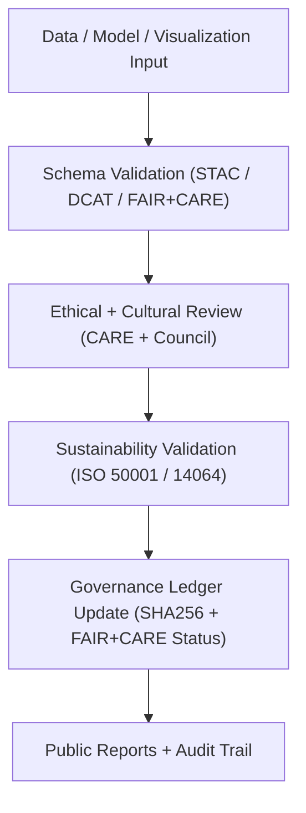
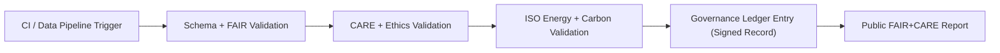

<div align="center">

# 🧮 **Kansas Frontier Matrix — Validation Workflows & FAIR+CARE Compliance Framework**
`docs/guides/workflows/validation-workflows.md`

**Purpose:**  
Define the validation automation framework for **FAIR+CARE**, **ISO sustainability**, and **data lineage** compliance across all Kansas Frontier Matrix (KFM) pipelines.  
These workflows verify reproducibility, ethics, and sustainability in alignment with **MCP-DL v6.3** and **Diamond⁹ Ω / Crown∞Ω** certification.

[](../../README.md)
[](../../../LICENSE)
[](../../../docs/standards/README.md)
[](../../../releases/)
</div>

---

## 📘 Overview

The **Validation Workflows** ensure all KFM datasets, AI models, and workflows meet **FAIR+CARE**, **ISO 50001 / 14064**, and **MCP-DL v6.3** reproducibility requirements.  
Each validation step performs schema verification, ethical auditing, sustainability assessment, and ledger synchronization for complete transparency.

**Core Objectives**
- Validate data integrity and schema conformity  
- Verify FAIR+CARE ethical compliance and consent requirements  
- Assess environmental and governance metrics (energy, carbon, provenance)  
- Synchronize validation outcomes to the Governance Ledger  

---

## 🗂️ Directory Context

```plaintext
docs/guides/workflows/
├── README.md                            # Workflow overview
├── validation-workflows.md              # This document
├── ci-pipeline.md                       # Continuous integration pipeline
├── telemetry-sync.md                    # Telemetry export & governance linkage
├── governance-ledger-pipeline.md        # Governance ledger synchronization
└── reports/                             # Validation outputs and audit logs
```

---

## 🧩 Validation Pipeline Architecture



---

## ⚙️ Validation Workflow Categories

| Workflow | Purpose | Output | FAIR+CARE Alignment |
|-----------|----------|--------|----------------------|
| **Data Validation** | Checks schema and FAIR metadata for datasets | `reports/data-validation.json` | FAIR Principles |
| **AI Validation** | Ensures model fairness, energy, and ethics | `reports/ai-validation.json` | CARE + Sustainability |
| **Visualization Validation** | Confirms accessibility and inclusion | `reports/ui-validation.json` | FAIR+CARE UI Standards |
| **Sustainability Validation** | Tracks ISO-aligned energy and carbon metrics | `reports/sustainability-audit.json` | ISO 50001 / 14064 |
| **Governance Validation** | Validates ledger and provenance integrity | `reports/ledger-validation.json` | FAIR+CARE + MCP |

---

## 🧾 Example FAIR+CARE Validation Workflow (GitHub Actions)

```yaml
name: FAIR+CARE Validation
on:
  push:
    branches: [ main, develop ]
  workflow_dispatch:
jobs:
  faircare-validation:
    runs-on: ubuntu-latest
    steps:
      - name: Checkout Repository
        uses: actions/checkout@v4
      - name: Run Schema Validation
        run: python src/pipelines/validation/run_schema_checks.py
      - name: FAIR+CARE Audit
        run: python src/pipelines/validation/faircare_audit.py
      - name: Sustainability Metrics
        run: python src/pipelines/telemetry/export_metrics.py
      - name: Sync Validation to Governance Ledger
        run: python src/pipelines/governance/sync_ledger.py
```

---

## ⚖️ FAIR+CARE Integration Matrix

| Principle | Implementation | Validation Artifact |
|------------|----------------|--------------------|
| **Findable** | Validation reports linked to dataset UUID | `reports/faircare-validation.json` |
| **Accessible** | Audit results published under CC-BY | `manifest_ref` |
| **Interoperable** | FAIR+CARE schema harmonized with ISO/OGC | `telemetry_schema` |
| **Reusable** | Validation templates applied across systems | `.github/workflows/` |
| **Collective Benefit** | Validations improve community data reuse | FAIR+CARE Council audit |
| **Authority to Control** | FAIR+CARE Council signs ethical audits | Governance Ledger |
| **Responsibility** | Energy and carbon validation per dataset | `telemetry_ref` |
| **Ethics** | Automated CARE validation for cultural datasets | `ethics-audit-protocols.md` |

---

## 🧮 Validation Metrics Summary

| Metric | Target | Validation Source |
|---------|---------|-------------------|
| **Schema Conformance (%)** | 100 | `data-validation.json` |
| **Ethical Review Pass Rate (%)** | 100 | `faircare-validation.json` |
| **Carbon Emissions (gCO₂e)** | ≤ 0.006 | `sustainability-audit.json` |
| **Energy Consumption (J)** | ≤ 15 | `telemetry-export.yml` |
| **Ledger Sync Success (%)** | 100 | `ledger-validation.json` |

---

## ⚙️ Governance Ledger Record Example

```json
{
  "ledger_id": "validation-ledger-2025-11-09-0005",
  "validated_entities": [
    "dataset:kfm-hydrology-2025-001",
    "model:focus-transformer-v2",
    "ui:timeline-visualization"
  ],
  "faircare_status": "Pass",
  "energy_joules": 12.4,
  "carbon_gCO2e": 0.0055,
  "iso_alignment": ["ISO 50001", "ISO 14064"],
  "auditor": "FAIR+CARE Council",
  "timestamp": "2025-11-09T13:00:00Z"
}
```

---

## ⚙️ Validation Workflow Integration Flow



---

## 🧠 FAIR+CARE Validation Audit Example

```json
{
  "audit_id": "faircare-validation-2025-11-09-0003",
  "audited_entities": [
    "Hydrology ETL Dataset",
    "Focus Transformer AI Model",
    "MapLibre Visualization UI"
  ],
  "validation_pass_rate": 100,
  "carbon_gCO2e_total": 0.017,
  "energy_total_joules": 41.5,
  "faircare_status": "Pass",
  "auditor": "FAIR+CARE Council",
  "timestamp": "2025-11-09T13:15:00Z"
}
```

---

## ⚖️ Continuous Validation Targets

| Objective | Target | Verification |
|------------|---------|---------------|
| **Maintain Full FAIR+CARE Compliance** | 100% | FAIR+CARE Audit Logs |
| **Reduce Energy Use Per Validation** | ≤ 15 J | Telemetry Reports |
| **Ensure Ethical Oversight** | Quarterly Council Review | Governance Ledger |
| **Publish Validation Reports** | Every Release | `/reports/faircare-validation.json` |
| **Automate Ledger Sync** | 100% of validation workflows | `ledger-sync.yml` |

---

## 🕰️ Version History

| Version | Date | Author | Summary |
|----------|------|--------|----------|
| v10.0.0 | 2025-11-09 | Core Team | Added unified FAIR+CARE validation workflow with ISO + governance integration |
| v9.7.0  | 2025-11-03 | A. Barta | Introduced data, AI, and sustainability validation schema and workflows |

---

<div align="center">

© 2025 Kansas Frontier Matrix Project  
Master Coder Protocol v6.3 · FAIR+CARE Certified · Diamond⁹ Ω / Crown∞Ω Ultimate Certified  

[Back to Workflow Guides](./README.md) · [Governance Charter](../../../docs/standards/governance/ROOT-GOVERNANCE.md)

</div>

