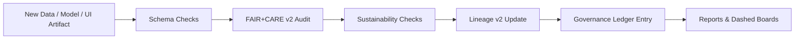

<div align="center">

# 🧮 **Kansas Frontier Matrix — Validation Workflows & FAIR+CARE Compliance Framework**  
`docs/guides/workflows/validation-workflows.md`

**Purpose**  
Define the **validation automation framework** for **FAIR+CARE v2**, **ISO sustainability**,  
and **Lineage v2** compliance across all Kansas Frontier Matrix (KFM) pipelines.  
These workflows verify **reproducibility**, **ethics**, and **sustainability** in alignment with  
**MCP-DL v6.3** and **Diamond⁹ Ω / Crown∞Ω** certification.

</div>

---

# 📘 Overview

The **Validation Workflows** ensure that all KFM datasets, AI models, visualizations, and pipelines:

- Conform to **schemas** (STAC, DCAT, JSON Schema, domain contracts)  
- Satisfy **FAIR+CARE v2** rules (consent, sovereignty, masking, responsibility)  
- Align with **ISO 50001 / 14064** energy & CO₂ tracking requirements  
- Emit and validate **Telemetry v2** (energy, CO₂, care_violations, errors)  
- Write **Lineage v2** and **Governance Ledger** entries for transparency  

Validation is considered a **first-class pipeline** with its own assets, telemetry, and lineage.

---

# 🗂️ Directory Context

~~~text
docs/guides/workflows/
├── README.md                            # Workflow overview index
├── validation-workflows.md              # THIS DOCUMENT
├── ci-pipeline.md                       # CI/CD orchestration
├── telemetry-sync.md                    # Telemetry export & validation
├── governance-ledger-pipeline.md        # Governance ledger synchronization
└── reports/                             # Narrative guides for validation outputs & audits
~~~

---

# 🧩 Validation Pipeline Architecture

```mermaid
flowchart TD

A["Data / Model / Visualization Input"] --> B["Schema Validation<br/>STAC · DCAT · JSON Schema"]
B --> C["FAIR+CARE v2 Validation<br/>CARE · sovereignty · ethics"]
C --> D["Sustainability Validation<br/>ISO 50001 · ISO 14064"]
D --> E["Lineage & Governance Ledger<br/>Lineage v2 · Ledger Entry"]
E --> F["Public Reports & Dashboards<br/>Validation status · metrics"]
````

---

# 1️⃣ Validation Workflow Categories

KFM defines **validation families** that map to specific workflows.

| Workflow                      | Purpose                                  | Primary Output                      | FAIR+CARE Focus       |
| ----------------------------- | ---------------------------------------- | ----------------------------------- | --------------------- |
| **Data Validation**           | Dataset schema & integrity checks        | `reports/data-validation.json`      | FAIR (F/A/I/R)        |
| **AI Validation**             | Model fairness, drift, energy, ethics    | `reports/ai-validation.json`        | CARE + sustainability |
| **Visualization Validation**  | Accessibility & inclusivity for UIs      | `reports/ui-validation.json`        | FAIR+CARE for UIs     |
| **Sustainability Validation** | Energy & CO₂ metrics per run/dataset     | `reports/sustainability-audit.json` | ISO 50001 / 14064     |
| **Governance Validation**     | Ledger, provenance, and policy adherence | `reports/ledger-validation.json`    | FAIR+CARE + MCP       |

Each category can have one or more GitHub Actions workflows associated with it.

---

# 2️⃣ FAIR+CARE v2 Validation Workflows (GitHub Actions Skeleton)

```yaml
name: FAIR+CARE v2 Validation

on:
  push:
    branches: [ main, develop ]
  workflow_dispatch:

jobs:
  faircare-validation:
    runs-on: ubuntu-latest
    steps:
      - name: Checkout Repository
        uses: actions/checkout@v4

      - name: Run Schema Validation
        run: python src/pipelines/validation/run_schema_checks.py

      - name: Run FAIR+CARE v2 Audit
        run: python src/pipelines/validation/faircare_audit.py

      - name: Export Sustainability Metrics
        run: python src/pipelines/telemetry/export_metrics.py

      - name: Validate Telemetry v2
        run: python src/pipelines/telemetry/validate_telemetry_v2.py

      - name: Sync Validation to Governance Ledger
        run: python src/pipelines/governance/sync_ledger.py
```

---

# 3️⃣ FAIR+CARE Integration Matrix (v2)

| Principle/Dimension      | Implementation Example                                 | Validation Artifact                    |
| ------------------------ | ------------------------------------------------------ | -------------------------------------- |
| **Findable**             | Dataset IDs, STAC/DCAT references, indexed in catalogs | `reports/data-validation.json`         |
| **Accessible**           | Open formats, CC-BY or similar licenses, robust links  | `manifest_ref`                         |
| **Interoperable**        | STAC/DCAT/GML/GeoJSON/TTL aligned with ISO/OGC         | `telemetry_schema`                     |
| **Reusable**             | Clear provenance, lineage, and usage notes             | lineage v2 bundles + ledger entries    |
| **Collective Benefit**   | Datasets benefit local and broader communities         | FAIR+CARE Council reports              |
| **Authority to Control** | Sovereignty & consent enforcement via CARE v2          | Governance Ledger (`careLabel`, flags) |
| **Responsibility**       | Sustainability metrics tracked & surfaced              | `reports/sustainability-audit.json`    |
| **Ethics**               | CARE v2 checks for cultural/contextual harms           | `reports/faircare-validation.json`     |

---

# 4️⃣ Validation Metrics Targets (Telemetry v2)

KFM recommends **targets** for key validation metrics (configurable by domain):

| Metric                     | Typical Target             | Validation Source           |
| -------------------------- | -------------------------- | --------------------------- |
| Schema Conformance (%)     | 100                        | `data-validation.json`      |
| FAIR+CARE v2 Pass Rate (%) | 100                        | `faircare-validation.json`  |
| Carbon Emissions (gCO₂e)   | ≤ 0.006 per validation run | `sustainability-audit.json` |
| Energy (Wh)                | ≤ 0.015 Wh per run         | `telemetry-export.yml`      |
| Ledger Sync Success (%)    | 100                        | `ledger-validation.json`    |

These are **policy targets**, not hard-coded; they live in config and are reviewed by the FAIR+CARE Council.

---

# 5️⃣ Governance Ledger Integration

Each validation workflow MUST append to the Governance Ledger:

```text
docs/reports/audit/data_provenance_ledger.jsonl
```

Example entry:

```json
{
  "ledger_id": "validation-ledger-2025-11-16-0005",
  "stage": "validation",
  "validated_entities": [
    "dataset:kfm-hydrology-2025-001",
    "model:focus-transformer-v2",
    "ui:timeline-visualization"
  ],
  "faircare_status": "pass",
  "schema_status": "pass",
  "energy_wh": 0.013,
  "carbon_gCO2e": 0.0055,
  "iso_alignment": ["ISO 50001", "ISO 14064"],
  "auditor": "FAIR+CARE Council",
  "timestamp": "2025-11-16T13:00:00Z",
  "telemetryRef": "telemetry/validation.ndjson",
  "lineageRef": "lineage/validation/2025-11-16-0005.jsonld"
}
```

Ledger entries are **append-only** and validated by `ledger-validation.yml`.

---

# 6️⃣ Example Data Validation Flow (Detailed)

A typical **Data Validation** pipeline performs:

1. **Schema validation** (JSON Schema / STAC / DCAT)
2. **Content validation** (value ranges, nulls, uniqueness)
3. **FAIR+CARE v2 audit** (language, consent fields, sovereignty hints)
4. **Sustainability audit** (energy & CO₂ metrics)
5. **Lineage v2 update**
6. **Governance Ledger append**
7. **Reporting** (human-readable summaries, dashboards)

Visualization in Mermaid:



---

# 7️⃣ AI Validation Workflows

For AI models:

* Validate:

  * training data lineage
  * bias/fairness metrics
  * energy & carbon usage per training run
  * inference-time footprint
  * compliance with AI safety policies

* Output:

  * `reports/ai-validation.json`
  * Model card updates
  * Lineage entry for model training/inference

AI-focused validation must integrate with:

* Focus Mode v2 guardrails
* Prompt injection defenses
* Model versioning & attestation

---

# 8️⃣ Visualization Validation

Visualization (MapLibre, React components) validation includes:

* WCAG 2.1 AA checks (contrast, keyboard nav, screen-reader labels)
* Color blindness simulations and checks
* CARE-specific overlays:

  * sovereignty warnings
  * sensitive geometry disclaimers

Outputs:

* `reports/ui-validation.json`
* Telemetry facets for A11y usage
* Linkage into Governance Ledger

---

# 9️⃣ CI/CD Integration Pattern

All validation workflows are part of the standard CI/CD flow:

* On **PR/MR** touching datasets, models, or dashboards:

  * run schema + FAIR+CARE + sustainability + lineage validations
  * block merge on failure

* On **tag/release**:

  * re-run validations for release artifacts
  * attach reports to release (manifest + sbom)

Example high-level CI entry:

```yaml
name: Validation Suite

on:
  pull_request:
    branches: [ main ]
  workflow_dispatch:

jobs:
  data-validation:
    uses: ./.github/workflows/data-validation.yml

  ai-validation:
    uses: ./.github/workflows/ai-validation.yml

  sustainability-validation:
    uses: ./.github/workflows/sustainability-validation.yml

  governance-ledger-check:
    uses: ./.github/workflows/ledger-validation.yml
```

---

# 🔟 Developer Checklist

Before merging or releasing:

* [ ] All relevant validation workflows run (data, AI, UI, sustainability).
* [ ] Validation artifacts present under `docs/guides/workflows/reports/`.
* [ ] Telemetry v2 entries generated for validation stages.
* [ ] Governance Ledger updated with validation run details.
* [ ] FAIR+CARE v2 and ISO policies confirmed or issues created.
* [ ] Lineage v2 updated for validated entities.

---

# 🕰 Version History

| Version | Date       | Summary                                                                                                |
| ------: | ---------- | ------------------------------------------------------------------------------------------------------ |
| v10.4.2 | 2025-11-16 | Upgraded to KFM-MDP v10.4.2; added Telemetry v2, CARE v2, Lineage v2 integration, GitHub-safe diagrams |
| v10.0.0 | 2025-11-09 | Initial unified FAIR+CARE validation workflow with ISO + governance integration                        |

---

<div align="center">

**Kansas Frontier Matrix — Validation Workflows & FAIR+CARE Framework (v10.4.2)**
Validation-First Pipelines × FAIR+CARE v2 × ISO Sustainability × Immutable Provenance
© 2025 Kansas Frontier Matrix — CC-BY 4.0 · Diamond⁹ Ω / Crown∞Ω Ultimate Certified

</div>
