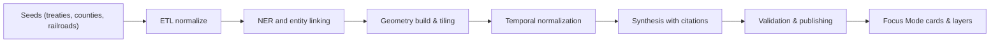

<div align="center">

# 🕰️ **Kansas Historical Transitions Index**  
`docs/history/transitions/README.md`

**Purpose:**  
Provide an AI-assisted, provenance-tracked index of **major Kansas historical transitions**—treaties, land cessions, county formations, railroads, homestead waves, Dust Bowl, irrigation build-out, New Deal programs, post-war mechanization, interstate era, farm crisis, renewables expansion—**tagged to geospatial layers** and normalized time intervals.  
This index powers **Focus Mode auto-context**: as users pan/zoom the map or scrub the timeline, KFM surfaces relevant transitions, sources, and affected entities automatically.

[](../../../../README.md)  
[](../../../../LICENSE)  
[](../../standards/faircare.md)  
[](../../../releases/v10.2.0/)
</div>

---

## 📘 Overview

The **Historical Transitions Index** aligns historical change with **space** (GeoJSON/tiles) and **time** (OWL-Time intervals), represented in the graph using **CIDOC CRM** and **GeoSPARQL**. It supports:

- **Auto-context in Focus Mode:** Map/timeline interactions trigger context cards with citations and layer toggles.  
- **Layer gating:** Transitions activate relevant STAC assets (e.g., plats, soils, drought indices) for the visible extent and date window.  
- **Narrative synthesis:** Embeddings + retrieval assemble short, source-attributed summaries per viewport and selection.

---

## 🗂️ Directory Layout

```bash
docs/history/transitions/
├── README.md                         # This document
├── seeds/                            # Curated seed facts to steer generation
│   ├── treaties.csv
│   ├── counties.csv
│   ├── railroads.csv
│   ├── homestead_waves.csv
│   └── dust_bowl.csv
├── generated/                        # Auto-built artifacts (do not hand-edit)
│   ├── transitions.ndjson            # Canonical events (one JSON per line)
│   ├── transitions.parquet           # Columnar mirror for analytics
│   └── tiles/                        # Vector tiles for footprints & heatmaps
├── schemas/
│   └── transition-event.schema.json  # JSON Schema (MCP-validated)
├── workflows/
│   └── build-index.yml               # GH Action to generate/validate/publish
└── views/
    ├── cards.json                    # Focus Mode card templates & slot rules
    └── mapping.json                  # Layer bindings (MapLibre/Cesium)
```

---

## 🧩 Data Model (CIDOC CRM · GeoSPARQL · OWL-Time)

- **Event node:** `kfm:TransitionEvent`  
  - `prov:wasDerivedFrom` → sources (Kappler, Royce, statutes, BLM plats, newspapers).  
  - `time:hasBeginning` / `time:hasEnd` with **granularity** (`day|month|year|decade`).  
  - `geo:hasGeometry` (WKT/GeoJSON) with optional **uncertainty buffers** (meters).  
  - `crm:P7_took_place_at` → places (counties, reservations, townships, ROW corridors).  
  - `kfm:impactVectors` → `{ land, water, climate, economy, demography, agriculture, infrastructure }` normalized 0–1.  
  - `kfm:layerBindings[]` → STAC collections + style presets for auto-toggle.

---

## 🧾 Canonical Fields

| Field | Type | Description |
|---|---|---|
| `id` | string | Stable ULID for event |
| `title` | string | Human-readable label (e.g., “Treaty of 1854 — Kansa cession”) |
| `kind` | enum | `treaty`, `cession`, `county_formation`, `railroad`, `homestead_wave`, `policy`, `disaster`, `infrastructure`, `market_shift`, `energy_transition` |
| `timespan` | object | `{ start: ISO8601, end: ISO8601, granularity: "year|month|day|decade" }` |
| `geometry` | object | GeoJSON Feature or FeatureCollection |
| `uncertainty_m` | number | Spatial uncertainty radius (meters) |
| `impactVectors` | object | Normalized 0–1 weights by domain |
| `sources[]` | array | `{ citekey, uri, pages, note }` |
| `evidence[]` | array | Extracted quotes/snippets with offsets & licenses |
| `layerBindings[]` | array | `{ stac_collection, style_id, z_order, visibility }` |
| `labels[]` | array | Free tags (e.g., “Dust Bowl”, “USDA-SSURGO”) |

---

## ⚙️ Workflow → Artifact Mapping

| Step | Tooling | Inputs → Outputs |
|---|---|---|
| Seed ingest | Python ETL (GDAL, pandas) | `seeds/*.csv` → normalized tables |
| NER & linking | spaCy + KB linker | Text seeds → entities (treaties, railroads, counties) |
| Geocoding | Shapely, PostGIS, Tippecanoe | Names/ROW → geometries + vector tiles |
| Temporal normalize | OWL-Time helpers | Fuzzy dates → intervals with granularity |
| Synthesis | Guardrailed LLM | Draft summaries + impact vectors (with citations) |
| Validation | JSON Schema + FAIR+CARE checks | Validated `transitions.ndjson` + license enforcement |
| Publish | GH Action `build-index.yml` | Parquet + tiles to `generated/` + STAC catalog update |

---

## 🧠 Focus Mode Integration

- **Trigger rule:** On viewport/time change, query for `TransitionEvent` intersecting `BBOX ∩ interval`.  
- **Card compose:** Template pulls `title`, ≤ 80-word summary, **top 2 sources**, and applies `layerBindings`.  
- **Debounce & rank:** Score by overlap area, recency weight, and `impactVectors`.

---

## 🧩 Mermaid — Event Flow (seed → tiles → cards)



---

## 🧾 Example Records (NDJSON)

```json
{"id":"01JDD9K9H3F5M1K7QGS2B6WPR9","title":"Treaty of 1854 — Kansa cession","kind":"treaty","timespan":{"start":"1854-06-03","end":"1854-06-03","granularity":"day"},"geometry":{"type":"Feature","properties":{},"geometry":{"type":"Polygon","coordinates":[...]}},"uncertainty_m":5000,"impactVectors":{"land":0.9,"water":0.3,"climate":0.1,"economy":0.8,"demography":0.9,"agriculture":0.7,"infrastructure":0.2},"sources":[{"citekey":"Kappler1854","uri":"https://...","pages":"vol1 p.XXX","note":"Ratified 1854"}],"layerBindings":[{"stac_collection":"kfm-counties","style_id":"county-outline","z_order":10,"visibility":"on"}],"labels":["Kaw Nation","cession"]}
{"id":"01JDD9SB0JH2Z9N1R7Z2E2HY6C","title":"Main line of the Atchison, Topeka and Santa Fe reaches Newton","kind":"railroad","timespan":{"start":"1871-07-17","end":"1871-07-17","granularity":"day"},"geometry":{"type":"FeatureCollection","features":[...]},"impactVectors":{"infrastructure":0.95,"economy":0.85,"agriculture":0.6},"sources":[{"citekey":"ATSF1871","uri":"https://..."}],"layerBindings":[{"stac_collection":"kfm-rail-rights-of-way","style_id":"rail-line","z_order":15,"visibility":"on"}],"labels":["ATSF","rail"]}
{"id":"01JDD9Y1NV5Q2XK78S2V3Q1ZPZ","title":"Dust Bowl multi-year soil erosion maxima","kind":"disaster","timespan":{"start":"1934-01-01","end":"1938-12-31","granularity":"year"},"geometry":{"type":"FeatureCollection","features":[...]},"uncertainty_m":10000,"impactVectors":{"climate":1.0,"agriculture":0.95,"land":0.9,"economy":0.7},"sources":[{"citekey":"USDA1930s","uri":"https://..."}],"layerBindings":[{"stac_collection":"kfm-wind-erosion","style_id":"isopleths","z_order":20,"visibility":"on"}],"labels":["Dust Bowl","soil"]}
```

---

## ⚖️ FAIR+CARE & Provenance

- Every synthesized statement maintains **source offsets**, license tags, and a **derivation chain** (`prov:wasDerivedFrom`).  
- Sensitive cultural content follows **CARE** principles with opt-in display and community review gates.  
- All tiles and records include `attribution` and `usage` fields; redaction rules apply for disputed geometries.

---

## 🕰️ Version History

| Version | Date | Author | Summary |
|---|---|---|---|
| **v10.2.2** | 2025-11-11 | KFM Docs | Upgraded & aligned to v10.2 standards; added Focus Mode bindings and validation workflow. |
| **v10.0.0** | 2025-11-11 | KFM Docs | Initial seeded model, schema, workflow, and Focus Mode bindings. |

---

<div align="center">

© 2025 Kansas Frontier Matrix Project  
Master Coder Protocol v6.3 · FAIR+CARE Certified · Diamond⁹ Ω / Crown∞Ω Ultimate Certified  

[Back to `docs/` index](../../README.md) · [Governance Charter](../../standards/governance/ROOT-GOVERNANCE.md)

</div>
