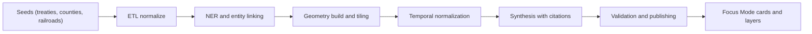

<div align="center">

# 🕰️ **Kansas Historical Transitions Index**
`docs/history/transitions/README.md`

**Purpose:**  
Provide an AI‑generated, provenance‑tracked index of **major Kansas historical transitions** (treaties, land cessions, county formations, railroads, homestead waves, Dust Bowl, irrigation build‑out, New Deal programs, post‑war mechanization, interstate era, farm crisis, renewables expansion, etc.), **tagged to geospatial layers** and normalized time intervals. This powers **Focus Mode** with **timeline auto‑context**: when a user pans/zooms the map or scrubs the timeline, KFM surfaces relevant transitions, sources, and affected entities automatically.

      

</div>

---

## 📘 Overview

This index is an **event fabric** that aligns historical change with **space (GeoJSON/tiles)** and **time (OWL‑Time intervals)**, linked in the graph (CIDOC CRM + GeoSPARQL). It supports:
- **Auto‑context in Focus Mode:** map/timeline interactions trigger concise context cards with citations.
- **Layer gating:** transitions toggle related STAC assets (e.g., soil maps, plats, drought indices) for the visible extent and date window.
- **Narrative synthesis:** embeddings + retrieval assemble short, source‑attributed summaries per viewport.

---

## 🗂️ Directory Layout

```
docs/history/transitions/            # AI-generated transition index (human + machine readable)
  README.md                          # You are here
  seeds/                             # Curated seed facts to steer generation
    treaties.csv                     # Kappler refs, date ranges, parties, spatial hints
    counties.csv                     # Formation/changes with legal refs
    railroads.csv                    # Charter dates, mainlines, ROW buffers
    homestead_waves.csv              # Land entries by county interval
    dust_bowl.csv                    # 1930s events, soil surveys, Works Prog refs
  generated/                         # Auto-built artifacts (do not hand-edit)
    transitions.ndjson               # Canonical events (one JSON per line)
    transitions.parquet              # Columnar mirror for analytics
    tiles/                           # Vector tiles for event footprints & heatmaps
  schemas/
    transition-event.schema.json     # JSON schema (MCP-validated)
  workflows/
    build-index.yml                  # GH Action to generate/validate/publish
  views/
    cards.json                       # Focus Mode card templates & slot rules
    mapping.json                     # Layer bindings (MapLibre/Cesium)
```

---

## 🧩 Data Model (CIDOC CRM · GeoSPARQL · OWL‑Time)

- **Event node:** `kfm:TransitionEvent`
  - `prov:wasDerivedFrom` → sources (Kappler entries, USFS Royce, state statutes, BLM plats, newspapers).
  - `time:hasBeginning`/`time:hasEnd` with granularity flags (day/month/year/decade).
  - `geo:hasGeometry` (WKT/GeoJSON) and optional **uncertainty buffers** (meters).
  - `crm:P7_took_place_at` → counties, reservations, townships, line/ROW corridors.
  - `kfm:impactVectors` → { land, water, climate, economy, demography, agriculture, infrastructure } (0–1).
  - `kfm:layerBindings[]` → STAC collections & style presets for auto‑toggle.

---

## 🧾 Canonical Fields

| Field | Type | Description |
|---|---|---|
| `id` | string | Stable ULID for event |
| `title` | string | Human‑readable label (e.g., “Treaty of 1854 — Kansa cession”) |
| `kind` | enum | `treaty`, `cession`, `county_formation`, `railroad`, `homestead_wave`, `policy`, `disaster`, `infrastructure`, `market_shift`, `energy_transition` |
| `timespan` | object | `{ start: ISO8601, end: ISO8601, granularity: "year|month|day|decade" }` |
| `geometry` | object | GeoJSON Feature or FeatureCollection (with CRS note if needed) |
| `uncertainty_m` | number | Spatial uncertainty radius (meters) |
| `impactVectors` | object | Normalized 0–1 weights by domain |
| `sources[]` | array | `{ citekey, uri, pages, note }` |
| `evidence[]` | array | Extracted quotes/snippets with offsets & license tags |
| `layerBindings[]` | array | `{ stac_collection, style_id, z_order, visibility }` |
| `labels[]` | array | Free tags (e.g., “Dust Bowl”, “USDA-SSURGO”) |

---

## ⚙️ Workflow → Artifact Mapping

| Step | Tooling | Inputs → Outputs |
|---|---|---|
| Seed ingest | Python ETL (GDAL, pandas) | `seeds/*.csv` → normalized tables |
| NER & linking | spaCy + KB linker | Text seeds → entities (treaty names, railroads, counties) |
| Geocoding | Shapely, PostGIS/Tippecanoe | Names/ROW → geometries + vector tiles |
| Temporal normalize | OWL‑Time helpers | Fuzzy dates → intervals with granularity |
| Synthesis | LLM (guardrailed) | Draft summaries + impact vectors (with citations) |
| Validation | JSON Schema + FAIR+CARE checks | `transitions.ndjson` validated, licenses enforced |
| Publish | GH Action `build-index.yml` | Parquet + tiles to `generated/` + STAC catalog update |

---

## 🧠 Focus Mode Integration

- **Trigger rule:** on viewport/time change, query graph for `TransitionEvent` intersecting `BBOX ∩ interval`.
- **Card compose:** slot template pulls `title`, short summary (<= 80 words), **top 2 sources**, and toggles `layerBindings`.
- **Debounce & rank:** score by overlap area, recency weight, and `impactVectors`.

---

## 🧩 Mermaid — Event Flow (seed → tiles → cards)



---

## 🧾 Example Records (NDJSON)

```json
{"id":"01JDD9K9H3F5M1K7QGS2B6WPR9","title":"Treaty of 1854 — Kansa cession","kind":"treaty","timespan":{"start":"1854-06-03","end":"1854-06-03","granularity":"day"},"geometry":{"type":"Feature","properties":{},"geometry":{"type":"Polygon","coordinates":[...]}},"uncertainty_m":5000,"impactVectors":{"land":0.9,"water":0.3,"climate":0.1,"economy":0.8,"demography":0.9,"agriculture":0.7,"infrastructure":0.2},"sources":[{"citekey":"Kappler1854","uri":"https://...","pages":"vol1 p.XXX","note":"Ratified 1854"}],"layerBindings":[{"stac_collection":"kfm-counties","style_id":"county-outline","z_order":10,"visibility":"on"}],"labels":["Kaw Nation","cession"]}
{"id":"01JDD9SB0JH2Z9N1R7Z2E2HY6C","title":"Main line of the Atchison, Topeka and Santa Fe reaches Newton","kind":"railroad","timespan":{"start":"1871-07-17","end":"1871-07-17","granularity":"day"},"geometry":{"type":"FeatureCollection","features":[...]},"impactVectors":{"infrastructure":0.95,"economy":0.85,"agriculture":0.6},"sources":[{"citekey":"ATSF1871","uri":"https://..."}],"layerBindings":[{"stac_collection":"kfm-rail-rights-of-way","style_id":"rail-line","z_order":15,"visibility":"on"}],"labels":["ATSF","rail"]}
{"id":"01JDD9Y1NV5Q2XK78S2V3Q1ZPZ","title":"Dust Bowl multi‑year soil erosion maxima","kind":"disaster","timespan":{"start":"1934-01-01","end":"1938-12-31","granularity":"year"},"geometry":{"type":"FeatureCollection","features":[...]},"uncertainty_m":10000,"impactVectors":{"climate":1.0,"agriculture":0.95,"land":0.9,"economy":0.7},"sources":[{"citekey":"USDA1930s","uri":"https://..."}],"layerBindings":[{"stac_collection":"kfm-wind-erosion","style_id":"isopleths","z_order":20,"visibility":"on"}],"labels":["Dust Bowl","soil"]}
```

---

## ⚖️ FAIR+CARE & Provenance

- Every synthesized statement stores **source offsets**, license, and **derivation chain** (`prov:wasDerivedFrom`).  
- Sensitive cultural content follows **CARE** principles with opt‑in display and community review gates.  
- All tiles and records include `attribution` and `usage` fields; redaction rules apply for disputed geometries.

---

## 🕰️ Version History

| Version | Date | Author | Summary |
|---|---|---|---|
| v10.0.0 | 2025-11-11 | KFM Docs | Initial seeded model, schema, workflow, and Focus Mode bindings |

---

<div align="center">

© Kansas Frontier Matrix — Master Coder Protocol v6.3 · FAIR+CARE Certified · Diamond⁹ Ω / Crown∞Ω Ultimate Certified  
[Back to `docs/` index] · [Governance Charter]

</div>
