<!-- [KFM_META_BLOCK_V2]
doc_id: kfm://doc/installation
title: Install and configure KFM locally
type: guide
version: v1
status: repository-grounded; local-development-only
owners: ["@bartytime4life"]
created: 2026-09-27
updated: 2026-10-05
policy_label: public-documentation
current_path: docs/installation.md
owning_root: docs/
responsibility: current local dependency installation and configuration paths
truth_posture: CONFIRMED local command definitions at main@0bcdc2e784, GitHub Site manifest at main@788fdf4829c7, and Site launcher, smoke and make site-check behavior at main@a9fc3e7e; runtime results require separate execution evidence
related:
  - ../README.md
  - ../apps/site/README.md
  - ../tools/ci/README.md
  - ../scripts/dev/BOOTSTRAP.md
[/KFM_META_BLOCK_V2] -->

> **Water pilot setup — 2026-09-30:** use supported Python and the hash-locked
> `water-pilot` installer profile. The setup doctor, runnable read API, external
> candidate store and separate Site npm boundary are documented in
> [the water runbook](runbooks/water-pilot.md). No service or timer is installed
> merely by installing the packages.

<!-- kfm-showcase:start -->
<p align="center">
  <a href="../README.md#see-it-in-action"><picture><source media="(prefers-color-scheme: dark)" srcset="brand/readme/kfm-banner-installation-dark.svg" /></picture></a>
</p>
<!-- kfm-showcase:end -->

# Install and configure KFM locally

<!-- kfm-showcase:start -->
<p>
  <a href="#install-and-configure-kfm-locally"></a>
  <a href="#install-and-configure-kfm-locally"></a>
  <a href="../README.md"></a>
  <a href="../README.md#take-the-tour"></a>
</p>
<!-- kfm-showcase:end -->

This guide covers the current repository checkout. Choose the component you need; the root Python tools, root JavaScript workspace, and Explorer Site have separate dependency installs. Run commands from the repository root unless a step changes directory.

<!-- kfm-showcase:start -->
<p align="center">
  <picture><source media="(prefers-color-scheme: dark)" srcset="brand/readme/kfm-install-paths-dark.svg" /></picture>
</p>

<sub>Illustration, not a data product — this page's text is authoritative. See <a href="brand/readme/README.md">README artwork</a>.</sub>
<!-- kfm-showcase:end -->

## Prerequisites

| Component | Required tools | Dependency source |
| --- | --- | --- |
| Local data inventory and storage | Python 3.11 or newer | Python standard library; no package install |
| Repository validators and fixture API | Python 3.11 or newer, Git, and Make for Make targets | `tools/ci/python-test.lock` through `tools/ci/install_python_ci.py` |
| Shared JavaScript packages and MapLibre tooling | Node `>=22.13 <23`, pnpm `11.17.0` | Root `pnpm-lock.yaml` and `pnpm-workspace.yaml` |
| Explorer Site mirror | Node `>=22.13.0` on Linux; `flock`, `curl`, `sha256sum`, GNU `timeout` | `apps/site/source/package-lock.json` through `npm run install:ci` |

The Site's `apps/site/source/` tree is outside the root pnpm workspace. Its own `package.json` declares the runtime and development dependencies, including a locally vendored Vinext tarball. Do not run root pnpm commands as a substitute for the Site install. Root `lint`, `test`, and `build` are intentional `WORKFLOW_HOLD` scripts; `make ui-build` is also a hold for the retired Explorer Web app.

## Checkout and Python checks

Clone once, or enter your existing checkout without replacing local edits:

```bash
git clone https://github.com/bartytime4life/Kansas-Frontier-Matrix.git
cd Kansas-Frontier-Matrix
git status --short
python3 -m venv .venv
. .venv/bin/activate
python tools/ci/install_python_ci.py project-test
make validate
```

The installer selects the committed, SHA-256 hash locked test profile and installs the local metadata-only root distribution. It may contact the package index. `make validate` runs the current repository validator and schema/contract test baseline; use the target README and focused checks for the area you change. The root wheel does not contain the Site, an importable KFM SDK, datasets, or a deployed service.

On Ubuntu 24.04, `scripts/dev/bootstrap.sh --check --json` inspects the Python, Node, pnpm, and Git prerequisites without installing. Its default apply mode also installs root dependencies and tries to register pre-commit hooks. The root test extra does not declare `pre-commit`, so use `--no-hooks` unless a compatible `pre-commit` executable is already in `.venv`. The helper's Python install uses the version ranges in `pyproject.toml`; use the hash locked command above when reproducibility matters. See [bootstrap details](../scripts/dev/BOOTSTRAP.md).

## Shared JavaScript workspace

For changes to the remaining root workspace packages or MapLibre tooling, use Node 22 and the declared pnpm version:

```bash
node --version
pnpm --version
pnpm install --frozen-lockfile
```

The committed `allowBuilds` policy in `pnpm-workspace.yaml` controls dependency build scripts. Stop on a lockfile mismatch or an unreviewed build request; review the exact package and version before changing the policy. Use a package-specific command that exists in that package's `package.json`. There is no root Explorer Web install or runnable `explorer-web` filter in this checkout.

## Explorer Site mirror

The runnable local web app is the historical Site source mirror. On Linux:

```bash
cd apps/site/source
npm run install:ci
npm run build
../serve-local.sh
```

The launcher prints its URL and defaults to `127.0.0.1:4173`. It initializes an empty local D1 schema on first use, reapplies the additive `drizzle/` migrations on every launch, and retains local D1/R2 simulator state in ignored `.wrangler/local-state/` (set `SITE_STATE_DIR` to use another directory). It refuses to start if the migration files and `drizzle/meta/_journal.json` disagree. It then serves through the Site's direct Miniflare launcher. It falls back to `wrangler dev`, printing why, for a non-loopback `SITE_HOST`, a port below 1024, a Node version other than 22.x, or a `.dev.vars` or `.env` file in `apps/site/source/`. Set `SITE_PORT` if the port is occupied. Set `SITE_HOST` only for a deliberately reviewed listening address. `npm run dev` is a separate development command; the launcher above exercises the built local Worker. The source tree and local bindings contain no hosted private D1 rows, R2 uploads, or live provider snapshot.

To check the Site the same way the `explorer-site` workflow does, run `make site-check` from the repository root. It installs from the Site's lockfile, then runs lint, typecheck, the build with its node tests, and `apps/site/smoke-local.sh`, which checks every API route that can answer without a provider against a temporary local state. Neither the tests nor the smoke need provider network. See [Site setup](../apps/site/README.md) and the Site's [feature notes](../apps/site/source/README.md).

## Local data and configuration

Keep private files outside the Git checkout. The local data tools need no third-party Python packages:

```bash
python3 tools/local_data/doctor.py
export KFM_DATA_ROOT="$HOME/KFM-data"
python3 tools/local_data/manage.py init
```

Use [the local data runbook](runbooks/local-pc-data-store.md) before moving originals or preparing imports. Storage initialization is not source admission, map display, or publication.

The root [`.env.example`](../.env.example) is a reference template, not an automatically loaded file. Export a value explicitly for the program that reads it. The current fixture API starts with `make governed-api-dev` on `127.0.0.1:8000`; `KFM_API_BIND` and `KFM_API_PORT` in the template are illustrative and do not change that listener. `KFM_MODEL_RUNTIME=mock` is the local readiness default; the template's `OLLAMA_HOST` is inactive under mock mode. Site runtime settings, such as the steward, Earth Engine and historical-map owner allowlists, the historical-map worker token and the Qwen endpoint, belong in private server configuration, never tracked files. The [Site setup](../apps/site/README.md#local-configuration) table lists each one and what its routes answer when it is unset. Site local D1/R2 bindings are simulated separately from production bindings.

Do not commit `.env`, credentials, downloaded source files, local D1/R2 state, or external data archives. A successful install or local launch proves only that the named local command worked; it does not establish hosted availability, admitted data, release, or publication.

<!-- kfm-showcase:start -->
<p align="center">
  
</p>

<p align="center">
  <a href="../README.md"><b>↩ Project home</b></a> ·
  <a href="../README.md#see-it-in-action">See it in action</a> ·
  <a href="../README.md#take-the-tour">Tour</a> ·
  <a href="../README.md#things-to-try">Things to try</a> ·
  <a href="../README.md#faq">FAQ</a> ·
  <a href="brand/readme/README.md">Artwork</a>
</p>
<!-- kfm-showcase:end -->
