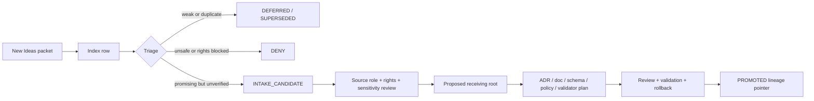

<!-- [KFM_META_BLOCK_V2]
doc_id: kfm://doc/NEEDS-VERIFICATION
title: New Ideas Index
type: standard
version: v1
status: draft
owners: OWNER_TBD
created: 2026-05-16
updated: 2026-05-16
policy_label: NEEDS VERIFICATION: public-facing documentation label not confirmed in mounted repo
related: [docs/intake/IDEA_INTAKE.md (NEEDS VERIFICATION), docs/registers/AUTHORITY_LADDER.md (NEEDS VERIFICATION), docs/registers/CANONICAL_LINEAGE_EXPLORATORY.md (NEEDS VERIFICATION), docs/registers/VERIFICATION_BACKLOG.md (NEEDS VERIFICATION)]
tags: [kfm, docs, intake, new-ideas, governance]
notes: [Repo implementation depth UNKNOWN in this drafting session; this index inventories exploratory packets without promoting them.]
[/KFM_META_BLOCK_V2] -->

# New Ideas Index

Inventory and triage surface for KFM “New Ideas” packets before any idea becomes doctrine, implementation, source registry material, policy, schema, release artifact, or public claim.

> [!IMPORTANT]
> **Status:** `PROPOSED` documentation-control file  
> **Target path:** `docs/intake/NEW_IDEAS_INDEX.md`  
> **Owner:** `OWNER_TBD`  
> **Truth posture:** CONFIRMED packet inventory / EXPLORATORY idea status / UNKNOWN repo implementation depth  
> **Rule:** This index preserves idea lineage. It does **not** promote ideas into canon.

## Why this file exists

KFM keeps exploratory ideas useful by making their status visible early. This index gives maintainers one reviewable place to answer four questions:

1. **What packets exist?**
2. **What do they appear to contribute?**
3. **What gates block promotion?**
4. **Where should accepted work move next without creating authority drift?**

The index is intentionally conservative. A packet can be high-signal and still remain `EXPLORATORY` until source roles, rights, sensitivity, current facts, schemas, policy gates, validation, receipts, review state, release state, correction path, and rollback path are verified where relevant.

## Directory Rules basis

`docs/intake/NEW_IDEAS_INDEX.md` is a human-facing governance document. Its job is to explain and track intake, not to define machine-readable object shape, decide policy, store source records, or publish data.

| Placement question | Decision |
| --- | --- |
| Owning root | `docs/` because this file explains intake status to humans. |
| Lane | `docs/intake/` because this is pre-promotion documentation control. |
| Not `schemas/` | This file does not define machine shape. |
| Not `contracts/` | This file does not define object semantics. |
| Not `policy/` | This file does not decide allow/deny/restrict/abstain. |
| Not `data/registry/` | This file is not a source descriptor registry. |
| Not `release/` | This file is not a release decision, manifest, rollback, or correction record. |

> [!NOTE]
> If the mounted repository already has a different accepted intake convention, treat this file as a draft and reconcile by ADR or drift-register entry before merging.

## What belongs here

Accepted inputs:

- New Ideas PDFs, notes, paste packets, or source bundles not yet promoted.
- Short packet summaries with explicit truth labels.
- Promotion blockers and review tasks.
- Cross-links to the eventual owning root when a packet becomes build work.
- Supersession notes when a newer packet changes or replaces an older packet.

Excluded inputs:

| Do not put this here | Correct home after verification |
| --- | --- |
| Machine schema definitions | `schemas/contracts/v1/...` or repo-confirmed schema home. |
| Object semantic contracts | `contracts/...` or repo-confirmed contract home. |
| Policy logic or Rego rules | `policy/...`. |
| Test fixtures | `fixtures/...` or repo-confirmed fixture home. |
| Validators, generators, CI helpers | `tools/...`, `.github/workflows/...`, or repo-confirmed implementation home. |
| Source descriptors and rights records | `data/registry/...` or repo-confirmed source registry home. |
| Release manifests, rollback cards, correction notices | `release/...` and emitted proof/receipt homes. |
| Raw uploaded source content | Not in this Markdown file; preserve in the governed source archive/intake location after repo verification. |

## Intake state model

Use these labels narrowly. Do not upgrade a packet because it sounds useful.

| Label | Meaning | Merge posture |
| --- | --- | --- |
| `EXPLORATORY` | Idea packet, research note, sketch, or implementation suggestion not yet promoted. | Safe to index. Not safe to implement as canon. |
| `INTAKE_CANDIDATE` | Packet has enough structure to prepare a `SourceIntakeRecord` or review card. | Needs owner and intake review. |
| `NEEDS VERIFICATION` | A concrete check must happen before relying on the claim, source, path, version, rights, or implementation. | Blocker for promotion. |
| `PROMOTION_CANDIDATE` | Maintainer-reviewed idea has a proposed receiving doc/ADR/schema/policy/runbook/implementation path. | Needs review, validation plan, rollback target. |
| `PROMOTED` | Idea has moved into a named governed artifact with review state and source linkage. | Keep index row as lineage pointer. |
| `DEFERRED` | Useful but intentionally postponed. | Keep reason and revisit trigger. |
| `SUPERSEDED` | Replaced by a newer packet or stronger evidence. | Keep forward link. |
| `DENY` | Must not proceed under current evidence, policy, rights, sensitivity, or safety posture. | Keep denial reason and reviewer. |

## Intake flow



## Current packet index

These rows are based on packets visible in the current source corpus. Implementation status remains `UNKNOWN` unless a mounted repository, tests, workflows, emitted receipts, release manifests, or runtime logs confirm otherwise.

| Packet ID | Packet | Current label | Primary contribution | Promotion blockers | Suggested next surface |
| --- | --- | --- | --- | --- | --- |
| `NI-2026-05-08` | `New Ideas 5-8-26.pdf` | `EXPLORATORY` / `NEEDS VERIFICATION` for current external status claims | Environmental watcher and tile-health gating ideas: MAIAC AOD, FIRMS fire proximity/FRP, SMAP L4 recency, AirNow key handling, Mesonet rights handling, finite decisions, signed `run_receipt` expectations. | Re-check all current external service status, source terms, thresholds as policy choices, Mesonet consent posture, and source-role limits. Verify repo homes before creating `policy/`, `schemas/`, `tools/`, or `fixtures/` files. | Intake review card; possible docs/runbook for ecology watcher gates; possible schema/policy/validator wave after ADR-backed placement. |
| `NI-2026-05-10` | `New Ideas 5-10-26.pdf` | `EXPLORATORY` / `NEEDS VERIFICATION` for tool/version/licensing claims | PMTiles publication and integrity lane: versioned files, root/spec hashes, sidecars, Bao/BLAKE3 range verification, DSSE/cosign, ORAS/OCI referrers, negative-path CI, verifier tooling, release manifest and rollback rehearsal. | Verify PMTiles tool versions, package licenses, ORAS/cosign/Bao availability, schema-home convention, public-safe artifact policy, OCI/referrer behavior, and MapLibre/Cesium consumption contracts. | Intake review card; possible ADR for artifact publication schema home; possible tools/attest + validator plan after repo inspection. |

## Packet cards

### `NI-2026-05-08` — environmental watcher gates

**Status:** `EXPLORATORY`  
**Main lane pressure:** ecology / atmosphere / hydrology watchers  
**Implementation depth:** `UNKNOWN`

This packet proposes deterministic watcher thresholds and CI probes for environmental conditions. It frames source freshness, ETag/Last-Modified capture, `spec_hash`, signed `run_receipt`, finite outcomes, and fail-closed source-rights checks as first-class controls.

Promotion notes:

- Treat AOD and FRP thresholds as **policy proposals**, not scientific truth or public emergency guidance.
- Do not activate live connectors from this packet without source descriptors, rights review, sensitivity review, fixtures, and validator tests.
- Keep AirNow and Mesonet handling rights-aware and key/consent-aware.
- Any public layer impact must pass governed release, policy, and rollback checks.

### `NI-2026-05-10` — PMTiles attestation and verifier lane

**Status:** `EXPLORATORY`  
**Main lane pressure:** MapLibre / PMTiles / release integrity / CI attestations  
**Implementation depth:** `UNKNOWN`

This packet proposes a PMTiles publication lane with versioned artifacts, signed sidecars, root hashes, byte-range manifests, Bao outboard proofs, DSSE/cosign attestations, ORAS/OCI storage, negative-path CI tests, and publication gates.

Promotion notes:

- Do not overwrite PMTiles in place if a versioned/digest-pinned publication model is available.
- Treat `sidecar`, `run_receipt`, `ReleaseManifest`, `EvidenceBundle`, and proof objects as separate object families.
- Keep renderer consumption downstream of release manifests and policy decisions.
- Do not imply PMTiles, MapLibre, Cesium, ORAS, cosign, Bao, or CI tooling are installed or enforced until repo evidence proves it.

## Lineage packets referenced by prior passes

Prior KFM synthesis passes mention many older New Ideas packets. Those references are useful for continuity, but they are not current implementation proof. Reconcile them when the packet files or prior registers are available in the mounted repo.

<details>
<summary>Lineage families to reconcile later</summary>

| Lineage family | Reported themes | Current handling |
| --- | --- | --- |
| New Ideas 4-17-26 | NHDPlus HR Permanent Identifier / COMID crosswalk; hydrology identity bridge. | `LINEAGE`; verify source packet and target hydrology docs. |
| New Ideas 4-15-26 / 4-14-26 / 4-13-26 / 4-12-26 | Soil moisture, USGS Water + Mesonet connectors, time-series promotion, DSSE/cosign, promotion gates. | `LINEAGE`; do not claim implementation. |
| New Ideas 4-10-26 / 4-2-26 | WBD/HUC12, NASS, FWS eDNA, KGS, LOC, SSURGO/gSSURGO watcher patterns. | `LINEAGE`; candidate source registry review. |
| New Ideas 3-31-26 / 3-27-26 | Biodiversity APIs, HLS-VI, atmospheric masks, KDWP listed species and rare-species posture. | `LINEAGE`; sensitivity and rights gates required. |
| New Ideas 3-22-26 / 3-16-26 / 3-11-26 / 3-7-26 / 3-4-26 | AI evaluator harness, entity resolution, PR-driven publish, AI proposal engine, CDC-temporal-sandbox-validation patterns. | `LINEAGE`; keep AI evidence-subordinate. |
| New Ideas Feb 2026 family | Fail-closed CI/CD, GitHub App, OPA/Rego migration, OCI/ORAS non-container artifact publication, SLSA-grade attestations. | `LINEAGE`; reconcile with current artifact publication plans. |
| New Ideas Jan/Dec 2025 family | Arrow-native geospatial pipelines, Kansas LiDAR ecosystem, Neo4j migration, model-card posture, concept extraction. | `LINEAGE`; verify before carrying forward. |

</details>

## Promotion checklist

A packet may move beyond this index only when the receiving artifact is clear and reviewable.

- [ ] Packet source is preserved in an approved source/intake location.
- [ ] Packet row has owner or reviewer assigned; `OWNER_TBD` is not acceptable for promotion.
- [ ] Source role, authority limits, rights, cadence, and sensitivity are recorded where the packet depends on external sources.
- [ ] Version-sensitive facts are rechecked against authoritative current sources.
- [ ] Receiving root is identified by responsibility, not topic convenience.
- [ ] Proposed paths are checked against Directory Rules and current repo evidence.
- [ ] Schema, contract, policy, source registry, release, proof, and receipt homes are not duplicated.
- [ ] Validation path and negative-path tests are defined before implementation work proceeds.
- [ ] Public or semi-public outputs have evidence, rights, sensitivity, review, release, correction, and rollback support.
- [ ] The packet’s index row is updated to `PROMOTED`, `DEFERRED`, `SUPERSEDED`, or `DENY` with a reason.

## Add a new packet row

Use this compact template. Keep summaries short; put long notes in a review card or follow-up doc.

```markdown
| `NI-YYYY-MM-DD` | `<packet filename or source>` | `EXPLORATORY` | `<one-sentence contribution>` | `<specific verification blockers>` | `<proposed receiving surface>` |
```

If a packet contains current operational claims, add `NEEDS VERIFICATION` until those claims are rechecked against authoritative sources.

## Open verification backlog

| Item | Why it matters | Blocking level |
| --- | --- | --- |
| Confirm mounted repo conventions for `docs/intake/`. | This file path is doctrine-supported, but current repo state was not mounted in this drafting session. | High before merge. |
| Confirm adjacent docs and links. | `docs/intake/IDEA_INTAKE.md`, authority ladder, canon/lineage register, and verification backlog may need creation or link adjustment. | High before merge. |
| Assign owner. | `OWNER_TBD` prevents authoritative stewardship. | High before publication. |
| Verify current external facts in New Ideas packets. | Packet claims about live services, tools, versions, licenses, source status, and API behavior are time-sensitive. | High before implementation. |
| Create or confirm source-intake record format. | The index should not become the source registry or schema authority. | Medium. |
| Define supersession rules for repeated New Ideas themes. | Recurring PMTiles, watcher, AI, and promotion-gate themes need one clear lineage chain. | Medium. |

## Rollback

This is a docs-only control-plane file. Roll back by removing `docs/intake/NEW_IDEAS_INDEX.md` and any links to it if the file creates authority confusion, conflicts with an accepted intake convention, or duplicates a stronger existing register.

Rollback target: `ROLLBACK_TARGET_TBD_AFTER_REPO_INSPECTION`

Do **not** delete source packets when rolling back this index. Packet preservation belongs to the governed source/intake/archive process, not this Markdown file.
