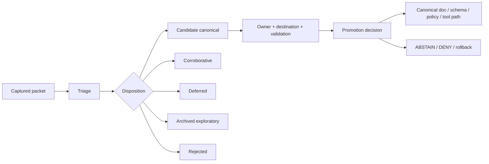

<!-- [KFM_META_BLOCK_V2]
doc_id: kfm://doc/NEEDS-VERIFICATION
title: New Ideas Index
type: standard
version: v1
status: draft
owners: OWNER_TBD
created: 2026-05-16
updated: 2026-05-16
policy_label: public
related: [docs/doctrine/directory-rules.md NEEDS VERIFICATION, docs/intake/new-ideas-register.md PROPOSED, docs/registers/DRIFT_REGISTER.md NEEDS VERIFICATION]
tags: [kfm, intake, new-ideas, documentation-control, governance]
notes: [Repo implementation depth UNKNOWN; path supplied by user; source packets remain EXPLORATORY until triaged and promoted.]
[/KFM_META_BLOCK_V2] -->

# New Ideas Index

A governed intake index for dated KFM “New Ideas” packets, preserving useful design pressure without turning exploratory notes into canon or implementation proof.

> [!IMPORTANT]
> **Status:** PROPOSED / NEEDS VERIFICATION  
> **Path:** `docs/intake/NEW_IDEAS_INDEX.md`  
> **Owner:** `OWNER_TBD`  
> **Truth posture:** CONFIRMED doctrine / EXPLORATORY packet content / UNKNOWN repo implementation depth

## Quick navigation

- [Purpose](#purpose)
- [Repo fit](#repo-fit)
- [Operating law](#operating-law)
- [Current packet register](#current-packet-register)
- [Intake taxonomy](#intake-taxonomy)
- [Promotion criteria](#promotion-criteria)
- [Maintenance workflow](#maintenance-workflow)
- [Verification checklist](#verification-checklist)
- [Rollback](#rollback)
- [Appendix: packet cards](#appendix-packet-cards)

## Purpose

The “New Ideas” stream is a high-value source of implementation pressure, source-refresh signals, policy sketches, object-family proposals, and UI/runtime hardening ideas. It is also easy to overread.

This index keeps that stream useful by recording each packet as intake material first, then routing specific ideas toward a governed destination only after evidence, ownership, rights, sensitivity, validation, and rollback requirements are clear.

This file does **not** make any packet authoritative. It does **not** prove that proposed paths, tools, policies, schemas, workflows, or services exist in the repository. It is an intake control surface.

## Repo fit

| Field | Value |
| --- | --- |
| Intended home | `docs/intake/NEW_IDEAS_INDEX.md` |
| Placement status | PROPOSED because mounted repo topology was not verified in this session. |
| Responsibility root | `docs/` — documentation control and governance navigation. |
| Intake lane role | Capture and classify exploratory packets before promotion. |
| Upstream doctrine | Directory Rules, documentation architecture passes, KFM truth posture, trust membrane, lifecycle law. |
| Downstream destinations | `docs/doctrine/`, `docs/sources/`, `docs/domains/`, `docs/architecture/`, `schemas/contracts/v1/`, `contracts/`, `policy/`, `pipelines/`, `tools/`, `tests/`, `release/`, or archive/lineage destinations after triage. |
| Known placement conflict | Prior documentation architecture sources propose `docs/intake/new-ideas-register.md`; the user supplied `docs/intake/NEW_IDEAS_INDEX.md`. Treat this file as an index/landing page until repo convention and sibling register names are verified. |

### Accepted inputs

This index accepts:

- dated “New Ideas” packets, notes, PDFs, docs, or text files;
- packet summaries and one-sentence intake notes;
- source IDs, hashes, dates, owners, and status labels;
- triage category assignments;
- links to candidate canonical destinations;
- verification backlog items that prevent promotion.

### Exclusions

This index must not store:

- canonical policy rules — use `policy/` and policy docs;
- schema definitions — use the repo’s accepted schema home, defaulting to `schemas/contracts/v1/` only after verification;
- contract semantics — use `contracts/` or accepted contract docs;
- source registry records — use `data/registry/` and source descriptors;
- emitted receipts, proofs, manifests, or release objects — use the appropriate lifecycle/proof homes;
- sensitive exact locations, private source credentials, raw data, unpublished EvidenceBundle contents, or unreviewed public-release claims.

## Operating law

New Ideas packets are **EXPLORATORY** until a governed decision changes their status. Duplicates and repeated suggestions can corroborate direction, but they do not become independent authority votes.



A packet may sharpen a future build, but it must not bypass KFM’s trust membrane:

```text
RAW -> WORK / QUARANTINE -> PROCESSED -> CATALOG / TRIPLET -> PUBLISHED
```

Publication remains a governed state transition. Map tiles, PMTiles, COGs, graph projections, vector indexes, generated summaries, Focus Mode answers, screenshots, and Story Nodes remain downstream carriers, not sovereign truth.

## Current packet register

This table records only the packet sources visible or directly retrieved in this session. It is not a complete historical inventory.

| Intake ID | Source packet | Date signal | Current status | Main themes | Candidate destinations | Blocking checks |
| --- | --- | --- | --- | --- | --- | --- |
| `NIP-2026-05-08` | `New Ideas 5-8-26.pdf` | Filename date | CAPTURED / EXPLORATORY | Ecology tile gating; MAIAC AOD, FIRMS, SMAP, AirNow, Mesonet; watcher DecisionEnvelope; RunReceipt; PMTiles sidecars; MapLibre/Cesium verification; no-network proof slice; DSSE/cosign; policy hooks. | `docs/domains/ecology/`, `docs/sources/`, `policy/ecology/`, `schemas/contracts/v1/governance/`, `tools/ci/probes/`, `tools/smoke/`, `release/` after verification. | Verify source rights, API/key requirements, external product facts, Mesonet consent posture, thresholds as policy not science absolutes, and repo path conventions. |
| `NIP-2026-05-10` | `New Ideas 5-10-26.pdf` | Filename date | CAPTURED / EXPLORATORY | PMTiles operational hardening; versioned artifacts; sidecar + Bao/BLAKE3 proofs; DSSE/cosign/Rekor; OCI/ORAS publication; fail-closed CI gate; MapLibre performance testing; automation starter pack; promotion/rollback rehearsal. | `tools/attest/`, `tools/validators/`, `schemas/contracts/v1/artifacts/`, `.github/workflows/`, `release/`, `docs/architecture/map/`, `docs/runbooks/` after repo verification. | Verify current tool versions and licenses, package availability, OCI/referrer support, schema-home authority, workflow conventions, public-safe artifact exposure, and rollback evidence. |

### Known lineage backlog to inventory

Prior source ledgers and documentation architecture passes refer to earlier New Ideas packets from February, March, and April 2026. Those packets should be inventoried in a separate pass before this file is treated as complete.

| Family | Status | Why it is not fully indexed here | Required next step |
| --- | --- | --- | --- |
| February 2026 New Ideas docs | NEEDS VERIFICATION | Some related files were discoverable as prior uploads, but not all are present in the visible `/mnt/data` workspace. | Confirm packet filenames, hashes, dates, duplicates, source IDs, and promotion status. |
| March 2026 New Ideas packets | NEEDS VERIFICATION | Prior reports list multiple March packets as EXPLORATORY lineage. | Inventory packets and add one row per dated source. |
| April 2026 New Ideas packets | NEEDS VERIFICATION | Prior reports list multiple April packets and Part 2 variants as EXPLORATORY lineage. | Inventory packets and map each to canonical destination candidates. |

## Intake taxonomy

Use the narrowest truthful category. A packet can produce multiple extracted ideas, each with its own category.

| Intake category | Definition | Typical examples | Default destination after triage |
| --- | --- | --- | --- |
| Doctrine candidate | Refines governing law, terminology, or truth posture. | Better cite-or-abstain wording; authority rule refinement. | `docs/doctrine/` |
| Source refresh | Adds or updates current source/service knowledge. | New official source endpoint; API behavior; licensing change. | `docs/sources/` + source registry |
| Schema / contract proposal | Crystallizes an object family or lifecycle seam. | `RunReceipt`, `EvidenceBundle`, `DecisionEnvelope`, PMTiles sidecar. | `contracts/` + `schemas/contracts/v1/` + fixtures after ADR checks. |
| Policy / gate proposal | Refines allow/deny/abstain or release logic. | Promotion gate; AI citation rule; sensitive geometry deny rule. | `policy/` + runbook + tests |
| Workflow / automation proposal | Proposes a governed process change. | Watcher flow; CI gate; artifact signing lane; packaging flow. | `pipelines/`, `tools/`, runbooks |
| UI / shell proposal | Refines Evidence Drawer, shell state, Focus Mode, or map interaction. | Drawer payloads; trust badges; route grouping; preview renderer. | `docs/architecture/`, UI docs, component README after repo verification. |
| Data / domain expansion | Expands a lane or sequencing burden. | Hydrology watcher; soils lane; biodiversity extension; hazards context. | `docs/domains/` + source descriptors |
| Implementation note | Narrow operational detail. | Normalization rule; naming rule; sharding convention. | Local package README or runbook |
| Duplicate / corroborative | Repeats accepted direction without a new destination. | Repeated PMTiles attestation note. | Register cross-reference only |
| Lineage-only | Historically useful, no active action. | Older pass variant; superseded sketch. | Archive / lineage location |
| Repo-verification candidate | Claims that need direct repo proof. | “Workflow YAML exists”; “validator already enforced.” | Verification backlog |

## Intake statuses

| Status | Meaning | Next allowed move |
| --- | --- | --- |
| CAPTURED | Stored with date, family, short summary, and source reference. | TRIAGED |
| TRIAGED | Classified and linked to one or more categories. | Candidate canonical, corroborative, deferred, archived, or rejected. |
| CANDIDATE CANONICAL | Fits doctrine and has one clear destination. | Promote only with owner, validation, and rollback target. |
| CORROBORATIVE | Adds support but no new canonical destination. | Cross-reference only. |
| DEFERRED | Useful later, but depends on upstream proof. | Keep on backlog. |
| ARCHIVED EXPLORATORY | Preserved but not active. | Archive and link forward. |
| REJECTED | Contradicts doctrine, exposes unacceptable risk, or overclaims without value. | Archive with rationale. |

## Promotion criteria

An idea may be promoted only when all of the following are true:

- [ ] It fits KFM’s inspectable-claim, evidence-first, map-first, time-aware, policy-aware doctrine.
- [ ] It has exactly one proposed canonical destination, or an ADR explains why the destination is split.
- [ ] It has an owner or steward for review.
- [ ] It does not create parallel schema, contract, policy, release, proof, receipt, source, or registry authority.
- [ ] Rights, terms, source role, sensitivity, cadence, and access constraints are verified where relevant.
- [ ] Implementation claims are verified against repo files, tests, workflows, logs, emitted artifacts, or runtime evidence.
- [ ] Any public or semi-public exposure has EvidenceBundle support, policy decision, review state, release state, correction path, and rollback target appropriate to significance.
- [ ] Negative outcomes remain available: `ABSTAIN`, `DENY`, or `ERROR` instead of forced publication.

## Maintenance workflow

1. **Capture** the packet with filename, date signal, source ID, hash if available, and short summary.
2. **Classify** each extractable idea using the intake taxonomy.
3. **De-duplicate** against previous packets and mark corroborative repeats.
4. **Assign candidate destinations** without creating parallel authority.
5. **Verify blockers**: repo path, owner, source rights, sensitivity, current external facts, schema-home authority, tests, and rollback.
6. **Promote or abstain** through a visible decision record.
7. **Archive** lineage material after canonical deltas are absorbed or rejected.
8. **Update this index** whenever packet status, destination, or verification state changes.

## Verification checklist

- [ ] Confirm the real repository contains or should create `docs/intake/`.
- [ ] Confirm whether repo naming prefers `NEW_IDEAS_INDEX.md`, `new-ideas-index.md`, or `new-ideas-register.md`.
- [ ] Check for an existing `docs/intake/new-ideas-register.md` before creating a sibling register.
- [ ] Assign `OWNER_TBD` to a real docs steward or intake owner.
- [ ] Add stable source IDs and hashes for every packet.
- [ ] Verify whether earlier February–April packets are present, duplicated, superseded, or already promoted.
- [ ] Recheck all version-sensitive external claims before source activation or implementation.
- [ ] Confirm no sensitive exact locations, credentials, unpublished policy state, or restricted EvidenceBundle contents are copied into public docs.
- [ ] Add tests or lint checks if this index becomes machine-read or CI-gated.

## Rollback

Rollback is required if this index:

- upgrades an EXPLORATORY packet into authority without promotion;
- creates a path or naming conflict with mounted repo convention;
- leaks sensitive, restricted, rights-uncertain, or unpublished material;
- creates parallel schema, contract, policy, source, release, proof, receipt, or registry homes;
- claims implementation depth that was not verified.

Rollback target: restore the previous committed version of `docs/intake/NEW_IDEAS_INDEX.md`, then add a drift or correction entry explaining the reverted claim.

## Appendix: packet cards

<details>
<summary><strong>NIP-2026-05-08 — ecology watchers, tile gating, and no-network proof slice</strong></summary>

### Source

`New Ideas 5-8-26.pdf`

### Captured themes

- Ecology and environmental watcher gating using MAIAC AOD, FIRMS, SMAP, AirNow, and Kansas Mesonet concepts.
- Deterministic thresholds and persistence windows for tile state changes.
- `DecisionEnvelope`, `RunReceipt`, and signed provenance expectations.
- PMTiles sidecar verification and public-client fail-closed behavior.
- MapLibre/Cesium verification workflows and no-network proof slice direction.

### Triage notes

This packet has several high-value candidates, but the source facts, licenses, API/key requirements, and operational thresholds need verification before any source activation or public map behavior. Treat thresholds as proposed policy gates, not as scientific absolutes.

### Candidate next extraction

Create a future issue or triage record for: “Ecology watcher gating specification and offline proof slice.”

</details>

<details>
<summary><strong>NIP-2026-05-10 — PMTiles attestation, OCI publication, and fail-closed CI</strong></summary>

### Source

`New Ideas 5-10-26.pdf`

### Captured themes

- PMTiles operational quirks: HTTP Range behavior, cache invalidation, versioned filenames, partitioned artifacts, and client parity.
- Signed sidecar schema using BLAKE3/Bao concepts, DSSE/cosign/Rekor, OCI/ORAS publication, and run receipts.
- Fail-closed CI gates for artifact root integrity, range integrity, publisher attestation, and policy denial.
- MapLibre performance probes and visual regression direction.
- Automation starter pack ideas for watcher-to-promotion flow.

### Triage notes

This packet is strong implementation pressure for an artifact-verification lane, but tool versions, package availability, licensing, registry behavior, and repo workflow paths remain NEEDS VERIFICATION.

### Candidate next extraction

Create a future issue or triage record for: “PMTiles publication attestation verifier and negative-path CI tests.”

</details>

---

Back to top: [New Ideas Index](#new-ideas-index)
