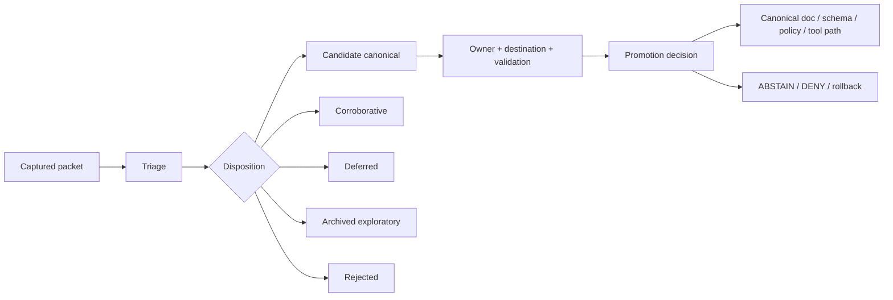

<!-- [KFM_META_BLOCK_V2]
doc_id: kfm://doc/NEEDS-VERIFICATION
title: New Ideas Index
type: standard
version: v1.9
status: draft; repository-grounded; intake-only
owner: OWNER_TBD
created: 2026-05-16
updated: 2026-08-03
policy_label: public
related: [docs/doctrine/directory-rules.md, docs/intake/README.md, docs/intake/new-ideas-register.md, docs/intake/exploratory/new-ideas-4-13-source-map.md, docs/intake/exploratory/new-ideas-4-14-source-map.md, docs/intake/exploratory/new-ideas-4-15-source-map.md, docs/intake/exploratory/new-ideas-4-16-source-map.md, docs/intake/exploratory/new-ideas-4-23-source-map.md, docs/intake/exploratory/new-ideas-4-25-source-map.md, docs/intake/exploratory/new-ideas-4-30-source-map.md, docs/intake/exploratory/new-ideas-5-source-map.md, docs/intake/exploratory/spatiotemporal-modernization-blueprint-source-map.md, docs/intake/exploratory/tile-artifact-manifest-pmtiles-profile-source-map.md, docs/registers/DRIFT_REGISTER.md, docs/registers/VERIFICATION_BACKLOG.md]
tags: [kfm, intake, new-ideas, documentation-control, governance]
notes: [Repository presence and sibling register verified through remote main 83cca9c66a1eb218f010a75b862d417d429c3c85; New Ideas 4-13-26, 4-14-26, 4-15-26, 4-16-26, 4-23-26, 4-25-26, 4-30-26, New Ideas 5, and the spatiotemporal modernization blueprint source identities and bounded triage maps added; a bounded partial triage of the New Ideas 5-15-26 PMTiles subset is registered; the 4-14 and 4-15 packets are also prior Pass 23 lineage; source packets remain EXPLORATORY until triaged and promoted; no packet is promoted by this file.]
[/KFM_META_BLOCK_V2] -->

# New Ideas Index

A governed intake index for dated KFM “New Ideas” packets, preserving useful design pressure without turning exploratory notes into canon or implementation proof.

> [!IMPORTANT]
> **Status:** draft / repository-grounded / intake-only
> **Path:** `docs/intake/NEW_IDEAS_INDEX.md`  
> **Owner:** `OWNER_TBD`  
> **Truth posture:** CONFIRMED repository path and sibling intake surfaces through remote `main@83cca9c66a1eb218f010a75b862d417d429c3c85` / EXPLORATORY packet content / no promotion authority

> [!NOTE]
> This file is an intake control surface. It records packet presence, themes, routing pressure, blockers, and next verification moves. It does **not** prove that proposed paths, tools, schemas, policies, workflows, or services exist in the repository.

## Quick navigation

- [Purpose](#purpose)
- [Repo fit](#repo-fit)
- [Operating law](#operating-law)
- [Intake record requirements](#intake-record-requirements)
- [Current packet register](#current-packet-register)
- [Intake taxonomy](#intake-taxonomy)
- [Intake statuses](#intake-statuses)
- [Promotion criteria](#promotion-criteria)
- [Maintenance workflow](#maintenance-workflow)
- [Verification checklist](#verification-checklist)
- [Rollback](#rollback)
- [Appendix: triage record template](#appendix-triage-record-template)
- [Appendix: packet cards](#appendix-packet-cards)

## Purpose

The “New Ideas” stream is a high-value source of implementation pressure, source-refresh signals, policy sketches, object-family proposals, and UI/runtime hardening ideas. It is also easy to overread.

This index keeps that stream useful by recording each packet as intake material first, then routing specific ideas toward a governed destination only after evidence, ownership, rights, sensitivity, validation, and rollback requirements are clear.

This file does **not** make any packet authoritative. It does **not** prove that proposed paths, tools, policies, schemas, workflows, or services exist in the repository. It is an intake control surface.

## Repo fit

| Field | Value |
| --- | --- |
| Intended home | `docs/intake/NEW_IDEAS_INDEX.md` |
| Placement status | CONFIRMED present at `main@5266ba5f2d8f39cad2d54b066d514be8ca8eb3b7`; content remains draft and non-authoritative. |
| Responsibility root | `docs/` — documentation control, human-readable intake navigation, and governance orientation. |
| Directory Rules basis | A human-readable intake index belongs under `docs/`; downstream implementation artifacts stay under their owning roots. Domain names appear as segments inside responsibility roots, not as new repo roots. |
| Intake lane role | Capture and classify exploratory packets before promotion. |
| Upstream doctrine | Directory Rules, documentation architecture passes, KFM truth posture, trust membrane, lifecycle law. |
| Index/register relationship | Both this file and `docs/intake/new-ideas-register.md` are CONFIRMED present. This file is the packet landing index; the sibling register carries detailed triage records. Neither may evolve into packet authority. |

### Candidate downstream homes

Use destination roots by responsibility, not by topic convenience.

| Candidate output | Owning root | Placement rule |
| --- | --- | --- |
| Doctrine or governance wording | `docs/doctrine/` | Human-readable doctrine; path remains PROPOSED until repo inspection. |
| Source notes and source authority summaries | `docs/sources/` and `data/registry/` | Docs explain source posture; registry records source identity, rights, roles, and access constraints. |
| Domain narrative and lane architecture | `docs/domains/<domain>/` | Domain belongs as a segment inside `docs/`, not as a new root. |
| Object meaning | `contracts/` | Use for semantic contract language when verified. |
| Machine shape | `schemas/contracts/v1/` | Use for JSON Schema / machine-readable shape after schema-home verification. |
| Allow / deny / restrict / abstain logic | `policy/` | Policy rules must not live in this index. |
| Pipeline logic and watcher flow | `pipelines/` or `pipeline_specs/` | Executable logic and declarative specs remain separate. |
| Validators, probes, generators, builders | `tools/` | Repo-wide tooling belongs under tools after convention checks. |
| Tests and fixtures | `tests/`, `fixtures/` | Proof of enforceability and sample data are not intake notes. |
| Release decisions, manifests, rollback, corrections | `release/` | Publication remains a governed state transition. |

### Accepted inputs

This index accepts:

- dated “New Ideas” packets, notes, PDFs, docs, or text files;
- packet summaries and one-sentence intake notes;
- source IDs, hashes, dates, owners, and status labels;
- triage category assignments;
- links to candidate canonical destinations;
- verification backlog items that prevent promotion.

### Exclusions

This index must not store:

- canonical policy rules — use `policy/` and policy docs;
- schema definitions — use the repo’s accepted schema home, defaulting to `schemas/contracts/v1/` only after verification;
- contract semantics — use `contracts/` or accepted contract docs;
- source registry records — use `data/registry/` and source descriptors;
- emitted receipts, proofs, manifests, or release objects — use the appropriate lifecycle/proof homes;
- sensitive exact locations, private source credentials, raw data, unpublished EvidenceBundle contents, or unreviewed public-release claims.

## Operating law

New Ideas packets are **EXPLORATORY** until a governed decision changes their status. Duplicates and repeated suggestions can corroborate direction, but they do not become independent authority votes.


```mermaid
flowchart LR
    A[Captured packet] --> B[Triage]
    B --> C{Disposition}
    C --> D[Candidate canonical]
    C --> E[Corroborative]
    C --> F[Deferred]
    C --> G[Archived exploratory]
    C --> H[Rejected]
    D --> I[Owner + destination + validation]
    I --> J[Promotion decision]
    J --> K[Canonical doc / schema / policy / tool path]
    J --> L[ABSTAIN / DENY / rollback]
```

A packet may sharpen a future build, but it must not bypass KFM’s trust membrane:

```text
RAW -> WORK / QUARANTINE -> PROCESSED -> CATALOG / TRIPLET -> PUBLISHED
```

Publication remains a governed state transition. Map tiles, PMTiles, COGs, graph projections, vector indexes, generated summaries, Focus Mode answers, screenshots, and Story Nodes remain downstream carriers, not sovereign truth.

### Non-authority rule

A row in this file means:

```text
packet observed -> theme captured -> routing pressure recorded -> blockers named
```

It does **not** mean:

```text
implementation exists -> policy is active -> schema is canonical -> public release is allowed
```

## Intake record requirements

Each packet should be tracked with enough information to support later review without forcing a promotion decision.

| Required field | Why it matters | Placeholder when unknown |
| --- | --- | --- |
| Intake ID | Keeps packet identity stable across triage passes. | `NIP-YYYY-MM-DD[-suffix]` |
| Source packet | Allows retrieval of the original packet. | `SOURCE_PACKET_TBD` |
| Date signal | Distinguishes filename dates, creation dates, and content dates. | `DATE_SIGNAL_TBD` |
| Source ID / hash | Supports deduplication and source ledger linkage. | `SOURCE_ID_TBD`; `HASH_TBD` |
| Current status | Prevents exploratory content from masquerading as canon. | `CAPTURED / EXPLORATORY` |
| Main themes | Preserves design pressure without copying full packet contents. | `THEMES_TBD` |
| Candidate destinations | Identifies routing pressure while keeping paths PROPOSED. | `PATH_TBD_AFTER_REPO_INSPECTION` |
| Blocking checks | Makes rights, sensitivity, source-role, owner, and repo gaps visible. | `NEEDS VERIFICATION: <specific check>` |
| Decision record | Links later promotion, rejection, or archive action. | `DECISION_RECORD_TBD` |

## Current packet register

This table records only the packet sources visible or directly retrieved in this session. It is not a complete historical inventory.

| Intake ID | Source packet | Date signal | Current status | Main themes | Candidate destinations | Blocking checks |
| --- | --- | --- | --- | --- | --- | --- |
| `NIP-2026-05-08` | `New Ideas 5-8-26.pdf` | Filename date | CAPTURED / EXPLORATORY | Ecology tile gating; MAIAC AOD, FIRMS, SMAP, AirNow, Mesonet; watcher `DecisionEnvelope`; `RunReceipt`; PMTiles sidecars; MapLibre/Cesium verification; no-network proof slice; DSSE/cosign; policy hooks. | `docs/domains/ecology/`, `docs/sources/`, `policy/ecology/`, `schemas/contracts/v1/governance/`, `tools/ci/probes/`, `tools/smoke/`, `release/` after verification. | Verify source rights, API/key requirements, external product facts, Mesonet consent posture, thresholds as policy not science absolutes, and repo path conventions. |
| `NIP-2026-05-10` | `New Ideas 5-10-26.pdf` | Filename date | CAPTURED / EXPLORATORY | PMTiles operational hardening; versioned artifacts; sidecar + Bao/BLAKE3 proofs; DSSE/cosign/Rekor; OCI/ORAS publication; fail-closed CI gate; MapLibre performance testing; automation starter pack; promotion/rollback rehearsal. | `tools/attest/`, `tools/validators/`, `schemas/contracts/v1/artifacts/`, `.github/workflows/`, `release/`, `docs/architecture/map/`, `docs/runbooks/` after repo verification. | Verify current tool versions and licenses, package availability, OCI/referrer support, schema-home authority, workflow conventions, public-safe artifact exposure, and rollback evidence. |
| `NIP-2026-05-15-pmtiles-declared-manifest` | `New Ideas 5-15-26.pdf` | Filename date | TRIAGED / EXPLORATORY; bounded non-canonical slice implemented | Small tile-artifact descriptor; byte size; SHA-256; `spec_hash`; generation/input declarations; negative fixtures; remote-change, receipt, Bao, and DSSE proposals. | Detailed routing in [`exploratory/tile-artifact-manifest-pmtiles-profile-source-map.md`](exploratory/tile-artifact-manifest-pmtiles-profile-source-map.md); bounded offline implementation uses the existing PMTiles validator, fixture, test, contract, and standard homes. | Canonical schema family, source/generator attestation, artifact-registry resolution, compression/client compatibility, cryptography, policy, release, and publication remain held. |
| `NIP-2026-04-13-promotion-proof` | `New Ideas 4-13-26.pdf` | Source date confirmed by filename and PDF title | TRIAGED / EXPLORATORY; bounded slice implemented | Promotion proof; receipt/manifest integrity; A-G gate grammar; finite outcomes; review separation; correction and rollback; signing/publishing proposals. | Detailed routing in [`exploratory/new-ideas-4-13-source-map.md`](exploratory/new-ideas-4-13-source-map.md); bounded offline behavior implemented under existing validator, fixture, test, and workflow homes. | Keep `PASS` review-ready only. Authenticate evidence, policy, attestations, catalogs, actors, and rollback separately; do not carry over packet network installs, write permissions, paths, or publication automation. |
| `NIP-2026-04-14-verification-conflict` | `New Ideas 4-14-26.pdf` | Source date confirmed by filename and PDF title | TRIAGED / EXPLORATORY / PASS-23-LINEAGE | Watcher/policy/hydrology carry-forward; bitemporal verification replay; source-conflict influence; cross-layer outcome parity; verifier portability; observed interface evolution. | Detailed routing in [`exploratory/new-ideas-4-14-source-map.md`](exploratory/new-ideas-4-14-source-map.md); five contributed triads in [`../kfm_full_atlas_seed_cards.md`](../kfm_full_atlas_seed_cards.md); downstream artifacts remain candidate-only. | Do not duplicate Pass 23 watcher, hydro, promotion, signing, runtime, or release cards. Resolve temporal, conflict, projection, verifier, and interface semantics before implementation; keep peer-renderer code excluded. |
| `NIP-2026-04-15-quality-proof-interface` | `New Ideas 4-15-26.pdf` | Source date confirmed by filename and PDF title | TRIAGED / EXPLORATORY / PASS-23-LINEAGE | Soil/runtime carry-forward; cross-layer outcome parity; verifier portability; source-native quality and health separation; generated runtime-proof lifecycle; observed interface evolution. | Detailed routing in [`exploratory/new-ideas-4-15-source-map.md`](exploratory/new-ideas-4-15-source-map.md); five contributed triads in [`../kfm_full_atlas_seed_cards.md`](../kfm_full_atlas_seed_cards.md); downstream artifacts remain candidate-only. | Do not duplicate Pass 23 soil/runtime/API work or copy source, consent, threshold, route, workflow, or peer-renderer code. Resolve quality mapping, proof-artifact, parity, verifier, and interface semantics first. |
| `NIP-2026-04-16-governed-baselines` | `New Ideas 4-16-26(1).pdf` | Source date confirmed by filename and PDF title | TRIAGED / EXPLORATORY | Fauna/soil governed ingest; vegetation/hydrology baselines; air-quality anomaly lifecycle; consent/revocation; MapLibre time buckets; PMTiles verification; STAC conformance; historical post-office/trail networks. | Detailed routing in [`exploratory/new-ideas-4-16-source-map.md`](exploratory/new-ideas-4-16-source-map.md); ten gap-fill triads in [`../kfm_full_atlas_seed_cards.md`](../kfm_full_atlas_seed_cards.md); downstream artifacts remain candidate-only. | Do not copy packet paths or code. Reuse existing domain lanes; resolve canonical hash profiles, materiality, baseline/event semantics, consent placement, STAC profile, source authority/rights, and exact bounded authorization per candidate. |
| `NIP-2026-04-23-evidence-custody-composition` | `New Ideas 4-23-26.pdf` | Source date confirmed by filename and PDF title | TRIAGED / EXPLORATORY | Cross-boundary evidence custody; composed-claim closure; trust-root history; replay-safe event effects; conditional review obligations; catalog, hydrology, ecology, and consent corroboration. | Detailed routing in [`exploratory/new-ideas-4-23-source-map.md`](exploratory/new-ideas-4-23-source-map.md); five gap-fill triads in [`../kfm_full_atlas_seed_cards.md`](../kfm_full_atlas_seed_cards.md); downstream artifacts remain candidate-only. | Do not copy packet evidence stacks, key-service recipes, event actions, or publication paths. Resolve dependency roles, trust authority, idempotent effect boundaries, obligation closure, and exact authorization per candidate. |
| `NIP-2026-04-25-identity-authority-assurance` | `New Ideas 4-25-26.pdf` | Source date confirmed by filename and PDF title | TRIAGED / EXPLORATORY | Reversible entity reconciliation; taxonomic concepts and name usage; temporal place-name authority; PLSS/GLO survey-control provenance; validator mutation adequacy. | Detailed routing in [`exploratory/new-ideas-4-25-source-map.md`](exploratory/new-ideas-4-25-source-map.md); five gap-fill triads in [`../kfm_full_atlas_seed_cards.md`](../kfm_full_atlas_seed_cards.md); downstream artifacts remain candidate-only. | Do not copy loaders, authority ranks, PLSS/GNIS overclaims, thresholds, network installs, sensitive examples, or AI promotion recipes. Resolve identity, role separation, derivation limits, assurance meaning, and exact authorization per candidate. |
| `NIP-2026-04-30-retrieval-offline-trust` | `New Ideas 4-30-26.pdf` | Source date confirmed by filename and PDF title | TRIAGED / EXPLORATORY | USDA PLANTS, eBird, GBIF, soil/air fusion, source terms, query provenance, sampling/non-detection, PMTiles/offline delivery, verified rendering, STAC/validators, vegetation confounders, and source cadence/latency. | Detailed routing in [`exploratory/new-ideas-4-30-source-map.md`](exploratory/new-ideas-4-30-source-map.md); eleven gap-fill triads in [`../kfm_full_atlas_seed_cards.md`](../kfm_full_atlas_seed_cards.md); downstream artifacts remain candidate-only. | Do not copy packet code, paths, credentials, thresholds, cloud examples, or dated external claims. Resolve retrieval, rights, distribution, support, latency, transfer, offline-trust, and renderer-budget semantics before implementation. |
| `NIP-2026-07-29-new-ideas-5` | `New Ideas 5.pdf` | Capture date only; source date `NEEDS VERIFICATION` | TRIAGED / EXPLORATORY | Dual-renderer Story Node; STAC/catalog QA; signing and provenance; NWIS watcher; pipeline resilience; atmosphere fusion; soil/geology conversion; reproducible models; graph/AI retrieval; license automation. | Detailed routing in [`exploratory/new-ideas-5-source-map.md`](exploratory/new-ideas-5-source-map.md); downstream candidates remain under existing ADR, contract, schema, policy, tool, pipeline, source, domain, data, and release roots. | Do not copy packet paths or code. Resolve renderer ADR, catalog profile/placeholder, external source facts, rights, dependency approval, contract/policy/test consequences, and exact bounded authorization per candidate. |
| `NIP-2026-07-30-spatiotemporal-modernization` | `Architectural Modernization and Governance Blueprint for the Kansas Frontier Matrix` (`Pasted text(32).txt`) | Capture date only; source date `NEEDS VERIFICATION` | TRIAGED / EXPLORATORY | GeoParquet version readiness and optimization; STAC GeoParquet bulk mirrors; receipt-backed lifecycle transitions; PMTiles range hosting and cache fallback; MapLibre performance envelopes; source-role discipline; documentation and CI validation. | Detailed routing in [`exploratory/spatiotemporal-modernization-blueprint-source-map.md`](exploratory/spatiotemporal-modernization-blueprint-source-map.md); downstream candidates remain under existing standards, ADR, catalog, lifecycle, renderer, deployment, source, validation, and release responsibilities. | Do not adopt GeoParquet 2.0, fixed row-group/grid constants, a bbox rule, Cloudflare topology, whole-file cache, dependency, source fact, or performance guarantee from the packet. Resolve upstream stability, compatibility, benchmark, catalog-closure, hosting, correction, and rollback semantics first. |

### Known lineage backlog to inventory

Prior source ledgers and documentation architecture passes refer to earlier New Ideas packets from February, March, and April 2026. Those packets should be inventoried in a separate pass before this file is treated as complete.

| Family | Status | Why it is not fully indexed here | Required next step |
| --- | --- | --- | --- |
| February 2026 New Ideas docs | NEEDS VERIFICATION | Some related files were discoverable as prior uploads, but not all are present in the visible `/mnt/data` workspace. | Confirm packet filenames, hashes, dates, duplicates, source IDs, and promotion status. |
| March 2026 New Ideas packets | NEEDS VERIFICATION | Prior reports list multiple March packets as EXPLORATORY lineage. | Inventory packets and add one row per dated source. |
| April 2026 New Ideas packets | PARTIAL | `New Ideas 4-13-26.pdf`, `New Ideas 4-14-26.pdf`, `New Ideas 4-15-26.pdf`, `New Ideas 4-16-26(1).pdf`, `New Ideas 4-23-26.pdf`, `New Ideas 4-25-26.pdf`, and `New Ideas 4-30-26.pdf` are identity-pinned and triaged; 4-14 and 4-15 are also reconciled with Pass 23 lineage. Other April packets and Part 2 variants remain outside these rows. | Inventory the remaining April packets, de-duplicate them against all seven April source maps and prior pass carriers, and preserve one row per distinct source. |

## Intake taxonomy

Use the narrowest truthful category. A packet can produce multiple extracted ideas, each with its own category.

| Intake category | Definition | Typical examples | Default destination after triage |
| --- | --- | --- | --- |
| Doctrine candidate | Refines governing law, terminology, or truth posture. | Better cite-or-abstain wording; authority rule refinement. | `docs/doctrine/` |
| Source refresh | Adds or updates current source/service knowledge. | New official source endpoint; API behavior; licensing change. | `docs/sources/` + source registry |
| Schema / contract proposal | Crystallizes an object family or lifecycle seam. | `RunReceipt`, `EvidenceBundle`, `DecisionEnvelope`, PMTiles sidecar. | `contracts/` for meaning + `schemas/contracts/v1/` for shape after ADR and repo checks. |
| Policy / gate proposal | Refines allow/deny/abstain or release logic. | Promotion gate; AI citation rule; sensitive geometry deny rule. | `policy/` + runbook + tests |
| Workflow / automation proposal | Proposes a governed process change. | Watcher flow; CI gate; artifact signing lane; packaging flow. | `pipelines/`, `pipeline_specs/`, `tools/`, runbooks |
| UI / shell proposal | Refines Evidence Drawer, shell state, Focus Mode, or map interaction. | Drawer payloads; trust badges; route grouping; preview renderer. | `docs/architecture/`, UI docs, component README after repo verification. |
| Data / domain expansion | Expands a lane or sequencing burden. | Hydrology watcher; soils lane; biodiversity extension; hazards context. | `docs/domains/` + source descriptors |
| Implementation note | Narrow operational detail. | Normalization rule; naming rule; sharding convention. | Local package README or runbook |
| Duplicate / corroborative | Repeats accepted direction without a new destination. | Repeated PMTiles attestation note. | Register cross-reference only |
| Lineage-only | Historically useful, no active action. | Older pass variant; superseded sketch. | Archive / lineage location |
| Repo-verification candidate | Claims that need direct repo proof. | “Workflow YAML exists”; “validator already enforced.” | Verification backlog |

## Intake statuses

| Status | Meaning | Next allowed move |
| --- | --- | --- |
| CAPTURED | Stored with date, family, short summary, and source reference. | TRIAGED |
| TRIAGED | Classified and linked to one or more categories. | Candidate canonical, corroborative, deferred, archived, or rejected. |
| CANDIDATE CANONICAL | Fits doctrine and has one clear destination. | Promote only with owner, validation, and rollback target. |
| CORROBORATIVE | Adds support but no new canonical destination. | Cross-reference only. |
| DEFERRED | Useful later, but depends on upstream proof. | Keep on backlog. |
| ARCHIVED EXPLORATORY | Preserved but not active. | Archive and link forward. |
| REJECTED | Contradicts doctrine, exposes unacceptable risk, or overclaims without value. | Archive with rationale. |

### Status transition guardrails

- Do not move directly from `CAPTURED` to `CANDIDATE CANONICAL` without triage.
- Do not mark a packet `CANDIDATE CANONICAL` unless it has one clear owning destination or an ADR-backed split.
- Do not mark a packet `REJECTED` without a rationale that can be reviewed later.
- Do not treat `CORROBORATIVE` duplicates as independent authority votes.
- Do not treat `ARCHIVED EXPLORATORY` as deletion; keep lineage visible enough to audit.

## Promotion criteria

An idea may be promoted only when all of the following are true:

- [ ] It fits KFM’s inspectable-claim, evidence-first, map-first, time-aware, policy-aware doctrine.
- [ ] It has exactly one proposed canonical destination, or an ADR explains why the destination is split.
- [ ] It has an owner or steward for review.
- [ ] It does not create parallel schema, contract, policy, release, proof, receipt, source, or registry authority.
- [ ] Rights, terms, source role, sensitivity, cadence, and access constraints are verified where relevant.
- [ ] Implementation claims are verified against repo files, tests, workflows, logs, emitted artifacts, or runtime evidence.
- [ ] Any public or semi-public exposure has EvidenceBundle support, policy decision, review state, release state, correction path, and rollback target appropriate to significance.
- [ ] Negative outcomes remain available: `ABSTAIN`, `DENY`, or `ERROR` instead of forced publication.

## Maintenance workflow

1. **Capture** the packet with filename, date signal, source ID, hash if available, and short summary.
2. **Classify** each extractable idea using the intake taxonomy.
3. **De-duplicate** against previous packets and mark corroborative repeats.
4. **Assign candidate destinations** without creating parallel authority.
5. **Verify blockers**: repo path, owner, source rights, sensitivity, current external facts, schema-home authority, tests, and rollback.
6. **Promote or abstain** through a visible decision record.
7. **Archive** lineage material after canonical deltas are absorbed or rejected.
8. **Update this index** whenever packet status, destination, or verification state changes.

## Verification checklist

- [ ] Confirm the real repository contains or should create `docs/intake/`.
- [ ] Confirm whether repo naming prefers `NEW_IDEAS_INDEX.md`, `new-ideas-index.md`, or `new-ideas-register.md`.
- [ ] Check for an existing `docs/intake/new-ideas-register.md` before creating a sibling register.
- [ ] Decide whether this file is the landing page, the register, or a companion to `docs/intake/new-ideas-register.md`.
- [ ] Assign `OWNER_TBD` to a real docs steward or intake owner.
- [ ] Add stable source IDs and hashes for every packet.
- [ ] Verify whether earlier February–April packets are present, duplicated, superseded, or already promoted.
- [ ] Recheck all version-sensitive external claims before source activation or implementation.
- [ ] Confirm no sensitive exact locations, credentials, unpublished policy state, or restricted EvidenceBundle contents are copied into public docs.
- [ ] Confirm candidate paths against Directory Rules and mounted repo evidence before using them in PRs.
- [ ] Add tests or lint checks if this index becomes machine-read or CI-gated.

## Rollback

Rollback is required if this index:

- upgrades an EXPLORATORY packet into authority without promotion;
- creates a path or naming conflict with mounted repo convention;
- leaks sensitive, restricted, rights-uncertain, or unpublished material;
- creates parallel schema, contract, policy, source, release, proof, receipt, or registry homes;
- claims implementation depth that was not verified.

Rollback target: restore the previous committed version of `docs/intake/NEW_IDEAS_INDEX.md`, then add a drift or correction entry explaining the reverted claim.

## Appendix: triage record template

Use this template when a packet is ready for more detailed triage. Keep examples illustrative; do not fill unknown fields by guessing.

```markdown
### NIP-YYYY-MM-DD[-slug]

| Field | Value |
| --- | --- |
| Intake ID | `NIP-YYYY-MM-DD[-slug]` |
| Source packet | `SOURCE_PACKET_TBD` |
| Source ID / hash | `SOURCE_ID_TBD`; `HASH_TBD` |
| Date signal | `DATE_SIGNAL_TBD` |
| Current status | `CAPTURED / EXPLORATORY` |
| Owner / steward | `OWNER_TBD` |
| Candidate destination | `PATH_TBD_AFTER_REPO_INSPECTION` |
| Decision record | `DECISION_RECORD_TBD` |

#### Captured themes

- Theme 1.
- Theme 2.

#### Blocking checks

- NEEDS VERIFICATION: source rights and access terms.
- NEEDS VERIFICATION: repo path convention and adjacent docs.
- NEEDS VERIFICATION: schema-home, policy-home, and test-home authority.

#### Proposed disposition

`TRIAGED | CANDIDATE CANONICAL | CORROBORATIVE | DEFERRED | ARCHIVED EXPLORATORY | REJECTED`

#### Review note

Explain why the disposition is safe, reversible, and bounded.
```

## Appendix: packet cards

<details>
<summary><strong>NIP-2026-04-13-promotion-proof - bounded A-G promotion readiness</strong></summary>

### Source

`New Ideas 4-13-26.pdf`

- SHA-256: `7289fad4b6fded40cb58c8ffa7d8c051f6004f6c2720d9eb2c52c20f232f78f2`
- Pages: `462`
- Bytes: `4,444,054`
- Source date: `2026-04-13`
- Detailed review: [`exploratory/new-ideas-4-13-source-map.md`](exploratory/new-ideas-4-13-source-map.md)

### Disposition

- `TRIAGED / EXPLORATORY`; one bounded implementation slice exists.
- Retained: fail-closed A-G candidate checks, receipt/manifest integrity, finite outcomes, review separation, rollback/correction linkage, and deterministic synthetic tests.
- Rejected as direct transfer: packet paths and schemas, `PROMOTE` authority, network installs, signing-service claims, write-capable CI, hard-coded facts, and publication automation.
- Implemented boundary: a `PASS` is `APPROVE_READY` only and emits no PromotionDecision, review record, receipt, proof, release, or public artifact.
- Remaining: evidence/catalog/attestation resolution, policy execution, accountable review, signing, candidate assembly, rollback execution, and release authority are `PROPOSED` or `NEEDS VERIFICATION`.

</details>

<details>
<summary><strong>NIP-2026-04-14-verification-conflict - verification history, source conflict, parity, and interface evolution</strong></summary>

### Source

`New Ideas 4-14-26.pdf`

- SHA-256: `432c5930b66fac814b21680c60015cff2eb286520ec01211bef69c0c78117f3e`
- Pages: `410`
- Bytes: `3,029,468`
- Source date: `2026-04-14`
- Capture and triage date: `2026-07-29`
- Prior lineage: Pass 23 `SRC-P23-003`
- Detailed review: [`exploratory/new-ideas-4-14-source-map.md`](exploratory/new-ideas-4-14-source-map.md)

### Captured themes

- USGS/Mesonet watcher, deterministic observations, policy, receipts, signing, and promotion.
- NHDPlus permanent identifiers, legacy COMID compatibility, HUC12 context, and join receipts.
- Finite runtime outcomes, corrections, releases, rollback, CLI/package/SBOM delivery, and browser verification.
- Evidence timeline, correction graph, multi-source conflict, and source influence.

### Triage notes

Pass 23 already carried the packet's watcher, hydrology, runtime, policy, signing, release, and soil-adjacent breadth. The retained delta is connective: bitemporal verification-state replay, explicit conflict topology and influence, cross-layer outcome projection, verifier capability portability, and a common observed-interface compatibility window.

Placeholder proof, direct dataset publication, source activation, generic paths, package/workflow recipes, browser verifier stubs, signature-as-truth, source-count consensus, and Cesium hooks are not carried forward.

### Candidate next extraction

Define a contract-only bitemporal verification-state record with synthetic active, superseded, corrected, revoked, late-recorded, and unknown-history fixtures. No live source, key, policy bundle, release, or publication.

</details>

<details>
<summary><strong>NIP-2026-04-15-quality-proof-interface - quality translation, generated proof, parity, and interface evolution</strong></summary>

### Source

`New Ideas 4-15-26.pdf`

- SHA-256: `fb3af560b6698f41d3b75aa7bffe96be07aeb2ba2fb356219886ceda7eea2111`
- Pages: `435`
- Bytes: `4,077,386`
- Source date: `2026-04-15`
- Capture and triage date: `2026-07-29`
- Prior lineage: Pass 23 `SRC-P23-004`
- Detailed review: [`exploratory/new-ideas-4-15-source-map.md`](exploratory/new-ideas-4-15-source-map.md)

### Captured themes

- Soil-moisture source inventory, station metadata, normalization, quality, health, validators, runtime/API, and proof.
- HLS/NDVI/STAC change detection, people/place authority, genealogy/DNA consent, and correction.
- Time-aware MapLibre metadata, Cesium proposal, STAC watcher, and generic contract/runtime waves.
- Hybrid generated-artifact policy: runtime actuals by default, explicitly reviewed golden promotion only.

### Triage notes

Pass 23 and current domain lanes already carry most soil, source, runtime, API, STAC, consent, MapLibre, evidence, and release scaffolding. The retained delta is connective: native-quality translation with operational-health separation, generated runtime-proof artifact lifecycle, cross-layer outcome parity, verifier portability, and observed-interface evolution.

Live source code, hard-coded thresholds, sensitive people/DNA examples, automatic golden replacement, generic paths, workflow recipes, and Cesium integration are not carried forward.

### Candidate next extraction

Define a contract-only generated runtime-proof artifact record with synthetic ephemeral, retained-for-review, promoted-golden, stale, invalidated, and deleted states. No source activation, sensitive payload, runtime authority, or publication.

</details>

<details>
<summary><strong>NIP-2026-04-16-governed-baselines - governed baselines, correction seams, and time-aware carriers</strong></summary>

### Source

`New Ideas 4-16-26(1).pdf`

- SHA-256: `73e10e3c75c1f3cbbd49641b33bddfde93895b85c7562af3dbe161cf2d4c6c16`
- Pages: `110`
- Bytes: `1,224,493`
- Source date: `2026-04-16`
- Capture and triage date: `2026-07-29`
- Detailed review: [`exploratory/new-ideas-4-16-source-map.md`](exploratory/new-ideas-4-16-source-map.md)

### Captured themes

- Governed fauna and soil intake with source identifiers, sensitivity, receipts, finite outcomes, and release proof.
- Versioned vegetation, hydrology, and air-quality baselines with explicit change and correction pressure.
- AQS historical authority separated from provisional AirNow signal, HMS interpretation, and HRRR forecast context.
- Consent-first GEDCOM/DNA import, purpose-bound permission, pseudonymization, revocation, and cache cleanup.
- MapLibre time filtering, epoch-bucket manifests, worker preparation, and visible temporal context.
- PMTiles structural verification and signed bytes kept separate from evidence and release authority.
- STAC profile, link-closure, and deterministic API behavior.
- Historical post-office and trail overlays with location precision and valid-time caveats.

### Triage notes

Most paste-ready fauna, soil, receipt, PMTiles, consent, and catalog material overlaps existing repository surfaces and should not be copied. The useful delta is connective: material-change decisions, baseline cohorts, source-role corroboration, correction states, purpose-bound revocation propagation, governed time buckets, STAC link closure, historical proximity semantics, and declared canonical hash profiles.

The packet's Cesium implementation is not carried forward. Only renderer-neutral time-availability ideas survive, pending accepted renderer authority.

### Candidate next extraction

Implement the repository's already-recorded deterministic `stable_diff.py` slice with synthetic same/changed/malformed fixtures. Keep it non-authoritative; use a later contract to decide materiality.

</details>

<details>
<summary><strong>NIP-2026-04-23-evidence-custody-composition - custody, composed claims, trust history, replay, and obligations</strong></summary>

### Source

`New Ideas 4-23-26.pdf`

- SHA-256: `76ace3bc49dbfa92aa8d48bd3bcac0871b1b1da8c91006d7ac6a318f0cacfc2d`
- Pages: `652`
- Bytes: `5,902,114`
- Source date: `2026-04-23`
- Capture and triage date: `2026-07-29`
- Detailed review: [`exploratory/new-ideas-4-23-source-map.md`](exploratory/new-ideas-4-23-source-map.md)

### Captured themes

- Deterministic ETL, environment handoffs, run receipts, quarantine, retry, and reconciliation.
- Evidence contracts, runtime resolution, composed claims, catalog closure, proof, signing, and correction.
- Trust roots, key rotation, revocation, historical verification, and signed decisions.
- Hydrology reach identity, spatial ambiguity, permanence, and source roles.
- Deterministic event envelopes, replay, evaluator decisions, and approval obligations.
- Flora/habitat events, consent, revocation, and protected-location posture.

### Triage notes

Most packet evidence, catalog, hydrology, signing, consent, and release objects overlap stronger repository surfaces. The durable additions are cross-cutting seams: sender/receiver custody reconciliation, composed-claim dependency roles, trust-root history, event-to-effect idempotence, and evidence-backed obligation closure.

Packet key-service recipes, shallow canonicalization, ETag-as-identity, direct side effects, approve-with-obligation shortcuts, and publication flows are not carried forward.

### Candidate next extraction

Define a contract-only composed-claim dependency profile with synthetic `required`, `optional`, `one_of`, `excluded`, `missing`, `denied`, and `contradictory` evidence. No keys, live sources, event infrastructure, or publication.

</details>

<details>
<summary><strong>NIP-2026-04-25-identity-authority-assurance - reversible identity, authority roles, survey provenance, and validator assurance</strong></summary>

### Source

`New Ideas 4-25-26.pdf`

- SHA-256: `47983cd76db4d3c0e971c61d6259f80f32ca861091d7f65020ad94c09ce76061`
- Pages: `337`
- Bytes: `4,581,310`
- Source date: `2026-04-25`
- Capture and triage date: `2026-07-29`
- Detailed review: [`exploratory/new-ideas-4-25-source-map.md`](exploratory/new-ideas-4-25-source-map.md)

### Captured themes

- Biodiversity and flora ingestion, normalization, deduplication, rights, and sensitivity.
- PLSS/CadNSDI, GLO plats and field notes, survey generations, georeferencing, and residuals.
- Taxonomic sources, identifiers, synonymy, splits, lumps, source roles, and reconciliation.
- GNIS official and variant names, historical aliases, place identity, and role separation.
- Policy testing, property/fuzz testing, mutation testing, and validator adequacy.
- Structured AI output, watchers, consent, revocation, evidence, review, and release.

### Triage notes

Most packet loaders, trust objects, workflows, and consent machinery duplicate existing lanes. The durable additions are reversible match/merge/split decisions, source-native taxonomic concept lineage, time-bounded place-name authority, survey-control-to-derived-boundary provenance, and adversarial validator assurance.

Hard-coded authority ranks, destructive dedupe, scientific-name string identity, GNIS role collapse, PLSS “ground truth” claims, fixed mutation thresholds, unpinned network installs, random sensitive-location jitter, and AI-driven promotion are not carried forward.

### Candidate next extraction

Define a cross-domain taxonomy concept decision packet with synthetic synonym, homonym, split, lump, misapplied-name, unresolved, and reversal fixtures. No live fetch, permanent authority ranking, sensitive record, or public distribution.

</details>

<details>
<summary><strong>NIP-2026-04-30-retrieval-offline-trust - retrieval meaning, environmental support, and offline trust</strong></summary>

### Source

`New Ideas 4-30-26.pdf`

- SHA-256: `3d7585dd43009c14fa7ae9cec864bb0ecc84340d6fa920b67bc53cd1e7adda0b`
- Pages: `289`
- Bytes: `3,246,311`
- Source date: `2026-04-30`
- Capture and triage date: `2026-07-29`
- Detailed review: [`exploratory/new-ideas-4-30-source-map.md`](exploratory/new-ideas-4-30-source-map.md)

### Captured themes

- USDA PLANTS distribution, eBird EBD/SED effort, GBIF asynchronous downloads, source terms, and query predicates.
- Soil-moisture and air-quality fusion across grids, stations, units, cadences, and knowledge characters.
- PMTiles deltas, signed digest batches, mobile resource budgets, offline-first packaging, and verify-before-render behavior.
- HUC12/COMID crosswalks, promotion gates, decision logs, obligations, STAC validation, and canonical hashing.
- County biodiversity work prioritization, sampling bias, vegetation-change confounders, and source delivery latency.

### Triage notes

Most packet code and path trees duplicate stronger repository surfaces. The durable additions are connective: retrieval intent, terms drift, sampling support, distribution-state meaning, exploration-bias controls, measurement reconciliation, availability latency, asynchronous transfer state, offline trust freshness, verified-rendering budgets, and correctable observation fitness.

Cesium/MapLibre overlays, live source activation, hard-coded thresholds, wildcard hosting examples, credentials, and fail-open workflow fragments are not carried forward.

### Candidate next extraction

Define a contract-only `DistributionAssertion` and `CoverageAssessment` slice with synthetic states for `present`, `explicitly_absent`, `not_assessed`, `unknown`, `suppressed`, `stale`, and `missing_row`. No network access, source activation, or publication.

</details>

<details>
<summary><strong>NIP-2026-05-08 — ecology watchers, tile gating, and no-network proof slice</strong></summary>

### Source

`New Ideas 5-8-26.pdf`

### Captured themes

- Ecology and environmental watcher gating using MAIAC AOD, FIRMS, SMAP, AirNow, and Kansas Mesonet concepts.
- Deterministic thresholds and persistence windows for tile state changes.
- `DecisionEnvelope`, `RunReceipt`, and signed provenance expectations.
- PMTiles sidecar verification and public-client fail-closed behavior.
- MapLibre/Cesium verification workflows and no-network proof slice direction.

### Triage notes

This packet has several high-value candidates, but the source facts, licenses, API/key requirements, and operational thresholds need verification before any source activation or public map behavior. Treat thresholds as proposed policy gates, not as scientific absolutes.

### Candidate next extraction

Create a future issue or triage record for: “Ecology watcher gating specification and offline proof slice.”

</details>

<details>
<summary><strong>NIP-2026-05-10 — PMTiles attestation, OCI publication, and fail-closed CI</strong></summary>

### Source

`New Ideas 5-10-26.pdf`

### Captured themes

- PMTiles operational quirks: HTTP Range behavior, cache invalidation, versioned filenames, partitioned artifacts, and client parity.
- Signed sidecar schema using BLAKE3/Bao concepts, DSSE/cosign/Rekor, OCI/ORAS publication, and run receipts.
- Fail-closed CI gates for artifact root integrity, range integrity, publisher attestation, and policy denial.
- MapLibre performance probes and visual regression direction.
- Automation starter pack ideas for watcher-to-promotion flow.

### Triage notes

This packet is strong implementation pressure for an artifact-verification lane, but tool versions, package availability, licensing, registry behavior, and repo workflow paths remain NEEDS VERIFICATION.

### Candidate next extraction

Create a future issue or triage record for: “PMTiles publication attestation verifier and negative-path CI tests.”

</details>

<details>
<summary><strong>NIP-2026-05-15-pmtiles-declared-manifest — bounded local compatibility profile</strong></summary>

### Source

`New Ideas 5-15-26.pdf`

- SHA-256: `64dc1c8793ba64a641b12a092201d1cc4e5ac90ce8cdc4a1d7bd54eaf548cc95`
- Source date: `2026-05-15`, supported by filename
- Detailed review: [`exploratory/tile-artifact-manifest-pmtiles-profile-source-map.md`](exploratory/tile-artifact-manifest-pmtiles-profile-source-map.md)

### Captured themes

- Small deterministic tile-artifact descriptor with filename/ref, byte size,
  SHA-256, normalized build hash, generator, and input declarations.
- Negative fixtures and staged offline validation before live behavior.
- Remote-change checks, receipts, Bao/BLAKE3, DSSE, and signing proposals.

### Triage notes

The bounded implementation is an explicit local PMTiles v3/MVT compatibility
profile. It reconciles named archive/header/metadata fields while retaining
`authority: NONE` and explicit schema, provenance, registry, cryptographic,
policy, and release holds. It does not choose a canonical schema or activate a
network, runtime, release, or publication path.

### Candidate next extraction

Open a governed schema-family decision before any canonical
`TileArtifactManifest` schema, registry binding, signature profile, or release
integration is attempted.

</details>

<details>
<summary><strong>NIP-2026-07-29-new-ideas-5 — multi-cluster implementation pressure</strong></summary>

### Source

`New Ideas 5.pdf`

- SHA-256: `094200ad69f3843d856fce782806f4090c31263567d533d0b425468730d1c91d`
- Pages: `944`
- Bytes: `10,558,510`
- Source authoring date: `NEEDS VERIFICATION`
- Capture and triage date: `2026-07-29`
- Detailed review: [`exploratory/new-ideas-5-source-map.md`](exploratory/new-ideas-5-source-map.md)

### Captured themes

- 3D Story Node and dual-renderer proposal.
- Projection extension mapping and catalog QA.
- Sigstore/cosign, SLSA, SBOM, attestations, and release lineage.
- Hydrology/NWIS watchers and resilient pipeline patterns.
- Atmosphere fusion and sensor/source-role modeling.
- Soil/geology GeoParquet, COG, PMTiles, and deterministic identity.
- Reproducible experiments, graph summaries, and AI retrieval.
- License and dependency checks.

### Triage notes

The packet is broad, internally heterogeneous, and contains implementation-looking paths and code. Current repository evidence shows that several themes are corroborative, several require external verification, and two early proposals are immediately blocked as written:

- the Cesium + MapLibre peer-renderer path requires an ADR-scoped decision and dependency/release burden; and
- the networked catalog quick gate must not bypass unresolved STAC profile, placeholder-record, no-network, and record-versus-closure boundaries.

### Candidate next extraction

Create a separately authorized decision packet for deterministic, record-local STAC readiness after resolving profile ownership and the placeholder `collection.json` disposition. Do not copy the PDF's networked workflow directly.

</details>

<details>
<summary><strong>NIP-2026-07-30-spatiotemporal-modernization - cloud-native spatial formats, delivery, performance, and governance</strong></summary>

### Source

`Pasted text(32).txt`

- Captured title: `Architectural Modernization and Governance Blueprint for the Kansas Frontier Matrix`
- SHA-256: `798d8ee3ab1d99ce92cb04d5e2e69a66c5c89407d1868da350be153c3b9f04a4`
- Lines: `226`
- Bytes: `22,806`
- Source authoring date: `NEEDS VERIFICATION`
- Capture and triage date: `2026-07-30`
- Detailed review: [`exploratory/spatiotemporal-modernization-blueprint-source-map.md`](exploratory/spatiotemporal-modernization-blueprint-source-map.md)

### Captured themes

- GeoParquet 2.0 native logical types, spatial ordering, row groups, compression, statistics, and partitioning.
- STAC GeoParquet as a bulk Item/Collection mirror.
- Receipt-backed lifecycle transitions, evidence closure, cite-or-abstain, and reversible claims.
- PMTiles range delivery, Cloudflare Pages/R2, service-worker caching, and tile-generation tools.
- MapLibre GPU rendering, static/dynamic layer separation, and proposed frame/entity budgets.
- Source-role distinctions across soils, land cover, botany, moisture, hydrography, and planning.
- Markdown modernization levels and CI validation pressure.

### Triage notes

The blueprint is directionally useful but mixes current KFM doctrine, current repository implementation claims, upstream development specifications, deployment choices, and universal performance mandates. Stable GeoParquet remains 1.1.0 in the upstream stable channel; 2.0 is a development-track decision for KFM. Row-group, ordering, partition, cache, hosting, and renderer values require dataset- and device-specific evidence.

Existing KFM lifecycle, evidence, renderer, STAC, PMTiles, source, and documentation responsibilities remain authoritative. No packet tool, vendor, dependency, version, path, fixed threshold, or source summary is promoted.

### Candidate next extraction

Create a separately authorized decision-only GeoParquet version-readiness issue. Inventory current writers/readers/validators/consumers, distinguish stable 1.1.0 from the 2.0 development track, define dual-evaluation and rollback outcomes, and replace fixed layout mandates with a benchmark-profile decision. No data rewrite, source activation, release, deployment, or publication.

</details>

---

Back to top: [New Ideas Index](#new-ideas-index)
