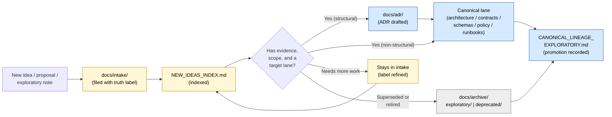
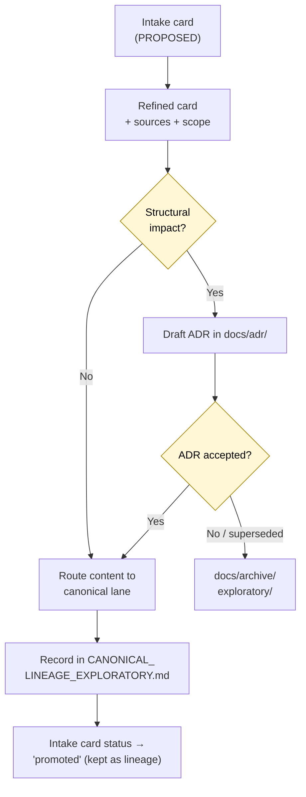

<!-- [KFM_META_BLOCK_V2]
doc_id: kfm://doc/docs-intake-readme
title: Documentation Intake — README
type: standard
version: v1.1
status: draft
owners: <docs steward> (PROPOSED placeholder — confirm via CODEOWNERS)
created: 2026-05-12
updated: 2026-05-16
policy_label: public
related:
  - docs/doctrine/directory-rules.md
  - docs/doctrine/authority-ladder.md
  - docs/doctrine/truth-posture.md
  - docs/doctrine/trust-membrane.md
  - docs/doctrine/lifecycle-law.md
  - docs/registers/CANONICAL_LINEAGE_EXPLORATORY.md
  - docs/registers/DRIFT_REGISTER.md
  - docs/registers/VERIFICATION_BACKLOG.md
  - docs/archive/README.md
  - docs/adr/README.md
tags: [kfm, docs, intake, governance, exploratory, idea-admission]
notes:
  - Path docs/intake/ is CONFIRMED doctrine per Directory Rules §6.1; mounted-repo presence remains UNKNOWN until inspection
  - Contained files IDEA_INTAKE.md and NEW_IDEAS_INDEX.md are PROPOSED until verified in the target repo
  - Owners, CODEOWNERS path, license, badge targets, validators, and review cadence remain NEEDS VERIFICATION
  - v1.1 strengthens evidence boundary, README contract, validation checklist, and no-intake-as-canon guardrails without changing the lane purpose
[/KFM_META_BLOCK_V2] -->

# 📥 Documentation Intake — `docs/intake/`

> The human-facing **front door for ideas, proposals, exploratory packets, and external research notes** that have not yet earned a canonical home in KFM. Its single job is to **preserve evidence and exploration without letting either be cited as canon.**

<!-- Badge row — badge targets are intentionally static until CI, CODEOWNERS, and license endpoints are confirmed -->


| Field | Value |
|---|---|
| **Status** | `draft` (`PROPOSED` README content; repo adoption `UNKNOWN`) |
| **Authority level** | `exploratory` |
| **Target path** | `docs/intake/README.md` *(path named by doctrine; mounted-repo presence NEEDS VERIFICATION)* |
| **Owners** | Docs steward + subsystem owner *(PROPOSED placeholder; confirm via `CODEOWNERS`)* |
| **Last reviewed** | 2026-05-16 *(document revision; repo inspection still required)* |
| **Supersedes** | None |
| **Related doctrine** | [Directory Rules](../doctrine/directory-rules.md) · [Authority Ladder](../doctrine/authority-ladder.md) · [Truth Posture](../doctrine/truth-posture.md) |

> [!NOTE]
> **Evidence boundary.** This README states the intended role and governance posture of `docs/intake/`. It does **not** prove that the folder, files, validators, CODEOWNERS entries, workflows, or review automation exist in a mounted repository. Treat implementation depth as **UNKNOWN** until verified from repo files, tests, workflows, logs, or emitted artifacts.

---

## 🧭 Quick jump

- [1. Scope](#1-scope)
- [2. Repo fit](#2-repo-fit)
- [3. Authority and status labels](#3-authority-and-status-labels)
- [4. What belongs here (inputs)](#4-what-belongs-here-inputs)
- [5. What does NOT belong here (exclusions)](#5-what-does-not-belong-here-exclusions)
- [6. Directory tree](#6-directory-tree)
- [7. The intake → promotion path](#7-the-intake--promotion-path)
- [8. Working with intake (usage)](#8-working-with-intake-usage)
- [9. Idea lifecycle states](#9-idea-lifecycle-states)
- [10. Validation, review, and rollback](#10-validation-review-and-rollback)
- [11. FAQ](#11-faq)
- [12. Related docs and folders](#12-related-docs-and-folders)
- [13. Appendix — templates and references](#13-appendix--templates-and-references)

---

## 1. Scope

`docs/intake/` is the **idea-admission lane** of the KFM documentation control plane. It exists because KFM is an evidence-first, governance-aware system where *anything cited as canon must earn that status* through truth labels, evidence resolution, and reviewable promotion.

The intake lane keeps that earning visible. It is where:

- New design proposals are first written down without claiming repo or doctrine status.
- Exploratory packets — informal notes, brainstorms, external readings, prior-pass dossiers, and carry-forward fragments — are filed so they remain inspectable but cannot accidentally become authority.
- Candidate ideas are indexed (`NEW_IDEAS_INDEX.md`) before being either **promoted** to a canonical lane (via ADR or routing) or **archived** as lineage/deprecated.

> [!IMPORTANT]
> **Intake is not canon.** Material in `docs/intake/` is treated as `PROPOSED`, `EXPLORATORY`, `LINEAGE`, or `UNKNOWN` by default. Citing an intake file as authority — in code, in a contract, in a release, or in another doc — is a drift event and should be opened in [`docs/registers/DRIFT_REGISTER.md`](../registers/DRIFT_REGISTER.md).

[↥ Back to top](#-documentation-intake--docsintake)

---

## 2. Repo fit

`docs/intake/` is one of the named sub-areas of the `docs/` canonical root in the KFM **Directory Rules**. Its placement is CONFIRMED doctrine; its specific contents are PROPOSED until confirmed by repo inspection.

```text
docs/                       # human-facing control plane (CANONICAL)
├── doctrine/               # ← authority that intake must respect
├── architecture/           # ← target lane for promoted system designs
├── adr/                    # ← required gate when intake promotes a structural decision
├── registers/              # ← CANONICAL_LINEAGE_EXPLORATORY, DRIFT_REGISTER, VERIFICATION_BACKLOG
├── intake/   ◀── you are here
├── archive/                # ← downstream home for retired/lineage ideas
├── domains/   sources/   standards/   runbooks/   security/   governance/
└── reports/   brand/
```

| Direction | Connects to | Purpose | Status |
|---|---|---|---|
| **Upstream authority** | `docs/doctrine/`, `docs/registers/AUTHORITY_LADDER.md` | Doctrine that intake must not silently override | CONFIRMED doctrine / repo path NEEDS VERIFICATION |
| **Sibling register** | `docs/registers/CANONICAL_LINEAGE_EXPLORATORY.md` | Register that classifies which intake items have been promoted, archived, or remain exploratory | PROPOSED until repo inspection |
| **Downstream promotion** | `docs/adr/`, `docs/architecture/`, `contracts/`, `schemas/`, `policy/` | Where intake ideas land when they earn a canonical home | Target lanes; existence NEEDS VERIFICATION |
| **Downstream demotion** | `docs/archive/exploratory/`, `docs/archive/deprecated/` | Where intake ideas land when they are superseded or retired | Target lanes; existence NEEDS VERIFICATION |

> [!CAUTION]
> `docs/intake/` is documentation intake, not source/data intake. Source admission, source roles, rights review, and `SourceDescriptor` records belong in the source and data lifecycle lanes, not here.

[↥ Back to top](#-documentation-intake--docsintake)

---

## 3. Authority and status labels

Following the KFM **README Contract** (Directory Rules §15) and the **truth label** discipline:

| Aspect | Value | Basis |
|---|---|---|
| **Authority level** | `exploratory` | Directory Rules per-root README contract |
| **Folder status** | `PROPOSED` until a mounted-repo inspection verifies presence | Path quoted in doctrine ≠ path verified in repo |
| **Default item label** | `PROPOSED`, `EXPLORATORY`, `LINEAGE`, or `UNKNOWN` | Items only earn canonical authority by promotion out of intake |
| **Promotion gate** | ADR (for structural decisions) or routing into a canonical lane | Directory Rules §2.4 |
| **Demotion gate** | Archival entry in `docs/archive/` with reason | Directory Rules §14 migration discipline |
| **Release posture** | No publication authority | Intake is a holding and routing lane, not a release lane |

> [!NOTE]
> Truth and source-status labels used throughout this lane: **CONFIRMED**, **INFERRED**, **PROPOSED**, **UNKNOWN**, **NEEDS VERIFICATION**, **LINEAGE**, **EXPLORATORY**, **SUPERSEDED**, **CONFLICTED**, **DEFERRED**, and **EXTERNAL**. `DENY`, `ABSTAIN`, and `ERROR` are finite process outcomes. Memory is not evidence; recollection, guessed paths, likely behavior, and generic best practice are not facts.

### What this README proves — and does not prove

| Claim type | Status |
|---|---|
| `docs/intake/` has a doctrinal role as a documentation intake lane | **CONFIRMED doctrine** |
| This README is the proposed lane contract for that folder | **PROPOSED** |
| `cards/`, `exploratory/`, `carry-forward/`, and `promotions/` exist in the mounted repo | **UNKNOWN** |
| Repo-wide linter, workflow, CODEOWNERS, and validator coverage exists for intake | **NEEDS VERIFICATION** |
| Intake material can be cited as canon | **DENY** — promote first, cite the canonical target |

[↥ Back to top](#-documentation-intake--docsintake)

---

## 4. What belongs here (inputs)

The intake lane accepts material that has **not yet earned canon** but is worth keeping inspectable. Each accepted item must be filed with a clear label and a route to either promotion or archival.

| Accepted artifact | Typical filename | Notes |
|---|---|---|
| **Idea card** (single proposal, normalized) | `IDEA_INTAKE.md` or `cards/<id>.md` | Required fields: id, title, status, normalized statement, sources, related ideas, dependencies, tensions, expansion directions, open questions |
| **Master idea index** | `NEW_IDEAS_INDEX.md` | Tabular index of every intake item with id, status, category, related, target lane, and expansion-direction columns |
| **Exploratory packet** | `exploratory/<topic>.md` | Brainstorms, draft system sketches, external-reading notes, and early proposal fragments that are not yet design |
| **Carry-forward note** | `carry-forward/<source>.md` | Material extracted from a prior pass/dossier that needs a future home but is not yet placed |
| **Promotion request** | `promotions/<id>.md` | Short note pointing to the ADR or canonical lane the idea is being routed to |
| **Source-of-record links** | Inline citations to attached PDFs, prior reports, evidence bundles, or source ledgers | All material claims must cite sources or carry a `NEEDS VERIFICATION` label |

> [!TIP]
> A good intake entry **earns its space** by naming (1) the problem, (2) the proposed direction, (3) the evidence behind it, (4) the open questions, and (5) the canonical lane it might eventually target. An entry that does none of those is a candidate for archival, not promotion.

[↥ Back to top](#-documentation-intake--docsintake)

---

## 5. What does NOT belong here (exclusions)

> [!WARNING]
> The intake lane is the most common place for governance drift in a docs-first repo, because intake material *looks like* documentation and is *adjacent to* canon. Strict exclusions matter.

| ❌ Does **not** belong in `docs/intake/` | ✅ Belongs in |
|---|---|
| Doctrine, invariants, or governance law | `docs/doctrine/` |
| Architecture decisions or system designs the project actually relies on | `docs/architecture/` with an ADR in `docs/adr/` when structural |
| Object-family **meaning** (contracts) | `contracts/` |
| Machine-checkable object **shape** (schemas) | `schemas/contracts/v1/<…>/` |
| Allow / deny / restrict / abstain rules | `policy/` |
| Source descriptor standards | `docs/sources/` |
| Source intake records / `SourceDescriptor` instances | `data/registry/sources/` (per Directory Rules §9.1) |
| Pre-RAW data-admission event schemas | `schemas/contracts/v1/events/` *(PROPOSED; verify schema home before use)* |
| Operational runbooks | `docs/runbooks/` |
| Authority / lineage / drift / verification registers | `docs/registers/` |
| Retired or superseded ideas | `docs/archive/exploratory/` or `docs/archive/deprecated/` |
| Receipts, proofs, manifests, release decisions | `data/receipts/`, `data/proofs/`, `release/` |
| Tests, fixtures, or validators | `tests/`, `fixtures/`, `tools/validators/` |
| Marketing copy, brand assets, or visual identity | `docs/brand/` or `packages/ui/` |

> [!CAUTION]
> Two anti-patterns specific to intake:
>
> 1. **Intake-as-canon.** Citing an intake file as the source of truth in code, contracts, policy, or release decisions. *Fix:* open a drift entry and either promote the idea (ADR + canonical home) or stop citing it.
> 2. **Intake-as-archive.** Letting stale exploratory packets accumulate without movement. *Fix:* the index reviewer routes anything older than the review cadence to `docs/archive/` with a one-line reason.

[↥ Back to top](#-documentation-intake--docsintake)

---

## 6. Directory tree

> Status: **PROPOSED** layout. The folder `docs/intake/` itself is CONFIRMED in Directory Rules §6.1; the internal subdivision below is a working proposal until adopted in repo and ratified by a per-root README addendum or ADR.

```text
docs/intake/
├── README.md                       # this file
├── IDEA_INTAKE.md                  # PROPOSED — idea card template + active card surface
├── NEW_IDEAS_INDEX.md              # PROPOSED — master index of intake items
├── cards/                          # PROPOSED — one Markdown file per idea, stable id
│   └── <KFM-IDX-…>.md
├── exploratory/                    # PROPOSED — brainstorms, sketches, reading notes
│   └── <topic>.md
├── carry-forward/                  # PROPOSED — material extracted from prior passes/dossiers
│   └── <source>.md
└── promotions/                     # PROPOSED — short notes pointing to ADRs/canonical lanes
    └── <id>.md
```

> [!NOTE]
> The `cards/`, `exploratory/`, `carry-forward/`, and `promotions/` subfolders are a **PROPOSED** organization. Until the repo confirms or revises them, they should be treated as a target structure, not as a current fact. If the mounted repo adopts a different shape, raise it as a `DRIFT_REGISTER` entry, not a silent rename.

[↥ Back to top](#-documentation-intake--docsintake)

---

## 7. The intake → promotion path

The flow below makes the intake lane's role in the wider KFM governance fabric explicit: an idea enters `docs/intake/`, gets a label, and then either **earns** a canonical home or is **retired** with reasons preserved.



> [!NOTE]
> The diagram reflects intake **doctrine** as expressed in Directory Rules §6.1, the README Contract §15, migration discipline §14, and the *Whole-UI / Governed-AI Expansion Report*'s intake/growth governance posture. It is **NEEDS VERIFICATION** as a description of any currently mounted repo workflow.

[↥ Back to top](#-documentation-intake--docsintake)

---

## 8. Working with intake (usage)

### 8.1 Filing a new idea

1. Open `docs/intake/NEW_IDEAS_INDEX.md` and append a row with a **stable id** (for example, `KFM-IDX-<CAT>-<NNN>`), title, category, status (`PROPOSED`), target lane, and a one-sentence essence.
2. Create the corresponding card in `docs/intake/cards/<id>.md` using the template in [§13](#13-appendix--templates-and-references). Cite sources inline.
3. Apply truth labels to **every material claim**: `CONFIRMED`, `INFERRED`, `PROPOSED`, `UNKNOWN`, `NEEDS VERIFICATION`, `LINEAGE`, `EXPLORATORY`, or `EXTERNAL`. Do not upgrade uncertainty through tone.
4. Identify the **target canonical lane** the idea would land in if promoted (for example, `docs/architecture/ui/`, `contracts/`, `schemas/contracts/v1/…`, or `policy/`).
5. Submit a PR. Reviewers apply [§10](#10-validation-review-and-rollback).

### 8.2 Promoting an idea out of intake

Promotion is **a governed transition, not a file move.** It mirrors the data lifecycle invariant *RAW → WORK / QUARANTINE → PROCESSED → CATALOG / TRIPLET → PUBLISHED* at the documentation level.



| Step | Action | Required artifact |
|---|---|---|
| Structural decision? | If the idea adds/renames a root, splits a phase, creates parallel authority, or bends an invariant | **ADR required** (Directory Rules §2.4) |
| Path-bearing decision? | New, moved, or renamed file or folder | Cite Directory Rules section in PR description |
| Schema/contract/policy decision? | New object family, field, or rule | Land content in `contracts/`, `schemas/`, `policy/` — not in intake |
| Public-facing claim? | Claim affects published docs, map UI, API response, export, or Focus Mode answer | Require evidence, citation behavior, review state, and release/correction posture before publication |
| All other decisions | Routine content addition | Land content in the appropriate `docs/` lane and update `CANONICAL_LINEAGE_EXPLORATORY.md` |

### 8.3 Retiring an idea

If an idea is superseded, irrelevant, duplicated by a stronger entry, or simply will not be acted on:

1. Set its status to `DEPRECATED`, `SUPERSEDED`, or `LINEAGE_ONLY` in `NEW_IDEAS_INDEX.md`.
2. Move the card to `docs/archive/exploratory/` (if the idea was speculative) or `docs/archive/deprecated/` (if it was once active).
3. Add a one-line reason and, where applicable, a pointer to the superseding idea or ADR.
4. Record the move in `CANONICAL_LINEAGE_EXPLORATORY.md`.

> [!IMPORTANT]
> Retired intake items are **not deleted.** They remain as lineage so reviewers can trace why a direction was considered and rejected. This mirrors the tombstone discipline used for released data in `release/` and `data/proofs/`.

[↥ Back to top](#-documentation-intake--docsintake)

---

## 9. Idea lifecycle states

Each item in the intake lane carries a status. The set below is the **PROPOSED** vocabulary, intended to be aligned with the truth-label discipline used elsewhere in KFM doctrine.

| Status | Meaning | Allowed transitions |
|---|---|---|
| `PROPOSED` | Filed; not yet reviewed | → `REFINING`, `DEPRECATED`, `SUPERSEDED`, `UNKNOWN` |
| `REFINING` | Under active discussion; evidence and scope being gathered | → `PROMOTION_PENDING`, `PROPOSED`, `DEPRECATED`, `UNKNOWN` |
| `PROMOTION_PENDING` | ADR drafted or canonical-lane PR open | → `PROMOTED`, `REFINING`, `DEPRECATED` |
| `PROMOTED` | Now lives in a canonical lane; intake card kept as lineage | Terminal in intake; lives on as lineage |
| `LINEAGE_ONLY` | Historically useful but not active | Terminal in intake or archive; cite only as lineage |
| `DEPRECATED` | Will not be acted on; reason recorded | Terminal; routed to `docs/archive/deprecated/` |
| `SUPERSEDED` | Replaced by a stronger idea; supersession pointer recorded | Terminal; routed to `docs/archive/exploratory/` or `docs/archive/deprecated/` |
| `UNKNOWN` | Cannot be resolved without more evidence | → any other state once evidence arrives |

> [!NOTE]
> `UNKNOWN` is a legitimate, stable state. Forcing premature classification — promoting an unverified idea, or retiring one whose scope is genuinely unclear — is itself drift. Per KFM doctrine, prefer honest incompleteness over persuasive overclaiming.

[↥ Back to top](#-documentation-intake--docsintake)

---

## 10. Validation, review, and rollback

| Concern | Check | Owner |
|---|---|---|
| **Truth labels present** | Every material claim in an intake card carries a label (`CONFIRMED`, `PROPOSED`, `UNKNOWN`, `NEEDS VERIFICATION`, etc.) | PR reviewer |
| **Sources cited** | Inline citations to attached evidence, prior passes, evidence bundles, or external sources under the external-research carve-out; `NEEDS VERIFICATION` otherwise | PR reviewer |
| **Target lane named** | Card identifies the canonical lane it would target if promoted | Docs steward |
| **No intake-as-canon citations** | No code, schema, contract, policy, doc, UI, or release references an intake file as authority | Repo-wide linter / reviewer *(NEEDS VERIFICATION — validator not yet present in repo)* |
| **Index drift** | Every card has a matching row in `NEW_IDEAS_INDEX.md`, and vice versa | Docs steward |
| **Aging** | Cards older than the review cadence get re-labeled, promoted, or retired | Docs steward |
| **Archival entry** | When a card moves to `docs/archive/`, the move is recorded in `CANONICAL_LINEAGE_EXPLORATORY.md` | PR author + docs steward |
| **README contract** | This README has purpose, authority, status, inputs, exclusions, validation, review burden, related folders, ADRs, and last-reviewed metadata | Docs steward |

### 10.1 Definition of done for this lane

- [ ] Confirm `docs/intake/` exists in the mounted repo, or create it under the doctrine-named path.
- [ ] Confirm `README.md`, `IDEA_INTAKE.md`, and `NEW_IDEAS_INDEX.md` are present or intentionally deferred.
- [ ] Confirm owner and reviewer responsibility in `CODEOWNERS` or a repo-native ownership file.
- [ ] Confirm all relative links resolve from `docs/intake/README.md`, or label unresolved links `NEEDS VERIFICATION`.
- [ ] Confirm no canonical file cites an intake item as authority without a promoted canonical target.
- [ ] Confirm drift, lineage, verification, archive, and ADR registers exist or have `UNKNOWN` / `NEEDS VERIFICATION` entries.
- [ ] Confirm any validator or workflow claim is backed by actual repo evidence before changing this README from `draft` to `review` or `published`.

### 10.2 Rollback path

Because intake is non-canonical by construction, rollback is mostly a routing correction:

- A *misfiled* intake card → move via `git mv` to the correct lane; note in `CANONICAL_LINEAGE_EXPLORATORY.md`.
- A *premature promotion* → revert the promoting PR, restore the card to intake with status `REFINING`, and open a `DRIFT_REGISTER` entry.
- An *intake-as-canon* citation → fix the citation, open a `DRIFT_REGISTER` entry, and either promote the idea properly or stop citing it.
- A *bad structure choice* inside `docs/intake/` → revert the folder-shape PR or file an ADR if the new structure should become doctrine.

[↥ Back to top](#-documentation-intake--docsintake)

---

## 11. FAQ

**Q. Is `docs/intake/` the same as source intake?**
No. `docs/intake/` is for **idea/proposal intake** — documentation governance. *Source intake* (registering a `SourceDescriptor`, capturing source-native input, evaluating rights and source role) is a data-lifecycle concern that lives under `data/registry/sources/`, with its standards described in [`docs/sources/`](../sources/). The two lanes do not share files.

**Q. How is `docs/intake/` different from `docs/archive/`?**
Intake is the **entry** for not-yet-canon ideas; archive is the **resting place** for retired, superseded, or lineage material. Items move from intake to archive when they will not be promoted, and they move from intake to a canonical lane (with optional ADR) when they are promoted.

**Q. Can an intake card be cited as a source for an architecture decision?**
Only as **lineage** or **evidence of prior thinking**, never as authority. If the idea is being relied on, it should be promoted (with an ADR if structural) so the canonical form is the citation target.

**Q. Where does an external research note belong?**
If it informs a generic standard, tool behavior, or external spec, it can be filed under `docs/intake/exploratory/` with the `EXTERNAL` label and an inline citation. It must not be used to make KFM-specific repo or doctrine claims; those need project evidence.

**Q. What if the mounted repo doesn't have `docs/intake/` yet?**
Then the folder is a `PROPOSED` creation: add it under git with this README, an empty `NEW_IDEAS_INDEX.md`, and a single seed card. Cite Directory Rules §6.1 in the PR. No ADR is required to *create* the folder because it is named in canonical doctrine; an ADR is required if the structure deviates from what doctrine names.

**Q. Does this README create `IDEA_INTAKE.md`, `NEW_IDEAS_INDEX.md`, or validators?**
No. It names the target lane contract and proposed companion files. File presence, ownership, validation, and workflow enforcement remain `UNKNOWN` until checked in the mounted repo.

**Q. What should a reviewer do when an intake item is useful but unsupported?**
Keep it visible with `UNKNOWN` or `NEEDS VERIFICATION`, add the exact evidence needed to advance it, and avoid promoting it until the support exists.

[↥ Back to top](#-documentation-intake--docsintake)

---

## 12. Related docs and folders

| Path | Relationship | Status note |
|---|---|---|
| [`docs/doctrine/directory-rules.md`](../doctrine/directory-rules.md) | Governs where intake material may live and what counts as drift | Path target NEEDS VERIFICATION |
| [`docs/doctrine/authority-ladder.md`](../doctrine/authority-ladder.md) | Ranks doctrine, repo, source, and runtime evidence; intake is below canonical doctrine | Path target NEEDS VERIFICATION |
| [`docs/doctrine/truth-posture.md`](../doctrine/truth-posture.md) | Cite-or-abstain rules that intake cards must follow | Path target NEEDS VERIFICATION |
| [`docs/registers/CANONICAL_LINEAGE_EXPLORATORY.md`](../registers/CANONICAL_LINEAGE_EXPLORATORY.md) | Cross-lane register that classifies canon vs lineage vs exploratory | Path target NEEDS VERIFICATION |
| [`docs/registers/DRIFT_REGISTER.md`](../registers/DRIFT_REGISTER.md) | Where intake-as-canon citations and other drifts are recorded | Path target NEEDS VERIFICATION |
| [`docs/registers/VERIFICATION_BACKLOG.md`](../registers/VERIFICATION_BACKLOG.md) | Where intake items with unresolved checks accumulate | Path target NEEDS VERIFICATION |
| [`docs/adr/`](../adr/) | Required when promotion is structural (Directory Rules §2.4) | Path target NEEDS VERIFICATION |
| [`docs/architecture/`](../architecture/) | Frequent promotion target for system-design ideas | Path target NEEDS VERIFICATION |
| [`docs/archive/`](../archive/) | Downstream home for retired/lineage intake items | Path target NEEDS VERIFICATION |
| [`docs/sources/`](../sources/) | **Different lane** — source descriptor standards (data, not docs) | Path target NEEDS VERIFICATION |

[↥ Back to top](#-documentation-intake--docsintake)

---

## 13. Appendix — templates and references

<details>
<summary><strong>📝 Idea card template (PROPOSED)</strong></summary>

```markdown
# <id> — <Title>

## Metadata
- **Stable ID:** KFM-IDX-<CAT>-<NNN>
- **Status:** PROPOSED | REFINING | PROMOTION_PENDING | PROMOTED | LINEAGE_ONLY | DEPRECATED | SUPERSEDED | UNKNOWN
- **Category:** <e.g., UI, GAI, EVD, POL, ARCH, OPS, …>
- **Source support label:** CONFIRMED | INFERRED | PROPOSED | UNKNOWN | NEEDS VERIFICATION | LINEAGE | EXPLORATORY | EXTERNAL
- **Implementation maturity:** UNKNOWN — no mounted-repo proof unless explicitly checked
- **Source IDs:** <list of cited sources>
- **Target lane (if promoted):** <e.g., docs/architecture/ui/, contracts/, schemas/contracts/v1/…>

## Normalized statement
One-paragraph, source-anchored statement of the idea, using truth labels for each material claim.

## Detailed explanation
- CONFIRMED: <evidence-backed claim>
- PROPOSED: <design recommendation>
- UNKNOWN / NEEDS VERIFICATION: <what would need checking to upgrade the label>

## Why it matters
What governance, evidence, validation, publication, correction, or rollback property this would improve.

## Related ideas
- <id> — <relationship>

## Dependencies
- <prerequisite ideas, ADRs, schemas, policies>

## Tensions and limitations
- <costs, conflicts, edge cases>

## Expansion directions
- <how this could be extended once admitted>

## Open questions
- NEEDS VERIFICATION: <specific checkable items>

## Source attribution
- <citation>; pages; basis; role
```

</details>

<details>
<summary><strong>📑 Index row template (PROPOSED)</strong></summary>

```markdown
| ID | Title | Cat | Status | Essence | Related | Target lane | Next check |
|---|---|---|---|---|---|---|---|
| KFM-IDX-UI-001 | … | UI | PROPOSED | … | KFM-IDX-GAI-003 | docs/architecture/ui/ | NEEDS VERIFICATION: confirm supporting EvidenceBundle |
```

</details>

<details>
<summary><strong>🧷 Truth-label cheat sheet</strong></summary>

| Label | Use when |
|---|---|
| `CONFIRMED` | Verified this session from attached docs, workspace evidence, tests, logs, or artifacts |
| `INFERRED` | Reasonably derivable from visible evidence but not directly stated |
| `PROPOSED` | Design, path, placement, or recommendation not yet verified in implementation |
| `UNKNOWN` | Not resolvable without more evidence |
| `NEEDS VERIFICATION` | Checkable, but not yet checked strongly enough to act as fact |
| `LINEAGE` | Prior report, scaffold, historical artifact, or prior idea that preserves continuity but does not prove current implementation |
| `EXPLORATORY` | Idea inventory or sketch not yet promoted to doctrine |
| `EXTERNAL` | Sourced from authoritative external research under the external-research carve-out; never used for KFM-specific repo or doctrine claims |

Memory is not evidence.

</details>

<details>
<summary><strong>🔗 Cross-references in KFM doctrine</strong></summary>

- Directory Rules §6.1 — names `docs/intake/` and lists `IDEA_INTAKE`, `NEW_IDEAS_INDEX` as its contents.
- Directory Rules §15 — required README contract used by this file.
- Directory Rules §2.4 — when an ADR is required (intake promotion path).
- Directory Rules §14 — migration discipline (move/rename of intake material).
- *Whole-UI / Governed-AI Expansion Report*, "Intake / growth governance" — purpose statement: *"Prevent exploratory packets from becoming accidental canon"*.
- *Unified Implementation Architecture Build Manual* — confirms lifecycle invariant *RAW → WORK / QUARANTINE → PROCESSED → CATALOG / TRIPLET → PUBLISHED* that the intake-to-canon analogy mirrors.

</details>

[↥ Back to top](#-documentation-intake--docsintake)

---

## ADRs

| ADR | Subject | Status |
|---|---|---|
| *(none yet)* | The intake lane itself is named in Directory Rules; no ADR is required to create it. ADRs are recorded here when intake structure or promotion rules change. | — |

---

**Last reviewed:** 2026-05-16 · **Owners:** Docs steward + subsystem owner *(PROPOSED placeholder)* · **Authority level:** `exploratory` · **Lifecycle:** intake · **Repo depth:** `UNKNOWN`

[↥ Back to top](#-documentation-intake--docsintake)
