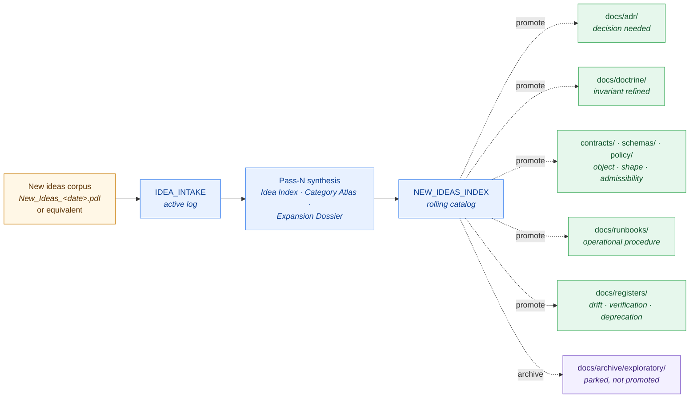

<!-- [KFM_META_BLOCK_V2]
doc_id: kfm://doc/docs-intake-readme
title: docs/intake/ — Idea Intake Lane
type: standard
version: v1
status: draft
owners: Docs steward (PLACEHOLDER — confirm against CODEOWNERS)
created: 2026-05-09
updated: 2026-05-09
policy_label: public
related:
  - docs/doctrine/directory-rules.md
  - docs/registers/VERIFICATION_BACKLOG.md
  - docs/registers/DRIFT_REGISTER.md
  - docs/archive/exploratory/
  - docs/adr/
tags: [kfm, docs, intake, governance, ideas, doctrine-onramp]
notes:
  - "Lane purpose: indexing incoming working notebooks (New_Ideas_<date>.pdf) before they mature into ADRs, doctrine, schemas, or runbooks."
  - "This README is doctrinal orientation; it does not decide promotion."
[/KFM_META_BLOCK_V2] -->

# `docs/intake/` — Idea Intake Lane

> **The on-ramp where incoming idea corpora are indexed, normalized, and triaged — before anything they contain becomes doctrine, decision, or shape.**

<!-- Badges: replace PLACEHOLDER targets when CI / governance hooks are wired. -->
[](#status)
[](#authority-level)
[](../doctrine/directory-rules.md)
[](../doctrine/truth-posture.md)
[](#last-reviewed)

> [!IMPORTANT]
> **Intake is pre-doctrine.** Nothing in this lane is normative until it is **promoted** — to an ADR (`docs/adr/`), doctrine (`docs/doctrine/`), a contract (`contracts/`), a schema (`schemas/`), a policy (`policy/`), or a runbook (`docs/runbooks/`). Treat material here as **proposed thinking**, not decisions.

**Quick jumps:**
[Purpose](#purpose) ·
[Authority](#authority-level) ·
[Status](#status) ·
[What belongs here](#what-belongs-here) ·
[What does **not** belong here](#what-does-not-belong-here) ·
[Lifecycle diagram](#lifecycle-diagram) ·
[Quickstart](#quickstart) ·
[Related folders](#related-folders) ·
[FAQ](#faq) ·
[Last reviewed](#last-reviewed)

---

## Purpose

`docs/intake/` is the human-facing **idea intake lane**. It owns two responsibilities:

1. **Receive** incoming working corpora — typically `New_Ideas_<YYYY-MM-DD>.pdf` notebooks, brainstorms, pattern recipes, candidate doctrine — without prematurely promoting them.
2. **Index, normalize, and develop** the ideas they contain into durable, inspectable, evidence-first reference dossiers (the *Pass-N — Idea Index, Category Atlas, and Expansion Dossier* line of work) so the rest of the project can navigate, debate, and selectively promote them.

> [!NOTE]
> Intake is to **ideas** what `data/raw/` and `data/quarantine/` are to **data**: a controlled, non-public on-ramp where incoming material is captured, examined, and held until governance decides where (or whether) it should advance. **Promotion is a governed state transition, not a file move.**

---

## Authority level

**Canonical (sub-lane of `docs/`).**

| Aspect | Value | Status |
|---|---|---|
| Lane class | Canonical sub-folder of `docs/` | **CONFIRMED** by [Directory Rules §6.1](../doctrine/directory-rules.md) |
| Decisional authority | None — intake is pre-decision | **CONFIRMED** by intake's role as on-ramp |
| Object-meaning authority | None — see [`contracts/`](../../contracts/) | **CONFIRMED** by [Directory Rules §6.3](../doctrine/directory-rules.md) |
| Schema authority | None — see [`schemas/`](../../schemas/) | **CONFIRMED** by ADR-0001 schema-home rule |
| Policy authority | None — see [`policy/`](../../policy/) | **CONFIRMED** by [Directory Rules §6.5](../doctrine/directory-rules.md) |

> Intake **explains** what is incoming and **organizes** it for review. It does not bind the project to any of it.

---

## Status

- **Lane state:** active — accepting and indexing new-ideas corpora.
- **README state:** `draft` — first published version of this orientation document.
- **Repo-presence of this folder:** **NEEDS VERIFICATION** — the canonical tree in [Directory Rules §6.1](../doctrine/directory-rules.md) lists `docs/intake/` with `IDEA_INTAKE` and `NEW_IDEAS_INDEX`; whether the folder is materialized in the current mounted repo is unconfirmed in this session.
- **Owners:** **PLACEHOLDER — confirm** against `CODEOWNERS` (or `.github/CODEOWNERS`). Tentative: Docs steward + at least one doctrine owner. See [Review burden](#review-burden).

---

## Repo fit

```
Kansas-Frontier-Matrix/
└── docs/
    ├── doctrine/        ← invariants and rules (intake feeds candidate doctrine here)
    ├── adr/             ← decisions (intake feeds candidate ADRs here)
    ├── architecture/    ← architectural texts (may be informed by intake)
    ├── domains/         ← per-domain pages (may absorb domain-specific intake outcomes)
    ├── runbooks/        ← procedures (intake patterns can mature into runbooks)
    ├── standards/       ← external standards alignment notes
    ├── registers/       ← persistent governance state
    ├── intake/          ← THIS LANE — incoming idea corpora, indexed
    └── archive/         ← retired / exploratory material (intake outflow when not promoted)
```

**Upstream of intake** (where ideas come from):

- Working notebooks dropped by maintainers (`New_Ideas_<date>.pdf`)
- External-research write-ups requesting consideration
- Cross-domain patterns surfaced during implementation
- Issues, discussions, and PR comments raising new patterns

**Downstream of intake** (where indexed ideas can go):

- `docs/adr/` — when a decision is needed
- `docs/doctrine/` — when an invariant is added or refined
- `docs/architecture/` — when a structural design results
- `contracts/`, `schemas/`, `policy/` — when an object family, shape, or admissibility rule emerges
- `docs/runbooks/` — when an operational procedure falls out
- `docs/registers/` — when the outcome is governance state (drift, deprecation, verification)
- `docs/archive/exploratory/` — when an idea is not chosen but worth keeping for lineage

---

## What belongs here

The Directory Rules name two long-lived inhabitants of this lane:

| Document family | Role | Format | Status |
|---|---|---|---|
| **`IDEA_INTAKE`** | Active log of incoming new-ideas corpora — what arrived, when, who submitted, current disposition. The "intake desk." | Markdown table or YAML manifest | **PROPOSED** filename and shape |
| **`NEW_IDEAS_INDEX`** | Rolling, append-only index of every indexed corpus and the synthesis pass(es) that covered it. The "library catalog." | Markdown index | **PROPOSED** filename and shape |
| **Pass-N — Idea Index, Category Atlas, and Expansion Dossier** | The synthesis output: an evidence-first dossier extracting, normalizing, and developing ideas from one or more `New_Ideas_<date>.pdf` corpora. | Markdown (long-form) | **CONFIRMED** as a recurring document family — see Pass 10, 11 Part 2, 12 Part 2, 13 Part 2 in the project corpus |
| **Triage notes / Pass scopes** | Short notes scoping what a pending pass will index and why. | Markdown | **PROPOSED** |

> [!TIP]
> **Pass-N dossiers are first-class.** They preserve the texture of the source — including tensions, contradictions, and gaps — rather than smoothing the corpus into thin notes. They earn their place by being usable as a foundation for ADRs, doctrine refinements, and schema work.

**Accepted file types in this lane:**

- Markdown (`.md`) for indexes, dossiers, and pass scopes
- YAML (`.yaml`/`.yml`) for machine-readable intake manifests, if used
- Vendored copies of incoming corpora **only** when retention rules require it; otherwise reference them by path or hash

---

## What does NOT belong here

> [!WARNING]
> Intake is **not** doctrine. Intake is **not** decisions. Intake is **not** machine-checkable shape. Intake is **not** policy.

- **ADRs** → `docs/adr/`
- **Doctrine / invariants** → `docs/doctrine/`
- **Object meaning** → `contracts/`
- **Machine-checkable schemas** → `schemas/contracts/v1/...` (per ADR-0001 schema-home)
- **Admissibility / allow-deny / sensitivity / rights / release policy** → `policy/`
- **Persistent governance registers** (authority, drift, deprecation, verification, contradiction) → `docs/registers/` and `control_plane/`
- **Per-domain reference pages** → `docs/domains/<domain>/`
- **External standards conformance notes** → `docs/standards/`
- **Operational runbooks** → `docs/runbooks/`
- **Retired or deprecated material** → `docs/archive/deprecated/`
- **Exploratory thinking that has been examined and parked** → `docs/archive/exploratory/`
- **Source data, raw fetches, RAW receipts, ingest receipts** → `data/raw/`, `data/quarantine/`, `data/receipts/intake/` — these are **source intake**, a different concept entirely (see [FAQ](#faq))
- **Build outputs, tiles, generated artifacts** → `data/published/`, `release/manifests/`, or — for non-trust-bearing build/QA-only output — `artifacts/`
- **Receipts, proofs, release manifests, rollback cards, correction notices** → `data/receipts/`, `data/proofs/`, `release/`

If a file in this lane wants to act like any of the items above, that is a **drift signal** — open an entry in `docs/registers/DRIFT_REGISTER.md`.

---

## Inputs

| Input | Origin | Form | Where it lands here |
|---|---|---|---|
| New-ideas working notebook | Maintainer drop | `New_Ideas_<YYYY-MM-DD>.pdf` (or markdown equivalent) | Logged in `IDEA_INTAKE`; copy/reference path retained |
| External research write-up | Reviewer or contributor | Markdown / PDF | Logged in `IDEA_INTAKE` with rights and source notes |
| Cross-domain pattern surfaced in PRs | Implementation work | Issue/PR text | Triaged into a pass scope; later folded into a Pass-N dossier |
| Doctrine pressure flagged during implementation | Domain owner | Note in PR or issue | Indexed as a candidate doctrine update; routed forward |

**Input handling rules:**

- Honor **source boundary**: every Pass-N dossier names the controlling corpus and treats other docs as corroborating context only.
- Apply **cite-or-abstain**: if a claim cannot be tied to the controlling corpus or a named doctrine document, abstain or mark `UNKNOWN`/`NEEDS VERIFICATION`.
- Apply **truth labels** at the entry level: `CONFIRMED`, `PROPOSED`, `UNKNOWN`, `NEEDS VERIFICATION`. Do not upgrade uncertainty through tone.
- **Do not publish** any contents of this lane through public surfaces — intake is internal-facing.

---

## Outputs

What this lane emits — and where each output lands.

| Output | Form | Destination |
|---|---|---|
| **Pass-N — Idea Index, Category Atlas, and Expansion Dossier** | Long-form Markdown | Stays in `docs/intake/` |
| **Updated `NEW_IDEAS_INDEX` entry** | Markdown row / index update | Stays in `docs/intake/` |
| **Candidate ADR draft** | Markdown stub linking the originating intake entry | `docs/adr/` (draft) |
| **Doctrine refinement proposal** | Markdown patch or new section | `docs/doctrine/` |
| **Candidate object family** | Markdown definition + links | `contracts/<family>/` |
| **Candidate schema** | JSON Schema draft | `schemas/contracts/v1/...` (per ADR-0001) |
| **Candidate policy bundle** | OPA/Rego draft + tests | `policy/` |
| **Candidate runbook** | Markdown procedure | `docs/runbooks/` |
| **Drift / verification entry** | Register row | `docs/registers/DRIFT_REGISTER.md` or `docs/registers/VERIFICATION_BACKLOG.md` |
| **Archived idea (not chosen)** | Original entry + disposition note | `docs/archive/exploratory/` |

> [!IMPORTANT]
> No output of this lane silently becomes truth. Every promotion requires the **review and approval discipline of the destination lane** — ADR for decisions, doctrine ownership for invariants, ADR-0001 path for schemas, and so on.

---

## Directory tree

> Status: **PROPOSED** layout consistent with [Directory Rules §6.1](../doctrine/directory-rules.md). **NEEDS VERIFICATION** against the mounted repo.

```
docs/intake/
├── README.md                           # this file
├── IDEA_INTAKE.md                      # active intake log (PROPOSED filename)
├── NEW_IDEAS_INDEX.md                  # rolling index of indexed corpora (PROPOSED filename)
├── passes/
│   ├── pass-10-idea-index.md           # corresponds to KFM_Components_Pass_10_Idea_Index_*  (PROPOSED filename)
│   ├── pass-11-part-2-idea-index.md    # corresponds to KFM_Components_Pass_11_Part_2_*       (PROPOSED filename)
│   ├── pass-12-part-2-idea-index.md    # corresponds to KFM_Pass_12_Part_2_*                  (PROPOSED filename)
│   └── pass-13-part-2-idea-index.md    # corresponds to KFM_Components_Pass_13_Part_2_*       (PROPOSED filename)
└── scopes/
    └── pass-NN-scope.md                # short scope/triage note for a pending pass (PROPOSED)
```

> Filenames above are **conventions to consider**, not facts. Adjust to match whatever repo-local convention is in force; if a documented convention disagrees with this layout, the local convention wins and this README should be updated.

---

## Lifecycle diagram

How an incoming idea moves through intake and either promotes outward or archives.



> [!NOTE]
> The dashed arrows represent **governed state transitions**, not file moves. A Pass-N dossier may seed multiple downstream promotions, or none at all.

[Back to top](#docsintake--idea-intake-lane)

---

## Quickstart

How to add a new idea corpus to intake and run a synthesis pass.

### 1. Receive the corpus

Place the incoming notebook at a stable, citable location (project drop, attached PDF, or vendored copy). Record its identity (filename, hash if available, submitter, date received).

### 2. Log it in `IDEA_INTAKE`

Add a row capturing — at minimum — the fields below.

<details>
<summary><b>Example <code>IDEA_INTAKE</code> entry (PROPOSED shape — adjust to local convention)</b></summary>

```markdown
| intake_id | corpus | received | submitter | sensitivity | disposition | pass_ref |
|---|---|---|---|---|---|---|
| INTAKE-2026-05-09-A | New_Ideas_2026-05-08.pdf | 2026-05-09 | maintainer:<handle> | none / restricted / sensitive | pending | — |
```

Fields:

- `intake_id` — stable, dated identifier; never reused.
- `corpus` — citable filename or path to the controlling corpus.
- `received` — ISO date the corpus arrived.
- `submitter` — accountable submitter handle.
- `sensitivity` — coarse class; defer to `policy/sensitivity/` for binding rules.
- `disposition` — `pending` → `indexing` → `indexed` → `promoted` / `archived` / `withdrawn`.
- `pass_ref` — link to the Pass-N dossier once produced.
</details>

### 3. Run a synthesis pass

Produce a *Pass-N — Idea Index, Category Atlas, and Expansion Dossier* in `docs/intake/passes/`. Required posture, derived from the existing Pass-10 / 11 / 12 / 13 dossiers in the project corpus:

- **Source boundary** — name the controlling corpus; treat other docs as corroborating only.
- **Truth posture key** — `CONFIRMED`, `PROPOSED`, `UNKNOWN`, `NEEDS VERIFICATION`.
- **Implementation maturity is bounded** — no claim that any specific repo file, branch state, test result, or runtime behavior has been verified unless it actually has been.
- **Convergence and pressure** — note where new ideas converge with existing doctrine and where they pressure it.
- **Duplicates** — merge near-duplicates into a single normalized formulation; treat repeats as corroboration.

### 4. Index it in `NEW_IDEAS_INDEX`

Append a row referencing the pass dossier, the controlling corpus, and the disposition.

### 5. Triage outward

Walk the dossier with the relevant owners. For each idea worth advancing, open the appropriate downstream artifact: ADR draft, doctrine PR, contract sketch, schema draft, policy bundle, runbook, or register entry. For each idea not chosen, route to `docs/archive/exploratory/` with a brief disposition note.

> [!CAUTION]
> Do not edit doctrine, contracts, schemas, or policy directly from intake. Promotion is a **separate, reviewed change** in the destination lane, citing the intake entry as input.

[Back to top](#docsintake--idea-intake-lane)

---

## Validation

What is checked, and how.

| Check | Mechanism | Status |
|---|---|---|
| Every Pass-N dossier names a **controlling corpus** | Reviewer checklist + light lint | **PROPOSED** |
| Every entry carries a **truth label** (`CONFIRMED` / `PROPOSED` / `UNKNOWN` / `NEEDS VERIFICATION`) | Reviewer checklist + grep-style lint | **PROPOSED** |
| Pass-N dossiers do **not** claim repo state without evidence | Reviewer checklist | **PROPOSED** |
| `IDEA_INTAKE` and `NEW_IDEAS_INDEX` row shapes are stable | Schema for the row, if YAML; lint, if Markdown | **PROPOSED** |
| No file in `docs/intake/` acts as **doctrine, ADR, schema, or policy** | Reviewer checklist + path-validation script | **PROPOSED** |
| Promotions are not silent | PR template requires linking the originating intake entry when an ADR / doctrine / schema / policy / runbook PR cites intake material | **PROPOSED** |

> Validators and linters are **PROPOSED** until materialized in `tools/validators/` (per [Directory Rules §7.3](../doctrine/directory-rules.md)). When implemented, they should evaluate fixtures in `fixtures/` (or `tests/fixtures/`) and run in CI under `.github/workflows/`.

---

## Review burden

| Change type | Required reviewers |
|---|---|
| New entry in `IDEA_INTAKE` | Docs steward (or designate) |
| New Pass-N dossier | Docs steward + at least one domain or governance owner relevant to the corpus |
| Update to `NEW_IDEAS_INDEX` | Docs steward |
| Edits to this `README.md` | Docs steward + one doctrine owner |
| Promotion **out** of intake | Discipline of the destination lane (ADR review for `docs/adr/`, doctrine review for `docs/doctrine/`, ADR-0001 path for `schemas/`, etc.) — not enforced from this lane |

> Confirm the canonical owner list against `CODEOWNERS` (or `.github/CODEOWNERS`). Ownership above is **PROPOSED** until that file is checked.

---

## Related folders

| Folder | Relationship |
|---|---|
| [`docs/doctrine/`](../doctrine/) | Destination for promoted invariants. Holds `directory-rules.md`, `truth-posture.md`, `trust-membrane.md`, `lifecycle-law.md`, `authority-ladder.md`. |
| [`docs/adr/`](../adr/) | Destination for promoted decisions. ADR-0001 governs schema-home placement. |
| [`docs/architecture/`](../architecture/) | Destination for architectural texts informed by intake. |
| [`docs/domains/`](../domains/) | Per-domain reference; intake outcomes that are domain-specific land here as content (not as new root folders). |
| [`docs/runbooks/`](../runbooks/) | Destination for operational procedures matured out of intake. |
| [`docs/standards/`](../standards/) | External standards (STAC, DCAT, PROV, etc.) that intake material may align with. |
| [`docs/registers/`](../registers/) | Persistent governance state — `DRIFT_REGISTER.md`, `VERIFICATION_BACKLOG.md`, `AUTHORITY_LADDER.md`, `CANONICAL_LINEAGE_EXPLORATORY.md`, `OBJECT_FAMILY_MAP.md`. |
| [`docs/archive/`](../archive/) | Outflow for parked exploratory material that intake reviewed but did not promote. |
| [`control_plane/`](../../control_plane/) | Machine-readable governance maps. Receives nothing directly from intake; receives entries via promoted policy/release/deprecation decisions. |
| [`contracts/`](../../contracts/), [`schemas/`](../../schemas/), [`policy/`](../../policy/) | Destinations for promoted object meaning, machine shape, and admissibility rules. |

---

## ADRs

| ADR | Relevance to this lane |
|---|---|
| `docs/adr/ADR-0001-schema-home.md` | Indirect — when intake promotes a candidate schema, ADR-0001 governs **where** it lands (`schemas/contracts/v1/...`). |
| Lane-specific ADR | **None known.** If `docs/intake/` shape needs to be frozen (filenames, row schemas, pass-naming convention), open an ADR per [Directory Rules §17](../doctrine/directory-rules.md). |

> If a future change to this lane meets [Directory Rules §2.4](../doctrine/directory-rules.md) (new compatibility root, new sibling under `data/`, schema-home change, etc.), an ADR is **required** before merging.

---

## FAQ

<details>
<summary><b>Is <code>docs/intake/</code> the same as "source intake"?</b></summary>

**No.** They share a word but cover different domains.

- **`docs/intake/`** (this lane) is for **ideas** — working notebooks, candidate doctrine, pattern recipes — landing in human-facing documentation.
- **Source intake** is a *capability* for registering **data sources** — `SourceDescriptor`, `SourceIntakeRecord`, `SourceAuthorityRegister` — and lives in [`connectors/`](../../connectors/), [`data/raw/`](../../data/raw/), [`data/quarantine/`](../../data/quarantine/), and [`data/receipts/intake/`](../../data/receipts/) (per the Encyclopedia capability taxonomy and [Greenfield Building Plan v1.1](#related-folders) updates referencing `data/receipts/intake/`).

The conflation is a known drift risk. If a file in `docs/intake/` starts looking like a `SourceIntakeRecord`, that is a **misplacement** — it belongs under `data/registry/sources/` or `connectors/`, not here.
</details>

<details>
<summary><b>Why a separate lane? Why not just open ADRs?</b></summary>

Because most incoming ideas are not yet decisions. Forcing every brainstorm directly into the ADR lane would either flood it with proposals that do not deserve a decision, or bottleneck the project on premature decision-making. Intake provides a **non-coercive surface** to think in public, normalize vocabulary, surface duplicates, and discover which ideas actually warrant ADRs, doctrine refinements, or schema work — and which should be archived without further commitment.
</details>

<details>
<summary><b>Can I cite a Pass-N dossier as authority?</b></summary>

**No, not on its own.** A Pass-N dossier is a *synthesis*, not a *decision*. Citing it as authority would collapse the trust membrane between "what was thought" and "what was decided." If you need binding authority, cite the ADR, doctrine document, contract, schema, or policy that the intake material was promoted into. If no such promoted artifact exists yet, the underlying claim is **`PROPOSED`**.
</details>

<details>
<summary><b>What if a Pass-N dossier surfaces a contradiction with existing doctrine?</b></summary>

Name the contradiction explicitly in the dossier. Then route it to one of:

1. **`docs/registers/DRIFT_REGISTER.md`** — if the contradiction is between doctrine and the current repo state.
2. **`docs/registers/VERIFICATION_BACKLOG.md`** — if the contradiction depends on an unverified claim.
3. **`docs/adr/`** — if the contradiction needs a binding decision to resolve.

Do **not** silently smooth over the contradiction inside the dossier.
</details>

<details>
<summary><b>How do incoming PDFs / corpora get retained?</b></summary>

**PROPOSED policy** — confirm against `policy/rights/` and `policy/sensitivity/`:

- Corpora with clear rights and no sensitivity may be vendored alongside their intake entry.
- Corpora with unclear rights, third-party content, or sensitive material should be **referenced** (path, hash, citation) without vendoring; if vendored, they belong in `data/raw/` or `data/quarantine/` under the source-intake capability — not under `docs/intake/`.
- Apply **fail-closed**: when in doubt, reference rather than vendor.
</details>

<details>
<summary><b>What does promotion out of intake actually look like?</b></summary>

A separate PR in the destination lane that:

1. Cites the originating `IDEA_INTAKE` row by `intake_id` and the relevant Pass-N dossier section.
2. Follows the destination lane's own review discipline.
3. Updates the `disposition` field of the originating intake row to `promoted` and links the resulting artifact.

For schemas this means landing under `schemas/contracts/v1/...` per ADR-0001. For doctrine, under `docs/doctrine/`. For decisions, an ADR. For policy, an OPA/Rego bundle plus tests under `policy/`. Promotion **never** happens by editing intake material in place.
</details>

<details>
<summary><b>Is this lane public?</b></summary>

`docs/` as a whole is the human-facing control plane and is generally readable. **However**, intake material is **not authoritative** and should not be exposed through public client surfaces (the governed API, viewer, search index, evidence drawer, etc.) as if it were. Public surfaces consume **promoted, governed** artifacts — not pre-doctrine notes.
</details>

[Back to top](#docsintake--idea-intake-lane)

---

## Last reviewed

`2026-05-09` — initial publication of this README. Re-review cadence: **6 months** or whenever a structural change to intake (filenames, row shapes, pass conventions) is proposed, whichever comes first. If older than 6 months on review, this lane SHOULD appear as a candidate row in `docs/registers/DRIFT_REGISTER.md`.

---

<sub>This README is doctrinal orientation for `docs/intake/`. It does not decide promotion, bind doctrine, or carry release authority. See [`docs/doctrine/directory-rules.md`](../doctrine/directory-rules.md) §0, §6.1, §15 for the governing rules.</sub>
