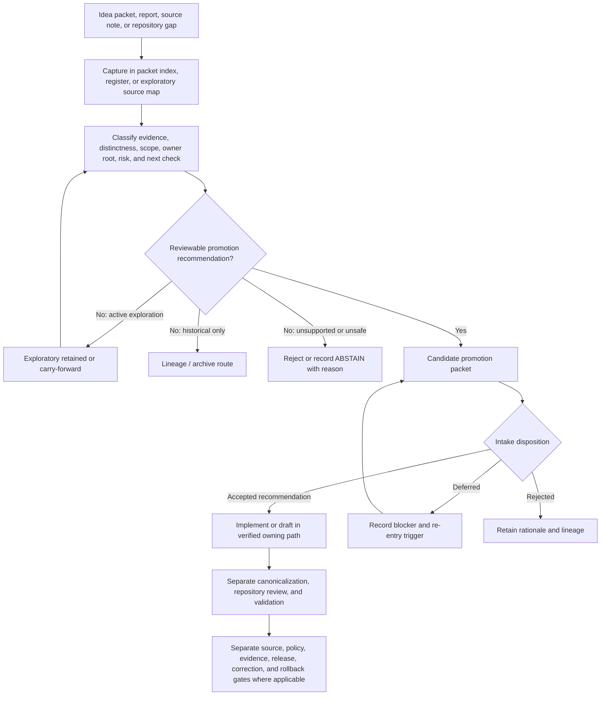

<!-- [KFM_META_BLOCK_V2]
doc_id: kfm://doc/docs-intake-readme
title: Documentation Intake — Repository-Grounded Lane README
type: readme/lane-readme
version: v2-draft
status: draft; repository-grounded; intake-only
owners:
  - "@bartytime4life"
owner_status: "Verified GitHub review route only; no independent stewardship assignment, approval, canonicalization, source admission, release authority, or separation of duties is implied."
created: 2026-05-08
updated: 2026-08-14
policy_label: repository-facing
owning_root: docs/
responsibility: "Provide the human-facing landing page for exploratory documentation intake, source-map lineage, packet triage, carry-forward material, canonicalization guidance, and promotion-packet routing without becoming a source, contract, schema, policy, evidence, release, or publication authority."
truth_posture: "CONFIRMED repository inventory and accepted placement authority / PROPOSED lane classifications and unresolved sibling roles / NEEDS VERIFICATION canonical-lane status and operational enforcement; cite-or-abstain"
evidence_snapshot:
  repository: bartytime4life/Kansas-Frontier-Matrix
  base_ref: main
  base_commit: f90df7054d3bfa9d88d0bf3829e4b4b894705ffe
  target_prior_blob: 57d87bdd1d6f7fd15b2a87cec22069204bde9e62
  original_target_blob: 7f2979c531a46e06d1e5f037ea2074f596d0afcf
  docs_root_readme_blob: 1f8bac189dac1d01c1185e8b4fb8e25efd11d09f
  directory_rules_blob: fd49a0b83e55cef52c1124281f093e263526898d
  adr_0029_blob: a4de0d7a96b78da59cfc499d1025e1508afd8dd9
  codeowners_blob: dd2a84aa514d8ecd9208bc347f90f9a2ed37dd61
  direct_child_count: 11
related:
  - ../README.md
  - ../doctrine/directory-rules.md
  - ../adr/ADR-0029-adopt-directory-governance-standard-v2.md
  - ../adr/ADR-0017-source-descriptor-admission-process.md
  - ../../.github/CODEOWNERS
  - ./IDEA_INTAKE.md
  - ./NEW_IDEAS_INDEX.md
  - ./new-ideas-register.md
  - ./canonicalization-policy.md
  - ./triage-rules.md
  - ./promotion-criteria.md
  - ./cards/README.md
  - ./carry-forward/README.md
  - ./exploratory/README.md
  - ./promotions/README.md
  - ../registers/DRIFT_REGISTER.md
  - ../registers/VERIFICATION_BACKLOG.md
  - ../archive/exploratory/README.md
  - ../archive/lineage/README.md
tags: [kfm, docs, intake, exploratory, source-map, triage, canonicalization, promotion-packet, governance]
notes:
  - "This is a same-path documentation-only reconciliation. It creates no new lane, authority, state machine, source admission, policy, release, or publication effect."
  - "The lane exists in the repository, but the adopted Directory Rules direct-child map does not enumerate docs/intake/; its exact canonical or compatibility classification remains NEEDS VERIFICATION."
  - "IDEA_INTAKE.md currently overlaps in title and purpose with NEW_IDEAS_INDEX.md and new-ideas-register.md; this README records the conflict without resolving it."
  - "triage-rules.md, promotion-criteria.md, and cards/README.md remain placeholder scaffolds and are not upgraded by this README."
[/KFM_META_BLOCK_V2] -->

<a id="top"></a>
<a id="-documentation-intake--docsintake"></a>
<a id="documentation-intake--docsintake"></a>

# 📥 Documentation Intake — `docs/intake/`

> **Repository-grounded front door for non-authoritative KFM documentation intake.** This lane preserves exploratory packets, source maps, idea indexes, carry-forward notes, and promotion-review records while keeping them separate from doctrine, accepted decisions, object authority, source admission, lifecycle state, release, and publication.

[](#3-authority-and-status-labels)
[](#6-directory-tree)
[](#2-repo-fit)
[](#2-repo-fit)
[](#3-authority-and-status-labels)

> [!IMPORTANT]
> **Intake is not canon.** A file, index row, source map, candidate packet, accepted intake disposition, branch, pull request, merge, test, or badge in this lane does not by itself create doctrine, accept an ADR, define object meaning or shape, decide policy, admit a source, resolve evidence, authorize a lifecycle transition, release an artifact, or publish a claim.

> [!CAUTION]
> **Documentation intake is not source or data intake.** Source identity, rights, sensitivity, activation, capture, and record admission belong to separately governed source, registry, connector, policy, and lifecycle surfaces. [`ADR-0017`](../adr/ADR-0017-source-descriptor-admission-process.md) remains proposed and does not turn this documentation lane into a source-admission authority.

## Current profile

| Field | Evidence-backed value |
|---|---|
| Repository path | `docs/intake/README.md` — **CONFIRMED** at `main@f90df7054d3bfa9d88d0bf3829e4b4b894705ffe` |
| Prior target blob | `57d87bdd1d6f7fd15b2a87cec22069204bde9e62` |
| Creation evidence | First tracked at this path on 2026-05-08; original blob `7f2979c531a46e06d1e5f037ea2074f596d0afcf` |
| Primary responsibility | Human-readable capture, classification, routing, and lineage for non-authoritative documentation intake |
| Owning root | `docs/` — human-readable governance and explanation |
| Same-path placement outcome | `PLACE` for this README update; no path or authority boundary changes |
| Lane classification | **NEEDS VERIFICATION** — the lane is repository-present, but it is not enumerated in the adopted Directory Rules direct-child map |
| Placement authority | Accepted [`ADR-0029`](../adr/ADR-0029-adopt-directory-governance-standard-v2.md) and the exact adopted [`Directory Rules`](../doctrine/directory-rules.md) bytes |
| Repository review route | `@bartytime4life` through the default [`CODEOWNERS`](../../.github/CODEOWNERS) rule; routing is not review, stewardship, approval, or separation-of-duties evidence |
| Direct children | Eleven current direct children, recorded in [§6](#6-directory-tree) |
| Exposure | Repository-facing and potentially public; secrets, private payloads, restricted source text, personal data, and protected precision are prohibited |
| Release / deployment / publication effect | None |

---

## 🧭 Quick jump

- [1. Scope](#1-scope)
- [2. Repo fit](#2-repo-fit)
- [3. Authority and status labels](#3-authority-and-status-labels)
- [4. What belongs here (inputs)](#4-what-belongs-here-inputs)
- [5. What does NOT belong here (exclusions)](#5-what-does-not-belong-here-exclusions)
- [6. Directory tree](#6-directory-tree)
- [7. The intake → promotion path](#7-the-intake--promotion-path)
- [8. Working with intake (usage)](#8-working-with-intake-usage)
- [9. Idea lifecycle states](#9-idea-lifecycle-states)
- [10. Validation, review, and rollback](#10-validation-review-and-rollback)
- [11. FAQ](#11-faq)
- [12. Related docs and folders](#12-related-docs-and-folders)
- [13. Appendix — templates and references](#13-appendix--templates-and-references)

---

## 1. Scope

`docs/intake/` is a **documentation control lane** for material that is useful enough to preserve and inspect but has not earned an authority-bearing destination.

The lane currently serves four connected purposes:

1. **Capture and index.** Preserve dated idea packets, normalized notes, source maps, and intake metadata without claiming implementation or adoption.
2. **Triage and classify.** Record distinctness, source support, uncertainty, candidate owner, destination pressure, rights or sensitivity concerns, and next checks.
3. **Route reviewable recommendations.** Move sufficiently bounded recommendations into the promotion-packet review lanes without confusing packet disposition with canonicalization.
4. **Preserve lineage.** Retain why an idea was accepted for further work, deferred, rejected, carried forward, superseded, or archived.

The lane does not own the substantive artifact merely because an intake record discusses it. The owning responsibility root remains authoritative:

| Intake discusses… | Authority remains with… |
|---|---|
| Doctrine or architecture decision | `docs/doctrine/`, `docs/adr/`, or the verified architecture lane |
| Object or interface meaning | `contracts/` |
| Machine-checkable shape | `schemas/` |
| Allow, deny, restrict, redact, generalize, or abstain rules | `policy/` |
| Source identity, rights, sensitivity, cadence, or activation | source guidance, `data/registry/`, policy, and source-admission authorities |
| Runtime, pipeline, connector, validator, test, or workflow behavior | the applicable implementation root and executable evidence |
| Evidence, receipt, proof, release, correction, or rollback state | the separately governed evidence, accountability, and release families |
| Public data, APIs, maps, exports, or AI answers | released public-safe carriers and governed interfaces |

> [!NOTE]
> This README is a lane map and boundary contract. It does not replace the more detailed packet register, canonicalization guidance, source-map records, or promotion sublane contracts.

[↥ Back to top](#top)

---

## 2. Repo fit

### 2.1 Directory Rules basis

This file explains a human-facing repository process, so the owning responsibility root is `docs/`. Accepted ADR-0029 adopted the exact Directory Rules v2 bytes and makes `docs/doctrine/directory-rules.md` the single writable human Directory Rules authority.

The adopted rules define `docs/` as the human-readable governance and explanation root. Their normalized direct-child map does **not** enumerate `docs/intake/`. The current repository nevertheless contains this lane and substantial child content.

The bounded conclusion is:

| Question | Current answer |
|---|---|
| Does `docs/intake/` exist? | **CONFIRMED** |
| Does this README belong under `docs/` by primary responsibility? | **CONFIRMED** |
| May this same-path README be modernized without creating a new authority? | **PLACE** |
| Is `docs/intake/` explicitly ratified as a canonical direct child by the adopted map? | **NEEDS VERIFICATION** |
| May this README declare itself a new canonical authority? | **DENY** |
| Should structural migration or retirement happen in this change? | **No** — separate evidence and decision required |

This update therefore keeps the tracked path, explains the current lane honestly, and records unresolved classification rather than inventing a structural decision.

### 2.2 Adjacent authority boundaries

| Surface | Relationship to intake | Boundary |
|---|---|---|
| [`../README.md`](../README.md) | Parent root contract | Defines `docs/`; does not make intake material sovereign truth |
| [`../doctrine/directory-rules.md`](../doctrine/directory-rules.md) | Placement law | Controls responsibility-root placement after ADR-0029 adoption |
| [`../adr/ADR-0029-adopt-directory-governance-standard-v2.md`](../adr/ADR-0029-adopt-directory-governance-standard-v2.md) | Accepted adoption decision | Adopts the exact Directory Rules bytes; does not canonize each current child lane |
| [`./canonicalization-policy.md`](canonicalization-policy.md) | Draft process guidance | Explains candidate canonicalization; does not perform it |
| [`./promotions/README.md`](promotions/README.md) | Promotion-packet lane contract | Records intake recommendation states only |
| [`../registers/DRIFT_REGISTER.md`](../registers/DRIFT_REGISTER.md) | Drift record | Appropriate sink for authority, naming, or path conflicts |
| [`../registers/VERIFICATION_BACKLOG.md`](../registers/VERIFICATION_BACKLOG.md) | Verification record | Appropriate sink for concrete checks that remain unresolved |
| [`../archive/exploratory/README.md`](../archive/exploratory/README.md) | Retired exploratory material | Frozen lineage, not active intake |
| [`../archive/lineage/README.md`](../archive/lineage/README.md) | Historical lineage | Retained history, not current authority |
| [`../sources/README.md`](../sources/README.md) | Human source guidance | Separate from documentation idea intake |
| [`../../data/registry/sources/README.md`](../../data/registry/sources/README.md) | Source registry lane | Separate machine/accountability authority; path existence does not imply an admitted source |

### 2.3 State separation

KFM has several independent state systems. Intake documents must not collapse them.

| State axis | Examples | What an intake state proves |
|---|---|---|
| Documentation intake | captured, triaged, exploratory-retained, candidate, accepted, deferred, rejected, lineage-only | Only the documentation review or routing state |
| Canonicalization or adoption | proposed doc, accepted ADR, adopted doctrine, verified owning artifact | Nothing unless the actual authority-bearing artifact and decision are cited |
| Repository delivery | local draft, branch, draft PR, ready PR, merged commit | Only how bytes were delivered |
| Source admission | unresolved, context-only, admitted, quarantined, denied | Nothing unless source authorities separately record it |
| Data lifecycle | pre-RAW, RAW, WORK/QUARANTINE, PROCESSED, CATALOG/TRIPLETS, PUBLISHED | Nothing; documentation intake is not a data lifecycle phase |
| Policy and review | allow, restrict, redact, generalize, abstain, deny; review pending/complete | Nothing unless the real policy or review record exists |
| Release and publication | candidate, held, released, corrected, withdrawn, rolled back | Nothing; intake packet movement is not release state |

> [!WARNING]
> Do not describe documentation intake as a miniature RAW-to-PUBLISHED pipeline. The systems are analogous only in their insistence on explicit transitions and lineage. They have different authorities, objects, evidence, and consequences.

[↥ Back to top](#top)

---

## 3. Authority and status labels

### 3.1 Lane authority

| Aspect | Current posture |
|---|---|
| Document status | `draft; repository-grounded; intake-only` |
| Lane path | CONFIRMED current repository path |
| Lane authority | Human-readable intake navigation, classification, review routing, and lineage |
| Canonical direct-child classification | NEEDS VERIFICATION |
| Default content posture | `EXPLORATORY`, `PROPOSED`, `LINEAGE`, `UNKNOWN`, or `NEEDS VERIFICATION` unless stronger evidence supports a narrower claim |
| Source admission authority | None |
| Contract / schema / policy authority | None |
| Lifecycle / release / publication authority | None |
| Review route | Default CODEOWNERS route to `@bartytime4life`; no independent stewardship proof |
| Machine enforcement | UNKNOWN unless a specific validator, test, workflow, and current run are cited |

### 3.2 Truth labels

Use the core KFM truth labels for material claims:

| Label | Meaning here |
|---|---|
| `CONFIRMED` | Verified from current repository bytes, accepted decisions, supplied sources, tests, workflows, logs, or artifacts |
| `PROPOSED` | A design, destination, classification, or next action not adopted or implemented |
| `UNKNOWN` | Evidence is insufficient |
| `NEEDS VERIFICATION` | A concrete check can resolve the question but has not yet been completed |

The lane also uses descriptive qualifiers:

| Qualifier | Use |
|---|---|
| `EXPLORATORY` | Active idea or source-map material not promoted |
| `LINEAGE` / `LINEAGE_ONLY` | Historical support or prior thinking, not current authority |
| `CORROBORATIVE` | Repeats or strengthens an existing direction without becoming another authority vote |
| `CONFLICTED` | Current admissible evidence or writable homes disagree |
| `SUPERSEDED` | Replaced by a named successor |
| `DEFERRED` | A named prerequisite pauses review |
| `REJECTED` | The submitted recommendation should not advance in its current form |

`DENY`, `ABSTAIN`, `HOLD`, and `ERROR` should be used only with their stated scope. An intake rejection is not automatically a policy `DENY`; a packet deferral is not automatically a release `HOLD`.

### 3.3 What this README proves

| Claim | Status |
|---|---|
| The target path and eleven direct children exist at the evidence snapshot | **CONFIRMED** |
| The lane is human-readable documentation under `docs/` | **CONFIRMED** |
| Intake artifacts do not create stronger authority | **CONFIRMED boundary** |
| Every child file has a settled, non-overlapping role | **False / CONFLICTED** |
| `IDEA_INTAKE.md` is a verified template | **False** — its current title and content are another “New Ideas Index” |
| `cards/` is an active card collection | **False at snapshot** — only its placeholder README is present |
| `carry-forward/` has active carry-forward items | **False at snapshot** — only its README is present |
| `exploratory/` contains active source-map records | **CONFIRMED** |
| Promotion state lanes contain actual packet records | **False at snapshot** — each contains only its lane README |
| `triage-rules.md` and `promotion-criteria.md` are complete standards | **False** — both are placeholder scaffolds |
| A validator prevents intake-as-canon references repository-wide | **UNKNOWN** |

[↥ Back to top](#top)

---

## 4. What belongs here (inputs)

Material belongs in `docs/intake/` when its primary responsibility is human-readable intake, not authority-bearing implementation.

### 4.1 Accepted artifact families

| Accepted artifact | Current surface | Minimum posture |
|---|---|---|
| Dated idea packet landing record | [`NEW_IDEAS_INDEX.md`](NEW_IDEAS_INDEX.md) | Packet identity, source refs, themes, blockers, and routing pressure |
| Detailed packet/intake ledger | [`new-ideas-register.md`](new-ideas-register.md) | Status, distinctness, evidence burden, candidate destination, and disposition |
| Source-map or adaptation note | [`exploratory/`](exploratory/README.md) | Bounded source lineage, repository comparison, non-effects, and unresolved checks |
| Draft canonicalization guidance | [`canonicalization-policy.md`](canonicalization-policy.md) | Explicitly draft; no self-promotion |
| Carry-forward control note | [`carry-forward/`](carry-forward/README.md) | Prior source, preservation reason, next check, and destination pressure |
| Promotion recommendation packet | [`promotions/`](promotions/README.md) | Stable identity, evidence boundary, one primary owner, dependencies, validation, review, and rollback |
| Normalized card or compact proposal | [`cards/`](cards/README.md) | Only after the card lane’s role and relationship to the two indexes are clarified |
| Intake triage or promotion criteria | [`triage-rules.md`](triage-rules.md), [`promotion-criteria.md`](promotion-criteria.md) | Currently placeholder-only; do not cite as complete standards |

### 4.2 Minimum qualities

Every material intake record should make the following inspectable:

1. **Identity.** Stable title, ID or slug, source identity, and current state.
2. **Evidence boundary.** What was actually read or inspected; what remains unknown.
3. **Normalized claim.** What the packet or record proposes, without upgrading proposal to fact.
4. **Distinctness.** Existing packet, issue, branch, PR, ADR, contract, schema, policy, or implementation checked for overlap.
5. **Responsibility.** One primary owner root and a proposed destination, or an explicit `HOLD`.
6. **Consequences.** Direct dependencies, rights/sensitivity constraints, validation, review, and rollback.
7. **Non-effects.** What the record does not authorize, implement, release, or publish.
8. **Lineage.** Predecessors, corroborative records, supersession, and correction path.

### 4.3 Safe source handling

Repository-facing Markdown may link to governed or public source identities. It must not copy secrets, credentials, private attachments, restricted payloads, living-person data, genomic data, protected species or archaeology locations, infrastructure precision, private land/title material, or rights-uncertain excerpts into intake.

When source material cannot be safely reproduced, record a bounded identity, public-safe summary, sensitivity posture, and governed locator rather than the payload.

[↥ Back to top](#top)

---

## 5. What does NOT belong here (exclusions)

> [!WARNING]
> Intake must not become a shadow authority or a convenient storage bucket.

| Does **not** belong in `docs/intake/` as canonical authority | Owning surface |
|---|---|
| Adopted doctrine or operating law | `docs/doctrine/` and accepted ADRs |
| Accepted architecture decision | `docs/adr/` and the verified architecture lane |
| Semantic object or interface meaning | `contracts/` |
| Machine-checkable shape | `schemas/` |
| Allow, deny, restrict, redact, generalize, or abstain rules | `policy/` |
| Machine governance projection or register | `control_plane/` |
| Source descriptor, activation decision, rights record, or source registry instance | verified source/registry authority |
| RAW, WORK, QUARANTINE, PROCESSED, CATALOG/TRIPLETS, or PUBLISHED data | `data/` lifecycle lanes |
| Receipt, proof, attestation, or validation artifact | governed accountability lanes |
| Release manifest, correction notice, withdrawal, or rollback card | `release/` and accepted release/accountability homes |
| Executable connector, pipeline, validator, package, app, runtime, config, workflow, test, or fixture | its implementation root |
| Public API payload, map layer, tile, export, dashboard, or AI answer | released public-safe carriers and governed interfaces |
| Secrets, signed URLs, private locators, restricted content, or harmful precision | external secret systems or a restricted governed evidence flow |

### Intake-specific anti-patterns

1. **Intake-as-canon.** A canonical or executable surface cites an intake record as its authority instead of the promoted owning artifact.
2. **Packet pressure as consensus.** Repeated or longer packets are counted as votes for adoption.
3. **Index collision.** Multiple indexes or registers independently assign status, destination, or identity without a declared relationship.
4. **Source map as proof.** An adaptation map is treated as proof that the proposed contract, schema, validator, or workflow exists.
5. **Packet acceptance as release.** An accepted recommendation is called a `PromotionDecision`, `ReleaseManifest`, or publication.
6. **Intake as archive.** Closed or stale material remains active indefinitely instead of moving to a verified archive/lineage state.
7. **Placeholder authority.** A short scaffold such as `triage-rules.md` is cited as a complete standard because its filename sounds normative.
8. **Sensitive rationale leakage.** Public rejection or deferral prose reveals the protected fact, location, identity, or reason it is meant to contain.

[↥ Back to top](#top)

---

## 6. Directory tree

The tree below is the **CONFIRMED direct-child inventory** at the evidence snapshot. It is not a declaration that every child is canonical or mature.

```text
docs/intake/
├── README.md
├── IDEA_INTAKE.md
├── NEW_IDEAS_INDEX.md
├── canonicalization-policy.md
├── cards/
├── carry-forward/
├── exploratory/
├── new-ideas-register.md
├── promotion-criteria.md
├── promotions/
└── triage-rules.md
```

### 6.1 Current child map

| Child | Current bounded role | Maturity / issue |
|---|---|---|
| `README.md` | This lane landing page | Updated in place; intake-only |
| [`IDEA_INTAKE.md`](IDEA_INTAKE.md) | Historical packet inventory at a filename that implies a template | **CONFLICTED:** its document title is “New Ideas Index,” overlapping the two current index/register surfaces |
| [`NEW_IDEAS_INDEX.md`](NEW_IDEAS_INDEX.md) | Repository-grounded packet landing index | Substantive; intake-only; updated 2026-08-09 |
| [`new-ideas-register.md`](new-ideas-register.md) | Detailed exploratory packet ledger | Substantive; intake-only; updated 2026-08-09 |
| [`canonicalization-policy.md`](canonicalization-policy.md) | Draft canonicalization process | Substantive but stale; owner and several linked targets need review |
| [`triage-rules.md`](triage-rules.md) | Placeholder triage scaffold | **PLACEHOLDER** |
| [`promotion-criteria.md`](promotion-criteria.md) | Placeholder minimum-criteria scaffold | **PLACEHOLDER** |
| [`cards/`](cards/README.md) | Proposed normalized-card lane | README-only placeholder; role not closed against the indexes |
| [`carry-forward/`](carry-forward/README.md) | Carry-forward lane guidance | README-only at snapshot; proposed internal layout not implemented |
| [`exploratory/`](exploratory/README.md) | Active non-canonical source-map and adaptation lane | Populated with many `*-source-map.md` records |
| [`promotions/`](promotions/README.md) | Human-reviewable promotion-packet bridge | Substantive parent and four state-lane READMEs; no actual packet files at snapshot |

### 6.2 Promotion state lanes

```text
docs/intake/promotions/
├── README.md
├── accepted/
│   └── README.md
├── candidates/
│   └── README.md
├── deferred/
│   └── README.md
└── rejected/
    └── README.md
```

| Lane | Meaning | Does not mean |
|---|---|---|
| [`candidates/`](promotions/candidates/README.md) | Recommendation is developed enough for structured intake review | Canonical, approved, implemented, or released |
| [`accepted/`](promotions/accepted/README.md) | Intake recommendation may advance to one verified owning path | ADR accepted, source admitted, PR merged, or artifact released |
| [`deferred/`](promotions/deferred/README.md) | Review pauses on a named, checkable prerequisite | Policy denial or permanent rejection |
| [`rejected/`](promotions/rejected/README.md) | Submitted recommendation should not advance in its current form | Source falsehood, policy denial, or public withdrawal |

### 6.3 Naming and role drift

The following current relationships require separate resolution:

- `IDEA_INTAKE.md` is not a verified idea-card template; its title and contents overlap with `NEW_IDEAS_INDEX.md`.
- `NEW_IDEAS_INDEX.md` and `new-ideas-register.md` describe a packet landing index and a detailed ledger, but the distinction is documentary rather than machine-enforced.
- `cards/` has no card instances and no settled relationship to the two indexes.
- `triage-rules.md` and `promotion-criteria.md` are explicitly placeholder scaffolds.
- `canonicalization-policy.md` contains stale ownership and path references.
- `carry-forward/` describes an internal layout that is not present.
- The lane’s current presence and use are confirmed, while its exact canonical direct-child classification remains unresolved.

Do not resolve these tensions by silent rename, deletion, or role reassignment inside this README-only change.

[↥ Back to top](#top)

---

## 7. The intake → promotion path

The diagram shows documentation routing only. It does not model source admission, data lifecycle, policy execution, repository merge, release, or publication.


```mermaid
flowchart TD
    A[Idea packet, report, source note, or repository gap] --> B[Capture in packet index, register, or exploratory source map]
    B --> C[Classify evidence, distinctness, scope, owner root, risk, and next check]
    C --> D{Reviewable promotion recommendation?}

    D -->|No: active exploration| E[Exploratory retained or carry-forward]
    D -->|No: historical only| F[Lineage / archive route]
    D -->|No: unsupported or unsafe| G[Reject or record ABSTAIN with reason]
    D -->|Yes| H[Candidate promotion packet]

    H --> I{Intake disposition}
    I -->|Accepted recommendation| J[Implement or draft in verified owning path]
    I -->|Deferred| K[Record blocker and re-entry trigger]
    I -->|Rejected| L[Retain rationale and lineage]

    J --> M[Separate canonicalization, repository review, and validation]
    M --> N[Separate source, policy, evidence, release, correction, and rollback gates where applicable]

    E --> C
    K --> H
```

### 7.1 Transition rules

1. **Capture does not promote.** Indexing preserves identity and evidence pressure.
2. **Triage does not decide authority.** It identifies a proposed owner, destination, blockers, and review boundary.
3. **Candidate status is undecided.** It means the packet is reviewable, not accepted.
4. **Acceptance is scoped.** It advances the recommendation to the owning path; the accepted record remains lineage.
5. **Deferral is finite.** It requires a blocker, responsible route, evidence need, and re-entry trigger.
6. **Rejection is retained.** It preserves why the submitted form should not advance and what new evidence could reopen review.
7. **Implementation happens elsewhere.** Contracts, schemas, policy, code, tests, workflows, and authoritative docs land in their owning roots.
8. **Public reliance is separate.** Evidence, policy, review, release, correction, and rollback remain mandatory where consequence requires them.

### 7.2 Promotion packet versus KFM promotion

| Term | Meaning |
|---|---|
| Intake promotion packet | Human-readable recommendation about whether work should advance to an owning path |
| Accepted intake recommendation | Documentation review disposition |
| Repository implementation | Feature-branch bytes, tests, and PR state |
| Canonicalization/adoption | Authority-bearing destination or accepted decision |
| KFM promotion/release | Governed state transition for data or public artifacts, backed by its own objects and evidence |

Use the qualified phrase **“intake recommendation accepted”** rather than “promoted” when ambiguity could imply KFM release state.

[↥ Back to top](#top)

---

## 8. Working with intake (usage)

### 8.1 Choose the smallest correct surface

| Situation | Preferred current surface |
|---|---|
| New dated packet or broad idea source | `NEW_IDEAS_INDEX.md` plus the detailed register when needed |
| Source adaptation, document comparison, or repository gap map | `exploratory/<stable-slug>-source-map.md` |
| Existing proposal that must survive a rewrite or future pass | Carry-forward record after its lane contract is verified |
| One reviewable recommendation with destination and dependencies | `promotions/candidates/<stable-slug>.md` |
| Recommendation accepted, deferred, or rejected | Corresponding promotion state lane |
| Small normalized card | Hold or use the register until the `cards/` role is resolved; do not create a parallel status authority |
| Source admission or data capture | Do not use this lane; follow source/registry/lifecycle authorities |

### 8.2 Capture and triage

Before adding a new record:

1. Search current intake files, issues, branches, pull requests, ADRs, contracts, schemas, policy, docs, and implementation for duplicates or active work.
2. Record the source identity and exactly what was inspected.
3. Separate source-derived facts, repository facts, inference, proposal, and unknowns.
4. Identify one primary responsibility root or return `HOLD`.
5. Name direct dependencies and non-goals.
6. Screen public-path, rights, privacy, sovereignty, cultural, ecological, archaeological, infrastructure, living-person, genomic, land/title, and harmful-precision risks.
7. Define the next observable review or validation step.
8. Preserve predecessor, corroborative, and supersession links.

### 8.3 Promotion review

A candidate packet should normally include:

- stable packet ID and state;
- one observable recommendation;
- source and repository evidence refs;
- truth-posture split;
- change class;
- target owner root and path;
- Directory Rules / ADR basis;
- direct dependencies;
- rights, sensitivity, and public-boundary handling;
- validation plan;
- verified GitHub review route and any specialist reviewer classes;
- before-merge abandonment and after-merge correction/rollback;
- residual unknowns.

The authoritative substance should be drafted or implemented in the owning path, not copied into the packet as a second writable authority.

### 8.4 Review cadence and staleness

Review is trigger-based rather than implied by an arbitrary date. Re-evaluate an intake record when:

- its source changes, disappears, is corrected, or becomes stale;
- a related ADR is accepted or superseded;
- the target path, owner, contract, schema, policy, or implementation changes;
- a duplicate issue, branch, PR, packet, or canonical artifact appears;
- rights or sensitivity posture changes;
- the named blocker resolves or expires;
- the record is cited by an authority-bearing or public-facing surface;
- the lane contract or Directory Rules changes.

Closed material should move to a verified archive/lineage destination or carry an explicit retained-state rationale. Do not delete it merely to make the active queue look clean.

[↥ Back to top](#top)

---

## 9. Idea lifecycle states

Current sibling docs use overlapping vocabularies. This README provides a **human crosswalk**, not a new machine enum.

### 9.1 Capture and triage states

| State | Meaning | Normal next action |
|---|---|---|
| `captured` | Record exists; initial assessment incomplete | Establish source, identity, category, distinctness, and owner pressure |
| `triaged` | Evidence burden, duplication state, destination, and next check are explicit | Retain, carry forward, form a candidate, reject, or archive |
| `exploratory-retained` | Useful active pressure, not ready for promotion | Revisit on a named trigger |
| `corroborative` | Adds support or nuance to an existing record | Backlink; do not create another authority vote |
| `lineage-only` | Historically useful but inactive | Preserve in an archive/lineage surface |
| `blocked` / `evidence-gap` / `repo-verify` | A concrete prerequisite is missing | Record in the verification backlog or defer review |

### 9.2 Promotion packet states

| State | Directory | Meaning |
|---|---|---|
| `candidate-for-promotion` | `promotions/candidates/` | Structured review is active; recommendation undecided |
| `accepted` | `promotions/accepted/` | Recommendation may advance within its recorded scope |
| `deferred` | `promotions/deferred/` | Review pauses on a named prerequisite |
| `rejected` | `promotions/rejected/` | Submitted recommendation should not advance in its current form |

### 9.3 Destination and implementation states

These must be stated separately:

- `destination_not_started`
- `destination_draft`
- `adr_proposed`
- `adr_accepted`
- `implementation_absent`
- `implementation_partial`
- `implementation_fixture_only`
- `branch_pushed`
- `draft_pr`
- `ready_pr`
- `merged_commit`
- `released`
- `published`
- `corrected`
- `withdrawn`
- `rolled_back`

The list above is descriptive, not an adopted schema. Use only the states supported by current evidence and identify the system that owns each one.

### 9.4 Transition guardrails

- An intake item does not become authoritative because its state changed.
- An accepted recommendation may still have no implementation.
- A merged implementation may still have no release or publication.
- A rejected packet may still preserve valid source evidence or useful lineage.
- A deferred packet returns to candidate review when the blocker resolves; it does not auto-accept.
- A source or policy state must never be inferred from an intake state.
- `UNKNOWN` and `NEEDS VERIFICATION` are valid stable outcomes when support is insufficient.

[↥ Back to top](#top)

---

## 10. Validation, review, and rollback

### 10.1 Changed-area validation

For this lane and its records, use the smallest repository-native check set that covers the change:

| Concern | Validation |
|---|---|
| Metadata | `KFM_META_BLOCK_V2` parses and accurately reflects path, identity, status, dates, and evidence boundary |
| Markdown structure | One H1; valid heading order; balanced fences, tables, alerts, details, and HTML anchors |
| Navigation | Relative paths, case, fragments, and stable anchors resolve |
| Current inventory | Direct-child map matches the pinned repository tree |
| Distinctness | Search for duplicate packets, indexes, issues, branches, PRs, and authority surfaces |
| Truth posture | Current behavior, proposal, lineage, uncertainty, delivery, and release are not collapsed |
| Placement | Owning root and same-path decision follow accepted Directory Rules and ADRs |
| Authority collision | No second writable doctrine, contract, schema, policy, source, registry, receipt, proof, release, or publication home is created |
| Sensitive content | No secrets, private payloads, personal data, restricted text, or protected precision |
| Child-role drift | Placeholder, stale, conflicting, and mature siblings are labeled accurately |
| Hosted docs checks | Metadata, document graph, stale references, links, citations, docs build, and control-plane checks when triggered |

A green documentation check proves only that the checked documentation condition passed. It does not adopt a proposal, accept a packet, validate a source, prove runtime behavior, release an artifact, or publish a claim.

### 10.2 Review burden

| Change | Minimum review posture |
|---|---|
| Editorial correction in one intake file | Verified repository review route |
| Role or status wording affecting multiple intake surfaces | Docs route plus affected lane owner/class |
| New canonical destination or authority claim | Owning root review and applicable accepted ADR |
| Source, rights, sensitivity, or public-path consequence | Source/policy/sensitivity specialist class |
| Contract, schema, policy, release, or lifecycle consequence | Separate owning-authority review |
| Structural move, rename, split, merge, or retirement | Directory Rules decision, migration evidence, link closure, and rollback |
| Policy-significant release work | Independent review when the accepted decision or maturity threshold requires it |

`@bartytime4life` is the currently verified GitHub routing identity. This README does not infer an independent docs steward, source steward, policy reviewer, or release authority.

### 10.3 Definition of done for this README

- [x] Target path and current blob inspected.
- [x] Legitimate creation date recovered from repository history.
- [x] Current direct-child inventory recorded.
- [x] Current index, register, exploratory, carry-forward, card, and promotion surfaces inspected.
- [x] Placeholder and role-conflicted siblings identified without silently rewriting them.
- [x] Accepted ADR-0029 and adopted Directory Rules boundary recorded.
- [x] CODEOWNERS route recorded without overstating review.
- [x] Documentation intake separated from source admission, data lifecycle, policy, release, and publication.
- [ ] Hosted changed-area documentation checks complete for the final PR head.
- [ ] Exact canonical/compatibility classification of `docs/intake/` resolved by a separate reviewed decision.
- [ ] Sibling role and placeholder cleanup completed in separate dependency-closed changes.

### 10.4 Rollback path

This README-only change is reversible.

- **Before merge:** close or abandon the draft PR and branch.
- **After an authorized merge:** revert the documentation commit or restore prior blob `57d87bdd1d6f7fd15b2a87cec22069204bde9e62`.
- **If a statement proves wrong:** correct it in place with a new evidence snapshot; do not create a competing README.
- **If the lane classification changes:** update the parent root map, this README, affected child READMEs, links, and migration/retirement records through a separate reviewed change.
- **If a sibling is moved or retired:** preserve history, inbound links, supersession, and a recoverable rollback target.

No source, data, policy, runtime, release, deployment, or published state requires restoration.

[↥ Back to top](#top)

---

## 11. FAQ

### Is `docs/intake/` source intake?

No. It is documentation intake. Source admission requires source identity, role, rights, sensitivity, operation scope, activation/admission decisions, connector behavior, lifecycle handling, and source-specific record checks in their own authorities.

### Is an exploratory source map an `EvidenceBundle`?

No. A source map can record what a document or repository comparison supports and how an idea might adapt to KFM. It is documentation lineage and analysis. It does not become the evidence object for a public claim merely because it cites sources.

### Can code, policy, or an ADR cite an intake record?

It may cite intake as **lineage, rationale, or source-discovery history**. The authority-bearing statement should cite the accepted ADR, canonical contract/schema/policy, admitted source/evidence, or current implementation that actually owns the claim.

### Is moving a packet to `accepted/` promotion?

It is an **accepted intake recommendation** only. The destination may still be absent, proposed, unimplemented, unmerged, unreleased, or unpublished.

### Where should a packet with a concrete blocker go?

Use `promotions/deferred/` only when the blocker, responsible route, required evidence, and re-entry trigger are explicit. Otherwise keep it in triage or the verification backlog.

### Where should a duplicate go?

Link it as corroborative when it adds evidence or nuance. Reject or close it with a backlink when it adds no material value. Do not create another canonical destination.

### Should new card files go under `cards/`?

Not yet by default. The folder currently contains only a placeholder README, and its role overlaps the index/register surfaces. Resolve that relationship before creating a second status authority.

### What is `IDEA_INTAKE.md`?

Despite its filename, the current document is another substantive “New Ideas Index,” not a verified reusable template. Its future role requires a separate reconciliation change.

### Are `triage-rules.md` and `promotion-criteria.md` authoritative?

No. Both are short placeholder scaffolds. The substantive current process guidance is in the canonicalization and promotions READMEs, but those remain documentation guidance rather than machine policy.

### What happens to retired intake material?

Retain it through a verified exploratory, lineage, deprecated, superseded, or rejection route with a reason and forward link where applicable. Do not silently delete useful decision history.

[↥ Back to top](#top)

---

## 12. Related docs and folders

### Parent, placement, and ownership

| Path | Relationship |
|---|---|
| [`../README.md`](../README.md) | `docs/` root boundary |
| [`../doctrine/directory-rules.md`](../doctrine/directory-rules.md) | Adopted human placement law |
| [`../adr/ADR-0029-adopt-directory-governance-standard-v2.md`](../adr/ADR-0029-adopt-directory-governance-standard-v2.md) | Accepted adoption decision |
| [`../../.github/CODEOWNERS`](../../.github/CODEOWNERS) | GitHub review routing only |

### Intake control surfaces

| Path | Relationship |
|---|---|
| [`IDEA_INTAKE.md`](IDEA_INTAKE.md) | Historical overlapping packet index; role conflicted |
| [`NEW_IDEAS_INDEX.md`](NEW_IDEAS_INDEX.md) | Packet landing index |
| [`new-ideas-register.md`](new-ideas-register.md) | Detailed packet ledger |
| [`canonicalization-policy.md`](canonicalization-policy.md) | Draft canonicalization guidance |
| [`triage-rules.md`](triage-rules.md) | Placeholder triage scaffold |
| [`promotion-criteria.md`](promotion-criteria.md) | Placeholder criteria scaffold |
| [`cards/README.md`](cards/README.md) | Placeholder card-lane README |
| [`carry-forward/README.md`](carry-forward/README.md) | Carry-forward lane guidance |
| [`exploratory/README.md`](exploratory/README.md) | Active source-map lane |
| [`promotions/README.md`](promotions/README.md) | Promotion-packet parent contract |

### Drift, verification, archives, and source separation

| Path | Relationship |
|---|---|
| [`../registers/DRIFT_REGISTER.md`](../registers/DRIFT_REGISTER.md) | Authority, path, naming, and implementation drift |
| [`../registers/VERIFICATION_BACKLOG.md`](../registers/VERIFICATION_BACKLOG.md) | Concrete unresolved checks |
| [`../archive/exploratory/README.md`](../archive/exploratory/README.md) | Retired exploratory material |
| [`../archive/lineage/README.md`](../archive/lineage/README.md) | Historical lineage |
| [`../archive/deprecated/README.md`](../archive/deprecated/README.md) | Deprecated documentation material |
| [`../sources/README.md`](../sources/README.md) | Human source guidance; separate from idea intake |
| [`../adr/ADR-0017-source-descriptor-admission-process.md`](../adr/ADR-0017-source-descriptor-admission-process.md) | Proposed source-admission decision and current bounded implementation record |
| [`../../data/registry/sources/README.md`](../../data/registry/sources/README.md) | Source registry lane; separate authority |

[↥ Back to top](#top)

---

## 13. Appendix — templates and references

### 13.1 Compact intake record template

```markdown
# <stable-id> — <title>

## Status
- **Intake state:** captured | triaged | exploratory-retained | candidate-for-promotion | accepted | deferred | rejected | lineage-only
- **Truth posture:** CONFIRMED / PROPOSED / UNKNOWN / NEEDS VERIFICATION split
- **Source refs:** <repo paths, immutable identifiers, or bounded source identities>
- **Primary owner root:** <verified root or HOLD>
- **Proposed destination:** <same path, proposed path, or not yet determined>
- **Repository delivery:** not started | branch | draft PR | ready PR | merged commit
- **Release/publication:** none unless separately evidenced

## Normalized recommendation
<One observable recommendation; do not convert proposal into current behavior.>

## Evidence boundary
- **Inspected:** <sources and repository evidence>
- **Not inspected:** <specific missing evidence>

## Distinctness
<Existing packet, issue, branch, PR, ADR, contract, schema, policy, or implementation checked.>

## Direct dependencies and non-goals
- <required companion>
- **Out of scope:** <explicit exclusions>

## Rights, sensitivity, and public boundary
<Applicable constraints or not applicable with reason.>

## Validation and review
- <changed-area check>
- <review route and specialist classes>

## Correction and rollback
- **Before merge:** <abandon or close>
- **After merge:** <revert or forward-fix>
- **Re-entry / supersession trigger:** <event or evidence>
```

This is an authoring aid, not an adopted schema or policy bundle.

### 13.2 No-loss modernization ledger

| Prior material | Disposition in this revision |
|---|---|
| “Front door for ideas and proposals” purpose | **Retained and narrowed** to repository-grounded documentation intake |
| Intake-is-not-canon rule | **Retained and strengthened** |
| Documentation vs source intake distinction | **Retained and grounded** in current ADR/source surfaces |
| Inputs and exclusions | **Retained, corrected, and expanded** by responsibility root |
| Speculative directory tree | **Replaced** with the exact current direct-child inventory |
| Proposed subfolders treated as absent | **Corrected** to current repository presence and maturity |
| IDEA_INTAKE template claim | **Corrected**; current file is another index and role-conflicted |
| Intake-to-promotion diagrams | **Retained but corrected** to separate intake, canonicalization, delivery, source, lifecycle, and release states |
| Proposed lifecycle vocabulary | **Reconciled** with current sibling packet-state contracts; no new machine enum adopted |
| Validation and rollback | **Retained and made repository-specific** |
| Canonical-lineage register assumptions | **Removed** from authoritative flow because no verified single current register role was established |
| Generic owner placeholders | **Replaced** with verified GitHub routing identity plus explicit non-effects |
| “Repo depth UNKNOWN” | **Corrected** to current path/inventory evidence while keeping enforcement and canonical classification bounded |
| License badge | **Removed** because the lane README does not establish an independent license decision |
| Created date 2026-05-12 | **Corrected** to repository-history evidence: 2026-05-08 |
| Card/index templates | **Condensed** into one non-authoritative intake authoring aid |

### 13.3 Open verification backlog

| Priority | Verification item | Closure evidence |
|---|---|---|
| P0 | Resolve whether `docs/intake/` is canonical, conditional, compatibility, or another documented current lane under the adopted docs map | Accepted decision or parent-root contract update with migration/non-effects |
| P0 | Reconcile `IDEA_INTAKE.md`, `NEW_IDEAS_INDEX.md`, and `new-ideas-register.md` | One role map, stable identities, link migration, and no parallel status authority |
| P1 | Replace, complete, or retire `triage-rules.md` and `promotion-criteria.md` | Dependency-closed docs/contract/policy decision with tests if machine-enforced |
| P1 | Repair stale owner and path references in `canonicalization-policy.md` | Current evidence snapshot, resolved links, and changed-area docs checks |
| P1 | Decide whether `cards/` is an active lane and how it relates to packet indexes | Lane contract, naming rule, one source of status truth, and migration note |
| P1 | Reconcile `carry-forward/` proposed internal layout with current README-only state | Verified need, direct-child map, and rollback |
| P1 | Define whether and how canonical surfaces may cite intake as lineage | Documentation-link policy or validator with positive/negative fixtures |
| P1 | Verify current docs-control-plane, document-registry, stale-scan, and graph coverage for this lane | Exact-head workflow evidence |
| P2 | Establish independent stewardship and review roles beyond GitHub routing | Accepted assignments and review records |
| P2 | Define archival cadence and automated staleness signals without auto-deleting intake | Bounded metrics, review workflow, and correction path |

### 13.4 Governing reminders

- A path is an authority claim, but path presence does not grant truth, review, source, policy, release, or publication status.
- Current repository convention is implementation evidence; when it conflicts with higher authority, record drift rather than silently treating it as canon.
- A packet, source map, index, register, prompt, branch, PR, test, badge, or generated receipt cannot approve its own recommendation.
- Public clients and ordinary UI surfaces consume governed APIs or released public-safe artifacts, not intake material or canonical/internal stores.
- Evidence, policy, review, release, correction, and rollback remain separate.
- When support is missing, narrow the claim, mark the uncertainty, and preserve reversibility.

---

**Truth posture:** CONFIRMED repository inventory and accepted placement authority / PROPOSED lane classifications and unresolved sibling roles / NEEDS VERIFICATION canonical-lane status and operational enforcement

[↥ Back to top](#top)
