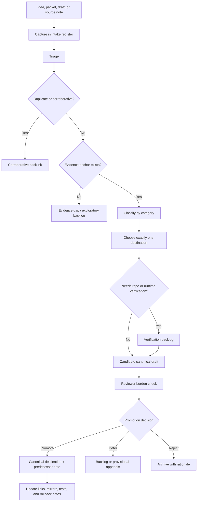

<!-- [KFM_META_BLOCK_V2]
doc_id: kfm://doc/NEEDS-VERIFICATION/docs-intake-canonicalization-policy
title: Canonicalization Policy
type: standard
version: v0.1
status: draft
owners: OWNER_TBD
created: 2026-05-16
updated: 2026-05-16
policy_label: NEEDS_VERIFICATION
related: [
  docs/intake/README.md,
  docs/intake/new-ideas-register.md,
  docs/intake/promotion-checklist.md,
  docs/reports/verification-backlog.md,
  docs/reports/contradiction-register.md,
  docs/archive/README.md,
  docs/doctrine/authority-ladder.md,
  docs/doctrine/truth-posture.md,
  docs/adr/
]
tags: [kfm, intake, canonicalization, governance, documentation-control]
notes: [
  PROPOSED first draft for docs/intake/canonicalization-policy.md,
  owner/path/link targets require mounted-repo verification before merge,
  this document governs idea canonicalization; it does not itself promote any idea
]
[/KFM_META_BLOCK_V2] -->

# Canonicalization Policy

This policy defines how KFM intake material moves from exploratory idea to reviewed canonical surface without becoming accidental authority.

> [!IMPORTANT]
> **Status:** `draft` / `PROPOSED`  
> **Owner:** `OWNER_TBD`  
> **Target path:** `docs/intake/canonicalization-policy.md`  
> **Truth posture:** CONFIRMED doctrine / PROPOSED process / UNKNOWN current repo implementation depth  
> **Core rule:** Canonicalization is a reviewed state transition, not a copy-paste operation.

**Quick jumps:** [Purpose](#purpose) · [Scope](#scope) · [Operating rules](#operating-rules) · [Canonicalization lifecycle](#canonicalization-lifecycle) · [Intake statuses](#intake-statuses) · [Classification categories](#classification-categories) · [Promotion criteria](#promotion-criteria) · [Reviewer burden](#reviewer-burden) · [Destination rules](#destination-rules) · [Conflict handling](#conflict-handling) · [Verification checklist](#verification-checklist) · [Rollback](#rollback)

---

## Purpose

KFM receives many useful ideas through notes, packets, drafts, architecture passes, source refresh suggestions, schema sketches, policy proposals, and implementation fragments. Some should become doctrine, ADRs, contracts, schemas, policies, runbooks, source descriptors, tests, or README updates. Many should remain exploratory or lineage-bearing.

This policy prevents three failure modes:

1. **Accidental canon** — a recent or repeated idea is treated as authority before review.
2. **Authority collision** — the same idea is promoted into multiple homes that drift apart.
3. **Implementation overclaim** — a packet-style proposal is described as current repo behavior without direct evidence.

Canonicalization answers four questions:

| Question | Required answer |
|---|---|
| What is the idea? | A concise, source-linked intake record. |
| What kind of change is it? | A controlled classification category. |
| Where would it belong if promoted? | Exactly one canonical destination, plus any generated mirrors. |
| What evidence and review burden does it require? | A promotion threshold and reviewer class. |

---

## Scope

This policy applies to:

- `New Ideas` packets and packet-like notes.
- Extracted doctrine from larger PDF reports.
- Source refresh proposals.
- Schema, contract, policy, validator, and fixture proposals.
- Workflow, watcher, automation, and runbook proposals.
- UI shell, Evidence Drawer, Focus Mode, map, tile, catalog, and release-surface proposals.
- Domain-lane expansion proposals.
- Repeated or corroborative ideas that need controlled deduplication.

This policy does **not** replace:

| Responsibility | Owning surface |
|---|---|
| Object meaning | `contracts/` |
| Machine-checkable shape | `schemas/` |
| Allow / deny / restrict / abstain logic | `policy/` |
| Source identity, rights, cadence, and sensitivity | `data/registry/` and source descriptors |
| Runtime or publication enforcement | validators, workflows, release gates, and proof objects |
| Structural repo decisions | ADRs and Directory Rules |

> [!NOTE]
> A `docs/intake/` page may explain the canonicalization path. It does not, by itself, make an idea canonical.

---

## Operating rules

### Canonicalization law

1. **Ideas enter through intake.** They do not bypass intake because they are long, recent, technically plausible, or repeated.
2. **Every promoted idea has one canonical destination.** Related surfaces may link to it, mirror it, or generate from it, but they must not evolve independently.
3. **Evidence outranks fluency.** Generated language, summaries, maps, tiles, graph projections, vector indexes, screenshots, dashboards, and scenes remain interpretive carriers.
4. **Repo evidence is required for repo behavior claims.** Prior reports and scaffolds are `LINEAGE` unless current repo files, tests, logs, workflows, emitted artifacts, or runtime traces confirm them.
5. **Promotion is review.** Moving an idea into doctrine, contracts, schemas, policy, runbooks, or release surfaces requires the reviewer burden defined below.
6. **Risk fails closed.** Rights-uncertain, sovereignty-related, cultural, archaeological, ecological, living-person, DNA, title, infrastructure, security-relevant, or sensitive-location ideas remain restricted, generalized, staged, or denied until policy allows release.
7. **Correction remains visible.** Supersession, rejection, rollback, and lineage notes must be recorded instead of silently deleting history.

### What canonicalization is not

Canonicalization is not:

- copying a packet into `docs/`;
- treating an idea as implemented because it has a repo-like path;
- counting duplicates as authority votes;
- creating a parallel schema, contract, policy, source, proof, receipt, or release home;
- publishing uncited claims;
- using AI-generated prose as root truth;
- skipping policy, sensitivity, rights, review, or rollback because the material is “only documentation.”

---

## Canonicalization lifecycle



---

## Intake statuses

| Status | Meaning | Allowed location | Exit condition |
|---|---|---|---|
| `captured` | Recorded but not yet assessed. | `docs/intake/new-ideas-register.md` | Initial triage complete. |
| `triaged` | Category, source, destination, duplication state, and evidence burden assigned. | `docs/intake/` | Promotion, deferral, rejection, or archive decision. |
| `corroborative` | Repeats or reinforces an existing idea without changing the canonical destination. | Intake register with backlink. | Linked to the stronger record, then closed or archived. |
| `duplicate` | Repeats an existing idea without new evidence or framing. | Intake register with rationale. | Linked and closed. |
| `evidence-gap` | Potentially important, but lacks an evidence anchor. | Verification backlog or exploratory archive. | Evidence supplied or idea deferred/rejected. |
| `repo-verify` | Depends on current repo/platform/runtime facts. | `docs/reports/verification-backlog.md` | Current repo evidence confirms, narrows, or rejects the claim. |
| `candidate-canonical` | Has a clear destination and sufficient evidence to draft toward canon. | Destination draft + intake backlink. | Review burden met. |
| `promoted` | Accepted into a canonical or implementation-bearing surface. | Repo-native owning path. | Predecessor note, links, and rollback target recorded. |
| `deferred` | Valid but not timely, not sufficiently grounded, or blocked by upstream work. | Backlog or intake register. | Re-triage later. |
| `archived-exploratory` | Useful as future pressure, not current authority. | `docs/archive/exploratory/` | Re-triage only with new evidence. |
| `lineage-only` | Historically useful, not active. | `docs/archive/lineage/` | None. |
| `rejected` | Out of scope, incompatible, unsafe, duplicate without value, or unsupported. | Intake register or archive with rationale. | None unless reopened with new evidence. |

---

## Classification categories

| Category | Use when the idea… | Canonical destination if promoted | Minimum evidence threshold |
|---|---|---|---|
| `doctrine` | Changes KFM operating law, truth posture, lifecycle law, trust membrane, or stable terminology. | `docs/doctrine/` or ADR. | Strong doctrine support and contradiction check. |
| `adr-candidate` | Makes a structural choice with durable repo consequences. | `docs/adr/` | Alternatives, consequences, rollback, and affected roots identified. |
| `source-refresh` | Adds or updates source/service facts, cadence, rights, endpoint behavior, source role, or attribution. | `docs/sources/` plus `data/registry/` source descriptors. | Authoritative source check and rights/sensitivity posture. |
| `schema-contract` | Defines or changes object meaning, machine shape, fixture expectations, or validator consequences. | `contracts/`, `schemas/`, `fixtures/`, validators. | Object-family owner review and test/fixture consequence. |
| `policy-gate` | Changes allow/deny/restrict/abstain logic, release gates, sensitivity handling, or obligations. | `policy/`, validator docs, tests, runbooks. | Policy owner review and fail-closed cases. |
| `workflow-automation` | Changes watchers, CI, ingest, transform, proof, attestation, compiler, or release automation. | `.github/`, `pipelines/`, `pipeline_specs/`, `tools/`, `docs/runbooks/`. | Workflow evidence or explicitly PROPOSED implementation plan. |
| `ui-shell` | Changes MapLibre shell, Evidence Drawer, Focus Mode, Story Nodes, review console, or trust-visible states. | `docs/architecture/`, app-local docs, UI contracts. | Trust-visible UX burden and no-public-raw-path check. |
| `domain-expansion` | Adds or widens a domain lane. | `docs/domains/` plus source descriptors, policy, schemas, fixtures. | Domain steward + policy review. |
| `implementation-note` | Captures narrow operational detail. | Lane-local README or runbook. | Affected owner review and no overclaiming. |
| `duplicate-corroborative` | Repeats accepted direction. | Intake backlink only. | Existing canonical destination identified. |
| `lineage-only` | Preserves historical context. | `docs/archive/lineage/`. | Preservation reason and “do not use for” note. |
| `exploratory` | Is useful but not ready or not promotable. | `docs/archive/exploratory/` or backlog. | Re-triage trigger recorded. |

---

## Promotion criteria

An intake item may be promoted only when all required checks pass.

### Required for every promotion

- [ ] The item is classified.
- [ ] The original source or note is linked.
- [ ] The destination is declared.
- [ ] The destination is the single canonical home for the promoted meaning.
- [ ] Duplicate/corroborative items are linked, not counted as extra votes.
- [ ] The item does not contradict stronger doctrine.
- [ ] The truth label is explicit where confidence matters.
- [ ] Any implementation claim is backed by direct repo/runtime evidence or remains visibly `PROPOSED`.
- [ ] The review burden class is assigned.
- [ ] A rollback, rejection, archive, or supersession path is identified.

### Required when the idea affects machine behavior

- [ ] Contract and/or schema consequence is identified.
- [ ] Fixture consequence is identified.
- [ ] Validator consequence is identified.
- [ ] Policy consequence is identified where allow/deny/release behavior changes.
- [ ] Compatibility or migration consequence is identified when an existing object changes.

### Required when the idea affects public or semi-public surfaces

- [ ] Evidence and citation behavior are defined.
- [ ] Rights and source-role posture are defined.
- [ ] Sensitivity posture is defined.
- [ ] Review state and release state are visible.
- [ ] Correction and rollback are defined.
- [ ] Public path does not bypass governed APIs, released artifacts, `EvidenceBundle` resolution, or policy decisions.

### Required when the idea is version-sensitive

- [ ] Refresh date is recorded.
- [ ] Source checked date is recorded.
- [ ] Version, endpoint, package, standard, or service dependency is marked `NEEDS VERIFICATION` until current authoritative evidence is checked.
- [ ] The promoted text avoids hard pins unless supported by current evidence.

---

## Reviewer burden

| Change class | Minimum reviewer burden | Why |
|---|---|---|
| Routine intake metadata | Intake/doc steward. | Does not change canon. |
| Exploratory archive change | Light documentation review. | Preserves history without authority. |
| Doctrine change | Architecture/canon steward review. | Affects system identity. |
| ADR candidate | Architecture/canon steward + affected root owner. | Changes durable repo structure or responsibility. |
| Contract/schema change | Contract/schema owner + policy-aware reviewer. | Changes object meaning, validation, or machine shape. |
| Policy/gate change | Policy owner + architecture reviewer. | Changes release/runtime admissibility. |
| Source registry/source refresh | Source steward + policy reviewer. | Affects source authority, rights, cadence, or admissibility. |
| Workflow/automation change | Ops/tooling owner + affected domain owner. | Can mutate lifecycle or proof behavior. |
| UI/shell payload change | Shell/UI owner + doctrine-aware reviewer. | Can weaken trust visibility. |
| Domain admission or expansion | Domain steward + policy reviewer. | Can widen publication and sensitivity burden. |
| Sensitive class | Relevant steward + policy owner + architecture/canon review. | Requires fail-closed handling and public-safety review. |

---

## Destination rules

### One idea, one canonical destination

Every promoted idea must resolve to one canonical destination. Cross-links are encouraged; parallel authority is not.

| If the promoted meaning primarily… | Destination |
|---|---|
| Explains doctrine or truth posture | `docs/doctrine/` |
| Chooses architecture with durable consequences | `docs/adr/` |
| Explains a human-facing process | `docs/runbooks/` or `docs/intake/` |
| Defines object meaning | `contracts/` |
| Defines machine shape | `schemas/` |
| Defines allow/deny/restrict/abstain behavior | `policy/` |
| Defines source identity, cadence, rights, or role | `data/registry/` and source descriptor docs |
| Defines emitted release, rollback, or correction behavior | `release/` plus related docs |
| Defines executable validation tooling | `tools/validators/` plus tests |
| Defines fixtures or golden examples | `fixtures/` or repo-confirmed fixture home |
| Defines a deployable runtime surface | relevant `apps/` README or architecture docs |
| Defines domain-lane guidance | `docs/domains/<domain>/` plus responsibility-root artifacts |

### Generated mirrors

A generated mirror may exist only when:

- the canonical source is named;
- the mirror is labeled `generated`, `mirror`, `legacy`, or `compatibility`;
- the mirror cannot evolve independently;
- the generation or synchronization path is documented.

### Path proposals

A proposed path in an intake item is not repo fact. It remains `PROPOSED` until Directory Rules, repo evidence, and any needed ADR confirm the destination.

---

## Duplicate and corroboration rules

Repetition can strengthen confidence, but it does not create authority by itself.

| Case | Handling |
|---|---|
| Same idea, no new evidence | Mark `duplicate`; link to existing record. |
| Same idea, stronger evidence | Mark `corroborative`; attach evidence to existing record. |
| Same idea, better wording | Preserve better wording as a proposed edit; do not create a new canon home. |
| Same idea, different destination | Surface as `CONFLICTED`; resolve through destination rules or ADR. |
| Same idea, incompatible with stronger doctrine | Reject or archive with rationale. |

---

## Conflict handling

| Conflict | Required handling |
|---|---|
| Intake item conflicts with KFM core invariants | Reject, narrow, or mark `CONFLICTED`; do not promote as written. |
| Intake item conflicts with stronger doctrine | Stronger doctrine wins; preserve the intake item as lineage or rejected with rationale. |
| Intake item conflicts with mounted repo evidence | Repo evidence controls current behavior; docs describe intended doctrine. |
| Intake path conflicts with Directory Rules | Mark `PROPOSED / CONFLICTED`; open drift or ADR path. |
| Contract/schema authority is unclear | Do not create parallel authority; propose ADR or defer. |
| Rights, sensitivity, sovereignty, cultural, ecological, archaeological, DNA, land/title, or living-person posture is unclear | Fail closed: restrict, generalize, quarantine, defer, or deny. |
| Version-sensitive source fact is stale or unverified | Mark `NEEDS VERIFICATION`; do not hard-pin as current. |
| AI-generated language introduces ungrounded certainty | Replace with evidence-bound wording or abstain. |

---

## Canonicalization record fields

Every intake record should preserve enough information to audit the decision later.

| Field | Required | Notes |
|---|---:|---|
| `intake_id` | Yes | Stable ID for the intake item. |
| `source_ref` | Yes | File, URL, packet, or evidence reference. |
| `captured_at` | Yes | Date recorded. |
| `summary` | Yes | One sentence. |
| `category` | Yes | Controlled category from this policy. |
| `status` | Yes | Controlled status from this policy. |
| `proposed_destination` | Yes | One canonical home or `NEEDS_VERIFICATION`. |
| `evidence_basis` | Yes | What supports the item. |
| `implementation_claim_level` | Yes | `none`, `PROPOSED`, `CONFIRMED`, `UNKNOWN`, or `NEEDS_VERIFICATION`. |
| `sensitivity_flags` | Yes | `none` or specific flags. |
| `review_burden` | Yes | Reviewer class. |
| `decision` | Yes | promote / defer / reject / archive / verify. |
| `decision_reason` | Yes | Short rationale. |
| `predecessor_or_duplicate_refs` | When applicable | Backlinks. |
| `rollback_or_supersession_ref` | When applicable | Required if promoted into implementation-bearing surfaces. |

---

## Verification checklist

Use this checklist before promoting any intake item.

- [ ] Source is linked and accessible to reviewers.
- [ ] Classification category is assigned.
- [ ] Status is assigned.
- [ ] Duplicate/corroborative check is complete.
- [ ] Destination is exactly one canonical home.
- [ ] Directory Rules basis is cited.
- [ ] Review burden is assigned.
- [ ] Truth label is correct.
- [ ] Repo/runtime claims are directly verified or downgraded to `PROPOSED` / `UNKNOWN`.
- [ ] Sensitive or rights-uncertain material fails closed.
- [ ] Contract/schema/policy/test consequences are identified when relevant.
- [ ] Public-surface consequences are identified when relevant.
- [ ] Rollback, archive, rejection, or supersession path is identified.
- [ ] Links from intake register, destination doc, and archive/lineage surfaces are updated.

---

## Definition of done

A canonicalization decision is complete when:

1. The intake record is updated.
2. The decision is reviewable from source to outcome.
3. The canonical destination is created or updated.
4. Duplicate and lineage sources point forward.
5. Any generated mirrors or dependent surfaces identify the canonical source.
6. Any required ADR, contract, schema, policy, fixture, validator, runbook, or release note is created or listed as required follow-up.
7. Rollback or supersession is possible without losing the source history.

---

## Rollback

Rollback is required when a canonicalization decision:

- promotes unsupported claims;
- weakens KFM truth posture;
- creates parallel authority;
- bypasses Directory Rules;
- breaks stable links without a migration note;
- exposes sensitive material prematurely;
- claims repo/runtime behavior without evidence;
- loses lineage or correction history.

Rollback action:

1. Revert the destination change.
2. Restore the intake record to the prior status.
3. Add a rollback note with reason and reviewer.
4. Preserve the failed promotion as lineage if it remains useful.
5. Add a contradiction or drift entry when the rollback reveals a structural problem.

Rollback target: `ROLLBACK_TARGET_TBD_AFTER_REPO_INSPECTION`

---

<details>
<summary><strong>Appendix A — Intake record template</strong></summary>

```yaml
intake_id: intake://NEEDS-VERIFICATION
source_ref: SOURCE_REF_TBD
captured_at: YYYY-MM-DD
summary: "One sentence summary."
category: doctrine|adr-candidate|source-refresh|schema-contract|policy-gate|workflow-automation|ui-shell|domain-expansion|implementation-note|duplicate-corroborative|lineage-only|exploratory
status: captured|triaged|corroborative|duplicate|evidence-gap|repo-verify|candidate-canonical|promoted|deferred|archived-exploratory|lineage-only|rejected
proposed_destination: PATH_TBD_AFTER_REPO_INSPECTION
evidence_basis:
  - SOURCE_ID_TBD
implementation_claim_level: none|PROPOSED|CONFIRMED|UNKNOWN|NEEDS_VERIFICATION
sensitivity_flags:
  - none
review_burden: REVIEW_BURDEN_TBD
decision: promote|defer|reject|archive|verify
decision_reason: "Rationale required."
predecessor_or_duplicate_refs: []
rollback_or_supersession_ref: ROLLBACK_TARGET_TBD
```

</details>

<details>
<summary><strong>Appendix B — Promotion decision note template</strong></summary>

```markdown
## Canonicalization decision

- Intake ID:
- Source:
- Category:
- Current status:
- Proposed destination:
- Evidence basis:
- Reviewer burden:
- Decision:
- Reason:
- Follow-up files:
- Rollback target:
- Supersedes / links:
```

</details>
