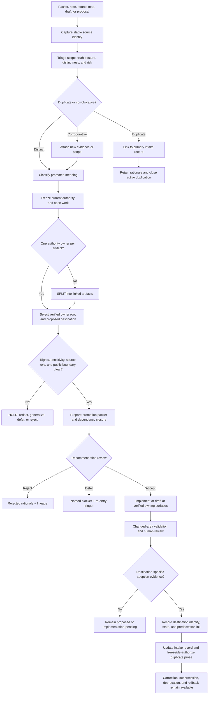

<!-- [KFM_META_BLOCK_V2]
doc_id: kfm://doc/intake/canonicalization-policy
title: Documentation-Intake Canonicalization — Authority, Destination, and Adoption Boundary
type: governance-guide
version: v2-draft
status: draft; repository-grounded; human-guidance; intake-only; non-authoritative; no-source-admission; no-release-effect
owners:
  - "@bartytime4life — verified CODEOWNERS review route only"
owner_status: "No accepted documentation-intake stewardship assignment, independent reviewer capacity, canonicalization authority, source-admission authority, release authority, reviewer quorum, or approval is implied."
created: 2026-05-16
updated: 2026-08-23
policy_label: repository-facing
owning_root: docs/
current_path: docs/intake/canonicalization-policy.md
responsibility: "Explain how non-authoritative documentation intake is identified, deduplicated, classified, routed to one verified responsibility owner, reviewed, adopted or rejected at its owning surface, and retained with correction and rollback lineage without creating contract, schema, policy, source, evidence, release, or publication authority."
truth_posture: "CONFIRMED current repository inventory, accepted Directory Rules placement authority, same-path fit, current promotion-lane contracts, placeholder sibling scaffolds, CODEOWNERS routing, and separate source/material and byte-canonicalization boundaries / PROPOSED canonicalization lifecycle, status crosswalk, classification vocabulary, review burden, record fields, and adoption evidence profile / CONFLICTED roles among three intake index/register surfaces / UNKNOWN operational enforcement, authenticated actors, accepted stewardship, machine canonicalization decision family, and external consumers / NEEDS VERIFICATION docs/intake lane classification, vocabulary adoption, and future machine support; cite-or-abstain"
evidence_snapshot:
  repository: bartytime4life/Kansas-Frontier-Matrix
  base_ref: main
  base_commit: 14e0719476f72e3781dd0d67decacf84601ee915
  target_prior_blob: f38582fa6aa84f2069d66a09ea6af502414e9165
  docs_intake_readme_blob: 35cc8f301be00526d3334f0778d65d52965a8687
  promotions_readme_blob: c6379a1dd445591cf0ab138ab811cf640e7afdeb
  idea_intake_blob: a02a346807897940752df7cc2fe8f55c86af9a78
  new_ideas_index_blob: c81db07c5f3de4c27f47d20447b3266bd7937b31
  new_ideas_register_blob: 94a13ec1e068cabd755a935d35ae2cd9423dd6ca
  triage_rules_blob: 4fc6c873815dbf6de14a0a2955b8b3ceb4c2cb8c
  promotion_criteria_blob: a542f5ea32c5a5e6ea666cdf216baa769f56066b
  directory_rules_blob: fd49a0b83e55cef52c1124281f093e263526898d
  directory_rules_decision: ADR-0029 accepted
  codeowners_blob: dd2a84aa514d8ecd9208bc347f90f9a2ed37dd61
  drift_register_blob: 5c5078b93c467e66f4cc8b86a7a696dbce5ae7e0
  verification_backlog_blob: 077c29c04ab6c45212ed0f4812aa176094923155
  standards_canonicalization_blob: dc1a945417e0abf6761ccb4980f03433d8e2ba64
inspection_boundary: >-
  Current-session GitHub reads of the target, docs/intake landing page and direct-child
  inventory, packet index and register surfaces, triage and promotion-criteria scaffolds,
  promotion parent lane, source/material intake policy boundary, byte-canonicalization
  guidance, accepted Directory Rules decision and bytes, governance guides, archive
  boundaries, registers, and CODEOWNERS. Repository search found no named
  CanonicalizationDecision family or open pull request modifying this target. No actor was
  authenticated, no intake recommendation was accepted, no canonical destination was
  adopted, no source was admitted, no policy was evaluated, and no promotion, release,
  deployment, publication, correction, withdrawal, or rollback was exercised.
related:
  - ./README.md
  - ./IDEA_INTAKE.md
  - ./NEW_IDEAS_INDEX.md
  - ./new-ideas-register.md
  - ./triage-rules.md
  - ./promotion-criteria.md
  - ./promotions/README.md
  - ./promotions/candidates/README.md
  - ./promotions/accepted/README.md
  - ./promotions/deferred/README.md
  - ./promotions/rejected/README.md
  - ./exploratory/README.md
  - ./carry-forward/README.md
  - ../archive/exploratory/README.md
  - ../archive/lineage/README.md
  - ../doctrine/directory-rules.md
  - ../doctrine/authority-ladder.md
  - ../doctrine/truth-posture.md
  - ../doctrine/evidence-first.md
  - ../doctrine/lifecycle-law.md
  - ../doctrine/policy-aware.md
  - ../doctrine/trust-membrane.md
  - ../adr/ADR-0029-adopt-directory-governance-standard-v2.md
  - ../governance/CONTRADICTION_HANDLING.md
  - ../governance/REVIEW_DUTIES.md
  - ../governance/SEPARATION_OF_DUTIES.md
  - ../governance/ESCALATION.md
  - ../governance/DEPRECATION_PROCESS.md
  - ../registers/DRIFT_REGISTER.md
  - ../registers/VERIFICATION_BACKLOG.md
  - ../standards/CANONICALIZATION.md
  - ../../policy/intake/README.md
  - ../../control_plane/root_registry.yaml
  - ../../.github/CODEOWNERS
tags: [kfm, docs, intake, canonicalization, adoption, authority, promotion-packet, lineage, governance, rollback]
notes:
  - "v2-draft is a same-path documentation-only reconciliation against current repository evidence."
  - "The exact canonical or compatibility classification of docs/intake/ remains NEEDS VERIFICATION because the adopted direct-child map does not enumerate the lane; this page does not decide that structural question."
  - "IDEA_INTAKE.md, NEW_IDEAS_INDEX.md, and new-ideas-register.md overlap in role. This page records the conflict and selects, renames, migrates, or deletes none."
  - "triage-rules.md and promotion-criteria.md remain placeholder scaffolds; this page does not silently upgrade them into adopted policy."
  - "candidate-for-promotion, candidate-canonical, accepted, promoted, canonicalized, and adopted are kept distinct through a PROPOSED human vocabulary crosswalk."
  - "Documentation-intake canonicalization is separate from pre-RAW source/material intake and from RFC 8785 JSON byte canonicalization."
  - "No contract, schema, policy, fixture, validator, workflow, registry record, receipt, proof, release object, dependency, runtime, deployment, publication, or repository setting changes."
[/KFM_META_BLOCK_V2] -->

<a id="top"></a>
<a id="canonicalization-policy"></a>

# Documentation-Intake Canonicalization Policy

> **Operating posture:** preserve the source, freeze the authority boundary, choose one responsibility owner for each promoted meaning, require destination-specific evidence and review, and never let an intake packet become authority merely by being copied, repeated, merged, or polished.

[](#status--authority)
[](#status--authority)
[](../adr/ADR-0029-adopt-directory-governance-standard-v2.md)
[](#2-scope-and-bounded-context)
[](#5-current-repository-surfaces)
[](#18-current-maturity--open-verification)
[](#status--authority)

> [!IMPORTANT]
> **Intake is not canon.** A source map, packet, index row, register row, promotion packet, accepted packet disposition, branch, pull request, merge, passing check, generated summary, or this page does not by itself adopt doctrine, accept an ADR, define contract meaning, select a schema, activate policy, admit a source, resolve evidence, authorize a lifecycle transition, release an artifact, or publish a claim.

> [!WARNING]
> **“Canonical” is always scoped.** KFM may have one authoritative human doctrine document for a decision, one semantic contract for an object family, one machine schema for a versioned shape, one policy source for a rule, one registry entry for a source identity, and one release record for a release. These are different authority domains. This policy does not create a universal file that outranks them.

> [!CAUTION]
> **Three different uses of “intake” and “canonicalization” are present in the repository.** This page governs human-readable documentation-idea intake only. [`policy/intake/`](../../policy/intake/README.md) describes pre-RAW source/material admissibility. [`docs/standards/CANONICALIZATION.md`](../standards/CANONICALIZATION.md) describes deterministic JSON bytes and hashing. Do not substitute one boundary for another.

## Status & authority

| Area | Current bounded result | Consequence |
|---|---|---|
| Tracked path | **CONFIRMED** at `docs/intake/canonicalization-policy.md` | Same-path update; no new path, move, rename, alias, or authority home. |
| Owning responsibility root | **CONFIRMED** `docs/` for human-readable process guidance | Contracts, schemas, policy, source records, evidence, code, and release objects remain in their own roots. |
| Same-path placement | `PLACE` under accepted ADR-0029 and the adopted Directory Rules | The file may be modernized without claiming the whole `docs/intake/` lane is ratified. |
| Exact `docs/intake/` lane classification | **NEEDS VERIFICATION** | The lane exists, but the adopted direct-child map does not enumerate it; this page cannot declare a structural answer. |
| Document status | **DRAFT / PROPOSED guidance** | Binding force exists only where the page accurately restates accepted higher authority or current repository evidence. |
| Review route | **CONFIRMED** `@bartytime4life` through CODEOWNERS | Routing is not stewardship assignment, independent review, approval, canonicalization authority, or release authority. |
| Packet/index surfaces | **CONFLICTED / HOLD** role boundary among `IDEA_INTAKE.md`, `NEW_IDEAS_INDEX.md`, and `new-ideas-register.md` | This page selects, renames, aliases, migrates, or deletes none. |
| Triage and promotion criteria | **CONFIRMED placeholder scaffolds** | Their short lists are inputs, not an adopted vocabulary or executable gate. |
| Promotion packet lanes | **CONFIRMED present**: candidates, accepted, deferred, and rejected | Packet disposition remains separate from destination adoption and release. |
| Machine decision family | **UNKNOWN / not found by bounded search** | No `CanonicalizationDecision` contract, schema, validator, or evaluator is claimed. |
| Operational enforcement | **UNKNOWN / HOLD** | No end-to-end service, workflow, reviewer roster, or platform control is claimed to enforce this page. |
| Release, deployment, publication | None | Documentation changes do not perform those transitions. |

**Quick navigation:** [Purpose](#1-purpose) · [Scope](#2-scope-and-bounded-context) · [Definitions](#3-definitions) · [Authority](#4-authority-order--state-separation) · [Repository surfaces](#5-current-repository-surfaces) · [Operating rules](#operating-rules) · [Lifecycle](#canonicalization-lifecycle) · [Statuses](#intake-statuses) · [Categories](#classification-categories) · [Eligibility](#9-candidate-eligibility--authority-freeze) · [Destination rules](#destination-rules) · [Evidence](#11-evidence-thresholds-by-destination) · [Promotion criteria](#promotion-criteria) · [Reviewer burden](#reviewer-burden) · [Conflict handling](#conflict-handling) · [Records](#15-canonicalization-record--adoption-evidence) · [Examples](#16-worked-examples) · [Verification](#verification-checklist) · [Maturity](#18-current-maturity--open-verification) · [Rollback](#rollback) · [Appendices](#appendix-a--authoring-template)

---

## 1. Purpose

KFM receives high-value material as PDFs, notes, source maps, architecture packets, “New Ideas” records, research summaries, issue proposals, implementation sketches, policy concepts, source-refresh suggestions, schema fragments, UI concepts, and generated syntheses. Preserving those inputs is useful. Treating them as authority before the correct owner reviews them is not.

This policy provides a human-reviewable method for answering six questions:

1. **What exactly was proposed, and where did it come from?**
2. **Is it distinct, corroborative, duplicate, contradicted, superseded, unsafe, or already implemented?**
3. **Which responsibility owns each promoted meaning or behavior?**
4. **What evidence and dependencies must be closed before that destination can be relied upon?**
5. **Which review or adoption act changes the destination’s state?**
6. **How will lineage, correction, supersession, deprecation, and rollback remain inspectable?**

The core rule is:

> **Canonicalization is a destination-specific, evidence-backed, reviewed state transition. It is not a copy-paste operation and not a synonym for merge.**

### Failure modes this policy prevents

| Failure mode | Example | Required posture |
|---|---|---|
| Accidental canon | A polished source map is cited as accepted architecture. | Keep it exploratory until the owning surface is reviewed. |
| Authority collision | The same object meaning evolves in both a packet and a contract. | One writable authority; packet becomes lineage/backlink only. |
| Role collapse | “Accepted packet” is described as “adopted policy.” | Separate packet disposition from destination adoption. |
| Implementation overclaim | A repo-shaped path in a PDF is described as current behavior. | Verify code/config/tests/runtime or label it `PROPOSED`. |
| Repetition as voting | Five packets repeat one claim and are counted as five approvals. | Cluster and corroborate; authority still requires the owning decision. |
| Hidden loss | A rejected or superseded packet is silently deleted. | Preserve rationale and forward lineage. |
| Public-boundary bypass | A documentation decision is treated as source admission or release. | Route through the real source, policy, evidence, review, and release gates. |
| Hash-truth collapse | A matching `spec_hash` is treated as proof the idea is correct. | Integrity supports review; it does not establish authority or truth. |

[Back to top](#top)

---

## 2. Scope and bounded context

### 2.1 In scope

This page applies to documentation-control material that may influence:

- doctrine, governance guidance, architecture, ADRs, standards, and runbooks;
- semantic contracts, machine schemas, fixtures, validators, tests, and policy;
- source documentation, source registry proposals, connector and watcher proposals;
- pipelines, packages, tools, applications, APIs, maps, Evidence Drawer, Focus Mode, exports, and review consoles;
- domain-lane expansion and cross-domain seam proposals;
- release, correction, deprecation, migration, and rollback guidance;
- repeated, conflicting, superseded, or lineage-bearing idea packets.

### 2.2 Out of scope

This page does not:

- ingest source payloads or decide pre-RAW admissibility;
- create or activate `SourceDescriptor`, `SourceActivationDecision`, or `SourceIntakeRecord` instances;
- define object semantics or machine schemas;
- evaluate allow, deny, restrict, redact, generalize, or abstain policy;
- canonicalize JSON bytes, RDF datasets, geometry, time, or identifiers;
- authenticate a reviewer, assign stewardship, or prove independence;
- move data through `RAW -> WORK / QUARANTINE -> PROCESSED -> CATALOG / TRIPLETS -> PUBLISHED`;
- approve a `PromotionDecision`, `ReleaseManifest`, correction, withdrawal, rollback, deployment, or publication;
- retire or delete a predecessor merely because a successor draft exists.

### 2.3 Bounded-context map

| Concept | Primary boundary | This page’s relationship |
|---|---|---|
| Documentation idea intake | `docs/intake/` | **Owned here as human guidance** |
| Source/material intake | [`policy/intake/`](../../policy/intake/README.md), source contracts, registry, connectors, ingest | Separate pre-RAW boundary |
| Byte/data canonicalization | [`docs/standards/CANONICALIZATION.md`](../standards/CANONICALIZATION.md), contracts, schemas, `packages/hashing/` | Separate deterministic-representation boundary |
| Placement | Accepted Directory Rules and ADR-0029 | Consumed; not amended |
| Object meaning | `contracts/` | Destination when semantic meaning is promoted |
| Machine shape | `schemas/contracts/v1/` | Destination when a versioned shape is promoted |
| Policy | `policy/` | Destination when admissibility behavior is promoted |
| Source identity and status | `data/registry/` and accepted source authorities | Never owned by a documentation packet |
| Executable behavior | `apps/`, `packages/`, `connectors/`, `pipelines/`, `tools/`, tests, workflows | Must be proved from implementation evidence |
| Release and correction | `release/` and governed accountability families | Separate state transition |
| Documentary archive | `docs/archive/exploratory/` and `docs/archive/lineage/` | Retention destinations after reviewed disposition |

> [!NOTE]
> Documentation intake and the data lifecycle share a discipline—explicit states, evidence, and reversible transitions—but they are not the same state machine. Do not describe a packet as RAW, PROCESSED, or PUBLISHED.

[Back to top](#top)

---

## 3. Definitions

| Term | Meaning in this policy | Non-effect |
|---|---|---|
| **Intake material** | A document, packet, note, source map, draft, or proposal preserved for review. | Not authority or implementation proof. |
| **Intake record** | A stable human-readable record linking source, summary, status, proposed destination, evidence, and disposition. | Not a source registry record or release record. |
| **Promotion packet** | A reviewable recommendation that a bounded proposal move toward work in one or more verified owning roots. | Does not perform adoption or implementation. |
| **Canonical destination** | The one responsibility owner permitted to define the promoted meaning or behavior for a stated scope. | Not necessarily one physical file; not a universal KFM canon. |
| **Canonicalization** | The reviewed act of binding an intake proposal to its verified owning surface and recording lineage. | Not byte serialization, hashing, merge, release, or publication. |
| **Adoption** | A destination-specific authority act: for example, an ADR becomes accepted or a contract version is approved through its governing process. | Packet acceptance alone is insufficient. |
| **Implementation** | Repository behavior supported by code/config/schema/tests/workflows or runtime evidence appropriate to the claim. | A plan or path-shaped example is not implementation. |
| **Corroborative input** | A source that strengthens or narrows an existing intake record without creating another authority vote. | Does not create a second canonical destination. |
| **Duplicate** | Material with no material new evidence, scope, or consequence. | Should not generate parallel work. |
| **Lineage** | Preserved history linking predecessor, decision, successor, and limitations. | Does not remain writable authority after supersession. |
| **Mirror** | A one-way, generated or compatibility projection from a named canonical source. | Must not evolve independently. |
| **Supersession** | An explicit later governed object replaces an earlier object for a defined scope while history remains visible. | Does not imply deletion. |
| **Deprecation** | A planned retirement process for a relied-upon surface. | Is not accomplished by an intake status or merge. |
| **Rollback** | A reviewed restoration or forward correction to a known prior state. | Must not erase lineage. |

### 3.1 “One destination” does not mean “one file”

A coherent implementation slice may require a contract, schema, fixture, validator, test, workflow, documentation, and migration note in one pull request. Each artifact still has one authority owner:

```text
semantic meaning       -> contracts/
machine shape          -> schemas/
synthetic examples     -> fixtures/
executable validation  -> tools/validators/
proof of behavior      -> tests/
orchestration          -> .github/workflows/
human explanation      -> docs/
```

The pull request is the review boundary. It is not the authority owner for every artifact inside it.

### 3.2 A canonical destination is scope-bound

The phrase “canonical destination” must identify:

- the authority domain;
- the object, decision, rule, or behavior;
- the version or scope;
- the owning responsibility root;
- the accepted decision or repository evidence supporting the placement;
- any predecessor, compatibility, or mirror relationship.

“Put it in the canonical folder” is not a sufficient placement decision.

[Back to top](#top)

---

## 4. Authority order & state separation

### 4.1 Authority order

Apply the current authority order before deciding a destination:

1. KFM trust, safety, lifecycle, evidence, public-boundary, correction, and rollback invariants.
2. Accepted, unsuperseded ADRs within their stated scope.
3. The adopted Directory Rules edition and its accepted machine projections.
4. Non-conflicting responsibility-root and adjacent README contracts.
5. Current repository code, configuration, schemas, tests, workflows, logs, and emitted artifacts for claims about current behavior.
6. Architecture manuals, source maps, packets, atlases, reports, and prior plans as design lineage.
7. Generic convention or personal preference.

A lower layer may supply a useful proposal. It may not silently override a higher authority.

### 4.2 Separate state axes

| Axis | Example states | What it proves |
|---|---|---|
| Documentation intake | captured, triaged, candidate-for-promotion, accepted, deferred, rejected, lineage-only | Review/routing state of the packet only |
| Destination adoption | proposed, accepted ADR, adopted doctrine, approved contract version, active policy rule | Authority state of the owning surface only |
| Repository delivery | local draft, workspace patch, branch, draft PR, ready PR, merged commit | How bytes were delivered |
| Source admission | unresolved, context-only, admitted, quarantined, denied | Whether a source/material may enter the governed lifecycle |
| Data lifecycle | pre-RAW, RAW, WORK/QUARANTINE, PROCESSED, CATALOG/TRIPLETS, PUBLISHED | State of governed data or knowledge objects |
| Review and policy | review pending/complete; allow/restrict/abstain/deny | Bounded review or policy result |
| Release and publication | candidate, held, released, corrected, withdrawn, rolled back | Public exposure and release state |

> [!IMPORTANT]
> A packet may be `accepted` while its proposed ADR remains `proposed`, its implementation remains absent, its source remains unadmitted, and its release state remains unchanged. Those results are compatible, not contradictory.

### 4.3 Current vocabulary crosswalk

The repository currently uses overlapping intake terms. The table below is **PROPOSED human guidance**, not a machine contract or adopted status registry.

| Observed term | Use in current repository | Recommended interpretation here |
|---|---|---|
| `captured` | Present in intake registers | Source/idea recorded; no review conclusion. |
| `triaged` | Present in intake registers and triage scaffold | Category, distinctness, destination pressure, and evidence burden recorded. |
| `candidate-for-promotion` | Current promotion-lane state | Packet is ready for recommendation review. |
| `candidate-canonical` | Older target/register language | Do not treat as a stronger state. Map to `candidate-for-promotion` or “proposed destination draft,” and state which meaning is intended. |
| `accepted` | Current promotion packet disposition | Recommendation accepted; substantive work still belongs in the verified owning path. |
| `promoted` | Present in older intake materials | Use only with a cited destination and destination state; never as a free-standing synonym for canonical or released. |
| `canonicalized` | Process result proposed by this guide | Source-to-destination lineage is closed and the owning surface’s own authority state is cited. |
| `adopted` | Destination-specific authority word | Use only when the actual governing process defines and records adoption. |
| `implemented` | Repository behavior claim | Requires current implementation evidence appropriate to the claim. |
| `released` / `published` | Release-state terms | Never inferred from intake, adoption, implementation, PR, or merge state. |

### 4.4 Finite intake disposition

A human reviewer should record one bounded packet disposition:

- `CONTINUE_TRIAGE`
- `RETURN_FOR_CORRECTION`
- `CANDIDATE_FOR_PROMOTION`
- `ACCEPT_RECOMMENDATION`
- `DEFER`
- `REJECT`
- `RETAIN_AS_EXPLORATORY`
- `RETAIN_AS_LINEAGE`
- `SPLIT`
- `HOLD`

These labels are authoring guidance only. They do not create a schema, policy result, or automated transition.

[Back to top](#top)

---

## 5. Current repository surfaces

### 5.1 Confirmed lane inventory

At the pinned evidence snapshot, `docs/intake/` has eleven direct children:

```text
docs/intake/
├── IDEA_INTAKE.md
├── NEW_IDEAS_INDEX.md
├── README.md
├── canonicalization-policy.md
├── cards/
├── carry-forward/
├── exploratory/
├── new-ideas-register.md
├── promotion-criteria.md
├── promotions/
└── triage-rules.md
```

This inventory proves path presence. It does not prove each child is canonical, mature, non-overlapping, or operationally enforced.

### 5.2 Index/register role conflict

| Surface | Current observed posture | Current bounded conclusion |
|---|---|---|
| [`IDEA_INTAKE.md`](./IDEA_INTAKE.md) | Filename suggests an intake template; H1 and body describe another “New Ideas Index.” | **CONFLICTED** with sibling index/register roles. |
| [`NEW_IDEAS_INDEX.md`](./NEW_IDEAS_INDEX.md) | Repository-grounded packet landing index. | Current narrative role is packet navigation and theme capture. |
| [`new-ideas-register.md`](./new-ideas-register.md) | Detailed exploratory packet ledger and triage records. | Current narrative role is row-level tracking. |
| [`README.md`](./README.md) | Records the collision and refuses to resolve it by assertion. | Governing local evidence boundary for this update. |

This policy does not choose a winner, create aliases, move content, or delete a path. Resolving the collision requires a separate, evidence-backed vocabulary and migration decision with consumer/link analysis.

### 5.3 Placeholder scaffolds

[`triage-rules.md`](./triage-rules.md) and [`promotion-criteria.md`](./promotion-criteria.md) are confirmed present but remain short placeholder scaffolds. This page may provide detailed guidance without silently upgrading either file into:

- adopted policy;
- a machine state vocabulary;
- a required-check contract;
- an operational reviewer queue;
- a promotion or release gate.

### 5.4 Promotion lanes

[`promotions/README.md`](./promotions/README.md) defines a human-reviewable bridge with four current child lanes:

- [`candidates/`](./promotions/candidates/README.md)
- [`accepted/`](./promotions/accepted/README.md)
- [`deferred/`](./promotions/deferred/README.md)
- [`rejected/`](./promotions/rejected/README.md)

Moving a packet between those directories records an intake-review disposition only. It does not perform the destination’s adoption, implementation, release, or publication transition.

### 5.5 Machine support boundary

A bounded repository search found no named `CanonicalizationDecision` object family. This page therefore does not claim:

- a canonical decision contract or schema;
- deterministic decision identity;
- a canonicalization evaluator;
- a packet validator;
- a duplicate detector;
- a destination resolver;
- a workflow that prevents parallel authority;
- required-check coupling;
- an operational review service.

Those may become future proposals only after the vocabulary, owner, necessity, and placement are reviewed.

[Back to top](#top)

---

## Operating rules

### Canonicalization law

1. **Capture before promotion.** Preserve the source identity and a bounded summary before substantive rewriting.
2. **Classify before placement.** Determine whether the material is doctrine, decision, semantics, shape, policy, source guidance, implementation, release guidance, lineage, or a composite.
3. **Freeze authority before mutation.** Inspect current main, accepted ADRs, Directory Rules, target bytes, adjacent owners, open work, and direct consumers.
4. **One authority owner per artifact.** Composite proposals are split across responsibility roots while remaining one reviewable implementation slice when their acceptance boundary is shared.
5. **One writable destination per meaning.** Related documents may link or generate mirrors; they may not evolve as rival authorities.
6. **Evidence outranks fluency and repetition.** A polished or frequently repeated proposal remains a proposal until destination-specific evidence and review close.
7. **Repo evidence controls current-behavior claims.** Plans and packets remain lineage unless code, config, schemas, tests, workflows, artifacts, logs, or runtime evidence support the claim.
8. **Rights and sensitivity fail closed.** Unknown rights, sovereignty, cultural authority, living-person data, DNA, archaeology, rare species, infrastructure, land/title, or harmful precision block promotion or require redaction, generalization, staged access, or denial.
9. **Review is proportionate and separate.** CODEOWNERS routing, a PR approval, a schema-valid fixture, or a passing workflow does not automatically become KFM governance or release approval.
10. **Lineage survives every disposition.** Duplicate, rejected, deferred, superseded, corrected, and rolled-back material retains an inspectable reason and forward link.
11. **Adoption is destination-specific.** The owning surface must record the state change under its own rules.
12. **Release remains separate.** No documentation canonicalization authorizes source activation, lifecycle promotion, release, deployment, publication, or public use.

### What canonicalization is not

Canonicalization is not:

- copying a PDF into `docs/`;
- renaming a packet to sound normative;
- treating the newest file as the winner;
- counting duplicates as approvals;
- merging a pull request;
- making an ADR `accepted` without the actual decision;
- creating a second contract, schema, policy, source registry, proof, receipt, catalog, or release home;
- changing a metadata `status` without supporting state evidence;
- turning a generated summary into evidence;
- using a hash match as proof of correctness;
- replacing a predecessor without supersession and rollback lineage;
- hiding rights or sensitivity gaps because the change is “only documentation.”

[Back to top](#top)

---

## Canonicalization lifecycle


```mermaid
flowchart TD
    A[Packet, note, source map, draft, or proposal] --> B[Capture stable source identity]
    B --> C[Triage scope, truth posture, distinctness, and risk]
    C --> D{Duplicate or corroborative?}
    D -->|Duplicate| E[Link to primary intake record]
    D -->|Corroborative| F[Attach new evidence or scope]
    D -->|Distinct| G[Classify promoted meaning]
    E --> Z[Retain rationale and close active duplication]
    F --> G
    G --> H[Freeze current authority and open work]
    H --> I{One authority owner per artifact?}
    I -->|No| J[SPLIT into linked artifacts]
    I -->|Yes| K[Select verified owner root and proposed destination]
    J --> K
    K --> L{Rights, sensitivity, source role, and public boundary clear?}
    L -->|No| M[HOLD, redact, generalize, defer, or reject]
    L -->|Yes| N[Prepare promotion packet and dependency closure]
    N --> O{Recommendation review}
    O -->|Reject| P[Rejected rationale + lineage]
    O -->|Defer| Q[Named blocker + re-entry trigger]
    O -->|Accept| R[Implement or draft at verified owning surfaces]
    R --> S[Changed-area validation and human review]
    S --> T{Destination-specific adoption evidence?}
    T -->|No| U[Remain proposed or implementation-pending]
    T -->|Yes| V[Record destination identity, state, and predecessor link]
    V --> W[Update intake record and freeze/de-authorize duplicate prose]
    W --> X[Correction, supersession, deprecation, and rollback remain available]
```

### Lifecycle invariants

- The intake source remains retrievable or has an approved source reference.
- The normalized summary never replaces the source.
- A promotion packet does not become the destination.
- The destination does not inherit authority from the packet.
- The destination’s own review or adoption evidence is required.
- Duplicate writable explanations are frozen, redirected, generated, or retired through a separate reviewed migration.
- Public reliance begins only through the appropriate evidence, policy, review, release, and governed-interface path.

### Re-entry

A deferred, rejected, or lineage-only item may re-enter triage only when a material trigger exists, such as:

- new evidence;
- a changed accepted decision;
- a resolved rights or sensitivity question;
- an available steward or reviewer;
- a closed dependency;
- a current implementation gap;
- a correction to a prior misunderstanding.

Re-entry must preserve the prior disposition rather than rewriting history.

[Back to top](#top)

---

## Intake statuses

Use one primary packet state and optional qualifiers. These are documentation workflow labels, not source, policy, lifecycle, or release outcomes.

| Primary state | Meaning | Default active home | Exit requirement |
|---|---|---|---|
| `captured` | Source and minimal summary recorded; not assessed. | Intake index/register. | Initial triage. |
| `triaged` | Scope, category, distinctness, evidence burden, destination pressure, and risk recorded. | Intake register or source map. | Packet disposition. |
| `candidate-for-promotion` | Recommendation is bounded enough for review. | `promotions/candidates/` or a linked candidate packet. | Accept, defer, reject, split, or return. |
| `accepted` | The recommendation was accepted for destination work. | `promotions/accepted/` with forward link. | Owning-surface work and destination-specific review. |
| `deferred` | A named checkable prerequisite remains unresolved. | `promotions/deferred/`. | Re-entry trigger satisfied. |
| `rejected` | Duplicate, unsupported, unsafe, conflicted, or out of scope. | `promotions/rejected/` or register rationale. | Reopen only with new evidence. |
| `exploratory-retained` | Useful design pressure but not an active promotion candidate. | Active intake or reviewed exploratory archive. | Future re-triage. |
| `lineage-only` | Historical context; not current proposal or authority. | Reviewed lineage archive. | Normally terminal. |

### Optional qualifiers

Use qualifiers to add information without inventing a second lifecycle:

- `duplicate`
- `corroborative`
- `clustered`
- `superseded`
- `blocked`
- `conflicted`
- `stale`
- `needs-verification`
- `withdrawn`

### Words that require an explicit referent

Do not write only “promoted,” “canonical,” “approved,” “accepted,” or “implemented.” State the subject and authority:

```text
Accepted intake recommendation: packet KFM-INTAKE-...
Proposed destination: contracts/example/example.md
Destination state: draft semantic contract
Repository delivery: draft PR #...
Release state: unchanged
```

[Back to top](#top)

---

## Classification categories

Use one primary category for each promoted meaning. A composite intake item may produce multiple linked artifacts after `SPLIT`.

| Category | Material question | Typical destination if reviewed | Minimum consequence review |
|---|---|---|---|
| `doctrine` | Does it change stable KFM operating law or truth posture? | `docs/doctrine/` or an ADR-backed successor | Contradiction and authority review |
| `governance-guidance` | Does it explain roles, review, escalation, correction, or process? | `docs/governance/` | Governance reviewer; no machine authority claim |
| `adr-candidate` | Does it choose among durable structural or architectural alternatives? | `docs/adr/` | Alternatives, consequences, migration, rollback |
| `architecture` | Does it explain cross-cutting system composition or boundaries? | `docs/architecture/` | Adjacent contract/runtime owners |
| `standard-guidance` | Does it explain a technical standard or interoperability profile? | `docs/standards/` | Current primary-source verification and implementation boundary |
| `runbook` | Does it describe an operator procedure? | `docs/runbooks/` | Preconditions, commands, failures, rollback |
| `semantic-contract` | Does it define object/interface meaning and non-effects? | `contracts/` | Contract owner and compatibility review |
| `machine-schema` | Does it define machine-checkable shape? | `schemas/contracts/v1/` or accepted versioned home | Schema validation, fixtures, migration |
| `policy-rule` | Does it change allow/deny/restrict/redact/generalize/abstain behavior? | `policy/` | Policy owner, negative cases, evaluator path |
| `source-guidance` | Does it explain source authority, terms, cadence, or limitations? | `docs/sources/` | Current authoritative source check |
| `source-registry` | Does it create or change source identity/admission state? | `data/registry/` plus governed source process | Source steward, rights, sensitivity, activation |
| `workflow-automation` | Does it change CI, watchers, ingest, transforms, compilation, proof, or release automation? | `.github/`, `pipelines/`, `pipeline_specs/`, `tools/` | Trigger, permissions, network, integrity, rollback |
| `runtime-or-library` | Does it implement reusable or deployable behavior? | `apps/`, `packages/`, `runtime/`, connectors | Code, tests, dependency and consumer review |
| `ui-or-map-surface` | Does it change public/steward interaction or trust visibility? | app/UI architecture and implementation roots | Accessibility, no-public-raw-path, evidence/policy states |
| `domain-expansion` | Does it widen a domain lane or public claim scope? | `docs/domains/<domain>/` plus dependency roots | Domain, source, policy, sensitivity review |
| `release-or-correction` | Does it define or execute release, withdrawal, supersession, correction, or rollback? | `release/` and accepted accountability homes | Release authority and operational evidence |
| `duplicate-corroborative` | Does it repeat or strengthen an existing direction? | Backlink to existing intake/destination | Distinctness and evidence delta |
| `exploratory` | Is it useful but not ready or not promotable? | `docs/intake/exploratory/` or reviewed archive | Re-triage trigger |
| `lineage-only` | Does it preserve prior thinking or superseded context? | `docs/archive/lineage/` | Preservation reason and “do not use for” note |

> [!NOTE]
> Destination paths in this table describe current responsibility patterns, not blanket authority to create every deeper path. Verify the current root contract, adjacent README, accepted ADRs, open work, and consumers before mutation.

[Back to top](#top)

---

## 9. Candidate eligibility & authority freeze

An item is eligible for promotion review only when the following minimum boundary is supportable.

### 9.1 Stable identity and source

- a stable intake ID;
- source filename, repository path, URL, digest, or resolvable evidence reference;
- captured date and source date where distinct;
- a bounded summary that does not replace the source;
- source rights and excerpt posture where source text is retained.

### 9.2 Distinctness and overlap

Before creating destination work:

- search current main for equivalent meaning, paths, object names, IDs, issues, branches, pull requests, and recent merges;
- identify whether the item is implemented, partial, absent, superseded, contradicted, blocked, duplicate, or needs verification;
- reconcile open work rather than creating a parallel branch or authority;
- record why the selected slice is distinct.

### 9.3 Authority freeze

Freeze and record:

- current `main` commit;
- target prior blob or absence;
- accepted ADRs and Directory Rules basis;
- owning root and adjacent README contract;
- relevant contract, schema, policy, registry, test, workflow, or runtime evidence;
- known writers and consumers;
- open overlapping work;
- rights, sensitivity, and public-exposure constraints.

If a required authority input is unresolved, return `HOLD` rather than inventing a destination.

### 9.4 Complete review boundary

A candidate must have:

- one observable outcome;
- one authority owner per artifact;
- directly necessary dependencies identified;
- non-goals;
- risk and materiality class;
- validation proportionate to the claim;
- before-merge abandonment path;
- after-merge revert or forward-correction path.

### 9.5 Non-compensable holds

No amount of polish, urgency, repetition, or feature value compensates for:

- parallel writable authority;
- unresolved rights or sensitivity;
- unsafe exact location or identity exposure;
- missing source/evidence support for a consequential claim;
- missing owner or required decision;
- an overlapping migration or pull request;
- an unaccepted ADR required for the change;
- no credible correction or rollback path;
- direct public access to internal or unreleased stores;
- hidden model or AI authority.

[Back to top](#top)

---

## Destination rules

### One authority owner per promoted artifact

Use the artifact’s responsibility, not its topic, producer, filename, or preferred import path.

| Promoted artifact primarily… | Owning responsibility root | Intake non-effect |
|---|---|---|
| explains stable doctrine | `docs/doctrine/` | Packet does not adopt doctrine. |
| records a durable decision | `docs/adr/` | Packet acceptance does not accept an ADR. |
| explains architecture or governance | appropriate `docs/` lane | Documentation cannot create machine authority. |
| defines semantic meaning | `contracts/` | Intake wording is not a contract. |
| defines versioned machine shape | `schemas/` | A schema example in a packet is not canonical shape. |
| defines policy behavior | `policy/` | A recommendation is not an allow/deny decision. |
| records source identity or admission | governed `data/registry/` and source authorities | Documentation cannot admit a source. |
| implements source retrieval | `connectors/` | A source map cannot activate a connector. |
| implements transformation | `pipelines/`, `pipeline_specs/`, packages/tools as appropriate | A flowchart is not runtime behavior. |
| implements reusable or deployable behavior | `packages/`, `apps/`, `runtime/`, `tools/` | A merged doc is not a deployed capability. |
| defines synthetic examples | `fixtures/` | Fixtures are not real evidence or public data. |
| proves bounded behavior | `tests/`, validators, workflows | Green checks prove only the named profile. |
| records receipts or proofs | accepted accountability homes | A packet cannot emit a real receipt or proof. |
| decides release, correction, withdrawal, or rollback | `release/` and accepted accountability homes | Intake cannot change exposure state. |
| stores lifecycle data | the correct `data/` lifecycle lane | Documentation intake is not a data lifecycle stage. |

### Composite proposals

Return `SPLIT` when one proposed file tries to own more than one authority. For example:

- an architecture essay plus normative JSON Schema;
- a source guide plus active source registry state;
- a runbook plus policy rules;
- a release guide plus a release decision;
- a UI document plus canonical EvidenceBundle semantics.

The resulting artifacts may still be delivered in one dependency-closed pull request when they share one observable acceptance boundary.

### Generated mirrors and compatibility copies

A mirror is permissible only when:

- the canonical source is named;
- generation or one-way synchronization is documented;
- the mirror is visibly `generated`, `compatibility`, `legacy`, or `read-only`;
- direct editing is prohibited or detected;
- consumers and exit criteria are recorded;
- correction and rollback are possible.

A hand-maintained copy with no owner or synchronization path is parallel authority, not a mirror.

### Proposed paths

A proposed path remains `PROPOSED` until:

- Directory Rules and any accepted ADR support it;
- the current repository does not already have a stronger owner;
- adjacent root/lane contracts allow it;
- overlap and consumer checks are complete;
- the implementation change is reviewed.

[Back to top](#top)

---

## 11. Evidence thresholds by destination

The evidence burden follows the claim and consequence.

| Destination claim | Minimum evidence before relying on it |
|---|---|
| “This packet exists” | Stable source identity or repository path. |
| “This packet proposes X” | Direct source passage or faithful bounded summary. |
| “This path exists” | Current repository tree or file read. |
| “This path owns X” | Accepted Directory Rules/ADR plus non-conflicting root contract. |
| “This document is adopted doctrine” | The actual accepted decision or governing status record. |
| “This contract defines X” | Current contract bytes and version/state. |
| “This schema validates X” | Current schema, validator behavior, fixtures, and exact execution evidence. |
| “This policy allows or denies X” | Accepted policy source, input profile, evaluator, and decision evidence. |
| “This source is admitted” | Governed source identity, rights/sensitivity, activation/admission decision, and registry state. |
| “The implementation does X” | Current code/config plus tests, workflows, or runtime/log evidence proportionate to the claim. |
| “The public UI exposes X safely” | Governed API/released carrier, evidence/policy state, UI tests, accessibility, and no-bypass evidence. |
| “The artifact is released or published” | Release decision, manifest/integrity, review, correction, rollback, and actual exposure evidence. |
| “A predecessor is retired” | Deprecation/migration/consumer closure and approved final disposition. |

### Evidence labels

Use the core truth labels:

- `CONFIRMED`
- `PROPOSED`
- `UNKNOWN`
- `NEEDS VERIFICATION`

Refine them when useful:

- `CONFLICTED`
- `LINEAGE`
- `SUPERSEDED`
- `STALE`
- `NARROWED`
- `INFERRED`
- `HOLD`

A commit proves bytes at a commit. It does not by itself prove correctness, authority, runtime behavior, security, compliance, deployment, release, or publication.

### EvidenceRef and EvidenceBundle

When a promoted public or consequential claim depends on evidence:

- identify the required `EvidenceRef`;
- require resolution to the applicable `EvidenceBundle` before authoritative presentation;
- keep policy, review, release, and correction state separate;
- return a narrowed claim, `ABSTAIN`, `DENY`, or `ERROR` when support cannot close.

A documentation packet may identify this requirement. It does not create or resolve the evidence objects.

[Back to top](#top)

---

## Promotion criteria

### Required for every recommendation

- [ ] Stable intake identity and source reference are present.
- [ ] The normalized proposal is faithful to the source.
- [ ] Current truth posture is explicit.
- [ ] Distinctness and overlap checks are recorded.
- [ ] Existing implementation is classified as implemented, partial, absent, superseded, contradicted, blocked, or needs verification.
- [ ] One authority owner is identified for each artifact.
- [ ] The proposed path is checked against accepted Directory Rules, ADRs, current repository evidence, and adjacent README contracts.
- [ ] Direct dependencies and non-goals are identified.
- [ ] Rights, sensitivity, privacy, sovereignty, and public-exposure posture are recorded.
- [ ] Review burden and repository review route are identified without inventing actors.
- [ ] Validation and negative/fail-closed cases are proportionate to risk.
- [ ] Before-merge abandonment and after-merge correction/rollback are defined.
- [ ] Packet disposition is kept separate from destination adoption, implementation, release, and publication.

### Additional requirements for machine behavior

- [ ] Semantic contract consequence is identified.
- [ ] Machine schema consequence is identified.
- [ ] Fixtures include positive and material negative cases.
- [ ] Validator behavior and finite outcomes are defined.
- [ ] Tests prove the declared boundary without vacuous success.
- [ ] Workflow triggers, permissions, network use, external actions, secrets, artifacts, and side effects are reviewed.
- [ ] Compatibility, migration, consumer, and generated-output consequences are closed.
- [ ] A passing check is not overstated as authority or release.

### Additional requirements for source-related proposals

- [ ] Source role is explicit and claim-relative.
- [ ] Current authoritative source information is checked.
- [ ] Rights, terms, attribution, access, cadence, and sensitivity are recorded.
- [ ] Source guidance is separated from registry/admission state.
- [ ] Connector execution is separated from source authority.
- [ ] Retrieval success is not treated as truth or public-use permission.

### Additional requirements for public or semi-public surfaces

- [ ] Governed API or released public-safe carrier is the normal client path.
- [ ] Evidence and citation behavior are defined.
- [ ] Review and release state are visible.
- [ ] Stale, conflicted, denied, unavailable, and citation-failure states are visible.
- [ ] Sensitive geometry or identity is transformed before rendering, not hidden only by style.
- [ ] Accessibility, mobile, low-bandwidth, and keyboard behavior are addressed where material.
- [ ] Correction, withdrawal, cache invalidation, rollback, and lineage are defined.

### Additional requirements for authority-changing work

- [ ] Required ADR or adoption decision is accepted before dependent implementation.
- [ ] Current writers and consumers are inventoried.
- [ ] Parallel authority is frozen.
- [ ] Migration phases and compatibility behavior are explicit.
- [ ] The authority decision and dependent implementation are not collapsed into one self-authorizing batch.
- [ ] Independent or specialist review is requested where significance requires it.

[Back to top](#top)

---

## Reviewer burden

The following matrix is **PROPOSED review guidance**. It does not authenticate reviewers or create a quorum.

| Change class | Minimum review focus | Current authority boundary |
|---|---|---|
| Routine intake metadata | Source link, status, no overclaim | Default CODEOWNERS route only |
| Duplicate/corroborative update | Distinctness, evidence delta, backlink | No second authority vote |
| Exploratory retention/archive | Rights-safe summary, rationale, re-entry trigger | Archive is not adoption |
| Human guidance update | Doctrine consistency, links, state separation, rollback | Documentation authority only |
| Doctrine or ADR candidate | Alternatives, affected roots, consequences, migration, rollback | Actual adoption decision separate |
| Contract/schema change | Meaning, shape, versioning, fixtures, validators, compatibility | Contract/schema owners and policy-aware review |
| Policy/gate change | Inputs, finite outcomes, deny paths, obligations, evaluator, rollback | Policy authority separate |
| Source guidance/registry | Source role, rights, sensitivity, cadence, activation state | Source steward and policy review |
| Workflow/automation | Trigger security, permissions, network, integrity, side effects, kill switch | Operations/tooling and affected owner |
| UI/map/public payload | Evidence/policy visibility, accessibility, no-bypass, public-safe geometry | UI owner plus doctrine/policy review |
| Sensitive-domain proposal | Relevant cultural/domain/sensitivity expertise and fail-closed handling | Specialist authority must be verified |
| Release/correction/retirement | Consumer impact, evidence, policy, review, signer/release authority, rollback | Separate release authority required |

### CODEOWNERS boundary

CODEOWNERS:

- routes GitHub review requests;
- does not prove a reviewer acted;
- does not prove independence;
- does not assign KFM stewardship;
- does not create a `ReviewRecord`;
- does not approve policy, source admission, release, publication, correction, or rollback.

### Review handoff minimum

A review handoff should identify:

- fixed subject and exact repository identity;
- intake source and normalized proposal;
- authority owner and destination;
- changed paths and direct dependencies;
- truth posture and residual unknowns;
- rights/sensitivity/public-boundary posture;
- validation performed and not performed;
- introduced versus inherited failures;
- rollback;
- the separate decision that remains.

[Back to top](#top)

---

## Conflict handling

### 14.1 General conflict rules

| Conflict | Required handling |
|---|---|
| Intake material conflicts with core invariants | Narrow, reject, or hold; do not promote as written. |
| Intake material conflicts with accepted doctrine or ADR | Higher authority wins for its scope; preserve the packet as lineage or rejected rationale. |
| Intake material conflicts with current implementation | Current evidence controls behavior claims; route intended-versus-actual drift. |
| Proposed path conflicts with Directory Rules | `HOLD`, `SPLIT`, `MIGRATE`, or `DENY`; do not invent a parallel home. |
| Two writable homes claim the same meaning | Freeze both as needed, record `CONFLICTED`, and require an authority/migration decision. |
| Contract and schema disagree | Do not choose by prose; route object-family and migration review. |
| Source role or rights are unclear | Quarantine, restrict, defer, abstain, or deny. |
| Version-sensitive fact is stale | Mark `NEEDS VERIFICATION`; recheck an authoritative source. |
| AI synthesis hides disagreement or certainty gaps | Reject or narrow the synthesis; preserve rival evidence. |
| Open branch/PR owns the same surface | Reconcile or stack; do not create independent overlapping work. |
| External consumers are unknown | Preserve compatibility or `HOLD` retirement until evidence closes. |

### 14.2 Current intake-role conflict

The roles of `IDEA_INTAKE.md`, `NEW_IDEAS_INDEX.md`, and `new-ideas-register.md` remain `CONFLICTED / HOLD`. A future resolution should:

1. inventory repository and external consumers;
2. define one packet landing index, one detailed register, and any template role;
3. choose stable identities and names;
4. preserve backlinks and history;
5. update all references atomically or through a compatibility phase;
6. record migration and rollback;
7. avoid deleting content solely to simplify the tree.

This page does not perform that resolution.

### 14.3 Structural drift routing

Use:

- [`DRIFT_REGISTER.md`](../registers/DRIFT_REGISTER.md) for observed disagreement or nonconformance;
- [`VERIFICATION_BACKLOG.md`](../registers/VERIFICATION_BACKLOG.md) for concrete unresolved checks;
- [`CONTRADICTION_HANDLING.md`](../governance/CONTRADICTION_HANDLING.md) for preserving and routing rival claims;
- an ADR when a durable authority or architecture choice is required;
- correction, supersession, deprecation, or rollback processes after an accepted/public state is affected.

### 14.4 Fail-closed reasons

Return `HOLD`, `ABSTAIN`, `DENY`, or `ERROR` as appropriate when:

- identity or scope cannot be reconciled;
- no verified authority owner exists;
- rights or sensitivity remain unclear;
- evidence cannot support the consequential claim;
- a required policy or review is unavailable;
- a migration would create parallel authority;
- an operational error prevents reliable evaluation.

These are different result families. An intake `HOLD` is not automatically a runtime `DENY` or public `ABSTAIN`.

[Back to top](#top)

---

## 15. Canonicalization record & adoption evidence

### 15.1 Human record fields

Every material intake decision should preserve enough information for a later reviewer to reconstruct the source-to-destination path.

| Field | Required | Purpose |
|---|---:|---|
| `intake_id` | Yes | Stable packet/idea identity. |
| `source_refs` | Yes | Original files, URLs, digests, repository paths, or evidence references. |
| `captured_at` | Yes | Intake record time. |
| `source_date` | When known | Date of the source, distinct from capture time. |
| `normalized_proposal` | Yes | Bounded faithful summary. |
| `truth_posture` | Yes | Confirmed/proposed/unknown/needs-verification split. |
| `packet_state` | Yes | Current documentation intake state. |
| `primary_category` | Yes | Classification from this guide or a cited successor vocabulary. |
| `distinctness` | Yes | New, duplicate, corroborative, conflicted, superseded, or already implemented. |
| `implementation_assessment` | Yes | Implemented, partial, absent, superseded, contradicted, blocked, or needs verification. |
| `target_owner_root` | Yes | Verified responsibility owner or `NEEDS VERIFICATION`. |
| `target_paths` | Yes | Proposed or verified owning artifacts. |
| `placement_basis` | Yes | Directory Rules/ADR/root-contract evidence and finite outcome. |
| `direct_dependencies` | Yes | Docs, contract, schema, policy, fixtures, tests, workflow, migration, runtime, release consequences. |
| `rights_sensitivity` | Yes | Public-safe summary and fail-closed obligations. |
| `review_route` | Yes | Verified GitHub route and required reviewer classes. |
| `validation_plan` | Yes | Changed-area and negative-path checks. |
| `packet_disposition` | Yes | Accept, defer, reject, split, retain, hold, or return. |
| `destination_state` | When work exists | Proposed, accepted, implemented, released, etc., with exact evidence. |
| `repository_delivery` | When work exists | Branch, commit, PR, merge identity. |
| `predecessor_duplicate_refs` | When applicable | Backlinks and clusters. |
| `supersession_deprecation_refs` | When applicable | Forward lineage and consumer transition. |
| `rollback` | Yes | Before-merge and after-merge path. |
| `residual_unknowns` | Yes | Concrete unresolved checks. |

### 15.2 What proves canonicalization closure

Documentation-intake canonicalization is closed only when all applicable evidence exists:

1. The source and intake record are stable and linked.
2. The owning responsibility and destination are verified.
3. The packet recommendation has a recorded disposition.
4. The substantive artifact exists at the owning surface.
5. The owning surface’s own review/adoption state is cited.
6. Direct dependencies are complete or explicitly outside the asserted claim.
7. Duplicate writable copies are frozen, generated, redirected, migrated, or retired through reviewed action.
8. Predecessor, source, intake, and destination point to one another.
9. Correction, supersession, deprecation, and rollback remain possible.
10. Release/publication state is separately stated.

### 15.3 What does not prove closure

None of the following is sufficient alone:

- a metadata block;
- a document status label;
- a source map;
- a promotion packet in `accepted/`;
- a pull request approval;
- a merge commit;
- a passing schema validator;
- a passing documentation build;
- a generated receipt;
- a matching hash;
- a release-shaped filename;
- a map layer or AI answer.

[Back to top](#top)

---

## 16. Worked examples

### Example A — doctrine proposal

**Source:** An exploratory packet proposes a new stable operating rule.

**Correct path:**

```text
packet -> intake record -> contradiction check -> candidate promotion packet
       -> proposed doctrine/ADR change -> destination review/adoption
       -> intake forward link -> predecessor/supersession record if needed
```

**Do not:** copy the packet into `docs/doctrine/` and label it accepted.

### Example B — contract plus schema

**Source:** A packet defines a new trust-object family and JSON shape.

**Disposition:** `SPLIT` by authority:

- meaning under `contracts/`;
- shape under `schemas/`;
- synthetic cases under `fixtures/`;
- validator under `tools/validators/`;
- proof under `tests/`;
- human source reconciliation under `docs/intake/exploratory/`.

These may be one dependency-closed PR. The contract is not made authoritative by the source map, and a schema-valid fixture is not a release decision.

### Example C — source refresh

**Source:** A packet records a new endpoint, cadence, or terms statement.

**Correct separation:**

- human source guidance may be updated after current authoritative verification;
- a source registry entry requires the governed source process;
- connector implementation requires its own code, fixtures, tests, security, and network review;
- activation/admission remains separate;
- retrieval does not imply evidence or public-use authority.

### Example D — UI concept

**Source:** A PDF proposes a new Evidence Drawer state.

The proposal can become architecture guidance only after reconciling current UI contracts and implementation. A public feature requires governed API/released-carrier behavior, evidence and policy state, accessibility, tests, and release closure. A screenshot or mock does not prove the feature exists.

### Example E — duplicate packet

**Source:** A later packet repeats an earlier recommendation without new evidence.

Mark it `duplicate`, link it to the primary record, preserve source identity, and close active duplication. Do not open another implementation branch merely because the packet has a later date.

### Example F — conflicting destination

**Source:** Two documents each claim to be the canonical home for the same schema.

Return `CONFLICTED / HOLD`. Freeze new parallel work, inspect accepted authority and consumers, and route an ADR or migration. Do not choose whichever filename looks more official.

### Example G — merged but not adopted

**Source:** A draft governance document merges to main.

State:

```text
Repository bytes: CONFIRMED merged
Document authority: draft/proposed
Operational enforcement: UNKNOWN
Release/publication: unchanged
```

Merge may be necessary repository evidence. It is not sufficient adoption evidence unless the governing process explicitly makes it so.

[Back to top](#top)

---

## Verification checklist

Use this checklist before recommending or recording canonicalization.

### Source and identity

- [ ] Source is retrievable or represented by an approved stable reference.
- [ ] Intake ID is stable.
- [ ] Source date, capture date, filename/path, and digest are distinguished where material.
- [ ] Summary is faithful and does not silently correct or expand the source.
- [ ] Rights permit the retained excerpt or summary.

### Distinctness and current evidence

- [ ] Current main is pinned.
- [ ] Target prior bytes or absence are pinned.
- [ ] Repository, issue, branch, PR, and recent-merge overlap is checked.
- [ ] Existing implementation maturity is classified.
- [ ] Duplicate and corroborative inputs are linked.
- [ ] Contradictions and stale claims are visible.

### Placement and authority

- [ ] Artifact kind and one authority owner are identified.
- [ ] Accepted Directory Rules and applicable ADRs are checked.
- [ ] Adjacent README/root contracts are checked.
- [ ] Proposed path is labeled accurately.
- [ ] Composite authority is split.
- [ ] No second writable authority is created.
- [ ] Required authority decision precedes dependent implementation.

### Trust and safety

- [ ] Source role is explicit where relevant.
- [ ] Rights, sensitivity, privacy, sovereignty, cultural authority, and harmful precision are assessed.
- [ ] Public clients remain behind governed interfaces and released public-safe carriers.
- [ ] AI/generated language remains interpretive and evidence-subordinate.
- [ ] Correction, supersession, deprecation, withdrawal, and rollback are possible.

### Implementation and validation

- [ ] Direct dependencies are closed.
- [ ] Non-goals are explicit.
- [ ] Validation is proportionate and repository-native.
- [ ] Negative and fail-closed cases are included where material.
- [ ] Hosted checks are reported separately from local validation.
- [ ] Introduced failures are distinguished from inherited failures.
- [ ] Green checks are not overstated.

### Review and handoff

- [ ] Review route is verified.
- [ ] Required reviewer classes are named without inventing identities.
- [ ] Packet disposition is explicit.
- [ ] Destination state is explicit and separately evidenced.
- [ ] Repository delivery state is explicit.
- [ ] Release/deployment/publication state is explicit.
- [ ] Residual unknowns and next checks are recorded.
- [ ] Before-merge and after-merge rollback are recorded.

[Back to top](#top)

---

## Definition of done

A documentation-intake canonicalization task is complete when:

1. The source and intake record remain inspectable.
2. The proposal’s scope and truth posture are explicit.
3. Distinctness, contradiction, and current implementation checks are complete.
4. Each artifact has one verified authority owner.
5. The packet has a recorded review disposition.
6. Substantive work exists only in verified owning roots.
7. Destination-specific review/adoption evidence is cited or the destination remains visibly proposed.
8. Direct dependencies, compatibility, consumers, and generated outputs are closed in proportion to the claim.
9. Duplicate and predecessor surfaces point forward and cannot silently diverge.
10. Rights, sensitivity, evidence, policy, public-boundary, correction, and rollback obligations are satisfied where relevant.
11. Repository delivery, adoption, implementation, release, deployment, and publication states remain distinct.
12. No history is erased to make the outcome look cleaner.

A task may be correctly complete as:

- `accepted recommendation; implementation not started`;
- `implementation merged; adoption pending`;
- `adopted destination; release not applicable`;
- `deferred with named blocker`;
- `rejected with preserved rationale`;
- `held because authority is conflicted`.

[Back to top](#top)

---

## 18. Current maturity & open verification

### 18.1 Confirmed current maturity

- The target and surrounding documentation-intake lane exist.
- Accepted ADR-0029 and the adopted Directory Rules govern responsibility-root placement.
- The target has a rebuttable same-path `PLACE` posture as human guidance under `docs/`.
- The lane has substantive index, register, exploratory, carry-forward, and promotion documentation.
- The promotion parent and four packet-state lane READMEs provide current human-review contracts.
- CODEOWNERS routes repository review to `@bartytime4life`.
- Source/material intake and byte canonicalization have separate repository guidance.
- Drift, verification, contradiction, review-duty, separation-of-duty, escalation, deprecation, exploratory archive, and lineage archive surfaces exist.

### 18.2 Confirmed limitations

- The exact canonical/compatibility classification of `docs/intake/` is not settled by the adopted direct-child map.
- Three intake index/register surfaces overlap in role.
- Triage and promotion-criteria files remain placeholders.
- Packet status vocabulary is not fully converged.
- No named machine `CanonicalizationDecision` family was found by bounded search.
- No accepted documentation-intake stewardship assignment or independent reviewer roster is established here.
- No operational service, evaluator, workflow gate, or required-check coupling is proved to enforce canonicalization end to end.
- Archive and lineage guidance itself contains mixed maturity and stale metadata; archive presence is not automatic disposition authority.

### 18.3 Open verification backlog

| Priority | Verification item | Required evidence | Safe current posture |
|---|---|---|---|
| P0 | Determine the accepted structural classification of `docs/intake/`. | Directory Rules/ADR review and root projection decision. | Same-path edits only; no new authority claim. |
| P0 | Reconcile `IDEA_INTAKE.md`, `NEW_IDEAS_INDEX.md`, and `new-ideas-register.md`. | Consumer/link inventory, role decision, migration, rollback. | `CONFLICTED / HOLD`. |
| P0 | Converge packet-state vocabulary. | Reviewed crosswalk or accepted contract if machine use is justified. | Use explicit scoped phrases. |
| P1 | Modernize `triage-rules.md` and `promotion-criteria.md`. | Separate same-path changes grounded in current parent contracts. | Keep them placeholder scaffolds. |
| P1 | Verify documentation-intake stewardship and independent-review needs. | Accepted assignments and actor identity. | CODEOWNERS routing only. |
| P1 | Decide whether machine packet/decision support is necessary. | Use cases, owner, contract/schema/policy placement, negative fixtures, consumers. | Do not create speculative machinery. |
| P1 | Establish duplicate-ID, backlink, and one-writable-copy checks if justified. | Deterministic profile and current repository-native tests. | Human review only. |
| P2 | Reconcile active intake with exploratory and lineage archives. | Entry criteria, stable IDs, retention, consumer links, rollback. | Preserve material in place. |
| P2 | Verify external consumers before rename, retirement, or deletion. | Repository and external dependency inventory. | Compatibility or `HOLD`. |
| P2 | Define review cadence and stale-state handling only if operational need is demonstrated. | Owner, workload, automation, escalation, correction. | No invented universal cadence. |

[Back to top](#top)

---

## Rollback

### Before merge

- Close or abandon the draft pull request.
- Leave `main` unchanged.
- Preserve the branch for review only when useful; do not present it as adopted policy.

### After an authorized merge

Use a transparent reviewed revert or forward correction. The prior target remains recoverable at Git blob:

```text
f38582fa6aa84f2069d66a09ea6af502414e9165
```

Rollback should:

1. restore the prior document bytes or apply a narrower correction;
2. preserve the pull-request and review history;
3. update any later links that depended on the revised anchors or wording;
4. record why the guidance was corrected;
5. avoid reviving stale claims that the repository was unavailable;
6. leave intake records and destination artifacts intact unless their own governing process authorizes a change.

No source, registry, contract, schema, policy, fixture, validator, workflow, data lifecycle object, receipt, proof, release, deployment, cache, or public artifact requires restoration for this documentation-only change.

### When rollback is mandatory

Rollback or forward correction is required when the update:

- claims authority it does not have;
- selects a conflicted index/register role by prose;
- collapses packet acceptance with destination adoption;
- creates or endorses a parallel authority home;
- weakens rights or sensitivity handling;
- implies source admission, policy, release, or publication;
- loses source or predecessor lineage;
- breaks stable links without migration support;
- misstates current implementation evidence.

[Back to top](#top)

---

## Appendix A — authoring template

This YAML is a human authoring aid. It is not a machine schema, accepted object family, policy input, or release record.

```yaml
intake_id: kfm://intake/<stable-slug>
source_refs:
  - kind: repository|file|url|evidence-ref
    value: <stable source identity>
    digest: <digest or NEEDS_VERIFICATION>
captured_at: <RFC3339 timestamp>
source_date: <date or UNKNOWN>
normalized_proposal: "<bounded faithful summary>"
truth_posture:
  confirmed:
    - <current evidence>
  proposed:
    - <recommended change>
  unknown:
    - <unresolved fact>
  needs_verification:
    - <concrete check>
packet_state: captured|triaged|candidate-for-promotion|accepted|deferred|rejected|exploratory-retained|lineage-only
primary_category: <classification>
distinctness:
  state: new|duplicate|corroborative|conflicted|superseded|already-implemented
  related_refs: []
implementation_assessment:
  state: implemented|partial|absent|superseded|contradicted|blocked|needs-verification
  evidence_refs: []
target_owner_root: <verified root or NEEDS_VERIFICATION>
target_paths:
  - path: <verified or proposed path>
    state: CONFIRMED|PROPOSED|NEEDS_VERIFICATION
placement:
  outcome: PLACE|SPLIT|MIGRATE|MIRROR|HOLD|DENY
  authority_refs:
    - <Directory Rules / ADR / root contract>
direct_dependencies:
  - <required companion artifact or explicit none>
rights_sensitivity:
  posture: public-safe|restricted|redacted|generalized|quarantine|deny|needs-verification
  obligations: []
review:
  github_route:
    - "@bartytime4life"
  required_classes:
    - <reviewer class>
  independence: NEEDS_VERIFICATION
validation_plan:
  - <repository-native changed-area check>
packet_disposition: CONTINUE_TRIAGE|RETURN_FOR_CORRECTION|CANDIDATE_FOR_PROMOTION|ACCEPT_RECOMMENDATION|DEFER|REJECT|RETAIN_AS_EXPLORATORY|RETAIN_AS_LINEAGE|SPLIT|HOLD
destination_state:
  state: proposed|accepted|implemented|released|not-applicable|unknown
  evidence_ref: <exact decision or repository identity>
repository_delivery:
  branch: <branch or not-started>
  commit: <sha or not-started>
  pull_request: <number or not-started>
  merged_commit: <sha or not-merged>
release_state: unchanged|candidate|held|released|corrected|withdrawn|rolled-back|not-applicable
predecessor_duplicate_refs: []
supersession_deprecation_refs: []
rollback:
  before_merge: "Close/abandon the draft and leave main unchanged."
  after_merge: "Reviewed revert or forward correction to the recorded prior state."
residual_unknowns: []
```

[Back to top](#top)

---

## Appendix B — promotion/adoption note template

```markdown
## Documentation-intake canonicalization record

- Intake ID:
- Source identity and digest:
- Normalized proposal:
- Truth posture:
- Packet state:
- Distinctness / overlap result:
- Current implementation assessment:
- Primary category:
- Authority owner:
- Proposed destination:
- Directory Rules / ADR basis:
- Placement outcome:
- Direct dependencies:
- Rights / sensitivity / public-boundary posture:
- Review route and required reviewer classes:
- Validation performed:
- Validation not performed:
- Packet disposition:
- Destination-specific state and evidence:
- Repository delivery identity:
- Release / deployment / publication state:
- Predecessor, duplicate, and successor links:
- Rollback:
- Residual unknowns:
```

[Back to top](#top)

---

## Appendix C — no-loss modernization ledger

| Prior section or idea | v2 disposition |
|---|---|
| Purpose and three failure modes | Preserved and expanded with role, repetition, hash, and public-boundary collapse. |
| Scope and exclusions | Preserved; bounded contexts for source intake and byte canonicalization added. |
| Canonicalization law | Preserved; authority freeze, one-owner-per-artifact, destination-specific adoption, and release separation added. |
| Lifecycle diagram | Replaced with a fuller review, split, hold, destination-adoption, and lineage flow. |
| Intake statuses | Preserved and reconciled to current promotion lanes; `candidate-canonical` ambiguity surfaced. |
| Classification categories | Preserved and expanded to current responsibility-root vocabulary. |
| Promotion criteria | Preserved; machine, source, public-surface, and authority-changing gates expanded. |
| Reviewer burden | Preserved; CODEOWNERS and current authority limitations made explicit. |
| Destination rules | Preserved; composite proposals, one-owner-per-artifact, and mirror controls clarified. |
| Duplicate/corroboration rules | Preserved in operating rules, lifecycle, and conflict handling. |
| Conflict handling | Preserved; current index/register conflict and drift-routing surfaces added. |
| Canonicalization record fields | Preserved and expanded with destination state, delivery, release, and residual unknowns. |
| Verification checklist | Preserved and expanded into source, distinctness, placement, trust, validation, and handoff groups. |
| Definition of done | Preserved; destination-specific adoption and non-terminal truthful outcomes added. |
| Rollback | Replaced placeholder with exact prior blob and bounded before/after-merge process. |
| Intake template | Preserved as a human aid and explicitly denied machine-authority status. |
| Promotion decision template | Preserved and expanded into a state-separated record. |
| Stale path/owner/repo-unavailable claims | Removed or corrected against current repository evidence. |
| Stale report/archive links | Replaced with current registers and archive lane paths. |

[Back to top](#top)
