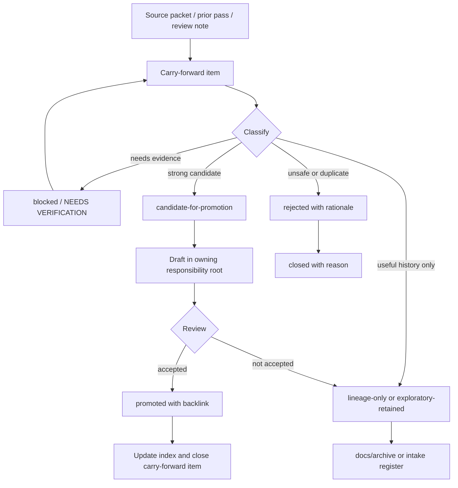

<!-- [KFM_META_BLOCK_V2]
doc_id: kfm://doc/NEEDS-VERIFICATION
title: Carry-Forward Intake
type: standard
version: v1
status: draft
owners: OWNER_TBD
created: 2026-05-16
updated: 2026-05-16
policy_label: public
related: [../README.md, ../new-ideas-register.md, ../canonicalization-policy.md, ../../archive/README.md, ../../doctrine/directory-rules.md]
tags: [kfm, docs, intake, carry-forward, documentation-control]
notes: [PROPOSED creation for docs/intake/carry-forward/README.md; confirm path, owners, neighboring links, and policy label before merge]
[/KFM_META_BLOCK_V2] -->

# Carry-Forward Intake

A controlled holding lane for KFM ideas, deltas, unresolved findings, and no-loss notes that must remain visible without becoming canon by accident.

> [!IMPORTANT]
> **Status:** experimental / PROPOSED  
> **Owner:** OWNER_TBD  
> **Path:** `docs/intake/carry-forward/README.md`  
> **Truth posture:** CONFIRMED doctrine / PROPOSED placement / UNKNOWN repo implementation depth


**Quick jumps:** [Scope](#scope) · [Repo fit](#repo-fit) · [Accepted inputs](#accepted-inputs) · [Exclusions](#exclusions) · [Carry-forward statuses](#carry-forward-statuses) · [Workflow](#workflow) · [Minimum item fields](#minimum-item-fields) · [Review checklist](#review-checklist) · [Rollback](#rollback)

---

## Scope

`carry-forward/` is for material that has already been captured somewhere in the KFM documentation stream but still needs a governed next step.

Carry-forward items are not canon. They are not implementation proof. They are not publication approvals. They are a visible queue for material that should not be lost while the maintainer decides whether it becomes doctrine, an ADR, a schema, a policy, a fixture, a runbook, a source descriptor, a release object, or archived lineage.

Use this lane to preserve continuity while keeping authority clean.

---

## Repo fit

| Field | Value |
|---|---|
| Responsibility root | `docs/` — human-facing documentation and governance explanation |
| Parent lane | `docs/intake/` |
| Proposed path | `docs/intake/carry-forward/README.md` |
| Upstream docs | `../README.md` — NEEDS VERIFICATION |
| Peer docs | `../new-ideas-register.md`, `../canonicalization-policy.md`, `../promotion-checklist.md` — NEEDS VERIFICATION |
| Downstream destinations | `../../doctrine/`, `../../adr/`, `../../architecture/`, `../../runbooks/`, `../../reports/`, `../../archive/`, `../../../contracts/`, `../../../schemas/`, `../../../policy/`, `../../../tests/`, `../../../fixtures/` — NEEDS VERIFICATION |
| Governing rule | Directory placement must encode responsibility, lifecycle, and authority; this README explains an intake process and therefore belongs under `docs/` unless mounted-repo evidence or an accepted ADR says otherwise. |

> [!NOTE]
> Relative links are intentionally listed for review. Confirm them against the mounted repository before merging.

---

## Accepted inputs

Carry-forward accepts reviewable, source-tied material that needs future action but is not ready for canon.

| Input | Belongs here when… | Required note |
|---|---|---|
| Prior pass deltas | A prior synthesis pass introduced a useful idea that was not promoted. | Source, pass, idea ID, and carry-forward reason. |
| New Ideas packet findings | A packet item needs classification, verification, or destination routing. | Packet date, source status, and proposed destination. |
| No-loss preservation notes | A strong prior idea must survive a rewrite, consolidation, or archive move. | What is preserved and what would be lost. |
| Open verification items | A check is concrete but not yet resolved. | Evidence needed, owner, and blocking consequence. |
| Contradiction follow-ups | A conflict needs routing before a drift or contradiction register entry. | Conflict summary and candidate register. |
| Promotion candidates | The item may become doctrine, schema, policy, README, ADR, runbook, fixture, or validator. | Target path marked `PROPOSED` until verified. |
| Rejected-but-useful lineage | The item is not current canon but remains useful context. | Archive destination and rationale. |

---

## Exclusions

Carry-forward must not become a shadow canon or a parallel implementation home.

| Do not store here | Send it instead to | Why |
|---|---|---|
| Current doctrine | `docs/doctrine/` | Doctrine is authority-bearing, not intake. |
| Accepted architecture decisions | `docs/adr/` | ADRs govern decisions and consequences. |
| Domain architecture docs | `docs/domains/<domain>/` | Domain docs belong in domain lanes after promotion. |
| Object meaning | `contracts/` | Contracts define semantic obligations. |
| Machine-readable schema shape | `schemas/contracts/v1/` | Schemas define machine-checkable shape. |
| Allow / deny / restrict / abstain rules | `policy/` | Policy decides admissibility and exposure. |
| Golden or negative test examples | `fixtures/` or `tests/` | Fixtures and tests prove enforceability. |
| Source descriptors | `data/registry/` or `data/registry/sources/` | Source identity, rights, sensitivity, and cadence are registry concerns. |
| RAW, WORK, QUARANTINE, PROCESSED, CATALOG, TRIPLET, or PUBLISHED data | `data/<phase>/` | Data lifecycle state is governed outside docs. |
| Release manifests, rollback cards, correction records | `release/` or proof/receipt homes | Publication is a governed state transition, not an intake note. |
| Runtime, app, or pipeline code | `apps/`, `packages/`, `tools/`, `pipelines/` | Implementation belongs under execution roots. |
| Sensitive exact-location or living-person details | Restricted governed lane, redacted summary, or DENY | Carry-forward is not a safe exposure surface. |

---

## Carry-forward statuses

Use this vocabulary so items do not drift into accidental authority.

| Status | Meaning | Default next action |
|---|---|---|
| `captured` | Recorded, not yet classified. | Assign category, source status, and owner. |
| `triaged` | Category, destination, and duplication state assigned. | Decide evidence threshold and review path. |
| `candidate-for-promotion` | Strong enough to draft toward a canonical home. | Create destination draft with backlink. |
| `promoted` | Canonized into the owning repo-native home. | Link final destination and close item. |
| `lineage-only` | Historically useful, not active. | Archive visibly with supersession note. |
| `exploratory-retained` | Useful but deliberately non-canonical. | Keep searchable; re-triage later if needed. |
| `rejected` | Out of scope, duplicate, unsafe, or incompatible. | Record rationale; avoid silent deletion. |
| `blocked` | Needs evidence, owner, rights check, policy decision, or repo inspection. | Add `NEEDS VERIFICATION` item. |

---

## Workflow



---

## Proposed local layout

This is a proposed shape, not confirmed repository state.

```text
docs/intake/carry-forward/
├── README.md
├── INDEX.md                         # PROPOSED human-facing queue index
├── items/                           # PROPOSED individual carry-forward notes
│   └── YYYY-MM-DD-short-slug.md
└── templates/
    └── carry-forward-item.md        # PROPOSED item template
```

Do not add `archive/`, `schemas/`, `policy/`, `fixtures/`, or `data/` under this directory. Those already have responsibility roots.

---

## Minimum item fields

Every carry-forward item should be searchable, reviewable, and reversible.

| Field | Required? | Notes |
|---|---:|---|
| `carry_forward_id` | Yes | Stable local ID, for example `CF-2026-05-16-001`. |
| `title` | Yes | Short, specific, and not promotional. |
| `status` | Yes | One of the statuses above. |
| `source_ref` | Yes | File, packet, pass, idea ID, or review note. |
| `source_status` | Yes | `CONFIRMED`, `LINEAGE`, `EXPLORATORY`, `PROPOSED`, `UNKNOWN`, or `NEEDS VERIFICATION`. |
| `normalized_statement` | Yes | One sentence, truth-labeled if needed. |
| `why_carry_forward` | Yes | What would be lost if this item disappeared. |
| `proposed_destination` | Yes | Mark `PROPOSED` until Directory Rules and repo paths are verified. |
| `evidence_needed` | Conditional | Required when status is `blocked` or `candidate-for-promotion`. |
| `policy_or_sensitivity_notes` | Conditional | Required for rights, archaeology, rare species, DNA, living persons, infrastructure, culturally sensitive material, or exact locations. |
| `owner` | Yes | Use `OWNER_TBD` if not known. |
| `next_action` | Yes | Concrete and checkable. |
| `rollback_or_close_rule` | Yes | How the item is closed, archived, or reverted. |

<details>
<summary>Suggested item template</summary>

```markdown
# CF-YYYY-MM-DD-001 — Short title

> [!IMPORTANT]
> **Status:** captured | triaged | candidate-for-promotion | promoted | lineage-only | exploratory-retained | rejected | blocked  
> **Owner:** OWNER_TBD  
> **Source status:** CONFIRMED | LINEAGE | EXPLORATORY | PROPOSED | UNKNOWN | NEEDS VERIFICATION  
> **Proposed destination:** PATH_TBD_AFTER_REPO_INSPECTION

## Normalized statement

PROPOSED: One sentence describing the item without overstating implementation.

## Source basis

| Source | What it supports | What it does not prove |
|---|---|---|
| `SOURCE_ID_OR_PATH_TBD` | Supports the idea, phrase, risk, or evidence need. | Does not prove current repo implementation. |

## Why carry forward

Explain what would be lost if this item disappeared.

## Review notes

- Evidence needed:
- Policy / sensitivity notes:
- Duplicate or lineage links:
- Candidate destination:
- Next action:

## Close rule

Describe how this item becomes `promoted`, `lineage-only`, `exploratory-retained`, or `rejected`.
```

</details>

---

## Promotion rules

A carry-forward item may be promoted only when the reviewer can answer these questions without guessing.

1. **What is the owning responsibility root?**  
   `docs/`, `contracts/`, `schemas/`, `policy/`, `tests/`, `fixtures/`, `data/`, `release/`, `tools/`, `pipelines/`, `apps/`, or another verified root.

2. **What claim is being promoted?**  
   Doctrine, architecture, schema shape, policy rule, validator, source descriptor, runbook, fixture, release note, or implementation task.

3. **What evidence supports it?**  
   A source, doc, fixture, test, workflow, emitted artifact, receipt, proof, or current repo evidence.

4. **What does the evidence not prove?**  
   Record limits explicitly.

5. **Does the item affect rights, sensitivity, public safety, release state, or correction paths?**  
   If yes, fail closed until policy review is complete.

6. **Does the target path create parallel authority?**  
   If yes, stop and open a drift entry or ADR path.

7. **Can rollback be explained?**  
   If not, do not promote.

---

## Review checklist

Use this before closing or promoting a carry-forward item.

- [ ] Source reference is present and inspectable.
- [ ] Status is one of the approved carry-forward statuses.
- [ ] Truth label is visible where uncertainty matters.
- [ ] Proposed destination follows Directory Rules or is marked `PROPOSED / NEEDS VERIFICATION`.
- [ ] No item claims current implementation without repo, test, workflow, runtime, receipt, or artifact evidence.
- [ ] Rights, sensitivity, source role, and public-release risks are visible.
- [ ] No public path bypasses EvidenceBundle, policy, review, release, correction, or rollback controls.
- [ ] Duplicate or lineage relationship is recorded.
- [ ] Close rule is clear.
- [ ] `INDEX.md` or the parent intake register is updated — NEEDS VERIFICATION.

---

## Common mistakes

| Mistake | Why it is unsafe | Safer handling |
|---|---|---|
| Treating recency as authority | New packets may be exploratory. | Use status and evidence threshold. |
| Copying a proposed path as if implemented | Path claims require repo inspection. | Mark `PROPOSED` or `NEEDS VERIFICATION`. |
| Promoting a source URL directly into a map layer | Source descriptors, rights, policy, and release state are missing. | Route through source intake and registry. |
| Turning a repeated idea into a stronger idea by count alone | Repetition is corroboration, not proof. | Preserve as lineage and cite strongest source. |
| Hiding rejected ideas | Maintainers lose why a direction was unsafe or duplicate. | Record rejection rationale. |
| Keeping sensitive detail in an intake note | Intake docs may be broadly visible. | Redact, generalize, stage access, or DENY. |

---

## Verification checklist

- [ ] Confirm `docs/intake/carry-forward/` exists or create it in the same PR.
- [ ] Confirm `docs/intake/README.md` exists and links here.
- [ ] Confirm whether `docs/intake/new-ideas-register.md`, `canonicalization-policy.md`, and `promotion-checklist.md` exist.
- [ ] Confirm doc owner and reviewers.
- [ ] Confirm whether the repository uses this exact KFM Meta Block v2 shape for README-like docs.
- [ ] Confirm `docs/archive/` destinations for lineage-only and exploratory-retained items.
- [ ] Confirm no machine-readable registry is being duplicated under `docs/intake/carry-forward/`.
- [ ] Confirm relative links.
- [ ] Confirm this README is linked from the docs landing page or parent intake README.
- [ ] Add or update drift/verification backlog entries for any unresolved path conflicts.

---

## Rollback

If this README is created in the wrong home, rollback is straightforward:

1. Remove `docs/intake/carry-forward/README.md`.
2. Remove links added from parent docs.
3. Preserve any created carry-forward items by moving them to the verified intake or archive destination.
4. Add a drift or verification-backlog note if the path conflict reveals a broader placement issue.

Rollback must not delete source evidence, lineage notes, or reviewer rationale unless the same information remains inspectable elsewhere.

---

## Maintainer notes

Carry-forward exists to keep KFM’s idea flow productive without weakening KFM’s trust posture.

Good carry-forward work is boring in the best way: source-tied, clearly labeled, easy to close, and impossible to mistake for published truth.

[Back to top](#carry-forward-intake)
