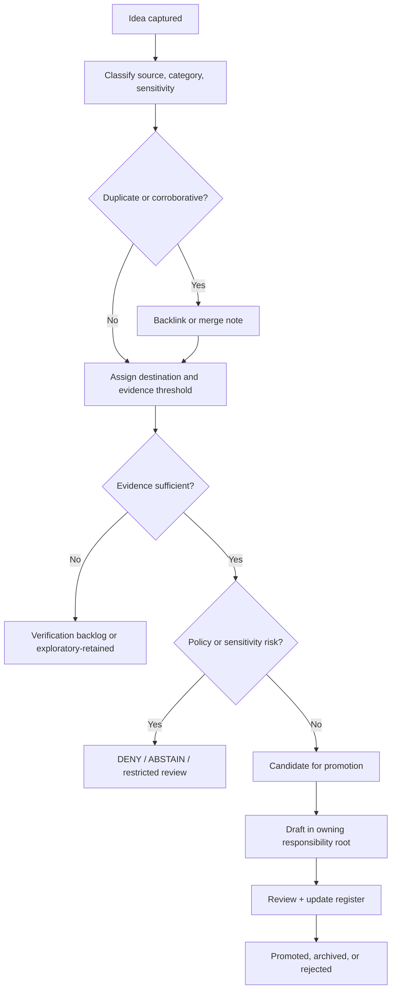

<!-- [KFM_META_BLOCK_V2]
doc_id: kfm://doc/NEEDS-VERIFICATION
title: Exploratory Intake README
type: readme
version: v0.1
status: draft
owners: Docs steward / OWNER_TBD
created: 2026-05-16
updated: 2026-05-16
policy_label: public
related: [../README.md, ../new-ideas-register.md, ../canonicalization-policy.md, ../../archive/exploratory/README.md, ../../doctrine/authority-ladder.md, ../../doctrine/truth-posture.md]
tags: [kfm, intake, exploratory, governance, documentation]
notes: [PROPOSED placement; verify path, owners, links, and policy label against mounted repo evidence before merge.]
[/KFM_META_BLOCK_V2] -->

# Exploratory intake

Active, non-canonical idea intake for exploratory KFM notes that still need classification, evidence review, routing, or retirement.


> [!IMPORTANT]
> **Status:** experimental / `PROPOSED` placement  
> **Owner:** Docs steward / `OWNER_TBD`  
> **Path:** `docs/intake/exploratory/README.md`  
> **Truth posture:** `CONFIRMED` doctrine / `PROPOSED` path / `UNKNOWN` repo implementation depth  
> **Badges:** static status badges only; they do **not** imply CI, release, policy enforcement, or deployment readiness.

## Quick jumps

- [Scope](#scope)
- [Repo fit](#repo-fit)
- [Accepted inputs](#accepted-inputs)
- [Exclusions](#exclusions)
- [Evidence posture](#evidence-posture)
- [Intake states](#intake-states)
- [Workflow](#workflow)
- [Directory tree](#directory-tree)
- [Record template](#record-template)
- [Review checklist](#review-checklist)
- [Definition of done](#definition-of-done)
- [Rollback](#rollback)
- [FAQ](#faq)

---

## Scope

`docs/intake/exploratory/` is the active waiting room for KFM ideas that are not ready to become doctrine, architecture, contract language, schema, policy, source registry entries, runbooks, release artifacts, or implementation tasks.

Material in this directory is useful because it preserves emerging ideas without granting them accidental authority.

Exploratory intake records may help maintainers decide:

- whether an idea is duplicate, corroborative, stale, sensitive, actionable, or out of scope;
- which responsibility root should own it after promotion;
- what evidence, policy, schema, contract, fixture, validator, source descriptor, or review burden it would create;
- whether the idea belongs in canon, archive, reports, backlog, or rejection notes.

> [!CAUTION]
> Exploratory intake is **not canon**. It does not prove current repo behavior, policy enforcement, workflow execution, source rights, source availability, implementation maturity, or public release readiness.

---

## Repo fit

| Surface | Relationship | Notes |
|---|---|---|
| `docs/intake/` | Parent intake lane | `NEEDS VERIFICATION`: should define the overall intake process, register, and routing policy. |
| `docs/intake/new-ideas-register.md` | Intake register | `NEEDS VERIFICATION`: should index exploratory records by source, class, status, owner, destination, and disposition. |
| `docs/intake/canonicalization-policy.md` | Promotion policy | `NEEDS VERIFICATION`: should define when an exploratory note may move toward canon. |
| `docs/doctrine/` | Possible destination | For doctrine-level material after review and authority placement. |
| `docs/architecture/` or `docs/adr/` | Possible destination | For architecture decisions or placement changes that need durable consequences. |
| `docs/domains/` | Possible destination | For domain-lane expansion notes after source, policy, and domain-owner review. |
| `contracts/` | Possible destination | For human-readable object-family meaning. |
| `schemas/contracts/v1/` | Possible destination | For machine-readable schema shape, subject to schema-home ADR and repo verification. |
| `policy/` | Possible destination | For allow / deny / restrict / abstain rules and policy tests. |
| `tools/`, `tests/`, `fixtures/` | Possible destination | For validators, verification helpers, and valid/invalid test material. |
| `data/registry/` | Possible destination | For governed source descriptors, source-family indexes, rights posture, and sensitivity records. |
| `docs/archive/exploratory/` | Downstream archive | For useful exploratory material retained after active intake closes. |
| `docs/archive/lineage/` | Downstream archive | For historically useful prior reports, packets, or superseded notes. |
| `docs/reports/verification-backlog.md` | Verification sink | For unresolved evidence needed before promotion. |
| `docs/reports/contradiction-register.md` | Conflict sink | For path, doctrine, source, or implementation conflicts discovered during triage. |

---

## Accepted inputs

Accepted inputs are exploratory records that need controlled review before they can affect KFM doctrine, implementation, publication, or public-facing behavior.

| Input type | Accepted here? | Required handling |
|---|---:|---|
| Dated “New Ideas” packet summary | Yes | Record source, date, category, status, destination, and evidence gap. |
| Source-watch idea | Yes | Mark source rights, freshness, API behavior, and endpoint details `NEEDS VERIFICATION`. |
| Schema or contract proposal | Yes | Route to `contracts/` or `schemas/contracts/v1/` only after schema-home and object-family review. |
| Policy / gate proposal | Yes | Identify finite outcomes, deny conditions, fixtures, and tests before promotion. |
| Workflow / automation proposal | Yes | Keep as `PROPOSED` until workflow YAML, toolchain, permissions, and failure behavior are verified. |
| UI / shell / MapLibre proposal | Yes | Confirm it does not make renderer, tiles, popups, screenshots, or AI output sovereign truth. |
| Domain expansion idea | Yes | Link to source-role, sensitivity, rights, and domain-owner review before promotion. |
| Implementation note | Yes | Route to lane README, runbook, tool doc, or backlog after evidence review. |
| Duplicate or corroborative note | Yes | Preserve as a backlink or merge note, not as an extra authority vote. |
| Unresolved contradiction | Yes | Send to contradiction register after intake triage. |

---

## Exclusions

These do not belong in active exploratory intake.

| Excluded material | Why not here | Correct route |
|---|---|---|
| Canonical doctrine | Exploratory intake cannot outrank doctrine. | `docs/doctrine/` or ADR. |
| Accepted architecture decision | Decisions need durable decision records and consequences. | `docs/adr/` or `docs/architecture/`. |
| Machine-readable schema | Schema authority must not split across docs prose. | `schemas/contracts/v1/…` after verification. |
| Contract meaning | Contract docs define object-family semantics. | `contracts/…`. |
| Policy bundle or Rego file | Policy belongs where deny/allow/restrict/abstain rules are enforceable. | `policy/…`. |
| SourceDescriptor or source registry entry | Source identity, rights, sensitivity, and authority need registry handling. | `data/registry/…` or `docs/sources/…` per repo convention. |
| Test fixture | Fixtures are proof-bearing, not exploratory prose. | `fixtures/…` or `tests/…`. |
| Validator code | Validators are implementation-bearing tools. | `tools/validators/…`. |
| Raw source data | Docs must not become lifecycle storage. | `data/raw/`, source edge, or quarantine path after source admission. |
| Published report | Reports are generated or review artifacts. | `docs/reports/…`. |
| Retired exploratory item | Closed exploratory records should not stay active forever. | `docs/archive/exploratory/…`. |
| Superseded lineage artifact | Lineage is preserved for history, not active triage. | `docs/archive/lineage/…`. |
| Sensitive exact-location or living-person data | Intake docs are not safe storage for sensitive payloads. | Restricted evidence flow, quarantine, redaction, or denial path. |

---

## Evidence posture

Exploratory records must use narrow truth labels.

| Label | Use in this directory |
|---|---|
| `EXPLORATORY` | Default for ideas not yet promoted. |
| `PROPOSED` | Design recommendation or path placement not verified in implementation. |
| `UNKNOWN` | Repo behavior, workflow behavior, runtime behavior, owner, route, test, or emitted artifact not inspected. |
| `NEEDS VERIFICATION` | Concrete evidence must be checked before action. |
| `LINEAGE` | Prior report, old packet, or historical rationale preserved without current authority. |
| `CONFLICTED` | Placement, doctrine, source, implementation, or terminology conflict needs register entry. |
| `DENY` | Public exposure or promotion is blocked by rights, sensitivity, safety, or policy. |
| `ABSTAIN` | Evidence is insufficient to make the claim. |
| `ERROR` | Process failed, required evidence is missing, or validation could not complete. |

Exploratory records must not say “the repo contains,” “the workflow enforces,” “the API emits,” “the policy denies,” or “the UI renders” unless direct repo, test, workflow, runtime, dashboard, log, or artifact evidence supports the claim.

Prefer:

- “The idea proposes…”
- “The packet suggests…”
- “Doctrine requires…”
- “Implementation remains `UNKNOWN`…”
- “Promotion would require…”

---

## Intake states

Use one primary state per exploratory record.

| State | Meaning | Exit condition |
|---|---|---|
| `captured` | Recorded but not yet classified, deduplicated, or routed. | Category and source status assigned. |
| `triaged` | Category, duplication state, destination, and evidence threshold assigned. | Review decides promote, retain, archive, reject, or verify. |
| `candidate-for-promotion` | Strong enough to draft toward canon or implementation-facing documentation. | Evidence threshold, owner, and affected surfaces confirmed. |
| `promoted` | Canonized into the owning repo-native surface. | Register entry updated; predecessor de-authorized or archived. |
| `exploratory-retained` | Useful but deliberately non-canonical. | Re-triage later or archive. |
| `lineage-only` | Historically useful but not active. | Move or link to lineage archive. |
| `rejected` | Out of scope, duplicate, incompatible, unsafe, or unsupported. | Rationale recorded; no active downstream work. |

Optional tags may add detail:

- `clustered`
- `corroborative`
- `duplicate`
- `sensitive`
- `rights-uncertain`
- `source-watch`
- `domain-expansion`
- `schema-pressure`
- `policy-pressure`
- `workflow-pressure`
- `ui-pressure`

---

## Workflow

Promotion is a governed decision. Moving or renaming a file by itself is not promotion.



### Maintainer steps

1. **Capture** the idea in the parent register or a short record file here.
2. **Classify** the idea using the controlled category list.
3. **Deduplicate** against existing intake, archive, doctrine, domain, contract, schema, policy, runbook, and report surfaces.
4. **Assign destination** by responsibility root, not by topic convenience.
5. **Identify evidence burden** before claiming implementation or publication consequence.
6. **Identify policy burden** when the idea touches rights, sensitivity, location precision, living people, DNA, archaeology, ecology, infrastructure, emergency context, or title/land assertions.
7. **Promote only through the owning surface** with review, backlinks, and register updates.
8. **Archive or reject** inactive records with rationale.

---

## Directory tree

`NEEDS VERIFICATION`: confirm this tree against the mounted repo before merge.

```text
docs/intake/exploratory/
├── README.md
└── YYYY-MM-DD-<slug>.md        # optional active exploratory record; PROPOSED convention
```

Use individual files only when a register entry is too dense for review. Lightweight items should remain in `../new-ideas-register.md` until they need their own record.

---

## Record template

Use this template for new exploratory records only when a standalone file is justified.

```yaml
---
title: "<short title>"
status: "captured | triaged | candidate-for-promotion | exploratory-retained | lineage-only | rejected"
truth_posture: "EXPLORATORY / PROPOSED / UNKNOWN"
date_captured: "YYYY-MM-DD"
source_ids: ["SOURCE_ID_TBD"]
source_status: "EXPLORATORY | LINEAGE | CONFIRMED doctrine | NEEDS VERIFICATION"
category: "doctrine | source-refresh | schema-contract | policy-gate | workflow | ui-shell | domain-expansion | implementation-note | duplicate | lineage"
proposed_destination: "PATH_TBD_AFTER_REPO_INSPECTION"
owner: "OWNER_TBD"
reviewers: ["Docs steward", "OWNER_TBD"]
sensitivity: "public | restricted | sensitive | NEEDS VERIFICATION"
evidence_needed: ["NEEDS VERIFICATION: <specific evidence>"]
policy_needed: ["NEEDS VERIFICATION: <specific policy check>"]
rollback_target: "ROLLBACK_TARGET_TBD"
---
```

### Minimum body

```markdown
## Summary

One paragraph describing the idea without promoting it to fact.

## Why it matters

Explain the governance, evidence, implementation, or publication pressure.

## Evidence basis

| Source | Status | Supports | Does not prove |
|---|---|---|---|
| `SOURCE_ID_TBD` | `EXPLORATORY` | Idea wording | Current implementation |

## Proposed destination

`PATH_TBD_AFTER_REPO_INSPECTION`

## Promotion burden

- [ ] Category assigned.
- [ ] Destination confirmed.
- [ ] Source support reviewed.
- [ ] Rights and sensitivity checked.
- [ ] Contract/schema/policy/test consequences identified if applicable.
- [ ] Backlink added to parent register.
```

---

## Review checklist

Before an exploratory record leaves this directory, confirm:

- [ ] It has one primary intake state.
- [ ] It has source identifiers or a documented source gap.
- [ ] It clearly separates source-grounded material from maintainer interpretation.
- [ ] It does not claim current repo implementation without repo evidence.
- [ ] It names the proposed destination responsibility root.
- [ ] It identifies whether the idea affects doctrine, contract, schema, policy, source registry, tool, pipeline, UI, release, archive, report, or test surfaces.
- [ ] It identifies sensitivity, rights, and public-release implications.
- [ ] It records duplicate or corroborative relationships.
- [ ] It records the next evidence needed.
- [ ] It has a rollback or retirement path.
- [ ] It updates the parent intake register.

---

## Definition of done

An exploratory intake item is done when it reaches one of these end states:

| End state | Done means |
|---|---|
| `promoted` | Owning surface contains the promoted content; intake entry links to successor; exploratory source is de-authorized or archived. |
| `exploratory-retained` | Retention reason and re-triage date are recorded. |
| `lineage-only` | Moved or linked to lineage archive with preservation reason and successor, if any. |
| `rejected` | Rationale recorded; no active downstream work remains. |
| `verification-backlog` | Specific missing evidence is recorded in the verification backlog. |
| `contradiction-register` | Conflict is recorded with affected paths, claims, and next check. |

This directory is healthy when active records are few, statuses are current, destinations are explicit, and no exploratory record is treated as canon.

---

## Rollback

This README is documentation-control scaffolding. Its rollback path is intentionally simple:

1. Remove or revert this README if mounted repo evidence proves the path is wrong.
2. Preserve any exploratory records by moving them to the corrected intake or archive path with backlinks.
3. Update the parent intake register and contradiction or drift register if the path was wrong.
4. Do not delete evidence-bearing notes without a successor link or explicit rejection rationale.

Rollback target: `ROLLBACK_TARGET_TBD_AFTER_REPO_INSPECTION`

---

## FAQ

### Is exploratory intake the same as archive?

No. Exploratory intake is active triage. Archive is retained history. A record should leave active intake when it is promoted, rejected, retained for future re-triage, or converted to lineage.

### Can a “New Ideas” packet be cited from here?

Yes, but only as exploratory or lineage support unless current repo evidence, accepted doctrine, or reviewed artifacts promote the idea. Repeated packets are corroboration, not extra authority votes.

### Can implementation tasks start from an exploratory record?

Only after the record names its owning responsibility root and identifies evidence, policy, contract, schema, fixture, validator, and rollback consequences where relevant.

### Can sensitive details be stored here?

No. Use redaction, generalization, restricted evidence flow, quarantine, or denial. Intake may record that sensitivity exists; it should not store sensitive payloads.

### Does a file move promote an idea?

No. Promotion is a governed state transition recorded through review, successor links, and the owning repo-native surface.

---

## Appendix: controlled category list

Use the narrowest category that fits.

| Category | Typical destination after promotion |
|---|---|
| `doctrine` | `docs/doctrine/` or ADR |
| `source-refresh` | `docs/sources/`, `data/registry/`, source descriptors |
| `schema-contract` | `contracts/`, `schemas/contracts/v1/`, fixtures, validators |
| `policy-gate` | `policy/`, policy tests, validator docs |
| `workflow` | `.github/`, `docs/runbooks/`, `tools/`, `pipelines/` |
| `ui-shell` | `docs/architecture/`, `apps/`, `web/`, `ui/`, `packages/ui/` after repo verification |
| `domain-expansion` | `docs/domains/`, source descriptors, lane admission checklist |
| `implementation-note` | Lane-local README or runbook |
| `duplicate` | Intake backlink, then archive or rejection |
| `lineage` | `docs/archive/lineage/` |
| `exploratory-retained` | `docs/archive/exploratory/` |
