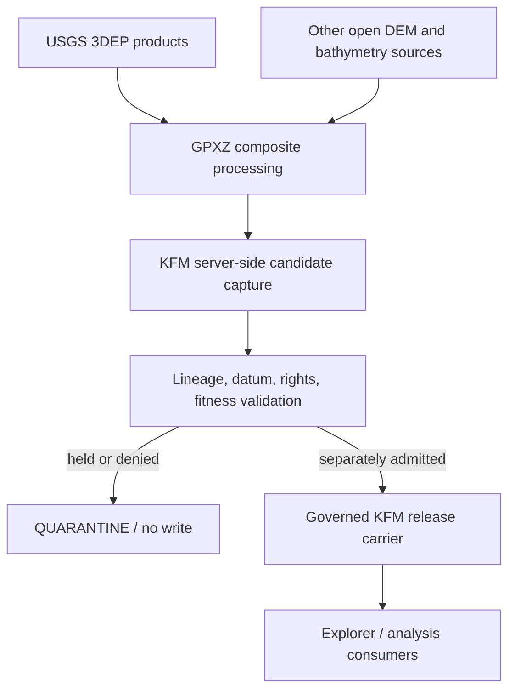

<!-- [KFM_META_BLOCK_V2]
doc_id: kfm://docs/intake/exploratory/gpxz-elevation-service-source-map-20260914
title: GPXZ Elevation Service — KFM Source Map and Admission Boundary
type: exploratory-source-map
version: v0.1
status: exploratory-retained; hold
owners:
  - Docs steward / OWNER_TBD
  - Terrain source steward / OWNER_TBD
  - Rights and sensitivity steward / OWNER_TBD
created: 2026-09-14
updated: 2026-09-14
policy_label: public
truth_posture: cite-or-abstain
repository_pin: bartytime4life/Kansas-Frontier-Matrix@6c5be18cf8448654be95a6db688d98546cd5276e
related:
  - docs/intake/exploratory/README.md
  - docs/intake/exploratory/living-atlas-deep-time-to-present-source-map-20260910.md
  - docs/sources/catalog/usgs/3dep-elevation.md
  - connectors/usgs/3dep/README.md
  - docs/adr/ADR-0012-connector-outputs-to-data-raw-or-data-quarantine-only.md
  - docs/adr/ADR-0017-source-descriptor-admission-process.md
  - docs/doctrine/directory-rules.md
tags: [kfm, intake, exploratory, elevation, terrain, dem, gpxz, usgs-3dep, maplibre, source-admission]
notes:
  - GPXZ is evaluated as a commercial, derived elevation carrier and source aggregator, not as sovereign terrain truth.
  - No account, credential, paid plan, live elevation request, source admission, connector, registry entry, runtime binding, release, deployment, or publication is created by this record.
[/KFM_META_BLOCK_V2] -->

# GPXZ Elevation Service — KFM source map and admission boundary

> **Decision:** retain GPXZ as an exploratory, server-side elevation lookup and comparison candidate. Keep USGS 3DEP as KFM's preferred authoritative Kansas terrain family. GPXZ is not a substitute for direct 3DEP acquisition, source-specific lineage, vertical-datum control, evidence closure, or release.

| Field | Current disposition |
|---|---|
| Intake state | `exploratory-retained` |
| Promotion state | `HOLD` |
| Candidate role | Derived carrier / corroborating or context service |
| Primary Kansas terrain authority | USGS 3DEP remains preferred; this record does not alter its status |
| Browser access | `DENY` for direct GPXZ calls or embedded credentials |
| Server-side evaluation | `PROPOSED`, bounded, non-sensitive, credential-authorized only |
| Source activation | Not authorized |
| Public release | Not authorized |

## Why this placement is logical

GPXZ exposes a convenient global elevation API over point, sampled-path, GeoTIFF, raw-raster, and RGB terrain-tile interfaces. Its dataset is not a single observation product: GPXZ says it layers many open sources, fills holes, normalizes vertical values to EGM2008, blends neighboring rasters, processes Copernicus surface data to reduce vegetation/building bias, and applies source-specific corrections. For the United States, the published attribution includes USGS 3DEP.

That makes GPXZ useful for operational convenience and comparison, while making it unsuitable as a silent replacement for KFM's source-specific 3DEP lineage. A response can be high resolution and still be a derived service result whose vertical datum, capture interval, source selection, interpolation, dataset version, terms, and upstream license must remain visible.

The standalone exploratory record is justified because the candidate creates cross-cutting source-identity, credential, privacy, quota, commercial-dependency, lineage, vertical-datum, raster, and browser-delivery questions. It does not establish a new responsibility root or connector home.

## Source-grounded facts

| Surface | Confirmed from GPXZ | KFM interpretation |
|---|---|---|
| Dataset | Global composite terrain; high-resolution lidar where available; Copernicus GLO-30 fallback; bathymetry optionally included | Derived composite, not one homogeneous measurement surface |
| Current dataset version | `2025.1`; API responses expose `X-DATASET-VERSION`, and raster metadata exposes `GPXZ_DATASET_VERSION` | Dataset version is mandatory provenance, never an optional debug field |
| Vertical reference | Elevations normalized to EGM2008 (`EPSG:3855`) | Direct comparison or substitution is held until the 3DEP product's vertical datum and any transformation are explicit |
| Point coordinates | Geographic coordinates in EPSG:4326 | Coordinate order, parsed values, precision, and transformation lineage must be retained |
| Point results | Elevation, coordinate, `data_source`, approximate resolution, and capture-date bounds | Preserve every field; do not collapse approximate resolution into vertical accuracy |
| Batch/path API | Up to 512 returned points per request; POST supported | Prefer POST for governed batches; bound size deterministically |
| Raster API | Cloud-optimized GeoTIFF; standard endpoint is 10–2500 px per dimension; raw-raster is under 5 km per dimension | Candidate fixture/extract surface only; preserve actual bounds, projection, tags, source IDs, and hashes |
| Terrain tiles | RGB DEM tiles in Terrarium or Mapbox encoding; TileJSON is available | Useful MapLibre compatibility signal, but direct client use is denied under KFM's public-client boundary |
| Source metadata | Unauthenticated `/v1/elevation/sources` returns provider, source URL, attribution, license, resolution, and capture dates | Snapshot and bind this catalog to each evaluated dataset version and observed `data_source` ID |
| Authentication | API key; production guidance prefers the `x-api-key` header | Secret-manager/server boundary only; never commit, log, export, or render the key |
| Rate behavior | 429 responses and rate-limit headers; free daily limits are hard while paid daily limits are described as soft | Budget requests, record rate headers, use bounded backoff, and fail visibly |
| Privacy | Cloudflare proxies requests; New Relic EU request logs are retained for 31 days; URLs and IPs may be logged, while request bodies and headers are not described as logged | Exact sensitive AOIs are not eligible; prefer POST bodies and header authentication for approved public-safe coordinates |
| Terms | Caching is allowed; GPXZ disclaims correctness; customers remain responsible for source-data licenses; service/terms may change | Cache only with recorded terms/version; KFM must perform its own rights, fitness, and change review |

Official sources inspected on 2026-09-14:

- [GPXZ product and plan overview](https://www.gpxz.io/)
- [Getting started, authentication, rate limits, regions, errors, and units](https://www.gpxz.io/docs)
- [Dataset composition, EGM2008 normalization, methodology, and version](https://www.gpxz.io/docs/dataset)
- [Point and sampled-path API](https://www.gpxz.io/docs/api-reference-points)
- [GeoTIFF and raw-raster API](https://www.gpxz.io/docs/api-reference-raster)
- [RGB terrain tiles and TileJSON](https://www.gpxz.io/docs/api-reference-tiles)
- [Source metadata API](https://www.gpxz.io/docs/api-reference-meta)
- [Upstream data attribution, including USGS 3DEP](https://www.gpxz.io/credit)
- [Terms](https://www.gpxz.io/terms)
- [Privacy](https://www.gpxz.io/privacy)

These are mutable web pages. Their current wording supports this research checkpoint, not perpetual terms or endpoint validity.

## KFM source hierarchy

The diagram is a proposed trust flow, not evidence that a GPXZ connector or release exists. Public clients may consume only a separately reviewed KFM carrier or governed API result; they do not call GPXZ directly.

## Allowed and denied uses

| Candidate use | Disposition | Reason |
|---|---|---|
| Public-safe point or route elevation comparison against directly acquired 3DEP | `PROPOSED / HOLD` | Useful corroboration after datum, dataset version, source ID, rights, and fitness are explicit |
| Small, non-sensitive GeoTIFF fixture for adapter and metadata tests | `PROPOSED / HOLD` | Suitable for a bounded replay packet after account/credential and terms authority exists |
| Cross-check of source coverage and approximate resolution | `PROPOSED / HOLD` | Must use observed source IDs and dates rather than marketing-level coverage claims |
| Direct GPXZ tiles in the public Explorer | `DENY` | Conflicts with no-direct-upstream public-client posture; credentials/TileJSON can be exposed and upstream bytes are unreleased |
| API key in URL, repository, style JSON, permalink, browser storage, logs, or reports | `DENY` | Credential and logging risk |
| Exact archaeological, rare-species, protected-infrastructure, private-land, or other sensitive coordinates | `DENY` | Third-party transmission and request logging violate fail-closed sensitivity posture |
| Engineering, flood-elevation, legal, cadastral, or life-safety conclusion | `DENY` | GPXZ disclaims correctness; resolution is not accuracy; controlling product/datum/fitness evidence is required |
| Treating a GPXZ value as an original 3DEP observation | `DENY` | Composite normalization, interpolation, merging, and possible source switching break that equivalence |
| Silent fallback from direct 3DEP to GPXZ | `DENY` | Fallback must change provenance and truth state visibly |
| Google Elevation compatibility as a transparent swap | `HOLD` | Compatibility can hide GPXZ-specific source, version, rights, and capture metadata |

## Proposed server-side adapter contract

No path is created here. If admission work later authorizes an implementation, the source-specific connector home must be confirmed under accepted Directory Rules and the existing `connectors/` responsibility root. The adapter should:

1. accept only an already-resolved, current source activation decision and a secret reference;
2. send the key in `x-api-key`, never in a query string;
3. use POST bodies for approved batch/path coordinates when supported;
4. reject sensitive or insufficiently classified coordinates before network access;
5. set explicit timeouts, bounded retry/backoff, concurrency, request size, and quota budgets;
6. retry only transient/service and 429 conditions; do not retry other 4xx requests blindly;
7. hash exact response bytes and a canonical request description that excludes secrets and protects coordinates;
8. capture endpoint region, retrieval time, HTTP status, response MIME type, rate-limit headers, `X-DATASET-VERSION`, source IDs, capture-date bounds, approximate resolution, CRS, vertical datum, units, interpolation, bathymetry mode, requested and returned bounds, and GeoTIFF tags;
9. join every observed source ID to the version-pinned `/v1/elevation/sources` snapshot and preserve its producer, URL, attribution, license, and dates;
10. write payload candidates only to governed RAW or QUARANTINE and process memory only through the receipt surface;
11. emit no catalog, EvidenceBundle, release, tile/style manifest, public API response, or publication state;
12. return finite `READY`, `HOLD`, `DENY`, `ABSTAIN`, or `ERROR` outcomes with deterministic reason codes.

Suggested reason codes for a later contract review:

- `GPXZ_AUTHORITY_MISSING`
- `GPXZ_SECRET_MISSING`
- `GPXZ_SENSITIVE_COORDINATES_DENIED`
- `GPXZ_DATASET_VERSION_MISSING`
- `GPXZ_SOURCE_LINEAGE_UNRESOLVED`
- `GPXZ_VERTICAL_DATUM_UNRESOLVED`
- `GPXZ_RIGHTS_UNRESOLVED`
- `GPXZ_RATE_LIMITED`
- `GPXZ_UPSTREAM_ERROR`
- `GPXZ_RESPONSE_INVALID`
- `GPXZ_FITNESS_UNSUPPORTED`

These identifiers are proposals, not current contract enums.

## Vertical datum and comparison rule

GPXZ `2025.1` reports EGM2008 heights. KFM's USGS 3DEP lane already treats vertical datum, horizontal CRS, geoid model, and units as gate-critical. Therefore:

- never subtract, merge, mosaic, contour, shade, or substitute GPXZ and 3DEP values without identifying both vertical references;
- preserve any transformation grid/model, software version, parameters, and uncertainty;
- label GPXZ resolution as horizontal support, not vertical accuracy;
- preserve interpolation choice (`nearest` or `bilinear`) and do not present a smoothed value as an observed return;
- classify a GPXZ raster or tile as derived/modelled context even when its reported `data_source` is a 3DEP product.

## Tile and MapLibre boundary

GPXZ's Mapbox and Terrarium encodings are technically compatible with MapLibre terrain and hillshade workflows. That is an integration capability, not authorization to add a live upstream URL.

The GPXZ TileJSON response can include the API key in its tile URL, and ordinary tile clients reveal map-request patterns. The KFM path is therefore one of:

1. **Preferred:** server-side, bounded acquisition followed by KFM validation, manifest binding, rights review, and immutable released terrain carriers; or
2. **Exception requiring separate review:** a governed backend proxy with scoped credentials, coordinate/sensitivity policy, quota controls, response provenance, cache policy, and visible upstream/error states.

Until one path is accepted and implemented, Explorer integration remains `DENY`.

## Minimum evaluation packet

A later evaluation may proceed only with explicit account/credential authority and should remain small:

- one version-pinned `/v1/elevation/sources` snapshot;
- a few public, non-sensitive Kansas test points selected to exercise distinct observed source IDs or resolutions without claiming statewide coverage;
- one short public route/profile request;
- at most one small public-safe raster extract;
- direct 3DEP comparison material for the same support where available;
- vertical-datum reconciliation or an explicit `HOLD`;
- response headers, exact byte hashes, request receipts, terms/privacy snapshots, quota use, and cost estimate;
- offline replay fixtures containing only cleared, non-sensitive data;
- negative fixtures for missing version, unresolved source ID, incompatible datum, malformed response, 429, other 4xx, 5xx, quota exhaustion, secret leakage, and sensitive coordinates.

The packet must not use the free evaluation tier for production or imply statewide accuracy from a few points.

## Promotion gates

- [ ] Product/source owner and rights/sensitivity stewards assigned.
- [ ] Provider account, credential custody, budget, and cancellation responsibility approved.
- [ ] Current terms, privacy, service location, retention, quota, and commercial-use rights recorded.
- [ ] Exact Kansas source coverage observed from responses and source metadata rather than inferred from national marketing text.
- [ ] Every source ID resolved to a pinned metadata record and upstream attribution/license.
- [ ] Direct 3DEP versus GPXZ role decision accepted.
- [ ] Horizontal/vertical datum, units, interpolation, bathymetry, accuracy/fitness, and uncertainty rules accepted.
- [ ] Sensitive-coordinate policy and server-side enforcement proven before network access.
- [ ] Connector path and source identity reviewed without creating parallel 3DEP authority.
- [ ] SourceDescriptor and activation decision separately reviewed and current.
- [ ] RAW/QUARANTINE-only handoff, receipts, offline fixtures, validators, negative cases, and rollback verified.
- [ ] Any public consumer uses only a release-bound KFM carrier or governed API with finite no-data/stale/denied/error states.
- [ ] Independent review and release authority recorded.

## Current disposition and next action

`EXPLORATORY_RETAINED / HOLD / VALIDATED_BRANCH_ONLY`

The next bounded action is an owner decision on whether the convenience and coverage benefits justify a commercial provider dependency and credentialed evaluation. If yes, authorize only the minimum evaluation packet above. If no, retain this document as a comparison record and continue the direct USGS 3DEP path; Open Topo Data may be evaluated separately as GPXZ's referenced open-source server lineage, but it is not automatically equivalent to the hosted dataset or terms.

## Non-effects and rollback

This record does not create or authorize a GPXZ account, API key, subscription, endpoint call, connector path, source ID, SourceDescriptor, activation decision, source capture, rights decision, registry entry, contract/schema enum, policy rule, EvidenceBundle, release manifest, runtime layer, direct browser request, deployment, promotion, publication, or incident closure.

Before integration, rollback is to abandon the unmerged branch. After a separately authorized integration, revert this single exploratory documentation file. No source data, secret, dependency, account, runtime, or release state requires rollback.
