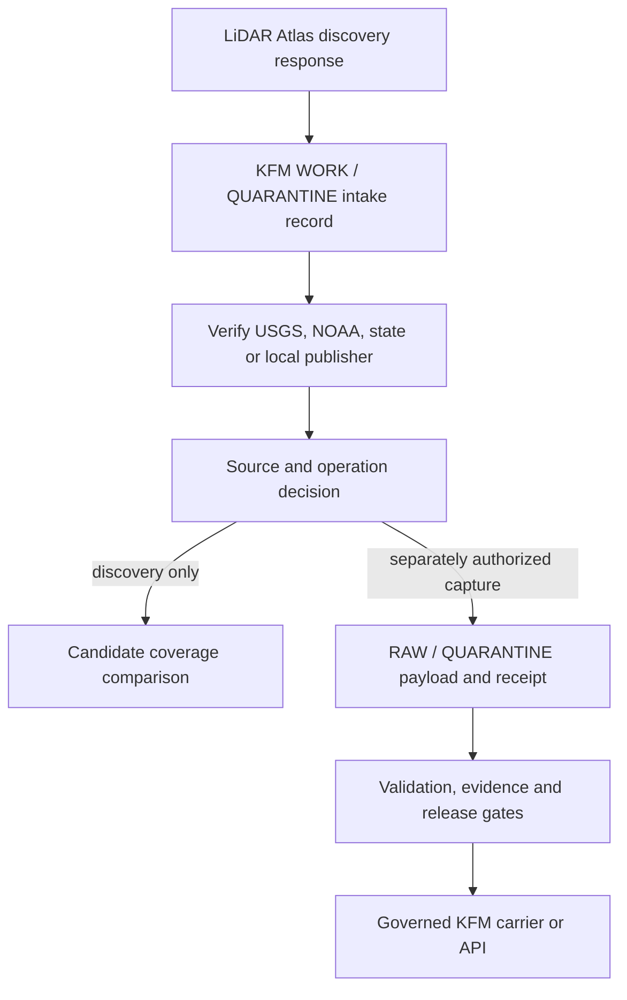

<!-- [KFM_META_BLOCK_V2]
doc_id: kfm://docs/intake/exploratory/lidar-atlas-api-source-map-20260914
title: LiDAR Atlas API — KFM Discovery and Managed-Processing Boundary
type: exploratory-source-map
version: v0.1
status: exploratory-retained; hold
owners:
  - Docs steward / OWNER_TBD
  - Terrain source steward / OWNER_TBD
  - Procurement and rights steward / OWNER_TBD
  - Security and sensitivity steward / OWNER_TBD
created: 2026-09-14
updated: 2026-09-14
policy_label: public
truth_posture: cite-or-abstain
repository_pin: bartytime4life/Kansas-Frontier-Matrix@6c5be18cf8448654be95a6db688d98546cd5276e
related:
  - docs/intake/exploratory/README.md
  - docs/intake/exploratory/living-atlas-deep-time-to-present-source-map-20260910.md
  - docs/sources/catalog/usgs/3dep-elevation.md
  - connectors/usgs/3dep/README.md
  - docs/adr/ADR-0012-connector-outputs-to-data-raw-or-data-quarantine-only.md
  - docs/adr/ADR-0017-source-descriptor-admission-process.md
  - docs/doctrine/directory-rules.md
external_comparison:
  - kfm://docs/intake/exploratory/gpxz-elevation-service-source-map-20260914
tags: [kfm, intake, exploratory, lidar, point-cloud, dem, dsm, dtm, ndsm, lidar-atlas, usgs-3dep, noaa, maplibre, source-admission]
notes:
  - LiDAR Atlas is evaluated first as a commercial source-discovery broker and second as a managed-processing vendor.
  - It is not treated as the publisher of indexed public LiDAR, an authoritative replacement for USGS or NOAA, or a direct Explorer runtime dependency.
  - No vendor contact, demo, quote, account, credential, API request, order, data download, source admission, connector, registry entry, runtime binding, release, deployment, or publication is created by this record.
[/KFM_META_BLOCK_V2] -->

# LiDAR Atlas API — KFM discovery and managed-processing boundary

> **Decision:** retain LiDAR Atlas as an exploratory **LiDAR discovery broker** and potential **managed-processing vendor**. Use its catalog, if later authorized, to accelerate identification and comparison of exact source projects. Verify every candidate against the responsible USGS, NOAA, state, or local publisher before KFM admission. Do not treat LiDAR Atlas, an automatically selected mosaic, or a purchased derivative as sovereign terrain truth.

| Field | Current disposition |
|---|---|
| Intake state | `exploratory-retained` |
| Promotion state | `HOLD` |
| First candidate role | Discovery and procurement aid |
| Second candidate role | Contracted processing/derivative carrier |
| Primary Kansas terrain authority | Direct USGS 3DEP and other responsible public publishers remain preferred |
| Public API maturity | Provider describes the Atlas API as beta; public contract is incomplete |
| Browser access | `DENY` for direct API, WCS, tile, order, or AOI-upload integration |
| Source activation | Not authorized |
| Procurement or paid processing | Not authorized |
| Public release | Not authorized |

## Logical placement

LiDAR Atlas is not the same kind of service as GPXZ and should not share an undifferentiated “elevation API” role.

- **Direct USGS 3DEP / NOAA / state sources** publish or steward source projects and remain the first authority for identity, collection facts, rights, quality, and original data.
- **LiDAR Atlas** advertises an index of more than 5,000 projects, spatial discovery, project metadata, raw-download or processing methods, and on-demand DEM generation. Its strongest initial KFM value is finding and comparing candidate projects.
- **GPXZ** exposes a ready-to-query global composite elevation surface. Its strongest candidate value is bounded point/profile/raster comparison, not detailed public-LiDAR project discovery.

The three roles must remain separate. A convenient discovery record does not replace the publisher's metadata; a processed DTM is not an original point cloud; and a fast elevation result is not a source-specific LiDAR observation.

## Source-grounded facts

| Surface | Confirmed from provider pages | KFM interpretation |
|---|---|---|
| Atlas API | REST-style discovery over a catalog the provider describes as 5,000+ LiDAR datasets from USGS, NOAA, state, local, and other sources | Commercial index over third-party sources; publisher verification remains required |
| Search | Bounding box, polygon, or point/radius queries; filters for resolution, date, and quality | Useful candidate discovery, but request geometry needs sensitivity classification before transmission |
| Dataset metadata | Boundary polygons, density, classification list, collection dates, and download or processing methods | Candidate `SourceIntakeRecord` fields; not an admitted `SourceDescriptor` by themselves |
| Operations | Batch discovery, raw download, on-demand processing, and custom DEM generation are advertised | Each operation needs its own authority, contract, cost, rights, and receipt; discovery does not authorize download or processing |
| API availability | API described as beta; access, pricing, and integration support require contact | `HOLD` until a versioned API contract and commercial terms are supplied and reviewed |
| Coverage portal | Continental-U.S. AOI reports advertise coverage percentage, dates, coordinate systems, source metadata, and product estimates | Candidate planning aid; report semantics, reproducibility, and retention remain unverified |
| DEM types | DSM, DTM, and nDSM are offered | Preserve product meaning; do not call a DSM “bare earth” or treat nDSM as an observed height field |
| Source selection | Provider says processing may prioritize newer and denser sources and merge overlaps | “Newest” and “densest” are not universal fitness rules; preserve every selected project and selection rationale |
| Provenance | Provider says delivered mosaics include a cut file showing contributing sources by area | Make the cut file, source footprints, project IDs, and metadata mandatory deliverables, not optional supporting material |
| Reference frames | Provider advertises customizable CRS, geoid, epoch, and vertical datum handling | Transformation inputs, grids/models, software, epoch, uncertainty, and output reference frame must be receipt-bound |
| Delivery | LAZ, EPT, GeoTIFF, and COG are advertised; a later platform announcement describes browser streaming and WCS | Delivery capability is not KFM release authority or proof of current endpoint availability |
| Processing | Multi-source fusion, noise filtering, classification, void fill, gridding, and edge matching are described | Outputs are derived products; preserve algorithm/version/configuration, source roles, QA, and uncertainty |
| Company | Advanced Algorithms LLC presents itself as the operator; a 2026 announcement describes a partnership with LAND INFO | Contracting entity, service operator, processor, and data licensor roles must be explicit before use |

Official pages inspected on 2026-09-14:

- [LiDAR Atlas API overview](https://lidaratlas.com/api)
- [LiDAR Atlas coverage-report portal](https://lidaratlas.com/)
- [DEM products, source selection, provenance, datums, formats, and void fill](https://lidaratlas.com/dem)
- [Advanced Algorithms company and processing overview](https://lidaratlas.com/about)
- [Advanced Algorithms / LAND INFO platform announcement](https://lidaratlas.com/blog/new-elevation-platform)
- [Provider processing and data-index design discussion](https://lidaratlas.com/blog/processing-geo-data-at-scale)
- [USGS LidarExplorer](https://www.usgs.gov/tools/lidarexplorer)
- [USGS GIS data-download guidance](https://www.usgs.gov/the-national-map-data-delivery/gis-data-download)
- [NOAA Digital Coast Data Access Viewer](https://coast.noaa.gov/dataviewer/)

Provider claims about scale, accuracy, seamlessness, fitness, processing speed, or commercial availability remain claims until KFM receives project-specific technical specifications, accuracy/QA reports, source lineage, service terms, and reproducible delivery evidence.

## Public-contract gaps

The public API page does not establish the details required for implementation:

- versioned base URL and endpoint list;
- authentication and credential-scoping model;
- request and response schemas;
- stable dataset/project identity and revision semantics;
- pagination, ordering, spatial-predicate semantics, and maximum AOI or batch size;
- coordinate order, supported input CRS, geometry validity, and antimeridian behavior;
- rate limits, quotas, timeouts, retry guidance, and idempotency;
- error envelope and finite status codes;
- API versioning, deprecation, change notification, SLA, and outage behavior;
- logging, AOI/upload retention, subprocessors, hosting region, deletion, and incident notice;
- terms of service, caching, derived-work rights, attribution, redistribution, and public-display rights;
- report/order identity, reproducibility, cancellation, billing, and refund behavior;
- relationship between API discovery, portal reports, WCS, browser tiles, downloadable COGs, raw LiDAR, and custom processing.

Absence from the inspected public pages is not proof that these controls do not exist. It is proof that KFM cannot rely on them yet.

## KFM trust flow

Discovery metadata belongs in the source-intake path and does not automatically enter RAW. Only a separately authorized data acquisition or commissioned derivative may enter governed RAW or QUARANTINE. The browser receives only a released carrier or governed API result.

## Allowed, held, and denied uses

| Candidate use | Disposition | Reason |
|---|---|---|
| Find candidate Kansas LiDAR projects and compare coverage/date/density/classification metadata | `PROPOSED / HOLD` | Strongest fit, pending API contract and cross-check against publishers |
| Identify apparent gaps or overlapping acquisitions | `PROPOSED / HOLD` | Useful intake signal; official coverage and item metadata remain controlling |
| Produce a human-reviewed shortlist for direct USGS/NOAA/state acquisition | `PROPOSED / HOLD` | Discovery aid only; no automated admission |
| Order or generate a project-specific DTM/DSM/nDSM | `HOLD` | Separate procurement, processing specification, rights, accuracy, datum, source-cut, QA, and cost decision required |
| Download raw LiDAR through the vendor | `HOLD` | Custody, identity, byte equivalence, license, fees, and publisher lineage must be proven |
| Use provider WCS/tiles/API directly in Explorer | `DENY` | Beta/contract gaps, secret and AOI exposure, mutable external dependency, and no release binding |
| Upload or draw sensitive archaeology, rare-species, protected-infrastructure, private-land, or personal AOIs | `DENY` | Privacy, retention, contractual, and harm controls are unresolved |
| Treat provider-selected “freshest/highest density” data as automatically authoritative | `DENY` | Fitness depends on product type, quality, datum, epoch, classification, accuracy, completeness, and claim |
| Treat a fused/filled DTM as original LiDAR or an observed surface | `DENY` | Fusion, filtering, classification, interpolation, void fill, and gridding create a derivative |
| Accept “survey-grade,” “centimeter,” or “guaranteed accuracy” as sufficient evidence | `DENY` | Requires project-specific control, accuracy method, report, scope, responsible professional, and contractual definition |
| Silent fallback from direct 3DEP or GPXZ to LiDAR Atlas | `DENY` | Provider, product, source role, datum, rights, cost, and provenance all change |
| Use discovery/report output as an EvidenceBundle or SourceDescriptor | `DENY` | Intake information is not KFM authority, evidence closure, or activation |

## Required discovery adapter behavior

No connector path or source identifier is created here. If a later decision authorizes a discovery-only adapter, it should:

1. require a current, operation-scoped authority decision before any call;
2. retrieve credentials from secret storage and keep them out of URLs, repository files, logs, reports, styles, browser state, and receipts;
3. accept only valid, public-safe, policy-cleared AOIs and reject sensitive geometry before transmission;
4. canonicalize request geometry, CRS, filters, pagination, and query purpose without leaking protected coordinates into ordinary logs;
5. enforce timeouts, response-size, page, AOI, batch, concurrency, quota, and cost ceilings;
6. capture exact response bytes and a secret-free request digest;
7. preserve provider dataset/project IDs, revision fields, publisher/source agency, source URL, exact footprint, acquisition interval, publication/update time, density, point spacing, classifications, quality level, accuracy fields, CRS, horizontal/vertical datum, geoid, epoch, units, download/process methods, restrictions, and provider caveats;
8. cross-check each shortlisted record against the responsible public publisher and record matches, conflicts, missing fields, and stale references;
9. emit only a `SourceIntakeRecord` candidate to WORK or QUARANTINE, with no source activation, acquisition, order, or promotion;
10. return finite `READY`, `HOLD`, `DENY`, `ABSTAIN`, or `ERROR` outcomes with deterministic reasons.

Suggested reason codes for later contract review:

- `LIDAR_ATLAS_API_CONTRACT_MISSING`
- `LIDAR_ATLAS_AUTHORITY_MISSING`
- `LIDAR_ATLAS_SECRET_MISSING`
- `LIDAR_ATLAS_SENSITIVE_AOI_DENIED`
- `LIDAR_ATLAS_SOURCE_ID_UNSTABLE`
- `LIDAR_ATLAS_PUBLISHER_MISMATCH`
- `LIDAR_ATLAS_RIGHTS_UNRESOLVED`
- `LIDAR_ATLAS_REFERENCE_FRAME_UNRESOLVED`
- `LIDAR_ATLAS_ACCURACY_UNSUPPORTED`
- `LIDAR_ATLAS_QUOTA_OR_COST_EXCEEDED`
- `LIDAR_ATLAS_RESPONSE_INVALID`
- `LIDAR_ATLAS_UPSTREAM_ERROR`

These identifiers are proposals, not current contract enums.

## Managed-processing deliverables

If KFM later procures a raster or point-cloud product, the statement of work should require at least:

- exact contracting entity, service operator, source publishers, and applicable licenses;
- stable order/job/product identifiers and delivery date;
- immutable original source-project IDs, URLs, footprints, byte identities when available, acquisition intervals, quality levels, classifications, density/spacing, and accuracy metadata;
- complete cut file or equivalent source-footprint mosaic showing which source supports each area;
- DSM/DTM/nDSM meaning, ground-classification rules, noise filters, overlap selection, fusion, edge matching, interpolation, void fill, breaklines, hydro-flattening, resampling, gridding, nodata, and overviews;
- software, algorithm and configuration versions; reproducible or reviewable transformation description;
- source and output horizontal CRS, datum/realization, coordinate epoch, vertical datum, geoid model, units, grid origin/alignment, cell support, and transformation uncertainty;
- independent/project-specific accuracy and QA report, checkpoints/control lineage, limitations, exclusions, and acceptance thresholds;
- LAZ/EPT/COPC/GeoTIFF/COG format profiles, checksums, file inventory, metadata, and validation results;
- caching, internal use, derivative, redistribution, public-display, screenshot, report/export, correction, withdrawal, and retention rights;
- support, defect correction, redelivery, security, deletion, breach notice, service continuity, and rollback obligations.

A vendor cut file is necessary provenance for a fused product but is not sufficient evidence by itself.

## Minimum beta-evaluation packet

Proceed only after an owner authorizes vendor contact and receives reviewable API and commercial documentation:

1. preserve the supplied API reference, schema/version, terms, privacy/DPA, price/limits, SLA, and change policy;
2. use one broad, public administrative Kansas AOI rather than a personal, parcel, infrastructure, ecological, or archaeological location;
3. perform discovery only—no raw download, WCS session, custom processing, quote acceptance, or order;
4. request a small bounded result set with deterministic sorting and pagination;
5. compare every result against USGS LidarExplorer/TNMAccess, NOAA Digital Coast, or the named state/local publisher;
6. record exact response bytes, request digest, retrieval time, service/API version, provider identity, quotas, cost, and all returned source metadata;
7. create sanitized no-network replay fixtures and negative cases for missing auth, invalid AOI, pagination drift, duplicate/overlapping projects, unstable IDs, stale publisher links, missing rights/datum/accuracy, 4xx, 429, 5xx, timeout, and oversized response;
8. finish with a discovery-only `READY`, `HOLD`, `DENY`, `ABSTAIN`, or `ERROR` decision.

The evaluation may determine that official USGS and NOAA discovery surfaces already satisfy KFM's needs. Commercial convenience must demonstrate distinct value without weakening source authority or reproducibility.

## Promotion gates

- [ ] Product owner, terrain source steward, procurement/rights steward, and security/sensitivity steward assigned.
- [ ] Contracting entity, service operator, data-provider, and licensor roles resolved.
- [ ] Versioned API reference, schemas, authentication, pagination, limits, errors, idempotency, versioning, and deprecation policy reviewed.
- [ ] Terms, privacy/DPA, retention, hosting/subprocessors, security, caching, attribution, redistribution, public-display, derivative, and deletion rights accepted.
- [ ] Discovery value compared with current USGS LidarExplorer/TNMAccess and NOAA Digital Coast.
- [ ] Stable project identity, revisions, footprints, source URLs, and publisher cross-check behavior proven.
- [ ] AOI sensitivity and secret handling enforced before network access.
- [ ] Discovery-only WORK/QUARANTINE output separated from later RAW acquisition.
- [ ] Managed processing remains a separate operation with statement-of-work, source-cut, datum/epoch, accuracy, QA, format, rights, and rollback closure.
- [ ] Connector/source identity and path reviewed without creating parallel USGS, NOAA, GPXZ, or terrain authority.
- [ ] Offline fixtures, validators, negative cases, receipts, correction, and retirement behavior pass.
- [ ] Any public consumer uses only a release-bound KFM carrier or governed API with visible source, date, datum, role, limitation, stale, denied, and error states.
- [ ] Independent review and release authority recorded.

## Current disposition and next action

`EXPLORATORY_RETAINED / HOLD / VALIDATED_BRANCH_ONLY`

The next bounded action is an owner decision on whether KFM should contact the vendor for the beta API contract, privacy/retention terms, licensing/redistribution terms, pricing/quotas, SLA, and one discovery-only evaluation credential. That contact and any credential acquisition require separate authorization; they are not performed here.

If the documentation is supplied, run only the minimum discovery evaluation above. If the contract remains incomplete or the catalog does not add reproducible value beyond USGS/NOAA public discovery, retain this record and continue direct official-source workflows.

## Non-effects and rollback

This record does not create or authorize vendor contact, a demo, quote, account, subscription, credential, endpoint call, AOI upload, WCS/tile session, report, order, source download, custom processing, connector path, source identifier, SourceDescriptor, activation decision, source capture, procurement decision, rights decision, registry entry, contract/schema enum, policy rule, EvidenceBundle, release manifest, runtime layer, deployment, promotion, publication, or incident closure.

Before integration, rollback is to abandon the unmerged branch. After a separately authorized integration, revert this single exploratory documentation file. No source data, secret, dependency, account, order, runtime, or release state requires rollback.
