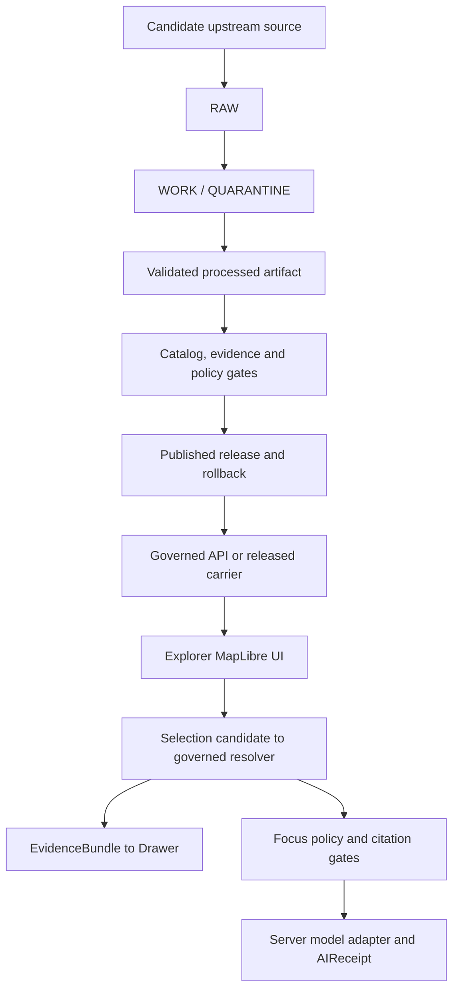

<!-- [KFM_META_BLOCK_V2]
doc_id: kfm://doc/intake/living-atlas-deep-time-to-present-source-map-20260910
title: Living Atlas Deep-Time-to-Present Source Map and Delivery Plan
type: exploratory-intake-source-map
version: v0.1.0
status: exploratory; implementation-checkpoint; non-authoritative
owners: OWNER_TBD — Atlas steward · Source steward · Map steward · Evidence steward · Release steward
created: 2026-09-10
updated: 2026-09-10
policy_label: internal; exploratory-intake; public-source-research; no-public-effect
owning_root: docs/
responsibility: Reconcile the connected Living Atlas design, real-data ledger, supplied KFM materials, repository state, and official map/data sources into one bounded temporal source map and review-only implementation checkpoint.
truth_posture: CONFIRMED source and repository observations / PROPOSED delivery sequence / NEEDS VERIFICATION rights, admission, evidence, release, hosted replay, deployment, and public behavior
related:
  - ../new-ideas-register.md
  - ../NEW_IDEAS_INDEX.md
  - ../../doctrine/directory-rules.md
  - ../../adr/ADR-0029-adopt-directory-governance-standard-v2.md
  - ../../../apps/explorer-web/src/features/living_atlas/README.md
  - ../../../apps/explorer-web/src/adapters/README.md
tags: [kfm, atlas, temporal, maplibre, sources, evidence, usgs, deep-time, historical-maps]
notes:
  - "This document grants no source admission, rights approval, evidence authority, release, deployment, publication, or public-use authority."
[/KFM_META_BLOCK_V2] -->

# Living Atlas deep-time-to-present source map and delivery plan

Status: **EXPLORATORY / NON-AUTHORITATIVE / NO SOURCE ACTIVATION / NO RELEASE / NO DEPLOYMENT**

Research date: **2026-09-10 UTC**

Repository evidence base: `main@4b950cb352b90406ab470dd722947580b2218df9`

Local candidate patch: **current working tree; not represented by the baseline SHA and not authoritative until committed and reviewed**

Prepared for: Kansas Frontier Matrix Living Atlas

This report converts [Google Drive Living Atlas design revision 28](https://docs.google.com/document/d/1aivNyfMjQ8urQO6vjt4YvkT1ltF1t7fxCahEcnGV4Dw/edit) (modified `2026-09-10T03:29:03.705Z`; inspected `2026-09-10`) and the [Notion real-data delivery hub](https://app.notion.com/p/3d6a92021bf6816cae0ec1ccbd15e21e?pvs=204) (connector snapshot as of `2026-09-10T03:25:26.978Z`) into a repository-grounded candidate-source and implementation plan. Those mutable coordination references still cannot substitute for release evidence. This report does not activate a source, approve rights, create an EvidenceBundle, release a layer, publish a map, or deploy either Explorer application.

## Executive summary

“Beginning of time to present” cannot be one homogeneous animation. This plan bounds that phrase to an **Earth-history** time spine beginning at approximately 4,567 Ma; it does not claim to cover the cosmological beginning of time. The Atlas must coordinate distinct temporal and spatial evidence roles:

1. **4,567–1,800 million years ago:** a candidate versioned geologic-time standard is available, but no reviewed Kansas geometry is currently supportable.
2. **1,800 million years ago–present:** global plate reconstructions can provide explicitly hypothetical paleoposition context after offline preprocessing and review.
3. **Present surface and subsurface:** Kansas Geological Survey maps can describe current mapped surface units and present modeled basement depth; neither is a reconstruction of Kansas in the geologic past.
4. **Human chronology:** KSHS provides candidate, approximate cultural-period labels from roughly 11,000 BCE onward, but exact archaeological site coordinates are restricted and must never enter the public stack.
5. **Historical map editions:** Library of Congress, USGS historical topographic maps, and vintage Census geography can supply dated map snapshots with edition-specific rights and uncertainty.
6. **Modern observations and catalogs:** USGS earthquake and water services, NWS, NOAA, EPA, Census, and non-archaeological KSHS records are candidates for point, line, polygon, and raster layers with distinct observation, publication, update, retrieval, and release times.

The live official USGS Earthquake Catalog API was researched externally with a Kansas-area rectangle and the exact inclusive query window `2026-01-01T00:00:00Z` through `2026-09-10T00:00:00Z`. No response payload, digest sidecar, frontend adapter, test fixture, result count, or event fact is retained or claimed for this source. The research request is not replayable evidence, a completeness claim, KFM review, source admission, or public data.

The public frontend-to-backend data path remains intentionally blocked. At the repository pin above, `apps/governed-api` has only three fail-closed `ABSTAIN / NOT_IMPLEMENTED` routes; Hazards has no admitted earthquake SourceDescriptor, accepted event contract/schema, deterministic lifecycle transform, EvidenceBundle resolution, policy decision, or ReleaseManifest. Returning a substantive API `ANSWER` or mounting an external research response as public map truth would violate the KFM trust membrane.

## Key decisions

| Decision | Result | Rationale |
|---|---|---|
| Recommended web target for this plan | `apps/explorer-web` | Existing MapLibre composition and Living Atlas registry; canonical status still depends on repository authority and any required ADR. |
| Sites-bound sibling | Preserve separately | `apps/kansas-frontier-matrix-explorer` is materially divergent and has an unresolved project-identity conflict. |
| Candidate deep-time vocabulary | Version-pinned ICS chart | ICS may supply time names and numeric boundaries after review, not Kansas geometry. |
| First external point candidate | USGS Earthquake Catalog | No key, official GeoJSON, explicit origin/update times, generally public-domain posture, bounded point geometry. |
| Public earthquake layer today | No public layer; API remains `ABSTAIN / NOT_IMPLEMENTED` | Source/evidence/policy/release dependency closure does not exist. |
| Repository payload posture | `HOLD`; no real response is committed | Repository `fixtures/` are not an ownership path for real source exports, and the frontend adapter area does not own source intake. |
| Delivery split | Connector-placement ADR first | Resolve source ownership and lifecycle roots before connector code; contract/pipeline, release/API, and UI binding remain separate reviewable changes. |
| Archaeological coordinates | Default public posture is `DENY` / withhold exact geometry | The authoritative policy engine must decide; client-side hiding is never an adequate control. |
| Historic map dates | Edition snapshots | Publication/revision dates must not be presented as feature-validity intervals. |
| Present day | Multiple clocks | Latest origin, provider update, retrieval, review, and KFM release are separate states. |

## Research method and evidence basis

The review used four evidence classes:

- the pinned `main` GitHub tree for baseline implementation claims, kept separate from the uncommitted local candidate patch;
- the mutable Drive design and Notion delivery ledger, read as planning context rather than release evidence;
- the supplied KFM architecture, GIS, PostGIS, geostatistics, archaeology, and source-planning documents;
- current official source documentation and machine endpoints from the source organizations listed below.

Current repository inspection overrides older claims about what is implemented; it does not override accepted contracts, ADRs, policies, or trust requirements. Portal availability does not equal source admission. Technical access does not equal redistribution permission. A timestamp, provider status, parser state, or passing test does not equal evidence, review, release, or publication.

Every source below remains a **candidate**. Before activation, its candidate record must identify source role and knowledge character, publisher/steward, stable locator and version, retrieval metadata, rights and access posture, sensitivity, update cadence, spatial and temporal support, citation policy, fitness limits, and verification status. Those fields inform later SourceDescriptor review but do not themselves admit a source.

## The temporal model

The Atlas must carry several independent clocks rather than one generic `date`:

| Clock | Meaning | Example |
|---|---|---|
| `valid_from` / `valid_to` | When a feature or interpretation applies | Boundary edition or alert interval |
| `event_at` / `origin_time` | When an event occurred | Earthquake origin time |
| `observed_at` | When a sensor or survey made an observation | Gauge reading or field survey |
| `map_published_at` | When a map edition was published | USGS historical topo edition |
| `source_updated_at` | When the provider revised a record | USGS event solution update |
| `source_published_at` | When the provider published an edition or result | Dataset or report publication |
| `retrieved_at` | When KFM captured the upstream bytes | Capture receipt time |
| `ingested_at` | When captured bytes entered the governed lifecycle | RAW intake receipt time |
| `reviewed_at` | When a steward completed review | Rights or quality decision |
| `released_at` | When KFM authorized public use | ReleaseManifest time |
| `stale_after` / `expires_at` | When a release requires refresh or visible stale treatment | Source-cadence threshold |
| `corrected_at` / `superseded_at` | When published meaning changed | Event alias or boundary correction |

Every temporal assertion also needs precision/approximation, assertion basis, interval semantics, temporal query mode, and geography/model version where applicable. Internal event queries use explicit half-open `[from,to)` intervals; an upstream inclusive endpoint must be post-filtered deterministically. Coarse labels such as `time:present` are navigation capacity markers, not substitutes for event-time predicates.

Temporal navigation must propagate the committed query to the map, selection candidate, governed evidence lookup, Evidence Drawer, Focus request, permalink, comparison, report, export, and receipt. Missing intervals remain visible as gaps; the UI must not interpolate them or carry old geometry forward as current truth.

## Source map from deep time to present

### Deep time and geologic context

| Interval or layer | Candidate upstream source | What it may support after admission | What remains held |
|---|---|---|---|
| 4,567 Ma–present Earth-history time spine | [International Commission on Stratigraphy chart](https://stratigraphy.org/chart/), [release v2026-06.5](https://github.com/i-c-stratigraphy/chart/releases/tag/v2026-06.5), and its [tag-pinned RDF](https://raw.githubusercontent.com/i-c-stratigraphy/chart/v2026-06.5/chart.ttl) | Versioned names, hierarchy, numeric boundaries, and stated boundary qualification. The chart repository identifies its data as CC BY 4.0. | It is not a cosmological timeline and supplies no map geometry. No Kansas polygon may be inferred from an ICS interval. |
| 1,800 Ma–present paleogeography | [EarthByte 1.8 Ga plate model](https://zenodo.org/records/13628813) | CC BY 4.0, versioned global plate-reconstruction hypothesis suitable for offline discrete slices. | No geometry before 1.8 Ga; no crisp modern Kansas outline in deep time; no presentation as observed fact. |
| Present surface geology | [KGS M-118 Geologic Map of Kansas](https://www.kgs.ku.edu/General/Geology/map118.html) and [GeMS FeatureServer](https://services2.arcgis.com/ZOdjAzAQ2B0f85zi/arcgis/rest/services/State_Geology_GeMS/FeatureServer) | Present mapped surface/near-surface units at approximately 1:500,000 with source attributes. | The service exposes no authoritative numeric age field. A human-reviewed legend-to-ICS crosswalk and affirmative reuse decision are required before redistribution. |
| Present subsurface model | [KGS OFR 2025-49](https://www.kgs.ku.edu/Publications/OFR/2025/OFR2025-49.pdf) | A current modeled depth-to-Precambrian-basement surface based on wells and interpreted faults. | It is not “Kansas during the Precambrian.” Numeric sampling, CRS reconciliation, and redistribution rights remain held. |

The current Explorer’s Hadean-through-present labels are capacity markers. They must remain no-data/held states until the ICS hierarchy is version pinned and a distinct source supplies appropriate geometry. The safe early experience is a versioned time ruler plus a visible geometry gap, not a fabricated ancient map.

### Human chronology, archaeology, and historical maps

| Period / source | Coverage and format | Safe use | Hard limit |
|---|---|---|---|
| [KSHS Kansas Archeology chronology](https://www.kansashistory.gov/kansapedia/kansas-archeology/19074) | Broad periods from Paleoindian, about 11,000 BCE, through the present; narrative HTML | Candidate approximate chronology labels and generalized narrative after rights, citation, and temporal-precision review. | No point or site geometry may be manufactured from the narrative; cultural transitions are not simultaneous or spatially uniform boundaries. |
| [KSHS archaeological GIS](https://www.kansashistory.gov/p/archeological-site-and-survey-location-gis-coverage/15739) | Restricted site and survey GIS with more than 16,000 recorded sites | KSHS-controlled professional access and KSHS-approved public generalization only. | Exact locations must not enter GitHub, Notion, broad Drive, public APIs, tiles, browser bundles, screenshots, analytics, or logs. |
| [LOC 1836 assigned-lands map](https://www.loc.gov/item/99446197/) | Treaty/removal-era raster context spanning present Kansas | Georeferenced contextual overlay with the source’s approximate-boundary and cultural-perspective caveats. | Not definitive or continuous Indigenous homeland/sovereignty geometry. |
| [LOC Railroad Maps, Kansas](https://www.loc.gov/collections/railroad-maps-1828-to-1900/?fa=location:kansas&fo=json) | Mainly 1865–1897 scans with JSON/IIIF delivery | Dated raster editions; vectorization only with QA and explicit `projected`, `proposed`, or `built` status. | A line shown on a map is not automatically an operating interval. |
| [LOC Sanborn Maps, Kansas](https://www.loc.gov/collections/sanborn-maps/?fa=location:kansas&fo=json) | Mostly 1880s–1950s, often multi-sheet | Item-rights-cleared urban-change overlays with sheet/edition dates and georeferencing error. | Public-domain status must be decided per item/edition; one edition does not establish a building’s construction or demolition interval. |
| [USGS Historical Topographic Map Collection](https://ngmdb.usgs.gov/topoview/viewer/) | Kansas editions from 1884–2006 in GeoPDF/GeoTIFF/JPEG/KMZ | Public-domain raster timeline with quadrangle, scale, edition, revision, bounds, and product ID. | Publication or revision time is a map snapshot, not feature-validity proof. |
| [Census TIGER/Line](https://www.census.gov/geographies/mapping-files/time-series/geo/tiger-line-file.html) | Legacy 1980/1990 bridges, 2000 files, annual shapefiles from 2007 | Versioned legal/administrative geometry by exact release. | Never animate the current boundary backward. |
| [IPUMS NHGIS](https://www.nhgis.org/user-resources/data-availability) | Historical census tables and reconstructed geography | Internal analysis or permission-cleared derivatives with required citation. | [Terms restrict redistribution](https://www.nhgis.org/ipums-nhgis-terms-use); raw extracts/tiles are not public-site assets without permission. |

A leading later historical-property candidate is the publicly reachable, non-archaeological [KSHS KHRI FeatureServer](https://services1.arcgis.com/q2CglofYX6ACNEeu/arcgis/rest/services/KSHS_RESOURCES/FeatureServer/0). Public reachability does not establish reuse rights, sensitivity clearance, or source admission. Any approved pipeline should filter reviewed records, paginate server-side, transform to EPSG:4326, and check for Kansas-coordinate outliers. Current record status is not a historical validity interval, and KHRI must remain explicitly separated from restricted archaeology.

### Modern and present operational sources

| Priority | Candidate source | Temporal/geometry value | Required caveat |
|---:|---|---|---|
| 1 | [USGS Earthquake Catalog API](https://earthquake.usgs.gov/fdsnws/event/1/) | GeoJSON points with origin time, update time, magnitude type, depth, review status, and aliases. | Catalog solutions and preferred IDs may change. Preserve `properties.ids`; never call the layer prediction or life-safety guidance. |
| 2 | [USGS Water Data APIs](https://api.waterdata.usgs.gov/) | Station points and qualified measurement series with explicit phenomenon times. | Preserve provisional/approved status, units, qualifiers, pagination, and inactive-series behavior. |
| 3 | [NWS API](https://www.weather.gov/documentation/services-web-api) | Alerts, forecasts, stations, and observations with issue/valid intervals. | Requires a descriptive User-Agent; separate alert, forecast, and observation roles; KFM is not an alert relay. |
| 4 | [NOAA HMS](https://www.ospo.noaa.gov/products/land/hms.html) | Daily fire points and qualitative smoke polygons from 2003 onward. | Gaps are not backfilled, smoke density is qualitative, and redistribution terms need exact review. |
| 5 | [EPA AirNow](https://www.airnow.gov/about-the-data/) | Preliminary hourly air-quality context. | Key/account required; not regulatory or trend evidence. |
| 6 | [EPA AQS](https://aqs.epa.gov/aqsweb/documents/data_api.html) | Historical regulatory-monitoring measurements with record-level QA/certification metadata. | Certification must not be assumed for every record; not live; key/email and bounded date requests required. |

[USGS credit guidance](https://www.usgs.gov/information-policies-and-instructions/copyrights-and-credits) states that USGS-produced information and data are generally U.S. public domain. KFM should credit the U.S. Geological Survey and separately review any third-party material and protected marks.

## USGS earthquake research: `HOLD` and split decision

The official API and documentation were researched externally; no real USGS response bytes or derived point payload are persisted in the repository. The research used `reviewstatus=reviewed`, ascending origin time, a limit of 250, a Kansas-area rectangle, and the inclusive window `2026-01-01T00:00:00Z` through `2026-09-10T00:00:00Z`. The rectangle includes border slivers and is not proof of Kansas jurisdiction. Because the response was not retained through a governed capture, this report asserts no result count or event fact, and the request must not support an absence, completeness, current-conditions, report, export, or public-map claim.

The source remains on `HOLD`. Repository topology establishes that `fixtures/` must not contain real source exports and `apps/explorer-web/src/adapters/` does not own source acquisition or lifecycle writes. No frontend parser, raw response, capture sidecar, runtime connection, evidence reference, or release artifact is claimed by this report.

Work must be split at the ownership boundary:

1. **Connector-placement ADR:** select the canonical connector root and owners for source configuration, credentials if ever required, RAW/WORK/QUARANTINE, processed output, schemas, and receipts. Do not infer a path from the current README placeholder.
2. **Server-side connector and lifecycle:** after the ADR and source/rights review, retrieve only through the connector, hash exact bytes, record query and retrieval/source-generation metadata, preserve preferred IDs plus aliases and revisions, validate bounded values, capture update/tombstone behavior, and hand off deterministically through RAW → WORK/QUARANTINE → PROCESSED.
3. **Contracts, evidence, and release:** separately add the accepted EarthquakeEvent contract/schema, SourceDescriptor, catalog/triplet closure, EvidenceBundles, citation and policy results, manifests, review, correction, rollback, and release.
4. **API and UI:** only a released carrier may feed the prospective `layer:usgs-earthquake-events`; the browser must not fetch USGS directly or treat the coarse `time:present` identifier as event-time filtering.

The official [USGS GeoJSON summary format](https://earthquake.usgs.gov/earthquakes/feed/v1.0/geojson.php) documents candidate fields. [ComCat](https://earthquake.usgs.gov/data/comcat/index.php) documents source identity behavior, so alias reconciliation is required before canonical KFM identity can exist. Live polling, caching, tombstones, retries, and exact event-time filtering remain future connector/pipeline concerns.

The KFM reference roadmap begins its governed end-to-end proof with an HUC12 hydrology thin slice. Earthquake source research is an auxiliary planning sidecar and does not reorder that roadmap without an accepted ADR.

## End-to-end site map

The browser never reads RAW/WORK/QUARANTINE, treats rendered properties as evidence, calls an upstream provider directly, or calls a model directly. Selection is only a candidate request to the governed resolver. Permalinks, telemetry, screenshots, and exports must redact or omit restricted state.

| System layer | Current state | Required implementation |
|---|---|---|
| Frontend | At the baseline SHA, `apps/explorer-web` has MapLibre, 18 views, coarse deep-time navigation, local drafts, and a Source Observatory. Its inline map is synthetic/generalized. | Consume only finite governed responses or released carriers; apply exact temporal predicates and show source role, uncertainty, rights, correction, stale, and no-data states. |
| Frontend boundary | No USGS payload, parser, runtime connection, or layer is claimed. Frontend adapter placement was rejected as the wrong source owner. | Consume only governed API responses or released carriers; keep source acquisition and lifecycle writes outside the frontend. |
| Source connector | `connectors/usgs-earthquake` is README-only; canonical placement and ownership are unresolved. | Keep implementation on `HOLD` until an ADR selects the connector, RAW/WORK/QUARANTINE, processed, schema, and receipt roots; then implement server-side retrieval, hashes, retries/caching, alias reconciliation, update/tombstone capture, and lifecycle handoff. |
| Pipeline | `pipeline_specs/hazards/usgs_earthquake.yaml` is disabled and unbound. | Add event contract/schema, normalization, Kansas polygon post-filter, identity/revision model, quality checks, deterministic transforms, and no-network replay. |
| Evidence/policy/release | No dependency-closed earthquake packet exists. | Complete rights and sensitivity review, SourceDescriptor activation, EvidenceBundle and citation binding, PolicyDecision, ReleaseManifest, corrections, withdrawal, and rollback. |
| Backend | At the baseline SHA, `/bootstrap`, `/layers`, and `/evidence` return finite `ABSTAIN / NOT_IMPLEMENTED`. | Only after the release packet exists, add versioned layer/feature and evidence-resolver routes with `ANSWER/ABSTAIN/DENY/ERROR`; Focus consumes a `MapContextEnvelope` and returns citations plus an `AIReceipt`. |
| Map delivery | No admitted earthquake LayerManifest, StyleManifest, TileArtifactManifest, or carrier exists. | Create the prospective `layer:usgs-earthquake-events` identity and bind exact carrier/style bytes, hashes, geometry policy, time model, source/evidence refs, release, stale behavior, and rollback. Do not reuse the existing polygon `layer:hazard-context`. |
| Security boundary | No browser-to-source or browser-to-model path is authorized. | Enforce CSP/CORS, reverse-proxy allowlists, TLS, credential separation, hashed style/sprite/glyph assets, no secrets in style JSON, and redacted permalinks/telemetry. |
| GitHub delivery | Draft-PR workflow is available; current main has unrelated known CI failures. | Keep source-admission, connector/pipeline, release/API, UI binding, and deployment as separate reviewable changes. |
| Sites | Saved v15 and repository source are divergent; two project IDs are unresolved. | Resolve target identity, restore exact source parity, then run build, browser, accessibility, security, deployment-readback, and rollback checks under separate authorization. |

## Work packages

### WP0 — forward corrections

- Reject every ACS status except exact `AVAILABLE`.
- Mark every occurrence of a duplicate GEOID as duplicate; do not join the first.
- Remove the configurable ACS vintage override that could contradict the output dataset identity.
- Reject population strings outside JavaScript’s safe-integer range.
- Record the Sites observed project ID and repository-configured project ID as an unresolved conflict; do not alias them.

### WP1 — time spine and explicit gaps

- Review candidate-source metadata and rights, pin the ICS chart release, and capture its machine-readable hierarchy through RAW/WORK/QUARANTINE before promotion.
- Extend the temporal kernel to support versioned `geologic_age` overlap predicates, boundary qualification, precision, and temporal assertion basis.
- Render 4,567–1,800 Ma as a visible no-geometry interval.
- Keep an exact, receipt-bound temporal query synchronized across map, governed lookup, drawer, Focus, compare, report, permalink, export, and receipts.

### WP2 — earthquake dependency closure

- Accept a connector-placement ADR that names the source, lifecycle, schema, receipt, and ownership roots; keep real exports out of `fixtures/` and source acquisition out of the frontend.
- Verify the exact service, credit, terms, MIME type, cache semantics, and update policy before any governed capture.
- Define a restrictive EarthquakeEvent contract/schema that separates origin parameters from modeled ShakeMap/PAGER/focal-mechanism and crowdsourced DYFI products.
- Create a KFM canonical identity plus source-alias table; treat alias overlap as the reconciliation key.
- Capture immutable revisions and tombstones; never overwrite a prior event snapshot silently.
- Add RAW/QUARANTINE, processed, catalog/triplet, evidence, policy, review, release, correction, and rollback artifacts in their owning roots.

### WP3 — governed API and Explorer binding

- Add bounded query parameters with an internal half-open `[from,to)` interval and post-filter the upstream API’s inclusive endpoints.
- Return accepted source role, actual event time, source publication/update, retrieval/ingestion/review/release/stale/correction times, precision, temporal assertion basis, geography version, geometry policy, limitations, query receipt, hashes, and evidence/release references.
- Implement finite missing-evidence, no-data, stale, conflict, generalized-geometry, restricted-access, citation-failed, denied, withdrawn, and runtime/upstream-error responses.
- Bind the released point carrier to a distinct prospective `layer:usgs-earthquake-events` MapLibre circle layer, selection candidate, governed EvidenceBundle lookup, Evidence Drawer, Focus scope, and non-map accessible table.
- Keep external context out of reports and exports until evidence/release eligibility is explicit.

### WP4 — historical and geological layers

- Add KGS surface units only after rights, source-role, scale, observed-versus-interpreted, and legend-to-ICS crosswalk review.
- Precompute EarthByte slices offline and record model version, transform parameters, spatial/temporal support, uncertainty, and fitness limits; label them as working-hypothesis reconstructed coordinates.
- Add USGS/LOC historical rasters by exact edition, rights, georeferencing residual, and scale.
- Add rights-cleared, reviewed, non-archaeological KHRI records through a server-side pipeline; keep archaeology restricted and separate.
- Label terrain and extrusion as 2.5D; do not imply volumetric subsurface stratigraphy.

### WP5 — deployment and operations

- Resolve the Sites project-identity conflict.
- Prove source parity between GitHub and the intended Sites version.
- Run repository-native unit/build/browser tests and classify the known baseline CI failures.
- Verify CSP/CORS, asset hashes, secret isolation, accessibility, permalink redaction, dependency provenance, and browser/model separation.
- Deploy only with explicit authorization; record version, source commit, archive digest, project ID, URL, smoke evidence, and rollback target.

## Acceptance criteria

The first public factual point layer is complete only when all of the following are true. External API research and an observed result count satisfy none of these admission or release items:

- the exact source, source role, knowledge character, rights, access, sensitivity, cadence, citation, and fitness decisions are accepted;
- source identity, alias, revision, query hash, content-spec hash, run hash, output hash, and retrieval/ingestion receipts validate;
- every feature has explicit spatial and temporal support, precision/assertion basis, geography/model version, uncertainty, and an accepted source role;
- no restricted geometry, internal path, credential, or unpublished lifecycle artifact reaches the browser;
- an EvidenceBundle and PolicyDecision support every substantive `ANSWER`;
- the LayerManifest, StyleManifest, TileArtifactManifest, and ReleaseManifest bind the exact carrier, style, sprite, glyph, and fallback bytes the client loads;
- the prospective point layer uses its own geometry-consistent ID and never aliases the polygon `layer:hazard-context`;
- map selection remains a request to the governed evidence resolver, never proof from rendered properties;
- Focus performs policy precheck, EvidenceBundle resolution, server-side model access, citation validation, policy postcheck, and `AIReceipt` emission; the browser has no direct model path;
- exact half-open temporal queries update the map, lookup, drawer, Focus, comparison, permalink, reports, exports, and receipts coherently;
- missing-evidence, empty, stale, malformed, conflicting, generalized, restricted, citation-failed, denied, withdrawn, and runtime/upstream-failed states remain finite and visible;
- meaningful source/content/schema/validator/policy changes drive release; timestamp-only changes do not;
- CSP/CORS, reverse-proxy allowlists, TLS, secret isolation, hashed assets, and permalink/telemetry redaction pass;
- keyboard navigation, accessible non-map inspection, reduced motion, and 2D fallback pass;
- GitHub review threads are resolved and hosted checks are classified at the exact head;
- deployment identity, readback, and rollback are proven separately.

## Risks and abstentions

- **Deep-time false precision:** ICS boundaries and EarthByte hypotheses must not be converted into precise ancient Kansas borders.
- **Temporal collapse:** event time, source update, retrieval, review, release, and correction must never be merged into a single “current” timestamp.
- **Coarse-time leakage:** the existing `time:present` capacity marker is not event-time filtering and cannot support a public temporal claim.
- **Layer-manifest mismatch:** earthquake points require a distinct future layer ID; the existing `layer:hazard-context` is a polygon fixture and must not be reused.
- **Identity drift:** USGS preferred event IDs may change; alias overlap must survive revisions.
- **Jurisdiction error:** a Kansas bounding rectangle includes border slivers; exact state membership needs a versioned polygon predicate.
- **Archaeological harm:** exact sites and inferred burials fail closed server-side.
- **Rights overreach:** KGS, Kansas Memory, KSHS scans, legacy GLO services, and IPUMS require exact permission analysis before redistribution.
- **Context/evidence collapse:** an official provider, reviewed status, public-domain data, or a rendered point does not by itself create a KFM EvidenceBundle or ReleaseManifest.
- **Lifecycle bypass:** real source exports must not enter `fixtures/` or frontend adapters; only the ADR-selected connector and governed RAW → WORK/QUARANTINE → PROCESSED path may create a future public derivative.
- **Operational overclaim:** earthquake catalogs, forecasts, smoke analysis, and water gauges are not KFM emergency-warning services.

## KFM trust authorities applied

- Lifecycle, contract objects, governed selection, time axes, browser/model boundary, and security: `KFM_MapLibre_Operating_Architecture_Governed_UI_AI_Interaction_Manual_REVISED.pdf`, pp. 5–13.
- Promotion gates, receipts, hashes, and the HUC12-first implementation sequence: `Kansas_Frontier_Matrix_Pipeline_Living_Implementation_Manual_v0.3.pdf`, pp. 10–19.
- Public-client prohibitions, carrier strategy, object fields, and tests: `Master MapLibre Components-Functions-Features.pdf`, pp. 43–46.
- Historical time/vintage/geography-crosswalk requirements: `Kansas Frontier Matrix Implementation Reference.pdf`, pp. 9–10.
- Valid/source/retrieval/release/correction time and query-receipt requirements: `KFM_Full_Atlas_seed_cards.md`, lines 460–573.
- Modeled uncertainty, extrapolation, and validation: `A Practical Guide to Geostatistical Mapping, 2nd Edition.pdf`, PDF pp. 21, 23, and 37–46.
- 2.5D/true-3D boundary: `maplibre3d.md`, lines 311–471, and `Archaeological 3D GIS.pdf`, PDF p. 52.

These supplied documents constrain this exploratory plan but are not implementation proof. Current repository inspection controls claims about what exists; accepted repository contracts, ADRs, and policies control governance.

## Candidate source links

This link list is not a SourceDescriptor registry, rights decision, citation report, or evidence bundle. Each candidate still requires the metadata and review described above.

- [International Commission on Stratigraphy chart](https://stratigraphy.org/chart/)
- [ICS chart release v2026-06.5](https://github.com/i-c-stratigraphy/chart/releases/tag/v2026-06.5)
- [ICS chart RDF pinned to v2026-06.5](https://raw.githubusercontent.com/i-c-stratigraphy/chart/v2026-06.5/chart.ttl)
- [EarthByte 1.8 Ga reconstruction archive](https://zenodo.org/records/13628813)
- [Kansas Geological Survey M-118](https://www.kgs.ku.edu/General/Geology/map118.html)
- [KGS OFR 2025-49](https://www.kgs.ku.edu/Publications/OFR/2025/OFR2025-49.pdf)
- [KSHS Kansas Archeology](https://www.kansashistory.gov/kansapedia/kansas-archeology/19074)
- [KSHS archaeological GIS access boundary](https://www.kansashistory.gov/p/archeological-site-and-survey-location-gis-coverage/15739)
- [Open KSHS KHRI FeatureServer](https://services1.arcgis.com/q2CglofYX6ACNEeu/arcgis/rest/services/KSHS_RESOURCES/FeatureServer/0)
- [Library of Congress Railroad Maps](https://www.loc.gov/collections/railroad-maps-1828-to-1900/)
- [Library of Congress Sanborn Maps](https://www.loc.gov/collections/sanborn-maps/)
- [USGS Historical Topographic Map Collection](https://www.usgs.gov/faqs/can-i-still-get-older-topographic-maps)
- [Census TIGER/Line](https://www.census.gov/geographies/mapping-files/time-series/geo/tiger-line-file.html)
- [USGS Earthquake Catalog API](https://earthquake.usgs.gov/fdsnws/event/1/)
- [USGS Earthquake GeoJSON format](https://earthquake.usgs.gov/earthquakes/feed/v1.0/geojson.php)
- [USGS ComCat identity guidance](https://earthquake.usgs.gov/data/comcat/index.php)
- [USGS copyrights and credits](https://www.usgs.gov/information-policies-and-instructions/copyrights-and-credits)
- [USGS Water Data APIs](https://api.waterdata.usgs.gov/)
- [National Weather Service API](https://www.weather.gov/documentation/services-web-api)
- [NOAA Hazard Mapping System](https://www.ospo.noaa.gov/products/land/hms.html)
- [EPA AirNow data description](https://www.airnow.gov/about-the-data/)
- [EPA AQS API documentation](https://aqs.epa.gov/aqsweb/documents/data_api.html)

## Handoff state

| Item | State |
|---|---|
| Research and source map | Bounded candidate inventory for this checkpoint; not exhaustive, admitted, or released |
| ACS/Sites forward corrections | Implemented locally; review pending |
| USGS earthquake source research | External official-API research only; `HOLD`; no real payload, adapter, fixture, evidence, or release committed |
| Earthquake connector placement | ADR required before implementation; lifecycle/API/UI work remains split |
| Public map points | Held pending dependency closure |
| Governed API earthquake answer | Held pending evidence/policy/release |
| Deep-time geometry | Held; explicit gap required before 1.8 Ga |
| Notion coordination update | Pending draft-PR URL |
| Google Drive design | Revision 28 inspected as mutable planning context; unchanged |
| GitHub draft pull request | Pending verification and push |
| Deployment | Not requested; not performed |
