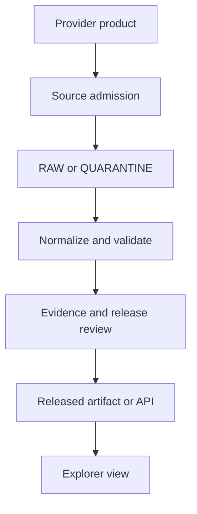
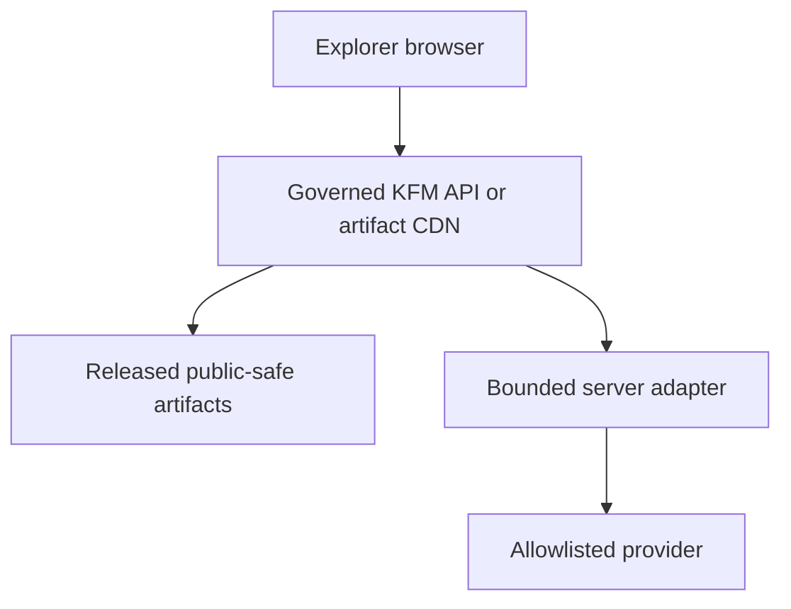

# Kansas Frontier Matrix real-data resource integration manual

**Document ID:** `KFM-RESEARCH-REAL-DATA-INTEGRATION-2026-09-09`  
**Status:** `EXPLORATORY / NON-AUTHORITATIVE / NON-ACTIVATING`  
**Research snapshot:** 2026-09-09 UTC  
**Repository observed during research:** `bartytime4life/Kansas-Frontier-Matrix`, default branch `main`  
**Observed repository commit:** `277c851940f48ef127d53e813eaa98361fd4e872`  
**Proposed repository path:** `docs/intake/exploratory/living-atlas-real-data-resource-integration-source-map.md`  
**Meaning of “realization” in this manual:** greater realism and real-world grounding, without overstating evidence  
**Scope:** documentation and review backlog only; no source registration, ingestion, release, deployment, or Site mutation

## Executive decision

KFM should bring in more terrain, water, wildfire-smoke, weather, historical, and factual data through a governed source-admission pipeline, not by adding arbitrary provider URLs directly to the public map. Every visible layer needs a stable source identity, an epistemic role, spatial and temporal meaning, rights and sensitivity decisions, immutable input identity, deterministic transformations, validation receipts, release state, and an honest unavailable or abstain state.

The smallest safe implementation unit is one exact product and version, one bounded Kansas fixture or snapshot, one descriptor, one rights and sensitivity decision, one adapter, one validation receipt, one EvidenceBundle linkage, one released display artifact, one Explorer entry, and negative tests. The same pattern is then repeated—not bypassed—for additional sources.

This produces a Living Atlas that can be visually rich while remaining truthful:

- A basemap is context, not evidence for a KFM claim.
- A gauge reading is an observation; a flood polygon may be regulatory, modeled, forecast, or observed, and those meanings are not interchangeable.
- A satellite hotspot is a detection, not a verified fire perimeter.
- A smoke analysis polygon is not a surface-concentration measurement.
- A model forecast is not an observation, even when its animation looks realistic.
- A historical scan is a source artifact; its georeferenced overlay is a derived artifact; a reconstructed landscape is an interpretation.
- A digital elevation model is a measured or derived surface with a vertical datum and uncertainty, not simply a 3D visual effect.

The recommended program has five stages:

1. Establish shared source, time, rights, sensitivity, and truth-state contracts.
2. Prove five bounded source slices: reference geography, terrain, water, weather/air, and historical comparison.
3. Add wildfire-smoke as a deliberately multi-source view, preserving detection, analysis, observation, advisory, and forecast distinctions.
4. Scale through immutable snapshots, catalog crosswalks, repeatable validation, and released artifacts.
5. Add carefully governed near-real-time adapters only after snapshot-based evidence and failure behavior are proven.

## What this document does—and does not do

This document is a source map and implementation manual. It inventories candidate source families, states the questions that must be answered before admission, defines layer and time semantics, proposes integration recipes, and maps the work into the current repository topology.

It does not:

- declare any candidate source authoritative for every possible claim;
- verify every product's current terms, field schema, rate limit, uptime, or redistribution permission;
- register or activate a source;
- fetch live data into KFM;
- choose a new machine-contract or schema authority;
- resolve the repository's documented LayerManifest schema-home conflict;
- load a new provider directly in the browser;
- generate or promote tiles, COGs, PMTiles, or databases;
- create an EvidenceBundle or mark evidence resolved;
- release, deploy, publish, or mutate the production Site.

Official provider links in this manual are discovery starting points. Endpoint, version, license, attribution, cadence, schema, and terms must be reverified and recorded at the time a source is proposed for activation.

## Evidence status vocabulary

Every statement and artifact should be understandable through one of these statuses:

| Status | Meaning in this manual |
|---|---|
| `CONFIRMED` | Observed in the current repository, connected workspace, supplied file, or cited official provider documentation during this research session. |
| `COORDINATION EVIDENCE` | A Notion or Drive planning record that documents intent or prior work but does not itself prove repository, runtime, release, or deployment state. |
| `CANDIDATE` | A plausible source or product family that still requires source admission and current terms/schema verification. |
| `PROPOSED` | A recommended KFM design or implementation step; not current authority. |
| `HELD` | Work that must not proceed until a named dependency, review, policy decision, or authority conflict is resolved. |
| `RELEASED` | A state that may only be established by KFM's actual release authority and receipts—not by this document. |

## Current KFM grounding

The live repository audit found these relevant authorities at the observed commit:

- [CONTRIBUTING.md](https://github.com/bartytime4life/Kansas-Frontier-Matrix/blob/277c851940f48ef127d53e813eaa98361fd4e872/CONTRIBUTING.md)
- [ADR-0029: adopt Directory Governance Standard v2](https://github.com/bartytime4life/Kansas-Frontier-Matrix/blob/277c851940f48ef127d53e813eaa98361fd4e872/docs/adr/ADR-0029-adopt-directory-governance-standard-v2.md)
- [Directory Rules](https://github.com/bartytime4life/Kansas-Frontier-Matrix/blob/277c851940f48ef127d53e813eaa98361fd4e872/docs/doctrine/directory-rules.md)
- [AI Build Operating Contract](https://github.com/bartytime4life/Kansas-Frontier-Matrix/blob/277c851940f48ef127d53e813eaa98361fd4e872/docs/doctrine/ai-build-operating-contract.md)

One governance drift must be made visible: the current Directory Rules bytes still describe themselves as proposed, while ADR-0029 records those bytes as adopted. ADR-0029 is the adoption authority; the embedded status is stale metadata, not a reason to invent another directory scheme.

The connected Living Atlas design records establish useful coordination context:

- [Drive Living Atlas interface, default views, and animation design](https://docs.google.com/document/d/1aivNyfMjQ8urQO6vjt4YvkT1ltF1t7fxCahEcnGV4Dw/edit)
- [Notion Living Atlas design coordination page](https://app.notion.com/p/3d2a92021bf681d68e6dfad0564d8687)
- [Notion deployment receipt and rollback work item](https://app.notion.com/p/3d4a92021bf68173b577dc97cac9c288)

Those records support a map-first Explorer with 18 default views, a shared clock, explicit evidence surfaces, 2D/3D distinctions, and no misleading animation. They also record that existing inline geography was synthetic/generalized at an earlier checkpoint and that several connected public sources were treated as `EXTERNAL_CONTEXT_ONLY`, not admitted evidence. Their older repository pins are not present-state proof.

The final GitHub write preflight discovered a newly opened, related [draft PR #4452](https://github.com/bartytime4life/Kansas-Frontier-Matrix/pull/4452), based on the same observed `main` commit. It binds one exact USGS 3DEP Ellsworth County DEM candidate as `PROPOSED_INACTIVE / FIXTURE_ONLY / HOLD`, with unresolved tile-level vertical-reference/accuracy review. That is implementation evidence for a bounded terrain candidate, not general 3DEP admission. This manual does not alter its branch or files. Any future terrain phase should reconcile with #4452 instead of creating a second source identity or contract path.

## Governing principle: admission precedes presentation

The browser should consume KFM-released artifacts and governed APIs. It should not become an improvised integration bus for upstream public services.



The corresponding KFM lifecycle is:

`SOURCE SIGNAL → ADMISSION → RAW → WORK/QUARANTINE → PROCESSED → CATALOG/TRIPLET → RELEASE CANDIDATE → PUBLISHED`

Promotion is a governed transition, not a file-copy convention. A watcher may detect a provider change; it cannot admit, commit, release, or publish it. A catalog may describe an asset; catalog presence does not make a claim true. A realistic render cannot upgrade a model into an observation.

## Source roles: the relationship to a claim

Source role is not a permanent quality label attached to an organization. It describes how a particular product supports a particular claim.

| Role | What it can support | What it cannot silently become |
|---|---|---|
| `OBSERVED` | A measurement or detection within stated spatial, temporal, and methodological support | A continuous surface, cause, forecast, or universal ground truth |
| `ADMINISTRATIVE` | A jurisdiction, reporting unit, identifier, or official boundary vintage | Physical ground condition or historical continuity |
| `REGULATORY` | A legal or programmatic designation within its effective date and scope | An observed hazard footprint or physical measurement |
| `DERIVED` | A deterministic transformation of admitted inputs | An independent observation |
| `INTERPOLATED` | An estimated surface between observations, with method and uncertainty | Direct measurement at every pixel |
| `MODELLED` | Scenario or analysis output under documented assumptions | Observed fact |
| `FORECAST` | A modeled future state for a run, horizon, and valid time | A subsequent observation or timeless prediction |
| `AGGREGATE` | A published statistic for a stated population, geography, and period | An individual event or finer-scale condition |
| `REFERENCE` | Orientation, labels, navigation, or comparison context | Evidence for a consequential claim unless separately admitted for that role |
| `INTERPRETIVE_RECONSTRUCTION` | A documented hypothesis about a past or unseen state | Reality-based acquisition |
| `SYNTHETIC` | Testing, demonstration, or design validation | Factual or public operational data |
| `CANDIDATE` | Discovery and evaluation | Runtime use or evidence support |

A single provider may supply several roles. For example, FEMA flood products may include regulatory boundaries, while a hydrodynamic model may provide scenario inundation. They must remain separate layers, legends, dates, and evidence paths.

## The minimum SourceDescriptor and admission packet

Every proposed source-product pair should have one stable descriptor. Do not write a descriptor for “USGS” or “NOAA” in general; write it for a named product, product version or edition, and access route.

### Identity and stewardship

- `source_id` and `product_id`, both stable and human-readable;
- publisher, program, maintainer, KFM steward, and escalation contact;
- product name, version, edition, collection, layer, band, table, or feature type;
- provider identifiers and KFM crosswalk identifiers;
- authoritative scope: what the publisher is responsible for and what it is not;
- source role for each supported KFM claim class;
- lifecycle state: draft, review, fixture-only, live, blocked, deprecated, or superseded.

### Access and change detection

- discovery page and exact machine endpoint;
- protocol and authentication method;
- response format, compression, schema, service version, pagination, range support, and limits;
- expected cadence and update mechanism;
- provider status/notice route;
- retry, timeout, backoff, bounded-query, and cache rules;
- version, ETag, `Last-Modified`, content digest, item identifiers, or another immutable change key;
- explicit statement of whether the source is snapshotted, proxied, or used only during offline build.

### Rights and sensitivity

- license or terms URL and the date verified;
- access, reproduction, transformation, caching, redistribution, screenshot, and export rights;
- required attribution and citation text;
- item-level rights variation and how it is checked;
- public, internal, restricted, or sensitive class;
- exact-location, infrastructure, cultural-resource, endangered-species, well/log/core, or personal-data risk;
- approved field suppression, geometry generalization, aggregation, delay, or redaction method;
- policy decision identifier and transformation receipt;
- withdrawal and correction obligations.

### Spatial meaning

- geometry type and semantic role;
- native CRS, horizontal datum, vertical datum, axis order, and units;
- analysis and display CRS plus transformation method/version;
- coverage, footprint, source extent, tile matrix or grid origin;
- nominal scale, cell size, sampling support, and effective resolution;
- horizontal and vertical accuracy, uncertainty, confidence, or provider qualifier;
- nodata, void, mask, coverage gap, and out-of-range meaning;
- topology expectations and known geometry limitations.

### Temporal meaning

- observation or phenomenon time;
- acquisition start and end;
- validity start and end;
- model initialization/run time and forecast lead, where applicable;
- source publication and provider-update times;
- KFM retrieval, ingestion, transformation, review, and release times;
- expiry/stale threshold, correction, retraction, and supersession transaction times;
- temporal support/window, expected cadence, missing-period reason, timezone basis, precision, and approximation flag;
- geography vintage and source vintage for longitudinal statistics.

### Quality and reproducibility

- sensor, instrument, survey, reporting process, or model;
- processing level, algorithm, software, configuration, and transformation versions;
- provider quality flags and KFM acceptance mapping;
- completeness, sample count, missingness, representativeness, uncertainty, accuracy, and validation method;
- limitations, prohibited interpretations, fitness for use, and known gaps;
- raw content digest, normalized digest, output artifact digest, and provenance links;
- fixture identity, validation receipt, evidence references, release candidate, prior release, and rollback pointer.

## Time is a model, not a slider

The Explorer's clock must name the axis it controls. A generic date field cannot safely represent all of these meanings.

| Time axis | Typical question | Required handling |
|---|---|---|
| Deep/geologic interval | “Which formation or event is associated with this era?” | Use interval and uncertainty; do not fabricate precise instants. |
| Historical assertion | “When is this feature believed to have existed?” | Carry source basis, date precision, approximation, alternatives, and geography model. |
| Edition/vintage | “Which map or boundary edition is this?” | Preserve edition and effective scope; do not treat publication date as observation time. |
| Acquisition | “When did the sensor collect this scene?” | Record start/end and composite window. |
| Observation/phenomenon | “When did the measured condition occur?” | Display separately from retrieval and publication. |
| Model run | “Which initialization produced this output?” | Keep immutable run identity. |
| Forecast valid | “For when is this prediction valid?” | Pair with run time and lead; expire explicitly. |
| Publication/update | “When did the provider issue or revise it?” | Preserve provider transaction lineage. |
| Retrieval/ingestion | “When did KFM obtain it?” | Never relabel this as observed time. |
| Review/release | “When did KFM approve this exact artifact?” | Bind to release identity and reviewer authority. |
| Correction/supersession | “When did this record stop being current?” | Preserve prior bytes and lineage; do not overwrite history. |

### Explorer time rules

- Display `observed at`, `valid for`, `provider issued`, and `KFM retrieved` separately when they differ.
- State the active temporal axis beside the clock and in the permalink/export.
- Keep map frame, Evidence Drawer, selection, Compare side, report, and download synchronized.
- Keep legends, classifications, and units stable across frames unless a visible schema break is declared.
- Show missing periods as gaps; do not silently interpolate.
- Disable or warn on comparisons with incompatible temporal support, geography, units, or model runs.
- Never morph categorical historical states as though intermediate states were observed.
- Distinguish event playback, camera tour, forecast animation, and modeled continuous-process animation.
- Pause on user interaction, `Escape`, reduced-motion preference, evidence failure, or source failure.
- Preserve each side's independent source, release, geography, and time context in Compare mode.

The supplied GIS literature supports these distinctions. *A Practical Guide to Geostatistical Mapping*, printed pp. 1–2 (PDF pp. 21–22), treats measurements as having location, time, and spatiotemporal support. *Archaeological 3D GIS*, printed p. 9 (PDF p. 32), describes temporal resolution in terms of represented events or intervals. *A Primer of GIS*, printed pp. 267–268 (PDF pp. 278–279), cautions that an animation of ordered observations does not necessarily represent a continuous underlying process.

## Data-product and delivery patterns

### Snapshot first

The default admission pattern should be a dated, immutable snapshot. It is easier to review, hash, reproduce, test, correct, and roll back than an unbounded live proxy. A snapshot may still be refreshed on a schedule; “snapshot” describes identity and reproducibility, not permanent staleness.

Use snapshots for:

- administrative geography and reference layers;
- historical maps and tables;
- released elevation products;
- annual or periodic land cover, soil, geology, agriculture, and census data;
- bounded samples of dynamic products during initial source proof;
- any source whose redistribution or availability requires a stable, reviewed artifact.

### Periodic observation feed

Use a governed server-side connector when KFM must retain recent observations. The connector should request a bounded geography and time window, persist the exact response or content identity, normalize deterministically, expose freshness and provisional status, and fail to a named unavailable/partial/stale state.

Suitable candidates include stream gauges, surface weather stations, and air-quality observations. Near-real-time does not mean unreviewed truth; it means the source contract defines shorter validity and expiry windows.

### Forecast-cycle product

Forecasts require immutable model-run identity, initialization time, valid time, lead, model version/configuration, horizon, missing-run behavior, and a rule preventing frames from different runs being spliced invisibly. A new run supersedes for current viewing but does not erase the old run.

### Historical archive

Historical integration should preserve original bytes, custody, edition, scan properties, publication date, represented date or interval, georeferencing method, control points and residuals, assigned CRS, transformation software/version, uncertainty, and rights. The scan and the georeferenced derivative are distinct artifacts.

### Context-only external service

An external WMS, WMTS, XYZ, ArcGIS service, or provider API may be useful for orientation before full admission. If permitted at all, it should be explicitly labeled `EXTERNAL_CONTEXT_ONLY`, isolated from EvidenceBundle resolution, excluded from claim-supporting reports/exports, and equipped with attribution, as-of information, timeout, and unavailable state. Context-only is a temporary product decision, not a shortcut to evidentiary status.

### Sensitive or restricted source

Exact sensitive geometry must be transformed or denied before it reaches the public artifact. Hiding it with a style rule is insufficient. The public representation should carry a redaction/generalization receipt, policy decision, transformed digest, and a statement that exact data are withheld.

## Format and protocol guidance

| Carrier or protocol | Recommended KFM use | Admission cautions |
|---|---|---|
| GeoJSON | Small fixtures, bounded review sets, debugging, and human-inspectable examples | Not an unbounded production feed; require CRS assumptions, size limits, identifiers, and schema checks. |
| GeoParquet | Analysis-ready vectors and efficient intermediate exchange where repo contracts allow | Pin schema, CRS metadata, partitioning, statistics, and writer version. |
| MVT | Conservative vector-tile delivery for released, display-oriented layers | Preserve source-layer contract, zoom/generalization rules, feature identity, and attribution. |
| PMTiles | Immutable public-safe vector or raster tile bundles | Require digest, byte-range support, CORS, cache rules, release-manifest closure, and rollback. |
| COG | Raster, imagery, land-cover, DEM, and uncertainty surfaces | Require bounds, CRS/datum, bands, nodata, overviews, range access, masks, and digest. |
| GeoTIFF | Source or review raster when COG optimization is unnecessary | Do not imply cloud-optimized range behavior; preserve raster metadata. |
| NetCDF / GRIB2 / Zarr | Multidimensional forecast, climate, radar, or model cubes | Pin variables, dimensions, coordinate conventions, run/valid time, units, chunking, missing values, and decoder versions. |
| STAC | Cross-cataloging versioned assets and spatiotemporal metadata | Catalog membership is not admission; retain KFM source, policy, evidence, and release state. |
| OGC API Features/Tiles/Coverages/EDR | Standards-based bounded discovery and delivery | Pin conformance classes, collection identity, CRS/time behavior, pagination, limits, and service version. |
| WMS / WMTS / XYZ | Context or governed server-side capture when terms permit | Record layer/style IDs, legend, scale limits, dimensions, attribution, cache, terms, and outage behavior. |
| ArcGIS REST | Discovery or governed adapter for public agency feature/image services | Pin service/layer ID, schema, pagination, object-ID strategy, max-record limits, spatial reference, and update signal. |
| PostGIS | Governed query/analysis store behind APIs | Enforce typed time, SRID/type constraints, validity checks, indexes, bounded queries, transactions, and role separation. |

Provider-specific APIs terminate at adapters. Canonical KFM vocabulary must not inherit every upstream field name. *Domain-Driven Design Reference*, printed pp. 29 and 34–36 (PDF pp. 36 and 41–43), supports an explicit translation boundary and a documented interchange language. *Mastering PostGIS*, printed pp. 41–43 and 74–75 (PDF pp. 55–57 and 88–89), supports spatial validation and constraints while warning that formally repaired geometry still needs semantic review.

## Candidate source portfolio

This matrix is intentionally a portfolio, not an activation list. “First proof” means a fixture-first, dependency-closed review slice.

| Domain | Candidate official source/product family | Intended role | Critical distinctions | First bounded proof |
|---|---|---|---|---|
| State/county reference | [US Census TIGER/Line](https://www.census.gov/geographies/mapping-files/time-series/geo/tiger-line-file.html), state/local GIS | Administrative/reference | Geography vintage; legal versus statistical boundaries; generalized versus detailed coastlines/lines | Kansas state + 105 county snapshot with vintage, identifiers, topology, attribution, and unavailable fallback |
| Place names | [USGS GNIS](https://www.usgs.gov/us-board-on-geographic-names/download-gnis-data) | Reference/administrative | Official name record versus populated-place extent or address | Bounded Kansas named-feature class with feature-class rules and sensitivity review |
| Topographic context | [USGS The National Map](https://www.usgs.gov/programs/national-geospatial-program/national-map), admitted tiles or snapshots | Reference | Context pixels/labels do not support unrelated KFM claims | One attributed Kansas reference style with visible provider/version and offline fallback |
| Terrain/elevation | [USGS 3D Elevation Program](https://www.usgs.gov/3d-elevation-program), admitted lidar where appropriate | Observed/derived elevation | DEM/DTM/DSM; source acquisition versus product edition; horizontal/vertical reference; cell size versus accuracy | One non-sensitive area, 2D hillshade + 3D terrain, 1× default, unexaggerated sampling, vertical metadata, 2D fallback |
| Baseline hydrography | [USGS 3D Hydrography Program](https://www.usgs.gov/3d-hydrography-program), WBD/NHD lineage where still applicable | Reference/derived hydrography | Watershed boundary versus flowline; legacy NHD versus elevation-derived 3DHP; network identity version | HUC12 fixture + selected flowlines + versioned identifiers + ambiguity test |
| Surface-water observations | [USGS Water Data APIs](https://api.waterdata.usgs.gov/) | Observed, often provisional | Site metadata versus time series; parameter/statistic/unit; provisional/final; sensor qualifier | One Kansas gauge, bounded window, exact parameter/unit, qualifier mapping, hydrograph, stale/unavailable state |
| Flood hazard | [FEMA National Flood Hazard Layer](https://www.fema.gov/flood-maps/national-flood-hazard-layer) | Regulatory/reference | Effective regulatory zone versus observed inundation, forecast, or modeled scenario | One county snapshot with effective date, zone/field definitions, disclaimer, attribution, no “current flood” language |
| Weather observations | [Kansas Mesonet](https://mesonet.k-state.edu/), NOAA station products | Observed | Instrument/height, station moves, QC, sampling interval, local versus UTC, missing values | One station/day fixture with raw QC, unit normalization, clock semantics, missingness |
| Weather alerts | [NWS API](https://www.weather.gov/documentation/services-web-api) | Official advisory/context | Alert polygon, affected zones, event time, issued/updated/expires, status; not measured hazard extent | Kansas-bounded active-alert fixture with lifecycle states, official-source link, expiry, and zero-alert state |
| Radar/precipitation | [NOAA Multi-Radar/Multi-Sensor System](https://www.nssl.noaa.gov/projects/mrms/) and NWS/NCEP products | Observed/derived analysis | Radar estimate versus gauge observation; product variable; accumulation window; mosaicking and QC | One immutable raster frame + legend/units + acquisition/valid window + nodata/QC + no “ground truth” label |
| Air quality, regulatory/history | [EPA AQS Data API](https://aqs.epa.gov/aqsweb/documents/data_api.html) and AirData | Observed/regulatory archive | Parameter, method, duration, standard, certification, exceptional-event and QA fields | One monitor/parameter/year slice with method, units, flags, completeness, and source citations |
| Air quality, public current context | [AirNow](https://www.airnow.gov/) | Current public-information context/observed aggregate | AirNow versus certified regulatory AQS; observation versus forecast; AQI category versus concentration | One station or reporting-area slice with observation time, AQI/concentration distinction, freshness/expiry |
| Fire detection | [NASA FIRMS](https://firms.modaps.eosdis.nasa.gov/) | Satellite detection | Active-fire/hotspot detection versus confirmed incident/perimeter; overpass, confidence, pixel support, cloud | One-day Kansas fixture with satellite/product, acquisition, confidence, pixel footprint, no perimeter claim |
| Smoke analysis | [NOAA Hazard Mapping System smoke](https://www.ospo.noaa.gov/products/land/hms-smoke/) | Analyst-interpreted satellite smoke extent | Plume category/polygon versus surface concentration; analyst product; daylight/satellite limitations | One dated analysis snapshot with product legend, valid/acquisition window, limitation banner |
| Smoke forecast | [NOAA HRRR-Smoke](https://rapidrefresh.noaa.gov/hrrr/HRRRsmoke/) or successor operational product | Forecast/model | Near-surface versus vertically integrated smoke; model run, lead, valid time, variables and units | One model run, two lead times, immutable run identity, no cross-run splice, expired state |
| Land cover | [USGS/MLRC Annual NLCD](https://www.mrlc.gov/) and [LANDFIRE](https://landfire.gov/) where fit | Classified/derived | Product purpose, year, class schema, confidence, minimum mapping unit, change product versus class | One Kansas raster tile/COG with class table, year, nodata, resampling and accuracy metadata |
| Soil | [USDA NRCS Web Soil Survey](https://websoilsurvey.nrcs.usda.gov/) and [Soil Data Access](https://sdmdataaccess.nrcs.usda.gov/) | Survey/reference/derived ratings | Map unit versus component/horizon; survey vintage; dominant condition versus all components; rating rules | One county or AOI with deterministic keys, survey area version, one documented interpretation, no unsupported precision |
| Soil moisture | Kansas Mesonet, USDA networks, [NASA SMAP](https://smap.jpl.nasa.gov/) | Observed/remote-sensing/model-assisted | In-situ point versus satellite footprint; surface depth; retrieval QA; revisit/composite window | Paired station and satellite fixtures displayed as different supports, not fused by default |
| Geology | [USGS National Geologic Map Database](https://ngmdb.usgs.gov/ngmdb/ngmdb_home.html), [GeMS](https://ngmdb.usgs.gov/Info/standards/GeMS/), Kansas Geological Survey | Authoritative map/reference/interpretive | Map scale, edition, observed contact versus inferred contact; stratigraphic interpretation; 2D surface versus subsurface model | One map unit set with source map/edition/scale, GeMS validation if applicable, uncertainty and citation |
| Agriculture | [USDA NASS Quick Stats](https://quickstats.nass.usda.gov/) and Cropland Data Layer products | Aggregate/classified | Survey estimate versus raster classification; county/year; suppressed values; sampling/error | One crop/year/county statistic plus separate classified raster, never merged into one truth class |
| Demographic/history | [Census APIs](https://www.census.gov/data/developers/data-sets.html), Decennial Census/ACS, [IPUMS NHGIS](https://www.nhgis.org/) | Published aggregate | Census versus survey; estimate/MOE; table universe; boundary vintage; crosswalk assumptions | One measure across two vintages with geography IDs, MOE, missing/suppressed values, explicit crosswalk |
| Historical maps | [Library of Congress Maps](https://www.loc.gov/maps/), [National Archives cartographic records](https://www.archives.gov/research/cartographic), [USGS topoView](https://www.usgs.gov/media/videos/topoview-a-look-version-21), state/local archives | Historical source artifact | Publication versus represented date; item rights; scan versus georeferenced derivative; edition/scale | One public-safe map scan + metadata + GCPs/residuals + derived overlay + opacity/compare + uncertainty |
| Survey plats and land records | [BLM General Land Office Records](https://glorecords.blm.gov/) and state/county records | Historical/legal record | Survey record versus present boundary or ownership; item-level availability and rights | One township/range fixture with document identity, date, scale, georeferencing and legal-use caveat |
| Cultural/archaeological | Qualified public archives and steward-approved datasets | Historical/interpretive/sensitive | Observed artifact, archival record, inferred site, reconstruction; exact-location harm | Synthetic or generalized fixture first; exact location denied unless policy and steward authority permit |

## Verified provider qualification notes

These notes were checked against official provider pages on 2026-09-09. They narrow the portfolio to product-level meanings, but they still do not replace source admission. Fields marked unknown must remain unknown until verified from the exact accepted product.

### Water, hydrology, drought, and wetlands

| Product | Verified operational facts | KFM treatment |
|---|---|---|
| [USGS Water Data for the Nation OGC API](https://api.waterdata.usgs.gov/docs/ogcapi/) | Modern OGC API Features collections cover monitoring locations, continuous/daily values, field/channel measurements, peaks, metadata, methods, revisions, and reference codes. Continuous records are commonly 15-minute readings, but site latency and period of record vary. Collections expose spatial/temporal filters and formats including GeoJSON and CSV. | Build new work on the modern API, not legacy Water Services, which USGS says will be decommissioned in early 2027. Preserve site/time-series IDs, parameter, statistic, unit, qualifier, approval status, revision/last-modified value, coordinate method/datum/accuracy, and retrieval time. Publish provisional operations and approved history as distinct states. |
| [USGS 3D Hydrography Program access](https://www.usgs.gov/3d-hydrography-program/access-3dhp-data-products) | 3DHP succeeds NHD, WBD, and NHDPlus HR maintenance. USGS describes quarterly addition of elevation-derived hydrography and an annual downloadable product with preserved DOI releases. Transition completeness varies by work unit. | Admit one DOI-versioned annual release. Preserve work unit and source generation. Keep legacy hydrography explicitly labeled; never silently merge it with 3DHP or describe mapped drainage as dated water presence. |
| [KGS WIZARD groundwater levels](https://www.kgs.ku.edu/Magellan/WaterLevels/index.html) | Consolidates Kansas groundwater-level records from several contributors. The cooperative program generally measures about 1,380 wells in 47 central/western counties each January; most contributed records are not independently verified by KGS. | Render dated point observations and trends. Preserve measuring agency, aquifer, date, original depth/elevation unit, vertical datum, status, and remarks. Any interpolated groundwater surface is a separate modeled product with validation and uncertainty. Suppress owner/address/directions. |
| [KGS/KDA WIMAS](https://geohydro.kgs.ku.edu/geohydro/wimas/) | Water-right and reported-use planning system; the inspected page exposed a weekly-generated snapshot and warns that the database cannot establish lawful standing. A Kansas statutory public-record use restriction is cited. | Treat as planning context only. Store snapshot date and official disclaimer. Hold bulk redistribution and owner/contact fields until legal/steward review. Link to DWR for current standing. |
| [KGS/KDHE WWC5](https://www.kgs.ku.edu/Magellan/WaterWell/index.html) | Well-completion records from 1974 onward; the inspected statewide download was dated 2026-08-07 with roughly 290,000 records. Metadata identifies NAD27/Clarke 1866 and also provides NAD83 coordinate fields. Records are raw/unverified; many positions are PLSS-derived; the database has no water-quality data. | Quarantine first. Deny personal/contact/directions fields, preserve location method/precision and original datum, transform explicitly, generalize public points as needed, and never label completion-time static water level as current groundwater. |
| [KDHE Stream Chemistry](https://www.kdhe.ks.gov/1242/Stream-Chemistry-Monitoring-Program) and [Water Quality Portal](https://www.waterqualitydata.us/webservices_documentation/) | KDHE describes a long-running discrete-sample network with permanent quarterly and rotating stations. WQP aggregates many contributor organizations. The inspected WQP notice warns that the older WQX 2.2 profile omits newer USGS records during transition to WQX 3. | Prefer a contract-tested WQX 3 route and retain contributor identity, Activity ID, characteristic, medium/fraction, method, unit, detection/quantitation limits, status, and QA. Non-detect is not zero; no sample is not clean. Missing protected coordinates remain non-map records. |
| [KDHE 303(d) impaired waters](https://www.kdhe.ks.gov/1219/303d-Methodology-List-of-Impaired-Waters) and [EPA ATTAINS](https://www.epa.gov/waterdata/attains) | KDHE publishes biennial cycles; an approved cycle, a draft cycle, delistings, methodology, and EPA action are different records. ATTAINS supplies assessment/action data and geospatial services/downloads. | Preserve cycle, state-submission status, EPA-action status, waterbody/assessment IDs, cause/parameter, source-document digest, and catchment-association role. Style `approved`, `draft`, `delisted`, `not assessed`, and action/TMDL separately. |
| [FEMA NFHL](https://hazards.fema.gov/femaportal/wps/portal/NFHLWMS) | Effective, preliminary, and pending products are separate. Individual panels/LOMRs carry effective dates; effective GIS is not available everywhere. FEMA documents scale/accuracy limitations and separate ArcGIS, WMS, WFS, and downloadable routes. | Acquire a dated Kansas snapshot for reproducibility; use service calls only for preview/change detection. Preserve panel/study/LOMR/effective dates and label “regulatory hazard—not live flood.” Do not offer parcel-specific legal or insurance conclusions. |
| [NOAA National Water Prediction Service API](https://api.water.noaa.gov/nwps/v1/docs/) | API v1 exposes gauge metadata, rating/riverflow, observed and forecast stage/flow products, and National Water Model reach series. Payloads distinguish issued/generated/valid times and units. Archive retention and latency are not promised in the inspected specification. | Store gauge/reach/series identity, reference/issued/generated/valid time, unit, flood-category metadata, retrieval time, and immutable acquisition identity. Observations, official forecasts, and model guidance are separate layers; expire operational displays after their horizon. |
| [NOAA National Water Model](https://water.noaa.gov/about/nwm) | Version 3 framework covers about 2.7 million reaches with analysis-assimilation and short-, medium-, and long-range products at distinct cadences/horizons; operational outputs are NetCDF. | Subset server-side by Kansas/HUC; never send the national cube to browsers. Preserve version/configuration, cycle, ensemble/member, forecast lead, valid time, reach ID, and unit. Archive complete cycles instead of overwriting `latest`. |
| [USBR Great Plains HydroMet](https://www.usbr.gov/gp/hydromet/) | Kansas reservoir/stream stations include 15-, 30-, or 60-minute files; telemetry may reach the regional office every three to four hours. USBR states real-time values are provisional, unreviewed, and can be affected by operational/site conditions. | Operational context only with a persistent provisional label. Preserve station/parameter/unit and retrieval time. Do not silently replace raw operational records with approved records or use provisional values for safety/monetary conclusions. |
| [U.S. Drought Monitor](https://droughtmonitor.unl.edu/About/WhatistheUSDM.aspx) | Weekly expert assessment since 2000, released Thursday and valid for a stated Tuesday cutoff; it is backward-looking, not a forecast. Pre-2004 vectors were digitized from images with material horizontal error; a 500 m grid is a display derivative. | Snapshot weekly vectors by valid and release dates, preserve D0–D4 semantics, prescribed attribution, and source vintage. Mark early geometry as digitized reconstruction. D0 means abnormally dry, not drought. |
| [USFWS National Wetlands Inventory](https://www.fws.gov/program/national-wetlands-inventory/wetlands-data) | Reconnaissance inventory updated about twice yearly; imagery/project dates vary. USFWS explicitly says NWI is not a jurisdictional wetland determination and notes interpretation/change limitations. | Ingest polygons with project metadata, imagery dates, and method. Label as mapped habitat/inventory—not present-day surface water or regulatory delineation. Use snapshots for analysis and services only for currency checks. |

### Wildfire, smoke, air, weather, radar, and alerts

| Product | Verified operational facts | KFM treatment |
|---|---|---|
| [AirNow API](https://docs.airnowapi.org/) | Preliminary ozone/PM observations and separately issued forecasts; hourly observations are generally available 10–30 minutes after the hour. Reporting-area AQI can be the maximum among monitors, not a spatial mean. Some ZIP/lat-lon services were announced for retirement in fall 2026. | Preserve issuing/reporting agency, preliminary state, observation time, pollutant, concentration/AQI distinction, area statistic, freshness, expiry, and current endpoint. Do not use for regulatory history or silently modify agency forecasts/advisories. |
| [EPA AQS API](https://aqs.epa.gov/aqsweb/documents/data_api.html) | Regulatory/historical samples and summaries; data are not real-time and may arrive six months or more after collection. Earliest samples date to 1957, while EPA identifies 1980 onward as more nationally consistent and PM2.5 monitoring begins in 1999. | Preserve parameter, POC, method, duration, units, qualifiers, exceptional-event flags, QA/certification, site datum, and revisions. Keep AirNow current information and AQS regulatory history separate. No monitor is not zero. |
| [NASA FIRMS](https://firms.modaps.eosdis.nasa.gov/api/) | Active-fire/thermal-anomaly pixels from several sensors. Near-real-time and standard science products differ; nominal supports vary from MODIS 1 km and VIIRS 375 m to Landsat 30 m. Clouds, canopy, overpass timing, saturation, and false alarms matter. | A record is a detection pixel center, not a perimeter, incident, ignition time, or burned area. Preserve satellite/instrument, acquisition, confidence, FRP, scan/track, day/night, processing identity, and citation. Retain NRT-to-standard correction lineage. |
| [NOAA Hazard Mapping System](https://www.ospo.noaa.gov/products/land/hms.html) | Analyst-QC fire points and analyst-drawn smoke polygons; HMS began in 2003 and runs continuously, but smoke analysis depends on daylight/imagery. Smoke categories represent visible atmospheric-column opacity, not surface concentration. | Harvest dated files for history rather than treating live Feature Services as an archive. Preserve analysis window, analyst/product identity, sensor context, category, and gaps. Do not use alone for tactical response or evacuation. |
| [WFIGS current and historical perimeters](https://nifc.maps.arcgis.com/home/item.html?id=d1c32af3212341869b3c810f1a215824) | Interagency incident/perimeter records, not sensor detections. Current service refreshes frequently but old records fall off; history consolidation is incomplete before 2021. Not every incident has a perimeter. | Version every perimeter revision with incident/IRWIN ID, polygon date, source, area, and retrieval time. Pair with an incident roster, but do not treat absence of a polygon as absence of fire. Complete rights review before redistribution. |
| [MTBS](https://www.mtbs.gov/product-descriptions) | Landsat-based historical burn perimeter/severity for qualifying larger fires from 1984 onward; 30 m products, quarterly releases, and potentially year-plus lag. Coverage thresholds and scene/analyst choices matter. | Use only for historical burned-area/severity timelines. Preserve release, fire threshold/exclusion, scene choice, method, uncertainty, metadata, and Kansas-specific threshold interpretation. Not current incident status. |
| [NWS API](https://www.weather.gov/documentation/services-web-api) | Station observations and approximately 2.5 km forecast grids are separate endpoints/products; timestamps are ISO-8601. NWS asks for a unique User-Agent, caching, and reasonable pacing; station QC can delay reports. | Periodically re-resolve point-to-office/grid associations. Store station observation time separately from retrieval; store forecast issue/update, valid interval, grid point, office, and generator. Do not label a grid forecast observed. |
| [NWS Alerts/CAP](https://www.weather.gov/documentation/services-web-alerts) | Official issued messages in CAP 1.2/JSON-LD/GeoJSON/Atom. The API retains only about seven days and asks polling clients not to poll more often than every 30 seconds. Geometry may be polygon or affected zones. | Preserve message and identifier, sender, sent/issued/effective/onset/expires/ends, status, type, event, urgency, severity, certainty, references, and official URL. KFM is not an emergency-alert service; link to the official record and plan redundancy if operationally important. |
| [NEXRAD archive](https://www.ncei.noaa.gov/products/radar/next-generation-weather-radar) | Level II contains native polar radar measurements; Level III/QPE/classification products are algorithms. Archive begins in 1991 with site continuity varying; volume scans and spatial resolution depend on product and era. | Preserve radar/site, location, elevation angle, volume coverage pattern, scan time, field, native polar grid, and reprojection receipt. A precipitation or hydrometeor product is an estimate, not a direct gauge measurement. |
| [NOAA MRMS open data](https://registry.opendata.aws/noaa-mrms-pds/) | Two-minute multi-radar/multi-sensor mosaic family with many exact products in GRIB2. A 2020 version transition materially changed/discontinued products. WMS products are display services, not an evidence archive. | Admit exact product/version and variable, distinguishing reflectivity, radar-only QPE, gauge-corrected QPE, accumulation, and severe algorithms. Use immutable GRIB2 as evidence and a caching proxy/last-known-good path for WMS display. |
| [GOES-R GLM](https://www.ncei.noaa.gov/products/goes-terrestrial-weather-abi-glm) | Satellite optical total-lightning events/groups/flashes, with fast Level-2 delivery and native geostationary projection. It does not identify a validated cloud-to-ground strike point/type. | Label satellite optical detection, not ground strike. Preserve satellite, product maturity, hierarchy IDs, times, energy/area, QA, projection, and transformation receipt. |
| [HRRR-Smoke](https://rapidrefresh.noaa.gov/hrrr/HRRRsmoke/) | Hourly 3 km coupled weather/smoke model with near-surface smoke, column smoke, AOD, and fire-radiative inputs; standard cycles and forecast horizons differ. Fire-input and meteorological errors propagate. | Archive every model cycle immutably. Preserve model/version/domain/grid, initialization, forecast hour, valid time, variable, units, and input limitations. Never present modeled near-surface or column smoke as a monitor reading. |
| [GHCN-Daily](https://www.ncei.noaa.gov/products/land-based-station/global-historical-climatology-network-daily) and [Integrated Surface Database](https://www.ncei.noaa.gov/products/land-based-station/integrated-surface-database) | GHCN-D provides daily summaries and archived daily versions; recent U.S. inputs are commonly replaced by archive-ready data 45–60 days after month end. ISD supplies hourly/synoptic observations with complex source/QC flags. Neither automatically homogenizes station moves and observing changes for trend analysis. | Preserve station history, IDs, elevation, element/report type, observation convention, source/measurement/QC flags, version, and preliminary/revised state. A station remains point/support-specific; raw series need change-point/homogeneity review for trends. |
| [NCEI Storm Events](https://www.ncei.noaa.gov/pub/data/swdi/stormevents/csvfiles/) | Post-event historical reports from 1950 onward. Current-year bulk files update roughly monthly; older years can be corrected. Event-type coverage/reporting is not uniform across decades and point/county records do not necessarily map the full footprint. | Preserve episode/event IDs, source, begin/end, event type, magnitude/unit, narrative, fatalities/injuries/damage fields, location accuracy, and file-creation vintage. Do not compare raw event counts across eras without a reporting-bias warning. |

### Explicit holds from provider research

- Hold Kansas Mesonet production admission until a stable public API, redistribution terms, native datum, and service commitment are verified, even though the network is a strong candidate.
- Hold any scraped dashboard JSON that is not a documented public interface.
- Hold WIMAS bulk redistribution pending statutory-use and privacy review.
- Hold legacy WQP WQX 2.2 as a claim of current USGS completeness; contract-test WQX 3.
- Hold FEMA preliminary/pending data from effective/regulatory display.
- Hold any use of the U.S. Drought Monitor 500 m display grid as decision-equivalent evidence.
- Hold a “real-time cloud-to-ground strike” feature: no authoritative free operational strike feed was verified. GLM is total-lightning optical detection, not a ground-strike substitute.
- Hold Kansas time-trend claims from raw station series until station/instrument/observation-practice changes are evaluated.

### Terrain, reference, and historical sources

| Product | Verified operational facts | KFM treatment |
|---|---|---|
| [USGS 3DEP products and services](https://www.usgs.gov/3d-elevation-program/about-3dep-products-services) | USGS distinguishes lidar point clouds, original/source-resolution DEMs, project DEMs, and seamless DEMs. Product classes have different projections/resolutions and metadata. The current page says products are free of charge and without use restrictions, and provides textual XML plus work-unit spatial metadata. It also notes that many post-2014 lidar collections meet QL2 nominal pulse-spacing/vertical-accuracy specifications while older data often do not. | Select an exact product and work unit, not “3DEP” generically. Acquire the product metadata with the data. Preserve sensor/project, quality level, acquisition, point spacing or grid spacing, horizontal/vertical reference, source versus seamless role, water conditioning, and accuracy. Do not infer quality level from collection year alone. |
| 3DEP 1 m project and seamless DEMs | Project 1 m DEMs use UTM; the seamless 1 m product is built from multiple lidar projects, distributed as 10 km × 10 km COG tiles, and began expanding in 2025. The 1/3 arc-second product is roughly 10 m north/south with full U.S. coverage; arc-second spacing is angular and east/west distance varies by latitude. | Prefer source/project DEM for local evidence when available and seamless products for consistent broader context. A one-metre cell is not a one-metre accuracy claim. Retain tile/work-unit lineage when mosaicking. |
| 3DEP dynamic elevation service | USGS exposes dynamic visualization and interoperable services for hillshade, contours, aspect, slope, and related representations. Those are derived presentations. | Use for discovery or context/change checks; produce released KFM derivatives from exact admitted inputs. Record derivative parameters such as hillshade azimuth/altitude, slope method, resampling, and output digest. |
| [USGS topoView](https://www.usgs.gov/media/videos/topoview-a-look-version-21) | Official USGS overview describes free access to Historical Topographic Map Collection maps published from 1884–2006 and labels the overview public domain. | Admit individual map editions with item metadata, not the viewer as one timeless layer. Preserve quadrangle/title, edition/publication, scale, scan identity, represented-date caveat, georeferencing lineage, and current access route. |
| [Library of Congress Maps](https://www.loc.gov/maps/) and [Free to Use and Reuse sets](https://www.loc.gov/free-to-use/) | LOC holds extensive digitized map collections and separately curates sets identified as free to use/reuse. A collection landing page alone does not guarantee every item has identical rights. | Start with an item whose rights statement, digital ID, scan, date, edition, scale, and attribution are explicit. Save the item-level rights record. Do not generalize a curated-set status to unrelated items. |
| [National Archives cartographic records](https://www.archives.gov/research/cartographic) | NARA provides discovery guidance for federal cartographic and architectural records; availability and digitization vary by record group/item. | Treat the catalog/finding aid as discovery. Admit an exact record/item and digital surrogate with record group, series/item ID, custody, dates, access-copy identity, rights/restrictions, scan properties, and citation. |
| [BLM General Land Office Records](https://glorecords.blm.gov/) | Historic federal land-patent and survey records are discoverable by document and land-description identifiers. A survey/plats record documents a legal/historical process, not necessarily present ownership or a modern surveyed boundary. | Preserve document/plat identity, survey date, township/range/section, scale, signatures/annotations, item rights, and georeferencing. Add an explicit non-title/non-current-ownership limitation. |
| [Census TIGER/Line](https://www.census.gov/geographies/mapping-files/time-series/geo/tiger-line-file.html) | Annual geographic products encode a specific vintage and a mix of legal, administrative, and statistical geographies. Boundaries and identifiers can change. | Snapshot exact vintage and layer. Preserve GEOID/components and legal/statistical meaning. For longitudinal analysis, build a receipted crosswalk; never spatially join different vintages and call the result exact without testing. |

### Terrain and historical holds

- Hold any 3D layer whose vertical datum, vertical units, source acquisition, quality/accuracy, or terrain-versus-surface meaning is missing.
- Hold a statewide “best available” DEM mosaic until precedence, seam, source-work-unit, resampling, and mixed-vintage rules are documented and tested.
- Hold numerical sampling from a visualization carrier unless its encoding is reversible and tied to the unexaggerated admitted source.
- Hold any historical overlay lacking item-level rights, original scan identity, edition/date/scale, control-point provenance, transform, residuals/RMS, assigned CRS, and uncertainty.
- Hold any longitudinal statistic whose table definition, universe, geography vintage, margin of error/suppression, or crosswalk is unresolved.
- Hold interpretive archaeology or reconstructed 3D content from `OBSERVED` styling, and deny exact sensitive locations unless policy and steward authority explicitly permit release.

### Kansas imagery and change-detection ladder

Use each rung as a separate product lineage. A visible difference between images is only a change candidate until source resolution, acquisition window, season/leaf state, geometry, processing, and classification effects are evaluated.

| Rung | Verified span or Kansas vintages | Recommended use and caution |
|---|---|---|
| [USGS Landsat Collection 2](https://www.usgs.gov/landsat-missions/landsat-collection-2) | Level-1 Landsat 1–9 record from 1972; Level-2 surface reflectance/temperature for Landsat 4–9 from 1982; CONUS Analysis Ready Data from 1982. | Long calibrated regional record. Preserve scene/product ID, sensor, acquisition/processing, Collection, Tier, correction level, bands, scale/offset, QA/cloud masks, native CRS, and digest. Never mix reprocessed collections silently. |
| [NASA Harmonized Landsat Sentinel-2](https://www.earthdata.nasa.gov/data/projects/hls) | Harmonized L30/S30 surface reflectance at 30 m with a combined revisit of roughly days and typical short delivery latency. | Useful for near-current screening, not standalone event proof. Preserve source sensor, granule, maturity, exact observation time, QA/cloud/shadow/snow, MGRS/UTM tile, and overlap handling. |
| [Annual NLCD](https://www.usgs.gov/centers/eros/science/annual-national-land-cover-database) | Current Collection 1.2 release covers annual CONUS products for 1985–2025 at 30 m, including cover, change, confidence, imperviousness, and spectral-change products. | Pin collection/version and exact band/product. Confidence is not automatically calibrated probability; artifacts and nominal-date conventions matter. Do not difference across collections without a compatibility receipt. |
| [USDA Cropland Data Layer](https://www.nass.usda.gov/Research_and_Science/Cropland/SARS1a.php) | Limited-state products began in 1997; full CONUS begins in 2008. Native resolution changed to 10 m beginning in 2024, while 30 m products support historical consistency. | Preserve state/year, release, native/resampled resolution, class table, accuracy table, background/nodata/cloud class, CRS, and method. Use CDL for crop classification, not as evidence for non-agricultural classes or field-level production. |
| [Kansas DASC imagery catalog](https://hub.kansasgis.org/pages/imagery) — NG911 | Statewide high-resolution vintages listed for 2015, 2018, 2021, and 2024. | Strong recent visual baseline. Capture exact ArcGIS item/layer ID, named steward, flight dates, native CRS, GSD, accuracy, seam/source tiles, nodata, terms, and dated export. DASC distribution is not necessarily authorship. |
| Kansas DASC-hosted NAIP | Natural-color statewide series listed for 2003, 2004, 2005, 2006, 2008, 2010, 2012, 2014, 2015, 2017, 2019, 2021, and 2023, with CIR products for many vintages. | Do not assume equal GSD, bands, leaf condition, flight window, or accuracy. Prefer original USDA tile metadata for measurement; treat hosted mosaics as indexed visualization unless admitted otherwise. |
| Kansas DOQQ/NHAP derivatives | DASC lists DOQQ 1991/2002 and an NHAP 1985 CIR mosaic. | Useful statewide historical baselines, but scan/mosaic seams, source frames, datum, pixel size, and georeferencing constrain claims. Retain frame/tile lineage where available. |
| [USGS single-frame aerial archive](https://www.usgs.gov/centers/eros/science/usgs-eros-archive-aerial-photography-aerial-photo-single-frames) | USGS subset spans April 1937–September 2014 with broad scale range; scans are not georeferenced/geometrically corrected and catalog centers are approximate. | Treat TIFF as raw archival evidence. Orthorectification needs control points, elevation source, camera/flight metadata where available, transform, resampling, checkpoints, RMSE, and uncertainty. |
| [NHAP](https://www.usgs.gov/centers/eros/science/usgs-eros-archive-aerial-photography-national-high-altitude-photography-nhap) / [NAPP](https://www.usgs.gov/centers/eros/science/usgs-eros-archive-aerial-photography-national-aerial-photography-program-napp) | NHAP covers 1980–1989; NAPP covers 1987–2007. Both provide public-domain, unrectified scans with program-specific scales/film. | Preserve program, project/roll/frame, date, scale, film/band, scan resolution, DOI, and catalog location uncertainty; do not call them orthophotos before governed processing. |
| [USGS declassified satellite imagery](https://www.usgs.gov/centers/eros/science/usgs-eros-archive-declassified-data-declassified-satellite-imagery-1) | CORONA/ARGON/LANYARD collection covers 1960–1972 with mission-dependent resolution and film-scan properties. | Public-domain archival imagery, not georeferenced. Film distortion, cloud, approximate footprints, camera geometry, and orthorectification uncertainty are material. Admit each declassified collection separately. |
| [USGS Historical Topographic Map Collection](https://www.usgs.gov/programs/national-geospatial-program/historical-topographic-maps-preserving-past) | Printed USGS maps from 1884–2006, with many editions available as georeferenced files through topoView. | Preserve quadrangle, edition/revision/reprint, scale, collar, original datum, scan/georeference identity, and item digest. A historical topo is cartographic evidence, not exact surveyed truth. |
| [LOC Sanborn Maps](https://www.loc.gov/collections/sanborn-maps/about-this-collection/) | City fire-insurance sheets organized by place and edition, with sheet-level digital records. LOC provides a specific online-collection rights statement. | Preserve item/call number, sheet, edition, pasted corrections, scale, legend, publication purpose, rights, and IIIF/file identity. Building outlines are insurance-cartography evidence, not parcel surveys. |
| [Kansas Memory](https://www.kansasmemory.gov/) | Kansas Historical Society repository of maps, photographs, manuscripts, and other records across Kansas history. | Item dates, scale, completeness, scan quality, and rights vary. Preserve permanent record URL, call number, collection, repository, rights, and scan metadata; keep derivatives separate. |

### Factual reference-layer qualification

| Product | Verified distinction | KFM treatment |
|---|---|---|
| [Census Cartographic Boundary Files](https://www.census.gov/geographies/mapping-files/time-series/geo/cartographic-boundary.html) | Simplified thematic boundaries at several published scales, distinct from TIGER/Line detail. | Prefer for overview payloads; never substitute for detailed geography or cadastral survey. Preserve product/vintage/scale. |
| [Kansas DASC / Geoportal](https://www.kansasgis.org/) | Official state clearinghouse that distributes layers from multiple stewards. | Catalog/host status does not alone establish authorship or legal authority. Capture item ID, owner, named steward, service layer, schema, modified date, metadata, terms, and dated export. |
| [KDOT State Highway System](https://kanplan.ksdot.gov/arcgis_web_adaptor/rest/services/Transportation/State_System/FeatureServer) | State-system centerline subset with route/linear-referencing fields in a Kansas projected CRS; map geometry and route mileage attributes have different purposes. | Snapshot the full paginated layer, preserve RouteID/measures/effective metadata, and record KDOT disclaimer. Do not calculate authoritative mileage from display geometry. |
| [KDOT Historical Roads](https://kanplan.ksdot.gov/arcgis_web_adaptor/rest/services/Transportation/Historical_Roads/MapServer) | Digitized/georeferenced 1918 State Highway Commission map with known route conflicts/ambiguity from the pre-numbered-road era. | Label as interpretive historical derivative, retain source map/georeferencing/conflict notes, and do not treat as surveyed modern centerline. |
| [USGS GNIS](https://www.usgs.gov/us-board-on-geographic-names/download-gnis-data) | Official domestic geographic-name repository with representative coordinates, alternate/history records, and periodic refresh. Coordinates are not feature boundaries; unknowns can appear as placeholder coordinates in some exports. | Preserve feature status/class and update vintage. Validate/filter unknown or `0,0` coordinates. Do not use representative point as extent. |
| [KGS statewide surficial geology](https://www.kgs.ku.edu/General/Geology/map118.html) and GeMS service lineage | Statewide M-118 is 1:500,000; the current service lineage includes source/confidence fields and was adapted toward GeMS. Web zoom does not improve source scale. | Preserve original map edition/date/scale and DataSourceID/confidence. Snapshot/paginate service data and schema. Treat polygons as surface-unit interpretation, not buried strata or ancient-landscape extent. |

### Change-claim decision test

Before KFM labels a difference as historical change, determine whether it is:

- physical change;
- land-cover or crop-classification change;
- source-resolution, band, or processing change;
- seasonal, leaf-state, moisture, illumination, or atmospheric difference;
- georegistration/orthorectification error;
- map revision or cartographic generalization;
- boundary/identifier revision;
- imagery mosaic seam or source-vintage mixture;
- provider-service refresh without corresponding acquisition change.

If more than one explanation remains plausible and unresolved, show the comparison but `ABSTAIN` from asserting the cause or exact magnitude.

## Reliable-map recipe

“Reliable maps” require both reliable inputs and an honest composition. A polished multi-layer view can still be unreliable if it combines incompatible dates, scales, datums, roles, or uncertainties.

### Basemap and reference contract

Every default basemap should expose:

- provider and product/style identity;
- terms and attribution;
- data or style vintage when available;
- network/service dependence;
- zoom/scale limits and known label/coverage limitations;
- whether the basemap is `REFERENCE` or admitted for a narrower claim;
- offline/degraded/unavailable behavior;
- stable screenshots and export attribution.

KFM facts should not be encoded only in a third-party basemap. Essential boundaries, selections, evidence-linked features, and trust states should be released KFM layers or governed API results.

### Layer compatibility gate

Before two layers are composed or compared, verify:

- spatial reference and vertical reference compatibility;
- geographic coverage and topology;
- nominal/effective scale and resolution;
- time axes and support windows;
- roles and claim semantics;
- units, classifications, legends, and nodata;
- source version, release, rights, and sensitivity;
- uncertainty and whether visual resampling changes interpretation.

If compatibility cannot be established, the UI should abstain from the comparison or show an explicit incompatibility state.

## Terrain and 3D recipe

### Admission fields specific to elevation

- product name and tile/item identity;
- DEM, DTM, DSM, point cloud, breakline, or derived terrain role;
- acquisition dates versus processing/edition date;
- source sensor and processing level;
- native horizontal CRS/datum and vertical datum/geoid;
- horizontal and vertical units;
- grid spacing and claimed effective resolution;
- vertical accuracy, confidence, and validation method;
- nodata/void-fill and water flattening/conditioning;
- resampling and reprojection method;
- derivative method for hillshade, slope, aspect, contours, or Terrain-RGB;
- sensitive-area review and redistribution rights.

### Display rules

- Default to 1× vertical exaggeration.
- Display exaggeration value whenever not 1×.
- Report numeric elevation from the unexaggerated admitted source, not the rendered mesh.
- Keep a 2D hillshade/contour/elevation baseline and keyboard-accessible 2D fallback.
- Label 2D, 2.5D drape/extrusion, true 3D geometry, and interpretive reconstruction distinctly.
- Preserve camera, source, time, exaggeration, style digest, and release identity in reports and screenshots.
- Never infer subsurface geology from surface terrain alone.

The supplied GIS sources support this caution. *A Primer of GIS*, printed pp. 81–82 (PDF pp. 92–93), explains separate horizontal and vertical reference. *A Practical Guide to Geostatistical Mapping*, printed pp. 51–52 and 229–233 (PDF pp. 71–72 and 249–253), shows that finer cells are not automatically more accurate and that elevation error propagates into terrain and hydrologic derivatives.

### Terrain negative controls

- missing or ambiguous vertical datum;
- degrees mislabeled as metres;
- grid spacing presented as vertical accuracy;
- DSM treated as bare earth;
- void-filled area presented without a mask;
- derived Terrain-RGB used as the numeric source without reversible scale/offset proof;
- vertical exaggeration affecting sampled values;
- 3D-only evidence with no 2D fallback;
- source tile or release overwritten in place.

## Water recipe

Water is at least seven separate source roles:

1. watershed and catchment identity;
2. hydrography/network geometry;
3. site/station metadata;
4. gauge or sample observation;
5. remotely sensed water extent;
6. regulatory flood-hazard designation;
7. modeled or forecast discharge, depth, velocity, or inundation.

### Gauge observations

Require site identifier, parameter code, statistic, units, datum/reference where relevant, method, qualifier, provisional/final status, observation interval, timezone, service retrieval time, missing-value semantics, and change/correction lineage. Never overwrite older observations with newer values. A marker should link to the exact series context, not imply that a point represents the whole reach.

### Hydrography and identity

Network datasets evolve. Preserve source program, version, reach/catchment IDs, direction/topology rules, and crosswalk confidence. A gauge-to-reach join that is ambiguous should `ABSTAIN`; nearest-line matching alone is not evidence of identity.

### Flood information

- Regulatory flood zones display their effective and revision dates and legal/programmatic role.
- Observed inundation requires observation method, time, uncertainty, and coverage gaps.
- Modeled scenarios require rainfall/forcing, land cover, soil/infiltration, drainage-network, DEM, boundary conditions, calibration, validation, thresholds, timestep, extent, and scenario assumptions.
- Forecasts require run and valid time, horizon, supersession, official warning context, and expiry.
- KFM must direct life-safety decisions to the responsible official service and should not imply it replaces agency warnings.

*GIS in Sustainable Urban Planning and Management*, printed pp. 299–305 (PDF pp. 312–318), demonstrates that a flood simulation depends on land cover, rainfall, infiltration, drainage, and model scale; it cautions against treating a local simulation as sufficient decision evidence.

### Water negative controls

- watershed boundary presented as stream location;
- flood zone presented as current water extent;
- forecast presented as observation;
- stage and discharge mixed without parameter/unit distinction;
- datum omitted from water level;
- provisional value relabeled final;
- ambiguous gauge/reach crosswalk silently accepted;
- missing period interpolated through;
- exact private/sensitive well coordinates exposed;
- regulatory record used as geological or water-quality proof.

## Weather, air quality, and radar recipe

### Surface weather

Station admission should include station identity/history, location/elevation, instrument/height, parameter, units, sampling/aggregation interval, QC flags, missingness, timezone, observation time, receipt time, expected cadence, stale threshold, and provisional/corrected lineage. A station observation has point support; a gridded field is a separate derived or modeled product.

### Radar and precipitation

Record product/variable, radar or mosaic identity, scan/acquisition and valid windows, accumulation period, units, projection/grid, algorithm/version, gauge correction if any, QC masks, beam/coverage limitations, nodata, and mosaicking. Radar-derived precipitation should not be labeled “measured at the ground.”

### Air quality

Keep at least these views separate:

- monitor concentration observations;
- calculated AQI and category;
- regulatory/certified historical data;
- current public-information reporting;
- gridded analysis or satellite aerosol product;
- forecast AQI or smoke concentration;
- official advisory.

AQI must name the pollutant, averaging interval, standard/method, reporting time, and category scale. AirNow and AQS serve different timeliness and regulatory-history purposes and should not be treated as interchangeable copies.

### Weather/air negative controls

- retrieval time displayed as observation time;
- radar estimate called a gauge observation;
- station point extrapolated to statewide coverage without an admitted method and uncertainty;
- AQI category treated as raw concentration;
- AirNow current context described as certified regulatory history;
- forecast valid time shown without model run;
- stale or expired advisory kept visually active;
- zero results treated as connector failure, or failure treated as a valid zero.

## Wildfire-smoke recipe

A credible smoke view is intentionally multi-source. It should never flatten these products into one undifferentiated “smoke” layer.

| Product class | What it says | What it does not establish |
|---|---|---|
| Satellite active-fire detection | A sensor detected a thermal anomaly with stated support/confidence at an overpass | Confirmed incident cause, exact burned perimeter, continuous burning, or smoke concentration |
| Incident/perimeter record | An agency or incident system reports an event/perimeter at a stated update | Complete fire activity outside reporting, surface smoke, or future spread |
| Analyst smoke polygon | Smoke was interpreted in imagery for a stated analysis window/category | Surface PM concentration or plume height |
| Surface monitor | A pollutant concentration was observed at a site and time | The source of pollution or continuous statewide surface |
| Aerosol optical product | Column/scene aerosol information under retrieval assumptions | Ground-level PM concentration without a validated relationship |
| Smoke forecast/model | A model predicts one or more smoke variables for a run and valid time | Observation or guaranteed outcome |
| Advisory | An authority communicated a hazard/action within a scope and effective time | Physical measurement footprint |

### Required smoke metadata

- sensor/platform or model/product identity;
- variable: hotspot, polygon density/category, near-surface concentration, vertically integrated smoke, AOD, AQI, advisory, or another named quantity;
- units and vertical meaning;
- acquisition/analysis window, observation time, model run, valid time, lead, issue, update, and expiry as applicable;
- native spatial support/resolution and coverage;
- confidence, QA/cloud/snow/shadow mask, analyst or algorithm version;
- model initialization and meteorology source for forecasts;
- station method and qualifier for observations;
- limitations relating to cloud, overpass timing, plume height, transport, boundary-layer mixing, and sparse monitors;
- correction/supersession and missing-run behavior.

### Explorer composition

- Layer toggles use explicit names such as `Satellite fire detections`, `Analyzed smoke extent`, `Surface PM2.5 observations`, and `Smoke forecast`.
- The legend cannot visually imply that all products share units or confidence.
- The clock changes labels based on active products: acquisition, analysis window, observed time, or forecast valid time.
- Selecting a pixel or feature opens the product-specific evidence and limitation record.
- When data are stale or absent, show `STALE`, `UNAVAILABLE`, `PARTIAL`, or `NO RESULTS` distinctly.
- A 2D smoke polygon does not prove plume altitude. 3D plume presentation requires a product with vertical structure and a validated rendering interpretation.
- The view links to official health and emergency information and states that KFM does not replace it.

### Smoke negative controls

- FIRMS detection rendered as a confirmed perimeter;
- HMS smoke polygon rendered as measured PM2.5;
- AOD converted to surface concentration without an admitted model and validation;
- a forecast frame missing run identity;
- frames from different forecast cycles mixed invisibly;
- expired advisory left active;
- cloud-obscured scene treated as smoke-free;
- multi-day composite labeled as a single instant;
- model output or animation used to infer causation.

## Historical and factual-data recipe

### Historical map record

Preserve:

- repository/archive and stable item identifier;
- creator, publisher, title, edition, date, represented date/interval, scale, and custody;
- item-level rights and access copy provenance;
- original scan bytes/digest, dimensions, color profile, and scan resolution;
- control points, control sources, transform type, residuals/RMS, rejected points, software/version, and reviewer;
- assigned CRS/datum and extrapolation area;
- crop/mask and mosaic method;
- georeferenced derivative digest and release;
- visible uncertainty and comparison limitations.

The original scan remains the source artifact; a warped COG or tile set is a derived display artifact. Publication date is not necessarily the date represented. A map can be authoritative evidence that a publisher depicted something, while still being weak evidence of exact surveyed location.

### Historical statistics

Preserve dataset/table/variable, universe, unit, estimate versus count, margin of error or sampling error, suppression, source year, geography vintage, boundary identifiers, crosswalk method/weights, and limitations. Do not compare two county values through time until boundary and definition continuity are checked.

### Archaeology and reconstruction

Distinguish:

- reality-based acquisition;
- documented historical depiction;
- measured geometry with interpretive additions;
- fully interpretive reconstruction;
- alternative hypotheses.

Every reconstructed element needs its evidence basis, method, author/date, uncertainty/confidence, alternatives, intended use, and sensitivity decision. *Archaeological 3D GIS*, printed pp. 20–22 (PDF pp. 43–45), explicitly distinguishes reality-based models from interpretive reconstructions; printed pp. 46–49 (PDF pp. 69–72) shows why missing original control remains a limitation even after re-contextualization.

### Historical negative controls

- scan publication date treated as the observation date;
- modern basemap alignment treated as proof of georeferencing accuracy;
- transform saved without control points/residuals;
- current counties used for past statistics without a crosswalk;
- interpolation across unknown historical periods;
- interpretive reconstruction labeled observed;
- exact sensitive cultural location exposed;
- public-domain status assumed at collection level without item review;
- source scan overwritten by its derivative.

## Soil, geology, agriculture, and natural resources

These sources add realism only when their vertical, component, survey, and interpretive structure remains visible.

### Soil

SSURGO/SDA-style records require deterministic map-unit, component, horizon, interpretation, and survey-area joins. A “dominant component” summary must say it is a summary. Soil moisture from a station, satellite retrieval, and model must remain different roles with different spatial support and depth.

### Geology and subsurface

Require source map/edition/scale, unit vocabulary, measured versus inferred contacts, stratigraphic authority, horizontal and vertical datum, depth/elevation convention, borehole/log method, uncertainty, and sensitivity. Surface geology, a well log, a regulatory filing, a mineral occurrence, production, reserve, and resource potential are not interchangeable.

### Agriculture and land cover

Keep survey estimates, administrative reports, and classified rasters separate. Preserve crop/product year, geography, class schema, minimum mapping unit, accuracy, suppression, and sampling uncertainty. A smooth classification should not conceal mixed pixels or class error.

### First proof

Use one public-safe, source-shaped fixture; prove deterministic joins, units, date, role, rights, and negative tests; then render a generalized released layer. Do not begin with statewide multi-product synthesis.

## Remote-sensing contract

Every imagery or derived remote-sensing product should record:

- satellite/platform, sensor, collection/product, processing level, algorithm, and version;
- scene/item/tile identifier;
- acquisition start/end and composite window;
- native spatial, temporal, spectral, and vertical resolution/support;
- bands, scaling, offsets, fill, saturation, and derived-index formula;
- cloud, shadow, snow, water, aerosol, and product QA masks;
- cloud fraction, missing fraction, and coverage footprint;
- resampling, reprojection, mosaicking, compositing, and gap-fill history;
- ground validation/calibration and classification confusion or per-class accuracy where relevant;
- known seasonal, diurnal, atmospheric, viewing-angle, and surface-condition limitations.

*A Primer of GIS*, printed pp. 162–165 (PDF pp. 173–176), warns that remote-sensing interpretation varies with conditions and that pixel size alone does not guarantee reliable detection. *GIS in Sustainable Urban Planning and Management*, printed pp. 50–51 and 59 (PDF pp. 63–64 and 72), demonstrates the importance of exact source year, coverage, acquisition timing, and ground validation. A multi-day composite must never be presented as one instantaneous observation.

## Uncertainty and quality display

Uncertainty is a first-class display product, not a footnote.

For interpolated, classified, or modeled layers, retain and, where useful, co-display:

- predicted value and prediction uncertainty;
- sample count and spatial support;
- sampling coverage and representativeness;
- bias/mean error, RMSE, normalized error, or domain metric;
- validation dataset and independence;
- model/variogram/classifier assumptions;
- per-class accuracy and confusion information;
- extrapolation mask and defensible-support boundary;
- missing, withheld, generalized, provisional, corrected, and superseded states.

Independent validation is preferable when feasible; cross-validation inherits limitations of the sampling design. *A Practical Guide to Geostatistical Mapping*, printed pp. 17–18 and 25–26 (PDF pp. 37–38 and 45–46), treats value and uncertainty as paired outputs and distinguishes independent validation from cross-validation limitations.

The interface should use texture, stroke, symbols, text, or explicit badges in addition to color. A user must be able to discover why an area is faint, hatched, unavailable, or withheld.

## Runtime and security boundary



### Browser rules

- No arbitrary provider URL supplied by query parameter or user-controlled style JSON.
- No secrets, upstream private credentials, or canonical database access.
- No public path to RAW, WORK, or QUARANTINE.
- No exact sensitive geometry that is merely hidden by style.
- No EvidenceBundle resolution from context-only features.
- Validate style/source/layer IDs and restrict network origins through reviewed configuration and CSP.
- Carry release, layer, time, source, and evidence identifiers in deterministic selection/permalink state.

### Adapter rules

- Allowlist provider host, protocol, path family, product, and parameters.
- Bound geography, time range, page count, response bytes, features, and decompressed size.
- Set connect/read/total timeouts, limited retries with jitter, circuit-breaking, and concurrency limits.
- Cache according to source cadence and terms; never let cache age masquerade as observation time.
- Validate content type, schema, identifiers, units, time, CRS, geometry/raster structure, and provider error payloads.
- Separate `NO_RESULTS`, `PARTIAL`, `STALE`, `UNAVAILABLE`, `RATE_LIMITED`, `UPSTREAM_ERROR`, `VALIDATION_ERROR`, and `POLICY_DENIED`.
- Record request envelope without secrets, provider response identity, timing, validation, transformation, and output digest.
- Defend against SSRF, redirect escape, zip/decompression bombs, path traversal, oversized geometries, invalid coordinates, and malicious metadata.

### Storage and database rules

- Separate incoming, production-ready, and archival responsibilities through existing KFM lifecycle roots.
- Use typed timestamps with timezone and explicit source identifiers.
- Enforce geometry type/SRID constraints and report `ST_IsValid` reason/detail before admission.
- Treat `ST_MakeValid` as a candidate repair requiring semantic review, not automatic proof.
- Enforce raster SRID, extent, pixel scale, band type, and nodata constraints.
- Use spatial indexes and bounded queries; use transactions for multi-step topology changes.
- Prefer materialized/indexed display projections over discarding native CRS/datum metadata.
- Never overwrite a released artifact in place.

## Explorer truth-state contract

### Finite states

| State | Meaning | UI behavior |
|---|---|---|
| `AVAILABLE` | Released artifact and required evidence are resolvable | Render with as-of/source/release affordances |
| `NO_RESULTS` | Successful bounded query returned no matching records | Render empty state, not an error |
| `PARTIAL` | Some expected partitions/features/frames are unavailable or withheld | Render known portion plus visible limitation |
| `STALE` | Data exist but exceed the product-specific freshness threshold | Retain only if policy permits, badge age, avoid “live” language |
| `UNAVAILABLE` | Required service or artifact could not be retrieved | Preserve shell/context and explain retry/source status |
| `ABSTAIN` | Evidence is insufficient or identities/semantics are ambiguous | Do not assert the claim; show missing dependency |
| `DENY` | Rights, sensitivity, policy, or authority prohibits the action | Do not expose restricted content; state safe reason |
| `ERROR` | Technical validation or runtime failure | Fail closed for claims and expose diagnostics appropriate to audience |
| `WITHDRAWN` | A prior release is retracted or no longer approved | Remove from current default, retain correction lineage |

Missing evidence should normally yield `ABSTAIN`; an explicit rights/sensitivity/policy prohibition yields `DENY`; a technical failure yields `ERROR`. These states should not collapse into an empty map.

### Evidence Drawer

Feature click returns a candidate identity. Governed resolution then returns an EvidenceBundle-backed drawer containing:

- human-readable claim or layer meaning;
- source/product role and citation;
- spatial support, scale/resolution, CRS/datum, and uncertainty;
- observed/acquired/valid/issued/retrieved/released times as applicable;
- method and transformation lineage;
- rights, attribution, sensitivity, and any generalization/withholding;
- provisional/final/review/release/correction state;
- limitations and prohibited interpretations;
- downloadable/reportable artifact identity when permitted.

A popup may summarize but is non-authoritative. Reports, screenshots, exports, and permalinks should carry enough source, time, release, style/camera, limitation, and correction metadata to reconstruct what the user saw.

## Repository responsibility map

This manual does not create these files. It tells a future implementation PR where each responsibility belongs under current Directory Rules.

| Responsibility | Existing repository home | Future change |
|---|---|---|
| Source semantics | `contracts/source/` | Extend only through the contract authority and tests |
| Source instance and activation state | `data/registry/sources/` | One stable record per admitted product/version/access route |
| Human source-family catalog | `docs/sources/catalog/` | Provider/product guide, limitations, and citations |
| Rights decision | `policy/rights/` | Machine-enforced use/redistribution/attribution decision |
| Sensitivity decision | `policy/sensitivity/` | Public fields/geometry, generalization, delay, denial |
| Provider adapter | `connectors/<source>/` | Bounded fetch/translate/admit; emits RAW or QUARANTINE plus receipts; never publishes |
| Inactive pipeline configuration | `pipeline_specs/` | Declarative, reviewable transformation configuration |
| Transformation logic | `pipelines/` | Deterministic normalized/processed artifacts |
| Layer identity and state | `data/registry/layers/` | Stable layer record after source and contract closure |
| Discovery carrier | `data/catalog/` | Catalog/STAC/DCAT-style crosswalk without truth promotion |
| Proofs and receipts | `data/proofs/`, `data/receipts/` | Validation, provenance, policy, transformation, artifact and readback receipts |
| Release authority | `release/` | Release candidate, promotion, prior release and rollback |
| Explorer | `apps/explorer-web/` | Consumes released layers/APIs and exposes truth states |
| Documentation | `docs/` | Explains; cannot create machine authority |

`contracts/data/layer_manifest.md` leaves the LayerManifest schema home unresolved. A source-integration PR must not settle that by placing a new schema wherever convenient; it should depend on an approved authority decision.

### Path-decision record for this manual

- **Proposed path:** `docs/intake/exploratory/living-atlas-real-data-resource-integration-source-map.md`.
- **Why:** this is an exploratory source map and implementation proposal, not canonical machine authority.
- **Why not a source registry:** it activates nothing and contains many unverified candidates.
- **Why not a contract/schema home:** it describes required fields but does not establish schema authority.
- **Why not `apps/explorer-web`:** implementation has not begun and the browser is only one downstream consumer.
- **Why not a new top-level directory:** all responsibilities already have governed homes.
- **Promotion condition:** after review, durable architecture guidance may be distilled into the existing map architecture lane, while individual source records, policies, adapters, tests, evidence, and releases remain in their own roots.

## Validation and negative-test matrix

### Cross-source gates

- descriptor required fields and stable identifiers;
- exact endpoint/product/version and immutable content identity;
- license/terms/attribution/redistribution and verification date;
- sensitivity/public-field/public-geometry decision;
- native and analysis CRS/datum/axis/units;
- geometry/raster type, validity, topology, extent, count, and nodata;
- observation/acquisition/valid/published/retrieved/reviewed/released time ordering;
- provisional/final, stale/expiry, correction, retraction, and supersession;
- method, algorithm/software/config version, transformation digest;
- completeness, uncertainty, validation, limitations, and fitness for use;
- EvidenceBundle closure and cite-or-abstain behavior;
- released artifact digest, Range/CORS/cache where applicable, readback, and rollback.

### Must-fail fixtures

- missing terms or unknown redistribution rights;
- attribution omitted from map/export;
- sensitive exact geometry in a public artifact;
- missing/ambiguous CRS or vertical datum;
- unsupported units or impossible coordinate ranges;
- invalid or semantically broken geometry;
- impossible time interval or timezone loss;
- observation mislabeled forecast, or model mislabeled observed;
- stale product labeled live;
- composite labeled instantaneous;
- missing QA mask or nodata meaning;
- ambiguous entity/reach/station crosswalk accepted;
- geography-vintage mismatch without crosswalk;
- uncertainty artifact omitted for an interpolated product that requires it;
- context-only feature admitted into a claim report;
- browser access to canonical/private/upstream-unbounded endpoint;
- released digest changed in place;
- rollback missing prior release identity.

### Domain-specific proof

| Domain | Positive proof | Critical negative proof |
|---|---|---|
| Reference map | Kansas bounds/count/IDs, attribution, version, offline state | Context labels cannot resolve KFM evidence |
| Terrain | vertical metadata, unexaggerated sample, 2D parity, render/readback | missing datum; exaggeration changes value; DSM as DTM |
| Water | parameter/unit/qualifier, station/reach identity, valid time | flood zone as current flood; ambiguous join; provisional as final |
| Weather/radar | station/QC or raster variable/window/units | retrieval time as observed; radar as gauge truth |
| Air | pollutant/method/duration and AQI distinction | AirNow treated as certified AQS; AQI as concentration |
| Wildfire smoke | independent roles and clocks for detection/analysis/monitor/forecast | hotspot as perimeter; plume polygon as PM2.5; cross-run splice |
| Historical map | scan digest, item rights, GCPs/residuals, derivative digest | publication date as represented date; no control provenance |
| Historical table | universe/variable/MOE/geography vintage/crosswalk | current boundary comparison without crosswalk |
| Soil/geology | deterministic joins, scale/depth/role, sensitive transform | dominant summary as every component; occurrence as reserve |

### End-to-end acceptance path

`released LayerManifest/catalog state → map render → feature candidate → governed resolution → EvidenceBundle → Evidence Drawer → report/export → artifact/readback receipt`

The path must also prove keyboard access, focus order, contrast, non-color trust cues, reduced motion, text alternative, 2D fallback, map-first render, bounded memory/network behavior, click-to-drawer latency, and degraded/unavailable behavior.

## Reliability, monitoring, correction, and rollback

### Per-source service objectives

Avoid one universal “live” threshold. Define per-product expectations:

- expected update cadence;
- allowed provider publication delay;
- KFM check cadence;
- freshness threshold and expiry threshold;
- maximum tolerated consecutive failures;
- completeness or coverage threshold;
- schema-drift and identifier-drift signals;
- contact/escalation route;
- current and last-known-good release behavior.

The UI should show provider time, KFM retrieval time, computed age, and status. A green `Live` badge without a product-specific threshold is not evidence.

### Change workflow

1. Watcher records a signal: new version, ETag, date, schema, terms, notice, or failed check.
2. Connector retrieves a bounded candidate to RAW/QUARANTINE and records identity.
3. Validation compares schema, semantics, counts, coverage, time, units, rights, and known controls.
4. Transformation emits a new immutable candidate; prior release remains intact.
5. Evidence, policy, and release reviewers approve, abstain, deny, or hold.
6. Promotion changes the release pointer/manifest; it does not overwrite released bytes.
7. Readback verifies public artifact/API, attribution, Explorer state, and evidence resolution.
8. Failure restores the prior release pointer, digests, cache state, and public behavior while preserving correction history.

### Correction rules

- Preserve the original provider and KFM bytes.
- Record what changed, why, who/what detected it, effective transaction time, and affected releases/claims.
- Mark superseded/withdrawn artifacts; do not erase them from audit lineage.
- Re-evaluate downstream derivatives and reports by dependency identity.
- Notify users or stewards when a consequential prior display/report is affected.
- Keep rollback operationally separate from deleting history.

## Phased implementation backlog

Each phase should be a small, reviewable, dependency-closed PR series. No phase implies authorization to activate or deploy.

### Phase 0 — authority and shared contracts

1. Resolve or formally hold the LayerManifest schema-home conflict.
2. Reconcile Directory Rules embedded status drift without altering its adopted meaning.
3. Inventory existing SourceDescriptor, temporal, evidence, rights, sensitivity, layer, release, and Explorer state contracts.
4. Define the shared source-role enumeration or mapping.
5. Define explicit observation/acquisition, valid, model-run, issue, retrieval, release, expiry, and supersession time semantics.
6. Define `AVAILABLE`, `NO_RESULTS`, `PARTIAL`, `STALE`, `UNAVAILABLE`, `ABSTAIN`, `DENY`, `ERROR`, and `WITHDRAWN` mappings.
7. Add generic negative fixtures for missing rights, datum, time, QA, role, evidence, and rollback.

**Exit:** one contract authority per term, fixtures pass, no source activated.

### Phase 1 — reliable reference map

1. Propose one exact Census county product/vintage and one reference basemap product/style.
2. Verify terms, attribution, update cadence, identifiers, schema, and coverage.
3. Create one Kansas fixture and expected 105-county control.
4. Prove deterministic normalization, topology, stable IDs, attribution, and unavailable state.
5. Release only after evidence/policy/release closure.

**Exit:** Kansas Overview can orient users without hard-coded synthetic geography or evidentiary dependence on the basemap.

### Phase 2 — terrain

1. Propose one exact 3DEP product/tile set and a non-sensitive test area.
2. Prove horizontal/vertical reference, units, dates, accuracy, nodata, digest, and rights.
3. Produce 2D hillshade/contours and a 3D carrier from the same admitted elevation lineage.
4. Verify 1× default, numeric sampling, 2D fallback, accessibility, visual regression, and performance.
5. Record representation, style, camera, and release receipts.

**Exit:** Terrain view is evidentially equivalent in 2D/3D and does not confuse visual exaggeration with measurement.

### Phase 3 — living waters

1. Propose exact hydrography/network version, one HUC12, and one USGS gauge/product.
2. Prove IDs/crosswalk, parameter/unit/qualifier, time/provisional state, and source corrections.
3. Add NFHL only as a separate regulatory/context slice with effective date and disclaimer.
4. Build hydrograph, selected-reach evidence, stale/no-results/unavailable states, and ambiguity abstention.
5. Defer inundation forecasting until DEM, forcing, calibration, validation, and scenario contracts close.

**Exit:** Living Waters distinguishes geography, observation, regulation, and model.

### Phase 4 — weather, radar, and air

1. Propose one station product, one radar/precipitation product, and one AQS/AirNow slice.
2. Prove product-specific times, QC, units, missingness, freshness, and correction behavior.
3. Keep point observations, gridded estimates, AQI, regulatory history, and advisories separate.
4. Add shared-clock compatibility rules and no-autoplay accessibility behavior.
5. Link official alert/health services and test expiry and zero-result states.

**Exit:** the shared clock exposes rather than obscures temporal and epistemic differences.

### Phase 5 — wildfire smoke

1. Propose one FIRMS product, one HMS smoke product, one surface PM product, and one operational smoke-model product.
2. Verify every current endpoint, variable, schema, terms, latency, QA, run/valid semantics, and attribution.
3. Build independent fixtures and layer contracts before composition.
4. Add product-specific legends/clocks/evidence and cross-source limitation text.
5. Test hotspot/perimeter, polygon/concentration, observation/forecast, cloud/no-smoke, stale/empty/failure, and cross-run boundaries.

**Exit:** a compelling smoke view that does not claim more than any source supports.

### Phase 6 — historical comparison

1. Select one item-level rights-cleared map and one two-vintage factual table.
2. Preserve scan and table source artifacts, metadata, exact geography vintages, and immutable identity.
3. Georeference with stored GCPs, residuals/RMS, transform/software, reviewer, and uncertainty.
4. Build explicit crosswalk and weight-sum tests for historical statistics.
5. Add side-by-side/swipe compare with independent legends, time, sources, releases, and limitations.

**Exit:** historical change is traceable and does not disguise reconstruction or geographic mismatch as fact.

### Phase 7 — soil, geology, agriculture, and natural resources

1. Admit one exact product at a time, beginning with public-safe source-shaped fixtures.
2. Prove hierarchy/joins, depth/vertical meaning, scale, units, role, rights, and sensitivity.
3. Add uncertainty/support and dominant-summary labeling.
4. Generalize/redact sensitive locations before public artifacts.
5. Keep observations, surveys, models, interpretations, regulatory records, occurrences, production, and reserve/resource claims distinct.

**Exit:** richer domain views without false precision or sensitive disclosure.

### Phase 8 — operational scaling

1. Add provider change watchers that only signal work.
2. Add bounded scheduled ingestion with per-product freshness SLOs.
3. Add schema/terms drift detection and held-state routing.
4. Add release/readback/rollback automation and dependency impact reports.
5. Add performance budgets, cache observability, error taxonomy, and source-status surfaces.

**Exit:** repeatable operations with no direct publisher role assigned to a watcher or browser.

## Per-source admission checklist

Copy this checklist into every source proposal.

### Discovery

- [ ] Exact publisher, program, product, layer/table/variable, version/edition, and discovery URL named.
- [ ] Exact machine endpoint/protocol/format identified.
- [ ] Intended claim classes and source roles stated.
- [ ] Alternatives and reason for selection recorded.
- [ ] Provider authority scope and limitations recorded.

### Authority, rights, and risk

- [ ] Current terms/license URL and verification date recorded.
- [ ] Access, transformation, caching, redistribution, screenshot, export, and attribution rights decided.
- [ ] Item-level rights behavior decided.
- [ ] Sensitivity and exact-location risk reviewed by the correct steward.
- [ ] Public fields/geometry, delay, aggregation, generalization, or denial decided.
- [ ] Withdrawal/correction obligations recorded.

### Spatial and temporal semantics

- [ ] Geometry/raster role and coverage defined.
- [ ] Native/analysis/display CRS, horizontal/vertical datums, axis, units, and transforms defined.
- [ ] Scale, support, resolution, accuracy, uncertainty, extent, nodata, and topology defined.
- [ ] Observation/acquisition, valid, model-run, publication, retrieval, release, expiry, and correction times mapped.
- [ ] Temporal support, expected cadence, timezone, precision, and missing-period behavior defined.
- [ ] Geography and source vintages/crosswalk defined where applicable.

### Reproducibility and quality

- [ ] Immutable provider/version/content identity recorded.
- [ ] Raw fixture/snapshot digest recorded.
- [ ] Schema and semantic mapping versioned.
- [ ] QC/qualifier mapping and acceptance thresholds reviewed.
- [ ] Validation method, controls, uncertainty, and limitations recorded.
- [ ] Deterministic transformation and output digest proven.
- [ ] Negative fixtures cover category errors and missing metadata.

### Runtime and release

- [ ] Adapter is server-side, allowlisted, bounded, timed out, cached, and secret-safe where needed.
- [ ] No public RAW/WORK/QUARANTINE or private upstream access.
- [ ] Finite failure/freshness states are implemented.
- [ ] EvidenceBundle and cite-or-abstain path closes.
- [ ] Explorer attribution, dates, legend, uncertainty, limitations, and official-source links work.
- [ ] Artifact/API readback and range/CORS/cache checks pass where applicable.
- [ ] Prior release and rollback are identified and tested.
- [ ] Source is activated only by the actual governing authority.

## Reusable templates

### Source proposal card

```yaml
proposal_id: KFM-SOURCE-PROPOSAL-<id>
status: draft
source_id: <stable-id>
product_id: <exact-product-id>
publisher: <organization>
publisher_authority_scope: <scope>
kfm_steward: <role-or-team>
source_roles:
  - <OBSERVED|REFERENCE|REGULATORY|DERIVED|INTERPOLATED|MODELLED|FORECAST|AGGREGATE|INTERPRETIVE_RECONSTRUCTION>
supported_claim_classes:
  - <claim-class>
discovery_url: <official-human-page>
machine_access:
  endpoint: <exact-endpoint>
  protocol: <protocol-and-version>
  format: <format-and-schema>
  authentication: <none-or-method>
  bounds: <geography-time-size-limits>
  cadence: <expected-update>
rights:
  terms_url: <url>
  verified_at: <timestamp>
  redistribution: <decision-ref>
  attribution: <required-text>
sensitivity:
  class: <public|internal|restricted>
  public_transform: <none|generalize|aggregate|redact|delay|deny>
  decision_ref: <policy-ref>
spatial:
  coverage: <extent>
  native_crs: <id>
  horizontal_datum: <id>
  vertical_datum: <id-or-not-applicable>
  units: <units>
  support_or_resolution: <meaning>
  accuracy_or_uncertainty: <meaning>
  nodata: <meaning>
temporal:
  observation_or_acquisition: <field-mapping>
  valid_time: <field-mapping-or-not-applicable>
  model_run: <field-mapping-or-not-applicable>
  publication: <field-mapping>
  expected_cadence: <duration>
  stale_after: <duration>
  expires_after: <duration>
quality:
  provider_flags: <mapping>
  acceptance: <rules>
  limitations:
    - <limitation>
identity:
  upstream_version: <key>
  raw_digest: <digest>
  transform_version: <version>
evidence_refs:
  - <ref>
activation_state: fixture-only
```

### Temporal frame envelope

```json
{
  "sourceId": "source.product",
  "sourceVersion": "immutable-version",
  "role": "OBSERVED",
  "acquired": {"start": "...", "end": "..."},
  "observed": {"start": "...", "end": "..."},
  "modelRun": null,
  "valid": {"start": "...", "end": "..."},
  "providerPublishedAt": "...",
  "retrievedAt": "...",
  "releasedAt": "...",
  "staleAfter": "...",
  "expiresAt": "...",
  "supersedes": null,
  "timeBasis": "UTC",
  "precision": "second",
  "temporalSupport": "instant-or-window",
  "missingReason": null
}
```

### Layer truth contract

```yaml
layer_id: <stable-layer-id>
title: <user-facing-title>
meaning: <what-a-mark-or-pixel-means>
does_not_mean:
  - <prohibited-interpretation>
source_roles:
  - <role>
spatial_support: <point-line-polygon-grid-volume>
temporal_axis: <observed|valid|historical-interval|edition>
units_and_legend: <contract-ref>
uncertainty: <artifact-or-field-ref>
attribution: <contract-ref>
evidence_resolution: <route-or-not-eligible>
context_only: false
finite_states:
  - AVAILABLE
  - NO_RESULTS
  - PARTIAL
  - STALE
  - UNAVAILABLE
  - ABSTAIN
  - DENY
  - ERROR
accessibility:
  non_color_cue: <method>
  keyboard: <behavior>
  reduced_motion: <behavior>
  fallback_2d: <behavior>
```

### Pull-request evidence block

```markdown
## Scope

- Exact source/product/version:
- Intended source role and claim class:
- Repository responsibilities changed:
- Explicit non-effects:

## Admission and policy

- SourceDescriptor:
- Rights decision:
- Sensitivity decision:
- Temporal/CRS/datum semantics:
- Raw fixture/snapshot digest:

## Validation

- Positive fixtures:
- Negative fixtures:
- Transformation receipt:
- EvidenceBundle path:
- Artifact/API readback:
- Explorer truth states:
- Accessibility/performance checks:

## Release and rollback

- Candidate release:
- Prior release:
- Promotion authority:
- Rollback test:
- Correction/supersession behavior:
```

### Operational source probe

```yaml
probe_id: <source-product-probe>
checked_at: <utc-timestamp>
provider_status: <available|partial|unavailable>
request_scope:
  geography: <bounded-area>
  time: <bounded-window>
response:
  http_or_protocol_status: <status>
  content_identity: <etag-version-or-digest>
  bytes: <count>
  records_or_assets: <count>
  schema_version: <version>
  newest_observation_or_valid_time: <timestamp>
freshness:
  age: <duration>
  threshold: <duration>
  state: <current|stale|expired>
validation:
  structural: <pass|fail>
  semantic: <pass|fail>
  rights_and_policy: <pass|hold|deny>
result: <signal-only|candidate-created|held>
notes:
  - <limitation-or-change>
```

## Research findings that require explicit disposition

| Finding | Disposition |
|---|---|
| Supplied `maplibre3d.md` proposes MapLibre as the sole browser renderer, while other supplied manuals retain conditional mixed/Cesium use. | Do not adopt a sole-renderer decision here. Current repository ADR authority governs; require 2D evidence parity regardless of renderer. |
| Supplied files disagree whether missing evidence is `DENY` or `ABSTAIN`. | Use `ABSTAIN` for insufficient evidence, `DENY` for explicit policy/rights/sensitivity prohibition, and `ERROR` for technical failure, subject to central contract authority. |
| Older manuals refer to `apps/web`. | Current repository uses `apps/explorer-web`; do not revive a stale path. |
| Multiple schema homes are proposed in research material. | Preserve the current unresolved LayerManifest schema-home issue; do not create another authority. |
| One proposal assumes EPSG:4979 for terrain. | Never assume it. Admit the exact horizontal CRS, vertical datum, units, transform, and accuracy for each product. |
| One proposal hard-codes a cultural-resource distance rule. | Treat it as proposal lineage only. Current steward authority, source terms, policy, and risk assessment determine the transform. |
| Seed cards contain placeholders while labeling some items active. | Treat them as proposal inputs until stable IDs, hashes, owners, current repo homes, and implementation receipts exist. |
| `SMAP` appears in an atmosphere proposal. | Preserve its soil-moisture/remote-sensing role unless a separate cross-domain use is explicitly admitted. |
| “Smoke” can mean wildfire-smoke data or software smoke testing. | Use `wildfire-smoke data` and `runtime/browser smoke tests` explicitly. |
| Connected Notion and Drive records contain older repository/deployment pins. | Treat them as coordination evidence; re-read GitHub, release, and runtime state before every mutation or operational claim. |

## Decision record: recommended first seven source slices

| Order | Slice | Why first | Stop condition |
|---:|---|---|---|
| 1 | Census Kansas counties + admitted reference style | Establishes stable geography, IDs, attribution, and map fallback | Wrong count/topology, uncertain vintage/rights, or browser dependence on raw service |
| 2 | One 3DEP terrain area | Proves raster, vertical datum, 2D/3D parity, numeric integrity | Missing vertical metadata, rights, digest, 2D fallback, or rollback |
| 3 | One HUC12 + one USGS gauge | Proves network identity, observation semantics, units, provisional state | Ambiguous reach join, missing qualifiers/time, or flood-role conflation |
| 4 | One weather station + one radar frame | Proves shared clock across point and grid without conflating them | Acquisition/observed/valid ambiguity or missing QC/nodata |
| 5 | AQS historical + AirNow current-context slice | Proves regulatory/current and AQI/concentration distinctions | Product roles collapse or freshness/certification is misstated |
| 6 | FIRMS + HMS + monitor + one smoke-model run | Proves multi-source smoke semantics and forecast-cycle isolation | Hotspot/perimeter, plume/concentration, or observation/forecast conflation |
| 7 | One historical map + two-vintage county statistic | Proves item rights, georeferencing uncertainty, geography crosswalk, Compare | Missing item rights/GCPs/residuals, or unsupported longitudinal comparison |

## Research basis and sources

### Current KFM and connected planning records

1. `bartytime4life/Kansas-Frontier-Matrix`, `main@277c851940f48ef127d53e813eaa98361fd4e872`, read 2026-09-09 UTC. Current authority links are listed under “Current KFM grounding.”
2. *KFM Explorer — Living Atlas Interface, Default Views and Animation Design — v0.1*, connected Google Drive document, modified 2026-09-09; coordination evidence, not runtime authority.
3. *KFM Explorer — Living Atlas Design: 18 Default Views, 2D/3D and Animation*, connected Notion page; coordination evidence, not repository authority.
4. *Prove Sites/Vinext deployment receipt and rollback*, connected Notion work item; useful for observed context-only adapter posture and unresolved deployment identity, not source-admission authority.

### Supplied KFM corpus

5. `KFM_MapLibre_Operating_Architecture_Governed_UI_AI_Interaction_Manual_REVISED.pdf`, especially pp. 6–14 and 19–22.
6. `Kansas_Frontier_Matrix_Pipeline_Living_Implementation_Manual_v0.3.pdf`, especially pp. 5–19 and 29.
7. `Kansas-Frontier-Matrix-Implementation-Reference.pdf`, especially pp. 6–19; earlier repository research lineage, not current-state proof.
8. `kfm_encyclopedia.pdf`, especially pp. 17–22, 39–44, 57–62, 68, and 71–81.
9. `Master-MapLibre-Components-Functions-Features.pdf`, especially pp. 24–36 and 43–48.
10. `maplibre3d.md`, especially lines 175–470 and 857–969; proposed decisions require current authority review.
11. `KFM_Full_Atlas_seed_cards.md`, especially lines 115–228, 460–573, 1027–1254, 2248–2358, 3355–3615, 4286–4310, 5651–5680, 6218–6247, 6560–6673, 7244–7257, and 7358–7371; proposal corpus containing unresolved placeholders.
12. `kfm_soil_architecture_extended_pro_pdf_only_report.pdf`, especially pp. 14–25.
13. `KFM_Geology_Natural_Resources_Architecture_PDF_Only_Report_2026-04-21.pdf`, especially pp. 12–29 and 35–37.

### Supplied GIS and architecture references

14. *A Practical Guide to Geostatistical Mapping*, 2nd ed., printed pp. 1–2, 17–18, 25–26, 51–52, 145–148, 229–244, and 251–253 (PDF pp. 21–22, 37–38, 45–46, 71–72, 165–168, 249–264, and 271–273).
15. *Archaeological 3D GIS*, printed pp. 9–10, 15, 20–22, 46–49, and 119–120 (PDF pp. 32–33, 38, 43–45, 69–72, and 142–143).
16. *GIS in Sustainable Urban Planning and Management*, printed pp. 50–51, 59, and 299–305 (PDF pp. 63–64, 72, and 312–318).
17. *A Primer of GIS: Fundamental Geographic and Cartographic Concepts*, printed pp. 42–43, 81–82, 162–165, 267–268, and 272–273 (PDF pp. 53–54, 92–93, 173–176, 278–279, and 283–284).
18. *Mastering PostGIS*, printed pp. 8, 10, 41–43, 62, 74–75, 99–100, 107–110, and 261 (PDF pp. 22, 24, 55–57, 76, 88–89, 113–114, 121–124, and 275).
19. *Domain-Driven Design Reference*, printed pp. 2, 5, 13, 29, and 34–36 (PDF pp. 9, 12, 20, 36, and 41–43).

Older technical books support enduring metadata, GIS, validation, database, and bounded-context principles. Their product versions, package examples, and service URLs are not treated as current recommendations.

### Official discovery sources

20. [USGS The National Map](https://www.usgs.gov/programs/national-geospatial-program/national-map).
21. [USGS 3D Elevation Program](https://www.usgs.gov/3d-elevation-program).
22. [USGS 3D Hydrography Program](https://www.usgs.gov/3d-hydrography-program).
23. [USGS Water Data APIs](https://api.waterdata.usgs.gov/).
24. [USGS topoView / Historical Topographic Map Collection overview](https://www.usgs.gov/media/videos/topoview-a-look-version-21). The cited USGS overview describes access to maps published from 1884–2006; verify item metadata and current access route during admission.
25. [FEMA National Flood Hazard Layer](https://www.fema.gov/flood-maps/national-flood-hazard-layer).
26. [NWS API documentation](https://www.weather.gov/documentation/services-web-api).
27. [NOAA Multi-Radar/Multi-Sensor System](https://www.nssl.noaa.gov/projects/mrms/).
28. [EPA AQS Data API](https://aqs.epa.gov/aqsweb/documents/data_api.html).
29. [AirNow](https://www.airnow.gov/).
30. [NASA FIRMS](https://firms.modaps.eosdis.nasa.gov/).
31. [NOAA Hazard Mapping System smoke](https://www.ospo.noaa.gov/products/land/hms-smoke/).
32. [NOAA HRRR-Smoke](https://rapidrefresh.noaa.gov/hrrr/HRRRsmoke/); reverify current operational successor, variables, and access route at admission.
33. [Kansas Mesonet](https://mesonet.k-state.edu/).
34. [US Census TIGER/Line](https://www.census.gov/geographies/mapping-files/time-series/geo/tiger-line-file.html).
35. [USGS GNIS data](https://www.usgs.gov/us-board-on-geographic-names/download-gnis-data).
36. [Census data APIs](https://www.census.gov/data/developers/data-sets.html).
37. [IPUMS NHGIS](https://www.nhgis.org/).
38. [Library of Congress Maps](https://www.loc.gov/maps/).
39. [National Archives cartographic research](https://www.archives.gov/research/cartographic).
40. [BLM General Land Office Records](https://glorecords.blm.gov/).
41. [USDA NRCS Web Soil Survey](https://websoilsurvey.nrcs.usda.gov/) and [Soil Data Access](https://sdmdataaccess.nrcs.usda.gov/).
42. [USGS National Geologic Map Database](https://ngmdb.usgs.gov/ngmdb/ngmdb_home.html) and [GeMS](https://ngmdb.usgs.gov/Info/standards/GeMS/).
43. [USDA NASS Quick Stats](https://quickstats.nass.usda.gov/).
44. [USGS/MLRC land-cover products](https://www.mrlc.gov/) and [LANDFIRE](https://landfire.gov/).
45. [NASA SMAP](https://smap.jpl.nasa.gov/).

## Final recommendation

Approve this manual only as an exploratory source map. Then begin Phase 0 and the first bounded reference-map slice. Require each subsequent source to cross the same admission, policy, evidence, validation, release, readback, and rollback boundary. That is how KFM can become substantially more realistic, timely, historical, and data-rich without sacrificing factual integrity.
