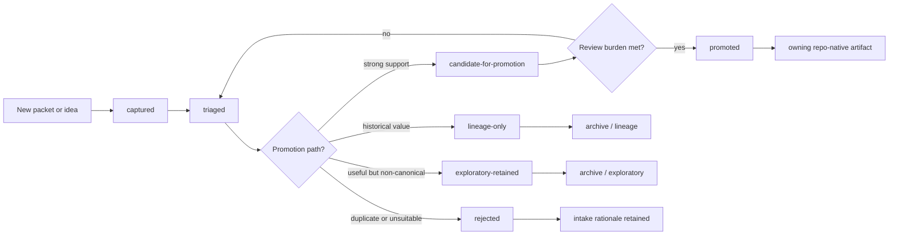

<!-- [KFM_META_BLOCK_V2]
doc_id: kfm://doc/NEEDS-VERIFICATION/new-ideas-register
title: New Ideas Register
type: standard
version: v0.1-proposed
status: draft
owners: OWNER_TBD
created: 2026-05-16
updated: 2026-05-16
policy_label: public
related: [docs/intake/README.md, docs/intake/canonicalization-policy.md, docs/intake/promotion-checklist.md, docs/archive/exploratory/new-ideas/README.md, docs/doctrine/authority-ladder.md, docs/doctrine/truth-posture.md]
tags: [kfm, intake, new-ideas, canonization, governance, documentation-control]
notes: [PROPOSED first version; verify against mounted repo before treating path, owners, related links, or register rows as current implementation.]
[/KFM_META_BLOCK_V2] -->

# New Ideas Register

A governed intake ledger for exploratory KFM idea packets so useful proposals stay visible without becoming accidental canon.

> [!IMPORTANT]
> **Status:** PROPOSED / NEEDS VERIFICATION  
> **Owner:** OWNER_TBD  
> **Path:** `docs/intake/new-ideas-register.md`  
> **Truth posture:** CONFIRMED doctrine / PROPOSED register structure / UNKNOWN repo implementation depth  
> **Rule:** packet pressure is not implementation proof.

## Quick jumps

- [Purpose](#purpose)
- [Scope](#scope)
- [What belongs here](#what-belongs-here)
- [What does not belong here](#what-does-not-belong-here)
- [Authority posture](#authority-posture)
- [Intake lifecycle](#intake-lifecycle)
- [Intake statuses](#intake-statuses)
- [Classification categories](#classification-categories)
- [Register schema](#register-schema)
- [Active register](#active-register)
- [Promotion criteria](#promotion-criteria)
- [Review burden](#review-burden)
- [Anti-sprawl rules](#anti-sprawl-rules)
- [Verification checklist](#verification-checklist)
- [Rollback](#rollback)
- [Appendix: entry template](#appendix-entry-template)

## Purpose

KFM has a large and useful stream of “New Ideas” packets, follow-up notes, implementation sketches, watcher proposals, artifact recipes, source-refresh ideas, UI concepts, and domain expansions.

This register gives those ideas a controlled entry point.

It does **not** make an idea canonical. It records:

1. what the idea is,
2. where it came from,
3. what class of work it might become,
4. what evidence threshold it must satisfy,
5. where it may belong if promoted,
6. why it remains exploratory, retained, promoted, rejected, or lineage-only.

## Scope

This document governs intake tracking for exploratory or packet-like material that may influence KFM doctrine, documentation, contracts, schemas, policy, tools, workflows, UI, domain lanes, release artifacts, or validation gates.

It is a register, not a source of domain truth.

## What belongs here

Use this register for:

- dated “New Ideas” packets;
- packet cousins that contain implementation or architecture proposals;
- source-refresh proposals that are not yet admitted as `SourceDescriptor` records;
- watcher, validator, policy, CI, or receipt recipes not yet implemented;
- MapLibre, PMTiles, COG, Focus Mode, Story Node, Evidence Drawer, or UI proposals not yet bound to released artifacts;
- domain-expansion sketches not yet accepted into a lane;
- repeated or corroborative proposals that need a backlink and deduplication state;
- older packet material that needs a visible disposition before archival.

## What does not belong here

Do **not** use this register as the canonical home for:

| Material | Correct home |
|---|---|
| Current doctrine | `docs/doctrine/` or accepted ADR |
| Architecture decisions | `docs/adr/` or `docs/architecture/` |
| Human-readable object meaning | `contracts/` |
| Machine-readable schema shape | `schemas/contracts/v1/` unless ADR says otherwise |
| Allow / deny / restrict / abstain logic | `policy/` |
| Test fixtures | `fixtures/` or `tests/` according to repo convention |
| Source descriptors | `data/registry/` or the accepted source registry home |
| Receipts and process memory | `data/receipts/` |
| Proof artifacts | `data/proofs/` |
| Release decisions | `release/` |
| Published public artifacts | `data/published/` or accepted release target |
| Runtime implementation | `apps/`, `packages/`, `runtime/`, `tools/`, `pipelines/`, or accepted owner root |

If a packet proposes one of those artifacts, this register tracks the proposal until the owning root accepts, rejects, or archives it.

## Authority posture

> [!NOTE]
> This document records intake state. It does not prove current repo implementation, source rights, workflow enforcement, policy execution, route behavior, release state, or deployment maturity.

Truth labels used here:

| Label | Meaning in this register |
|---|---|
| `CONFIRMED` | Verified from supplied Project evidence or mounted repo evidence. |
| `PROPOSED` | Recommended destination, shape, or next action not yet verified as implemented. |
| `UNKNOWN` | Not verified because repo files, tests, workflows, dashboards, logs, or emitted artifacts were not inspected. |
| `NEEDS VERIFICATION` | A specific check must happen before promotion or implementation. |
| `EXPLORATORY` | Idea inventory not yet promoted to doctrine, contract, schema, policy, or implementation. |
| `LINEAGE` | Historically useful source that preserves continuity but does not prove current implementation. |
| `CONFLICTED` | Placement, authority, terms, or evidence conflict is unresolved. |
| `REJECTED` | Not accepted for KFM use; rationale must remain visible. |

## Intake lifecycle



## Intake statuses

Use one primary status per row.

| Status | Meaning | Default home while active | Exit condition |
|---|---|---|---|
| `captured` | Idea recorded but not yet assessed. | This register. | Classification complete. |
| `triaged` | Category, destination candidate, duplication state, and evidence threshold assigned. | This register plus optional intake notes. | Promotion path chosen. |
| `candidate-for-promotion` | Strong enough to draft toward canon or implementation-facing artifact. | Destination draft plus backlink to this register. | Review burden met or sent back to triage. |
| `promoted` | Accepted into repo-native doctrine, contract, schema, policy, runbook, README, validator, workflow, release object, or domain doc. | Owning repo-native path. | Predecessor note linked and packet de-authorized. |
| `lineage-only` | Historically useful but not active as current proposal. | `docs/archive/lineage/` or accepted archive home. | None unless re-opened by review. |
| `exploratory-retained` | Useful but deliberately non-canonical. | `docs/archive/exploratory/` or accepted archive home. | Future re-triage. |
| `rejected` | Out of scope, duplicate, unsafe, unsupported, or incompatible. | This register with rationale. | None unless reopened by reviewer. |

Optional substatus fields may record `clustered`, `corroborated`, `duplicate`, `superseded`, or `blocked`, but those are not primary lifecycle states.

## Classification categories

Use one primary category and optional secondary tags.

| Category | Use when the idea proposes… | Default destination if promoted |
|---|---|---|
| `doctrine` | Whole-system law, terminology, authority, truth posture, trust membrane. | `docs/doctrine/` or ADR. |
| `source-refresh` | New source, endpoint, source cadence, source authority, rights posture. | `docs/sources/`, `data/registry/`, source descriptor review. |
| `schema-contract-proposal` | Object family, field shape, schema, fixture, validator, contract split. | `contracts/`, `schemas/contracts/v1/`, `fixtures/`, `tests/`. |
| `policy-gate-proposal` | Allow / deny / restrict / abstain logic, fail-closed gate, review threshold. | `policy/`, policy tests, validator docs. |
| `workflow-automation-proposal` | CI, watcher, receipt emission, ingest loop, promotion automation, tool flow. | `.github/`, `docs/runbooks/`, `tools/`, `pipelines/`. |
| `ui-shell-proposal` | Map shell, Evidence Drawer, Focus Mode, Story Node, review console, export surface. | `docs/architecture/`, `apps/`, `web/`, `ui/`, `packages/`. |
| `domain-expansion` | New or expanded hydrology, ecology, archaeology, roads, settlements, geology, agriculture, etc. | `docs/domains/` plus source descriptors and lane checklist. |
| `implementation-note` | Concrete repo or code guidance that is not yet verified. | Lane-local README, runbook, or owning implementation root. |
| `duplicate-corroborative` | Repetition of an existing idea. | Backlink only, then archive or merge note. |
| `lineage-superseded` | Older or superseded material that remains useful historically. | `docs/archive/lineage/`. |

## Register schema

Each row should carry enough information for a maintainer to decide whether to promote, archive, or reject the idea without rereading the whole packet.

| Field | Required | Meaning |
|---|---:|---|
| `packet_id` | yes | Stable register ID, usually `NI-YYYY-MM-DD-short-topic`. |
| `source_title` | yes | File title or packet name. |
| `source_date` | yes | Date on packet or date received; mark `NEEDS VERIFICATION` if unclear. |
| `source_class` | yes | `EXPLORATORY`, `LINEAGE`, `CORROBORATIVE`, `CONFIRMED doctrine`, etc. |
| `intake_status` | yes | One primary lifecycle status from [Intake statuses](#intake-statuses). |
| `category` | yes | Primary classification category. |
| `secondary_tags` | no | Optional tags such as `PMTiles`, `MAIAC`, `FIRMS`, `MapLibre`, `RunReceipt`. |
| `destination_candidate` | yes | Proposed owning path or artifact family; mark `PROPOSED` or `NEEDS VERIFICATION`. |
| `evidence_threshold` | yes | What must be true before promotion. |
| `owner` | yes | Reviewer or owner; use `OWNER_TBD` if unknown. |
| `next_action` | yes | Smallest next review or implementation step. |
| `last_reviewed` | yes | Date of last review, or `NEEDS VERIFICATION`. |
| `decision_note` | yes | Why this status is current. |

## Active register

> [!CAUTION]
> Starter rows below are intake seeds, not promotion decisions. Paths are `PROPOSED` until verified against the mounted repo, Directory Rules, and current ADRs.

| Packet ID | Source title | Source date | Source class | Intake status | Category | Destination candidate | Next action |
|---|---|---:|---|---|---|---|---|
| `NI-2026-05-08-ecology-watchers` | `New Ideas 5-8-26` | 2026-05-08 | `EXPLORATORY` | `captured` | `policy-gate-proposal` | `policy/ecology/tiles/v1.rego`; `tools/ci/probes/`; `docs/domains/ecology/gating-spec.md` — all `PROPOSED` | Verify source rights, cadence, thresholds, and fail-closed policy shape before drafting fixtures. |
| `NI-2026-05-10-pmtiles-attestation` | `New Ideas 5-10-26` | 2026-05-10 | `EXPLORATORY` | `captured` | `schema-contract-proposal` | `schemas/contracts/v1/...`; `tools/attest/`; `tools/validators/`; `.github/workflows/pmtiles-attestation.yml` — all `PROPOSED` | Convert sidecar concept into schema + valid/invalid fixture + validator plan after repo path inspection. |

### Register detail cards

#### `NI-2026-05-08-ecology-watchers`

| Field | Value |
|---|---|
| Primary category | `policy-gate-proposal` |
| Secondary tags | `MAIAC`, `FIRMS`, `SMAP`, `AirNow`, `Mesonet`, `DecisionEnvelope`, `RunReceipt`, `watcher` |
| Evidence threshold | Official source pages, source-rights review, no-network fixtures, policy tests, and negative cases for missing rights / stale data / missing ETag. |
| Promotion blocker | Source thresholds and rights cannot be treated as current until checked against official sources and KFM policy posture. |
| Decision note | Captured as a useful watcher and tile-gating proposal; remains exploratory until source authority, licensing, and validator behavior are verified. |

#### `NI-2026-05-10-pmtiles-attestation`

| Field | Value |
|---|---|
| Primary category | `schema-contract-proposal` |
| Secondary tags | `PMTiles`, `BLAKE3`, `Bao`, `DSSE`, `cosign`, `sidecar`, `TileArtifactManifest`, `RunReceipt` |
| Evidence threshold | Directory Rules placement check, schema-home check, tool license review, fixture pair, validator exit behavior, signature/proof verification plan. |
| Promotion blocker | Tooling, path homes, PMTiles sidecar schema home, and CI workflow names remain `NEEDS VERIFICATION`. |
| Decision note | Captured as a strong artifact-integrity proposal; do not promote until it is reduced from packet prose into a reviewed schema/validator/fixture bundle. |

## Promotion criteria

A packet may move out of `captured` or `triaged` only when all applicable conditions are satisfied.

| Gate | Required check | Outcome if missing |
|---|---|---|
| Classification | Primary category assigned. | Stay `captured`. |
| Destination | Owning responsibility root identified. | Stay `triaged`; mark `NEEDS VERIFICATION`. |
| Corroboration | Doctrine or repo evidence supports the proposal. | Keep `EXPLORATORY`. |
| Machine behavior | Contract/schema/policy/test consequence is named. | Do not promote to implementation-facing artifact. |
| Release behavior | Fail-closed gate and rollback consequence are named. | Do not promote to release-facing artifact. |
| Public surface | Evidence Drawer / citation / trust-visible state consequence is named. | Do not promote to UI-facing artifact. |
| Sensitivity and rights | Rights, sensitivity, source role, and access posture reviewed. | `DENY` or `ABSTAIN` for public use. |
| De-authorization | Source packet remains linked but no longer acts as authority. | Promotion incomplete. |

## Review burden

| Change class | Minimum review burden |
|---|---|
| Doctrine | Doctrine or architecture reviewer plus policy review. |
| Contract/schema | Contract/schema reviewer plus fixture and validator evidence. |
| Policy/gate | Policy reviewer plus negative-case proof. |
| Workflow/automation | Control-plane review plus rollback and receipt check. |
| UI/shell | Shell/product review plus trust-visible state review. |
| Domain expansion | Source/lane steward review plus source authority and sensitivity check. |
| Release/publication | Release reviewer plus proof, correction, and rollback checks. |

## Anti-sprawl rules

1. No packet is canonical by recency.
2. Duplicate packets count as corroboration pressure, not independent authority votes.
3. Implementation-looking paths in packets remain `PROPOSED` until Directory Rules and repo evidence verify them.
4. A packet that proposes machine behavior must name the contract/schema/policy/test consequence.
5. A packet that proposes public display must name the evidence, policy, citation, review, release, correction, and rollback consequence.
6. A packet that touches rights, sovereignty, culture, archaeology, rare species, living persons, DNA, land/title, security, or precise sensitive location defaults to `DENY` or `ABSTAIN` for public exposure until reviewed.
7. Promotion is a governed state transition, not a copy from packet prose into docs.
8. Archive retained packets with forward links so useful history stays findable without competing with current canon.

## Verification checklist

- [ ] Confirm `docs/intake/` exists in the mounted repo.
- [ ] Confirm this file does not duplicate an existing register.
- [ ] Confirm target owner and reviewer group.
- [ ] Confirm related docs exist or adjust links:
  - [ ] `README.md`
  - [ ] `canonicalization-policy.md`
  - [ ] `promotion-checklist.md`
  - [ ] `../doctrine/authority-ladder.md`
  - [ ] `../doctrine/truth-posture.md`
  - [ ] `../archive/exploratory/new-ideas/README.md`
- [ ] Confirm current ADR for schema home before promoting schema-related ideas.
- [ ] Confirm source registry home before promoting source-refresh ideas.
- [ ] Confirm policy and test roots before promoting policy-gate ideas.
- [ ] Confirm archive homes before moving packets to lineage or exploratory archive.
- [ ] Confirm no register row claims current implementation without repo evidence.
- [ ] Confirm rollback target for this documentation change.

## Rollback

Rollback is required if this register:

- weakens KFM truth labels;
- lets exploratory packets become canonical by convenience;
- creates a parallel schema, contract, policy, source, proof, receipt, release, or archive home;
- hides `UNKNOWN` implementation depth;
- breaks accepted Directory Rules;
- promotes sensitive or rights-uncertain content without review;
- invents current workflow, CI, validator, policy, source, or runtime behavior.

Rollback target: revert this file and restore prior intake links. If no prior file existed, remove `docs/intake/new-ideas-register.md` and remove backlinks added in the same PR.

## Appendix: entry template

Use this template when adding a new packet.

```markdown
### `NI-YYYY-MM-DD-short-topic`

| Field | Value |
|---|---|
| `packet_id` | `NI-YYYY-MM-DD-short-topic` |
| `source_title` | `SOURCE_TITLE` |
| `source_date` | `YYYY-MM-DD` or `NEEDS VERIFICATION` |
| `source_class` | `EXPLORATORY` |
| `intake_status` | `captured` |
| `category` | `CATEGORY_FROM_CONTROLLED_VOCABULARY` |
| `secondary_tags` | `TAG_1`, `TAG_2` |
| `destination_candidate` | `PROPOSED: path/or/object-family` |
| `evidence_threshold` | `What must be verified before promotion.` |
| `owner` | `OWNER_TBD` |
| `next_action` | `Smallest reviewable next step.` |
| `last_reviewed` | `YYYY-MM-DD` |
| `decision_note` | `Why this status is current.` |
```

[Back to top](#new-ideas-register)
