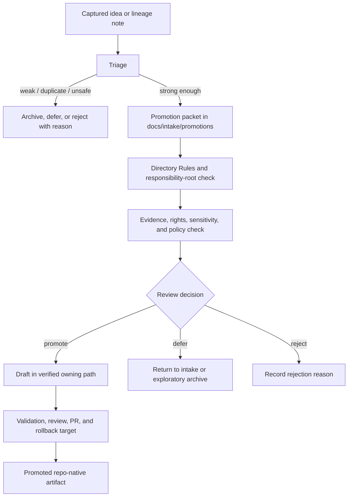

# Intake Promotions

Documentation intake lane for deciding whether captured KFM ideas, packets, drafts, and lineage notes are ready to move toward repo-native authority without bypassing evidence, policy, ownership, or rollback gates.

> [!IMPORTANT]
> **Status:** experimental / PROPOSED  
> **Owner:** OWNER_TBD — NEEDS VERIFICATION before this file is treated as maintained repo canon  
> **Path:** `docs/intake/promotions/README.md`  
> **Truth posture:** CONFIRMED doctrine / PROPOSED directory guidance / UNKNOWN repo implementation depth  
> **Last drafted:** 2026-05-16  
> **Badges:**   
>
> **Quick jumps:** [Scope](#scope) · [Repo fit](#repo-fit) · [Accepted inputs](#accepted-inputs) · [Exclusions](#exclusions) · [Promotion packet workflow](#promotion-packet-workflow) · [Review gates](#review-gates) · [Directory map](#directory-map) · [Maintenance checklist](#maintenance-checklist) · [Rollback](#rollback)

> [!NOTE]
> `docs/intake/promotions/` is a **documentation intake lane**. It does not publish data, approve releases, define schema authority, store proof packs, or replace KFM promotion / publication gates. Promotion remains a governed state transition, not a file move.

## Scope

This directory is for **human-reviewable promotion packets**: small Markdown records that explain why an intake item may be ready to become repo-native doctrine, architecture, ADR content, runbook guidance, source-registry material, contract language, schema work, policy work, validator work, or another governed artifact.

Use this lane when an idea is no longer just captured, but is not yet canon.

| Intake state | Meaning here | Typical next move |
|---|---|---|
| `triaged` | The idea has a category, likely destination, and duplication check. | Draft a promotion packet or defer. |
| `candidate-for-promotion` | Evidence and repo fit are strong enough to propose a target owning path. | Create a packet under this directory. |
| `promoted` | The change landed in its owning repo path after review. | Keep backlink / lineage note; do not keep this directory as the authority. |
| `lineage-only` | Historically useful, but not active canon. | Archive or backlink only. |
| `exploratory-retained` | Useful but not ready for canon. | Return to exploratory archive or intake queue. |
| `rejected` | Duplicate, unsafe, unsupported, or out of scope. | Record reason; do not silently delete. |

## Repo fit

| Field | Value |
|---|---|
| Owning root | `docs/` — documentation control plane and intake governance. |
| Proposed path | `docs/intake/promotions/README.md` |
| Upstream | `../README.md`, `../new-ideas-register.md`, `../triage-rules.md`, `../promotion-criteria.md`, source ledgers, lineage reports, current review notes — all **NEEDS VERIFICATION** in the mounted repo. |
| Downstream | The actual owning path after review: `docs/doctrine/`, `docs/architecture/`, `docs/runbooks/`, `docs/adr/`, `contracts/`, `schemas/contracts/v1/`, `policy/`, `tools/validators/`, `data/registry/`, `release/`, or another verified responsibility root. |
| Authority boundary | This directory can propose and document promotion rationale. It cannot by itself make a promoted artifact authoritative. |
| Repo evidence boundary | Current mounted repo implementation is **UNKNOWN** in this drafting session. Treat paths and adjacent links as `PROPOSED` until verified. |

## Accepted inputs

Put these here when they are documentation-sized and reviewable:

- Promotion packet Markdown for intake items that have passed initial triage.
- Evidence summaries tying a candidate to source documents, repo evidence, tests, or generated artifacts.
- Target-placement rationale using Directory Rules and responsibility-root logic.
- No-loss preservation notes for converting lineage material into current repo-native docs.
- Canonicalization notes showing how exploratory language becomes stable doctrine, ADR text, runbook text, contract text, schema work, policy work, or validator work.
- Review notes that explain why a candidate is promoted, deferred, rejected, superseded, or returned to intake.
- Backlinks to the original intake record, source ledger entry, or archive item.

### Minimum promotion packet contents

Every packet SHOULD include these fields or explain why they are unavailable:

```yaml
promotion_packet_id: SOURCE_ID_TBD
status: candidate-for-promotion
owner: OWNER_TBD
source_refs:
  - SOURCE_ID_TBD
target_owner_root: PATH_TBD_AFTER_REPO_INSPECTION
target_path: PATH_TBD_AFTER_REPO_INSPECTION
reason_for_promotion: NEEDS VERIFICATION: summarize evidence and repo fit
implementation_evidence: UNKNOWN: repo files/tests/workflows not yet inspected
rights_sensitivity_policy: NEEDS VERIFICATION: record applicable constraints
rollback_target: PATH_TBD_AFTER_REPO_INSPECTION
reviewers:
  - OWNER_TBD
```

## Exclusions

Do **not** put these in `docs/intake/promotions/`:

| Excluded material | Correct home or handling |
|---|---|
| Raw source payloads, scraped data, PDFs, source snapshots | `data/raw/`, `data/work/`, or archive/intake homes after source review — never this directory. |
| Machine schemas | `schemas/contracts/v1/<…>` or the repo-confirmed schema home. Do not create parallel authority. |
| Contract definitions | `contracts/` or the repo-confirmed contract home. |
| Rego rules, policy bundles, policy fixtures | `policy/` and policy test homes. |
| Run receipts, AI receipts, validation reports, proof packs | `data/receipts/`, `data/proofs/`, generated validation artifacts, or repo-confirmed evidence homes. |
| Release manifests, PromotionDecision records, rollback receipts | `release/`, `data/releases/`, or repo-confirmed release/proof homes. |
| Canonical doctrine after approval | Move to the verified owning doc path; leave only backlink / lineage note here. |
| Public map layers, PMTiles, GeoParquet, API snapshots, dashboards | Released artifact homes only after promotion gates pass. |
| Sensitive exact locations, living-person identifiers, DNA/genomic material, title-like assertions, cultural/archaeological details, or rights-uncertain source material | Fail closed: quarantine, generalize, redact, or deny publication until policy and stewardship are resolved. |

## Promotion packet workflow



The promotion packet is a **bridge**, not the destination. Once a candidate is accepted, the substantive change belongs in the verified owning root.

## Review gates

Promotion packets SHOULD fail closed when any gate cannot be satisfied.

| Gate | Required question | Failure handling |
|---|---|---|
| Source traceability | Can the candidate be traced to source material, repo evidence, or a documented review reason? | `ABSTAIN` or return to intake. |
| Directory placement | Does the target path match responsibility-root rules instead of topic convenience? | Mark `CONFLICTED / NEEDS VERIFICATION`; require ADR if root authority changes. |
| Authority collision | Would this create a parallel home for schemas, contracts, policy, sources, receipts, proofs, releases, or catalogs? | `DENY` until ADR or migration resolves the conflict. |
| Evidence basis | Does the packet distinguish CONFIRMED doctrine, LINEAGE, PROPOSED design, and UNKNOWN implementation depth? | Return for rewrite. |
| Rights and sensitivity | Are rights, source terms, sensitivity, sovereignty, living-person, cultural, ecological, archaeological, infrastructure, or title-like risks visible? | Quarantine, redact, generalize, or deny publication. |
| Validation impact | Are needed schemas, policies, fixtures, tests, validators, or docs-link checks named without claiming they exist? | Mark `NEEDS VERIFICATION`. |
| Rollback | Is there a reversible path if the promotion proves wrong? | Do not promote until rollback target exists. |
| Stewardship | Is the target owner or reviewer known? | Keep `OWNER_TBD`; do not mark active or stable. |

## Directory map

The following layout is **PROPOSED** until verified against the mounted repo and adjacent `docs/intake/` conventions.

```text
docs/intake/promotions/
├── README.md
├── candidates/                 # PROPOSED: active promotion packets under review
│   └── <slug>.promotion.md
├── accepted/                   # PROPOSED: packets whose substance moved to an owning path
│   └── <slug>.promotion.md
├── deferred/                   # PROPOSED: packets paused pending evidence, owner, or ADR
│   └── <slug>.promotion.md
└── rejected/                   # PROPOSED: rejected packets with rationale retained
    └── <slug>.promotion.md
```

Do not create the subdirectories above merely for tidiness. Create them when a real packet needs them or when the parent intake README confirms the convention.

## Packet naming

Use stable, reviewable names:

```text
<topic-or-source-family>.<short-purpose>.promotion.md
```

Examples, illustrative only:

```text
hydrology.huc12-crosswalk-validator.promotion.md
maplibre.pmtiles-sidecar-attestation.promotion.md
docs.authority-ladder-canonicalization.promotion.md
```

Avoid names that imply approval before review, such as `final.md`, `canonical.md`, `approved.md`, or `published.md`.

## Maintenance checklist

Before opening or merging a PR that adds or changes a promotion packet:

- [ ] Packet has a source reference or explicitly states why evidence is missing.
- [ ] Target owning root is verified or marked `PATH_TBD_AFTER_REPO_INSPECTION`.
- [ ] Candidate does not create parallel schema, contract, policy, source, registry, release, receipt, proof, or catalog authority.
- [ ] Rights, sensitivity, and public-release risks are visible.
- [ ] Any implementation claims are backed by repo evidence or marked `UNKNOWN` / `PROPOSED`.
- [ ] Related docs that should link here are identified as verified or `NEEDS VERIFICATION`.
- [ ] Rollback target or demotion path is recorded.
- [ ] Reviewer / steward is known or explicitly `OWNER_TBD`.
- [ ] Accepted packets leave a backlink from this intake lane to the owning artifact.
- [ ] Rejected packets preserve reason and source lineage instead of disappearing.

## Rollback

Rollback means restoring the governance boundary, not erasing history.

Use rollback when a promotion packet:

- points to the wrong responsibility root;
- creates duplicate authority;
- loses source lineage;
- hides rights, sensitivity, or stewardship uncertainty;
- claims implementation depth without evidence;
- weakens cite-or-abstain, policy gates, validation, review, or rollback posture.

Rollback actions:

1. Change the packet status to `deferred`, `lineage-only`, or `rejected` with a reason.
2. Remove or revert any draft created in the target owning path through a normal PR.
3. Preserve backlink and source lineage unless policy requires restricted handling.
4. Add a drift or contradiction entry when the rollback reveals a placement or authority conflict.
5. Re-run docs-link and validation checks once repo tooling is verified.

Rollback target: `ROLLBACK_TARGET_TBD_AFTER_REPO_INSPECTION`.

## Open verification items

- [ ] Confirm that `docs/intake/promotions/` is the intended repo path, not a conflicting sibling of an existing promotion-control surface.
- [ ] Confirm parent intake docs: `../README.md`, `../new-ideas-register.md`, `../triage-rules.md`, `../promotion-criteria.md`, and `../canonicalization-policy.md`.
- [ ] Confirm whether this repo expects KFM Meta Block v2 in directory READMEs or only in standard docs.
- [ ] Confirm owners / CODEOWNERS for documentation intake and promotion review.
- [ ] Confirm where release-level `PromotionDecision`, `PromotionReceipt`, and rollback objects live so this docs lane does not compete with them.
- [ ] Confirm docs-link-check, Markdown lint, and validation commands for this directory.

---

`docs/intake/promotions/` is the place to make promotion arguments inspectable. It is not the place to make promotion automatic.
